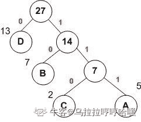
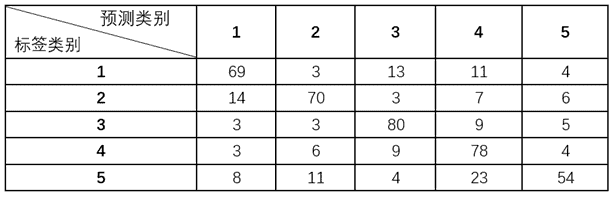
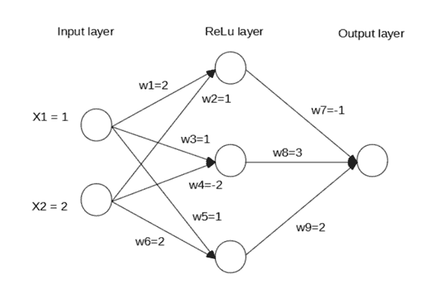
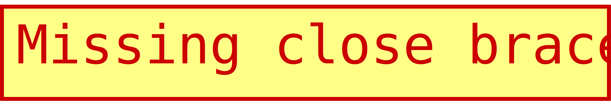
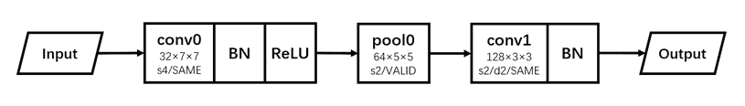
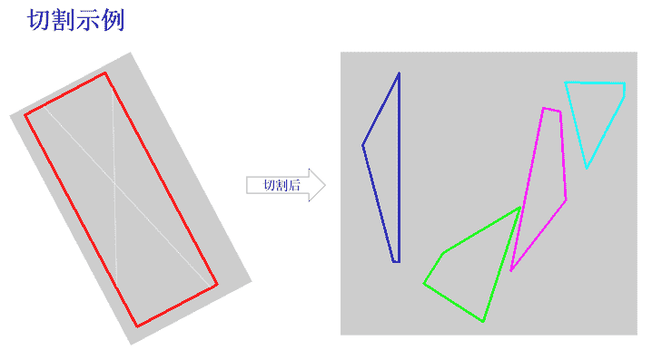
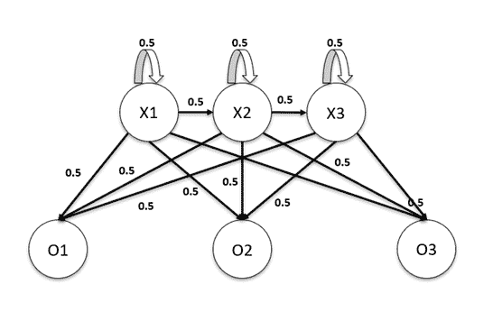
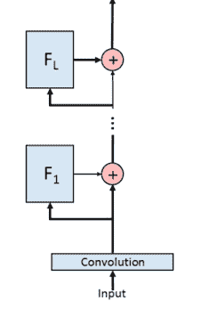
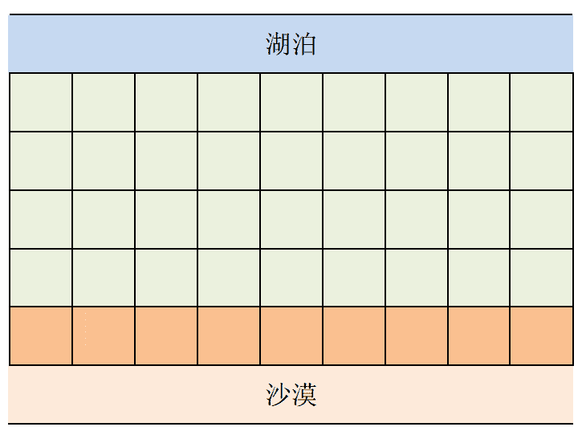

# 云从科技 2020 校招算法笔试题

## 1

已知由四个字符构造的哈夫曼编码树，哈夫曼编码依次为 0,10,110,111，那这四个字符可能的权重比例为()

正确答案: A   你的答案: 空 (错误)

```cpp
4:3:2:1
```

```cpp
4:3:3:2
```

```cpp
4:4:3:2
```

```cpp
4:3:2:3
```

本题知识点

算法工程师 云从科技 2020

讨论

[乌拉拉哼哼哈嘿](https://www.nowcoder.com/profile/7619425)

0,10,110,111 0：27-D10：27-14-B110：27-14-7-C111: 27-14-7-A

发表于 2020-02-17 15:39:19

* * *

[牛客 943846962 号](https://www.nowcoder.com/profile/943846962)

由编码的哈夫曼树可以看出字符权重 1>2>3>=4，只有 A 正确。

发表于 2020-02-17 00:06:26

* * *

## 2

下列不是哈希冲突的解决方法的选项是()

正确答案: C   你的答案: 空 (错误)

```cpp
开放定址法
```

```cpp
再哈希法
```

```cpp
分支限界法
```

```cpp
链地址法
```

本题知识点

算法工程师 云从科技 2020

## 3

找规律：5,10,26,65,170,_____：

正确答案: D   你的答案: 空 (错误)

```cpp
185
```

```cpp
290
```

```cpp
312
```

```cpp
442
```

本题知识点

算法工程师 云从科技 2020

讨论

[我大 E 了](https://www.nowcoder.com/profile/988791043)

5 = 2²+110 = 3²+126 = 5²+1 (5=3+2)65 = 8²+1 (5=5+3)170=13²+1 (13=8+5)所以 x = 21²+1 =442 选 D

发表于 2020-02-23 16:27:10

* * *

## 4

现需要从同一城市的 A、B 两条道路采集数据。若采集期间都是晴天，采集完 A 道路的数据需要 8 天，采集完 B 道路的数据需要 10 天；当阴天时采集，在 A 道路的采集效率下降 40%，在 B 道路的采集效率下降 20%。如果在两条道路同时开始采集，却能同一天采集完，则在 A 道路采集时的阴天天数为：

正确答案: C   你的答案: 空 (错误)

```cpp
2
```

```cpp
8
```

```cpp
10
```

```cpp
12
```

本题知识点

算法工程师 云从科技 2020

讨论

[paradox201812201004889](https://www.nowcoder.com/profile/45751187)

设耽搁天数为 x，耽搁量之差为 2 天：0.4x - 0.2x = 2，故 x = 10

发表于 2020-08-16 07:30:14

* * *

[小凡想去大厂搬砖](https://www.nowcoder.com/profile/402374026)

2/(0.4-0.2)=10

发表于 2020-05-28 10:41:14

* * *

## 5

我国婚姻法规定，禁止直系血亲和三代以内旁系血亲结婚。直系血亲是指和自己有直接血缘关系的亲属，三代以内旁系血亲是指与己身出自同一父母或同一祖父母、外祖父母，除直系血亲外的所有血亲。根据该定义，下列选项中的甲和乙可以结婚的是：

正确答案: D   你的答案: 空 (错误)

```cpp
张某是甲（女）的姨夫，乙是张某的儿子
```

```cpp
李某是乙（女）的姑父，甲是李某的儿子
```

```cpp
甲是林某与前夫的儿子，乙是林某与后夫的女儿
```

```cpp
王某是张某的舅舅，甲是王某的儿子，乙是张某的女儿
```

本题知识点

算法工程师 云从科技 2020

讨论

[小凡想去大厂搬砖](https://www.nowcoder.com/profile/402374026)

张某和他妈妈是一代血亲，他妈妈和他舅舅是一代血亲，他舅舅和他舅舅的儿子是一代血亲，最后张某和他女儿是一代血亲。一共四代。

发表于 2020-05-31 09:08:27

* * *

## 6

某实验室举办歌唱比赛，共有四位参赛者参加。赛后参赛者们预测比赛结果：

张同学说：“如果我能获奖，那么李同学也能获奖。”

李同学说：“如果我能获奖，那么刘同学也能获奖。”

刘同学说：“如果陈同学没获奖，那么我也不能获奖。”

比赛结果公布后，证明三位同学说的都对，并且四位同学中有三位获奖。那么没有获奖的同学是：

正确答案: A   你的答案: 空 (错误)

```cpp
张同学
```

```cpp
李同学
```

```cpp
刘同学
```

```cpp
陈同学
```

本题知识点

算法工程师 云从科技 2020

## 7

对于向量，和，向量间夹角记为，下列关系正确的是：

正确答案: B   你的答案: 空 (错误)

本题知识点

算法工程师 云从科技 2020

## 8

三个相同的盒子里各有两个球，其中一个盒子放了两个红球，一个盒子放了两个蓝球，一个盒子放了红球和蓝球各一个。随机选择一个盒子后从中随机摸出一个球是红球，另一个球也是红球的概率为：

正确答案: B   你的答案: 空 (错误)

本题知识点

算法工程师 云从科技 2020

讨论

[paradox201812201004889](https://www.nowcoder.com/profile/45751187)

将问题转化为取得一个红球，该红球是第 1 个盒子中某一个的概率为 1/2；第 3 个盒子中唯一红球的概率为 1/2 * 1/2；所以，再取一球为红球等价于上一个红球来源于第一个盒子，概率归一化，已取出红球来自于第一个盒子的概率为 2/3；

发表于 2020-08-16 07:47:58

* * *

[牛客 522832851 号](https://www.nowcoder.com/profile/522832851)

随机拿一个红球，另外一个也是红球的概率， 意思就是两个球都是红球，等价于从三个盒子里抽到都是红球的那个盒子，1/3

发表于 2021-09-08 23:42:55

* * *

[daicong](https://www.nowcoder.com/profile/535111832)

理解不来，有通俗的解释吗？

发表于 2021-04-10 13:13:03

* * *

## 9

[0、2、1、4、3、9、5、8、6、7]是以数组形式存储的最小堆，删除堆顶元素 0 后的结果是：

正确答案: C   你的答案: 空 (错误)

```cpp
[2、1、4、3、9、5、8、6、7]
```

```cpp
[1、2、5、4、3、9、8、6、7]
```

```cpp
[1、2、5、4、3、9、7、8、6]
```

```cpp
[2、3、1、4、7、9、5、8、6]
```

本题知识点

算法工程师 云从科技 2020

讨论

[还是搞开发吧](https://www.nowcoder.com/profile/7719222)

堆的删除，先将数组的最后一个元素覆盖当前数组的第一个元素。7 覆盖 0，然后再调整堆。

发表于 2020-05-06 21:10:08

* * *

## 20

机器学习中，下列方法可以用于解决过拟合问题的有：

正确答案: B C D   你的答案: 空 (错误)

```cpp
1x1 卷积
```

```cpp
Dropout
```

```cpp
全局 Average Pooling
```

```cpp
Early Stopping
```

本题知识点

算法工程师 云从科技 2020

讨论

[最后的微笑](https://www.nowcoder.com/profile/5202087)

[`zhuanlan.zhihu.com/p/46235425`](https://zhuanlan.zhihu.com/p/46235425)

发表于 2020-02-05 14:54:43

* * *

## 10

下列关于随机森林和 GBDT 的说法正确的是：

正确答案: B   你的答案: 空 (错误)

```cpp
都是一种 Boosting 方法
```

```cpp
组成随机森林的树可以分类树也可以是回归树，而 GBDT 只由回归树组成
```

```cpp
随机森林的训练属于属性扰动，不属于样本扰动
```

```cpp
随机森林对异常值敏感，而 GBDT 对异常值不敏感
```

本题知识点

算法工程师 云从科技 2020

讨论

[我大 E 了](https://www.nowcoder.com/profile/988791043)

GDBT 是 boosting 算法，随机森零是 Bagging 算法。GDBT 是样本扰动，随机森林是样本扰动和属性扰动。GDBT 对异常值敏感，随机森林对异常值不敏感。gbdt 无论用于分类还是回归一直都是使用的 CART 回归树。故选择 B。

编辑于 2020-02-23 22:13:38

* * *

## 11

Batch Normalization 使用的矩统计量，在训练和推理过程中，分别计算自：

正确答案: C   你的答案: 空 (错误)

```cpp
Batch 统计量；Batch 统计量
```

```cpp
滑动平均；Batch 统计量
```

```cpp
Batch 统计量；滑动平均
```

```cpp
滑动平均；滑动平均
```

本题知识点

算法工程师 云从科技 2020

## 12

Softmax 交叉熵损失函数中，对应任意类别的预测概率为，对应的输入为。当 ground truth(GT)类别为时，损失函数对任意非 GT 类别（）的输入的导数为：

正确答案: A   你的答案: 空 (错误)

本题知识点

算法工程师 云从科技 2020

## 13

以下关于深度学习优化器的说法正确的是：

正确答案: C   你的答案: 空 (错误)

```cpp
具有动量项的 SGD 在梯度改变方向时可以增加更新幅度，加速优化过程
```

```cpp
AdaGrad 可以自适应调整学习率，不依赖于手工设置的全局学习率
```

```cpp
具有 Nesterov 项的 SGD 可以在梯度有较大跳跃时，对其进行校正
```

```cpp
Adam 利用一阶和二阶梯度动态调整每个参数的学习率
```

本题知识点

算法工程师 云从科技 2020

讨论

[小凡想去大厂搬砖](https://www.nowcoder.com/profile/402374026)

A 选项，当梯度有所改变时，更新参数变慢。B 选项，仍然需要一个全局学习率。D 选项，一阶二阶求的是均值，方差，应该不是动态调整每个参数的学习率。

发表于 2020-06-01 08:56:56

* * *

## 21

以下代码时间复杂度为 O(1)。**注意**：答案中不要有**乘号**及**空格！**

```cpp

	int x = 1;

	for (int i = 0; i < N; i++)

	    for (int j = 1; j < R; j++)

	        x = x*j;

```

你的答案 (错误)

1 参考答案 (1) RN 或 NR

本题知识点

算法工程师 云从科技 2020

## 22

以下代码时间复杂度为 O(1)。**注意：**答案中不要有**乘号**及**空格！**

```cpp

	int x = 0;

	for (int i = 1; i <= N; i++)

	    for (int j = 1; j <= N+R; j += i)

	        x += j;

```

你的答案 (错误)

1 参考答案 (1) (N+R)log(N) 或 (R+N)log(N) 或 (N+R)logN 或 (R+N)logN

本题知识点

算法工程师 云从科技 2020

讨论

[零葬](https://www.nowcoder.com/profile/75718849)

调和级数的前 n 项和近似于 log(n)，因此复杂度为(N+R)*(1+1/2+1/3+...+1/N) = (N+R)*log(N)

发表于 2020-10-19 15:32:19

* * *

[我大 E 了](https://www.nowcoder.com/profile/988791043)

循环的运算次数为 m/1+m/2+...+m/N = m(1+1/2+...+1/N)近似于 m*log(N)，其中 m=(N+R)，所以时间复杂度为 O((N+R)*log(N))

发表于 2020-02-23 18:25:46

* * *

## 23

一个分类器在测试集上的混淆矩阵如下表所示，该分类器对类别 3 的召回率为 1%

你的答案 (错误)

1 参考答案 (1) 80

本题知识点

算法工程师 云从科技 2020

讨论

[还是搞开发吧](https://www.nowcoder.com/profile/7719222)

召回率：实际为正类并被预测为正类的个数 / 实际为正类的个数
80/(3+3+80+9+5)=0.8

发表于 2020-05-07 21:34:26

* * *

## 24

已知样本的属性和标签如下表所示，当某样本属性为(a2, b2, c2)时，采用朴素贝叶斯方法，非归一化的值为 1。**注意：答案用分数表示。**

| 属性 1 | 属性 2 | 属性 3 | 标签 |
| a2 | b1 | c3 | L2 |
| a1 | b1 | c2 | L3 |
| a1 | b1 | c1 | L1 |
| a3 | b3 | c1 | L3 |
| a1 | b3 | c2 | L3 |
| a3 | b1 | c3 | L1 |
| a2 | b2 | c1 | L3 |
| a1 | b2 | c1 | L3 |
| a2 | b3 | c3 | L3 |
| a2 | b2 | c3 | L1 |

你的答案 (错误)

1 参考答案 (1) 1/45

本题知识点

算法工程师 云从科技 2020

讨论

[我大 E 了](https://www.nowcoder.com/profile/988791043)

对于非归一化的朴素贝叶斯算法，P(L3|a2,b2,c2)=P(L3)*P(a2|L3)*P(b2|L3)*P(c2|L3)=(3/5)*(1/3)*(1/3)*(1/3)=1/45

发表于 2020-02-23 23:18:28

* * *

## 25

现有二维输入的多层神经网络如图所示。按照图中输入，此网络前向传播输出值为 1。

你的答案 (错误)

1 参考答案 (1) 6

本题知识点

算法工程师 云从科技 2020

讨论

[零葬](https://www.nowcoder.com/profile/75718849)

output = w7*relu(X1*w1+X2*w2) + w8*relu(X1*w3+X2*w4) + w9*relu(X1*w5+X2*w6)           = -1*relu(4) + 3*relu(-3) + 2*relu(5) = -1*4 + 3*0 + 2*5 = 6

发表于 2020-10-19 15:11:08

* * *

## 26

仍以该图输入，输出值 Ground Truth 为 3。使用最小二乘误差损失函数，学习率设为 0.1，经过一次 SGD 权值更新后，w1 的值为 1。

你的答案 (错误)

1 参考答案 (1) 2.6

本题知识点

算法工程师 云从科技 2020

讨论

[零葬](https://www.nowcoder.com/profile/75718849)

直接用链式法则的话，梯度传来传去还挺晕的，好在网络不深，直接复合函数求导吧令误差为：E = (y - relu(X1*w1)w7)² 则有误差相对于 w1 的梯度：g_w1 = dE/dw1 = 2(y - relu(X1*w1))*(-w7*relu'(X1*w1)*X1) = 2*(3-6)*(1*1*1) = -6       这里 relu 求导后为 1 得到更新后的误差：w1 = w1 - lr*g_w1 = 2 - 0.1*(-6)=2.6

发表于 2020-10-19 15:25:39

* * *

[我大 E 了](https://www.nowcoder.com/profile/988791043)

根据链式法则，计算参数 w1 偏导其中 a=w_1*x1，所以有因为激活函数为 Relu，所以 a'=relu(a)的导数为 1.接下来其中

综上，梯度更新，w1 = w1 - a*g_w1 = 2 - 0.1*(-6)=2.6

发表于 2020-02-24 01:50:16

* * *

## 27

尺寸为 224×224 的 RGB 图像，输入如图所示的卷积神经网络（每层标记：输出通道数×长×宽；s:stride; d:dilation），输出层感受野大小是 1。

你的答案 (错误)

1 参考答案 (1) 55

本题知识点

算法工程师 云从科技 2020

讨论

[我大 E 了](https://www.nowcoder.com/profile/988791043)

感受野计算的递推公式 RF(n) = RF(n-1) * stride + (dilation-1)*kernel_size + 1，其中 RF(0) = 1,即初始一个像素的感受野，感受野的计算是特征图尺寸计算的逆过程，因此，从输出开始开始计算，故有：RF(1) = (1-1)*2+2*(3-1)+1=5RF(2) = (5-1)*2+1*(5-1)+1=13RF(3) = (13-1)*4+1*(7-1)+1=55

编辑于 2020-02-23 23:47:14

* * *

## 28

对于对应类别的二分类 Softmax 函数 e^(x_i)/(e^(x_1)+e^(x_2))  ，为防止数值溢出，一般将该 Softmax 函数等价转换为1。**注意**：答案中不要有**空格！**

你的答案 (错误)

1 参考答案 (1) e^(x_i-max(x_1,x_2))/(e^(x_1-max(x_1,x_2))+e^(x_2-max(x_1,x_2)))

本题知识点

算法工程师 云从科技 2020

讨论

[零葬](https://www.nowcoder.com/profile/75718849)

将 e^x_i 除以 max(e^x_1, e^x_2)即可防止其溢出，即 e^(x_i - max(x_1, x_2))，而此时分母上的每个元素也得除以这个因子，因此转换后的 softmax 函数为 e^(x_i-max(x_1,x_2))/(e^(x_1-max(x_1,x_2))+e^(x_2-max(x_1,x_2)))

编辑于 2020-10-19 14:19:28

* * *

## 31

有四个四边形，已确定他们来源于一个矩形的切块，切块规则是：两根切割直线分别过矩形的两个对立边，把矩形切割成四块，并都满足以下前提条件：

（1）切割直线不会经过矩形顶点；

（2）切割直线与矩形边不垂直；

（3）两切割线不相互垂直；

（4）切割得到的四个边长度两两不等；切割示例如图所示：
由示例所示情况可以看到，**切割后得到的四边形会随机摆放到不同位置，并且可能会在平面内翻转或旋转任意角度**。

现在已知被切好的四个四边形各个顶点坐标，**求矩形的长和宽**

本题知识点

算法工程师 云从科技 2020

讨论

[牛客 202716937 号](https://www.nowcoder.com/profile/202716937)

这 TM 是数学题吧...

发表于 2021-07-30 17:38:33

* * *

[刘禅挥泪斩孔明](https://www.nowcoder.com/profile/1263929)

浮点数比较相等要确定精确度确实比较玄学，一开始精度设得很高，该判定相等的没判定相等，又设得很低，不该相等的判相等了，调成 0.1 终于过了。

发表于 2020-01-07 20:00:36

* * *

## 32

输入一个数组，输出最长升序子序列的长度。

本题知识点

算法工程师 云从科技 2020

讨论

[零葬](https://www.nowcoder.com/profile/75718849)

采用动态规划

```cpp
import java.io.BufferedReader;
import java.io.InputStreamReader;
import java.io.IOException;

public class Main {
    public static void main(String[] args) throws IOException {
        BufferedReader br = new BufferedReader(new InputStreamReader(System.in));
        String line;
        while((line = br.readLine()) != null){
            String[] strArr = line.split(",");
            int[] arr = new int[strArr.length];
            for(int i = 0; i < strArr.length; i++) arr[i] = Integer.parseInt(strArr[i].trim());
            System.out.println(solve(arr));
        }
    }

    private static int solve(int[] nums) {
        if(nums == null || nums.length == 0) return 0;
        int[] dp = new int[nums.length];   // dp[i]用于存储以 nums[i]结尾的最长上升子序列的最大长度
        dp[0] = 1;
        int maxLen = 1;
        for(int i = 0; i < nums.length; i ++){
            int maxSubLen = 0;
            for(int j = 0; j < i; j ++){
                if(nums[j] < nums[i])
                    maxSubLen = Math.max(maxSubLen, dp[j]);
            }
            dp[i] = maxSubLen + 1;
            maxLen = Math.max(maxLen, dp[i]);
        }
        return maxLen;
    }
}
```

发表于 2020-10-19 13:25:55

* * *

[查家大少爷](https://www.nowcoder.com/profile/856673642)

s=list(map(int, input().split(",")))
n=len(s)
dp=[1]#当前数字存在于序列中的最长递增子序列
dp1=[1]#
dp2=[s[0]]#从大到小排序的元素
for i in range(1,n):#二分法    x=s[i]
    low=0
    high=len(dp1)-1
    while low<=high:
        mid=int((low+high)/2)
        if x==dp2[mid]:
            dp.append(dp2[mid])
            break
        elif x<dp2[mid]:
            high=mid-1
        elif x>dp2[mid]:
            low=mid+1#插入新元素    if low>high:
        dp1.append(0)
        dp2.append(0)
        for k in range(len(dp1)-1,low,-1):
            dp1[k]=dp1[k-1]
            dp2[k]=dp2[k-1]
        acc=1
        if low!=0:
            acc=max(dp1[:low]) + 1
        dp.append(acc)
        dp1[low]=acc
        dp2[low]=x
print(max(dp))

编辑于 2020-09-01 22:06:31

* * *

[offer 已确定，还差个对象。](https://www.nowcoder.com/profile/992381860)

```cpp
#include <iostream>
#include <string>
#include <algorithm>

using namespace std;

#define INF_INT 0x7fffffff
/**
 * 最长递增子序列(复杂度 nlog(n))
 * @param a 序列
 * @param n 序列长度
 * @return 最长递增子序列长度
 */
int longest_increasing_subsequence_efficient(const int *a, int n) {
    auto *dp = new int[n];
    fill(dp, dp + n, INF_INT);
    for (int i = 0; i < n; i++) {
        *lower_bound(dp, dp + n, a[i]) = a[i];
    }
    int result = static_cast<int>(lower_bound(dp, dp + n, INF_INT) - dp);
    delete[] dp;
    return result;
}

int main() {
    int sequence[100000];
    int len = 0;
    string s;
    getline(cin, s);// 此题输入不规范，有些用例有空格，有些输入没有空格
    size_t pos = -1;//size_t 是非负类型，这里的-1 并不是-1，但是 pos+1 之后溢出，仍然是 0
    do {
        sequence[len++] = (int) strtol(s.c_str() + pos + 1, nullptr, 10);
    } while ((pos = s.find(',', pos + 1)) != string::npos);
    int ans = longest_increasing_subsequence_efficient(sequence, len);
    cout << ans << endl;
}
```

编辑于 2020-01-08 10:45:55

* * *

## 29

给定 HMM 模型如图所示，各转移概率已在图中标出。当观测序列为 O[1]O[2]O[3]时，隐含状态序列为 X[1]X[2]X[3]的概率为 1。**注意：**答案保留到小数点**后 5 位。** 

你的答案 (错误)

1 参考答案 (1) 0.03125

本题知识点

算法工程师 云从科技 2020

## 30

已知正方形 ABCD 的边长为 1，当时，的最小值为 1，最大值为 2。**注意 1：**答案中不要有**空格**或**乘号！****注意 2：**如有**平方根运算**，根号用**sqrt 函数**表示。

你的答案 (错误)

12 参考答案 (1) 0
(2) 2sqrt(5)

本题知识点

算法工程师 云从科技 2020

讨论

[零葬](https://www.nowcoder.com/profile/75718849)

lambda 的取值只能为-1 或 1，说明我们仅能决定是否调转每个向量的方向。（1）BD+AC 的方向与 BC 相同，|BD+AC| = 2|BC|，因此我们可以调转 BC 的方向，即 lambda2=-1，此时 AC+BD-BC+DA = 0，还剩下 AB+CD=0，两个向量的方向相反，长度相同，相互抵消。因此，最小模长可以取得 0。
（2）改变（1）中的情况，我们不调转 BC 的方向，而调转 DA 的方向，即 lambda4=-1，此时 AC+BD+BC-DA = 2(AC+BD)，|AC+BD+BC-DA|= 2|AC+BD| = 4|BC| = 4；再调转 CD 的方向，即 lambda3=-1，使得其与 AB 保持同向，则|AB-CD| = 2|AB| = 2，此时 AB+BC-CD-DA+AC+BD| = sqrt(4²+2²) = sqrt(20) = 2sqrt(5)，为最大模长。

发表于 2020-10-19 14:15:43

* * *

## 14


一个典型的残差网络结构如图所示，该网络由由个残差模块堆叠而成，第个残差模块可以按照以下关系将输入变换为：
记该网络所接的损失函数为：
为了便于理解残差网络，我们可以对以上损失函数进行递归的泰勒展开，那么当展开到第个 block 时，损失函数的表达式为：

正确答案: B   你的答案: 空 (错误)

```cpp
其余选项皆错
```

本题知识点

算法工程师 云从科技 2020

讨论

[零葬](https://www.nowcoder.com/profile/75718849)

泰勒展开式直接展开，忽略二次项

L(x + delta_x) = L(x) + L'(x)*delta_x + O(delta_x²)L(h[l]) = L(h[l-1] + F(h[l-1])) = L(h[l-1]) + L'(h[l-1])*F(h[l-1]) + O(F(h[l-1]) ²)，然后 L(h[l-1]) 可以继续展开，最终得到选项 B 的形式

发表于 2020-12-10 21:29:29

* * *

## 33

 如上图所示，在 N 行 M 列的矩形表示的区域范围内，其中每个格子都代表一座城市，每座城市都有一个海拔高度。现在要在某些城市建造蓄水厂和输水站以满足区域内居民饮水需求。蓄水厂的功能是利用水泵将湖泊中的水抽取到所在城市的蓄水池中。**只有与湖泊毗邻的第****1****行的城市可以建造蓄水厂**。输水站的功能则是通过输水管线利用高度落差，将湖水从高处向低处输送。**一座城市能建造输水站的前提，是存在比它海拔更高且拥有公共边的相邻城市，已经建有水利设施**。值得注意的是，该区域内第 N 行的城市毗邻沙漠，供水严重缺乏，**故方案中的每座城市都必须建有水利设施。**请问能否设计出满足以上需求的方案？如果能，请计算最少建造几个蓄水厂；如果不能，求干旱区中不可能建有水利设施的城市数目。

本题知识点

算法工程师 云从科技 2020

## 15

已知，，，则以下关系正确的是：

正确答案: B   你的答案: 空 (错误)

本题知识点

算法工程师 云从科技 2020

## 16

若满足，且，则的最大值为

正确答案: C   你的答案: 空 (错误)

```cpp
-7
```

```cpp
1
```

```cpp
5
```

```cpp
7
```

本题知识点

算法工程师 云从科技 2020

## 17

给定下列样本的标签和预测值，则以下(A,B,C)三分类预测的 micro F1 score 和 macro F1 score 分别为：

| 样本编号  | 1 | 2 | 3 | 4 | 5 | 6 | 7 | 8 | 9 |
| 样本标签  | A | A | A | B | B | B | B | C | C |
| 样本预测    | A | A | B | C | B | B | C | C | C |

正确答案: C   你的答案: 空 (错误)

```cpp
2/3，4/7
```

```cpp
214/315，2/3
```

```cpp
2/3，214/315
```

```cpp
4/7，2/3
```

本题知识点

算法工程师 云从科技 2020

讨论

[方北归途](https://www.nowcoder.com/profile/799893946)

A: TP = 2  FP = 0  FN = 1  Precision = 1     Recall = 2/3   F1 = 4/5；B: TP = 2  FP = 1  FN = 2  Precision = 2/3  Recall = 1/2   F1 = 4/7;C: TP = 2  FP = 2  FN = 0  Precision = 1/2  Recall = 1      F1 = 2/3;macro-F1 = (4/5 + 4/7 + 2/3) / 3 = 214 / 315 micro-Precision = (2 + 2 + 2) / (2 + 2 + 2 + 1 + 2) = 2/3micro-Recall = (2 + 2 + 2) / (2 + 2 + 2 + 1 + 2) = 2/3micro-F1 = 2/(3/2 + 3/2) = 2/3 宏观微观弄混了就没办法了，比如说我

发表于 2020-07-30 18:38:19

* * *

## 18

假如我们使用 Lasso 回归来拟合数据集，该数据集输入特征有 100 个(X1，X2，...，X100)。现在，我们把其中一个特征值扩大 10 倍（例如特征 X1），然后用相同的正则化参数对 Lasso 回归进行修正。那么，下列说法正确的是：

正确答案: A   你的答案: 空 (错误)

```cpp
特征 X1 很可能还包含在模型之中
```

```cpp
特征 X1 很可能被排除在模型之外
```

```cpp
无法确定特征 X1 是否被舍弃
```

```cpp
其他说法都不对
```

本题知识点

算法工程师 云从科技 2020

讨论

[食堂在逃干饭王](https://www.nowcoder.com/profile/5786634)

Lasso 对模型中的“权重”做了 L1 约束，而当特征值扩大 10 倍后，其对应的权重为了拟合会减小 10 倍（不考虑多重共线性），因而其权重会减小但不为 0，因此很可能该特征还保留在模型中。

发表于 2021-01-02 16:20:42

* * *

[最后的微笑](https://www.nowcoder.com/profile/5202087)

[`zhuanlan.zhihu.com/p/39631569`](https://zhuanlan.zhihu.com/p/39631569)

发表于 2020-02-05 14:53:50

* * *

## 19

下列关于 Bootstrap 采样说法正确的是

正确答案: C   你的答案: 空 (错误)

```cpp
从总的 M 个特征中，有放回地抽取 m 个特征（m < M）
```

```cpp
从总的 M 个特征中，无放回地抽取 m 个特征（m < M）
```

```cpp
从总的 N 个样本中，有放回地抽取 n 个样本（n < N）
```

```cpp
从总的 N 个样本中，无放回地抽取 n 个样本（n < N）
```

本题知识点

算法工程师 云从科技 2020