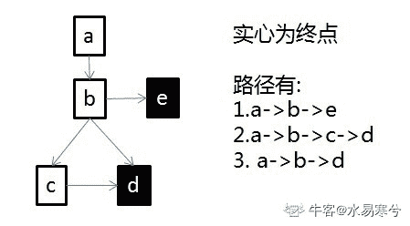
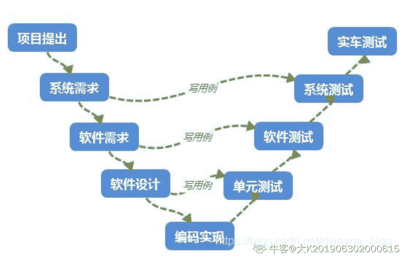
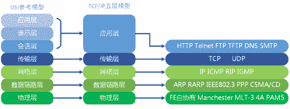
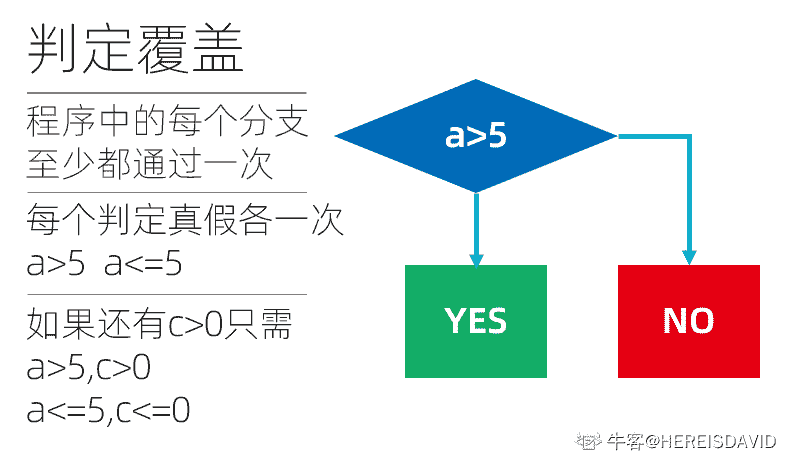
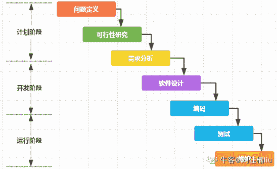

# 云从科技 2020 校招软件测试笔试题

## 1

下列哪个不是软件测试的目标

正确答案: C   你的答案: 空 (错误)

```cpp
发现缺陷
```

```cpp
增加对质量的信心
```

```cpp
对开发人员考核
```

```cpp
为决策者提供信息
```

本题知识点

算法工程师 云从科技 测试工程师 2020

讨论

[LinXiaoling](https://www.nowcoder.com/profile/756512478)

软件测试主要为了提高产品质量，与考核开发人员无关

发表于 2020-05-29 15:04:06

* * *

[higirl2020](https://www.nowcoder.com/profile/376457331)

C

发表于 2020-03-16 08:51:52

* * *

## 2

不属于单元测试内容的是

正确答案: D   你的答案: 空 (错误)

```cpp
模块接口测试
```

```cpp
局部数据结构测试
```

```cpp
路径测试
```

```cpp
用户页面测试
```

本题知识点

算法工程师 云从科技 测试工程师 2020

讨论

[加油-加油鸭](https://www.nowcoder.com/profile/254108402)

单元测试，处于软件测试初期阶段，任务主要包括：模块接口测试、模块局部数据结构测试、模块中所有独立执行通路测试、模块的各条错误处理通路测试、模块边界条件测试。

发表于 2020-02-02 21:04:45

* * *

## 3

下列哪个工具不是 linux 环境常见的性能指标监控工具

正确答案: B   你的答案: 空 (错误)

```cpp
top
```

```cpp
performance
```

```cpp
vmstat
```

```cpp
perf
```

本题知识点

算法工程师 云从科技 测试工程师 2020

讨论

[201903042306766](https://www.nowcoder.com/profile/322416026)

perfmon 是 Windows 性能监控工具

发表于 2020-08-14 22:00:01

* * *

[牛客 146800203 号](https://www.nowcoder.com/profile/146800203)

b 是 Windows 的性能监控工具

发表于 2020-06-21 09:43:17

* * *

## 4

关于采用探索性测试的原因，下面哪个论述是最合适的？

正确答案: A   你的答案: 空 (错误)

```cpp
探索性测试可以发现一些正式测试中遗漏的缺陷
```

```cpp
探索性测试不需要花费工作量进行准备工作
```

```cpp
探索性测试在时间充裕的时候是最适合的
```

```cpp
探索性测试依赖于开发人员在被测对象知识和业务方面的支持
```

本题知识点

算法工程师 云从科技 测试工程师 2020

讨论

[牛客 990167708 号](https://www.nowcoder.com/profile/990167708)

这题应该是多选题，时间充裕的情况下才最适合探索者测试又称自由测试。

发表于 2021-06-04 08:06:46

* * *

## 5

用边界值分析法，假定 X 为整数，10≤X≤100，那么 X 在测试中应该取（  ）边界值

正确答案: B   你的答案: 空 (错误)

```cpp
X=10，X=100
```

```cpp
X=9，X=10，X=100，X=101
```

```cpp
X=10，X=11，X=99，X=100
```

```cpp
X=9，X=10，X=50，X=100
```

本题知识点

算法工程师 云从科技 测试工程师 2020

讨论

[Hhox](https://www.nowcoder.com/profile/574525618)

边界值取值，分别取上点和离点。 上点即为边界点，分别为 10，100 离点为边界左右的点，>或=取边界外，故本体取 9，101

发表于 2020-04-17 07:40:39

* * *

## 6

测试 ATM 取款功能，已知取款数只能输入正整数，每次取款数要求是 100 的倍数且不能大于 500，下面哪个是正确的无效等价类

正确答案: C   你的答案: 空 (错误)

```cpp
（0，100）、（100，200）、（200，300）、（300，400）、（400，500）、（500，+∞）
```

```cpp
（500，+∞）
```

```cpp
（500，+∞）、任意大于 0 小于 500 的非 100 倍数的整数
```

```cpp
（-∞，100）、（100，200）、（200，300）、（300，400）、（400，500）、（500，+∞）
```

本题知识点

算法工程师 云从科技 测试工程师 2020

讨论

[HEREISDAVID](https://www.nowcoder.com/profile/864672146)

设定上只能正整数，大概就是 ATM 的键盘上直接没有负号和小数点，所以这种就直接不成立了，就算不上什么无效等价类了

发表于 2020-09-27 18:24:38

* * *

[Kyrieving](https://www.nowcoder.com/profile/574618782)

A 和 C 有什么区别

发表于 2020-08-16 12:01:24

* * *

## 7

下面有关系统并发访问数估算数据那个最有效

正确答案: A   你的答案: 空 (错误)

```cpp
高峰时段平均每秒请求数 80
```

```cpp
同时在线用户数 100
```

```cpp
高峰时段日处理业务量 100000
```

```cpp
平均每秒用户请求数 50
```

本题知识点

算法工程师 云从科技 测试工程师 2020

讨论

[牛客 289709741 号](https://www.nowcoder.com/profile/289709741)

为最大在线用户数的 0.08-0.12

发表于 2021-07-16 18:49:52

* * *

[晓晓会找到好工作的](https://www.nowcoder.com/profile/213803012)

求赐教

发表于 2020-09-09 20:18:32

* * *

[Kyrieving](https://www.nowcoder.com/profile/574618782)

求解

发表于 2020-08-16 12:09:12

* * *

## 8

关于进程的叙述哪一项是不正确的

正确答案: A   你的答案: 空 (错误)

```cpp
可同时执行的进程是指若干进程同时占用处理器
```

```cpp
一个进程的工作没有完成之前，另一进程就可开始工作，则称这些进程具有并发性
```

```cpp
一个进程独占处理器时其执行结果只取决于进程本身
```

```cpp
进程并发执行时其执行结果与进程执行的相对速度有关
```

本题知识点

算法工程师 云从科技 测试工程师 2020

讨论

[刘佳楠 liu](https://www.nowcoder.com/profile/277909699)

并发是指多个进程在时间上同时运行，宏观上，在用户看来，各进程是同时运行的，但微观上，各进程之间对处理器是交替使用的，因此，所谓进程的并发性是指宏观上同时运行的进程在执行时间上是重叠的。

发表于 2020-02-19 13:39:39

* * *

## 9

以下循环执行（）次 public class Test{
    public static void main(String[] args){
        int  x=-10,k=0;
        while(++x<0){
            k++;
        }
        System.out.println(k);
    }
} 

正确答案: A   你的答案: 空 (错误)

```cpp
9
```

```cpp
10
```

```cpp
11
```

```cpp
无限
```

本题知识点

算法工程师 云从科技 测试工程师 2020

讨论

[可乐星](https://www.nowcoder.com/profile/938722766)

首先，我们要知道 x++和++x 的区别

x++是先用 x 的值再+1

++x 是先+1 再用 x 的值

题目里

```cpp
public class Test{
    public static void main(String[] args){
        int  x=-10,k=0;
        while(++x<0){
            k++;
        }
        System.out.println(k);
    }
}
```

每次在 while 循环判断的地方，x 的取值是-9 到-1,在 while 循环里 x 的取值是-9 到-1，所以执行了 9 次
如果 while 循环判断的地方是 x++的话

```cpp
public class Test{
    public static void main(String[] args){
        int  x=-10,k=0;
        while(x++<0){
            k++;
        }
        System.out.println(k);
    }
}
```

那么 x 在 while 循环判断的地方每次取值是-10 到-1，在 while 循环里 x 的取值是-9 到-1。
为什么会有如此的差距呢，细品前三行，如果还没将清楚可以在 while 循环里加上 System.out.println(x)跑一下就懂了。

发表于 2020-10-21 19:32:49

* * *

[牛客 235707963 号](https://www.nowcoder.com/profile/235707963)

给我的感觉是，当 x=-1 的时候，++x 等于零，又因为是 while 循环，当括号里符合条件的时候，才会执行语句，所以，从-10 到-2，共输出 9 次

发表于 2020-05-09 23:29:20

* * *

## 10

在划分了等价类后，首先需要设计一个案例覆盖（）有效等价类

正确答案: B   你的答案: 空 (错误)

```cpp
等价类数量-1 个
```

```cpp
尽可能多的
```

```cpp
等价类数量个
```

```cpp
1 个
```

本题知识点

算法工程师 云从科技 测试工程师 2020

讨论

[想跃龙门的鱼摆摆](https://www.nowcoder.com/profile/653460181)

尽可能多的

发表于 2020-10-15 11:35:23

* * *

## 11

压力测试属于（  ）阶段

正确答案: A   你的答案: 空 (错误)

```cpp
系统测试
```

```cpp
集成测试
```

```cpp
用户验收测试
```

```cpp
单元测试
```

本题知识点

算法工程师 云从科技 测试工程师 2020

讨论

[山城棒棒军](https://www.nowcoder.com/profile/750651702)

观察法

发表于 2020-10-12 18:05:34

* * *

## 12

“均匀分散、齐整可比”这个描述与哪种测试方法一般知识有关

正确答案: A   你的答案: 空 (错误)

```cpp
正交法
```

```cpp
决策表
```

```cpp
因果图
```

```cpp
等价类分析法
```

本题知识点

算法工程师 云从科技 测试工程师 2020

## 13

以下状态迁移图（中括号表示状态，箭头表示边）：

[a]->[b],[b]->[c],[b]->[d],[c]->[d],[b]->[e]

则覆盖所有边至少需要（）个案例

正确答案: A   你的答案: 空 (错误)

```cpp
3
```

```cpp
2
```

```cpp
4
```

```cpp
1
```

本题知识点

算法工程师 云从科技 测试工程师 2020

讨论

[水易寒兮](https://www.nowcoder.com/profile/2589792)

**画图啊！**

编辑于 2020-08-25 15:05:20

* * *

[刘佳楠 liu](https://www.nowcoder.com/profile/277909699)

a->b->c->ea->b->da->b->e 三条案例走下来，才能完全覆盖所有的分支；是这样吗？

发表于 2020-02-19 13:47:23

* * *

[王弱鸡](https://www.nowcoder.com/profile/6128641)

这个我真不是很理解

发表于 2020-01-13 08:05:51

* * *

## 14

操作系统具有进程管理、存储管理、文件管理和设备管理的功能，在以下有关的描述中，哪一个是不正确的

正确答案: C   你的答案: 空 (错误)

```cpp
存储管理主要是管理内存资源
```

```cpp
文件管理可以有效地支持对文件的操作，解决文件共享、保密和保护问题
```

```cpp
进程管理主要是对程序进行管理
```

```cpp
设备管理是指计算机系统中除了 CPU 和内存以外的所有输入、输出设备的管理
```

本题知识点

算法工程师 云从科技 测试工程师 2020

讨论

[bride](https://www.nowcoder.com/profile/894413802)

进程管理主要是对处理机进行管理

发表于 2020-03-04 22:26:27

* * *

## 15

下面（  ）是有效明确的功能需求

正确答案: B   你的答案: 空 (错误)

```cpp
两年内存储数据量不超过 100G
```

```cpp
登录后显示公告栏
```

```cpp
界面美观大方
```

```cpp
长时间操作后提醒用户休息
```

本题知识点

算法工程师 云从科技 测试工程师 2020

讨论

[Hhox](https://www.nowcoder.com/profile/574525618)

个人觉得 A,B 都挺明确的，有谁解释下为什么 A 不行吗

发表于 2020-04-17 07:45:58

* * *

## 16

可靠性测试属于（  ）阶段

正确答案: B   你的答案: 空 (错误)

```cpp
用户验收测试
```

```cpp
系统测试
```

```cpp
集成测试
```

```cpp
单元测试
```

本题知识点

算法工程师 云从科技 测试工程师 2020

讨论

[牛客 597327635 号](https://www.nowcoder.com/profile/597327635)

选 a 为什么错了

发表于 2020-04-02 10:12:15

* * *

## 17

系统测试阶段的测试对象不包括

正确答案: B   你的答案: 空 (错误)

```cpp
硬件系统
```

```cpp
源程序
```

```cpp
软件系统
```

```cpp
文档
```

本题知识点

算法工程师 云从科技 测试工程师 2020

讨论

[牛客 707566555 号](https://www.nowcoder.com/profile/707566555)

软件➕硬件相当于测试环境，文档是相应的需求，源程序是代码，代码属于白盒测试

发表于 2020-05-28 00:13:40

* * *

## 18

使用瀑布模型术语，在软件测试 V 模型中，对应“需求分析”的测试阶段是

正确答案: A   你的答案: 空 (错误)

```cpp
系统测试
```

```cpp
集成测试
```

```cpp
用户验收测试
```

```cpp
单元测试
```

本题知识点

算法工程师 云从科技 测试工程师 2020

讨论

[牛客 310596034 号](https://www.nowcoder.com/profile/310596034)

选系统测试

瀑布模型术语：项目计划、需求分析、软件设计、程序开发

对应 V 模型里的：验收测试、系统测试、集成测试、单元测试

所以选系统测试（品，你细品）

发表于 2020-01-15 22:57:13

* * *

[钟无艳 yen](https://www.nowcoder.com/profile/616739762)

从左往右看，一一对应：用户需求——需求分析——概要设计——详细设计                                                                                —— 开发编码验收测试——系统测试——集成测试——单元测试

发表于 2020-06-23 11:06:03

* * *

[大 K201906302000615](https://www.nowcoder.com/profile/469475677)



发表于 2021-03-29 16:30:20

* * *

## 19

测试系统长时间运行的表现，以期发现一些资源泄露等问题。这种测试类型一般是

正确答案: D   你的答案: 空 (错误)

```cpp
强度测试
```

```cpp
基准测试
```

```cpp
负载测试
```

```cpp
稳定性测试
```

本题知识点

算法工程师 云从科技 测试工程师 2020

讨论

[牛客 886541541 号](https://www.nowcoder.com/profile/886541541)

时间长叫稳定性，带负荷大的叫性能

发表于 2020-03-23 20:04:26

* * *

## 20

软件测试方法一般知识中，（）称为功能测试，（）测试称为结构测试

正确答案: D   你的答案: 空 (错误)

```cpp
灰盒测试，白盒测试
```

```cpp
白盒测试，黑盒测试
```

```cpp
黑盒测试，灰盒测试
```

```cpp
黑盒测试，白盒测试
```

本题知识点

算法工程师 云从科技 测试工程师 2020

讨论

[这不算偶然](https://www.nowcoder.com/profile/447540039)

说实话这个题目我认为有错，功能测试是测试的方向划分，黑盒测试白盒测试是测试的逻辑方法划分！可以这样理解，功能测试采用黑盒测试方法，而黑盒测试方法又有等价类，场景法，边界值等等！

发表于 2020-07-31 02:48:36

* * *

[牛客 525894928 号](https://www.nowcoder.com/profile/525894928)

D

发表于 2020-01-08 22:08:21

* * *

## 21

以下有哪几种应用的是人脸识别 1:N 模式

正确答案: B C   你的答案: 空 (错误)

```cpp
火车通道验票
```

```cpp
公司门禁
```

```cpp
公安布控
```

```cpp
银行人证身份核验
```

本题知识点

算法工程师 云从科技 测试工程师 2020

讨论

[offer 快来鸭哦](https://www.nowcoder.com/profile/507257088)

人脸识别的 1:1 模式

证明你就是你人脸识别的 1：N 模式 找出来“我是谁”

发表于 2020-09-03 13:45:15

* * *

[hcuwbksbqjvgebaushqje](https://www.nowcoder.com/profile/726220119)

指路：[`blog.csdn.net/qq805934132/article/details/82900282`](https://blog.csdn.net/qq805934132/article/details/82900282)

发表于 2020-03-07 00:20:00

* * *

[可乐星](https://www.nowcoder.com/profile/938722766)

人脸识别 1：1 是静态的，人手持身份证的，然后机器比对是不是你，比如乘坐高铁验票，乘客需手持有效身份证件通过时，人脸识别检票系统会将乘客人脸图像与身份证照片进行比对，这就是典型 1：1 模型的人脸识别，此外常见的 1：1 模型应用还有景区验票、酒店入驻、刷脸支付、刷脸解锁等等。1：N 是动态的，N 是先前把资料存入海量数据库在比对你是谁。 *   ```cpp
    火车通道验票 （这个要手持票验证）

    ```

*   ```cpp
    公司门禁（这个与海量数据库做验证）
    ```

*   ```cpp
    公安布控 (这个与海量数据库做验证)
    ```

*   ```cpp
    银行人证身份核验（这个需要你配合持卡）
    ``` 

发表于 2020-10-21 20:13:42

* * *

## 22

TCP 和 IP 分别对应了 OSI 中的哪几层

正确答案: C D   你的答案: 空 (错误)

```cpp
Application layer
```

```cpp
Presentation layer
```

```cpp
Transport layer
```

```cpp
Network layer
```

本题知识点

算法工程师 云从科技 测试工程师 2020

讨论

[钟无艳 yen](https://www.nowcoder.com/profile/616739762)

见图：

发表于 2020-06-23 11:07:59

* * *

[hcuwbksbqjvgebaushqje](https://www.nowcoder.com/profile/726220119)

tcp 在传输层，IP 在网络层

发表于 2020-03-07 00:21:17

* * *

## 23

如何减少换页错误

正确答案: B C   你的答案: 空 (错误)

```cpp
进程倾向于占用 CPU
```

```cpp
访问局部性(locality of reference)满足进程要求
```

```cpp
进程倾向于占用 I/O
```

```cpp
使用基于最短剩余时间(shortest remaining time)的调度机制
```

本题知识点

算法工程师 云从科技 测试工程师 2020

讨论

[风的来信](https://www.nowcoder.com/profile/844997145)

 换页错误，一般称为缺页异常。每个进程都有一段自己的独立的虚拟内存空间（在 32 位的 linux 系统中为 3G），但是这些虚拟内存区域并不会在创建的时候就和物理页框挂钩，由于程序的局部性原理，程序在一定时间内所访问的内存往往是有限的，因此内核只会在进程确确实实需要访问物理内存时才会将相应的虚拟内存区域与物理内存进行关联(为相应的地址分配页表项，并将页表项映射到物理内存)当一个程序试图访问没有映射到物理内存的地方时，就会出现缺页异常，这时操作系统要做的是要将这段虚拟内存映射到物理内存上，使其真正“可用”。

减少换页错误的方法，即降低缺页中断率：
1、内存页框数。增加作业分得的内存块数。
2、页面大小。页面划分越大，中断率越低。
3、页面零星换算法。替换算法的优劣影响缺页中断次数
4、程序局部性。程序局部性好可减少缺页中断。

发表于 2020-03-16 21:36:16

* * *

[牛客 808229612 号](https://www.nowcoder.com/profile/808229612)

我说一下自己对于 A 和 C 的想法。 A 为什么错？ 如果进程一直占用 CPU，也不能说明它不需要读取内存的数据，所以这样的进程并不一定导致缺页率下降。 C 为什么对？ 我也不知道啊 进程偏向于 io，也就是从磁盘读取数据，但这也不一样需要，将磁盘数据读进内存吗，再读进 CPU 吗？

发表于 2021-10-07 11:10:39

* * *

## 24

以测试的形态分测试可以分为

正确答案: A B C   你的答案: 空 (错误)

```cpp
建构性测试
```

```cpp
系统测试
```

```cpp
专项测试
```

```cpp
单元测试
```

本题知识点

算法工程师 云从科技 测试工程师 2020

讨论

[HEREISDAVID](https://www.nowcoder.com/profile/864672146)

没见过这玩意......以下来源网络......

> 以测试形态分类的话，可以分为建构性测试，系统测试，及专项测试这三大项。**建构性测试**属于前置性的测试，它主要偏重与程序端的功能测试，以确保程序运行正常。**系统测试**是属于中后期的集成测试，所进行的测试以使用者的观点为主，也就是以防外界使用者会如何使用产品。**专项测试**指的是所进行的测试需要额外的人力及资源来进行的测试活动

编辑于 2020-09-27 19:21:34

* * *

[s111223](https://www.nowcoder.com/profile/555122418)

以测试形态分类的话，可以分为建构性测试，系统测试，及专项测试这三大项

发表于 2020-02-21 11:26:01

* * *

## 25

选出属于黑盒测试方法的选项

正确答案: A B C   你的答案: 空 (错误)

```cpp
测试用例覆盖
```

```cpp
输入覆盖
```

```cpp
输出覆盖
```

```cpp
分支覆盖
```

本题知识点

算法工程师 云从科技 测试工程师 2020

讨论

[HEREISDAVID](https://www.nowcoder.com/profile/864672146)

只有分支覆盖是白盒里的判定覆盖，即：程序里每个分支都通过一次
其他的”覆盖“不过是混淆视听的

编辑于 2020-09-27 19:25:45

* * *

[牛客 958119452 号](https://www.nowcoder.com/profile/958119452)

？？？这不都是白盒里的嘛？？？

发表于 2020-06-06 14:34:20

* * *

## 26

典型的瀑布模型的阶段是

正确答案: A B C D   你的答案: 空 (错误)

```cpp
分析
```

```cpp
设计
```

```cpp
编码
```

```cpp
测试
```

本题知识点

算法工程师 云从科技 测试工程师 2020

讨论

[刘佳楠 liu](https://www.nowcoder.com/profile/277909699)



发表于 2020-02-19 15:10:46

* * *

## 27

同步机制应该遵循哪些基本准则

正确答案: A B C D   你的答案: 空 (错误)

```cpp
空闲让进
```

```cpp
忙则等待
```

```cpp
有限等待
```

```cpp
让权等待
```

本题知识点

算法工程师 云从科技 测试工程师 2020

## 28

1<=n<100 的边界值有哪些

正确答案: A B C   你的答案: 空 (错误)

```cpp
1
```

```cpp
100
```

```cpp
99
```

```cpp
101
```

本题知识点

算法工程师 云从科技 测试工程师 2020

讨论

[牛客 146800203 号](https://www.nowcoder.com/profile/146800203)

答案有误，没有 101

发表于 2020-06-21 10:13:01

* * *

[牛客 707566555 号](https://www.nowcoder.com/profile/707566555)

需求本身就没有定义 n 是否是整数，题目本身就自带 bug 🤨

发表于 2020-05-28 00:23:39

* * *

[牛客 597327635 号](https://www.nowcoder.com/profile/597327635)

为什么小于还有 101？

发表于 2020-04-07 16:06:26

* * *

## 29

单元测试对象是

正确答案: B   你的答案: 空 (错误)

```cpp
代码
```

```cpp
模块
```

```cpp
数据库
```

```cpp
界面
```

本题知识点

算法工程师 云从科技 测试工程师 2020

讨论

[KellyCheung](https://www.nowcoder.com/profile/4275340)

单元测试的对象是代码 模块

发表于 2020-01-09 11:09:36

* * *

[Dishuai](https://www.nowcoder.com/profile/276064303)

我也想知道为什么不选Ａ

发表于 2021-03-01 18:59:32

* * *

[牛客 726292042 号](https://www.nowcoder.com/profile/726292042)

为什么不选 AB

发表于 2020-04-18 18:39:18

* * *

## 30

下列哪个不属于软件缺陷产生的原因

正确答案: D   你的答案: 空 (错误)

```cpp
需求理解有误
```

```cpp
设计说明有误
```

```cpp
软件代码有误
```

```cpp
操作系统有误
```

本题知识点

算法工程师 云从科技 测试工程师 2020

## 31

请设计一种数据结构（对用户而言，用于维护所有数据按从小到大的排列），支持用户对数据顺序的维护及查询需求：操作 1：插入一个数 X 操作 2：删除序列中的数 X，如存在多个仅删除其中一个操作 3：查询 X 在的排序后的序号，如存在多个仅输出第一个操作 4：查询排名为 X 的数操作 5：查询所有小于 X 的数中最大的数操作 6：查询所有大于 X 的数中最小的数注：数据结构初始为空。

本题知识点

算法工程师 云从科技 测试工程师 2020

讨论

[cdf](https://www.nowcoder.com/profile/7051860)

通过 100%，使用一个 vector 保存当前的数据，查找的时候使用二分查找就行。

```cpp
#include <bits/stdc++.h>
using namespace std;
int main(){
    vector<int> ms;
    int n,order,num;
    cin>>n;
    for (int i=0;i<n;i++){
        scanf("%d %d",&order,&num);
        if(order==1){
            auto it=lower_bound(ms.begin(),ms.end(),num);
            ms.insert(it,num);
        }
        else if(order==2){
            auto it=lower_bound(ms.begin(),ms.end(),num);
            ms.erase(it);
        }
        else if(order==3){
            auto it=lower_bound(ms.begin(),ms.end(),num);
            cout<<it-ms.begin()+1<<endl;
        }
        else if(order==4){
            cout<<ms[num-1]<<endl;
        }
        else if(order==5){
            auto it=lower_bound(ms.begin(),ms.end(),num);
            cout<<*(it-1)<<endl;
        }
        else{
            auto it=upper_bound(ms.begin(),ms.end(),num);
            cout<<*it<<endl;
        }
    }
}
```

编辑于 2020-03-03 19:19:06

* * *

[Shepherdeen](https://www.nowcoder.com/profile/517729488)

JAVA 小根堆

发表于 2021-11-12 12:08:41

* * *

[牛客 811893262 号](https://www.nowcoder.com/profile/811893262)

```cpp
#include <bits/stdc++.h>

using namespace std;

struct Data
{
    vector<int> data;
    void insert_data(const int &dat)
    {
        auto iter = lower_bound(data.begin(), data.end(), dat);
        data.insert(iter, dat);
    }
    void earse_data(const int &dat)
    {
        // vector<int>::iterator iter = data.begin();
        // for (; iter != data.end(); ++iter)
        // {
        //     if (*iter == dat)
        //     {
        //         data.erase(iter);
        //         break;
        //     }
        // }
        auto iter = lower_bound(data.begin(), data.end(), dat);
        data.erase(iter);
    }
    void find_index(const int &dat)
    {
        // int cnt = 1;
        // for (auto &d : data)
        // {
        //     if (d == dat)
        //     {
        //         cout << cnt << endl;
        //         break;
        //     }
        //     ++cnt;
        // }
        auto iter = lower_bound(data.begin(), data.end(), dat);
        cout << iter - data.begin() + 1 << endl;
    }

    void cout_rank(const int &idx)
    {
        cout << *(data.begin() + idx - 1) << endl;
    }

    void find_max(const int &dat)
    {
        // vector<int>::iterator iter = data.begin();
        // for (; iter != data.end(); ++iter)
        // {
        //     if (*iter > dat)
        //     {
        //         cout << *iter << endl;
        //         break;
        //     }
        // }
        auto iter = upper_bound(data.begin(), data.end(), dat);
        cout << *iter << endl;
    }

    void find_min(const int &dat)
    {
        // vector<int>::iterator iter = data.end() - 1;
        // for (; iter != data.begin() - 1; --iter)
        // {
        //     if (*iter < dat)
        //     {
        //         cout << *iter << endl;
        //         break;
        //     }
        // }
        auto iter = lower_bound(data.begin(), data.end(), dat);
        cout << *(iter - 1) << endl;
    }

    void opt(const int &opert, const int &dat)
    {
        switch (opert)
        {
        case 1:
            insert_data(dat);
            break;
        case 2:
            earse_data(dat);
            break;
        case 3:
            find_index(dat);
            break;
        case 4:
            cout_rank(dat);
            break;
        case 5:
            find_min(dat);
            break;
        case 6:
            find_max(dat);
            break;
        default:
            break;
        }
    }
};

int main()
{
    int n;
    Data data;
    cin >> n;
    for (int i = 0; i < n; ++i)
    {
        int opt, x;
        cin >> opt >> x;
        data.opt(opt, x);
    }
    return 0;
}
```

 发表于 2020-05-19 16:32:46

* * *

## 32

给出 2 个整数 n 和 k,请问如果将 n 分为 k 份，每份均不能为 0，一共有多少种不同的分发。注：仅顺序不同视为同一种分发。

本题知识点

算法工程师 云从科技 测试工程师 2020

讨论

[zxcv0112358](https://www.nowcoder.com/profile/473856205)

我写了份题解

```cpp
# $p(n,k)=p(n-1,k-1)+p(n-k,k)$
n,k=map(int,input().split())
p=[[0 for i in range(1000)]for j in range(1000)]
p[0][0]=1
p[1][1]=1
p[1][2]=0
for i in range(1,n+1):
    for j in range(1,i+1):
        p[i][j]=p[i-1][j-1]+p[i-j][j]
print(p[n][k])  
```

分拆数公式，提醒一下，如果记 p(n,k)p(n,k)是 n 的 k 部分的 partition 的方案个数，那么有 p(n,k)=p(n−1,k−1)+p(n−k,k)p(n,k)=p(n−1,k−1)+p(n−k,k).证明是考虑最小的那个和数，如果是 1 对应于 p(n−1,k−1)p(n−1,k−1)这一项，如果>1 对应于 p(n−k,k)p(n−k,k)这一项.更详细的解释看[这个帖子](https://math.stackexchange.com/questions/1908701/integer-partition-of-n-into-k-parts-recurrence)。

发表于 2021-07-16 22:40:35

* * *

[offer 已确定，还差个对象。](https://www.nowcoder.com/profile/992381860)

```cpp
//
// Created by yuanhao on 2020-1-8.
//
#include <iostream>

using namespace std;

#define max_n 301
int dp[max_n][max_n][max_n];

//给出 2 个整数 n 和 k,请问如果将 n 分为 k 份，每份均不能为 0，一共有多少种不同的分发。注：仅顺序不同视为同一种分发。
//
//输入描述:
//一行两个数  n，k
//
//
//输出描述:
//一行一个整数，即不同的分法数
//示例 1
//输入
//7 3
//输出
//4
//说明
//1,1,5；1,2,4；1,3,3；2,2,3
//
//备注:
//1<=n<=300,1<=k<=10
int main() {
    int n = 0;
    int m = 0;
    cin >> n;
    cin >> m;
    // dp[i,j,k]代表的含义是:将数字 i 分为 j 份且每一份均大于等于 k,一共有多少种分法,(k <= i/j)
    // 比如 dp[10,3,1]代表将 10 分为 3 份且每一份都大于等于 1,
    // dp[10,3,1] = 8,
    // 分别为(1,1,8), (1,2,7), (1,3,6), (1,4,5), (2,2,6), (2,3,5), (2,4,4), (3,3,4),
    // <因为顺序不同视为同一种分法,为了避免重复,我们约定递增表示>
    // 而 dp[10,3,2] = 4,
    // 分别为(2,2,6), (2,3,5), (2,4,4), (3,3,4),
    // 特别的,dp[i,1,k] = 1, (k <= i/j)
    for (int i = 1; i <= n; ++i) {
        int j = 1;
        for (int k = 1; k <= i / j; ++k) {
            dp[i][j][k] = 1;
        }
    }
    // 下面是核心的递推关系,
    // 一般的(j > 1)情况下:
    // dp[i,j,k] = Σ dp[i-e,j-1,e], (k ≤ e ≤ i/j).
    // 举个例子, 求 dp[10,3,1],
    // 要将 10 分成 3 份,可以先从 10 里面分出一个 1,剩下 9,分成 2 份且每一份都要大于等于 1;
    // 或者先从 10 里面分出一个 2,剩下 8,分成 2 份且每一份都要≥2;(因为我们分的时候约定递增,避免重复)
    // 或者先从 10 里面分出一个 3,剩下 7,分成 2 份且每一份都要≥3;
    // 或者先从 10 里面分出一个 4,剩下 6,分成 2 份且每一份都要≥4;(当然这已经不可能了)
    // 因此:dp[10,3,1] = dp[9,2,1] + dp[8,2,2] + dp[7,2,3] = 4 + 3 + 1 = 8.
    // 同理:dp[10,3,2] = dp[8,2,2] + dp[7,2,3] = 3 + 1 = 4.
    // 我们所求的是 dp[n,m,1].
    // 算法时间复杂度 O(n³/m),此题 n 很小,时间不是问题,
    // 空间需要 100 多 MB 内存.当然 dp 数组中有些空间是浪费的.
    for (int i = 1; i <= n; ++i) {
        for (int j = 2; j <= m; ++j) {
            for (int k = 1; k <= i / j; ++k) {
                int idj = i / j;
                dp[i][j][k] = 0;
                for (int index = k; index <= idj; ++index) {
                    dp[i][j][k] += dp[i - index][j - 1][index];
                }
            }
        }
    }

    cout << dp[n][m][1] << endl;
}
```

发表于 2020-01-08 15:38:02

* * *

## 33

现在有两个字符串 A 和 B(其字符范围为 0-9、a-z、A-Z)，求 B 在 A 中的出现次数。

本题知识点

算法工程师 云从科技 测试工程师 2020

讨论

[zxcv0112358](https://www.nowcoder.com/profile/473856205)

```cpp
def count_substrings(string, substring):
    string_size = len(string)
    substring_size = len(substring)
    count = 0
    for i in range(0,string_size-substring_size+1):
        if string[i:i+substring_size] == substring:
            count+=1
    return count
s=input()
t=input()
print(count_substrings(s, t))
```

Python 写的话，正则表达式模块可能会超时。。。用最朴素的写法的话也可能会超时。。。但是是卡在超时边界上，多提交几次说不定就过了( 发表于 2021-07-16 22:32:50

* * *

[牛客 811893262 号](https://www.nowcoder.com/profile/811893262)

```cpp
#include <bits/stdc++.h>

using namespace std;

int main()
{
    string A, B;

    while (cin >> A >> B)
    {
        int cnt = 0;
        int pos = A.find(B,0);
        while (pos != -1)
        {
            ++cnt;
            pos = A.find(B,pos+1);
        }
        cout << cnt << endl;
    }

    return 0;
}
```

90％运行超时，stl find 效率顶不住。。

发表于 2020-05-20 15:39:13

* * *

[cdf](https://www.nowcoder.com/profile/7051860)

```cpp
//使用 RK 算法匹配字符串，记录下匹配成功的次数

```
#include <bits/stdc++.h>
using namespace std;
typedef long long ll;
ll mod =1e9+7;
const ll charkinds=128;
void RK(const string &s,const string &p){
    int n=p.size();
    vector<int> b(s.size(),0);
    ll phash=0,shash=0,weight=1;
    for (int i=0;i<n;i++){
        phash=(charkinds*phash+(p[i]-'a'))%mod;
        shash=(charkinds*shash+(s[i]-'a'))%mod;
        if (i>0) weight=(weight*charkinds)%mod;
    }
    if(phash==shash) b[n-1]=1;
    for (int i=n;i<s.size();i++){
        shash=(shash+charkinds*mod-(s[i-n]-'a')*weight)%mod;
        shash=(shash*charkinds+(s[i]-'a'))%mod;
        if(shash==phash){
            b[i]=b[i-1]+1;
        }
        else{
            b[i]=b[i-1];
        }
    }
    cout<<b.back()<<endl;

}
int main(){
    string p,s;
    cin>>s>>p;
    RK(s,p);
}
```cpp

```

编辑于 2020-03-03 19:23:10

* * *