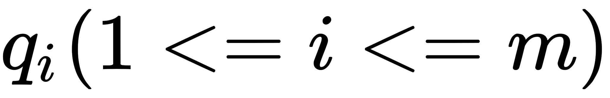
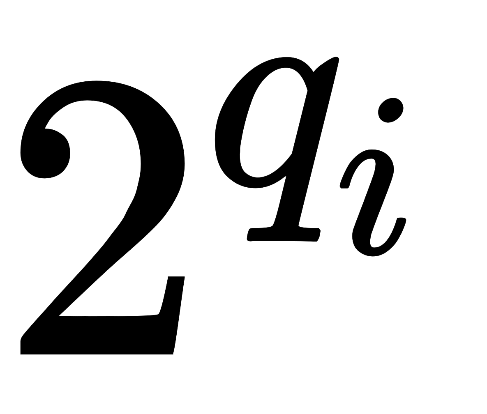
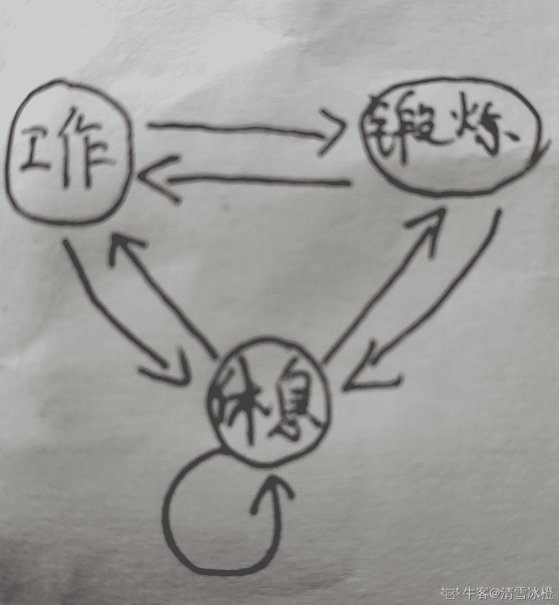

# 腾讯 2020 校园招聘-后台

## 1

小 Q 想要给他的朋友发送一个神秘字符串，但是他发现字符串的过于长了，于是小 Q 发明了一种压缩算法对字符串中重复的部分进行了压缩，对于字符串中连续的 m 个相同字符串 S 将会压缩为 m|S，例如字符串 ABCABCABC 将会被压缩为[3|ABC]，现在小 Q 的同学收到了小 Q 发送过来的字符串，你能帮助他进行解压缩么？ None

讨论

[跟在菜鸟后面的菜菜鸟](https://www.nowcoder.com/profile/675541065)

```cpp
class Solution {
public:
    /**
     * 代码中的类名、方法名、参数名已经指定，请勿修改，直接返回方法规定的值即可
     *
     * 
     * @param str string 字符串 
     * @return string 字符串
     */
	struct Node {
		string str;
		int num;
	};
	stack<Node> st;
    string compress(string str) {
        // write code here
    	int i = 0; 	
    	string t = "";
		int num = 0; 
		while (str[i]) {
			if (str[i] >= '0' && str[i] <= '9') {
				num = num*10 + (str[i] - '0');
			} else if (str[i] == '[') {
				st.push({t, num});
				t = "";
				num = 0;
			} else if (str[i] == ']') {
				string t2 = "";
				if (num == 0) t2 = t;
				for (int i = 0; i < num; i++) {
					t2 += t;
				}
				t = st.top().str + t2;
				num = st.top().num;
				st.pop();
			} else if (str[i] != '|') {
				t += str[i];
			}
			// cout << t << endl;
			i++;
    	}
    	return t;
	}
};

```

没人发，我来发一个，思路还是挺简单😀

编辑于 2021-03-19 16:28:53

* * *

[胡晨阳](https://www.nowcoder.com/profile/710968620)

```cpp
import java.util.*;

public class Solution {
    /**
     * 代码中的类名、方法名、参数名已经指定，请勿修改，直接返回方法规定的值即可
     *
     * 
     * @param str string 字符串 
     * @return string 字符串
     */
    public static String compress (String str) {
        if(!str.contains("[")){
            return str;
        }
        StringBuilder sb=new StringBuilder(str);
        int len=str.length();
        char[] ch=str.toCharArray();
        Deque<Integer> stack=new LinkedList<>();
        for(int i=0;i<len;i++){
            if(ch[i]=='['){
                stack.push(i);
            }else if(ch[i]==']'){
                int l=stack.pop();
                int r=i;
                String s=str.substring(l+1,r);
                String res=helper(s);
                sb.delete(l,r+1);
                sb.insert(l,res);
                break;
            }
        }
        return compress(sb.toString());
    }

    //拆分括号中的
    public static String helper(String str){
        StringBuilder sb=new StringBuilder();
        String[] d=str.split("\\|");
        int num=Integer.parseInt(d[0]);
        String s=d[1];
        for(int i=0;i<num;i++){
            sb.append(s);
        }
        return sb.toString();
    }
}
```

编辑于 2021-08-28 00:45:36

* * *

[Yonoi](https://www.nowcoder.com/profile/213503693)

利用一个栈，遇到']' 进行出栈运算，将结果再次入栈。

```cpp
class Solution:
    def compress(self , str):
        stack = []
        letter = ''

        for ch in str:
            if ch == ']':
                array_str = ''
                letter = ''
                while letter != '[':
                    array_str += letter
                    letter = stack.pop()
                array_str = array_str[::-1].split('|')
                decompress_str = int(array_str[0]) * array_str[1]

                stack.extend(list(decompress_str))

            else:
                stack.append(ch)
            print(stack)
        return ''.join(stack)
```

发表于 2022-03-04 16:49:58

* * *

## 2

小 Q 在周末的时候和他的小伙伴来到大城市逛街，一条步行街上有很多高楼，共有 n 座高楼排成一行。小 Q 从第一栋一直走到了最后一栋，小 Q 从来都没有见到这么多的楼，所以他想知道他在每栋楼的位置处能看到多少栋楼呢？（当前面的楼的高度大于等于后面的楼时，后面的楼将被挡住）None

讨论

[小菜。](https://www.nowcoder.com/profile/168364320)

```cpp
public int[] findBuilding (int[] heights) {
        // write code here
        Stack<Integer> stack1 = new Stack<>();
        int n = heights.length;
        int[] res = new int[n];
        Arrays.fill(res,1);       //最起码能看到自己所在的这栋楼
        for(int i=0;i<n-1;i++){   //首先向左边看
            //只要当前楼大于等于前面遍历过的楼，就把前面的矮楼丢掉，因为我站在该楼右边是看不到的
            while(!stack1.isEmpty() && heights[i]>=stack1.peek()){
                stack1.pop();
            }
            stack1.push(heights[i]);
            //这里 i+1 才是核心，因为我已经通过 while 循环把比当前楼矮的都去掉了，所以栈里剩下的都比当前楼高
            //也就是说当我站在该楼的右边一栋楼，栈里的楼我都能看到
            res[i+1]+=stack1.size();  
        }
        Stack<Integer> stack2 = new Stack<>();
        for(int i=n-1;i>0;i--){   //然后向右边看
            while(!stack2.isEmpty() && heights[i]>=stack2.peek()){
                stack2.pop();
            }
            stack2.push(heights[i]);
            res[i-1]+=stack2.size();  //同理
        }
        return res;
}
```

发表于 2021-03-22 22:11:07

* * *

[万古霉素](https://www.nowcoder.com/profile/593313845)

巧用数据结构降低时间复杂度

对于这个题，很多小伙伴估计都会像我一样，首先想到用两重循环来解决：

```cpp
public class Solution {
    public int[] findBuilding (int[] heights) {
        int n = heights.length;
        int[] ans = new int[n];
        for(int i = 0; i < n; i++) {
            ans[i]++;
            // 往左看
            int j = i, preMax = 0;
            while(--j >=0) {
                if(heights[j] > preMax) {
                    ans[i]++;
                    preMax = heights[j];
                }
            }
            // 往右看
            j = i;
            preMax = 0;
            while(++j < n) {
                if(heights[j] > preMax) {
                    ans[i]++;
                    preMax = heights[j];
                }
            }
        }
        return ans;
    }
}
```

但是很明显这个复杂度是 O(n²)，是不能全部通过样例的。那么有没有什么方法可以降低复杂度呢？再考虑这道题，去到每一个位置，我前边和后边能看到的楼一定是**递增**的，因此我能不能遍历一遍就知道左边/右边有多少栋楼是递增的呢？我们可以使用两个栈来实现。

```cpp
public class Solution {
	public int[] findBuilding (int[] heights) {
        int n = heights.length;
        int[] ans = new int[n];
        LinkedList<Integer> stack1 = new LinkedList<>(), stack2 = new LinkedList<>();
        Arrays.fill(ans, 1);
        // 往左看，也就是要得到每个数左边有多少递增的
        for(int i = 0;i < n-1;i++) {
            while(!stack1.isEmpty() && heights[i] >= stack1.getFirst()) {
                stack1.removeFirst();
            }
            stack1.addFirst(heights[i]);
            ans[i+1] += stack1.size();
        }
        // 往右看，也就是要得到每个数右边有多少递增的
        for(int i = n-1;i > 0;i--) {
            while(!stack2.isEmpty() && heights[i] >= stack2.getFirst()) {
                stack2.removeFirst();
            }
            stack2.addFirst(heights[i]);
            ans[i-1] += stack2.size();
        }
        return ans;
    }
}
```

发表于 2021-08-23 10:03:09

* * *

[Zep2](https://www.nowcoder.com/profile/651778239)

单调栈的应用

1.  left 数组：left[i] 表示从下标 i (包含下标) 向左看能够看到的楼的数量的最大值
2.  right 数组：right[i] 表示从下标 i (包含下标) 向右看能够看到的楼的数量的最大值

```cpp
public int[] findBuilding (int[] heights) {
        // write code here
        int len = heights.length;
        if (len == 0) {
            return new int[]{};
        }
        int[] ans = new int[len];
        int[] left = new int[len];
        left[0] = 1;
        int[] right = new int[len];
        right[len - 1] = 1;
        Stack<Integer> stack = new Stack<>();
        stack.push(heights[0]);
        for (int i = 1; i < len; i++) {
            while (!stack.isEmpty() && heights[i] >= stack.peek()) {
                stack.pop();
            }
            stack.push(heights[i]);
            left[i] = stack.size();
        }
//        System.out.println(Arrays.toString(left));
        stack = new Stack<>();
        stack.push(heights[len -1]);
        for (int i = len - 2; i >= 0; i--) {
            while (!stack.isEmpty() && heights[i] >= stack.peek()) {
                stack.pop();
            }
            stack.push(heights[i]);
            right[i] = stack.size();
        }
//        System.out.println(Arrays.toString(right));
        for (int i = 0; i < len; i++) {
            int leftVal = 0;
            int rightVal = 0;
            if (i > 0) {
                leftVal = left[i - 1];
            }
            if (i < len - 1) {
                rightVal = right[i + 1];
            }
            ans[i] = leftVal + rightVal + 1;
        }
        return ans;
    }
```

打开中间两个注释就能看到 left 和 right 数组的具体值

发表于 2021-12-03 21:35:45

* * *

## 3

作为程序员的小 Q，他的数列和其他人的不太一样，他有个数。
老板问了小 Q 一共 m 次，每次给出一个整数, 要求小 Q 把这些数每分为一组，然后把每组进行翻转，小 Q 想知道每次操作后整个序列中的逆序对个数是多少呢？例如:对于序列 1 3 4 2，逆序对有(4, 2),(3, 2),总数量为 2。翻转之后为 2 4 3 1，逆序对有(2, 1),(4, 3), (4, 1), (3, 1),总数量为 4。

本题知识点

Java 工程师 C++工程师 iOS 工程师 安卓工程师 运维工程师 前端工程师 算法工程师 PHP 工程师 测试工程师 安全工程师 腾讯 2020

讨论

[牛客 302235906 号](https://www.nowcoder.com/profile/302235906)

思路差不多就这样，如果注释哪里写错了欢迎指正

```cpp
import java.util.Scanner;
public class Main {
    public static void main(String[] args) {
        Scanner sc = new Scanner(System.in);
        int n = sc.nextInt();
        int N = 1 << n;
        //正序数组
        int[] a = new int[N];
        //a 的逆序数组，比如 a = [4,3,2,1], b = [1,2,3,4]
        int[] b = new int[N];
        /*
            order[i] 表示 2^i 的 顺序对个数
            reOrder[i] 表示 2^i 的 逆序对个数

            比如 i = 1，那么就是每 2 个元素的逆序对的个数，比如 [4,3,2,1]，
            有 [2,1] [4,3] 两个逆序对，即 reOrder[1] = 2

            比如 i = 2，那么就是每 4 个元素的逆序对的个数，比如 [4,3,2,1], 
            有 [4,3] [2,1] [4,2] [4,1] [3,2] [3,1] 6 个逆序对，
            只不过 [2,1] [4,3] 在 i = 1 的时候算过了，因此有 4 个
            即 reOrder[2] = 4

            我们可以发现，如果大小为 n 的数组是降序的，
            那么逆序对个数为 n * (n - 1) / 2 个
            比如 [4,3,2,1] 
            对于 4 来说，后面有 [3,2,1] 3 个元素小于它，那么逆序对个数为 3
            对于 3 来说，逆序对个数为 2
            对于 2 来说逆序对个数为 1
            如果数组是降序的,那么逆序对个数为 
            (n - 1) + (n - 2) + ... + 1
           = n * (n - 1) / 2
            而顺序对的个数为 0，但如果我们将其中两个元素交换位置，
            减少了 m 个逆序对的同时就会增加 m 个顺序对
            这表示 顺序对的个数 + 逆序对的个数 = n * (n - 1) / 2，
            即 顺序对 和 逆序对 是互补的

            或者这么说，当数组的逆序对个数为 m， 顺序对的个数为 n
            那么数组翻转过后，逆序对和顺序对的个数相互交换
            即逆序对的个数变为 n， 顺序对的个数变为 m

            因此，当我们对 2^i 个元素进行翻转的时候
            实际上就是交换它们的顺序对和逆序对个数
         */
        long[] order = new long[n + 1];
        long[] reOrder = new long[n + 1];
        for (int i = 0; i < N; ++i) {
            //正序添加元素
            a[i] = sc.nextInt();
            //倒序添加元素
            b[N - 1 - i] = a[i];
        }
        //一次归并求逆序对数
        mergeSort(a, 0, N - 1, reOrder, n);
        //一次归并求顺序对数
        mergeSort(b, 0, N - 1, order, n);

        int m = sc.nextInt();
        while (m-- > 0) {
            // 2^i 个元素为一组进行翻转
            int q = sc.nextInt();
            for (int i = 1; i <= q; ++i) {
                long temp = order[i];
                order[i] = reOrder[i];
                reOrder[i] = temp;
            }
            long count = 0;
            for (int i = 1; i <= n; ++i) {
                count += reOrder[i];
            }
            System.out.println(count);
        }
    }
    private static void mergeSort(int[] arr, int left, int right, long[] reOrder, int index){
        if(left < right){
            int mid = (left + right) >>> 1;
            //归并使得 左右两边保证有序
            mergeSort(arr, left, mid, reOrder, index - 1);
            mergeSort(arr, mid + 1, right, reOrder, index - 1);
            if(arr[mid] > arr[mid + 1]){
                mertSort(arr, left, right, mid, reOrder, index);
            }
        }
    }
    public static void mertSort(int[] arr, int left, int right, int mid, long[] reOrder, int index) {
        //mid 属于左边
        int len1 = mid - left + 1;
        int len2 = right - mid;

        int[] l = new int[len1];
        int[] r = new int[len2];
        System.arraycopy(arr, left, l, 0, len1);
        System.arraycopy(arr, mid + 1, r, 0, len2);

        /*
        逆序对：l[i] > r[j]
        [left, mid) 是有序的，[mid, right] 是有序的
        因此，如果 l[i] > r[j]，表示 l[i] 比 [0, j] 这些元素都大
        那么逆序对个数对于 l[i] 来说，有 j + 1 个
        */
        int i = len1 - 1;
        int j = len2 - 1;
        int k = right;
        long c = 0;
        while(i >= 0 && j >= 0){
            if(l[i] > r[j]){
                c += j + 1;
                arr[k] = l[i];
                i--;
            }else{
                arr[k] = r[j];
                j--;
            }
            k--;
        }
        System.arraycopy(r, 0, arr, left, j + 1);

        //逆序对个数
        reOrder[index] += c;
    }
}
```

发表于 2020-08-28 11:55:41

* * *

[牛客 691621789 号](https://www.nowcoder.com/profile/691621789)

O(nlogn)可全过大概思路就是记录所有 2^i 上的逆序对，只要记录 2^(i-1)和另一半 2^(i-1)之间的逆序对，例如 2341 里面 2¹上有 1 个 2²上一共 3 个，但是有一个在 2¹中算过了，所以就是 2 个计算这个值的过程用 O(n²)能过 80%，改成 merge 可以全过同时，要计算 2^i 下所有可能的组合,即 2^(i-1)*2^(i-1),再乘上 2^i 的个数，即 2^(n-i)，得到 2^(n+i-2),在 merge 的过程中同时还要记录等于的情况，因为这些等于的不管是否翻转都不是逆序对，所以对每一个 2^i 还要减去等于的对数。 然后翻转的时候，假如翻转数字的是 x，对于每个 2^i(x >= i),值都改为上面求出的数 - 原值逆序对总数就是从 1-n 求和。

```cpp
#include<stdio.h>
#include<vector>
using namespace std;

long long n, m, total, sum, offset, num;

vector<long long> count;
vector<long long> l;
vector<long long> l_copy;
vector<long long> max_c;
void mergesort(long long index, long long size)
{
    if(size == 0)
    {
    	l_copy[index] = l[index];
    	return;
	}
    vector<long long> l_copy2(1<<size);
	long long st1 = index, st2 = index + (1 << (size - 1) ), ed1 = st2, ed2 = index + (1 << size);
    long long pos = 0, p1 = st1, p2 = st2;
    mergesort(st1, size - 1);
    mergesort(st2, size - 1);
    while(p1 < ed1 && p2 < ed2)
    {
        if(l_copy[p1] == l_copy[p2]){
            long long c1 = 1, c2 = 1;
            l_copy2[pos++] = l_copy[p1++];
            l_copy2[pos++] = l_copy[p2++];
            while(p1 < ed1 && l_copy[p1] == l_copy[p1 - 1]) l_copy2[pos++] = l_copy[p1++], ++c1; 
            while(p2 < ed2 && l_copy[p2] == l_copy[p2 - 1]) l_copy2[pos++] = l_copy[p2++], ++c2;
            max_c[size] -= c1 * c2;
            count[size] += (ed1 - p1) * c2;
        }
        else if(l_copy[p1] < l_copy[p2]){
            l_copy2[pos++] = l_copy[p1++];
        }
        else {
            count[size] += ed1 - p1;
            l_copy2[pos++] = l_copy[p2++];
        }
    }
    if(p1 == ed1)while(p2 != ed2) l_copy2[pos++] = l_copy[p2++];
    else if(p2 == ed2) while(p1 != ed1) l_copy2[pos++] = l_copy[p1++];
    for(long long i = st1; i < ed2; ++i) l_copy[i] = l_copy2[i - st1]; 
}

int main()
{   
	scanf("%lld", &n);
	total = (long long)1 << n;
    count.resize(n + 1);
    max_c.resize(n + 1);
    l.resize(total);
    l_copy.resize(total);
	for(long long i = 0; i < total; ++i) scanf("%lld", &l[i]);
	max_c[0] = 1;
	for(long long i = 1; i <= n; ++i) max_c[i] = (long long)1 <<(n + i  - 2);//(1 << 2 * (i - 1) ) * ( 1 << (n - i))

    mergesort(0, n);

	scanf("%lld", &m);
	for(long long i = 0; i < m; ++i)
	{
		scanf("%lld", &num);
		sum = 0;
		for(long long j = 1; j <= n; ++j)
		{
			if(j <= num) count[j] = max_c[j] - count[j];
			sum += count[j];
		}
		printf("%lld\n", sum);
	}
}
```

编辑于 2020-04-11 14:46:40

* * *

[cqz](https://www.nowcoder.com/profile/314321095)

这题的坑很多，我的通过率从 50 到 10 到 60 到 70 到 80 到 100.。。。主要是要求解不同长度的逆序对和顺序对数量，翻转后将相应的进行交换，注意相等的情况（既不是逆序对也不是顺序对，可以求解翻转后的数组的逆序对来得到原数组的顺序对）。详情可以参考我的博客。[`blog.csdn.net/qq_43517189/article/details/105313349`](https://blog.csdn.net/qq_43517189/article/details/105313349)

发表于 2020-04-04 18:03:30

* * *

## 4

由于业绩优秀，公司给小 Q 放了 n 天的假，身为工作狂的小 Q 打算在在假期中工作、锻炼或者休息。他有个奇怪的习惯：不会连续两天工作或锻炼。只有当公司营业时，小 Q 才能去工作，只有当健身房营业时，小 Q 才能去健身，小 Q 一天只能干一件事。给出假期中公司，健身房的营业情况，求小 Q 最少需要休息几天。

本题知识点

Java 工程师 C++工程师 iOS 工程师 安卓工程师 运维工程师 前端工程师 算法工程师 PHP 工程师 测试工程师 安全工程师 腾讯 2020

讨论

[清雪冰橙](https://www.nowcoder.com/profile/514769)

画个状态机，一目了然.. dp[i][0] , dp[i][1], dp[i][2] 分别记录第 i 天 休息/锻炼/工作 累计的最小休息天数.. 状态转移关系如下图..     

```cpp
# include <iostream>
# include <cstdlib>
# include <cstring>
# include <stack>
# define mem(a,b) memset(a,b,sizeof(a))
using namespace std;

int main(void){
    int n ;
    while(cin>>n){
        int gym[n],i, work[n];
        for ( i=0; i<n; ++i )
            cin>>work[i];
        for( i=0; i<n; ++i )
            cin>>gym[i];
        int dp[n+1][3]; // 0 是休息，1 是锻炼，2 是工作
        memset(dp, 0x3f, sizeof(dp));
        dp[0][0] = dp[0][1] = dp[0][2] = 0;
        for ( int i=1; i<=n; ++i ){
            if ( gym[i-1] == 1 ){
                // 可以锻炼
                dp[i][1] = min( dp[i-1][0], dp[i-1][2] );
            }
            if ( work[i-1] == 1 ){
                // 可以工作
                dp[i][2] = min( dp[i-1][0], dp[i-1][1] );
            }
            dp[i][0] = min(dp[i-1][0], min(dp[i-1][1], dp[i-1][2]))+1;
        }
        int res = min(dp[n][0], min(dp[n][1], dp[n][2]));
        cout<<res<<endl;
    }
    return 0;
}
```

发表于 2020-02-12 00:15:48

* * *

[caijiji](https://www.nowcoder.com/profile/306549824)

1 前言

太久没写题了，在做套题时想不起如何写方程组。看了题解，恍然大悟（就是觉得自己好菜，怎么这么简单的解题思路也忘记了）。学习了@清雪冰橙 大佬的代码，重新整理了一下解题思路，如下所述。

2 解题算法

动态规划

3 解题思路

3.1 状态转移分析

1、每一天小 Q 都可能处于 3 个状态，那就是工作、休息、锻炼 2、若第 i 天小 Q 处于工作状态，那么第 i-1 天只能是休息、锻炼 3、若第 i 天小 Q 处于锻炼状态，那么第 i-1 天只能是休息、工作 4、若第 i 天小 Q 处于休息状态，那么第 i-1 天可能是工作、休息、锻炼。

3.2 方程组

基于上述逻辑思路，我们可以用 dp[i][0]、dp[i][1]、dp[i][2]分别表示第 i 天小 Q 处于休息、工作、锻炼时最少的休息天数。那么，可得如下状态转移方程式：

```cpp
//1. 选择休息，故天数多 1
dp[i][0] = min(dp[i-1][0], min(dp[i-1][1], dp[i-1][2])) + 1; 
//2. 不休息，选择工作
dp[i][1] = min(dp[i-1][0], dp[i-1][2]); 
//3. 不休息，选择锻炼
dp[i][2] = min(dp[i-1][0], dp[i-1][1]); 
//边界：第 0 天休息天数为 0
dp[0][i] = 0 (i = 1, 2, 3) 
```

最后只需拿出第 n 天各种状态下的最少天数，即为答案。

4 实现代码

 ```cpp
# include<iostream>
# include<memory>
using namespace std;
int dp[100010][3];
int work[100010];
int train[100010];
int main(){
    int n;
    cin >> n;
    for (int i = 0; i < n; i++){
        cin >> work[i];
    }
    for (int i = 0; i < n; i++){
        cin >> train[i];
    }
    memset(dp, 0x3f, sizeof(dp));
    dp[0][0] = dp[0][1] = dp[0][2] = 0;
    for (int i = 1; i <= n; i++)
    {
        //看看今天是否能工作
        if (work[i-1] == 1){
            dp[i][1] = min(dp[i-1][0], dp[i-1][2]);
        } 
        //看看今天是否能锻炼
        if (train[i-1] == 1){
            dp[i][2] = min(dp[i-1][0], dp[i-1][1]);
        } 
        dp[i][0] = min(dp[i-1][0], min(dp[i-1][1], dp[i-1][2])) + 1; //休息多 1 天

    }
    int ans = min(dp[n][0], min(dp[n][1], dp[n][2]));
    cout << ans << endl;
    return 0;
}
``` 

编辑于 2020-08-21 13:19:33

* * *

[Frankiet](https://www.nowcoder.com/profile/8436416)

```cpp
import java.util.Scanner;

/**
 * @Author: lei
 * @Date: 2020.3.18 10:21
 */
public class Holiday {
	public static void main(String[] args) {
		//第一步数据处理：三行，就是三个字符串，后两行进行一个分割处理，然后再调用函数转换成为整型数据
		Scanner in = new Scanner(System.in);
		String day_str = in.nextLine();
		String [] work_str = in.nextLine().split(" ");
		String [] gym_str = in.nextLine().split(" ");
		int day = Integer.parseInt(day_str);  //日期
		int [] works = new int[day+1];
		int [] gyms = new int[day+1];
		for(int i = 1;i < day+1;i++) {
			works[i] = Integer.parseInt(work_str[i - 1]);
			gyms[i] = Integer.parseInt(gym_str[i-1]);
		}
		int res = holiday(day, works, gyms);
		System.out.println(res);
	}

	//策略：使用 dp[i][0] dp[i][1] dp[i][2]分别记录在第 i 天如果是休息、工作、健身情况下，前 i 天有事做（也就是没休息）的最大天数
	//如果第 i 天休息，那么前 i 天有事做的最大天数，实际就是 dp[i-1][0] dp[i-1][1] dp[i-1][2]中的最大值
	//如果第 i 天工作，那么前 i 天有事做的最大天数，就是前一天休息、健身中的最大值 + 1（因为第 i 天工作了，没有休息）
	//如果第 i 天健身，那么前 i 天有事做的最大天数，就是前一天休息、工作中的最大值 + 1（因为第 i 天健身了，没有休息）
	//最后的结果，就用 day 减去最大的做事天数，就是最少的休息时间了
	public static int holiday(int day, int [] works, int [] gyms){
		int res;
		int [][] dp = new int[day+1][3];
		dp[0][0] = dp[0][1] = dp[0][2] = 0;
		for (int i = 1; i < day+1; i++) {
			if(works[i] == 1){
				//第 i 天可以选择工作
				dp[i][1] = Math.max(dp[i-1][0], dp[i-1][2]) + 1;
			}
			if(gyms[i] == 1){
				//第 i 天可以选择健身
				dp[i][2] = Math.max(dp[i-1][0], dp[i-1][1]) + 1;
			}
			dp[i][0] = Math.max(dp[i-1][0], Math.max(dp[i-1][1], dp[i-1][2]));
		}
		res = day - Math.max(dp[day][0], Math.max(dp[day][1], dp[day][2]));
		return res;
	}
}//class end

```

编辑于 2020-09-06 16:54:46

* * *

## 5

小 Q 在进行一场竞技游戏,这场游戏的胜负关键就在于能否能争夺一条长度为 L 的河道,即可以看作是[0,L]的一条数轴。这款竞技游戏当中有 n 个可以提供视野的道具−真视守卫,第 i 个真视守卫能够覆盖区间[x[i],y[i]]。现在小 Q 想知道至少用几个真视守卫就可以覆盖整段河道。 

本题知识点

Java 工程师 C++工程师 iOS 工程师 安卓工程师 运维工程师 前端工程师 算法工程师 PHP 工程师 测试工程师 安全工程师 腾讯 2020

讨论

[清雪冰橙](https://www.nowcoder.com/profile/514769)

力扣第 172 场周赛最后一题换个了壳.. [`leetcode-cn.com/classic/problems/minimum-number-of-taps-to-open-to-water-a-garden/description/`](https://leetcode-cn.com/classic/problems/minimum-number-of-taps-to-open-to-water-a-garden/description/)

```cpp
# include <iostream>
# include <cstdlib>
# include <stack>
# include <cstring>
# include <unordered_map>
# include <vector>
# include <algorithm>
# define N 100100
# define inf 0x3f3f3f3f
using namespace std;

int n,L;

int main(void){
    while( cin>>n>>L ){
        vector<vector<int>> nums;
        int a,b;
        for ( int i=0; i<n; ++i ){
            cin>>a>>b;
            nums.push_back({a,b});
        }
        sort( nums.begin(), nums.end(), [](vector<int>&a, vector<int>&b){
            return a[0]<b[0] || (a[0]==b[0] && a[1]>b[1]);
        } );
        int pre = 0, i=0, ans=0, last=0;
        while( i<nums.size() ){

            while( i<nums.size() && nums[i][0]<=pre ){
                last = max(last, nums[i][1]);
                ++i;
            }
            ++ans;
            pre = last;
            if ( i<nums.size() && nums[i][0]>pre ){
                ans = -1;
                break;
            }
            if ( last>=L ) break;

        }
        if ( ans==-1 || last<L )
            cout<<-1<<endl;
        else cout<<ans<<endl;
    }
    return 0;
}
```

发表于 2020-02-12 00:08:48

* * *

[NutYY](https://www.nowcoder.com/profile/60683408)

```cpp
import java.util.Arrays;
import java.util.Comparator;
import java.util.Scanner;
public class Main {
    public static void main(String[] args) {
		Scanner in=new Scanner(System.in);
		int n=in.nextInt();
		int L=in.nextInt();
		int[][] temp=new int[n][2];
		for(int i=0;i<n;i++) {
			for(int j=0;j<2;j++) {
				temp[i][j]=in.nextInt();
			}
		}
		//。获得了数组，进行排序
		Arrays.sort(temp,new Comparator<int[]>() {
			public int compare(int[] o1, int[] o2) {
				return o1[0]==o2[0]?o1[1]-o2[1]:o1[0]-o2[0];
			}
		});
		int index=0;
		int count=0;
		int pre=0;   //右边界
		while(pre<L) {
			if(temp[index][0]>pre) {
				System.out.println(-1);
			}
			int max=0;
			while(index<n&&temp[index][0]<=pre) {
				max=Math.max(max, temp[index][1]);
				index++;
			}
			count++;
			pre=max;
			if(pre>=L) {
				System.out.println(count);
                return;
			}
			if(index>=n) {
				System.out.println(-1);
                return;
			}
		}
	}
}
```

Java 贪心算法

编辑于 2020-04-27 17:09:45

* * *

[菜丶转行可达鸭](https://www.nowcoder.com/profile/976289567)

贪心策略只需要右指针

```cpp
#include<iostream>
#include<vector>
#include<algorithm>
using namespace std;

int main(){
    int n,L;cin >> n >> L;
    vector<pair<int,int>> vec(n);
    for(int i=0;i<n;++i) cin >> vec[i].first >> vec[i].second;
    sort(vec.begin(),vec.end());
    if(vec[0].first>0) {cout << -1;return 0;}//teshuqingkuang
    int right = 0;
    int i = 0;
    int res = 0;
    while(i<n){
        int r = right;
        for(;i<n && vec[i].first<=r;++i){
            right = max(right,vec[i].second);
        }
        ++res;
        if(right>=L) {cout << res;return 0;}
        if(i>=n || vec[i].first>right) {cout << -1;return 0;}
    }
    return 0;

}

```

编辑于 2020-04-23 00:09:49

* * *