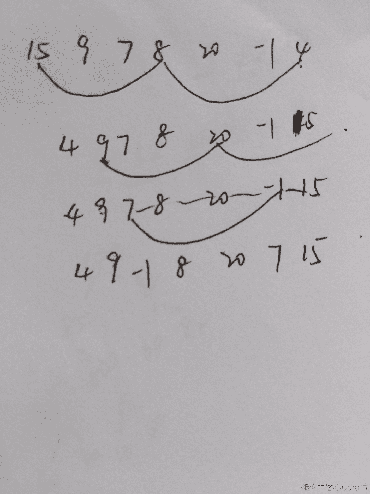

# 小米 2020 校招 Android 工程师笔试题二

## 1

在快速排序，归并排序，插入排序，选择排序，冒泡排序中，使用到分治思想的算法个数有几个（）

正确答案: B   你的答案: 空 (错误)

```cpp
1
```

```cpp
2
```

```cpp
3
```

```cpp
4
```

本题知识点

安卓工程师 小米 2020

讨论

[我是真的菜得 1P](https://www.nowcoder.com/profile/81461441)

快速排序是将整个待排序数组分为两部分，一部分比某个标准值（这里分析的是随机快排，标准值将从数组中随机选出）大，另一部分比某个标准值小，然后重复这个过程。归并排序则存在将整个数组分为两部分，分别排序，再和起来的过程。所以答案自然是 B

发表于 2020-05-18 14:45:22

* * *

[zzz 周小伦](https://www.nowcoder.com/profile/703886061)

B

发表于 2020-03-06 22:36:38

* * *

[来自巴厘岛的程序猿](https://www.nowcoder.com/profile/612772)

B

发表于 2021-08-07 14:56:02

* * *

## 2

有 27 个外形一样的小球，其中有一个和另外 26 个重量不同，现有一个天平，最少称几次一定能找出这个小球？（）

正确答案: A   你的答案: 空 (错误)

```cpp
4
```

```cpp
3
```

```cpp
5
```

```cpp
6
```

本题知识点

安卓工程师 小米 2020

讨论

[牛客 162831222 号](https://www.nowcoder.com/profile/162831222)

第一次：把球分成 3 堆，每堆九个。取第一、第二堆进行比较。如果平衡，则说明目标球在第三堆。如果不平衡，则表明目标堆在第一、二堆中。第二次：拿第一或第二堆与第三堆进行比较。此次操作后，我们能够知道目标球在哪一堆（目标堆），并且知道比正常球轻或重。第三次：把目标堆又分为 3 堆（每小堆 3 颗），任取两小堆进行比较。此次操作能够判断目标球在哪一小堆（把范围缩小为 3）。第四次：在目标小堆（只有 3 颗了）任选两颗进行比较，这样我们可以就找到目标球了。

编辑于 2020-09-08 16:14:31

* * *

[举荐](https://www.nowcoder.com/profile/44206441)

三次不行吗？每一次都平均分成 3 分，分别是 9 个，3 个，1 个

发表于 2020-03-24 12:04:52

* * *

[牛客 273190314 号](https://www.nowcoder.com/profile/273190314)

看到有问为什么不是三次，而是 4 次，当最后称 天平两边谁重谁轻的时候  其实需要两次才能称出不同的是哪一个， 因为题目并没有说明是轻了还是重了。 

发表于 2021-05-30 20:07:03

* * *

## 3

建立一个堆的时间复杂度为（）

正确答案: A   你的答案: 空 (错误)

```cpp
O(n)
```

```cpp
O(nlog)
```

```cpp
O(n²)
```

```cpp
O(logn)
```

本题知识点

安卓工程师 小米 2020

讨论

[Jackkinson](https://www.nowcoder.com/profile/558629)

堆排序最好时间复杂度、最差时间复杂度、平均时间复杂度 O(nlogn)，空间复杂度 O(1)，建堆时间复杂度 O(n)

发表于 2020-03-12 19:35:41

* * *

## 4

一个栈的输入序列为：1 2 3，则下列序列中不可能是栈的输出序列是（）

正确答案: C   你的答案: 空 (错误)

```cpp
1 2 3
```

```cpp
2 1 3
```

```cpp
3 1 2
```

```cpp
3 2 1
```

本题知识点

安卓工程师 小米 2020

讨论

[牛客 644263744 号](https://www.nowcoder.com/profile/644263744)

栈是先进后出 1 进栈出栈，2 进栈出栈，3 进栈出栈  A 正确 1，2 依次进栈，2，1 依次出栈，然后 3 再进栈，再出栈  B 正确 1,2,3 依次进栈，3,2,1 依次出栈。D 正确

发表于 2020-05-12 11:14:23

* * *

## 5

对序列{15,9,7,8,20,-1,4}进行排序,进行一趟后数据的排列变为{4,9,-1,8,20,7,15};则采用的是（）排序

正确答案: A   你的答案: 空 (错误)

```cpp
希尔
```

```cpp
选择
```

```cpp
快速
```

```cpp
冒泡
```

本题知识点

安卓工程师 小米 2020

讨论

[无限苦肉盖神](https://www.nowcoder.com/profile/152165957)

采用排除法，个人不是很熟悉希尔排序。

*   选择排序：第一趟选择排序是选择最小的数和 15 交换，所以结果是
    {-1,9,7,8,20,15,4}
*   快排：观察数据，发现不满足“左边的数都比中轴值小，右边的数都比中轴值大”这个特性，所以不是快排
*   冒泡：第一趟冒泡排序以后，最大的数 20 应该要放在数组的最后，所以也不是冒泡
    经过以上的排除，所以选的是希尔排序

发表于 2020-03-29 12:30:21

* * *

[MILJ](https://www.nowcoder.com/profile/959983303)



发表于 2020-06-14 11:54:14

* * *

## 6

 已知某二叉树的后序遍历是 dabec，中序遍历是 debac，他的前序遍历序列是？（）

正确答案: D   你的答案: 空 (错误)

```cpp
acbed
```

```cpp
decab
```

```cpp
deabc
```

```cpp
cedba
```

本题知识点

安卓工程师 小米 2020

讨论

[qykhhr](https://www.nowcoder.com/profile/125753625)

根据后序遍历最后一个值是根节点的值，前序遍历根节点位于第一位可知选项 D 正确

发表于 2022-03-11 08:23:12

* * *

[无限苦肉盖神](https://www.nowcoder.com/profile/152165957)

这种题目出得太多了，先画出树的结构就行了，当然还得知道递归。

发表于 2020-03-29 12:32:16

* * *

## 7

对数据库并发操作有可能带来的问题包括（  ）

正确答案: A   你的答案: 空 (错误)

```cpp
读出“脏数据”
```

```cpp
带来数据的冗余 
```

```cpp
未被授权的用户非法存取数据
```

```cpp
破坏数据独立性 
```

本题知识点

安卓工程师 小米 2020

讨论

[清澈的水](https://www.nowcoder.com/profile/78113385)

数据库的并发操作通常会带来丢失更新问题，不一致分析问题和“脏数据”的读出问题。

发表于 2020-02-19 14:39:14

* * *

## 8

数据库索引经常使用 B+树。以下关于 B+树的描述，错误的是哪一项？（）

正确答案: D   你的答案: 空 (错误)

```cpp
B+树的插入、删除可以保证其平衡性
```

```cpp
与二叉树相比，B+树更利于降低高度
```

```cpp
B+树能够支持顺序查找
```

```cpp
B+树空间复杂度低于 B 树
```

本题知识点

安卓工程师 小米 2020

讨论

[Jackkinson](https://www.nowcoder.com/profile/558629)

B+树相比 B 树额外存储了顺序查找的指针，空间复杂度更大。

发表于 2020-03-12 19:36:53

* * *

## 9

下列方法中，()不可以用来程序调优？

正确答案: B   你的答案: 空 (错误)

```cpp
改善数据访问方式以提升缓存命中率
```

```cpp
使用多线程的方式提高 I/O 密集型操作的效率
```

```cpp
利用数据库连接池替代直接的数据库访问
```

```cpp
利用迭代替代递归
```

本题知识点

安卓工程师 小米 2020

讨论

[Jackkinson](https://www.nowcoder.com/profile/558629)

多线程应用于计算密集型应用，有利于改善性能，多线程 IO 作业，容易加剧阻塞和等待。

发表于 2020-03-12 19:37:46

* * *

## 10

以下关于 GET 和 POST 的说法，错误的是（      ）

正确答案: C   你的答案: 空 (错误)

```cpp
GET 一般用于获取资源，POST 用于上传资源
```

```cpp
POST 安全性比 GET 高
```

```cpp
GET 和 POST 参数长度都不受限制
```

```cpp
GET 参数之间以&连接
```

本题知识点

安卓工程师 小米 2020

讨论

[举荐](https://www.nowcoder.com/profile/44206441)

get 请求提交的 url 中的数据最多只能是 1024 字节，这个限制是浏览器或者服务器给添加的，http 协议并没有对 url 长度进行限制，目的是为了保证服务器和浏览器能够正常运行，防止有人恶意发送请求。
post 请求则没有大小限制。

发表于 2020-03-24 12:07:56

* * *

## 11

在 android 中使用 Menu 时可能需要重写的方法有 ？（　　）

正确答案: A C   你的答案: 空 (错误)

```cpp
onCreateOptionsMenu()
```

```cpp
onCreateMenu()
```

```cpp
onOptionsItemSelected()
```

```cpp
onItemSelected()
```

本题知识点

安卓工程师 小米 2020

讨论

[Jackkinson](https://www.nowcoder.com/profile/558629)

OptionsMenu 方法 onCreateOptionsMenu,onOptionsItemSeleted。ContextMenu 方法 onCreateContextMenu,onContextItemSeleted。

发表于 2020-03-12 19:38:45

* * *

## 12

下面是属于 GLSurFaceView 特性的是？（　　）

正确答案: A B C   你的答案: 空 (错误)

```cpp
管理一个 surface，这个 surface 就是一块特殊的内存，能直接排版到 android 的视图 view 上
```

```cpp
管理一个 EGL display，它能让 opengl 把内容渲染到上述的 surface 上
```

```cpp
让渲染器在独立的线程里运作，和 UI 线程分离
```

```cpp
可以直接从内存或者 DMA 等硬件接口取得图像数据
```

本题知识点

安卓工程师 小米 2020

## 13

Android 的数据存储方式包括哪些？（　　）

正确答案: A B C D   你的答案: 空 (错误)

```cpp
SharedPreferences
```

```cpp
SQLite 数据库
```

```cpp
ContentProvider
```

```cpp
文件存储
```

本题知识点

安卓工程师 小米 2020

讨论

[无限苦肉盖神](https://www.nowcoder.com/profile/152165957)

为什么内容提供器也算在内

发表于 2020-03-29 12:34:29

* * *

[举荐](https://www.nowcoder.com/profile/44206441)

还有一种网络

发表于 2020-03-24 12:12:45

* * *

## 14

下面属于 android 动画分类的是（）

正确答案: A B C   你的答案: 空 (错误)

```cpp
帧动画
```

```cpp
补间动画
```

```cpp
属性动画
```

```cpp
层级动画
```

本题知识点

安卓工程师 小米 2020

讨论

[飞的有点累](https://www.nowcoder.com/profile/4052944)

ABC

发表于 2020-03-10 13:40:00

* * *

## 15

下面关于 BroadcastReceiver 正确的是（）

正确答案: A C D   你的答案: 空 (错误)

```cpp
BroadcastReceiver 有两种注册方式，静态注册和动态注册。 
```

```cpp
BroadcastReceiver 必须在 AndroidMainfest 文件中声明 
```

```cpp
BroadcastReceiver 的使用，一定有一方发送广播，有一方监听注册广播,onReceive 方法才会被调用。 
```

```cpp
广播发送的 Intent 都是隐式启动。 
```

本题知识点

安卓工程师 小米 2020

讨论

[无限苦肉盖神](https://www.nowcoder.com/profile/152165957)

四大组件中广播接受者是可以不在清单文件中配置的，BroadcastReceiver 还可以用代码来注册，

两者的区别是，如果在清单文件中配置，那么即使应用关掉后，还是可以接收到广播，

如果用代码注册，那么应用关掉后，就不能接收广播了

发表于 2020-03-29 12:36:58

* * *

## 16

以下哪些属于 android 控件的 touch 事件？（）

正确答案: A C   你的答案: 空 (错误)

```cpp
Move
```

```cpp
Enter
```

```cpp
Up
```

```cpp
Leave
```

本题知识点

安卓工程师 小米 2020

讨论

[不知名 five](https://www.nowcoder.com/profile/432860193)

Android 控件的 touch 事件有 Down、Move、Up。

发表于 2020-12-02 08:18:55

* * *

## 17

以下关于多线程说法不正确的是()

正确答案: A C D   你的答案: 空 (错误)

```cpp
wait()方法和 sleep()方法都会使当前线程堵塞并释放所持有的锁
```

```cpp
join()的作用是阻塞指定线程等到另一个线程完成以后再继续执行
```

```cpp
使用 new Thread(new T()).run()方法可以启动一个线程
```

```cpp
Synchronized 关键字可以使用在类定义上，以确保类的线程安全
```

本题知识点

安卓工程师 小米 2020

讨论

[hkhk11](https://www.nowcoder.com/profile/777275734)

sleep()不会释放锁 new thread().start 启动线程 sychonized 定义在类上是对当前对象加锁

发表于 2021-03-08 21:20:36

* * *

## 18

下面关于 HashMap 说法正确的是（）

正确答案: B D   你的答案: 空 (错误)

```cpp
HashMap 是线程安全的，可以用于多线程环境下
```

```cpp
HashMap 容量不足（超过了阈值）时，会自动增长
```

```cpp
HashMap 是基于哈希表实现，是有序的
```

```cpp
HashMap 实现了 Serializable 接口，因此它支持序列化，实现了 Cloneable 接口，能被克隆
```

本题知识点

安卓工程师 小米 2020

讨论

[Jackkinson](https://www.nowcoder.com/profile/558629)

HashMap 是不安全的，ConcurrentHashMap 是安全的，有序的是 LinkedHashMap。

发表于 2020-03-12 19:40:52

* * *

## 19

下列选项关于内部类的说法正确的有哪些（）

正确答案: A B C D   你的答案: 空 (错误)

```cpp
非静态的内部类不能定义静态成员变量
```

```cpp
匿名内部类中不能存在任何静态成员或方法
```

```cpp
静态内部类不能使用任何外部类的非 static 成员变量和方法
```

```cpp
匿名内部类可以引用局部变量，但是这个局部变量必须声明为 final
```

本题知识点

安卓工程师 小米 2020

## 20

下列选项不属于代码运行的结果是()

```cpp
    import java.io.*;
    public class filesinputoutput {
     public static void main(String[] args) {
           String obj  = "abc";
           byte b[] = obj.getBytes();
           ByteArrayInputStream obj1 = new ByteArrayInputStream(b);
           for (int i = 0; i < 2; ++ i) {
               int c;
               while ((c = obj1.read()) != -1) {
                 if (i == 0) {
                       System.out.print(Character.toUpperCase((char)c));  
                 }
               }
           }
        }
    }
```

正确答案: A C D   你的答案: 空 (错误)

```cpp
abc
```

```cpp
ABC
```

```cpp
ab
```

```cpp
AB
```

本题知识点

安卓工程师 小米 2020

讨论

[日和](https://www.nowcoder.com/profile/1445429)

当 i =0 时， for 循环开始第一次循环。    此时会进入 while 循环，由于 i = 0，所以随着 while 循环依次执行，会输出 ABC，while 循环结束时 c = -1。当 while 循环结束，i =1， for 循环开始第二次循环。    此时会进行 while 循环的判断逻辑，注意此时 c 是 -1 ，所以并不会进入 while 循环的循环体。

发表于 2022-01-15 17:16:40

* * *

[YanLq](https://www.nowcoder.com/profile/94819113)

通过对代码的调试，这里的 obj1 字节数组输入流 是将 b 字节数组一次性传入的。在第一次循坏中在 while 循坏判断时会把 obj1 这个流 全部读出。此时 i 始终等于 0 ，即将字符全部大写。（个人分析，不知具体原理。）

发表于 2020-11-14 11:15:43

* * *