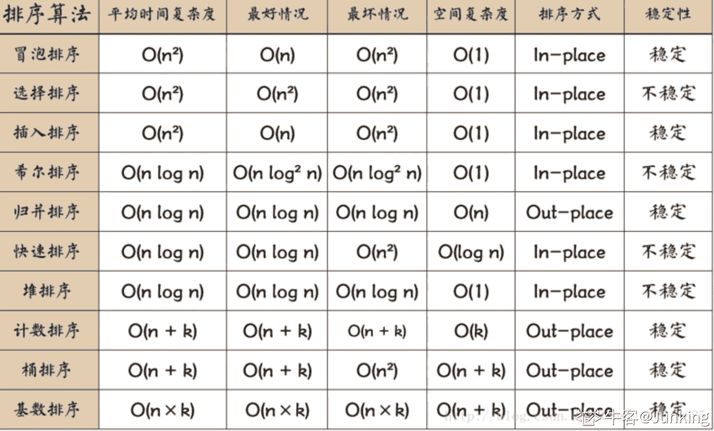
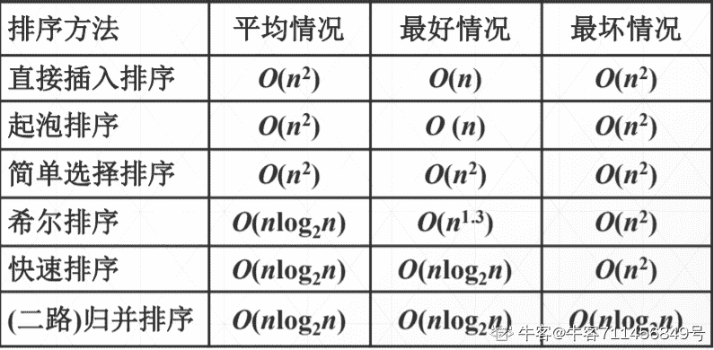
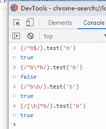
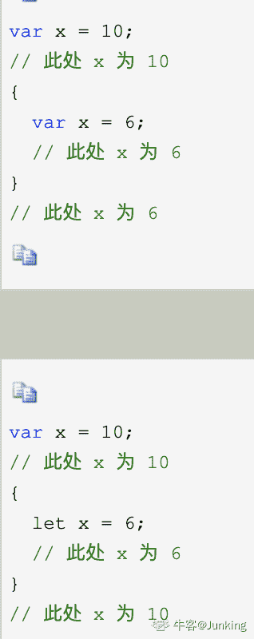

# 小米 2020 校招前端工程师笔试题一

## 1

以下哪些正则会匹配字符串"b"

正确答案: A B C D   你的答案: 空 (错误)

```cpp
/^b$/
```

```cpp
/^b\b/
```

```cpp
/(^|)b/
```

```cpp
/[\b]*b/
```

本题知识点

前端工程师 小米 2020

讨论

[老黑不黑](https://www.nowcoder.com/profile/934796770)

```cpp
/^b$/    匹配 str 开头和 str 结尾中间的 b，即只有一个 b 字符的情况  
```

```cpp
/^b\b/   匹配 str 开头和单词结尾中只有 b 的情况
```

```cpp
/(^|)b/   括号表示以开头或者 null 的整体，后跟随一个 b，也就是一个单独的 b
```

```cpp
/[\b]*b/  方括号表示一个退格符，但是加上*后就表示 0 或 n 个退格符，所以无视就好。意思就是匹配一个 b
```

无力吐槽，正则表达式真的是怎么学都学不会。这玩意没有工作经历在项目中大量使用，真的能死记硬背下来？反正我不行

发表于 2020-09-08 13:41:21

* * *

[janechelle](https://www.nowcoder.com/profile/309401271)

```cpp
/(^|)b/：以 b 开头  或者 直接是 b

```

```cpp
/[\b]*b/：0 个或多个字符边界之后是 b
```

发表于 2020-03-15 21:38:57

* * *

[Mars_ 瀚汶](https://www.nowcoder.com/profile/122888134)

关于单词边界  \b 比如要替换掉一段英文中的单词“to”，而“today”显然不在替换的范围内，所以正则可以用“\bto\b”来限定。举例：统计以“,”分割的元素中“3”的个数
string test = "137,1,33,4,3,6,21,3,35,93,2,98";
int count = Regex.Matches(test, @"\b3\b").Count; //结果：2 

编辑于 2020-03-01 11:30:32

* * *

## 2

以下前端代码的运行结果是（）

```cpp
<div id="box1">
  <div id="box2">
    content
  </div>
</div>
<script>
const $ = document.querySelector.bind(document);
const box1 = $('#box1');
const box2 = $('#box2');
box1.addEventListener('click', () => {
  console.log('box1 true');
}, true);
box1.addEventListener('click', () => {
  console.log('box1 false');
}, false);
box2.addEventListener('click', () => {
  console.log('box2 true');
}, true);
box2.addEventListener('click', () => {
  console.log('box2 false');
}, false);
</script>
```

正确答案: A   你的答案: 空 (错误)

```cpp
box1 true, box2 true, box2 false, box1 false
```

```cpp
box1 true, box2 false, box1 false, box2 true
```

```cpp
box2 false, box2 true, box1 false, box1 true
```

```cpp
box1 true, box1 false, box2 true, box2 false
```

本题知识点

前端工程师 小米 2020

讨论

[撒网要见鱼🐟](https://www.nowcoder.com/profile/530988809)

由外向内捕获，然后由内向外冒泡

发表于 2020-02-23 11:05:18

* * *

[苏一恒(Mako)b 站内推找我](https://www.nowcoder.com/profile/1579420)

addEventListener 的第三个参数 true 和 false 分别代表时间发生在“捕获阶段”和“冒泡阶段”对与 div1 里包含 div2 来说,点击 div2 的内容:

1.  触发 div1 的捕获阶段
2.  触发 div2 的捕获阶段
3.  触发 div2 的冒泡阶段
4.  触发 div1 的冒泡阶段

发表于 2020-02-19 22:32:32

* * *

[kts。](https://www.nowcoder.com/profile/151556969)

1、事件捕捉
捕获型事件(event capturing)：事件从最不精确的对象(document 对象)开始触发，然后到最精确(也可以在窗口级别捕获事件，不过必须由开发人员特别指定)
2、事件冒泡 
冒泡型事件：事件按照从最特定的事件目标到最不特定的事件目标(document 对象)的顺序触发。
addEventListener（type,callback,useCapture)）事件的触发阶段 
事件捕捉-->事件冒泡
其中参数 useCapture
ture 表示在事件捕捉时触发
false 表示在事件冒泡时触发
单击 content
开始事件捕捉，document->…->box1->box2;触发了 useCapture 为 true 的事件
输出 box1 true     box2 true
开始事件冒泡，box2->box1->…->document;触发了 useCapture 为 false 的事件
输出 box2 false    box1 false

发表于 2020-02-12 10:52:05

* * *

## 3

以下关于 localStorage 和 cookie 描述正确的是（）

正确答案: C D   你的答案: 空 (错误)

```cpp
与服务器通信时，localStorage 会携带在 HTTP 请求头中
```

```cpp
cookie 有大小限制，并且只能在浏览器端生成
```

```cpp
在现代浏览器中，cookie 可以在跨域请求中被携带在请求头中
```

```cpp
localStorage 被设置后，除非被清除，否则永久有效
```

本题知识点

前端工程师 小米 2020

讨论

[usosweet](https://www.nowcoder.com/profile/404406554)

Cookie 是由服务器端生成，发送给 User-Agent（一般是浏览器），（服务器告诉浏览器设置一下 cookie），浏览器自动会将 Cookie 以 key/value 保存到某个目录下的文本文件内，下次请求同一网站时也会自动发送该 Cookie 给服务器，即添加在请求头部（前提是浏览器设置为启用 cookie）。
Cookie 就是一个小型文件（浏览器对 cookie 的内存大小是有限制的-------用来记录一些信息）

发表于 2020-02-12 14:11:00

* * *

[喃喃呐呐](https://www.nowcoder.com/profile/979887643)

Cookie 一般是由服务器端生成，localStorage 存储在客户端,不参与服务器通信

发表于 2020-09-08 15:26:30

* * *

[苏一恒(Mako)b 站内推找我](https://www.nowcoder.com/profile/1579420)

localStorage 只在客户端存储,不参与服务器通信 cookie 可以在浏览器端生成

发表于 2020-02-19 23:17:58

* * *

## 4

以下 Javascript 代码的运行结果是（）

```cpp
var person = {
  age: 18,
  getAge: function() {
    return this.age;
  }
};
var getAge = person.getAge;
```

正确答案: B   你的答案: 空 (错误)

```cpp
18 18
```

```cpp
18 undefined
```

```cpp
undefined 18
```

```cpp
undefined undefined
```

本题知识点

前端工程师 小米 2020

讨论

[┢┦aΡｐy|Ｓòrγy](https://www.nowcoder.com/profile/53945227)

这题没说怎么调用吧，不会有输出啊

发表于 2020-02-24 23:06:29

* * *

[tosh1ue](https://www.nowcoder.com/profile/506221270)

这题都没调用，怎么会有输出？

发表于 2021-03-27 20:59:11

* * *

[一直往南开](https://www.nowcoder.com/profile/280940849)

这题后面少输出了。。。

发表于 2020-03-26 22:18:32

* * *

## 5

以下 Javascript 代码的运行结果是（）
console.log('5' + 3, 5 + '3')

正确答案: C   你的答案: 空 (错误)

```cpp
8 8
```

```cpp
53 8
```

```cpp
53 53
```

```cpp
8 53
```

本题知识点

前端工程师 小米 2020

讨论

[Golden_Crane](https://www.nowcoder.com/profile/617934546)

字符串+数字或者数字+字符串，都是字符串的拼接

发表于 2020-03-19 15:59:08

* * *

[苏一恒(Mako)b 站内推找我](https://www.nowcoder.com/profile/1579420)

对于加号“+”来说,「字符串+数字」代表字符串的拼接如:console.log('hello' + 3);//输出 hello3

发表于 2020-02-19 23:23:50

* * *

## 6

设置以下 CSS 代码后，右外边距是（）

```cpp
padding: 5px 10px 15px 20px;
margin: 2px 4px 6px;
```

正确答案: D   你的答案: 空 (错误)

```cpp
6px
```

```cpp
10px
```

```cpp
20px
```

```cpp
4px
```

本题知识点

前端工程师 小米 2020

讨论

[猫猫儿](https://www.nowcoder.com/profile/862913360)

两个值~~~上下 左右 ！！！！！！！！！！ 三个值~~~上 左右 下 ！！！！！！ ！！！ 四个值~~~上 右 下 左

编辑于 2020-01-18 13:54:58

* * *

[6dbm](https://www.nowcoder.com/profile/3260628)

padding:内边距 margin:外边距 3~4 个值的边距设置，顺序都是：上，右，下，左。2 个值的边距设置：上，下。

编辑于 2020-03-03 22:47:20

* * *

[Mars_ 瀚汶](https://www.nowcoder.com/profile/122888134)

padding 不算作外边距

发表于 2020-03-01 11:47:53

* * *

## 7

以下关于 CSS 中 display:none、visibility:hidden、opacity:0 描述正确的是（）

正确答案: A C   你的答案: 空 (错误)

```cpp
三者都会隐藏对应的元素
```

```cpp
display:none 对应的元素还会在文档流中占据空间
```

```cpp
opacity:0 对应的元素的事件监听器还会触发
```

```cpp
visibility:hidden 对应的元素的不会在文档流中占据空间
```

本题知识点

前端工程师 小米 2020

讨论

[喃喃呐呐](https://www.nowcoder.com/profile/979887643)

```cpp
display:none 对应的元素不会在文档流中占据空间
visibility:hidden 虽然元素隐藏，但是对应的元素的会在文档流中占据空间
opacity，以透明度隐藏，仍然可以监听

```

发表于 2020-09-08 15:29:32

* * *

[kts。](https://www.nowcoder.com/profile/151556969)

```cpp
visibility:hidden 虽然元素隐藏，但是对应的元素的会在文档流中占据空间
```

发表于 2020-02-12 11:13:05

* * *

[Golden_Crane](https://www.nowcoder.com/profile/617934546)

```cpp
display:none 对应的元素不会在文档流中占据空间
```

发表于 2020-03-19 16:01:06

* * *

## 8

以下哪个选择器，能够匹配到和 div 相邻的下一个兄弟节点 p 元素？

正确答案: C   你的答案: 空 (错误)

```cpp
div p
```

```cpp
div > p
```

```cpp
div + p
```

```cpp
div ~ p
```

本题知识点

前端工程师 小米 2020

讨论

[牛客 473366981 号](https://www.nowcoder.com/profile/473366981)

 div + p     div 后面紧跟着的第一个 p 标签(必须是紧邻的标签)** div~p       ****<div>后面所有的<p>标签选中** 

发表于 2020-07-01 10:42:28

* * *

[空口言 201910242221236](https://www.nowcoder.com/profile/975516553)

举例后代选择器  h1 em {color:red;} 所有的包含
子元素选择器  h1 > strong {color:red;} 只是子元素
相邻兄弟选择器 h1 + p {margin-top:50px;} “选择紧接在 h1 元素后出现的段落，h1 和 p 元素拥有共同的父元素

发表于 2020-02-20 15:40:07

* * *

[喃喃呐呐](https://www.nowcoder.com/profile/979887643)

div p  后代选择器 div > p:子元素选择器 div + p:选择紧接在 <div> 元素之后的所有 <p> 元素，相邻 div ~ p:选择 div 元素之后紧跟着的 p 元素,拥有相同父元素，即 div 发表于 2020-09-08 15:33:17

* * *

## 9

以下哪些工具可用来打包构建前端项目（）

正确答案: A B C D   你的答案: 空 (错误)

```cpp
gulp
```

```cpp
grunt
```

```cpp
webpack
```

```cpp
rollup
```

本题知识点

前端工程师 小米 2020

讨论

[usosweet](https://www.nowcoder.com/profile/404406554)

六种常见的前端构建工具: npm script , grunt, gulp, fis3, webpack, rollup(专注于 es6)!

发表于 2020-02-12 14:36:01

* * *

[苏一恒(Mako)b 站内推找我](https://www.nowcoder.com/profile/1579420)

gulp:[`www.gulpjs.com.cn/`](https://www.gulpjs.com.cn/)grunt:[`www.gruntjs.net/`](https://www.gruntjs.net/)webpack:[`www.webpackjs.com/`](https://www.webpackjs.com/)rollup:[`www.rollupjs.com/`](https://www.rollupjs.com/)

发表于 2020-02-19 23:53:34

* * *

## 10

以下哪个数据结构遵循的是 FIFO 原则（）

正确答案: B   你的答案: 空 (错误)

```cpp
栈
```

```cpp
队列
```

```cpp
最大优先队列
```

```cpp
最小优先队列
```

本题知识点

前端工程师 小米 2020

讨论

[苏一恒(Mako)b 站内推找我](https://www.nowcoder.com/profile/1579420)

FIFO(First In First Out)先进先出--队列

发表于 2020-02-19 23:56:33

* * *

[矜持的微笑](https://www.nowcoder.com/profile/788113274)

队列是 FIFO(First In First Out)先进先出的线性表，栈是 LIFO(Last In First Out)后进先出或 FILO(First In Last Out)先进后出的线性表

发表于 2022-03-08 16:00:24

* * *

[Mars_ 瀚汶](https://www.nowcoder.com/profile/122888134)

最大优先队列：数据输入进去之后，一组元素中的每一个都有一个关键字 key。MAXIMUM(S): 返回 S 中具有最大关键字的元素。
EXTRACT-MAX(S): 去掉并返回 S 中的具有最大关键字的元素。

发表于 2020-03-01 12:10:12

* * *

## 11

某棵满二叉树有 1000 个节点，则从根节点到最深节点的最长路径的节点数是（）

正确答案: B   你的答案: 空 (错误)

```cpp
9
```

```cpp
10
```

```cpp
11
```

```cpp
12
```

本题知识点

前端工程师 小米 2020

讨论

[Versirity](https://www.nowcoder.com/profile/267103114)

其实这题我感觉应该说是完全二叉树而不是满二叉树，  满二叉树每层结点都是满的，而完全二叉树不一定

发表于 2020-09-08 15:15:43

* * *

[苏一恒(Mako)b 站内推找我](https://www.nowcoder.com/profile/1579420)

完全二叉树节点总数(2^n)-1,n 代表深度,例如 n=2 代表共有 2 层而 2¹⁰=1024,2⁹=512 说明 10 层未满,所以最大就是 10 层

发表于 2020-02-20 00:02:33

* * *

[byeawaeyd](https://www.nowcoder.com/profile/272183805)

最长是 10 层，那么从根节点到叶子节点不应该有 11 个节点吗，求解答

发表于 2020-09-21 16:13:51

* * *

## 12

已知一棵二叉树的前序遍历为 CABEFDHG，中序遍历为 BAFECHDG，那么它的后序遍历是（）

正确答案: B   你的答案: 空 (错误)

```cpp
BFEACHDG
```

```cpp
BFEAHGDC
```

```cpp
 BEFACHDG
```

```cpp
BEFAHGDC
```

本题知识点

前端工程师 小米 2020

讨论

[牛客 764312615 号](https://www.nowcoder.com/profile/764312615)

前序遍历:根-左-右中序遍历:左-根-右后序遍历:左-右-根在一个二叉树的前序遍历中,第一个元素即为根节点对应的节点值在中序遍历中,根节点将序列分为前后两个部分,前部分为左子树的中序序列,后部分为右子树的中序序列.所以根节点为 C,左子树为 ABEF,右子树为 DHG 根据给出的两个遍历结果分析之后得出二叉树的结构如下:                   C         A               D  B       E       H           G        F

发表于 2020-07-17 16:35:47

* * *

[苏一恒(Mako)b 站内推找我](https://www.nowcoder.com/profile/1579420)

前序遍历:根->左->右中序遍历:左->根->右后序遍历:左->右->根

发表于 2020-02-20 14:27:12

* * *

[老黑不黑](https://www.nowcoder.com/profile/934796770)

真的很讨厌 前序 中序 后序这个翻译。不知道谁给 standard 的。我小时候上学，管这个叫先根，中根，后根遍历，就很直接，不会记错。反正**左子树肯定比右子数先访问**就对了。主要就是根的遍历顺序。

发表于 2020-09-08 14:12:04

* * *

## 13

某排好序的数组有 1000 个各不相同的整数，如果对该数组进行二分查找（binary-search），在最坏的情况下，需执行（）次比较

正确答案: B   你的答案: 空 (错误)

```cpp
1000
```

```cpp
10
```

```cpp
100
```

```cpp
500
```

本题知识点

前端工程师 小米 2020

讨论

[苏一恒(Mako)b 站内推找我](https://www.nowcoder.com/profile/1579420)

二分查找,又称为折半查找假设每次查找都没找到,则查找 10 次后,可以覆盖 2¹⁰=1024 个值,1000>2⁹=512 所以 10 次

编辑于 2020-02-20 14:29:53

* * *

## 14

以下哪种排序算法的最坏时间复杂度可以做到 O(n * log(n))？

正确答案: A   你的答案: 空 (错误)

```cpp
归并排序
```

```cpp
快速排序
```

```cpp
冒泡排序
```

```cpp
插入排序
```

本题知识点

前端工程师 小米 2020

讨论

[苏一恒(Mako)b 站内推找我](https://www.nowcoder.com/profile/1579420)



发表于 2020-02-20 15:20:24

* * *

[牛客 711456849 号](https://www.nowcoder.com/profile/711456849)



发表于 2020-07-19 18:00:41

* * *

## 15

下面代码的时间复杂度是（）

```cpp
int i, j, k = 0;
for (i = n / 2; i <= n; i++) {
    for (j = 2; j <= n; j += j) {
        k = k + n / 2;
    }
}
```

正确答案: B   你的答案: 空 (错误)

```cpp
O(n)
```

```cpp
O(n * log(n))
```

```cpp
O(n²)
```

```cpp
O(n² * log(n))
```

本题知识点

前端工程师 小米 2020

讨论

[苏一恒(Mako)b 站内推找我](https://www.nowcoder.com/profile/1579420)

for(i = n / 2; i <= n; i++) --------从 n/2 开始到 n,i++,时间复杂度 nfor  (j = 2; j <= n; j += j)---------从 2 开始,j+=j,所以(2;2+4;2+4+8;)倍增,时间复杂度 log(n)循环嵌套:

```cpp
O(n * log(n))
```

发表于 2020-02-20 15:32:17

* * *

## 16

 Linux 操作系统的 Cron 服务用于（）

正确答案: D   你的答案: 空 (错误)

```cpp
负责文件在网络中的共享
```

```cpp
管理打印子系统
```

```cpp
跟踪管理系统信息和错误
```

```cpp
管理系统日常任务的调度
```

本题知识点

前端工程师 小米 2020

讨论

[N 维](https://www.nowcoder.com/profile/110605531)

cron（crond）是 linux 下用来**周期性的执行某种任务或等待处理某些事件**的一个守护进程，与 windows 下的计划任务类似，当安装完成操作系统后，默认会安装此服务工具，并且会自动启动 crond 进程，**crond 进程每分钟会定期检查是否有要执行的任务，如果有要执行的任务，则自动执行该任务。** 发表于 2020-03-04 19:06:03

* * *

[冰糕块块](https://www.nowcoder.com/profile/788223833)

D

发表于 2020-04-15 10:31:07

* * *

[苏一恒(Mako)b 站内推找我](https://www.nowcoder.com/profile/1579420)

Cron 计划任务，是任务在约定的时间执行已经计划好的工作，这是表面的意思。在 Linux 中，我们经常用到 cron 服务器来完成这项工作。cron 服务器可以根据配置文件约定的时间来执行特定的任务。

发表于 2020-02-20 15:38:25

* * *

## 17

以下关于 TCP/IP、UDP、HTTP 描述正确的是（）

正确答案: A B C   你的答案: 空 (错误)

```cpp
UDP 是面向无连接的，不可靠的数据报服务
```

```cpp
TCP 是面向连接的，可靠的字节流服务
```

```cpp
HTTP 是应用层协议
```

```cpp
TCP 连接在建立时需要经过 3 次握手，断开时经过 3 次挥手
```

本题知识点

前端工程师 小米 2020

讨论

[苏一恒(Mako)b 站内推找我](https://www.nowcoder.com/profile/1579420)

1.  应用层(HTTP、FTP、SMTP、telnet、DNS、tftp)
2.  传输层(TCP、UDP)
3.  网际层(IP)
4.  网络接口层(网络接口协议)

UDP 相当于“广播”,面相无连接 TCP 相当于“握手对话”,面向连接 TCP 连接 3 次握手、断开 4 次挥手

发表于 2020-02-20 15:48:33

* * *

[夜寻极光。](https://www.nowcoder.com/profile/868966489)

| UDP | TCP |
| :-- | :-- |
| 是否连接 | 无连接 | 面向连接 |
| 是否可靠 | 不可靠传输，不使用流量控制和拥塞控制 | 可靠传输，使用流量控制和拥塞控制 |
| 连接对象个数 | 支持一对一，一对多，多对一和多对多交互通信 | 只能是一对一通信 |
| 传输方式 | 面向报文 | 面向字节流 |
| 首部开销 | 首部开销小，仅 8 字节 | 首部最小 20 字节，最大 60 字节 |
| 适用场景 | 适用于实时应用（IP 电话、视频会议、直播等） | 适用于要求可靠传输的应用，例如文件传输 |

发表于 2021-09-17 18:55:36

* * *

[8 点半](https://www.nowcoder.com/profile/690556949)

tcp:需要完成 3 次握手，断开时，需要四次握手。udp:用户数据报协议，面向无连接协议，不能提供数据重传

发表于 2020-02-13 18:20:06

* * *

## 18

HTTP 协议中，请求永久重定向的状态码为（）

正确答案: A   你的答案: 空 (错误)

```cpp
301
```

```cpp
302
```

```cpp
304
```

```cpp
401
```

本题知识点

前端工程师 小米 2020

讨论

[苏一恒(Mako)b 站内推找我](https://www.nowcoder.com/profile/1579420)

301:永久重定向 302:临时重定向 304:资源未改变 401:没有访问权限,需要身份认证

发表于 2020-02-20 15:53:06

* * *

[一直往南开](https://www.nowcoder.com/profile/280940849)

1XX 正在请求，提示信息 2XX 200 响应成功 3XX 重定向 301 永久重定向 302 临时重定向 304 同一个请求，没有任何变化命中缓存 4XX 404 请求资源不存在 403 权限不够 405 请求方法不被允许 5XX 500 服务器代码错误

发表于 2020-03-26 22:33:40

* * *

[夜寻极光。](https://www.nowcoder.com/profile/868966489)

| 200 | 请求成功 |
| :-: | :-: |
| 301 | 请求资源已经永久重定向，自动重定向到新 url |
| 302 | 请求资源临时重定向，应继续使用原 url |
| 304 | 请求资源未修改，使用本地存储资源即可 |
| 400 | 客户端请求语法错误，服务端无法理解 |
| 401 | 未经授权:访问由于凭据无效被拒绝。 |
| 403 | 服务端拒接执行请求 |
| 404 | 找不到资源 |
| 500 | 服务器内部错误 |
| 503 | 超载或者系统维护，无法处理请求 |
| 504 | 网关超时，服务器作为网关或代理，但没有及时从上游服务器获取请求 |
| 505 | 服务器不支持请求的 HTTP 协议版本 |

发表于 2021-09-17 18:56:30

* * *

## 19

使用 git 不小心 commit 了，如何恢复到上一状态？

正确答案: C   你的答案: 空 (错误)

```cpp
git checkout --
```

```cpp
git reset --hard HEAD^
```

```cpp
git reset --soft HEAD^
```

```cpp
git revert HEAD
```

本题知识点

前端工程师 小米 2020

讨论

[苏一恒(Mako)b 站内推找我](https://www.nowcoder.com/profile/1579420)

git reset  HEAD  --soft 回撤提交到暂存区
git reset  HEAD  --hard // 回撤提交 放弃变更 (慎用)git checkout 分支名 // 检出分支 git revert HEAD //撤销最近一次提交 ,git revert 命令意思是撤销某次提交。它会产生一个新的提交，虽然代码回退了，但是版本依然是向前的

发表于 2020-02-20 16:00:28

* * *

[喃喃呐呐](https://www.nowcoder.com/profile/979887643)

 ```cpp
git reset --soft HEAD^ 回撤提交到暂存区 
``` ```cpp
git reset --hard HEAD^ 回撤提交 放弃变更 
``` 

发表于 2020-09-08 15:35:52

* * *

## 20

以下哪些正则会匹配字符串"b"？

正确答案: A C D   你的答案: 空 (错误)

```cpp
/^b$/
```

```cpp
/^b\*b/
```

```cpp
/^b\b/
```

```cpp
/[\b]*b/
```

本题知识点

前端工程师 小米 2020

讨论

[巴黎夜雨 201910071039347](https://www.nowcoder.com/profile/309386073)



发表于 2020-03-21 18:07:55

* * *

[喃喃呐呐](https://www.nowcoder.com/profile/979887643)

```cpp
/^b\*b/ 其中 \* 转义

```

发表于 2020-09-08 15:37:28

* * *

[老黑不黑](https://www.nowcoder.com/profile/934796770)

```cpp
/^b\*b/ 注意其中有星号的转义\*，所以肯定不对
```

发表于 2020-09-08 14:28:20

* * *

## 21

以下 Javascript 代码的运行结果是（）

```cpp
var j = 0;
for (let i = 0; i < 2; i++, j++) {
  setTimeout(function() {
    console.log(i, j);
  }, 1000);
}
```

正确答案: B   你的答案: 空 (错误)

```cpp
0 0, 1 1
```

```cpp
 0 2, 1 2
```

```cpp
 2 2, 2 2
```

```cpp
1 1, 1 1
```

本题知识点

前端工程师 小米 2020

讨论

[苏一恒(Mako)b 站内推找我](https://www.nowcoder.com/profile/1579420)

知识点 1:

let 是块级作用域、var 是函数级作用域,

知识点 2

setTimeout(func,time)函数,延迟运行函数.将 func 函数添加到“执行队列”中,当主程序完成后,再按照执行队列运行.对于这道题,for 循环会先执行完,然后再根据 time 执行    console.log(i, j);注意:此时执行队列中 var 变量会延续循环后所变更的 var 值,也就是 2;let 变量会被**绑定**到对应的闭包函数(setTimeout 中的 func)中

知识点 3

在 js 中使用 setTimeout 和 for 参考:[`www.cnblogs.com/spencer66/p/11574236.html`](https://www.cnblogs.com/spencer66/p/11574236.html)

发表于 2020-02-20 18:01:23

* * *

[Mars_ 瀚汶](https://www.nowcoder.com/profile/122888134)

1）setTimeout()是一个异步处理函数，它会等待所有的主线程任务处理完，才开始执行自己的内部的任务，每隔 1s 往任务队列中添加一个任务【闭包函数，setTimeout()中的函数，现在还没执行】2）let 是块极作用域，每次 for 循环都会把对应的 i 绑定到添加的任务【闭包函数，setTimeout()中的函数】中,所以当主线程执行完时，也不会影响到每个任务中 i。所以可以打印出 0   1 

发表于 2020-03-01 14:48:43

* * *

[可口 coco](https://www.nowcoder.com/profile/263662460)

var 和 let 的区别，let 的每一次结果不会覆盖前面的结果所以每一个 i 对应一个 console.log，一对一的关系而 var 里面的 j 是拿到最后的结果答应 2，多个 console.log 对应一个 j。

发表于 2020-01-23 13:55:45

* * *

## 22

以下关于 localStorage 和 cookie 描述正确的是（）

正确答案: C D   你的答案: 空 (错误)

```cpp
与服务器通信时，localStorage 会携带在 HTTP 请求头中
```

```cpp
cookie 有大小限制，并且只能在浏览器端生成
```

```cpp
在现代浏览器中，cookie 可以在跨域请求中被携带在请求头中
```

```cpp
localStorage 被设置后，除非被清除，否则永久有效
```

本题知识点

前端工程师 小米 2020

## 23

以下 Javascript 代码的运行结果是（）

```cpp
var person = {
  age: 18,
  getAge: function() {
    return this.age;
  }
};
var getAge = person.getAge;
console.log(person.getAge(), getAge());
```

正确答案: B   你的答案: 空 (错误)

```cpp
18 18
```

```cpp
18 undefined
```

```cpp
undefined 18
```

```cpp
 undefined undefined
```

本题知识点

前端工程师 小米 2020

讨论

[kts。](https://www.nowcoder.com/profile/151556969)

person.getAge() 其中 this 指向 person   所以为 18getAget  this 指向 window 没有定义

发表于 2020-02-12 11:21:19

* * *

[Helloween](https://www.nowcoder.com/profile/729406229)

B, 第一个是指向 person 对象下，有这个方法和变量 a，第二个是 window 对象下，没有变量 a，undefined

发表于 2020-12-07 20:17:20

* * *

## 24

以下 Javascript 代码的运行结果是（）
console.log('5' + 3, 5 + '3')

正确答案: C   你的答案: 空 (错误)

```cpp
 8 8
```

```cpp
53 8
```

```cpp
53 53
```

```cpp
8 23
```

本题知识点

前端工程师 小米 2020

讨论

[老黑不黑](https://www.nowcoder.com/profile/934796770)

5 + +'3' = 8

发表于 2020-09-08 14:30:07

* * *

[小 hu 同学](https://www.nowcoder.com/profile/807281855)

加号没有进行转换为 Number，所以会字符串拼接

发表于 2020-09-08 09:42:27

* * *

## 7

以下关于 CSS 中 display:none、visibility:hidden、opacity:0 描述正确的是（）

正确答案: A C   你的答案: 空 (错误)

```cpp
三者都会隐藏对应的元素
```

```cpp
display:none 对应的元素还会在文档流中占据空间
```

```cpp
opacity:0 对应的元素的事件监听器还会触发
```

```cpp
visibility:hidden 对应的元素的不会在文档流中占据空间
```

本题知识点

前端工程师 小米 2020

讨论

[喃喃呐呐](https://www.nowcoder.com/profile/979887643)

```cpp
display:none 对应的元素不会在文档流中占据空间
visibility:hidden 虽然元素隐藏，但是对应的元素的会在文档流中占据空间
opacity，以透明度隐藏，仍然可以监听

```

发表于 2020-09-08 15:29:32

* * *

[kts。](https://www.nowcoder.com/profile/151556969)

```cpp
visibility:hidden 虽然元素隐藏，但是对应的元素的会在文档流中占据空间
```

发表于 2020-02-12 11:13:05

* * *

[Golden_Crane](https://www.nowcoder.com/profile/617934546)

```cpp
display:none 对应的元素不会在文档流中占据空间
```

发表于 2020-03-19 16:01:06

* * *

## 26

以下哪个选择器，能够匹配到和 div 相邻的下一个兄弟节点 p 元素？

正确答案: C   你的答案: 空 (错误)

```cpp
div p
```

```cpp
 div > p
```

```cpp
div + p
```

```cpp
 div ~ p
```

本题知识点

前端工程师 小米 2020

讨论

[喃喃呐呐](https://www.nowcoder.com/profile/979887643)

div p  后代选择器 div > p:子元素选择器 div + p:选择紧接在 <div> 元素之后的所有 <p> 元素，相邻 div ~ p:选择 div 元素之后紧跟着的 p 元素,拥有相同父元素，即 div

发表于 2020-09-08 15:38:51

* * *

## 9

以下哪些工具可用来打包构建前端项目（）

正确答案: A B C D   你的答案: 空 (错误)

```cpp
gulp
```

```cpp
grunt
```

```cpp
webpack
```

```cpp
rollup
```

本题知识点

前端工程师 小米 2020

讨论

[usosweet](https://www.nowcoder.com/profile/404406554)

六种常见的前端构建工具: npm script , grunt, gulp, fis3, webpack, rollup(专注于 es6)!

发表于 2020-02-12 14:36:01

* * *

[苏一恒(Mako)b 站内推找我](https://www.nowcoder.com/profile/1579420)

gulp:[`www.gulpjs.com.cn/`](https://www.gulpjs.com.cn/)grunt:[`www.gruntjs.net/`](https://www.gruntjs.net/)webpack:[`www.webpackjs.com/`](https://www.webpackjs.com/)rollup:[`www.rollupjs.com/`](https://www.rollupjs.com/)

发表于 2020-02-19 23:53:34

* * *