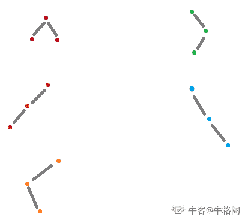
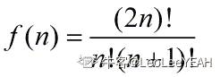
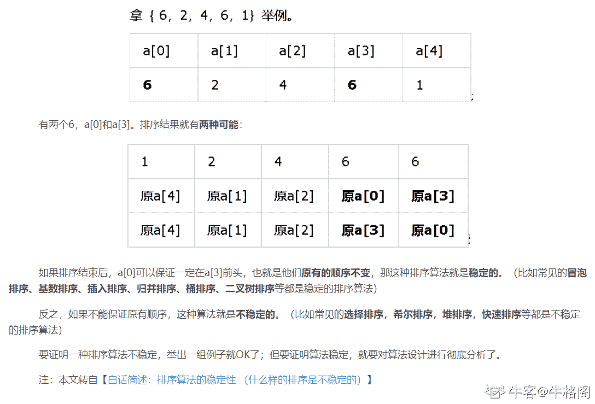

# 小米 2020 校招前端工程师笔试题二

## 1

以下哪一个不是栈的基本操作（）

正确答案: B   你的答案: 空 (错误)

```cpp
删除栈顶的元素
```

```cpp
删除栈底的元素
```

```cpp
判断栈是否为空
```

```cpp
将栈置为空栈
```

本题知识点

前端工程师 小米 2020

讨论

[夏花爱秋叶](https://www.nowcoder.com/profile/4085682)

每当要把一个数字推进栈中，都是沿着"栈顶到栈底的方向"，也就是第一个元素位于栈底，最后一个进入的元素位于栈顶！！元素删除都是先删除栈顶的元素，也就是先进后出，后进先出

发表于 2020-02-09 23:23:28

* * *

## 2

设散列表中有 m 个储存单元，散列函数 H(key) = key % p，则 p 最好选择（）

正确答案: A   你的答案: 空 (错误)

```cpp
小于等于 m 的最大素数
```

```cpp
小于等于 m 的最大奇数
```

```cpp
小于等于 m 的最大偶数
```

```cpp
小于等于 m 的最大合数
```

本题知识点

前端工程师 小米 2020

讨论

[牛客 459241333 号](https://www.nowcoder.com/profile/459241333)

自己记录一下
最简单的哈希算法可以用取模运算，模一般设置为素数，虽然很多书上讲使用素数能够减小冲突，但是并没有讲为什么会减小冲突，下面通过几个实例来说明一下。 

 选取模为 6，7

> 6 为合数，有因子 1，2，3，6
> 
> 7 为素数，有因子 1，7

合数除了 1 与本身，还有其他的因子，所以我们考虑使用不同的因子来构造数列。

编辑于 2021-10-14 09:32:47

* * *

## 3

具有 3 个结点的二叉树有（）种

正确答案: C   你的答案: 空 (错误)

```cpp
3
```

```cpp
4
```

```cpp
5
```

```cpp
6
```

本题知识点

前端工程师 小米 2020

讨论

[牛格阁求 offer](https://www.nowcoder.com/profile/9471556)



发表于 2020-01-22 18:42:35

* * *

[LeoLeeYEAH](https://www.nowcoder.com/profile/927783005)

卡特兰数



发表于 2021-08-25 16:11:53

* * *

## 4

以下哪些排序算法是不稳定排序算法（）

正确答案: B C   你的答案: 空 (错误)

```cpp
冒泡排序
```

```cpp
堆排序
```

```cpp
快速排序
```

```cpp
归并排序
```

本题知识点

前端工程师 小米 2020

讨论

[oaoaoaoa_](https://www.nowcoder.com/profile/803154)

"快选一些好朋友堆在一起聊天吧" 快：快速排序； 选：选择排序； 些：希尔排序； 堆：堆排序

发表于 2020-03-26 16:42:53

* * *

[牛格阁求 offer](https://www.nowcoder.com/profile/9471556)

**转：**



发表于 2020-01-22 19:07:03

* * *

[喃喃呐呐](https://www.nowcoder.com/profile/979887643)

稳定的排序算法：直接插入排序、冒泡排序、归并排序
不稳定的排序算法：希尔排序、快速排序、选择排序、堆排序

发表于 2020-09-08 16:34:43

* * *

## 5

不论线性表采用顺序存储结构还是链式存储结构，删除值为 X 的结点的时间复杂度均为 O(n)（）

正确答案: A   你的答案: 空 (错误)

```cpp
正确
```

```cpp
错误
```

本题知识点

前端工程师 小米 2020

讨论

[牛客 969651329 号](https://www.nowcoder.com/profile/969651329)

顺序存储：查找节点 O(1)，删除节点 O(n) 链式存储：查找节点 O(n)，删除节点 O(1)

发表于 2021-04-08 20:44:39

* * *

[牛客 945861317 号](https://www.nowcoder.com/profile/945861317)

它说的是删除某个值 没说告知索引 不是要遍历比较 找到值的位置嘛

发表于 2021-04-19 10:45:59

* * *

[买尔旦江](https://www.nowcoder.com/profile/752368982)

都是要遍历的

发表于 2020-02-26 22:48:59

* * *

## 6

下面代码的时间复杂度是（）

```cpp
int foo(int n) {
    if (n <= 1) return 1;
    return n * foo(n - 1);
}
```

正确答案: B   你的答案: 空 (错误)

```cpp
O(log(n))
```

```cpp
O(n)
```

```cpp
O(n * log(n))
```

```cpp
O(n²)
```

本题知识点

前端工程师 小米 2020

讨论

[被迫谋生](https://www.nowcoder.com/profile/217164647)

计算 n 的阶乘需要计算 n 次

发表于 2020-02-19 21:42:29

* * *

[KL 科粒](https://www.nowcoder.com/profile/332789)

看起来这个 return 的内容，会让整个递归有些像是链表的结构，所以会有 O(n)； 而有些 return 的内容，比如斐波那契数列，会让整个递归是个二叉树的形状 所以会 2^n

发表于 2021-02-10 21:03:23

* * *

## 7

如下哪个 Linux 命令用于修改文件的权限属性？

正确答案: B   你的答案: 空 (错误)

```cpp
attrib
```

```cpp
chmod
```

```cpp
 change
```

```cpp
file
```

本题知识点

前端工程师 小米 2020

讨论

[喃喃呐呐](https://www.nowcoder.com/profile/979887643)

权限命令
chmod：更改文件 9 个属性 chown：更改文件属主，也可以同时更改文件属组
chgrp：更改文件属组。umask 设置预设的权限掩码

发表于 2020-09-08 16:35:51

* * *

[新心一](https://www.nowcoder.com/profile/924319767)

chomd 改变文件或目录的访问权限 file 辨识该文件的类型

发表于 2020-08-06 09:35:02

* * *

## 8

IPv4 地址由（）位二进制数组成

正确答案: B   你的答案: 空 (错误)

```cpp
16
```

```cpp
32
```

```cpp
64
```

```cpp
128
```

本题知识点

前端工程师 小米 2020

讨论

[牛格阁求 offer](https://www.nowcoder.com/profile/9471556)

IPV4:32 位 IPV6:128 位

发表于 2020-01-22 18:55:29

* * *

[喃喃呐呐](https://www.nowcoder.com/profile/979887643)

IPV4:32 位 IPV6:128 位

发表于 2020-09-08 16:46:31

* * *

## 9

浏览器访问某页面，HTTP 协议返回状态码为 403 时表示：（）

正确答案: B   你的答案: 空 (错误)

```cpp
找不到该页面
```

```cpp
禁止访问
```

```cpp
内部服务器访问
```

```cpp
服务器繁忙
```

本题知识点

前端工程师 小米 2020

讨论

[牛格阁求 offer](https://www.nowcoder.com/profile/9471556)

**转：**

当用户试图通过 HTTP 访问一台正在运行 Internet 信息服务 (IIS) 的服务器上的内容时，IIS 返回一个表示该请求的状态的数字代码。状态代码可以指明具体请求是否已成功，还可以揭示请求失败的确切原因。
1xx - 信息提示

这些状态代码表示临时的响应。客户端在收到常规响应之前，应准备接收一个或多个 1xx 响应。
· 100 - Continue 初始的请求已经接受，客户应当继续发送请求的其余部分。（HTTP 1.1 新）
· 101 - Switching Protocols 服务器将遵从客户的请求转换到另外一种协议（HTTP 1.1 新）

2xx - 成功

这类状态代码表明服务器成功地接受了客户端请求。
· 200 - OK 一切正常，对 GET 和 POST 请求的应答文档跟在后面。
· 201 - Created 服务器已经创建了文档，Location 头给出了它的 URL。
· 202 - Accepted 已经接受请求，但处理尚未完成。
· 203 - Non-Authoritative Information 文档已经正常地返回，但一些应答头可能不正确，因为使用的是文档的拷贝，非权威性信息（HTTP 1.1 新）。
· 204 - No Content 没有新文档，浏览器应该继续显示原来的文档。如果用户定期地刷新页面，而 Servlet 可以确定用户文档足够新，这个状态代码是很有用的。
· 205 - Reset Content 没有新的内容，但浏览器应该重置它所显示的内容。用来强制浏览器清除表单输入内容（HTTP 1.1 新）。
· 206 - Partial Content 客户发送了一个带有 Range 头的 GET 请求，服务器完成了它（HTTP 1.1 新）。

3xx - 重定向

客户端浏览器必须采取更多操作来实现请求。例如，浏览器可能不得不请求服务器上的不同的页面，或通过***服务器重复该请求。
· 300 - Multiple Choices 客户请求的文档可以在多个位置找到，这些位置已经在返回的文档内列出。如果服务器要提出优先选择，则应该在 Location 应答头指明。
· 301 - Moved Permanently 客户请求的文档在其他地方，新的 URL 在 Location 头中给出，浏览器应该自动地访问新的 URL。
· 302 - Found 类似于 301，但新的 URL 应该被视为临时性的替代，而不是永久性的。注意，在 HTTP1.0 中对应的状态信息是“Moved Temporatily”。出现该状态代码时，浏览器能够自动访问新的 URL，因此它是一个很有用的状态代码。注意这个状态代码有时候可以和 301 替换使用。例如，如果浏览器错误地请求 http://host/~user （缺少了后面的斜杠），有的服务器返回 301，有的则返回 302。严格地说，我们只能假定只有当原来的请求是 GET 时浏览器才会自动重定向。请参见 307。
· 303 - See Other 类似于 301/302，不同之处在于，如果原来的请求是 POST，Location 头指定的重定向目标文档应该通过 GET 提取（HTTP 1.1 新）。
· 304 - Not Modified 客户端有缓冲的文档并发出了一个条件性的请求（一般是提供 If-Modified-Since 头表示客户只想比指定日期更新的文档）。服务器告诉客户，原来缓冲的文档还可以继续使用。
· 305 - Use Proxy 客户请求的文档应该通过 Location 头所指明的***服务器提取（HTTP 1.1 新）。
· 307 - Temporary Redirect 和 302（Found）相同。许多浏览器会错误地响应 302 应答进行重定向，即使原来的请求是 POST，即使它实际上只能在 POST 请求的应答是 303 时才能重定向。由于这个原因，HTTP 1.1 新增了 307，以便更加清除地区分几个状态代码：当出现 303 应答时，浏览器可以跟随重定向的 GET 和 POST 请求；如果是 307 应答，则浏览器只能跟随对 GET 请求的重定向。（HTTP 1.1 新）

4xx - 客户端错误

发生错误，客户端似乎有问题。例如，客户端请求不存在的页面，客户端未提供有效的身份验证信息。

· 400 - Bad Request 请求出现语法错误。

· 401 - Unauthorized 访问被拒绝，客户试图未经授权访问受密码保护的页面。应答中会包含一个 WWW-Authenticate 头，浏览器据此显示用户名字/密码对话框，然后在填写合适的 Authorization 头后再次发出请求。IIS 定义了许多不同的 401 错误，它们指明更为具体的错误原因。这些具体的错误代码在浏览器中显示，但不在 IIS 日志中显示：
· 401.1 - 登录失败。
· 401.2 - 服务器配置导致登录失败。
· 401.3 - 由于 ACL 对资源的限制而未获得授权。
· 401.4 - 筛选器授权失败。
· 401.5 - ISAPI/CGI 应用程序授权失败。
· 401.7 – 访问被 Web 服务器上的 URL 授权策略拒绝。这个错误代码为 IIS 6.0 所专用。

· 403 - Forbidden 资源不可用。服务器理解客户的请求，但拒绝处理它。通常由于服务器上文件或目录的权限设置导致。禁止访问：IIS 定义了许多不同的 403 错误，它们指明更为具体的错误原因：

· 403.1 - 执行访问被禁止。
· 403.2 - 读访问被禁止。
· 403.3 - 写访问被禁止。
· 403.4 - 要求 SSL。
· 403.5 - 要求 SSL 128。
· 403.6 - IP 地址被拒绝。
· 403.7 - 要求客户端证书。
· 403.8 - 站点访问被拒绝。
· 403.9 - 用户数过多。
· 403.10 - 配置无效。
· 403.11 - 密码更改。
· 403.12 - 拒绝访问映射表。
· 403.13 - 客户端证书被吊销。
· 403.14 - 拒绝目录列表。
· 403.15 - 超出客户端访问许可。
· 403.16 - 客户端证书不受信任或无效。
· 403.17 - 客户端证书已过期或尚未生效。
· 403.18 - 在当前的应用程序池中不能执行所请求的 URL。这个错误代码为 IIS 6.0 所专用。
· 403.19 - 不能为这个应用程序池中的客户端执行 CGI。这个错误代码为 IIS 6.0 所专用。
· 403.20 - Passport 登录失败。这个错误代码为 IIS 6.0 所专用。

· 404 - Not Found 无法找到指定位置的资源。这也是一个常用的应答。
· 404.0 -（无） – 没有找到文件或目录。
· 404.1 - 无法在所请求的端口上访问 Web 站点。
· 404.2 - Web 服务扩展锁定策略阻止本请求。
· 404.3 - MIME 映射策略阻止本请求。

· 405 - Method Not Allowed 请求方法（GET、POST、HEAD、Delete、PUT、TRACE 等）对指定的资源不适用，用来访问本页面的 HTTP 谓词不被允许（方法不被允许）（HTTP 1.1 新）
· 406 - Not Acceptable 指定的资源已经找到，但它的 MIME 类型和客户在 Accpet 头中所指定的不兼容，客户端浏览器不接受所请求页面的 MIME 类型（HTTP 1.1 新）。
· 407 - Proxy Authentication Required 要求进行***身份验证，类似于 401，表示客户必须先经过***服务器的授权。（HTTP 1.1 新）
· 408 - Request Timeout 在服务器许可的等待时间内，客户一直没有发出任何请求。客户可以在以后重复同一请求。（HTTP 1.1 新）
· 409 - Conflict 通常和 PUT 请求有关。由于请求和资源的当前状态相冲突，因此请求不能成功。（HTTP 1.1 新）
· 410 - Gone 所请求的文档已经不再可用，而且服务器不知道应该重定向到哪一个地址。它和 404 的不同在于，返回 407 表示文档永久地离开了指定的位置，而 404 表示由于未知的原因文档不可用。（HTTP 1.1 新）
· 411 - Length Required 服务器不能处理请求，除非客户发送一个 Content-Length 头。（HTTP 1.1 新）
· 412 - Precondition Failed 请求头中指定的一些前提条件失败（HTTP 1.1 新）。
· 413 – Request Entity Too Large 目标文档的大小超过服务器当前愿意处理的大小。如果服务器认为自己能够稍后再处理该请求，则应该提供一个 Retry-After 头（HTTP 1.1 新）。
· 414 - Request URI Too Long URI 太长（HTTP 1.1 新）。
· 415 – 不支持的媒体类型。
· 416 – Requested Range Not Satisfiable 服务器不能满足客户在请求中指定的 Range 头。（HTTP 1.1 新）
· 417 – 执行失败。
· 423 – 锁定的错误。

5xx - 服务器错误

服务器由于遇到错误而不能完成该请求。

· 500 - Internal Server Error 服务器遇到了意料不到的情况，不能完成客户的请求。

· 500.12 - 应用程序正忙于在 Web 服务器上重新启动。
· 500.13 - Web 服务器太忙。
· 500.15 - 不允许直接请求 Global.asa。
· 500.16 – UNC 授权凭据不正确。这个错误代码为 IIS 6.0 所专用。
· 500.18 – URL 授权存储不能打开。这个错误代码为 IIS 6.0 所专用。
· 500.100 - 内部 ASP 错误。

· 501 - Not Implemented 服务器不支持实现请求所需要的功能，页眉值指定了未实现的配置。例如，客户发出了一个服务器不支持的 PUT 请求。

· 502 - Bad Gateway 服务器作为网关或者***时，为了完成请求访问下一个服务器，但该服务器返回了非法的应答。 亦说 Web 服务器用作网关或***服务器时收到了无效响应。

· 502.1 - CGI 应用程序超时。
· 502.2 - CGI 应用程序出错。

· 503 - Service Unavailable 服务不可用，服务器由于维护或者负载过重未能应答。例如，Servlet 可能在[数据库](http://lib.csdn.net/base/mysql)连接池已满的情况下返回 503。服务器返回 503 时可以提供一个 Retry-After 头。这个错误代码为 IIS 6.0 所专用。

· 504 - Gateway Timeout 网关超时，由作为***或网关的服务器使用，表示不能及时地从远程服务器获得应答。（HTTP 1.1 新） 。

· 505 - HTTP Version Not Supported 服务器不支持请求中所指明的 HTTP 版本。（HTTP 1.1 新）。

发表于 2020-01-22 18:59:42

* * *

[被迫谋生](https://www.nowcoder.com/profile/217164647)

A 不用说，CD 跟服务器有关一般是 5 开头

发表于 2020-02-19 21:47:11

* * *

[猫猫儿](https://www.nowcoder.com/profile/862913360)

404

发表于 2020-01-18 15:16:45

* * *

## 10

查看当前代码在 git 服务器的分支列表，git 命令为：（）

正确答案: C   你的答案: 空 (错误)

```cpp
git branch -a
```

```cpp
git branch -d
```

```cpp
git branch -r
```

```cpp
git branch -s
```

本题知识点

前端工程师 小米 2020

讨论

[牛格阁求 offer](https://www.nowcoder.com/profile/9471556)

转：

一、Git 本地常用操作指令

1、创建 git 库

git init  #在当前目录中生成一个.git 目录（含有.git 目录的目录即是 git 仓库）

2、注册 git 用户

--->用于在团队合作开发中，表明代码作者。

git config --global user.name XXX  #用户名

git config --global user.email XXX   #用户邮箱

git config --list  #查看用户信息

注：加--global，全局设置。

3、向 git 库添加修改

git add [path］ #会把对应目录或文件，添加到 stage 状态
git add .  #会把当前所有的 untrack files 和 changed but not updated 添加到 stage 状态

实际上是为修改内容添加 index 索引。

4、向版本库提交修改

git commit –m “XXXX”     #提交修改,添加注释

注：git 提示： 未有 add 红色字体，未有 commit 绿色字体，已提交则 worktree 是干净的

5、查看当前代码库的状态

git status

6、查看版本信息

--->实际是查看修改提交信息

git log

git log --graph  #以图形化（节点）展示当前 git 库的提交信息。

7、查看指定版本信息

git show sdjf974654dd….  #(show 后面为每次提交系统自动生成的一串哈希值)

git show sdji97 #一般只使用版本号的前几个字符即可

8、撤销修改

git reset
（1）撤销整体修改
git reset --hard  #回到原来编辑的地方,改动会丢失。（同样适用于团队对于其他人
的修改恢复）

git reset --hard sdv143kvf…... #可回到指定的版本#(hard 后面为每次提交系统自
动生成的一串哈希值)
     git reset [path] 会改变 path 指定的文件或目录的 stage 状态，到非 stage 状态。
     git reset 会将所有 stage 的文件状态，都改变成非 stage 状态。

（2）撤销某次修改
    回退 1 个 change 的写法就是 git reset HEAD^，
    2 个为 HEAD^^，
    3 个为 HEAD~3，以此类推。

9、向远端库推送修改（提交修改）

git push origin 分支名

10、暂存修改

git stash 可以把当前的改动（stage 和 unstage，但不包括 untrack 的文件）暂存。

然后通过 git stash list 查看。

并通过 git stash apply 重新取出来。但 apply 之前要保证 worktree 是干净的。

二、Git 团队开发常用操作指令

1、获取远端库项目

git  clone/pull

2、团队开发的基本流程（多分支合并一个分支）

git add .   #添加改动的文件
git commit  #（提交至本地）
git pull --rebase  #（将服务器项目与本地项目合并）
git push    #（将本地项目上传至远端库）
（在提交前要 git pull --rebase 一下，确保当前的本地的代码为最新。）

三、Git 分支管理

1、建立分支
git branch AAA   #建立分支 AAA

2、分支切换
git checkout AAA   #从当前分支切换到 AAA 分支 (若 AAA 分支不存在，则自动新建)

3、将分支与主枝 master 合并
git checkout master   #（首先切换回主枝）
git merge AAA    #（将分支 AAA 与主枝合并）

注：git merge：默认情况下，Git 执行"快进式合并"（fast-farward merge），会直接将 Master 分支指向 Develop 分支。
使用--no-ff 参数后，会执行正常合并，在 Master 分支上生成一个新节点。为了保证版本演进的清晰（保持提交曲线为直线），建议采用这种方法。

4、当前分支查看
git branch    #默认有 master（也称为主枝）
git branch -r  #查看远端库分支
git branch –a  #查看当前所有分支（包括本地分支和远端库分支）

5、删除分支
git branch –d  AAA   #删除分支 AAA

6、切下远端库 A 分支到本地库 A 分支

git checkout -b  A origin/A  （若本地 A 分支不存在，则自动新建）

注：上面只是一些基本的操作命令，更多的命令可通过帮助文档查询。
         帮助文档的使用：
man git-<需查询的指令>      #（git 后面有“-”）
    如 commit 的查询为  man git-commit

发表于 2020-01-22 19:02:29

* * *

[2heal](https://www.nowcoder.com/profile/377918320)

git branch    查看本地分支
git branch -r    查看远程分支
git branch –a    查看当前所有分支（包括本地分支和远程分支）

发表于 2020-03-04 12:20:33

* * *

## 3

具有 3 个结点的二叉树有（）种

正确答案: C   你的答案: 空 (错误)

```cpp
3
```

```cpp
4
```

```cpp
5
```

```cpp
6
```

本题知识点

前端工程师 小米 2020

讨论

[牛格阁求 offer](https://www.nowcoder.com/profile/9471556)


发表于 2020-01-22 18:42:35

* * *

[LeoLeeYEAH](https://www.nowcoder.com/profile/927783005)

卡特兰数


发表于 2021-08-25 16:11:53

* * *

## 4

以下哪些排序算法是不稳定排序算法（）

正确答案: B C   你的答案: 空 (错误)

```cpp
冒泡排序
```

```cpp
堆排序
```

```cpp
快速排序
```

```cpp
归并排序
```

本题知识点

前端工程师 小米 2020

讨论

[oaoaoaoa_](https://www.nowcoder.com/profile/803154)

"快选一些好朋友堆在一起聊天吧" 快：快速排序； 选：选择排序； 些：希尔排序； 堆：堆排序

发表于 2020-03-26 16:42:53

* * *

[牛格阁求 offer](https://www.nowcoder.com/profile/9471556)

**转：**


发表于 2020-01-22 19:07:03

* * *

[喃喃呐呐](https://www.nowcoder.com/profile/979887643)

稳定的排序算法：直接插入排序、冒泡排序、归并排序
不稳定的排序算法：希尔排序、快速排序、选择排序、堆排序

发表于 2020-09-08 16:34:43

* * *

## 13

不论线性表采用顺序存储结构还是链式存储结构，删除值为 X 的结点的时间复杂度均为 O(n)。

正确答案: A   你的答案: 空 (错误)

```cpp
正确
```

```cpp
错误
```

本题知识点

前端工程师 小米 2020

## 14

下面代码的时间复杂度是（）

```cpp
int foo(int n) {
    if (n <= 1) return 1;
    return n * foo(n - 1);
}
```

正确答案: B   你的答案: 空 (错误)

```cpp
 O(log(n))
```

```cpp
O(n)
```

```cpp
 O(n * log(n))
```

```cpp
O(n²)
```

本题知识点

前端工程师 小米 2020

讨论

[喃喃呐呐](https://www.nowcoder.com/profile/979887643)

计算 n 的阶乘

发表于 2020-09-08 16:36:29

* * *

## 15

如下哪个 Linux 命令用于修改文件的权限属性？（）

正确答案: B   你的答案: 空 (错误)

```cpp
 attrib
```

```cpp
chmod
```

```cpp
 change
```

```cpp
file
```

本题知识点

前端工程师 小米 2020

讨论

[牛客 138099207 号](https://www.nowcoder.com/profile/138099207)

b

发表于 2020-05-17 20:14:58

* * *

## 16

 IPv4 地址由（）位二进制数组成

正确答案: B   你的答案: 空 (错误)

```cpp
16
```

```cpp
32
```

```cpp
64
```

```cpp
128
```

本题知识点

前端工程师 小米 2020

讨论

[我不是胖球球](https://www.nowcoder.com/profile/7088956)

IPV4 32 位；IPV6 128 位

发表于 2021-11-29 21:04:03

* * *

## 9

浏览器访问某页面，HTTP 协议返回状态码为 403 时表示：（）

正确答案: B   你的答案: 空 (错误)

```cpp
找不到该页面
```

```cpp
禁止访问
```

```cpp
内部服务器访问
```

```cpp
服务器繁忙
```

本题知识点

前端工程师 小米 2020

讨论

[牛格阁求 offer](https://www.nowcoder.com/profile/9471556)

**转：**

当用户试图通过 HTTP 访问一台正在运行 Internet 信息服务 (IIS) 的服务器上的内容时，IIS 返回一个表示该请求的状态的数字代码。状态代码可以指明具体请求是否已成功，还可以揭示请求失败的确切原因。
1xx - 信息提示

这些状态代码表示临时的响应。客户端在收到常规响应之前，应准备接收一个或多个 1xx 响应。
· 100 - Continue 初始的请求已经接受，客户应当继续发送请求的其余部分。（HTTP 1.1 新）
· 101 - Switching Protocols 服务器将遵从客户的请求转换到另外一种协议（HTTP 1.1 新）

2xx - 成功

这类状态代码表明服务器成功地接受了客户端请求。
· 200 - OK 一切正常，对 GET 和 POST 请求的应答文档跟在后面。
· 201 - Created 服务器已经创建了文档，Location 头给出了它的 URL。
· 202 - Accepted 已经接受请求，但处理尚未完成。
· 203 - Non-Authoritative Information 文档已经正常地返回，但一些应答头可能不正确，因为使用的是文档的拷贝，非权威性信息（HTTP 1.1 新）。
· 204 - No Content 没有新文档，浏览器应该继续显示原来的文档。如果用户定期地刷新页面，而 Servlet 可以确定用户文档足够新，这个状态代码是很有用的。
· 205 - Reset Content 没有新的内容，但浏览器应该重置它所显示的内容。用来强制浏览器清除表单输入内容（HTTP 1.1 新）。
· 206 - Partial Content 客户发送了一个带有 Range 头的 GET 请求，服务器完成了它（HTTP 1.1 新）。

3xx - 重定向

客户端浏览器必须采取更多操作来实现请求。例如，浏览器可能不得不请求服务器上的不同的页面，或通过***服务器重复该请求。
· 300 - Multiple Choices 客户请求的文档可以在多个位置找到，这些位置已经在返回的文档内列出。如果服务器要提出优先选择，则应该在 Location 应答头指明。
· 301 - Moved Permanently 客户请求的文档在其他地方，新的 URL 在 Location 头中给出，浏览器应该自动地访问新的 URL。
· 302 - Found 类似于 301，但新的 URL 应该被视为临时性的替代，而不是永久性的。注意，在 HTTP1.0 中对应的状态信息是“Moved Temporatily”。出现该状态代码时，浏览器能够自动访问新的 URL，因此它是一个很有用的状态代码。注意这个状态代码有时候可以和 301 替换使用。例如，如果浏览器错误地请求 http://host/~user （缺少了后面的斜杠），有的服务器返回 301，有的则返回 302。严格地说，我们只能假定只有当原来的请求是 GET 时浏览器才会自动重定向。请参见 307。
· 303 - See Other 类似于 301/302，不同之处在于，如果原来的请求是 POST，Location 头指定的重定向目标文档应该通过 GET 提取（HTTP 1.1 新）。
· 304 - Not Modified 客户端有缓冲的文档并发出了一个条件性的请求（一般是提供 If-Modified-Since 头表示客户只想比指定日期更新的文档）。服务器告诉客户，原来缓冲的文档还可以继续使用。
· 305 - Use Proxy 客户请求的文档应该通过 Location 头所指明的***服务器提取（HTTP 1.1 新）。
· 307 - Temporary Redirect 和 302（Found）相同。许多浏览器会错误地响应 302 应答进行重定向，即使原来的请求是 POST，即使它实际上只能在 POST 请求的应答是 303 时才能重定向。由于这个原因，HTTP 1.1 新增了 307，以便更加清除地区分几个状态代码：当出现 303 应答时，浏览器可以跟随重定向的 GET 和 POST 请求；如果是 307 应答，则浏览器只能跟随对 GET 请求的重定向。（HTTP 1.1 新）

4xx - 客户端错误

发生错误，客户端似乎有问题。例如，客户端请求不存在的页面，客户端未提供有效的身份验证信息。

· 400 - Bad Request 请求出现语法错误。

· 401 - Unauthorized 访问被拒绝，客户试图未经授权访问受密码保护的页面。应答中会包含一个 WWW-Authenticate 头，浏览器据此显示用户名字/密码对话框，然后在填写合适的 Authorization 头后再次发出请求。IIS 定义了许多不同的 401 错误，它们指明更为具体的错误原因。这些具体的错误代码在浏览器中显示，但不在 IIS 日志中显示：
· 401.1 - 登录失败。
· 401.2 - 服务器配置导致登录失败。
· 401.3 - 由于 ACL 对资源的限制而未获得授权。
· 401.4 - 筛选器授权失败。
· 401.5 - ISAPI/CGI 应用程序授权失败。
· 401.7 – 访问被 Web 服务器上的 URL 授权策略拒绝。这个错误代码为 IIS 6.0 所专用。

· 403 - Forbidden 资源不可用。服务器理解客户的请求，但拒绝处理它。通常由于服务器上文件或目录的权限设置导致。禁止访问：IIS 定义了许多不同的 403 错误，它们指明更为具体的错误原因：

· 403.1 - 执行访问被禁止。
· 403.2 - 读访问被禁止。
· 403.3 - 写访问被禁止。
· 403.4 - 要求 SSL。
· 403.5 - 要求 SSL 128。
· 403.6 - IP 地址被拒绝。
· 403.7 - 要求客户端证书。
· 403.8 - 站点访问被拒绝。
· 403.9 - 用户数过多。
· 403.10 - 配置无效。
· 403.11 - 密码更改。
· 403.12 - 拒绝访问映射表。
· 403.13 - 客户端证书被吊销。
· 403.14 - 拒绝目录列表。
· 403.15 - 超出客户端访问许可。
· 403.16 - 客户端证书不受信任或无效。
· 403.17 - 客户端证书已过期或尚未生效。
· 403.18 - 在当前的应用程序池中不能执行所请求的 URL。这个错误代码为 IIS 6.0 所专用。
· 403.19 - 不能为这个应用程序池中的客户端执行 CGI。这个错误代码为 IIS 6.0 所专用。
· 403.20 - Passport 登录失败。这个错误代码为 IIS 6.0 所专用。

· 404 - Not Found 无法找到指定位置的资源。这也是一个常用的应答。
· 404.0 -（无） – 没有找到文件或目录。
· 404.1 - 无法在所请求的端口上访问 Web 站点。
· 404.2 - Web 服务扩展锁定策略阻止本请求。
· 404.3 - MIME 映射策略阻止本请求。

· 405 - Method Not Allowed 请求方法（GET、POST、HEAD、Delete、PUT、TRACE 等）对指定的资源不适用，用来访问本页面的 HTTP 谓词不被允许（方法不被允许）（HTTP 1.1 新）
· 406 - Not Acceptable 指定的资源已经找到，但它的 MIME 类型和客户在 Accpet 头中所指定的不兼容，客户端浏览器不接受所请求页面的 MIME 类型（HTTP 1.1 新）。
· 407 - Proxy Authentication Required 要求进行***身份验证，类似于 401，表示客户必须先经过***服务器的授权。（HTTP 1.1 新）
· 408 - Request Timeout 在服务器许可的等待时间内，客户一直没有发出任何请求。客户可以在以后重复同一请求。（HTTP 1.1 新）
· 409 - Conflict 通常和 PUT 请求有关。由于请求和资源的当前状态相冲突，因此请求不能成功。（HTTP 1.1 新）
· 410 - Gone 所请求的文档已经不再可用，而且服务器不知道应该重定向到哪一个地址。它和 404 的不同在于，返回 407 表示文档永久地离开了指定的位置，而 404 表示由于未知的原因文档不可用。（HTTP 1.1 新）
· 411 - Length Required 服务器不能处理请求，除非客户发送一个 Content-Length 头。（HTTP 1.1 新）
· 412 - Precondition Failed 请求头中指定的一些前提条件失败（HTTP 1.1 新）。
· 413 – Request Entity Too Large 目标文档的大小超过服务器当前愿意处理的大小。如果服务器认为自己能够稍后再处理该请求，则应该提供一个 Retry-After 头（HTTP 1.1 新）。
· 414 - Request URI Too Long URI 太长（HTTP 1.1 新）。
· 415 – 不支持的媒体类型。
· 416 – Requested Range Not Satisfiable 服务器不能满足客户在请求中指定的 Range 头。（HTTP 1.1 新）
· 417 – 执行失败。
· 423 – 锁定的错误。

5xx - 服务器错误

服务器由于遇到错误而不能完成该请求。

· 500 - Internal Server Error 服务器遇到了意料不到的情况，不能完成客户的请求。

· 500.12 - 应用程序正忙于在 Web 服务器上重新启动。
· 500.13 - Web 服务器太忙。
· 500.15 - 不允许直接请求 Global.asa。
· 500.16 – UNC 授权凭据不正确。这个错误代码为 IIS 6.0 所专用。
· 500.18 – URL 授权存储不能打开。这个错误代码为 IIS 6.0 所专用。
· 500.100 - 内部 ASP 错误。

· 501 - Not Implemented 服务器不支持实现请求所需要的功能，页眉值指定了未实现的配置。例如，客户发出了一个服务器不支持的 PUT 请求。

· 502 - Bad Gateway 服务器作为网关或者***时，为了完成请求访问下一个服务器，但该服务器返回了非法的应答。 亦说 Web 服务器用作网关或***服务器时收到了无效响应。

· 502.1 - CGI 应用程序超时。
· 502.2 - CGI 应用程序出错。

· 503 - Service Unavailable 服务不可用，服务器由于维护或者负载过重未能应答。例如，Servlet 可能在[数据库](http://lib.csdn.net/base/mysql)连接池已满的情况下返回 503。服务器返回 503 时可以提供一个 Retry-After 头。这个错误代码为 IIS 6.0 所专用。

· 504 - Gateway Timeout 网关超时，由作为***或网关的服务器使用，表示不能及时地从远程服务器获得应答。（HTTP 1.1 新） 。

· 505 - HTTP Version Not Supported 服务器不支持请求中所指明的 HTTP 版本。（HTTP 1.1 新）。

发表于 2020-01-22 18:59:42

* * *

[被迫谋生](https://www.nowcoder.com/profile/217164647)

A 不用说，CD 跟服务器有关一般是 5 开头

发表于 2020-02-19 21:47:11

* * *

[猫猫儿](https://www.nowcoder.com/profile/862913360)

404

发表于 2020-01-18 15:16:45

* * *

## 18

查看当前代码在 git 服务器的分支列表，git 命令为：（）

正确答案: C   你的答案: 空 (错误)

```cpp
git branch -a
```

```cpp
git branch -d
```

```cpp
 git branch -r
```

```cpp
git branch -s
```

本题知识点

前端工程师 小米 2020

## 19

代表不区分大小写的正则表达式附加参数是（）

正确答案: A   你的答案: 空 (错误)

```cpp
i
```

```cpp
g
```

```cpp
m
```

```cpp
s
```

本题知识点

前端工程师 小米 2020

讨论

[被迫谋生](https://www.nowcoder.com/profile/217164647)

i 不区分大小写模式 m 多行模式 g 全局模式 无 s

发表于 2020-02-19 21:55:26

* * *

[向着光芒的女孩。](https://www.nowcoder.com/profile/770073)

i   代表不区分大小写字母 g  代表全局搜索匹配内容 m 代表将多行的每一行视为单行匹配，主要配合开始^和结尾的$边界符使用 s  代表将所有内容视为一行匹配，这样的话就可以用点.来匹配所有字符了所以选 A

发表于 2020-09-29 17:51:37

* * *

## 20

以下 Javascript 代码的运行结果是（）

```cpp
let name = 'outer'
function showName() {
  console.log(name)
  let name = 'inner'
}
name = 'updatedOuter'
showName()
```

正确答案: D   你的答案: 空 (错误)

```cpp
outer
```

```cpp
inner
```

```cpp
updatedOuter
```

```cpp
ReferenceError
```

本题知识点

前端工程师 小米 2020

讨论

[Zzceaon](https://www.nowcoder.com/profile/869284380)

ES6 中有明确的规定：如果区块中存在 let 和 const 命令，这个区块对这些命令声明的变量，从一开始就形成了封闭作用域。假如我们尝试在声明前去使用这类变量，就会报错。showName 函数内，let name = 'inner'上面的区域就为暂时性死区。

发表于 2020-09-16 00:25:14

* * *

[8 点半](https://www.nowcoder.com/profile/690556949)

let 同一个作用域不能重复定义同一个名称，所以报错

发表于 2020-02-13 18:37:15

* * *

[free__](https://www.nowcoder.com/profile/681826329)

let const 存在 暂时性死区

发表于 2020-03-15 15:00:46

* * *

## 21

以下关于事件监听器的说法正确的是（）

正确答案: C D   你的答案: 空 (错误)

```cpp
e.target 获取的是直接绑定监听器的 DOM 元素
```

```cpp
通常 addEventListener 的第三个参数默认为 true，也就是采用冒泡模式
```

```cpp
通过使用事件代理可以提高性能，也有较好的可扩展性
```

```cpp
事件捕获和事件冒泡的顺序是先捕获后冒泡
```

本题知识点

前端工程师 小米 2020

讨论

[夏花爱秋叶](https://www.nowcoder.com/profile/4085682)

1\. e.target 获取的是触发该事件的元素，也就是点击事件绑定了 ul,但是点了 ul 里面的 li,那么 target 指的是 li2\. e.currentTarget 获取的是绑定事件的元素，虽然点击的是 ul 的子元素 li,但是 currentTarget 获取的是 ul3\. addEventListener 有三个参数，第三个参数默认是 false,也就是默认事件句柄在冒泡阶段执行 4\. 因此第三个参数为 true 就是让事件句柄在捕获阶段执行

发表于 2020-02-10 00:04:18

* * *

[喃喃呐呐](https://www.nowcoder.com/profile/979887643)

e.target 获取的是触发该事件的元素 addEventListener 有三个参数，第三个参数默认是 false,也就是默认冒泡

发表于 2020-09-08 16:38:27

* * *

[2heal](https://www.nowcoder.com/profile/377918320)

e.currentTarget 是指注册了事件***的对象 e.target 是指对象里的子对象，实际触发这个事件的对象

发表于 2020-03-04 12:33:44

* * *

## 22

调用数组的以下哪些方法，可能会改变原数组的值（）

正确答案: A B C   你的答案: 空 (错误)

```cpp
sort
```

```cpp
reverse
```

```cpp
splice
```

```cpp
slice
```

本题知识点

前端工程师 小米 2020

讨论

[喃喃呐呐](https://www.nowcoder.com/profile/979887643)

sort 排序，reverse 颠倒，splice 方法向/从数组中添加/删除项目，然后返回被删除的项目,slice 截取，返回新的字符串

发表于 2020-09-08 16:39:01

* * *

[欢乐马 dudu](https://www.nowcoder.com/profile/592180446)

整理 array 的 mutator methods:

*   sort
*   splice
*   reverse
*   shift/unshift/pop/push
*   fill/copyWithin
    参考[MDN](https://developer.mozilla.org/en-US/docs/Web/JavaScript/Reference/Global_Objects/Array)

发表于 2020-03-11 21:14:21

* * *

[kinjaze123](https://www.nowcoder.com/profile/517864889)

```cpp
arrayObject.slice(start,end)
```

返回一个新的数组，包含从 start 到 end （不包括该元素）的 arrayObject 中的元素。

发表于 2020-08-06 12:06:06

* * *

## 23

常见的浏览器内核有（）

正确答案: A B D   你的答案: 空 (错误)

```cpp
Trident
```

```cpp
Webkit
```

```cpp
Chrome
```

```cpp
Gecko
```

本题知识点

前端工程师 小米 2020

讨论

[喃喃呐呐](https://www.nowcoder.com/profile/979887643)

1.Trident,国内很多的双核浏览器的其中一核便是 Trident， IE、傲游、猎豹安全浏览器、360 极速浏览器、百度浏览器等。Window10 发布后，IE 将其内置浏览器命名为 Edge，Edge 最显著的特点就是新内核 EdgeHTML。  2.Gecko ,Mozilla FireFox(火狐浏览器) 采用该内核，Gecko 的特点是代码完全公开，因此，其可开发程度很高 3.WebkitSafari 是苹果公司开发的浏览器，所用浏览器内核的名称是大名鼎鼎的 WebKit。4.Bink,内置于 Chrome 浏览器之中。Blink 其实是 WebKit 的分支。5.Presto 是挪威产浏览器 opera 的 "前任" 内核

发表于 2020-09-08 16:43:07

* * *

[rogn](https://www.nowcoder.com/profile/8088451)

只知道 chrome 不是内核名

发表于 2020-02-26 22:00:32

* * *

[果字旁的唐](https://www.nowcoder.com/profile/116064753)

额(⊙o⊙)…看到评论区。。。。只听说过谷歌旗下的 Chrome 浏览器 和 苹果的 safair 浏览器用的是同一个内核 webkit 不过现在分道扬镳了，谷歌的 Chrome 浏览器换用 blink 内核，希望分清楚浏览器名 和 内核名称（Chrome 内核？？？）其他两个貌似并非常见，（阿糖不服，申请对线）

编辑于 2020-02-18 22:50:29

* * *

## 24

以下 Javascript 代码的运行结果是（）

```cpp
console.log(Number.MAX_VALUE > 0, Number.MIN_VALUE < 0)
```

正确答案: B   你的答案: 空 (错误)

```cpp
true true
```

```cpp
true false
```

```cpp
false true
```

```cpp
false false
```

本题知识点

前端工程师 小米 2020

讨论

[夏花爱秋叶](https://www.nowcoder.com/profile/4085682)

MAX_VALUE 属性值接近于 1.79E+308。大于 MAX_VALUE 的值代表 "Infinity"。MIN_VALUE 的值约为 5e-324。小于 MIN_VALUE ("underflow values") 的值将会转换为 0。(注意，MIN_VALUE 也是大于 0 的！！！) 

发表于 2020-02-10 00:06:50

* * *

[可口 coco](https://www.nowcoder.com/profile/263662460)

MIN_VALUE 属性是 JavaScript 中可表示的最小的数（接近 0 ，但不是负数）。它的近似值为 5 x 10^(-324)。

发表于 2020-01-25 21:08:50

* * *

## 25

以下哪些 CSS 代码可以设置右外边距为 10px？

正确答案: A C   你的答案: 空 (错误)

```cpp
margin: 0 10px
```

```cpp
margin: 10px 0 0 0
```

```cpp
margin: 0 10px 0 0
```

```cpp
padding-right: 10px
```

本题知识点

前端工程师 小米 2020

讨论

[oaoaoaoa_](https://www.nowcoder.com/profile/803154)

把 padding-right 看成了 margin-right...

发表于 2020-03-26 16:50:16

* * *

[被迫谋生](https://www.nowcoder.com/profile/217164647)

两个值就分别代表 上下， 左右 四个值的话从上开始顺时针转:上右下左

发表于 2020-02-19 22:12:56

* * *

[牛客 647027656 号](https://www.nowcoder.com/profile/647027656)

然而并没说让设左外边距吧

发表于 2020-06-30 21:14:33

* * *

## 26

以下哪些 CSS 代码可以给 span 元素设置宽高？

正确答案: A C D   你的答案: 空 (错误)

```cpp
display: block; width: 300px; height: 200px;
```

```cpp
position: relative; width: 300px; height: 200px;
```

```cpp
display: flex; width: 300px; height: 200px;
```

```cpp
display: table; width: 300px; height: 200px;
```

本题知识点

前端工程师 小米 2020

讨论

[worenhenhao](https://www.nowcoder.com/profile/284300031)

display: flex，元素的行为类似块级元素，并根据 flexbox 模型布置其内容。display: table，让元素有类似<table>一样的表现，它定义了一个块级元素。来自：[`developer.mozilla.org/en-US/docs/Web/CSS/display`](https://developer.mozilla.org/en-US/docs/Web/CSS/display)

发表于 2020-07-24 14:58:27

* * *

[牛客 459241333 号](https://www.nowcoder.com/profile/459241333)

谢谢！
display: flex，元素的行为类似块级元素，并根据 flexbox 模型布置其内容。display: table，让元素有类似<table>一样的表现，它定义了一个块级元素。

发表于 2021-10-14 10:11:52

* * *

## 27

以下代码中，p 元素是什么颜色？

```cpp
<div class="a b c">
  <p class="d">test</p>
</div>
<style>
  .a .d {color: green}
  p.d {color: yellow}
  .a.b p.d {color: red}
  .a p.d {color: black}
</style>
```

正确答案: C   你的答案: 空 (错误)

```cpp
green
```

```cpp
yellow
```

```cpp
red
```

```cpp
black
```

本题知识点

前端工程师 小米 2020

讨论

[被迫谋生](https://www.nowcoder.com/profile/217164647)

class 选择器权重为 10，标签选择器权重为 1 。C 选项应该是 31 最高吧....

发表于 2020-02-19 22:22:55

* * *

[牛客 397762603 号](https://www.nowcoder.com/profile/397762603)

内联：1000；id：100；类伪类：10；标签选择器和伪元素：1

编辑于 2020-09-13 16:00:07

* * *

## 28

如下哪种前端构建技术可以剔除 Javascript 中没有被使用的代码？

正确答案: A   你的答案: 空 (错误)

```cpp
Tree Shaking
```

```cpp
Code Splitting
```

```cpp
Hot Module Replacement
```

```cpp
Source Mapping
```

本题知识点

前端工程师 小米 2020

讨论

[Patrick-Jun](https://www.nowcoder.com/profile/937331110)

Tree Shaking，晃动树，把多余的树叶摇下来

发表于 2020-03-05 22:36:49

* * *

[Zzceaon](https://www.nowcoder.com/profile/869284380)

*tree shaking* 是一个术语，通常用于描述移除 JavaScript 上下文中的未引用代码(dead-code)。它依赖于 ES2015 模块系统中的[静态结构特性](http://exploringjs.com/es6/ch_modules.html#static-module-structure)，例如 [import](https://developer.mozilla.org/en-US/docs/Web/JavaScript/Reference/Statements/import) 和 [export](https://developer.mozilla.org/en-US/docs/Web/JavaScript/Reference/Statements/export)。这个术语和概念实际上是兴起于 ES2015 模块打包工具 [rollup](https://github.com/rollup/rollup)。

发表于 2020-09-16 00:17:45

* * *

## 19

代表不区分大小写的正则表达式附加参数是（）

正确答案: A   你的答案: 空 (错误)

```cpp
i
```

```cpp
g
```

```cpp
m
```

```cpp
s
```

本题知识点

前端工程师 小米 2020

讨论

[被迫谋生](https://www.nowcoder.com/profile/217164647)

i 不区分大小写模式 m 多行模式 g 全局模式 无 s

发表于 2020-02-19 21:55:26

* * *

[向着光芒的女孩。](https://www.nowcoder.com/profile/770073)

i   代表不区分大小写字母 g  代表全局搜索匹配内容 m 代表将多行的每一行视为单行匹配，主要配合开始^和结尾的$边界符使用 s  代表将所有内容视为一行匹配，这样的话就可以用点.来匹配所有字符了所以选 A

发表于 2020-09-29 17:51:37

* * *

## 20

以下 Javascript 代码的运行结果是（）

```cpp
let name = 'outer'
function showName() {
  console.log(name)
  let name = 'inner'
}
name = 'updatedOuter'
showName()
```

正确答案: D   你的答案: 空 (错误)

```cpp
outer
```

```cpp
inner
```

```cpp
updatedOuter
```

```cpp
ReferenceError
```

本题知识点

前端工程师 小米 2020

讨论

[Zzceaon](https://www.nowcoder.com/profile/869284380)

ES6 中有明确的规定：如果区块中存在 let 和 const 命令，这个区块对这些命令声明的变量，从一开始就形成了封闭作用域。假如我们尝试在声明前去使用这类变量，就会报错。showName 函数内，let name = 'inner'上面的区域就为暂时性死区。

发表于 2020-09-16 00:25:14

* * *

[8 点半](https://www.nowcoder.com/profile/690556949)

let 同一个作用域不能重复定义同一个名称，所以报错

发表于 2020-02-13 18:37:15

* * *

[free__](https://www.nowcoder.com/profile/681826329)

let const 存在 暂时性死区

发表于 2020-03-15 15:00:46

* * *

## 31

以下关于事件监听器的说法正确的是（）

正确答案: C D   你的答案: 空 (错误)

```cpp
e.target 获取的是直接绑定监听器的 DOM 元素
```

```cpp
通常 addEventListener 的第三个参数默认为 true，也就是采用冒泡模式
```

```cpp
通过使用事件代理可以提高性能，也有较好的可扩展性
```

```cpp
事件捕获和事件冒泡的顺序是先捕获后冒泡
```

本题知识点

前端工程师 小米 2020

讨论

[喃喃呐呐](https://www.nowcoder.com/profile/979887643)

e.target 获取的是触发该事件的元素 addEventListener 有三个参数，第三个参数默认是 false,也就是默认冒泡

发表于 2020-09-08 16:44:46

* * *

[9484](https://www.nowcoder.com/profile/112194121)

e.currentTarget 是事件捕获到的当前元素。 e.target，事件元素，<button> div 绑定了事件函数，点击了这个 button 元素 e.target 元素就是 button，e.currentTarget 元素就是 div </button>

发表于 2020-09-06 10:33:44

* * *

[新心一](https://www.nowcoder.com/profile/924319767)

第三个参数是 false（默认）表示采用冒泡模式。

发表于 2020-08-06 09:24:59

* * *

## 22

调用数组的以下哪些方法，可能会改变原数组的值（）

正确答案: A B C   你的答案: 空 (错误)

```cpp
sort
```

```cpp
reverse
```

```cpp
splice
```

```cpp
slice
```

本题知识点

前端工程师 小米 2020

讨论

[喃喃呐呐](https://www.nowcoder.com/profile/979887643)

sort 排序，reverse 颠倒，splice 方法向/从数组中添加/删除项目，然后返回被删除的项目,slice 截取，返回新的字符串

发表于 2020-09-08 16:39:01

* * *

[欢乐马 dudu](https://www.nowcoder.com/profile/592180446)

整理 array 的 mutator methods:

*   sort
*   splice
*   reverse
*   shift/unshift/pop/push
*   fill/copyWithin
    参考[MDN](https://developer.mozilla.org/en-US/docs/Web/JavaScript/Reference/Global_Objects/Array)

发表于 2020-03-11 21:14:21

* * *

[kinjaze123](https://www.nowcoder.com/profile/517864889)

```cpp
arrayObject.slice(start,end)
```

返回一个新的数组，包含从 start 到 end （不包括该元素）的 arrayObject 中的元素。

发表于 2020-08-06 12:06:06

* * *

## 33

常见的浏览器内核有（）

正确答案: A B D   你的答案: 空 (错误)

```cpp
Trident
```

```cpp
Webkit
```

```cpp
 Chrome
```

```cpp
Gecko
```

本题知识点

前端工程师 小米 2020

讨论

[牛格阁求 offer](https://www.nowcoder.com/profile/9471556)

| 内核 | 浏览器 |
| Trident  | IE  |
| webkit  | Safari  |
| Blink  | Opera、Chrome  |
| Gecko  | Friefox  |

发表于 2020-01-23 19:11:31

* * *

## 34

以下 Javascript 代码的运行结果是（）

```cpp
console.log(Number.MAX_VALUE > 0, Number.MIN_VALUE < 0)
```

正确答案: B   你的答案: 空 (错误)

```cpp
true true
```

```cpp
 true false
```

```cpp
false true
```

```cpp
 false false
```

本题知识点

前端工程师 小米 2020

## 25

以下哪些 CSS 代码可以设置右外边距为 10px？

正确答案: A C   你的答案: 空 (错误)

```cpp
margin: 0 10px
```

```cpp
margin: 10px 0 0 0
```

```cpp
margin: 0 10px 0 0
```

```cpp
padding-right: 10px
```

本题知识点

前端工程师 小米 2020

讨论

[oaoaoaoa_](https://www.nowcoder.com/profile/803154)

把 padding-right 看成了 margin-right...

发表于 2020-03-26 16:50:16

* * *

[被迫谋生](https://www.nowcoder.com/profile/217164647)

两个值就分别代表 上下， 左右 四个值的话从上开始顺时针转:上右下左

发表于 2020-02-19 22:12:56

* * *

[牛客 647027656 号](https://www.nowcoder.com/profile/647027656)

然而并没说让设左外边距吧

发表于 2020-06-30 21:14:33

* * *

## 26

以下哪些 CSS 代码可以给 span 元素设置宽高？

正确答案: A C D   你的答案: 空 (错误)

```cpp
display: block; width: 300px; height: 200px;
```

```cpp
position: relative; width: 300px; height: 200px;
```

```cpp
display: flex; width: 300px; height: 200px;
```

```cpp
display: table; width: 300px; height: 200px;
```

本题知识点

前端工程师 小米 2020

讨论

[worenhenhao](https://www.nowcoder.com/profile/284300031)

display: flex，元素的行为类似块级元素，并根据 flexbox 模型布置其内容。display: table，让元素有类似<table>一样的表现，它定义了一个块级元素。来自：[`developer.mozilla.org/en-US/docs/Web/CSS/display`](https://developer.mozilla.org/en-US/docs/Web/CSS/display)

发表于 2020-07-24 14:58:27

* * *

[牛客 459241333 号](https://www.nowcoder.com/profile/459241333)

谢谢！
display: flex，元素的行为类似块级元素，并根据 flexbox 模型布置其内容。display: table，让元素有类似<table>一样的表现，它定义了一个块级元素。

发表于 2021-10-14 10:11:52

* * *

## 27

以下代码中，p 元素是什么颜色？

```cpp
<div class="a b c">
  <p class="d">test</p>
</div>
<style>
  .a .d {color: green}
  p.d {color: yellow}
  .a.b p.d {color: red}
  .a p.d {color: black}
</style>
```

正确答案: C   你的答案: 空 (错误)

```cpp
green
```

```cpp
yellow
```

```cpp
red
```

```cpp
black
```

本题知识点

前端工程师 小米 2020

讨论

[被迫谋生](https://www.nowcoder.com/profile/217164647)

class 选择器权重为 10，标签选择器权重为 1 。C 选项应该是 31 最高吧....

发表于 2020-02-19 22:22:55

* * *

[牛客 397762603 号](https://www.nowcoder.com/profile/397762603)

内联：1000；id：100；类伪类：10；标签选择器和伪元素：1

编辑于 2020-09-13 16:00:07

* * *

## 38

如下哪种前端构建技术可以剔除 Javascript 中没有被使用的代码？

正确答案: A   你的答案: 空 (错误)

```cpp
Tree Shaking
```

```cpp
 Code Splitting
```

```cpp
 Hot Module Replacement
```

```cpp
Source Mapping
```

本题知识点

前端工程师 小米 2020

讨论

[鱼鱼小鱼](https://www.nowcoder.com/profile/154932852)

*Tree Shaking*用于移除 JavaScript 上下文中的未引用代码(dead-code)。*Code Splitting*可以将代码分成多个捆绑包，然后可以按需或并行加载。 *模块热替换(HMR - hot module replacement)*会在应用程序运行过程中，替换、添加或删除模块，而无需重新加载整个页面。 *Source Mapping*是从已转换的代码映射到原始源的文件，使浏览器能够重构原始源并在调试器中显示重建的原始源 

编辑于 2020-03-12 11:06:21

* * *

[牛客 5576582 号](https://www.nowcoder.com/profile/5576582)

A

发表于 2021-08-09 18:46:59

* * *

[永葆初心](https://www.nowcoder.com/profile/42360659)

A

发表于 2020-09-08 15:36:48

* * *