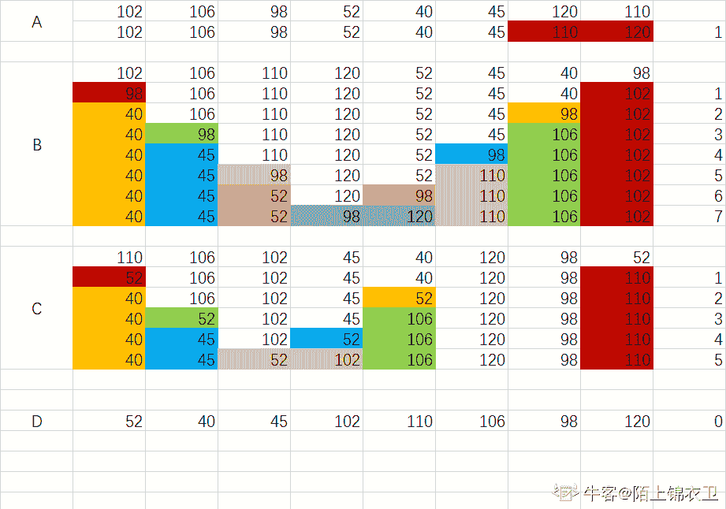
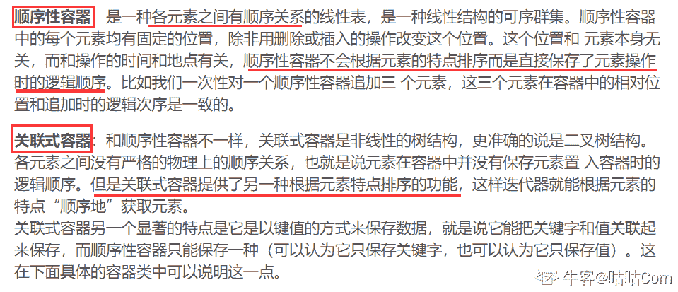
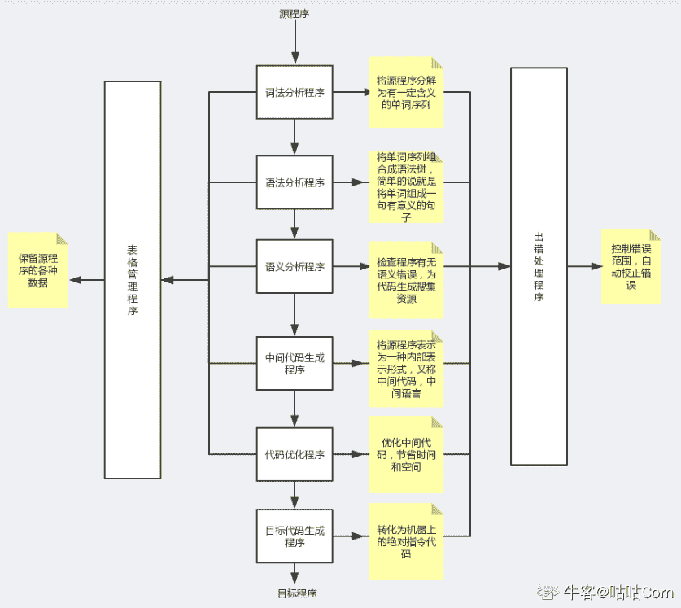

# 小米 2020 校招软件开发工程师笔试题一

## 1

下列关于设计模式说法错误的是（  ）

正确答案: B   你的答案: 空 (错误)

```cpp
装饰器模式在实现过程中一般不会更改被封装对象的接口定义
```

```cpp
适配器模式以不改变被适配对象的接口定义为目的对其进行改造
```

```cpp
用饿汉方式实现的单列模式是不能够被继承的
```

```cpp
简单工厂模式可以实现按客户端条件动态创建对象的效果
```

本题知识点

Java 工程师 C++工程师 小米 2020

讨论

[牛客 679640210 号](https://www.nowcoder.com/profile/679640210)

这到底是 java 的题目还是 c++的题目。。。

发表于 2020-02-22 17:34:58

* * *

[vicyor](https://www.nowcoder.com/profile/2210832)

1.装饰器模式(Decorator Pattern) 允许向一个现有的对象添加新的功能(ps:是对象,可以通过构造器注入),同时又不改变其结构.   例子: java 中的 I/O 流 2.适配器模式(Adapter Pattern) 是两个不兼容接口之间的桥梁.   这种模式涉及一个单一的类(被适配对象),该类负责加入独立的或不兼容的接口.3.饿汉模式是类加载会触发初始化创造示例,创建的是父类对象,若继承的话，创建的依旧是父类对象.4.简单工厂模式可以实现按照客户端动态条件创造对象.

发表于 2020-02-14 11:41:55

* * *

[咕咕 Corn](https://www.nowcoder.com/profile/6866427)

B.适配器没有对被适配对象的接口进行改造，而是建立一个适配器，在这个适配器中实现了目标接口并包含有被适配者的引用。C.饿汉方式中的单例模式的构造函数是 private，所以不能被继承。

发表于 2020-09-08 14:31:27

* * *

## 2

从尚未排序的 N 名学生的考试分数中挑出排名第 K 的分数，平均时间复杂度最优可以达到多少？（  ）

正确答案: C   你的答案: 空 (错误)

```cpp
O(N*K)
```

```cpp
O(N*logN)
```

```cpp
O(N)
```

```cpp
O(N²)
```

本题知识点

Java 工程师 C++工程师 小米 2020

讨论

[vicyor](https://www.nowcoder.com/profile/2210832)

基于快排的思想,时间复杂度近似为 O(N).   1.以左端为 pivot,每次 partition 确定基准的最终位置并将数组分为 leftArr 和 rightArr.   2.若划分后的位置 p>k,则从 leftArr 中继续找第 k 大.      若划分后的位置 p<k,则从 rightArr 中找第 k-p 大.      若划分后的位置 p==k,则返回 arr[p].

发表于 2020-02-14 12:03:44

* * *

[哎呀我好菜](https://www.nowcoder.com/profile/247775678)

考试成绩说明是有限范围内的数，就可以用堆排序或者计数排序，复杂度都是 O(n+k），  约等于 0（n）

发表于 2020-03-09 11:23:51

* * *

## 3

在下列序列中，若以最后一个数字为基准进行快速排序（升序），第一趟数字被移动次数最多的是（）

正确答案: B   你的答案: 空 (错误)

```cpp
102, 106, 98, 52, 40, 45, 120, 110
```

```cpp
102, 106, 110, 120, 52, 45, 40, 98
```

```cpp
110, 106, 102, 45, 40, 120, 98, 52
```

```cpp
52, 40, 45, 102, 110, 106, 98, 120
```

本题知识点

Java 工程师 C++工程师 小米 2020

讨论

[陌上锦衣卫](https://www.nowcoder.com/profile/327658856)



编辑于 2020-09-07 22:28:43

* * *

[牛客 380846183 号](https://www.nowcoder.com/profile/380846183)

个人理解，供大家参考 A. 第一趟有 1 对数字交换 B. 4 对数字交换 C. 3 对数字交换 D. 无交换数字被移动的次数越多说明轴值 pivot 选择越理想（即数值大小处于中间位置）

发表于 2020-09-14 10:03:15

* * *

[ypqhappy](https://www.nowcoder.com/profile/274908649)

第一个移动次数：1 次；第二个移动次数：7 次；第三个移动次数：5 次；第四个移动次数：0 次；

发表于 2020-11-26 09:18:28

* * *

## 4

1，2，3，4，5 五个数字，能组成多少种不同的二叉搜索树的结构？（  ）

正确答案: D   你的答案: 空 (错误)

```cpp
32
```

```cpp
36
```

```cpp
40
```

```cpp
42
```

本题知识点

Java 工程师 C++工程师 小米 2020

讨论

[WMYW](https://www.nowcoder.com/profile/222543223)

n=2,有 f(2)=f(0)f(1)+f(1)(0)，除去根节点，f(0)f(1)表示左子树和右子树的数量，f(1)=1,初始化 f(0)=1,则 f(2)=2n=3,有 f(3)=f(2)f(0)+f(1)f(1)+f(0)f(2)三种情况，其中 f(2)=2,则 f(3)=5n=4,有 f(4)=f(0)f(3)+f(1)(2)+f(2)f(1)+f(3)(0)，则 f(4)=14n=5,有 f(5)=f(0)f(4)+f(1)f(3)+f(2)f(2)+f(3)f(1)+f(4)f(0)，则 f(5)=42

发表于 2020-03-27 12:55:35

* * *

[露西恩缇努维尔](https://www.nowcoder.com/profile/408614969)

卡塔兰数：

发表于 2020-08-29 11:14:47

* * *

[/混元形意太极门掌门人/](https://www.nowcoder.com/profile/403031927)

二叉树才是 42...二叉排序树不是 42 吧

发表于 2020-02-04 11:30:22

* * *

## 5

下面关于有向无环图说法错误的是?（  ）

正确答案: D   你的答案: 空 (错误)

```cpp
有向无环图至少有一个顶点入度为 0
```

```cpp
有向无环图至少有一个顶点出度为 0
```

```cpp
有向无环图至少有一个拓扑排序
```

```cpp
有向无环图可以转换成树
```

本题知识点

Java 工程师 C++工程师 小米 2020

讨论

[牛客 772413086 号](https://www.nowcoder.com/profile/772413086)

树的节点的父节点只能是一个，而无环图的节点可以有多个入度（父节点）

发表于 2020-08-01 16:03:06

* * *

[咕咕 Corn](https://www.nowcoder.com/profile/6866427)

有向图中一个点经过两种路线到达另一个点未必形成环，但是它不能转化成树。但是任何有向树均为有向无环图。

发表于 2020-09-08 15:09:44

* * *

## 6

以下说法正确的有（  ）

正确答案: A B D   你的答案: 空 (错误)

```cpp
1 个堆栈可以通过 1 个数组或者 1 个单向链表来实现，出栈和入栈的均摊复杂度均为 O(1)
```

```cpp
1 个先进先出队列可以通过 1 个数组或者 1 个单向链表来实现，出队和入队的均摊复杂度均为 O(1)
```

```cpp
1 个堆栈可以通过 2 个先进先出队列来实现, 出栈和入栈的均摊复杂度均为 O(1)
```

```cpp
1 个先进先出队列可以通过 2 个堆栈来实现，出队和入队的均摊复杂度均为 O(1)
```

本题知识点

Java 工程师 C++工程师 小米 2020

讨论

[西瓜 lz](https://www.nowcoder.com/profile/309124112)

D 不太对吧   出队操作复杂度为 O(n)才对啊  

发表于 2020-02-20 13:33:52

* * *

[vicyor](https://www.nowcoder.com/profile/2210832)

A. 堆栈用单向链表实现    1，2，3，4，5，6      => 6->5->4->3->2->1(前插)D.FIFO --->S1(入栈),S2(出栈)  2 个栈可以改变顺序   1,2,3,4,5,6   =>  1,2,3,4,5,6(s1) ;  6,5,4,3,2,1(s2);

发表于 2020-02-14 12:38:30

* * *

## 7

UNIQUE 惟一索引的作用是（  ）

正确答案: C   你的答案: 空 (错误)

```cpp
保证惟一索引不能被删除
```

```cpp
保证各行在该索引上的值不得为 NULL
```

```cpp
保证各行在该索引上的值都不得重复
```

```cpp
保证参加惟一索引的各列，不得再参加其他的索引
```

本题知识点

Java 工程师 C++工程师 小米 2020

## 8

数据库表 a 主键为 id，共 10 行，表 b 存在关联列 aid，共 5 行，以下查询

```cpp
select count(1) from a left join b on a.id = b.aid
```

可能的结果为（  ）

正确答案: B   你的答案: 空 (错误)

```cpp
5
```

```cpp
10
```

```cpp
15
```

```cpp
50
```

本题知识点

Java 工程师 C++工程师 小米 2020

讨论

[vicyor](https://www.nowcoder.com/profile/2210832)

 tb1 left join  tb2  on tb1.xx=tb2.xx 1.会返回左表所有的行,   其中被 on 条件选择的行会与右表匹配输出.   未被 on 条件选择的行只输出左表的行(右表为 null).

发表于 2020-02-14 12:48:46

* * *

[ypqhappy](https://www.nowcoder.com/profile/274908649)

左连接不论是否为 null，都保留左表结构

发表于 2020-11-26 08:43:31

* * *

[牛客 848476880 号](https://www.nowcoder.com/profile/848476880)

左连接，最少 10,最多 14

发表于 2020-11-23 00:07:51

* * *

## 9

在一个真实的计算机系统中，资源会损坏或被替换，新的进程会进入和离开系统，新的资源会被购买和添加到系统中。如果用银行家算法控制死锁，下面哪些变化是安全的（不会导致可能的死锁）？（  ）

正确答案: A D   你的答案: 空 (错误)

```cpp
增加可用资源（新的资源被添加到系统）
```

```cpp
减少可用资源（资源被从系统中永久性地移出）
```

```cpp
增加一个进程的 Max（进程需要更多的资源，超过所允许给予的资源）
```

```cpp
减少一个进程的 Max（进程不再需要那么多资源）
```

本题知识点

Java 工程师 C++工程师 小米 2020

讨论

[xlwmfh](https://www.nowcoder.com/profile/904927089)

答案应该是 AD，导致死锁的原因为系统可以使用的资源不满足进程所需资源。所以可以增加可用资源或者减少进程所需资源

发表于 2020-04-17 11:36:12

* * *

[牛客 772413086 号](https://www.nowcoder.com/profile/772413086)

完美错开正确答案

发表于 2020-08-01 15:59:27

* * *

[yiwenwen](https://www.nowcoder.com/profile/720529663)

A 为什么是不安全的？

编辑于 2020-09-08 21:19:42

* * *

## 10

在一个真实的计算机系统中，可用的资源和进程命令对资源的要求都不会持续很久是一致的长期（几个月）。资源会损坏或被替换，新的进程会进入和离开系统，新的资源会被购买和添加到系统中。如果用银行家算法控制死锁，下面哪 些变化是安全的（不会导致可能的死锁）？（   ）

正确答案: A D   你的答案: 空 (错误)

```cpp
增加可用资源（新的资源被添加到系统）
```

```cpp
减少可用资源（资源被从系统中永久性地移出）
```

```cpp
增加一个进程的 Max（进程需要更多的资源，超过所允许给予的资源）
```

```cpp
减少一个进程的 Max（进程不再需要那么多资源）
```

本题知识点

Java 工程师 C++工程师 小米 2020

讨论

[只想吃软饭](https://www.nowcoder.com/profile/912753691)

跪了😂

发表于 2020-08-15 19:34:50

* * *

[Mr.106](https://www.nowcoder.com/profile/644910704)

这两道题完美蒙对，我太有才了😂

发表于 2020-12-15 14:24:23

* * *

[孤鸥](https://www.nowcoder.com/profile/306280730)

不对吧，操作系统概念第七版原题 7.5

发表于 2020-09-16 15:10:20

* * *

## 11

在 C++中，声明 int const** const * const x 表示 x 是什么类型？

正确答案: C   你的答案: 空 (错误)

```cpp
一个 const 数组，每个成员都是一个 const 二维 int 类型 const 数组
```

```cpp
一个 const 指针，指向一个 const 双层指针，指向一个 int
```

```cpp
一个 const 指针，指向一个 const 指针，指向一个普通指针，指向一个 const int
```

```cpp
一个 const 指针，指向一个 const 指针，指向一个 const int，它存着一个指针
```

本题知识点

Java 工程师 C++工程师 小米 2020

讨论

[new 世界](https://www.nowcoder.com/profile/975497557)

从最里层往外看，它是一个 const 指针
往外走一层，上层指针指向的是一个 const 的指针
再往外走一层，挖掉里面两层的剩下 int const * x，这是一个指针，它指向的一个不可更改的 int 数据
所以结合起来，应该是是一个 const 指针，指向一个 const 指针，指向一个普通指针，指向一个 const int。

发表于 2020-03-16 21:57:12

* * *

[计算机俱乐部](https://www.nowcoder.com/profile/9375023)

求解

发表于 2020-02-19 17:02:44

* * *

[null1997](https://www.nowcoder.com/profile/640679460)

是我错了~~

发表于 2020-01-22 22:51:55

* * *

## 12

以下问题错误的是（   ）

正确答案: B   你的答案: 空 (错误)

```cpp
类不是在类定义里定义数据成员时初始化数据成员，而是通过构造函数控制初始化。
```

```cpp
extern double pi=3.14 此声明没有分配及初始化存储空间
```

```cpp
变量或函数的定义尽量不要放在头文件中。因为头文件包含在多个源文件中，所以不应该含有变量或函数的定义
```

```cpp
const 对象可以定义在头文件中
```

本题知识点

Java 工程师 C++工程师 小米 2020

讨论

[Mouse_Zhang](https://www.nowcoder.com/profile/201160449)

```cpp
class A {
private:
	int x = 123;
public:
	A(){}
	int X() { return this->x; }
	virtual ~A(){}
};

```

我认为 A 是错的

发表于 2020-09-14 14:13:36

* * *

[依昂](https://www.nowcoder.com/profile/920832473)

如果在变量定义的时候就初始化，那么会给变量分配及初始化存储空间

发表于 2020-09-07 14:22:52

* * *

## 13

下面关于虚函数的描述中，正确的是（  ）

正确答案: A B C   你的答案: 空 (错误)

```cpp
虚函数必须是非静态成员函数。
```

```cpp
对于虚函数，virtual 关键字只能出现在类定义中的函数原型声明中，不能出现在类体外的函数定义中.
```

```cpp
根据类型兼容规则，基类指针(或引用)可以指向其派生类的实例，但在非虚函数的情况下，通过基类指针(或引用)却只能调用基类的函数成员，无法调用其所指实例(派生类)的函数成员。
```

```cpp
对于多态类，应该将构造函数和析构函数都声明为虚函数。
```

本题知识点

Java 工程师 C++工程师 小米 2020

讨论

[ANNGH](https://www.nowcoder.com/profile/547878357)

构造函数不能声明为虚函数,析构函数可以声明为虚函数,而且有时是必须声明为虚函数。

发表于 2020-09-08 17:10:42

* * *

## 14

下面 STL 容器中，哪些是有序的（  ）

正确答案: B D   你的答案: 空 (错误)

```cpp
vector
```

```cpp
map
```

```cpp
stack
```

```cpp
set
```

本题知识点

Java 工程师 C++工程师 小米 2020

讨论

[牛皮啊](https://www.nowcoder.com/profile/486508553)

为什么我避开了所有正确答案

发表于 2020-09-14 19:42:38

* * *

[铁路人](https://www.nowcoder.com/profile/746078452)

1\. vector 的底层实现就是一个自动扩展的数组，如果元素本身无序，那么存储的时候也是无序的；2\. stack 的底层实现就是一个限制输入输出位置的 deque 双端队列，所以 stack 里面的数据无序的时候，存储的时候也是无序的；3\. map 和 set 的底层实现都是红黑树，红黑树是一种没那么严格的平衡二叉树（平衡二叉树肯定是排序二叉树），但是红黑树里面的元素肯定是有序的；

发表于 2020-09-15 14:23:19

* * *

[咕咕 Corn](https://www.nowcoder.com/profile/6866427)

或许是这个意思？

编辑于 2020-09-08 15:23:46

* * *

## 15

下列程序有错误的是？（  ）

正确答案: A B C   你的答案: 空 (错误)

```cpp
abstract class Something {
private abstract String doSomething ();
}

```

```cpp
public class Something {
void doSomething () {
private String s = "";
int l = s.length();
}
}

```

```cpp
abstract class Name {
private String name;
public abstract boolean isSomething(String name){};
}

```

```cpp
public class Something {
public static void main(String[] args) {
Thing t = new Thing();
new Something().addOne(t);
}
public void addOne(final Thing t) {
t.i++;
}
}
class Thing {
public int i;
}

```

本题知识点

Java 工程师 C++工程师 小米 2020

讨论

[vicyor](https://www.nowcoder.com/profile/2210832)

A.private 修饰方法不能被重写,虚函数必须被重写.B.局部变量不应该有访问修饰符.C.实方法不能用 abstract 修饰.

发表于 2020-02-14 12:59:27

* * *

[xiaoxiaoid](https://www.nowcoder.com/profile/2842076)

c 选项没有 return 语句，应该也通不过编译吧

发表于 2020-10-28 16:51:10

* * *

## 16

Java 虚拟机里提供了哪些调用字节指令（）

正确答案: A B C   你的答案: 空 (错误)

```cpp
invokestatic
```

```cpp
invokespecial
```

```cpp
invokevirtual
```

```cpp
invokemethod
```

本题知识点

Java 工程师 C++工程师 小米 2020

讨论

[vicyor](https://www.nowcoder.com/profile/2210832)

invokestatic       静态方法 invokespecial    构造方法,private 方法,父类方法.invokevirtual,invokeinterface    调用重写的方法(动态单分派).invokedynamic  动态类型语言,动态方法调用(lambda 表达式)

发表于 2020-02-14 13:04:47

* * *

## 17

在 Python 3 中，对于字符编码叙述正确的是（）

正确答案: B   你的答案: 空 (错误)

```cpp
str 为 unicode 字符（内部编码 utf-16），byte 编码为 utf-8
```

```cpp
str 为 unicode 字符（内部编码 utf-16），byte 无编码
```

```cpp
str 编码为 utf-16，byte 为 utf-8
```

```cpp
str 编码为 utf-8，byte 无编码
```

本题知识点

Java 工程师 C++工程师 小米 2020

讨论

[求 offer 疯狂轰炸我](https://www.nowcoder.com/profile/2164604)

这套卷子是 C++卷子吗？

发表于 2020-08-02 16:56:35

* * *

[python 天王](https://www.nowcoder.com/profile/393528309)

这个不是 python 的题

发表于 2021-05-28 19:35:58

* * *

[叶秋 q](https://www.nowcoder.com/profile/666430636)

str 是 unicode 字符，但是编码格式不是 utf-8 吗？

发表于 2020-02-24 17:10:15

* * *

## 18

编译程序目标代码生成阶段主要任务是（）

正确答案: D   你的答案: 空 (错误)

```cpp
把高级语言翻译成汇编语言
```

```cpp
把高级语言翻译成机器语言
```

```cpp
把汇编语言翻译成机器语言
```

```cpp
把中间代码变换成依赖具体机器的目标代码
```

本题知识点

Java 工程师 C++工程师 小米 2020

讨论

[vicyor](https://www.nowcoder.com/profile/2210832)

在 Java 语言中,即时编译器(JIT Compiler)将 Java 的字节码(byte code,一个字节的命令)转换为可以直接发送给处理器的指令的程序(机器指令),

发表于 2020-02-14 13:10:11

* * *

[露西恩缇努维尔](https://www.nowcoder.com/profile/408614969)

三短一长选最长。

发表于 2020-08-29 11:18:08

* * *

## 19

在 X86 平台上，C 语言函数调用时，通过以下哪种方式传递参数？

正确答案: C   你的答案: 空 (错误)

```cpp
寄存器
```

```cpp
内存
```

```cpp
堆栈
```

```cpp
变量地址
```

本题知识点

Java 工程师 C++工程师 小米 2020

讨论

[ypqhappy](https://www.nowcoder.com/profile/274908649)

函数的参数放在程序堆栈中。

发表于 2020-11-25 21:09:49

* * *

## 20

编译程序不仅包含词法分析、语法分析、中间代码生成、目标代码生成，还包括（）

正确答案: A B D   你的答案: 空 (错误)

```cpp
代码优化
```

```cpp
表格管理
```

```cpp
源代码优化
```

```cpp
出错处理
```

本题知识点

Java 工程师 C++工程师 小米 2020

讨论

[咕咕 Corn](https://www.nowcoder.com/profile/6866427)

转自：[`blog.csdn.net/Yuudachi/article/details/104096421`](https://blog.csdn.net/Yuudachi/article/details/104096421)

发表于 2020-09-08 15:31:12

* * *