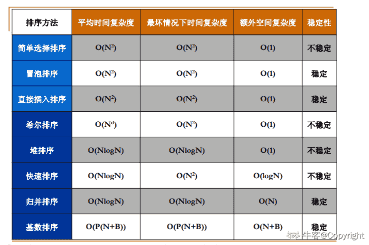
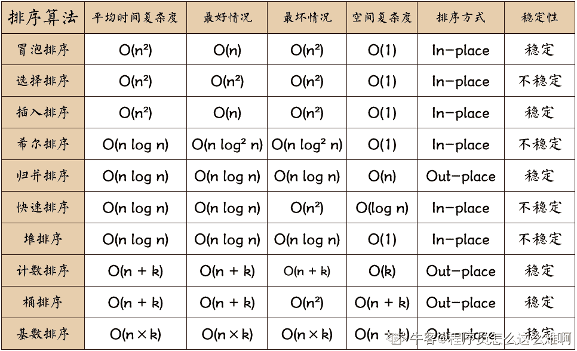
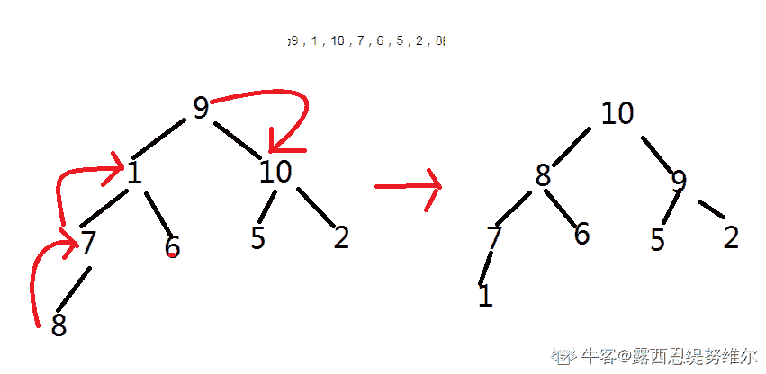
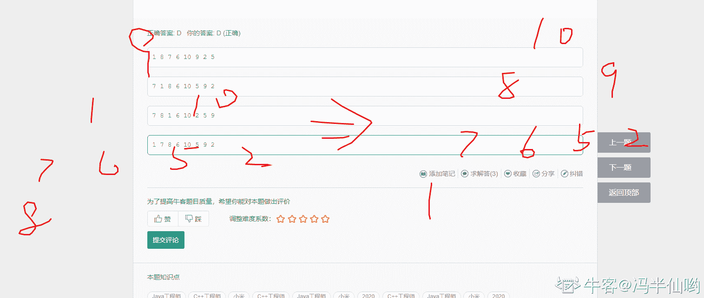
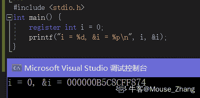
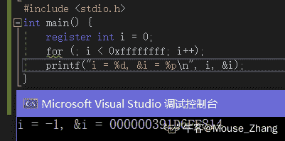
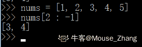

# 小米 2020 校招软件开发工程师笔试题二

## 1

计算大于 n(n>1)的最小的斐波那契数，以下划线出应填入

```cpp
function f(n:int){
int[] a = new int[2];
a[0] = a[1] = 1;
int i =1 ;
while(true){
i = (i + 1)%2
a[i] = ______
If(a[i] > n){
return a[i]
}
}
}
```

正确答案: B   你的答案: 空 (错误)

```cpp
a[i] + a[i + 1]
```

```cpp
a[i % 2] + a[(i+1)%2]
```

```cpp
a[i] + a[i -1]
```

```cpp
a[i%2] + a[(i-1)%2]
```

本题知识点

Java 工程师 C++工程师 小米 2020

讨论

[程序员怎么这么难啊](https://www.nowcoder.com/profile/427041550)

a[]的大小是 2，所以只有 a[0],a[1],当 i = 0 时(i 为奇数),a[i - 1]越界，i = 1 时，a[i + 1]越界，因此排除 ACD

发表于 2020-09-07 10:21:01

* * *

[牛客 665320450 号](https://www.nowcoder.com/profile/665320450)

转：[`blog.csdn.net/Yuudachi/article/details/104090132`](https://blog.csdn.net/Yuudachi/article/details/104090132)

发表于 2020-05-03 10:24:05

* * *

[牛客 848476880 号](https://www.nowcoder.com/profile/848476880)

考查数组越界。循环两次便可排除 acd

发表于 2020-11-09 20:41:22

* * *

## 2

```cpp
void fun(int n) {
int i=2;
while(i<=n)
i=i*i;
}
```

复杂度（）

正确答案: D   你的答案: 空 (错误)

```cpp
O(n)
```

```cpp
O(n2)
```

```cpp
O(√n)
```

```cpp
O(log2n)
```

本题知识点

Java 工程师 C++工程师 小米 2020

讨论

[拼命也要幸福](https://www.nowcoder.com/profile/171607642)

[`blog.csdn.net/kangkang_hacker/article/details/80904695`](https://blog.csdn.net/kangkang_hacker/article/details/80904695)

发表于 2020-02-06 21:03:34

* * *

[活的稻草人](https://www.nowcoder.com/profile/972840976)

这个题答案有问题吧，log2n 那个不应该是 i = i * 2 这种吗？

发表于 2020-09-14 16:07:25

* * *

[牛客 902711271 号](https://www.nowcoder.com/profile/902711271)

这题答案有问题啊，i=i*i，这不是摆明了根号 n 吗

发表于 2021-03-21 14:47:10

* * *

## 3

下面关于树的遍历算法说法错误的是?（）

正确答案: A B   你的答案: 空 (错误)

```cpp
先序遍历属于广度优先遍历算法
```

```cpp
中序遍历属于广度优先遍历算法
```

```cpp
中序遍历属于深度优先遍历算法
```

```cpp
后序遍历属于深度优先遍历算法
```

本题知识点

Java 工程师 C++工程师 小米 2020

讨论

[WOW 你懂我意思吧](https://www.nowcoder.com/profile/928707673)

先序，中序，后序三种应该都归为深度优先遍历算法，只有层次遍历才算广度优先遍历算法

编辑于 2020-08-13 10:24:45

* * *

[露西恩缇努维尔](https://www.nowcoder.com/profile/408614969)

一不小心选成正确的了，尴尬

发表于 2020-08-29 08:43:11

* * *

[浪矢清](https://www.nowcoder.com/profile/988576403)

说简单一些，DFS 的实现原理是递归栈，表现为递归，用栈实现；二叉树的三种遍历方式也是同理，表现为递归，用栈实现。所以，二叉树的三种序列遍历都属于 DFS。

发表于 2020-02-04 19:37:43

* * *

## 4

关于排序算法，以下的哪些叙述是正确的？（   ）

正确答案: C D   你的答案: 空 (错误)

```cpp
快速排序的最坏时间复杂度为 O(nlog(n))，它是一个不稳定排序
```

```cpp
冒泡排序的时间复杂度为 O(n²)，它是一个不稳定排序
```

```cpp
归并排序的时间复杂度为 O(nlog(n))，它需要 O(n)的额外存储空间来完成排序
```

```cpp
堆排序的最坏时间复杂度为 O(nlog(n))，它不需要额外存储空间来完成排序
```

本题知识点

Java 工程师 C++工程师 小米 2020

讨论

[你的 offer 对我打了烊](https://www.nowcoder.com/profile/598309941)

不稳定的排序方法：快 些 选 堆（快速排序，希尔排序，选择排序，堆排序）

发表于 2020-02-29 14:58:05

* * *

[Copyright](https://www.nowcoder.com/profile/6805252)



发表于 2020-03-11 22:55:29

* * *

[程序员怎么这么难啊](https://www.nowcoder.com/profile/427041550)



发表于 2020-09-07 10:27:26

* * *

## 5

初始化序列为 9，1，10，7，6，5，2，8 的一组数采用堆排序，当建大根堆完毕时，堆所对应的二叉树中序遍历序列为：（）

正确答案: D   你的答案: 空 (错误)

```cpp
1 8 7 6 10 9 2 5
```

```cpp
7 1 8 6 10 5 9 2
```

```cpp
7 8 1 6 10 2 5 9
```

```cpp
1 7 8 6 10 5 9 2
```

本题知识点

Java 工程师 C++工程师 小米 2020

讨论

[Primer___](https://www.nowcoder.com/profile/3039649)

堆的建立

1.  首先根据层次遍历把一维数组构建成一个二叉树

2.  再根据大顶堆,小顶堆的性质调节节点位置到正确位置即可 [怎么调节? 当一个父节点的左右孩子节点不满足一下各自的性质的时候,就交换这两个节点的位置,以此类推... ...]

    1.  大顶堆性质: 父节点的左右孩子都小于本身

    2.  小顶堆性质: 父节点的左右孩子都大于本身

发表于 2020-01-28 09:21:25

* * *

[露西恩缇努维尔](https://www.nowcoder.com/profile/408614969)



发表于 2020-08-29 10:23:36

* * *

[锯着木头数星星 i](https://www.nowcoder.com/profile/837275273)



发表于 2020-07-31 13:04:23

* * *

## 6

高度为 7 的完全二叉树的节点总数不可能是:（）

正确答案: D   你的答案: 空 (错误)

```cpp
128
```

```cpp
192
```

```cpp
255
```

```cpp
256
```

本题知识点

Java 工程师 C++工程师 小米 2020

讨论

[c++新手](https://www.nowcoder.com/profile/345072514)

这一题是把根节点算为高度 0 不然没答案

发表于 2020-06-22 14:05:10

* * *

[露西恩缇努维尔](https://www.nowcoder.com/profile/408614969)

当为 6 层的话，最多 2⁷-1=127 个。当为 7 层的话，最多 2⁸-1=255 个。合法的应该是[128,255]之间。D 项不满足。

发表于 2020-08-29 08:46:19

* * *

[牛客 848476880 号](https://www.nowcoder.com/profile/848476880)

请注意二叉树高度和深度的定义。树高度指根结点到叶子结点最长路径的边数。这道题显然依据此定义。高度不等于层数。所以高度为 7 的树显然是八层。

发表于 2020-11-09 23:33:26

* * *

## 7

关系数据库的事务具有下列哪些特点（）

正确答案: A C D   你的答案: 空 (错误)

```cpp
原子性
```

```cpp
并发性
```

```cpp
隔离性
```

```cpp
持久性
```

本题知识点

Java 工程师 C++工程师 小米 2020

讨论

[姚博 vinson](https://www.nowcoder.com/profile/2577961)

事务的概念可以描述为具有以下四个关键属性说成是 **ACID**：

*   **原子性（Atomicity）：**事务应该当作一个单独单元的操作，这意味着整个序列操作要么是成功，要么是失败的。

*   **一致性（consistency）：**这表示数据库的引用完整性的一致性，表中唯一的主键等。

*   **隔离性（Isolation）：**可能同时处理很多有相同的数据集的事务，每个事务应该与其他事务隔离，以防止数据损坏。

*   **持久性（Durability）：**一个事务一旦完成全部操作后，这个事务的结果必须是永久性的，不能因系统故障而从数据库中删除。

编辑于 2020-03-05 23:29:06

* * *

[拼命也要幸福](https://www.nowcoder.com/profile/171607642)

原子性：事务作为一个整体，包括在里面的数据库操作要么全执行，要么全不执行一致性：保证数据库中的数据的完整性约束，类似于银行转账隔离性：事务可以并发执行但互不干扰持久性：事务执行后对数据库的更改会永久保存在磁盘中，不会回滚

发表于 2020-02-06 22:39:57

* * *

## 8

下面笛卡尔积的基数计算正确的选项有哪些？（）

正确答案: A D   你的答案: 空 (错误)

```cpp
D1={张三，李四，王五}, D2={男，女}, D3={北京，西安}, D1xD2xD3 的基数是 12
```

```cpp
D1={月亮，地球}, D2={行星，卫星}, D3={宜居，非宜居}, D1xD2xD3 的基数是 6
```

```cpp
D1={张三，李四，王五}, D2={男，女}, D3={北京，西安}, D1xD2xD3 的基数是 7
```

```cpp
D1={张三，李四，王五}, D2={男，女}, D3={北京，西安，海南}, D1xD2xD3 的基数是 18
```

本题知识点

Java 工程师 C++工程师 小米 2020

讨论

[你的 offer 对我打了烊](https://www.nowcoder.com/profile/598309941)

基数直接乘起来，如果是问元素就加起来

发表于 2020-02-24 12:44:22

* * *

## 9

Linux 父进程在 fork 一个子进程时如下哪些行为在系统层不会发生：（）

正确答案: D   你的答案: 空 (错误)

```cpp
生成一个新的 PID
```

```cpp
复制父进程的数据
```

```cpp
执行子进程函数
```

```cpp
父进程等待子进程终止后退出
```

本题知识点

Java 工程师 C++工程师 小米 2020

讨论

[牛客 665320450 号](https://www.nowcoder.com/profile/665320450)

转：[`blog.csdn.net/nan_lei/article/details/81636473`](https://blog.csdn.net/nan_lei/article/details/81636473)

发表于 2020-05-03 14:29:28

* * *

## 10

下列描述中错误的是 ______.

正确答案: A B D   你的答案: 空 (错误)

```cpp
相比交换机，路由器可以提供更大的带宽和数据转发功能
```

```cpp
在 IP 分类地址方案中，159.226.181.1 是一个 C 类地址。
```

```cpp
IP 协议利用 TTL 控制数据传输的时延。
```

```cpp
HTTP 的长连接可以永久保持。
```

本题知识点

Java 工程师 C++工程师 小米 2020

讨论

[露西恩缇努维尔](https://www.nowcoder.com/profile/408614969)

A.交换机可以提供更大的带宽和数据转发功能。B.C 类 IP 地址范围从 192.0.0.1-223.255.255.254,所以应该是 B 类地址。D.Keep-Alive 不会永久保持连接，它有一个保持时间，可以在不同的服务器软件（如 Apache）中设定这个时间。实现长连接需要客户端和服务端都支持长连接。

发表于 2020-08-29 10:42:24

* * *

## 11

已知：print()是一个类的常成员函数，无返回值，下列表示中正确的是（）

正确答案: A   你的答案: 空 (错误)

```cpp
void print () const;
```

```cpp
const void print ();
```

```cpp
void const print ();
```

```cpp
void print (const);
```

本题知识点

Java 工程师 C++工程师 小米 2020

讨论

[Jinx 爱吃鱼](https://www.nowcoder.com/profile/56382776)

放在前面的 const 修饰返回值，后面修饰成员函数

发表于 2020-09-15 17:39:48

* * *

[村雨遥](https://www.nowcoder.com/profile/806383223)

const 修饰类的成员函数，则该成员函数不能修改类中任何非 const 成员函数，一般写在函数的最后来修饰

发表于 2020-09-15 17:16:52

* * *

## 12

下面关于 C++异常处理描述中，错误的是（）

正确答案: A   你的答案: 空 (错误)

```cpp
当异常处理语句找到一个匹配的 catch 异常处理后，将从对应的 try 块开始到异常被抛掷处之间构造(且尚未析构)的所有栈对象和堆对象进行析构，这一过程称为解旋。
```

```cpp
一个异常安全的函数，在有异常抛出时不应泄露任何资源，且不能使任何对象进入非法状态。
```

```cpp
为实现异常安全的编程，应尽量确保析构函数不抛掷异常。
```

```cpp
函数声明“void fun() throw();”表示该函数不抛掷任何类型异常；若无异常接口声明，则此函数可以抛掷任何类型的异常。
```

本题知识点

Java 工程师 C++工程师 小米 2020

讨论

[Xyg-](https://www.nowcoder.com/profile/69629948)

栈解旋：当发生异常时，从进入 try 块后，到异常被抛掷前，这期间在栈上的构造的所有对象都会被自动析构。析构的顺序与构造的顺序相反，这一过程被称为栈的解旋。**A 项多了堆对象。**

发表于 2020-02-23 10:56:14

* * *

## 13

下面代码段存在致命问题的是单选()

正确答案: A   你的答案: 空 (错误)

```cpp
#include <stdio.h>

register int i = 0;
printf("i = %d, &i = %p\n", i, &i);

```

```cpp
#include <stdio.h>

int * restrict p = 0;
printf("p = %p\n", p);

```

```cpp
#include <stdio.h>

volatile int j = 0;
printf("j = %d, &j = %p\n", j, &j)

```

```cpp
#include <stdio.h>

int main(void) {
int * k = malloc(8)
printf("k = %d, &k = %p\n", *k, k);
return 0;
}

```

本题知识点

Java 工程师 C++工程师 小米 2020

讨论

[donngdev](https://www.nowcoder.com/profile/2229783)

“寄存器变量通常储存在计算机内存中。如果幸运的话，寄存器变量储存在 CPU 的寄存器中，或者概括地说，储存在最快的可用内存中。与普通变量相比，访问和处理这些变量的速度更快。由于寄存器变量储存在寄存器而非内存中，所以**无法获取寄存器变量的地址**。”

摘录来自: [美]史蒂芬·普拉达（Stephen Prata）. “CPrimer Plus（第 6 版）中文版。” Apple Books. 

发表于 2020-01-29 13:23:56

* * *

[Mouse_Zhang](https://www.nowcoder.com/profile/201160449)

这都是什么题啊，A 选项的 register 早就只是个保留关键字了，嘛用都没有，放到哪还得编译器说了算。反而 D 选项语法就不对，就离谱。-------------------------------------------------------------------------------------

发表于 2020-09-14 17:51:05

* * *

## 14

关于析构函数和构造函数，下列说法正确的是（）

正确答案: A B D   你的答案: 空 (错误)

```cpp
若类中没有定义构造函数和析构函数，则系统会给出隐含的默认构造函数和析构函数
```

```cpp
析构函数不能被继承
```

```cpp
构造函数允许重载，且可以通过参数个数、参数类型或返回值来区分类的构造函数可以为内联函数、重载函数或带默认形参值的函数
```

```cpp
类的构造函数可以为内联函数、重载函数或带默认形参值的函数
```

本题知识点

Java 工程师 C++工程师 小米 2020

讨论

[露西恩缇努维尔](https://www.nowcoder.com/profile/408614969)

**B 项，构造函数和析构函数不能被继承。对的。****参考：[`www.cnblogs.com/zzdbullet/p/10470681.html`](https://www.cnblogs.com/zzdbullet/p/10470681.html)****C 项，返回值不能用来区分重载。**

发表于 2020-08-29 10:46:06

* * *

## 15

关于 Java 下列说法正确的是有几个（）
1\. getDeclaredMethod 方法能获取一个类的父类方法
2\. 在 finally 语句块中的 return 语句不一定可以被执行到
3\. final 关键字修饰的方法内局部变量可以被多个线程共享
4\. Java 8 中的 interface 的抽象方法可以用 static 修饰

正确答案: A   你的答案: 空 (错误)

```cpp
1
```

```cpp
2
```

```cpp
3
```

```cpp
4
```

本题知识点

Java 工程师 C++工程师 小米 2020

讨论

[你的 offer 对我打了烊](https://www.nowcoder.com/profile/598309941)

1 错，getdeclaremethod 只能拿本类声明的方法 2 对，即使执行了 try，也不一定执行 finally，比如：System.exit(0);它表示退出当前 Java 虚拟机，一旦退出 Java 虚拟机，任何代码都不会再执行。3 错，final 修饰的内部类的局部变量才可以被共享 4 错，abstract 是抽象类的标识，抽象类是为了方便继承，实现多态，所以从感性的角度来讲，那是绝对不能与 static、final 以及 private 共存的，因为抽象类本来就是为了方便继承实现子类研发的，我们使用了 private、final 以及 static 就没有任何意义了

发表于 2020-03-02 19:33:13

* * *

[Lvan•Wong](https://www.nowcoder.com/profile/270615737)

getDeclaredMethod：获取当前类的所有声明的方法，包括 public、protected 和 private 修饰的方法。需要注意的是，这些方法一定是在当前类中声明的，从父类中继承的不算，实现接口的方法由于有声明所以包括在内。

getMethod：获取当前类和父类的所有 public 的方法。这里的父类，指的是继承层次中的所有父类。比如说，A 继承 B，B 继承 C，那么 B 和 C 都属于 A 的父类。

发表于 2020-08-17 09:57:55

* * *

[拼命也要幸福](https://www.nowcoder.com/profile/171607642)

4 对

发表于 2020-02-06 23:49:25

* * *

## 16

以下哪些操作可能会导致 JDK8 方法区（Metaspace）溢出？

正确答案: C D   你的答案: 空 (错误)

```cpp
短时间内创建大量对象
```

```cpp
调用一个没有退出条件的递归方法
```

```cpp
创建大量动态代理（生成大量 Class 并加载）
```

```cpp
加载一个包含大量 class 文件的 Jar 包
```

本题知识点

Java 工程师 C++工程师 小米 2020

讨论

[拼命也要幸福](https://www.nowcoder.com/profile/171607642)

方法区中存在类信息所以是与类有关的

发表于 2020-02-06 23:56:43

* * *

[姚博 vinson](https://www.nowcoder.com/profile/2577961)

A.堆溢出。B.栈溢出。方法区存储**已被虚拟机加载的类信息**、常量、静态变量、即时编译器编译后的代码等数据。

发表于 2020-03-05 23:51:32

* * *

[ANNGH](https://www.nowcoder.com/profile/547878357)

*   堆——堆是所有线程共享的，主要用来存储对象。其中，堆可分为：*年轻代*和*老年代*两块区域。使用 NewRatio 参数来设定比例。对于年轻代，一个 Eden 区和两个 Suvivor 区，使用参数 SuvivorRatio 来设定大小；
*   Java 虚拟机栈/本地方法栈——线程私有的，主要存放*局部变量表*，*操作数栈*，*动态链接*和*方法出口*等；
*   程序计数器——同样是线程私有的，记录当前线程的行号指示器，为线程的切换提供保障；
*   方法区——线程共享的，主要存储*类信息*、*常量池*、*静态变量*、*JIT 编译后的代码*等数据。方法区理论上来说是堆的逻辑组成部分；

*   运行时常量池——是方法区的一部分，用于存放编译期生成的各种字面量和符号引用；

参考[`blog.csdn.net/u011635492/article/details/81046174?utm_medium=distribute.pc_relevant.none-task-blog-BlogCommendFromMachineLearnPai2-1.channel_param&depth_1-utm_source=distribute.pc_relevant.none-task-blog-BlogCommendFromMachineLearnPai2-1.channel_param`](https://blog.csdn.net/u011635492/article/details/81046174?utm_medium=distribute.pc_relevant.none-task-blog-BlogCommendFromMachineLearnPai2-1.channel_param&depth_1-utm_source=distribute.pc_relevant.none-task-blog-BlogCommendFromMachineLearnPai2-1.channel_param)

发表于 2020-09-08 17:38:35

* * *

## 17

给定 nums=[1,2,3,4,5]，以下表达式的结果为[3,4]的是哪个？（）

正确答案: B   你的答案: 空 (错误)

```cpp
nums[2:-3]
```

```cpp
nums[2:-2]
```

```cpp
nums[3:-3]
```

```cpp
nums[3:-2]
```

本题知识点

Java 工程师 C++工程师 小米 2020

讨论

[凌姿寒](https://www.nowcoder.com/profile/220699803)

应该是 nums[2:-1]吧

发表于 2020-09-08 10:21:10

* * *

[Mouse_Zhang](https://www.nowcoder.com/profile/201160449)

有什么好说的？

发表于 2020-09-14 17:58:57

* * *

[小凡 123](https://www.nowcoder.com/profile/411590679)

取下标为 2 的元素到倒数第二个元素

发表于 2020-07-18 09:54:58

* * *

## 18

以下说法正确的是？（）

正确答案: C   你的答案: 空 (错误)

```cpp
Java 代码在执行时，JVM 会先将 Java 代码编译为字节码，再讲字节码编译为所在平台的 C 语言代码
```

```cpp
C++代码在编译后会变成所在平台的 C 语言代码
```

```cpp
某些情况下，编译器会调整特定代码的执行顺序来提高代码的执行效率
```

```cpp
说法都不正确
```

本题知识点

Java 工程师 C++工程师 小米 2020

讨论

[姚博 vinson](https://www.nowcoder.com/profile/2577961)

A.Java 代码在执行时，JVM 会先将 Java 代码编译为字节码，再将字节码**“****解释”**为所在平台的 C 语言代码。

发表于 2020-03-05 23:54:03

* * *

[哎呀我好菜](https://www.nowcoder.com/profile/247775678)

Java 内存模型中，重排序会导致执行顺序发生变化重排序的三种类型：

1.  编译器优化：包括 JVM,JIT 编辑器等
    当编辑器发现调整后可能会提高效率，且没有依赖关系，会进行重排
2.  CPU 指令重排：和编译器的类似
3.  内存的“重排序”：线程 A 的修改线程 B 看不到，这就是可见性问题，会体现出和重排序一样的现象，属于表面现象的重排序

详细的参照博客：[`blog.csdn.net/qq_41170102/article/details/104650162`](https://blog.csdn.net/qq_41170102/article/details/104650162)

发表于 2020-03-09 11:06:28

* * *

## 19

以下哪些是最简 DFA 的特点（）

正确答案: A B   你的答案: 空 (错误)

```cpp
没有两个状态是互相等价
```

```cpp
没有多余状态
```

```cpp
只有一个中间态
```

```cpp
终态个数和初态个数相同
```

本题知识点

Java 工程师 C++工程师 小米 2020

讨论

[咩咩鸭](https://www.nowcoder.com/profile/995411387)

D：只有一个初态，终态可以为空，终态个数可以为 0

发表于 2020-02-10 11:03:30

* * *

## 20

关于溢出说法错误的是（）

正确答案: D   你的答案: 空 (错误)

```cpp
缓冲区溢出指的是写入超过缓冲区能保存的最大数据量的数据
```

```cpp
忘记递归的结束条件会造成堆栈溢出
```

```cpp
防止缓冲区溢出的工作通常需要编译器完成
```

```cpp
内存溢出指的是因未及时释放导致系统可用内存越来越少
```

本题知识点

Java 工程师 C++工程师 小米 2020

讨论

[拼命也要幸福](https://www.nowcoder.com/profile/171607642)

内存溢出指申请的内存空间不足内存泄漏指申请内存空间后无法释放造成内存堆积

发表于 2020-02-07 00:02:55

* * *

[露西恩缇努维尔](https://www.nowcoder.com/profile/408614969)

D 选项是内存泄漏。

发表于 2020-08-29 08:48:53

* * *