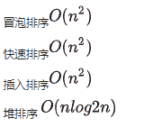

# 小米 2020 校招算法工程师笔试题一

## 1

链表具有的特点是（）

正确答案: D   你的答案: 空 (错误)

```cpp
需预估内存空间
```

```cpp
可随机访问任意元素
```

```cpp
插入需要移动元素
```

```cpp
所需空间与长度成正比
```

本题知识点

Java 工程师 C++工程师 小米 算法工程师 2020

讨论

[linux 之 whoami](https://www.nowcoder.com/profile/475014978)

D,非连续内存空间。对内存空间要求，基本上是数据多大，内存空间多大即可。

发表于 2020-12-18 15:17:37

* * *

[这里有一个按钮](https://www.nowcoder.com/profile/279912165)

需预估内存空间 × 链表的结点空间可以动态申请和释放
可随机访问任意元素 × 链表不能随机访问，只能从头结点依次遍历；数组可以随机访问
插入需要移动元素 ×链表数据元素的逻辑次序靠结点的指针来指示，插入不需要移动数据元素，只需要更改指针
所需空间与长度成正比 √ 链表每个结点中的指针域需额外占用存储空间，所需空间与长度成正比 

发表于 2020-10-16 08:58:05

* * *

[鑫♥](https://www.nowcoder.com/profile/898596319)

的

发表于 2020-10-15 13:01:04

* * *

## 2

一个二叉树的前序遍历：ACDFBE，中序遍历：DCFAEB，后序遍历为（）

正确答案: C   你的答案: 空 (错误)

```cpp
DCFEBA
```

```cpp
FEBADC
```

```cpp
DFCEBA
```

```cpp
ABCDEF
```

本题知识点

Java 工程师 C++工程师 小米 算法工程师 2020

讨论

[tortelee](https://www.nowcoder.com/profile/7182480)

C

发表于 2021-01-31 15:19:26

* * *

## 3

归并排序算法用到了下列哪种算法思想（ ）

正确答案: B   你的答案: 空 (错误)

```cpp
动态规划
```

```cpp
分治思想
```

```cpp
回溯算法
```

```cpp
贪心算法
```

本题知识点

Java 工程师 C++工程师 小米 算法工程师 2020

## 4

以下关于树的说法错误的是（  ）

正确答案: B   你的答案: 空 (错误)

```cpp
二叉树可以用数组存储，也可以用链表存储
```

```cpp
完全二叉树更适合用链表存储
```

```cpp
堆是一种完全二叉树
```

```cpp
搜索二叉树的查找时间复杂度为 O
```

本题知识点

Java 工程师 C++工程师 小米 算法工程师 2020

讨论

[牛客 Cver](https://www.nowcoder.com/profile/1897620)

二叉树的顺序存储，寻找后代节点和祖先节点都非常方便，但对于普通的二叉树，顺序存储浪费大量的存储空间，同样也不利于节点的插入和删除。因此顺序存储一般用于存储完全二叉树。
链式存储相对顺序存储节省存储空间，插入删除节点时只需修改指针，但寻找指定节点时很不方便。不过普通的二叉树一般是用链式存储结构。

发表于 2020-03-11 17:13:58

* * *

[牛客 88888888888](https://www.nowcoder.com/profile/805376766)

二叉搜索树的查找时间复杂度为 O(log2n)

发表于 2021-09-07 10:44:02

* * *

## 5

关于进程和线程的说法正确的是（）

正确答案: B   你的答案: 空 (错误)

```cpp
多个线程才能构成一个进程，单个线程不能构成进程
```

```cpp
线程是 CPU 时间调度的最小单位
```

```cpp
线程是计算机分配内存资源的基本单位
```

```cpp
说法都不对
```

本题知识点

Java 工程师 C++工程师 小米 算法工程师 2020

讨论

[牛客 720535170 号](https://www.nowcoder.com/profile/720535170)

进程是资源分配的最小单元，线程是系统执行（调度）的最小单元；一个程序至少包含一个进程，一个进程至少包含一个线程；

发表于 2020-09-08 14:19:20

* * *

## 6

优先级队列比较适合使用哪种数据结构实现（）

正确答案: C   你的答案: 空 (错误)

```cpp
数组
```

```cpp
链表
```

```cpp
堆
```

```cpp
栈
```

本题知识点

Java 工程师 C++工程师 小米 算法工程师 2020

## 7

对于下列关键字序列，不可能构成某二叉排序树中一条查找路径的序列是（）

正确答案: B   你的答案: 空 (错误)

```cpp
83,16,77,82,79,78
```

```cpp
56,60,99,59,87,92
```

```cpp
82,10,81,24,78,25
```

```cpp
13,26,61,58,22,24
```

本题知识点

Java 工程师 C++工程师 小米 算法工程师 2020

讨论

[Mira.cle](https://www.nowcoder.com/profile/76954372)

这道题 D 选项也不对把？ 应该选 BD

发表于 2020-02-24 15:24:35

* * *

[ShilohLin](https://www.nowcoder.com/profile/584404265)

61 左子 26，26 左子 13 61 右子 58，58 左子 22，22 右子 24 没提到的节点均为空，画一画二叉树，左中右查找，就是 D

编辑于 2021-04-14 16:05:16

* * *

[李祖贤](https://www.nowcoder.com/profile/184928875)

选项 D 也是错的吧，为什么不是 BD

发表于 2020-09-07 00:36:43

* * *

## 8

下列哪一种排序算法属于不稳定排序算法（）

正确答案: A   你的答案: 空 (错误)

```cpp
快速排序
```

```cpp
插入排序
```

```cpp
归并排序
```

```cpp
选择排序
```

本题知识点

Java 工程师 C++工程师 小米 算法工程师 2020

讨论

[牛客 295426815 号](https://www.nowcoder.com/profile/295426815)

选择排序也不稳定啊

发表于 2020-02-18 20:26:22

* * *

[StarFire](https://www.nowcoder.com/profile/544879583)

```cpp
def select_sort(a):
    for i in range(len(a)-1):
        pos = i
        for j in range(i, len(a)):
            if a[j] < a[pos]:
                pos = i
        a[i], a[pos] = a[pos], a[i]
```

select sort 怎么会是稳定的。

发表于 2021-06-19 08:34:04

* * *

[牛客 Cver](https://www.nowcoder.com/profile/1897620)

感觉答案有问题，常见的不稳定排序算法有：快速排序、希尔排序、选择排序、堆排序

发表于 2020-03-11 17:15:24

* * *

## 9

在最坏的情况下，下列排序方法中时间复杂度最小的是（）

正确答案: D   你的答案: 空 (错误)

```cpp
快速排序
```

```cpp
冒泡排序
```

```cpp
插入排序
```

```cpp
堆排序
```

本题知识点

Java 工程师 C++工程师 小米 算法工程师 2020

讨论

[小赵想找个好工作](https://www.nowcoder.com/profile/943794477)



发表于 2020-07-10 19:05:09

* * *

## 10

设散列表的长度为 8，散列函数 H(k)=k mod 7，初始记录关键字序列为(31，23，26，14，12，19)，计算用链地址法作为解决冲突方法的平均查找长度是（ ）

正确答案: A   你的答案: 空 (错误)

```cpp
1.5
```

```cpp
1.4
```

```cpp
2
```

```cpp
1.6
```

本题知识点

Java 工程师 C++工程师 小米 算法工程师 2020

讨论

[J.sherling](https://www.nowcoder.com/profile/125823255)

地址：0      1       2       3       4      5      6      7key   :14              23     31             26                                                     12                                                      1912 和 19 与 26 查找冲突，分别需要查找 2 次和 3 次，平均查找长度=（1+1+1+1+2+3）/7=1.5

发表于 2020-03-01 16:16:59

* * *

## 11

下面哪一方法可以判断出一个有向图是否有环(回路)()

正确答案: A B   你的答案: 空 (错误)

```cpp
深度优先搜索
```

```cpp
拓扑排序
```

```cpp
广度优先搜索
```

```cpp
Dijkstra 求最短路径
```

本题知识点

Java 工程师 C++工程师 小米 算法工程师 2020

讨论

[secrul](https://www.nowcoder.com/profile/7812219)

有向图，两个节点有公共子节点，广搜就不可以判断环

发表于 2022-02-19 16:52:55

* * *

## 12

下列哪个函数不可以做激活函数()

正确答案: D   你的答案: 空 (错误)

```cpp
y = tanh(x)
```

```cpp
y = sin(x)
```

```cpp
y = max(x,0)
```

```cpp
y = 2x
```

本题知识点

Java 工程师 C++工程师 小米 算法工程师 2020

讨论

[Teren](https://www.nowcoder.com/profile/315159485)

激活函数只能是非线性函数

发表于 2020-04-01 15:50:14

* * *

[牛客 913878976 号](https://www.nowcoder.com/profile/913878976)

激活函数是连续并可导(允许少数点不可导)的非线性函数。所以选择 D。

发表于 2022-01-11 13:55:03

* * *

## 13

在其他条件不变的前提下，以下哪种做法容易引起机器学习中的过拟合问题（）

正确答案: D   你的答案: 空 (错误)

```cpp
增加训练集量
```

```cpp
减少神经网络隐藏层节点数
```

```cpp
删除稀疏的特征
```

```cpp
SVM 算法中使用高斯核/RBF 核代替线性核
```

本题知识点

Java 工程师 C++工程师 小米 算法工程师 2020

讨论

[小赵想找个好工作](https://www.nowcoder.com/profile/943794477)

避免过拟合的方法：正则化方法，强制减少参数，增大训练数据集。

对于 B，过拟合是太多的参数引起的。神经网络减少隐藏层节点，就是在减少参数，只会将训练误差变高，不会导致过拟合。 
对于 D，svm 高斯核函数比线性核函数模型更复杂，容易过拟合

发表于 2020-07-10 19:15:03

* * *

## 14

下列有关机器学习中 L1 正则化和 L2 正则化说法正确的是？（）

正确答案: A D   你的答案: 空 (错误)

```cpp
使用 L1 可以得到稀疏的权值
```

```cpp
使用 L2 可以得到稀疏的权值
```

```cpp
使用 L1 可以得到平滑的权值
```

```cpp
使用 L2 可以得到平滑的权值
```

本题知识点

Java 工程师 C++工程师 小米 算法工程师 2020

讨论

[你想上天对不队](https://www.nowcoder.com/profile/188101910)

l1 对 w 有特征选择的功能，让一些特征不是很重要的，所对应的 w 置为 0.所以最终得到的 w 是稀疏的。而对 l2,则是尽量降低 w 的值。详细的推导可见此篇博客[`www.cnblogs.com/zingp/p/10375691.html#_label0`](https://www.cnblogs.com/zingp/p/10375691.html#_label0)

发表于 2021-08-26 12:13:56

* * *

[牛客 378172347 号](https://www.nowcoder.com/profile/378172347)

A,D

发表于 2020-08-18 20:25:25

* * *

## 15

以下描述错误的是：（）

正确答案: A B C   你的答案: 空 (错误)

```cpp
SVM 是这样一个分类器，他寻找具有最小边缘的超平面，因此它也经常被称为最小边缘分类器（minimal margin classifier）
```

```cpp
在决策树中，随着树中结点数变得太大，即使模型的训练误差还在继续减低，但是检验误差开始增大，这是出现了模型拟合不足的问题。
```

```cpp
在聚类分析当中，簇内的相似性越大，簇间的差别越大，聚类的效果就越差。
```

```cpp
聚类分析可以看作是一种非监督的分类。
```

本题知识点

Java 工程师 C++工程师 小米 算法工程师 2020

讨论

[Maple_2005](https://www.nowcoder.com/profile/203246634)

a：最大间隔 c：聚类效果越好

发表于 2020-04-30 12:58:44

* * *

## 16

下列哪些措施可以防止深度学习模型过拟合？（）

正确答案: A B C   你的答案: 空 (错误)

```cpp
参数共享
```

```cpp
Dropout
```

```cpp
扩充训练集
```

```cpp
直接进行分类,可以最大限度利用数据
```

本题知识点

Java 工程师 C++工程师 小米 算法工程师 2020

讨论

[给我一个 offer 叭！！！](https://www.nowcoder.com/profile/1409891)

扩充验证集么，不是应该以训练集么

发表于 2020-03-08 14:07:00

* * *

[Ma_ 马](https://www.nowcoder.com/profile/383604008)

如果模型过拟合，扩充验证集有什么用？

发表于 2020-05-11 20:50:57

* * *

[牛客 541969781 号](https://www.nowcoder.com/profile/541969781)

B 是对的。C 如果改成扩充训练集也是对的。过拟合出现的原因：训练集数据相对太少，而模型参数又相对比较复杂（参数也会相对较多），导致模型“记住”了训练数据，因此泛化能力较弱，出现过拟合。

发表于 2020-03-23 11:57:33

* * *

## 17

以下方法属于集成方法的是（）

正确答案: A B C D   你的答案: 空 (错误)

```cpp
bagging
```

```cpp
stacking
```

```cpp
boosting
```

```cpp
blending
```

本题知识点

Java 工程师 C++工程师 小米 算法工程师 2020

## 18

关于 ROC 曲线，下列说法中正确的是（）

正确答案: A B C D   你的答案: 空 (错误)

```cpp
ROC 曲线的 x 轴代表假正类率(false positive rate, FPR)
```

```cpp
ROC 曲线的 Y 轴代表真正类率(true positive rate ,TPR),
```

```cpp
AUC 的值就是处于 ROC 曲线下方的那部分面积的大小，通常介于 0.5 到 1.0 之间
```

```cpp
AUC 值越大，模型的分类效果越好
```

本题知识点

Java 工程师 C++工程师 小米 算法工程师 2020

讨论

[求大厂 baba 拿 offer 砸死我](https://www.nowcoder.com/profile/398815039)

ABCD

发表于 2020-09-07 15:22:11

* * *

## 19

logistic regression 和 SVM 说法正确的是:（）

正确答案: A C D   你的答案: 空 (错误)

```cpp
LR 可以用于预测事件发生概率的大小
```

```cpp
LR 目标函数是最小化后验概率
```

```cpp
SVM 目标是结构风险最小化
```

```cpp
SVM 分类依据是支持向量
```

本题知识点

Java 工程师 C++工程师 小米 算法工程师 2020

讨论

[牛客 Cver](https://www.nowcoder.com/profile/1897620)

A. 逻辑回归本质上是一种根据样本对权值进行极大似然估计的方法，而后验概率正比于先验概率和似然函数的乘积。LR 仅仅是最大化似然函数，并没有最大化后验概率；B. Logit 回归的输出就是样本属于正类别的几率，可以计算出概率，正确;C. SVM 的目标是找到使得训练数据尽可能分开且分类间隔最大的超平面，应该属于结构风险最小化;D. SVM 可以通过正则化系数控制模型的复杂度，避免拟合，正确。

发表于 2020-03-11 17:22:07

* * *