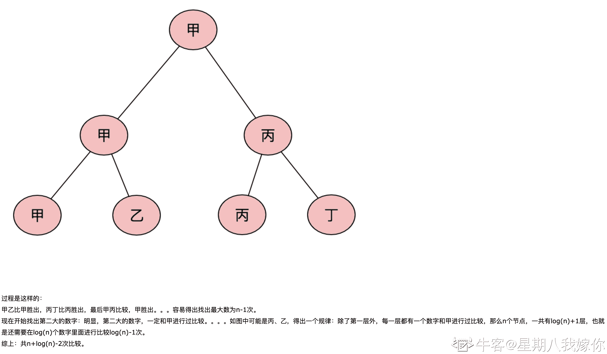

# 小米 2020 校招算法工程师笔试题二

## 1

下列哪种方法查找最快?（）

正确答案: A   你的答案: 空 (错误)

```cpp
哈希表法（散列表）
```

```cpp
顺序查找
```

```cpp
二分查找
```

```cpp
二叉排序树查找
```

本题知识点

Java 工程师 C++工程师 小米 算法工程师 2020

讨论

[牛客 Cver](https://www.nowcoder.com/profile/1897620)

根据平均时间复杂度，查找算法的快慢比较顺序：顺序查找 < 分块查找 < 二叉排序树查找 < 二分查找(等同于平衡二叉排序树的查找)< 哈希查找

发表于 2020-03-11 17:53:16

* * *

[倒霉熊不倒霉](https://www.nowcoder.com/profile/191090399)

哈希表（Hash table，也叫散列表），是根据 key 而直接进行访问的数据结构。也就是说，它通过把 key 映射到表中一个位置来访问记录，以加快查找的速度。这个映射函数叫做散列函数，存放记录的数组叫做散列表。

发表于 2020-02-15 23:18:55

* * *

## 2

下列关于排序算法的描述错误的是（）

正确答案: B   你的答案: 空 (错误)

```cpp
在待排序的记录集中，存在多个具有相同键值的记录，若经过排序，这些记录的相对次序仍然保持不变，称这种排序为稳定排序
```

```cpp
二叉查找树的查找效率与二叉树的树型有关，在节点太复杂时其查找效率最低
```

```cpp
在排序算法中，希尔排序在某趟排序结束后不一定能选出一个元素放到其最终位置上。
```

```cpp
插入排序方法可能出现这种情况:在最后一趟开始之前,所有的元素都不在其最终应在的正确位置上
```

本题知识点

Java 工程师 C++工程师 小米 算法工程师 2020

讨论

[mysterioussuperstar](https://www.nowcoder.com/profile/783604547)

如果插排从小到大，那么如果最小的那个在数组的结尾，在最后一次开始之前，所有的元素都不在其最终的位置上

发表于 2020-02-15 21:09:30

* * *

[给我一个 offer 叭！！！](https://www.nowcoder.com/profile/1409891)

单枝树查找效率最低

发表于 2020-03-12 12:02:57

* * *

## 3

以下关于递归调用的说法正确的是（）

正确答案: C   你的答案: 空 (错误)

```cpp
函数间接调用自己不是递归
```

```cpp
递归调用可以用队列实现
```

```cpp
递归调用可以用栈实现
```

```cpp
函数直接调用自己是递归
```

本题知识点

Java 工程师 C++工程师 小米 算法工程师 2020

讨论

[垚爻](https://www.nowcoder.com/profile/630591674)

答案为:c

递归条件

一个含直接或间接调用本函数语句的函数被称之为递归函数，在上面的例子中能够看出，它必须满足以下两个条件：1） 在每一次调用自己时，必须是（在某种意义上）更接近于解；2） 必须有一个终止处理或计算的准则。

发表于 2020-02-19 16:07:35

* * *

[牛客 295426815 号](https://www.nowcoder.com/profile/295426815)

```cpp
函数直接调用自己不是递归吗？
```

发表于 2020-02-19 11:13:31

* * *

[牛客 870373864 号](https://www.nowcoder.com/profile/870373864)

不是所有直接调用自己的函数都叫递归

发表于 2020-09-15 16:35:28

* * *

## 4

下面哪种排序算法不是稳定的（）

正确答案: D   你的答案: 空 (错误)

```cpp
归并
```

```cpp
冒泡
```

```cpp
插入
```

```cpp
快速排序
```

本题知识点

Java 工程师 C++工程师 小米 算法工程师 2020

讨论

[mysterioussuperstar](https://www.nowcoder.com/profile/783604547)

在待排序的记录序列中，存在多个具有相同的关键字的记录，若经过排序，这些记录的相对次序保持不变，即在原序列中，r[i]=r[j]，且 r[i]在 r[j]之前，而在排序后的序列中，r[i]仍在 r[j]之前，则称这种排序算法是稳定的；否则称为不稳定的。

发表于 2020-02-15 20:05:01

* * *

[牛客 117796667 号](https://www.nowcoder.com/profile/117796667)

希尔排序、堆排序、快速排序、简单选择排序都是不稳定排序算法

发表于 2021-09-07 21:58:04

* * *

## 5

在深度为 5 的满二叉树中，叶子结点的个数为 1

你的答案 (错误)

1 参考答案 (1) 16

本题知识点

Java 工程师 C++工程师 小米 算法工程师 2020

讨论

[牛客 Cver](https://www.nowcoder.com/profile/1897620)

题目看错了，以为是树的总的节点个数，哎，原来是第 5 层的节点个数

发表于 2020-03-11 17:55:14

* * *

[牛客 870373864 号](https://www.nowcoder.com/profile/870373864)

根节点算深度 1 而不是深度 0

发表于 2020-09-15 16:36:10

* * *

[郫县男子计院](https://www.nowcoder.com/profile/328790495)

2^(n-1)

发表于 2020-02-28 10:17:52

* * *

## 6

已知二叉树后序遍历序列是 dabec，中序遍历序列 debac，它的前序遍历序列是（）

正确答案: A   你的答案: 空 (错误)

```cpp
cedba
```

```cpp
ecdba
```

```cpp
bedca
```

```cpp
bdeca
```

本题知识点

Java 工程师 C++工程师 小米 算法工程师 2020

讨论

[喜欢吃蛋炒饭](https://www.nowcoder.com/profile/236777644)

后序遍历是：dabec 中序遍历是：debac 后序遍历的最后一个节点是根节点，则根节点是 C，从中序遍历中找根节点 C，C 之前的都是左子树。因此，该根节点没有右子树同理，e 点为左子树的根节点，在中序遍历中找 e，e 左边为左子树，右边为右子树。依次可得，该树为

发表于 2020-07-09 16:39:08

* * *

## 7

设有一个递归函数如下

```cpp
int  f(int n)
{   
     if(n<=3)    
         return 1;
    else 
        return f(n-2)+f(n-4)+1;
}
```

试问计算 f(9)时，函数 f 返回（    ）

正确答案: C   你的答案: 空 (错误)

```cpp
7
```

```cpp
8
```

```cpp
9
```

```cpp
10
```

本题知识点

Java 工程师 C++工程师 小米 算法工程师 2020

讨论

[Maple_2005](https://www.nowcoder.com/profile/203246634)

f(7)+f(5)+1 =f(5)+f(3)+1+f(5)+1 =2f(5)+3 =2(f(2)+f(1)+1)+3 =9

发表于 2020-08-14 00:03:40

* * *

## 8

从 n 个数里面找最大的两个数理论最少需要比较（）

正确答案: C   你的答案: 空 (错误)

```cpp
2logn
```

```cpp
2 logn -1
```

```cpp
n+ logn -2
```

```cpp
2n-3
```

本题知识点

Java 工程师 C++工程师 小米 算法工程师 2020

讨论

[给我一个 offer 叭！！！](https://www.nowcoder.com/profile/1409891)



发表于 2020-03-12 12:55:28

* * *

[苦行僧 20190222084456](https://www.nowcoder.com/profile/796487717)

类似比赛晋级，两两配对比较，赢的再两两配对，最后得到冠军(最大的数)，可以看成是一棵二叉树，最差情况的比较次数为（单枝树）：n-1 次，然后第二大的数肯定是跟冠军比较过的数字，那么很明显每一层都有一个，所以有 logn-1 次比较。 所以总共是 n+logn-2 次比较。

发表于 2020-01-31 16:25:33

* * *

## 9

以下哪些算法可以检测一个有向图中是否存在环（ ）

正确答案: A C   你的答案: 空 (错误)

```cpp
深度优先遍历
```

```cpp
广度优先遍历
```

```cpp
拓扑排序
```

```cpp
关键路径算法
```

本题知识点

Java 工程师 C++工程师 小米 算法工程师 2020

## 10

一个栈的入栈序列为 1,2,3,...,n ，其出栈序列是 p1, p2, p3, … pn 。若 p2 = 3，则 p3 可能取值的个数是（）

正确答案: C   你的答案: 空 (错误)

```cpp
n-3
```

```cpp
n-2
```

```cpp
n-1
```

```cpp
无法确定
```

本题知识点

Java 工程师 C++工程师 小米 算法工程师 2020

讨论

[ΔtZ.](https://www.nowcoder.com/profile/4061297)

求解答，为什么不是 n-2，p2 之前不是有个 p1 已经出栈了吗？还剩 n-2 个啊…

发表于 2020-04-05 18:26:04

* * *

[极嬴](https://www.nowcoder.com/profile/124453286)

入栈 1，出栈 1，入栈 2，3，出栈 3，出栈 2，则一共是 1，3，2 入栈 1，2，出栈 2，入栈 3，出栈 3，1，则一共是 2，3，1 其他 n-3 种直观所以只有 p2 = 3 是不行的，故 n - 1 种

发表于 2020-09-14 10:25:31

* * *

[啦啦啦 201910142017694](https://www.nowcoder.com/profile/240863180)

n-3 也可以啊，

发表于 2020-08-25 07:22:26

* * *

## 11

ROC 曲线和 AUC 常被用来评价一个二值分类器（binary classifier）的优劣。对于模型的 ROC 曲线，与哪一点越接近，表明该分类器的性能越好?（）

正确答案: B   你的答案: 空 (错误)

```cpp
左上，即 TPR=0, FPR=1
```

```cpp
左上，即 FPR=0, TPR=1 
```

```cpp
右下，即 TPR=0, FPR=1
```

```cpp
右下，即 FPR=0, TPR=1
```

本题知识点

Java 工程师 C++工程师 小米 算法工程师 2020

## 12

关于 k-means 算法，正确的描述是()

正确答案: D   你的答案: 空 (错误)

```cpp
能找到任意形状的聚类
```

```cpp
每次迭代的时间复杂度是 0(n2)，其中 n 是样本数量
```

```cpp
不能使用核函数(kernel function)
```

```cpp
初始值不同，最终结果可能不同
```

本题知识点

Java 工程师 C++工程师 小米 算法工程师 2020

讨论

[Maple_2005](https://www.nowcoder.com/profile/203246634)

k 均值能识别球形，类球形数据集，高斯分布数据集，对不规则图形识别较差

发表于 2020-08-14 00:08:06

* * *

[牛客 769937070 号](https://www.nowcoder.com/profile/769937070)

时间复杂度：O(I*n*k*m)

空间复杂度：O(n*m)

其中 n 为数据量，m 为每个元素字段个数，I 为迭代个数。一般 I,k,m 均可认为是常量，所以时间和空间复杂度可以简化为：O(n)，即线性的。

发表于 2020-02-25 17:05:41

* * *

## 13

relu( sigmoid(x) ) 结果相等？（）

正确答案: C   你的答案: 空 (错误)

```cpp
relu( relu(x) )
```

```cpp
sigmoid( relu(x) )
```

```cpp
relu( relu( sigmoid(x) ) )
```

```cpp
sigmoid( sigmoid(x) )
```

本题知识点

Java 工程师 C++工程师 小米 算法工程师 2020

讨论

[海上星](https://www.nowcoder.com/profile/542352)

sigmoid 结果（0,），relu 之后不变。

发表于 2020-02-03 23:54:52

* * *

## 14

下列哪一种操作实现了和神经网络中 Dropout 类似的效果？（）

正确答案: A   你的答案: 空 (错误)

```cpp
Bagging
```

```cpp
Boosting
```

```cpp
Stacking
```

```cpp
blending
```

本题知识点

Java 工程师 C++工程师 小米 算法工程师 2020

讨论

[牛客 Cver](https://www.nowcoder.com/profile/1897620)

典型的神经网络其训练流程是将输入通过网络进行正向传导，然后将误差进行反向传播，Dropout 就是针对这一过程之中，随机地删除隐藏层的部分单元，保持输入输出神经元不变，接着将输入通过修改后的网络进行前向传播，然后将误差通过修改后的网络进行反向传播。Bagging 首先随机地抽取训练集（training set），以之为基础训练多个弱分类器。然后通过取平均，或者投票(voting)的方式决定最终的分类结果。因为它随机选取训练集的特点，Bagging 可以一定程度上避免**过拟合(overfit)**；Boosting 按照某种策略将训练完的模型进行优化，最后能将弱分类器组合成强分类器；stacking 类似堆叠方式的模型集合方式。blending：利用不相交的数据集进行训练，然后累加求平均。

发表于 2020-03-11 18:24:58

* * *

## 15

对于输入维度为  [N, H, W, C]  的 Tensor, Batch Normalization 在哪个(些)维度上做归一化（）

正确答案: B   你的答案: 空 (错误)

```cpp
N
```

```cpp
N,C
```

```cpp
N,H
```

```cpp
H,W
```

本题知识点

Java 工程师 C++工程师 小米 算法工程师 2020

## 16

下列描述错误的是？（）

正确答案: C   你的答案: 空 (错误)

```cpp
函数在某点的梯度方向与取得最大方向导数的方向一致。
```

```cpp
在等式约束条件下，约束的梯度向量与目标函数的梯度向量在最优解处一定平行。
```

```cpp
KKT 条件是强对偶成立的充要条件。
```

```cpp
函数在某点的梯度的模为方向导数的最大值。
```

本题知识点

Java 工程师 C++工程师 小米 算法工程师 2020

讨论

[牛客 Cver](https://www.nowcoder.com/profile/1897620)

KKT 和强对偶条件应该是必要不充分关系

发表于 2020-03-11 18:29:46

* * *

## 17

以下哪个是 1 x 1 卷积的优点？（）

正确答案: A B C   你的答案: 空 (错误)

```cpp
升维/降维
```

```cpp
在保持 feature map 尺寸不变的前提下大幅增加非线性特性
```

```cpp
跨通道信息交互（channal 的变换）
```

```cpp
扩大感受野
```

本题知识点

Java 工程师 C++工程师 小米 算法工程师 2020

讨论

[牛客 Cver](https://www.nowcoder.com/profile/1897620)

参考了别人的详细解读。[`blog.csdn.net/l7H9JA4/article/details/80650259`](https://blog.csdn.net/l7H9JA4/article/details/80650259)

发表于 2020-03-11 18:34:17

* * *

[牛客 208228646 号](https://www.nowcoder.com/profile/208228646)

作为各个 channel 的线性叠加，可以增加非线性吗？求解答

发表于 2021-11-18 17:08:25

* * *

## 18

下列有关 SVM 和 LR 说法正确的是（）

正确答案: B C D   你的答案: 空 (错误)

```cpp
SVM 是分类模型，LR 是回归模型
```

```cpp
SVM 和 LR 都是分类模型
```

```cpp
SVM 是判别式模型
```

```cpp
LR 判别式模型
```

本题知识点

Java 工程师 C++工程师 小米 算法工程师 2020

讨论

[Maple_2005](https://www.nowcoder.com/profile/203246634)

LR 虽然叫逻辑回归但是是分类器，SVM 就不用说了，间隔最大化分类器

发表于 2020-08-14 00:12:13

* * *

[冰 1507](https://www.nowcoder.com/profile/719328469)

LR 是 Linear Regression 还是 Logistic Regression 呢？

发表于 2020-12-18 17:10:50

* * *

## 19

有关集成学习下列说法正确的是（）

正确答案: B D   你的答案: 空 (错误)

```cpp
基本模型应尽量来自于同一算法，通过改变训练数据和参数，得到不同的基本模型
```

```cpp
通常来讲，基本模型之间相关性应该低一些
```

```cpp
集成的基本模型的数量越多，集成模型的效果就越好
```

```cpp
bagging boosting 时常用的集成学习的方法
```

本题知识点

Java 工程师 C++工程师 小米 算法工程师 2020

## 20

L1 和 L2 正则的先验分布服从怎样的分布  （）

正确答案: A C   你的答案: 空 (错误)

```cpp
L1 是拉普拉斯分布
```

```cpp
L1 是高斯分布
```

```cpp
L2 是高斯分布
```

```cpp
L2 是拉普拉斯分布
```

本题知识点

Java 工程师 C++工程师 小米 算法工程师 2020