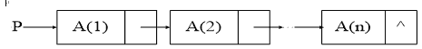
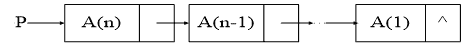

# 房多多 2020 校招笔试题-通用技术类

## 1

在计算机系统中以下哪些是线程和进程共用的？（）

正确答案: A B D   你的答案: 空 (错误)

```cpp
地址空间   
```

```cpp
堆
```

```cpp
栈
```

```cpp
代码段
```

本题知识点

Java 工程师 C++工程师 iOS 工程师 安卓工程师 运维工程师 前端工程师 算法工程师 PHP 工程师 测试工程师 安全工程师 c#工程师 数据库工程师 大数据开发工程师 房多多 2020

讨论

[是瑶瑶公主呀](https://www.nowcoder.com/profile/592649258)

栈是线程私有的。

发表于 2020-01-16 20:03:44

* * *

## 2

对于一台计算机中的一块存储了 1TB 数据的普通机械硬盘(SATAII 7.2k rpm)，现在有程序随机访问其中的任何 1KB 的数据，那么每秒钟可能的平均访问次数，下列数字中最可能接近的是：（）

正确答案: B   你的答案: 空 (错误)

```cpp
10 次
```

```cpp
100 次
```

```cpp
1000 次
```

```cpp
10000 次
```

本题知识点

Java 工程师 C++工程师 iOS 工程师 安卓工程师 运维工程师 前端工程师 算法工程师 PHP 工程师 测试工程师 安全工程师 c#工程师 数据库工程师 大数据开发工程师 房多多 2020

## 3

在一个单 CPU、内存充足的计算机上，对 1GB 的 4 字节整数数组进行 quicksort 排序，大约需要多长时间？（）

正确答案: B   你的答案: 空 (错误)

```cpp
10 秒
```

```cpp
30 秒
```

```cpp
60 秒
```

```cpp
100 秒
```

本题知识点

Java 工程师 C++工程师 iOS 工程师 安卓工程师 运维工程师 前端工程师 算法工程师 PHP 工程师 测试工程师 安全工程师 c#工程师 数据库工程师 大数据开发工程师 房多多 2020

讨论

[放弃幻想，准备战斗](https://www.nowcoder.com/profile/6544134)

这是人做的题吗？咋不把选项设成 28s 29s 30s 31s 呢

发表于 2020-06-01 11:45:37

* * *

[小强开学前](https://www.nowcoder.com/profile/4208515)

1GHz 和 4GHz，桌面级 CPU 和笔记本 CPU 区别还是很大的吧。

发表于 2020-09-13 16:55:23

* * *

## 4

下列 Linux 常用命令工具中哪些对服务器性能检查有用（）

正确答案: A B D   你的答案: 空 (错误)

```cpp
iostat
```

```cpp
vmstat      
```

```cpp
netstat     
```

```cpp
top
```

本题知识点

Java 工程师 C++工程师 iOS 工程师 安卓工程师 运维工程师 前端工程师 算法工程师 PHP 工程师 测试工程师 安全工程师 c#工程师 数据库工程师 大数据开发工程师 房多多 2020

讨论

[是瑶瑶公主呀](https://www.nowcoder.com/profile/592649258)

*   iostat，用于报告中央处理器（CPU）统计信息和整个系统、适配器、tty 设备、磁盘和 CD-ROM 的输入/输出统计信息。
*   vmstat 命令报告关于内核线程、虚拟内存、磁盘、陷阱和 CPU 活动的统计信息。
*   Netstat 是控制台命令,是一个监控 TCP/IP 网络的非常有用的工具，它可以显示路由表、实际的网络连接以及每一个网络接口设备的状态信息。
*   系统管理员可用运行 top 命令监视进程和 Linux 整体性能
*   所以选 ABD

编辑于 2020-01-16 20:07:02

* * *

## 5

 在客户端(Client)和服务端(Server)的跨网络服务接口调用中（即：远程过程调用 RPC）,以下描述符错误的是: （）

正确答案: D   你的答案: 空 (错误)

```cpp
客户端在调用前会主动发起与和服务端建立连接，如 TCP 连接
```

```cpp
客户端会将调用的接口标识和其参数打包编码后发送给服务端，编码格式可以由客户端和服务端灵活约定
```

```cpp
服务端侧程序常常采用多线程实现对并发的支持
```

```cpp
 调用的返回结果由客户端侧产生
```

本题知识点

Java 工程师 C++工程师 iOS 工程师 安卓工程师 运维工程师 前端工程师 算法工程师 PHP 工程师 测试工程师 安全工程师 c#工程师 数据库工程师 大数据开发工程师 房多多 2020

讨论

[是瑶瑶公主呀](https://www.nowcoder.com/profile/592649258)

返回结果是服务器端产生，客户端显示把

发表于 2020-01-16 20:07:40

* * *

[梁 1213](https://www.nowcoder.com/profile/895303457)

此题不会

发表于 2022-03-16 15:46:00

* * *

## 6

When you create a Java or C++ object by using “new”, and have a reference to point to the object. Please answer: (1) Where is the place the object itself lives in? (2) Where is the reference?（）

正确答案: D   你的答案: 空 (错误)

```cpp
 The Stack, The Heap. 
```

```cpp
The Stack, Register.      
```

```cpp
The Heap, Register.  
```

```cpp
 The Heap, The Stack 
```

本题知识点

Java 工程师 C++工程师 iOS 工程师 安卓工程师 运维工程师 前端工程师 算法工程师 PHP 工程师 测试工程师 安全工程师 c#工程师 数据库工程师 大数据开发工程师 房多多 2020

讨论

[是瑶瑶公主呀](https://www.nowcoder.com/profile/592649258)

new 出来的对象在堆中，引用在栈中。

发表于 2020-01-16 20:08:12

* * *

## 7

我们来玩一个猜数字游戏：我随意写下一个[0, 1000000000]之间的数字但不告诉你，现在你来猜我写的是什么数字。你每次猜测一个答案后，我会告诉你小了、大了或对了，你在多少次之内一定能猜对？（）

正确答案: A   你的答案: 空 (错误)

```cpp
 30 次  
```

```cpp
256 次
```

```cpp
1000000 次   
```

```cpp
1000000000 次   
```

本题知识点

Java 工程师 C++工程师 iOS 工程师 安卓工程师 运维工程师 前端工程师 算法工程师 PHP 工程师 测试工程师 安全工程师 c#工程师 数据库工程师 大数据开发工程师 房多多 2020

讨论

[张俊伟](https://www.nowcoder.com/profile/712037455)

二分法，大概 2 的 30 次方的数据量

发表于 2020-01-20 12:36:01

* * *

## 12

以下哪些语句可以判断整数 n 为 2 的幂？（2 的幂：2²、2³ … 2^m）（）

正确答案: A B   你的答案: 空 (错误)

```cpp
n&(n-1) == 0
```

```cpp
n == (n&-n)
```

```cpp
n/2 == n%2
```

```cpp
(n/2)%2 == 0
```

本题知识点

Java 工程师 C++工程师 iOS 工程师 安卓工程师 运维工程师 前端工程师 算法工程师 PHP 工程师 测试工程师 安全工程师 c#工程师 数据库工程师 大数据开发工程师 房多多 2020

讨论

[ΔtZ.](https://www.nowcoder.com/profile/4061297)

参考上一位 @赵大元 的思路 2 是正整数，其原码和反码都是 0000 0010-2 的原码为 1000 0010，补码为 1111 1110 那么 2 和-2 的补码做&操作之后，得到 0000 0010，得到 2 的反码/原码，可以判断 2 为 2 的整数幂即  2 = 2 & -2

发表于 2020-04-05 14:53:32

* * *

[赵大元](https://www.nowcoder.com/profile/4936146)

2 的幂次的话，其二进制中只有一个 1，计算机中一个数的负数以补码表示，例如 2 的原码  00000010  反码 11111101 补码 11111110 ，可以看出，如果原码的中只有一个 1，其补码的相应位置也为 1，而其他位置全部是反的，n&-n 后，如果原码只有一个 1，则 n=n&-n

发表于 2020-04-02 22:53:41

* * *

## 13

以下哪些操作的时间复杂度是 O(n*log n)？（）

正确答案: A D   你的答案: 空 (错误)

```cpp
堆排序            
```

```cpp
最糟情况下的快速排序
```

```cpp
在二叉树中查找一个数     
```

```cpp
归并排序 (或合并排序 merge sort)
```

本题知识点

Java 工程师 C++工程师 iOS 工程师 安卓工程师 运维工程师 前端工程师 算法工程师 PHP 工程师 测试工程师 安全工程师 c#工程师 数据库工程师 大数据开发工程师 房多多 2020

讨论

[牛客 316136920 号](https://www.nowcoder.com/profile/316136920)

时间复杂度为 O(nlogn)的排序算法包括：快速排序、归并排序、堆排序。 B 选项：快速排序的时间复杂度为 O(nlogn)，最坏时间复杂度为 O(n²)，所以 B 错误。 C 选项：二叉树查找一个数和二分查找一样，插入和查找的时间复杂度均为 O(logn)，但是在最坏的情况下仍然会有 O(n)的时间复杂度，所以 C 错。

编辑于 2021-01-16 02:46:27

* * *

[喝烈酒去忧愁](https://www.nowcoder.com/profile/343322911)

我用的排除法，快速排序最糟糕 O(n²)，二叉树查找一个树我记得不是 n 个 logn

发表于 2020-12-06 19:01:07

* * *

## 8

下列代码执行的时间复杂度是：（）

```cpp
void
func(int x,int y, int z) {
if(x<=0) {
printf("%d, %d\n", y, z);
}
else
{
func(x-1,y+1,z);
func(x-1,y,z+1);
}
}
```

正确答案: C   你的答案: 空 (错误)

```cpp
O(x*y*z)
```

```cpp
O(2^x*2^y*2^z) 
```

```cpp
O(2^x)
```

```cpp
O(x!)
```

本题知识点

Java 工程师 C++工程师 iOS 工程师 安卓工程师 运维工程师 前端工程师 算法工程师 PHP 工程师 测试工程师 安全工程师 c#工程师 数据库工程师 大数据开发工程师 房多多 2020

讨论

[largerthanlife](https://www.nowcoder.com/profile/3207370)

O(x)

发表于 2020-01-14 15:49:42

* * *

[redoCxz](https://www.nowcoder.com/profile/2165616)

x 层的二叉树

发表于 2020-01-27 19:32:32

* * *

## 9

在一种 RDBMS 系统中(以 MySQL 为例，并采用了 InnoDB 作为存储引擎)，我们建立了一张表 t1 (其 Schema 包含 4 个列 c1, c2, c3, c4)。其 Primary Key 指定为列 c1, 并在该表的列 c2 上建立了 B+Tree 索引。我们向该表中写入了 3000 万条记录。问下列 SQL 查询语句中，哪条 SQL 语句理论上执行效率最高？（）

正确答案: C   你的答案: 空 (错误)

```cpp
select * from t1 where c2=”abc” and c3>1000 andc3<1050;
```

```cpp
 select * fromt1 where c3>1000 and c3<1005;
```

```cpp
select * from t1 where c1=”abc” and c3>1000 andc3<1050;
```

```cpp
select * from t1 where c1>”abc” and c1<”abz”and c2>”aaa” and c2<”bbb”;
```

本题知识点

Java 工程师 C++工程师 iOS 工程师 安卓工程师 运维工程师 前端工程师 算法工程师 PHP 工程师 测试工程师 安全工程师 c#工程师 数据库工程师 大数据开发工程师 房多多 2020

讨论

[Neleus](https://www.nowcoder.com/profile/3855571)

c1="abc"走主键索引

发表于 2020-03-30 19:50:18

* * *

## 10

下列 C/C++代码片段中哪段是可以正确执行的？（）注：如果你能在错误的代码上勾画和标注出错误的语句和原因，有额外加分。

正确答案: C   你的答案: 空 (错误)

```cpp
A)     voidGetMemory(char *p) {p = (char*)malloc(100);}voidTest(void) {char *str = NULL;GetMemory(str);strcpy(str,"hello world");printf(“%s”, str);}
```

```cpp
char *GetMemory(void) { char p[] ="hello world";return p;}voidTest(void) {char *str = NULL;str = GetMemory();  printf(“%s”, str);}
```

```cpp
voidGetMemory(char **p, int num) {*p = (char*)malloc(num);}void Test(void){char*str = NULL;GetMemory(&str,100);strcpy(str,"hello"); printf(“%s”,str);free(str);}
```

```cpp
 void Test(void) {    char *str = (char *)malloc(100);  strcpy(str, “hello”);  free(str);      if(str != NULL) {   strcpy(str, “world”); printf(“%s”,str);  }}
```

本题知识点

Java 工程师 C++工程师 iOS 工程师 安卓工程师 运维工程师 前端工程师 算法工程师 PHP 工程师 测试工程师 安全工程师 c#工程师 数据库工程师 大数据开发工程师 房多多 2020

## 14

给你几万条用户数据，每条用户数据的电话号码是其唯一的关键字段，请选择合适的数据结构，将这些用户数据加载到内存中管理起来。这个数据结构支持基于电话号码的快速查询，同时又支持新数据的快速插入(有新的用户不断注册进来)：（）

正确答案: B C   你的答案: 空 (错误)

```cpp
链表          
```

```cpp
Hash 表  
```

```cpp
 B+Tree        
```

```cpp
队列
```

本题知识点

Java 工程师 C++工程师 iOS 工程师 安卓工程师 运维工程师 前端工程师 算法工程师 PHP 工程师 测试工程师 安全工程师 c#工程师 数据库工程师 大数据开发工程师 房多多 2020

讨论

[喝烈酒去忧愁](https://www.nowcoder.com/profile/343322911)

链表：适合插入数据不适合查询队列：个人感觉也不适合插入数据不适合查询（因为他先进先出）

发表于 2020-12-06 19:04:31

* * *

## 11

在房多多, 有很多工作人员检查二手房源是不是属于虚假房源, 假设所有二手房源的真实率到达了 98%, 工作人员将一个真实二手房源检验为虚假二手房源的概率为 2%, 而一个虚假二手房源被检验为真实二手房源的概率为 5%。那么一个被检验为真实的二手房源确实是真实的概率是多大?（）

正确答案: B   你的答案: 空 (错误)

```cpp
0.9991
```

```cpp
0.9989
```

```cpp
0.9855 
```

```cpp
0.96
```

本题知识点

Java 工程师 C++工程师 iOS 工程师 安卓工程师 运维工程师 前端工程师 算法工程师 PHP 工程师 测试工程师 安全工程师 c#工程师 数据库工程师 大数据开发工程师 房多多 2020

讨论

[惊弦](https://www.nowcoder.com/profile/445822103)

正确答案：0.9989 解: (98%*98%) / (98%*98%+2%*5%)真实二手房被检查为真实二手房概率 / (真实二手房被检查为真实二手房概率+假二手房被检查为真二手房概率）

发表于 2020-01-17 16:36:34

* * *

[外包不准吃公司零食](https://www.nowcoder.com/profile/513136655)

p(n|ture) = 0.02 -> p(p|true) = 0.98

p(p|false) = 0.05

p(true) = 0.98 -> p(false) = 0.02

p(p,true) = p(p|true)*p(true) = 0.98*0.98 = 0.9604

p(p,false) = p(p|false)*p(false) = 0.05*0.02=0.001

-> p(p) = 0.9614

p(true|p) = p(p,true) / p(p)

        = 0.9604/0.9605

        = 0.9989

发表于 2020-01-21 23:02:36

* * *

## 15

一个全局变量 tally，两个线程并发执行（代码段都是 ThreadProc），问两个线程都结束后，tally 取值范围是：1

```cpp
int tally = 0; // global variable
void ThreadProc(  )
{
      for（int i =
1; i <= 50; i++）
      tally += 1;
}
```

你的答案 (错误)

1 参考答案 (1) [50,100]

本题知识点

Java 工程师 C++工程师 iOS 工程师 安卓工程师 运维工程师 前端工程师 算法工程师 PHP 工程师 测试工程师 安全工程师 c#工程师 数据库工程师 大数据开发工程师 房多多 2020

讨论

[black-six](https://www.nowcoder.com/profile/504346022)

50-100，最小值是两个线程一直碰撞取到另一个线程加 1 之前的值，即为 50，最大为两个线程一直没碰撞，每次加 1 都是正确有效，即 100。

发表于 2021-09-21 00:39:40

* * *

## 16

运行下图中的 C 语言代码

```cpp
bool Fun1(char*
str) {
    printf("%s", str);
    return false;
}

bool Fun2(char*
str) {
    printf("%s", str);
    return true;
}

int main(int argc, char *argv[])  {
    bool res1,
res2;
    res1 = (Fun1("a") &&
Fun2("b")) || (Fun1("c") || Fun2("d"));
    res2 = (Fun1("a") &&
Fun2("b")) && (Fun1("c") || Fun2("d"));

    return res1 || res2;
}
```

  输出打印的结果是：1

你的答案 (错误)

1 参考答案 (1) acda

本题知识点

Java 工程师 C++工程师 iOS 工程师 安卓工程师 运维工程师 前端工程师 算法工程师 PHP 工程师 测试工程师 安全工程师 c#工程师 数据库工程师 大数据开发工程师 房多多 2020

讨论

[chuxuezheer](https://www.nowcoder.com/profile/246660149)

这里需要明确的一个性质：若&&左侧的运算结果为 false，则运算到此结束，右侧就不运算了。所以对上面两个表达式：

```cpp
res1 = (Fun1("a") &&Fun2("b")) /式 1  ||  (Fun1("c") /式 2 ||  Fun2("d")); /式 3
```

先运算式 1:左边 Fun("a")，返回 false，输出 a，Fun2("b")不再运算，然后运算式 2，式 3，则运算完 res1 输出：a,c,d，res1 赋值 true。

```cpp
res2 = (Fun1("a") &&Fun2("b")) /式 1 && (Fun1("c") || Fun2("d")) /式 2 ;
```

式 1 与式 2 同等地位，但运算顺序从左开始。对式 1，Fun1("a") 输出 a,返回 false，则 Fun2("b")不会再运算，式 2 不会再运算。所以运算完后仅输出 a,res2 赋值 false。

编辑于 2020-02-19 12:12:54

* * *

[喝烈酒去忧愁](https://www.nowcoder.com/profile/343322911)

我大意了，没有（闪）

发表于 2020-12-06 19:09:59

* * *

## 17

函数 reverse 完成将单链表逆转的操作，它将链表
变为

[程序]

```cpp
void reverse(link *p)  {
    link *ptr，*p1，*p2;
    ptr = p;
    p1 = NULL；
    while 1 {
       p2 = ptr;
       ptr = ptr->next;
    2
       p1 = p2;
}
p = p1； 
}
```

你的答案 (错误)

12 参考答案 (1) ptr != NULL
(2) p2‐>next = p1

本题知识点

Java 工程师 C++工程师 iOS 工程师 安卓工程师 运维工程师 前端工程师 算法工程师 PHP 工程师 测试工程师 安全工程师 c#工程师 数据库工程师 大数据开发工程师 房多多 2020

## 18

求所有满足如下条件的三位数：它除以 11 得到的商等于它各位数字的平方和。例如：550，它除以 11 的商为 50，它各位数字的平方和为 5*5+5*5+0*0=50。使用穷尽三位数,寻找满足条件的数。

```cpp
#include
<stdio.h>
void main(   ) {
  int i, j, n, s;
  for (i = 100; i <= 999; i++) {
    n = i;
    j = n / 11;
    s = 0;
    while1{
     2
        n /= 10;
    }

    if (j == s)
        printf("%5d", i);
 }
}
```

你的答案 (错误)

12 参考答案 (1) n 或 n!=0 或 n>0
(2) s += (n%10) * (n%10)

本题知识点

Java 工程师 C++工程师 iOS 工程师 安卓工程师 运维工程师 前端工程师 算法工程师 PHP 工程师 测试工程师 安全工程师 c#工程师 数据库工程师 大数据开发工程师 房多多 2020

## 19

以下程序的输出结果是(下列代码用 Java 编写，如果没学过 Java 可以当做伪代码理解)

父类：

```cpp
public class FatherClass {
public FatherClass( ) {
System.out.println("FatherClass
Create");
}
}

子类:
public class ChildClass extends FatherClass {
public ChildClass(   ) {
       System.out.println("ChildClass
Create");
}

public static void
main(String[] args) {
       FatherClass
fc = new FatherClass(    );
ChildClass cc = new
ChildClass(  );
}
}
```

运行结果是：1

你的答案 (错误)

1 参考答案 (1) FatherClass Create ； FatherClass Create ；ChildClass Create

本题知识点

Java 工程师 C++工程师 iOS 工程师 安卓工程师 运维工程师 前端工程师 算法工程师 PHP 工程师 测试工程师 安全工程师 c#工程师 数据库工程师 大数据开发工程师 房多多 2020

讨论

[ΔtZ.](https://www.nowcoder.com/profile/4061297)

参考答案是 FatherClass Create ； FatherClass Create ；ChildClass Create 写的答案没用分号，用的是逗号，这也不行吗 😂这让本来就很难做对题目的我雪上加霜…

发表于 2020-04-05 15:42:15

* * *

## 20

我们来玩一个猜数字游戏：我随意写下一个[0, 1000000000]之间的数字但不告诉你，现在你来猜我写的是什么数字。你每次猜测一个答案后，我会告诉你小了、大了或对了，你在多少次之内一定能猜对？现在我们给定的数据范围不是[0, 1000000000]，而是更通用一般化的[min, max]。请写一段程序，给定任何 min、max，以及 min 和 max 之间的 number，该程序运行后都可以快速告诉我们猜测的次数。（可以使用你熟悉的任何编程语言，或者伪代码）

你的答案

本题知识点

Java 工程师 C++工程师 iOS 工程师 安卓工程师 运维工程师 前端工程师 算法工程师 PHP 工程师 测试工程师 安全工程师 c#工程师 数据库工程师 大数据开发工程师 房多多 2020

讨论

[牛客 108034882 号](https://www.nowcoder.com/profile/108034882)

```cpp

```
    count = 0
    def erfen(min,max,num):
        global count
        if min > max&nbs***bsp;num < min &nbs***bsp;num > max:
            return count
        if (min + max) // 2 == num:
            #print('对了', num)
            return count
        elif (min + max) // 2 > num:
            count += 1
            #print('错了,大了')
            return erfen(min, (min + max+1) // 2, num)
        elif (min + max) // 2 < num:
            count += 1
            #print('错了,小了')
            return erfen((min + max+1) // 2, max, num)

    print(erfen(0,1000000000,0))
```cpp

```

发表于 2020-11-14 19:43:44

* * *

[201910161750798](https://www.nowcoder.com/profile/168583956)

要么是我理解错了，要么是答案错了，我觉得要区分中间数的多少

发表于 2020-03-02 03:32:39

* * *

[kiryul](https://www.nowcoder.com/profile/775470928)

Java 版，没仔细检查，如果有错求指教。

```cpp
public class test1 {
    public static void main(String[] args) {
        Scanner scan=new Scanner(System.in);
        int min,max,number;
        System.out.println("请输入最小值：");
        min=scan.nextInt();
        System.out.println("请输入最大值：");
        max=scan.nextInt();
        System.out.println("请输入查找的数字：");
        number=scan.nextInt();
        System.out.println("查找次数为："+ findtimes(min,max,number));
    }

    public static int findtimes(int min,int max,int number)
    {
        if(min>max || number<min || number> max) return 0;
        int res=1;
        if(number==(max-min)/2+min) return res;
        else if(number>(max-min)/2+min) res=res+findtimes((max-min)/2+min+1,max,number);
        else res=res+findtimes(min,(max-min)/2+min-1,number);
        return res;
    }
}
```

 编辑于 2020-02-16 22:56:47

* * *

## 21

给定一个存放整数的数组，请设计个函数，重新排列数组使得数组前面为奇数，后面全偶数，同时函数返回重排后第一个为偶数的元素在数组中的位置。

你的答案

本题知识点

Java 工程师 C++工程师 iOS 工程师 安卓工程师 运维工程师 前端工程师 算法工程师 PHP 工程师 测试工程师 安全工程师 c#工程师 数据库工程师 大数据开发工程师 房多多 2020

讨论

[gdut17](https://www.nowcoder.com/profile/279358190)

```cpp
int mypar(int a[],int low,int high)
{
	int key = a[low];
	int sz = high;
	while (low < high)
	{
		while (low < high && a[high] % 2 == 0)
		{
			high--;
		}
		if (low < high)
		{
			a[low] = a[high];
			low++;
		}
		while (low < high && a[low] % 2 == 1)
		{
			low++;
		}
		if (low < high)
		{
			a[high] = a[low];
			high--;
		}
	}
	a[low] = key;

	if (key%2 == 0)//key 是偶数
	{
		return low;
	}
	//key 是奇数
	if (low < sz)//有偶数
	{
		return low + 1;//中轴后一位是偶数
	}
	return -1;//没有偶数
}
```

发表于 2020-08-13 11:02:58

* * *

[kiryul](https://www.nowcoder.com/profile/775470928)

Java 版，没做排序，只是简单换位，出错求指教。

```cpp
public class test2 {
    public static void main(String[] args) {
        int[] a={2,3,5,6,33,41,24,87,34,32,15,6};
        for (int i:a
             ) {
            System.out.print("  "+i);
        }
        System.out.println();
        System.out.println("第一个偶数的位置："+fun(a));
        for (int i:a
             ) {
            System.out.print("  "+i);
        }

    }

    public static int fun(int[] a){
        int j=a.length-1;
        int i=0;
        int temp=a[i];
        while(i<j){
            while (i<j && a[i]%2!=0) i++;
            if(i==j) return i;
            else {temp=a[i];}
            while (i<j && a[j]%2==0) j--;
            if(i==j) return i;
            else {
                a[i]=a[j];
                a[j]=temp;
                i++;
            }
        }
        return i;
    }
}
```

发表于 2020-02-16 23:01:30

* * *

## 22

我们通过网络爬虫从网络上爬取 URL 并保存在文件中。假设我们分两个时段分别爬了大约 50 亿个 URL，分别存放在 A、B 两个文件中，其中每个 URL 的平均大小大约 64 字节。

现在你手头只有一台电脑，配置有足够的硬盘但剩余可用内存只有 4GB，请设计一种可行的方法，找出 A、B 两个文件中都出现的 URL 并将他们输出到一个新的文件 C 中。请写出设计思路和要点。（提示：50 亿＊64B = 320GB 远大于 4GB）

你的答案

本题知识点

Java 工程师 C++工程师 iOS 工程师 安卓工程师 运维工程师 前端工程师 算法工程师 PHP 工程师 测试工程师 安全工程师 c#工程师 数据库工程师 大数据开发工程师 房多多 2020

讨论

[牛客 947063561 号](https://www.nowcoder.com/profile/947063561)

1、采用 hash 成小文件的方式 2、允许误差下，采用布隆过滤器的方式

发表于 2020-10-10 22:10:54

* * *