# 爱奇艺 2020 校招 Java 方向笔试题（第一场）

## 1

计算下列程序的时间复杂度（）

```cpp
for (i=1;i<n;i++)
   for(j=1;j<m;j++)
     {a1,a2,a3,a4};
```

正确答案: B   你的答案: 空 (错误)

本题知识点

Java 工程师 爱奇艺 算法工程师 C++工程师 安卓工程师 iOS 工程师 测试开发工程师 前端工程师 2020

讨论

[bukun](https://www.nowcoder.com/profile/514169517)

n * m

发表于 2020-08-07 14:46:04

* * *

[caiKaten](https://www.nowcoder.com/profile/8094368)

嵌套两个 for 循环，执行 n*m 次

发表于 2020-11-03 11:12:04

* * *

[牛客 120004240 号](https://www.nowcoder.com/profile/120004240)

第一个循环没有花括号，为什么会执行？

发表于 2021-10-04 09:28:34

* * *

## 2

求递归方程 T(n)=4T(n/2)+n 的解  (    )

正确答案: B   你的答案: 空 (错误)

本题知识点

Java 工程师 爱奇艺 算法工程师 C++工程师 安卓工程师 iOS 工程师 测试开发工程师 前端工程师 2020

讨论

[vicyor](https://www.nowcoder.com/profile/2210832)

主定理提供了分治方法带来的递归表达式的渐进复杂度分析.1.将规模为 n 的问题通过分治,得到 a 个规模为 n/b 的问题,每次递归带来的额外计算为 c(n^d)   即 T(n)=a(n/b)+c(n^d)  若 a=b^d , T(n)=O(n^dlog(n))  若 a<b^d , T(n)=O(n^d)  若 a>b^d , T(n)=O(n^logb(a))该题 a=4,b=2,d=1,a>2   T(n)=O(n^logb(a))=O(n²)

发表于 2020-02-14 22:23:45

* * *

[百年不死小强](https://www.nowcoder.com/profile/736307028)

T(n) = 4T(n/2) + nT(n)  + n = 4( T(n/2) + n/2)令 f(n) = T(n) + n,则上面的等式变为：f(n) = 4f(n/2)所以，答案为 B

发表于 2020-02-16 23:11:23

* * *

[Summer8918_](https://www.nowcoder.com/profile/839491412)

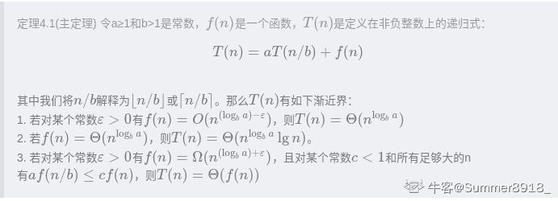

发表于 2020-01-22 19:51:27

* * *

## 3

下列关于动态规划算法说法错误的是（）

正确答案: B   你的答案: 空 (错误)

```cpp
动态规划关键在于正确地写出基本的递推关系式和恰当的边界条件
```

```cpp
当某阶段的状态确定后，当前的状态是对以往决策的总结并且直接影响未来的决策
```

```cpp
动态规划算法根据子问题具有重叠性，对每个子问题都只解一次
```

```cpp
动态规划算法将原来具有指数级复杂度的搜索算法改进成具有多项式时间算法
```

本题知识点

Java 工程师 爱奇艺 算法工程师 C++工程师 安卓工程师 iOS 工程师 测试开发工程师 前端工程师 2020

讨论

[WMYW](https://www.nowcoder.com/profile/222543223)

动态规划只是说某阶段的最优解状态是对以往状态的总结并且影响未来的的状态，并不是说所有的状态是这样的

发表于 2020-03-21 12:55:55

* * *

[vicyor](https://www.nowcoder.com/profile/2210832)

动态规划:  1.递推关系式.  2.子问题重叠.  3.最优子结构.

发表于 2020-02-14 22:29:13

* * *

[2 楼大世界](https://www.nowcoder.com/profile/401379371)

无后效性。即子问题的解一旦确定，就不再改变，不受在这之后、包含它的更大的问题的求解决策影响。

发表于 2020-06-22 22:40:49

* * *

## 4

已知图 G 的邻接表如下图所示，则从 V1 点出发进行广度优先遍历的序列为（      ）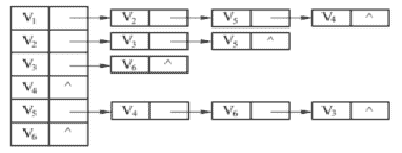

正确答案: B   你的答案: 空 (错误)

```cpp
V1，V2，V3，V4，V5，V6
```

```cpp
V1，V2，V5，V4，V3，V6
```

```cpp
V1，V2，V3，V6，V5，V4
```

```cpp
V1，V2，V4，V6，V5，V3
```

本题知识点

Java 工程师 爱奇艺 算法工程师 C++工程师 安卓工程师 iOS 工程师 测试开发工程师 前端工程师 2020

讨论

[(→_→)](https://www.nowcoder.com/profile/324939275)

广度优先遍历用到**队列**知识点。从 v1 开始，v1 先进队列：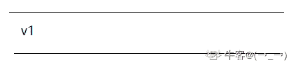然后访问 v1，v1 出队列，v1 邻接点 v2、v5、v4 进队列：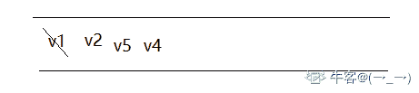
然后按队列里顺序访问 v2，v2 出队列，v2 临邻接点 v3、v5 进队列，v5 已经在队列里，只进 v3。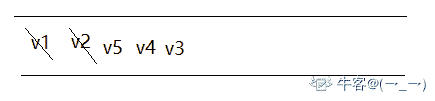然后访问 v5，v5 出，v6 进队列。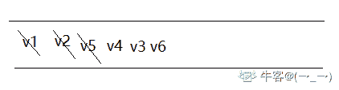...以此类推，得广度优先搜索遍历序列：v1 v2 v5 v4 v3 v6

发表于 2020-01-17 19:47:13

* * *

[里里吖](https://www.nowcoder.com/profile/850291996)

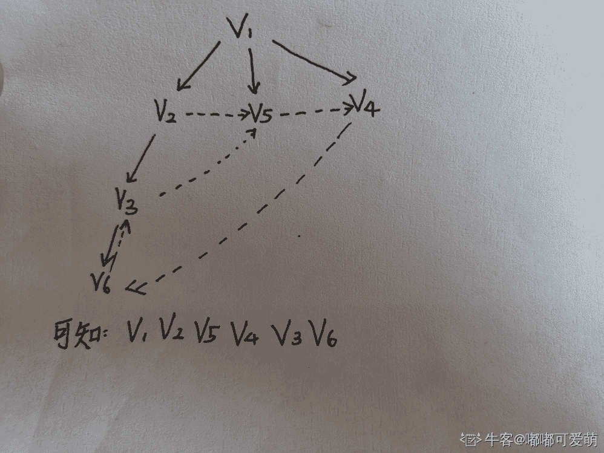

发表于 2020-03-29 15:06:59

* * *

[Primer___](https://www.nowcoder.com/profile/3039649)

首先,你要把邻接表转换成节点相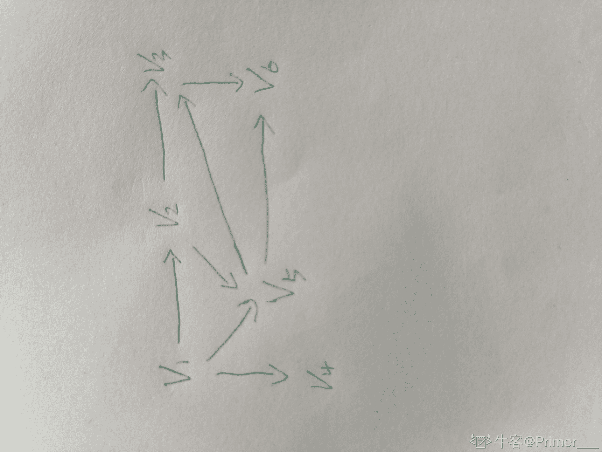连的图,再根据楼下的方法使用队列实现遍历

发表于 2020-01-27 11:31:20

* * *

## 5

以下哪个不是队列的应用（      ）

正确答案: D   你的答案: 空 (错误)

```cpp
图的广度优先搜索
```

```cpp
设置打印数据缓冲区
```

```cpp
树的层次遍历
```

```cpp
中缀表达式转后缀表达式
```

本题知识点

Java 工程师 爱奇艺 算法工程师 C++工程师 安卓工程师 iOS 工程师 测试开发工程师 前端工程师 2020

讨论

[(→_→)](https://www.nowcoder.com/profile/324939275)

后缀表达式也叫逆波兰式。中缀转后缀是用栈实现的。

发表于 2020-01-17 20:05:40

* * *

[神韵 499](https://www.nowcoder.com/profile/663125690)

表达式：a+b*c+(d*e+f)**g 转化后是 abc**+de*f+g*+ 

发表于 2020-02-14 15:08:13

* * *

## 6

有如图所示的二叉树，其后序遍历的序列为（      ）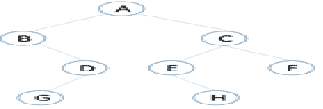

正确答案: C   你的答案: 空 (错误)

```cpp
ABDGCEHF
```

```cpp
BGDAEHCF
```

```cpp
GDBHEFCA
```

```cpp
ACFEHBDG
```

本题知识点

Java 工程师 爱奇艺 算法工程师 C++工程师 安卓工程师 iOS 工程师 测试开发工程师 前端工程师 2020

讨论

[奥特激光 biabiabia](https://www.nowcoder.com/profile/202415115)

以此题为例:后序遍历:     特点: 左右根    快速判断: 首节点 A 会在末尾，所以选 C 前序遍历:     特点: 根左右
    快速判断 :首节点 A 会在开头、中序遍历:    特点: 左根右

编辑于 2020-02-11 11:23:00

* * *

[FrontEndEngineer](https://www.nowcoder.com/profile/785935072)

后序遍历：左右跟，A 是最大的跟，肯定是最后

发表于 2020-01-15 15:47:34

* * *

[牛客 541126623 号](https://www.nowcoder.com/profile/541126623)

先序遍历：根左右中序遍历：左根右后序遍历：左右根（三种遍历仅仅只改变根的位置）

发表于 2021-12-22 23:48:11

* * *

## 7

折半查找法对带查找列表的要求为（      ）

正确答案: B   你的答案: 空 (错误)

```cpp
必须采用链式存储结构、必须按关键字大小有序排列
```

```cpp
必须采用顺序存储结构、必须按关键字大小有序排列
```

```cpp
必须采用链式存储结构、必须没有数值相等的元素
```

```cpp
必须采用链式存储结构、必须有数值相等的元素
```

本题知识点

Java 工程师 爱奇艺 算法工程师 C++工程师 安卓工程师 iOS 工程师 测试开发工程师 前端工程师 2020

讨论

[contorta](https://www.nowcoder.com/profile/819065586)

折半查找需要和带查找元素进行比较，从而确定缩减范围的方向，逼近真实存在的位置，所以列表需要有序。顺序存储有下标啊，不香吗......内存中存储单元是连续的，利于查找。

发表于 2020-04-30 13:35:30

* * *

[杨超越护体保 offer](https://www.nowcoder.com/profile/6343048)

B

发表于 2020-03-01 12:39:31

* * *

[法克瓜](https://www.nowcoder.com/profile/598273059)

链式和顺序还是有区别的

发表于 2020-03-01 09:19:08

* * *

## 8

一组 N 个站点共享一个 30Kbps 的纯 ALOHA 信道， 每个站点平均每 100s 输出一个 2000bit 的帧。试求出 N 的最大值（      ）

正确答案: B   你的答案: 空 (错误)

```cpp
1030
```

```cpp
276
```

```cpp
1500
```

```cpp
1200
```

本题知识点

Java 工程师 爱奇艺 算法工程师 C++工程师 iOS 工程师 测试开发工程师 前端工程师 2020

讨论

[Ahuiyo](https://www.nowcoder.com/profile/443955132)

ALOHA 信道的吞吐公式为 S=Ge-2G
在式中，S 为吞吐量，G 为单位负载。
转换成一阶导数可以得到 Smax= 18．4%

本题答案：

0.184×30kbps=5.52kbps
2000bit÷100s=20bps
N=5520bps÷20bps=276

没做过 ALOHA 信道信道的题。。

编辑于 2020-01-15 10:33:01

* * *

[Primer___](https://www.nowcoder.com/profile/3039649)

aloha 信道的最高利用率为 18.4%至于这个最高利用率怎么来的,你可以参考大佬的这篇博客[`blog.csdn.net/Jaihk662/article/details/80386620`](https://blog.csdn.net/Jaihk662/article/details/80386620)

发表于 2020-01-27 11:48:09

* * *

[神韵 499](https://www.nowcoder.com/profile/663125690)

最大利用率 0.1840.184*30*1000=5520bps（已经化成 bps，1000 转换）每 s2000/1000=20 结果：5520/20=276

发表于 2020-02-14 15:04:21

* * *

## 9

在 Linux 系统中，某文件权限的分数是 754，则以下说法错误的是（   ）。

正确答案: B   你的答案: 空 (错误)

```cpp
拥有者的权限是可读、可写、可执行
```

```cpp
同用户组的权限是可写可执行
```

```cpp
其他用户权限只有可读
```

```cpp
所有用户对该文件都可读
```

本题知识点

Java 工程师 爱奇艺 算法工程师 C++工程师 iOS 工程师 测试开发工程师 前端工程师 2020

讨论

[钅不换](https://www.nowcoder.com/profile/307027944)

754 对应 3 种用户的权限：文件所有者、同组用户、其他用户权限    权限数值       具体作用
r             4               read，读取。当前用户可以读取文件内容，当前用户可以浏览目录。
w            2              write，写入。当前用户可以新增或修改文件内容，当前用户可以删除、移动目录或目录内文件。
x            1              execute，执行。当前用户可以执行文件，当前用户可以进入目录。因此 7=4+2+1 文件所有者对该文件的的权限为可读可写可执行（A 正确）；5=4+1  同组用户对该文件的权限为可读可执行；4=4 所其他用户对该文件的权限为可读（C 正确）；综上所有用户都有读权限（D 正确）

发表于 2020-01-16 15:14:12

* * *

[牛客 405875030 号](https://www.nowcoder.com/profile/405875030)

把 754 转换成二进制 111 101 100，然后三个一组一一对应，1 表示可以，0 表示不可以                                    read     write       execute 三种用户  拥有者     ：    1           1              1                 同组用户 ：    1           0              1                 其他用户 ：    1           0              0 对应选项，这样解释是不是就能看明白了

发表于 2022-02-09 17:05:59

* * *

[一个弱鸡的追梦者](https://www.nowcoder.com/profile/300018543)

是选错误的....

发表于 2021-03-15 10:58:52

* * *

## 10

有一张表，列名称和列类型如下：

```cpp
Id Int unsigned
Uname Varchar(30)
gender Char(1)
weight Tinyint unsigned
Birth Date
Salary Decimal(10,2) 
lastlogin Datetime
info Varchar(2000)
```

对这张表进行优化，可行的是（      ）

正确答案: B C D   你的答案: 空 (错误)

```cpp
不用优化
```

```cpp
将 Id 列设置为主键
```

```cpp
为了提高查询速度，让变长的列定长
```

```cpp
Info 列放在单独的一张表中
```

本题知识点

Java 工程师 爱奇艺 算法工程师 C++工程师 iOS 工程师 测试开发工程师 前端工程师 2020

讨论

[大厂 offer 呢](https://www.nowcoder.com/profile/4097742)

C 的话也不一定吧，我记得 InnoDB 表要是使用的是变长字符集（例如 UTF8），那么即使定义的是 CHAR，实际上会按 VARCHAR 存储。

发表于 2020-02-14 07:00:16

* * *

[蓝鲸向海](https://www.nowcoder.com/profile/945510754)

主键会添加索引， 定长字段有利于查询优化， 将大数据量字段单独放在一个表中可以优化数据库表的存储性能

发表于 2020-02-11 17:51:09

* * *

[手够快就风就跟不上](https://www.nowcoder.com/profile/66740160)

info 占用内存太大，单独用一张表，在没有 SQL 调用它时，性能更高吧

发表于 2020-02-08 00:21:52

* * *

## 11

在 Java 线程中可以通过 setDaemon(true);设置线程为守护线程，可以使用 join()合并线程。如何正确使用两个方法（）

正确答案: A   你的答案: 空 (错误)

```cpp
在启动线程 start()前使用 setDaemon(true)；
```

```cpp
在启动线程 start()前使用 join()；
```

```cpp
在启动线程 start()后使用 setDaemon(true)；
```

```cpp
两个方法都要放在 start()方法之前调用
```

本题知识点

Java 工程师 爱奇艺 安卓工程师 2020

讨论

[offer 快来球球了](https://www.nowcoder.com/profile/243031380)

jion（）在 start（）之后守护线程[`www.jianshu.com/p/2f0d7db6497b`](https://www.jianshu.com/p/2f0d7db6497b)

编辑于 2020-01-16 16:42:23

* * *

[vicyor](https://www.nowcoder.com/profile/2210832)

守护线程是 Java 线程的一种,JVM 是在所有非守护线程退出后才退出.Java 的守护线程有垃圾回收器线程,终结器线程等.t.join 方法是将当前线程加入 t 的 wait 队列,等到 t 执行完成再唤醒当前线程.

编辑于 2020-02-14 23:18:15

* * *

## 12

对于如下代码,描述正确的是:

```cpp
class Animal{
   public void move(){
      System.out.println("the animal is moving");
   }
}

class Dog extends Animal{
   public void move(){
      System.out.println("the dog can run");
   }
   public void bark(){
      System.out.println("the dog can bark");
   }
}

public class TestDog{
   public static void main(String args[]){
      Animal a = new Animal();  
      Animal b = new Dog();    
   }
}
```

正确答案: B D   你的答案: 空 (错误)

```cpp
a 对象可以调用 move 方法，输出为：the dog can run
```

```cpp
a 对象可以调用 move 方法，输出为：the animal is moving
```

```cpp
b 对象可以调用 bark 方法输出为：the dog can bark
```

```cpp
b 对象不能调用 bark 方法。
```

本题知识点

Java 工程师 爱奇艺 安卓工程师 2020

讨论

[wagnzitiansky](https://www.nowcoder.com/profile/999348018)

这答案有问题吧

发表于 2020-01-20 10:56:14

* * *

[神韵 499](https://www.nowcoder.com/profile/663125690)

编译看父类，运行看子类，不纠结。题目有问题

发表于 2020-02-14 15:08:55

* * *

[一抹星尘](https://www.nowcoder.com/profile/691738988)

这题不应该是多选吗😉

发表于 2020-01-18 22:06:24

* * *

## 13

对于如下代码，运行结果是：

```cpp
public class Test {   
   public static void main(String[] args) {   
     double[] nums = {-1.6};   
     for (double num : nums) {   
       test(num);   
     }   
   }    
   private static void test(double num) {   
     System.out.println(Math.floor(num));   
     System.out.println(Math.ceil(num));   
   }   
 }
```

正确答案: A   你的答案: 空 (错误)

```cpp
'-2.0
-1.0

```

```cpp
'-1.0
-2.0

```

```cpp
'-2
-1

```

```cpp
'2
1

```

本题知识点

Java 工程师 爱奇艺 安卓工程师 2020

讨论

[怒求同名](https://www.nowcoder.com/profile/972106346)

floor：地板    ——>    向下取整 ceil：天花板  ——>    向上取整由于 double 类型，小数点依旧存在

发表于 2020-02-08 14:14:12

* * *

[苏听](https://www.nowcoder.com/profile/246760778)

floor 返回不大于的最大整数 ceil 则是不小于他的最小整数 

发表于 2020-01-31 19:32:35

* * *

## 14

阅读下列代码

```cpp
import java.util.Arrays;
public class Test
{
     public static void main(String [] args)
     {
         int a[] ={34,12,35,54,22,33,56};
        Arrays.sort(a);
        for(int j=0;j<a.length;j++)
            System.out.print(a[j]+"");
  }
}
```

输出结果正确的是

正确答案: A   你的答案: 空 (错误)

```cpp
12 22 33 34 35 54 56
```

```cpp
22 33 34 35 54 12 56
```

```cpp
56 54 35 34 33 22 12
```

```cpp
33 34 35 54 12 56 22
```

本题知识点

Java 工程师 爱奇艺 2020

讨论

[醉酒斟](https://www.nowcoder.com/profile/320202700)

答案有问题，

发表于 2020-01-31 18:46:41

* * *

[百年不死小强](https://www.nowcoder.com/profile/736307028)

答案错误，应该是 A

发表于 2020-02-16 23:30:20

* * *

[9102hhu](https://www.nowcoder.com/profile/728886408)

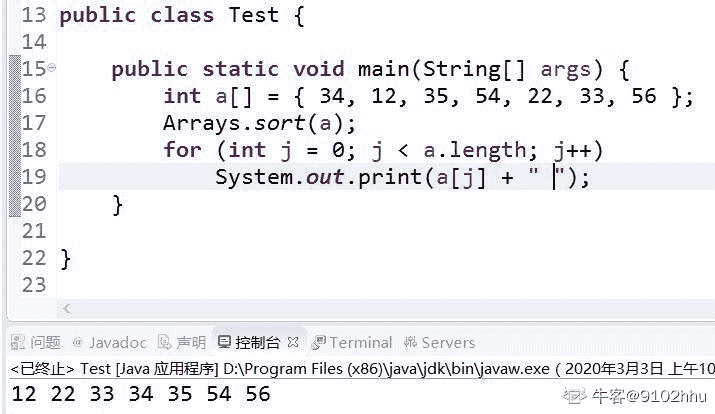

发表于 2020-03-03 10:44:15

* * *

## 15

一个函数定义如下：

```cpp
public void doSomething( int[][] mat)
{
    for( int row = 0; row < mat.length; row++)
        for(int col = 0; col < mat[0].length; col++)
            mat[row][col] = mat[row][mat[0].length - 1 - col];
}
```

如果 mat 为下列 2 行 6 列的值：

```cpp
1  3  5  7  9  11
0  2  4  6  8  10
```

那么,doSomething(mat)执行完成后，mat 的值是？（）

正确答案: A   你的答案: 空 (错误)

```cpp
11  9  7  7  9  11
10  8  6  6  8  10

```

```cpp
1  3  5  5  3  1
0  2  4  4  2  0

```

```cpp
11  9  7  5  3  1
10  8  6  4  2  0

```

```cpp
1  3  5  7  9  11
1  3  5  7  9  11

```

本题知识点

Java 工程师 爱奇艺 安卓工程师 2020

讨论

[里里吖](https://www.nowcoder.com/profile/850291996)

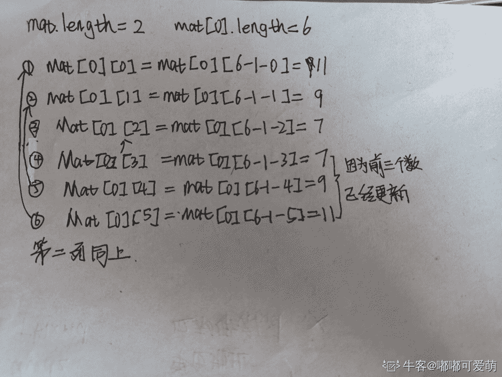

发表于 2020-03-29 15:53:01

* * *

[Juvenile 少年](https://www.nowcoder.com/profile/629902660)

这个题目好坑

发表于 2020-01-15 09:06:44

* * *

[java 小和尚](https://www.nowcoder.com/profile/521338141)

忽略了覆盖🤪

发表于 2020-09-07 09:36:54

* * *

## 16

```cpp
public class Test {
 private int eat=1;
 double drink = 2.0;
 protected int sleep = 3;
 public double run = 4.0;
}
```

与 Test 在同一个包下的子类对象可以访问以下哪些变量（）

正确答案: B C D   你的答案: 空 (错误)

```cpp
eat
```

```cpp
drink
```

```cpp
sleep
```

```cpp
run
```

本题知识点

Java 工程师 爱奇艺 安卓工程师 2020

讨论

[蓝鲸向海](https://www.nowcoder.com/profile/945510754)

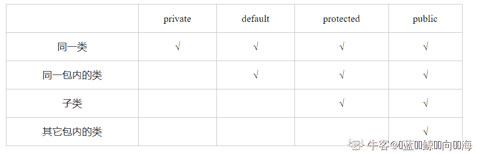

发表于 2020-02-11 17:49:16

* * *

## 17

下面关于异常的描述正确的是（）

正确答案: A C D   你的答案: 空 (错误)

```cpp
Throwable 是所有异常的根
```

```cpp
所有异常都是在运行后报错
```

```cpp
异常分为 Error 和 EXception
```

```cpp
有一部分异常编译器会程序员检查并处理
```

本题知识点

Java 工程师 爱奇艺 安卓工程师 2020

讨论

[L/ty](https://www.nowcoder.com/profile/731354023)

所有异常类都是从 java.lang.Exception 类继承的子类，而 Exception 类又是 Throwable 类的子类，Throwable 类除 Exception 之外，还有个子类 Error.

发表于 2020-02-11 11:39:50

* * *

[人余月半子](https://www.nowcoder.com/profile/514787832)

[`blog.nowcoder.net/n/86f432128b9344d8bb353acd34c83966`](https://blog.nowcoder.net/n/86f432128b9344d8bb353acd34c83966)

发表于 2020-02-21 17:51:32

* * *

[压榨花生油](https://www.nowcoder.com/profile/86358619)

所以异常的跟不应该是 Object 类吗？哭唧唧

发表于 2020-02-06 13:09:42

* * *

## 18

关于多线程，以下说法正确的是（）

正确答案: C   你的答案: 空 (错误)

```cpp
并发和并行都用到了多线程
```

```cpp
要实现多线程只可以通过继承 Thread 类
```

```cpp
synchronized 关键字是为了解决共享资源竞争的问题
```

```cpp
在 java 中，每个对象可以获得多个同步锁
```

本题知识点

Java 工程师 爱奇艺 安卓工程师 2020

讨论

[Ri3e](https://www.nowcoder.com/profile/394034947)

`并发`:同一时刻只能有一条指令执行，但多个进程指令被快速的轮换执行，使得在宏观上具有多个进程同时执行的效果，但在微观上并不是同时执行的，只是把时间分成若干段，使多个进程快速交替的执行。

`并行`:同一时刻，有多条指令在多个处理器上同时执行。所以无论从微观还是从宏观来看，二者都是一起执行的

发表于 2020-03-22 11:35:53

* * *

[vicyor](https://www.nowcoder.com/profile/2210832)

并行可以多个进程在多台机器上跑.

发表于 2020-02-14 23:20:37

* * *

[zzhxufeng](https://www.nowcoder.com/profile/158953357)

并发: 宏观上并行, 微观上串行.并行: 宏观微观上都并行.

发表于 2020-08-23 13:16:01

* * *

## 19

下面关于创建型模式说法错误的是（      ）

正确答案: B   你的答案: 空 (错误)

```cpp
适配器模式属于结构型模式
```

```cpp
创建型模式关注的是功能的实现
```

```cpp
当我们想创建一个具体的对象而又不希望指定具体的类时可以使用创建型模式
```

```cpp
创建者模式是一个对对象的构建过程“精细化”的构建过程，每个部分的构建可能是变化的，但是对象的组织过程是固定的
```

本题知识点

Java 工程师 爱奇艺 C++工程师 2020 设计模式

讨论

[🌚🎅🌝20191116205068](https://www.nowcoder.com/profile/775586418)

适配器型属于结构型模式

编辑于 2021-02-20 11:03:41

* * *

[牛客 725193973 号](https://www.nowcoder.com/profile/725193973)

创建型：对象的创建；结构型：对象的组成；行为型：对象的功能但是 A 不属于创建型属于结构型吧

发表于 2020-09-04 17:44:27

* * *

[bukun](https://www.nowcoder.com/profile/514169517)

AB 都错了

发表于 2020-08-07 14:58:02

* * *

## 20

在顺序图中，如下图形表示的是（      ）

正确答案: A   你的答案: 空 (错误)

```cpp
激活的对象
```

```cpp
带有生命线的对象
```

```cpp
未激活的对象
```

```cpp
注释体
```

本题知识点

Java 工程师 爱奇艺 C++工程师 2020

讨论

[铁牛同学](https://www.nowcoder.com/profile/344723619)

激活期

发表于 2021-11-04 18:01:46

* * *

[满天星 16](https://www.nowcoder.com/profile/5698565)

UML 顺序图

发表于 2020-03-20 16:07:27

* * *