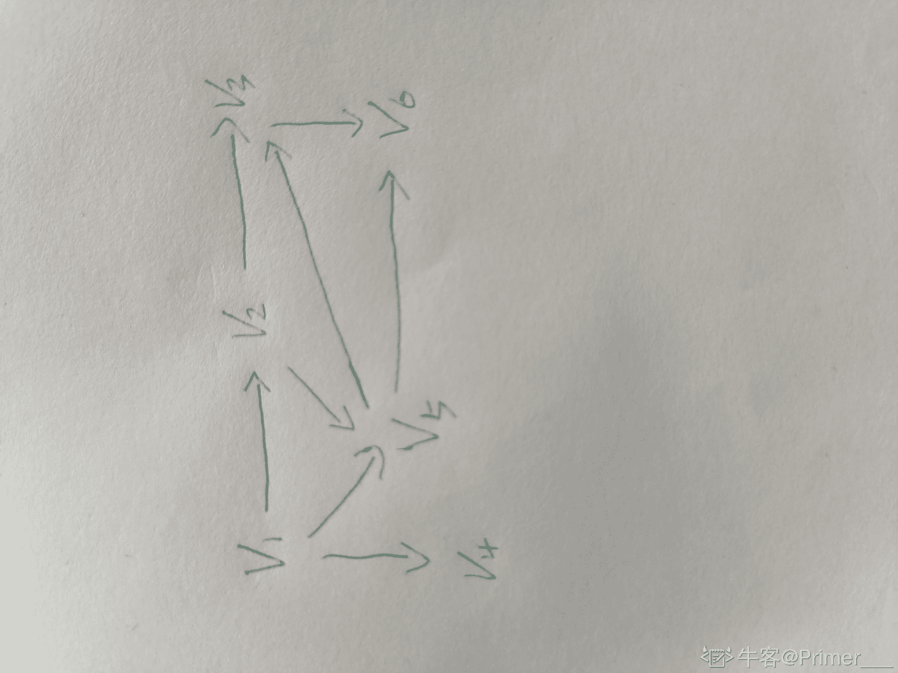
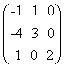

# 爱奇艺 2020 校招算法方向笔试题（第一场）

## 1

计算下列程序的时间复杂度（）

```cpp
for (i=1;i<n;i++)
   for(j=1;j<m;j++)
     {a1,a2,a3,a4};
```

正确答案: B   你的答案: 空 (错误)

本题知识点

Java 工程师 爱奇艺 算法工程师 C++工程师 安卓工程师 iOS 工程师 测试开发工程师 前端工程师 2020

讨论

[bukun](https://www.nowcoder.com/profile/514169517)

n * m

发表于 2020-08-07 14:46:04

* * *

[caiKaten](https://www.nowcoder.com/profile/8094368)

嵌套两个 for 循环，执行 n*m 次

发表于 2020-11-03 11:12:04

* * *

[牛客 120004240 号](https://www.nowcoder.com/profile/120004240)

第一个循环没有花括号，为什么会执行？

发表于 2021-10-04 09:28:34

* * *

## 2

求递归方程 T(n)=4T(n/2)+n 的解  (    )

正确答案: B   你的答案: 空 (错误)

本题知识点

Java 工程师 爱奇艺 算法工程师 C++工程师 安卓工程师 iOS 工程师 测试开发工程师 前端工程师 2020

讨论

[vicyor](https://www.nowcoder.com/profile/2210832)

主定理提供了分治方法带来的递归表达式的渐进复杂度分析.1.将规模为 n 的问题通过分治,得到 a 个规模为 n/b 的问题,每次递归带来的额外计算为 c(n^d)   即 T(n)=a(n/b)+c(n^d)  若 a=b^d , T(n)=O(n^dlog(n))  若 a<b^d , T(n)=O(n^d)  若 a>b^d , T(n)=O(n^logb(a))该题 a=4,b=2,d=1,a>2   T(n)=O(n^logb(a))=O(n²)

发表于 2020-02-14 22:23:45

* * *

[百年不死小强](https://www.nowcoder.com/profile/736307028)

T(n) = 4T(n/2) + nT(n)  + n = 4( T(n/2) + n/2)令 f(n) = T(n) + n,则上面的等式变为：f(n) = 4f(n/2)所以，答案为 B

发表于 2020-02-16 23:11:23

* * *

[Summer8918_](https://www.nowcoder.com/profile/839491412)


发表于 2020-01-22 19:51:27

* * *

## 3

下列关于动态规划算法说法错误的是（）

正确答案: B   你的答案: 空 (错误)

```cpp
动态规划关键在于正确地写出基本的递推关系式和恰当的边界条件
```

```cpp
当某阶段的状态确定后，当前的状态是对以往决策的总结并且直接影响未来的决策
```

```cpp
动态规划算法根据子问题具有重叠性，对每个子问题都只解一次
```

```cpp
动态规划算法将原来具有指数级复杂度的搜索算法改进成具有多项式时间算法
```

本题知识点

Java 工程师 爱奇艺 算法工程师 C++工程师 安卓工程师 iOS 工程师 测试开发工程师 前端工程师 2020

讨论

[WMYW](https://www.nowcoder.com/profile/222543223)

动态规划只是说某阶段的最优解状态是对以往状态的总结并且影响未来的的状态，并不是说所有的状态是这样的

发表于 2020-03-21 12:55:55

* * *

[vicyor](https://www.nowcoder.com/profile/2210832)

动态规划:  1.递推关系式.  2.子问题重叠.  3.最优子结构.

发表于 2020-02-14 22:29:13

* * *

[2 楼大世界](https://www.nowcoder.com/profile/401379371)

无后效性。即子问题的解一旦确定，就不再改变，不受在这之后、包含它的更大的问题的求解决策影响。

发表于 2020-06-22 22:40:49

* * *

## 4

已知图 G 的邻接表如下图所示，则从 V1 点出发进行广度优先遍历的序列为（      ）

正确答案: B   你的答案: 空 (错误)

```cpp
V1，V2，V3，V4，V5，V6
```

```cpp
V1，V2，V5，V4，V3，V6
```

```cpp
V1，V2，V3，V6，V5，V4
```

```cpp
V1，V2，V4，V6，V5，V3
```

本题知识点

Java 工程师 爱奇艺 算法工程师 C++工程师 安卓工程师 iOS 工程师 测试开发工程师 前端工程师 2020

讨论

[(→_→)](https://www.nowcoder.com/profile/324939275)

广度优先遍历用到**队列**知识点。从 v1 开始，v1 先进队列：然后访问 v1，v1 出队列，v1 邻接点 v2、v5、v4 进队列：
然后按队列里顺序访问 v2，v2 出队列，v2 临邻接点 v3、v5 进队列，v5 已经在队列里，只进 v3。然后访问 v5，v5 出，v6 进队列。...以此类推，得广度优先搜索遍历序列：v1 v2 v5 v4 v3 v6

发表于 2020-01-17 19:47:13

* * *

[里里吖](https://www.nowcoder.com/profile/850291996)


发表于 2020-03-29 15:06:59

* * *

[Primer___](https://www.nowcoder.com/profile/3039649)

首先,你要把邻接表转换成节点相连的图,再根据楼下的方法使用队列实现遍历

发表于 2020-01-27 11:31:20

* * *

## 5

以下哪个不是队列的应用（      ）

正确答案: D   你的答案: 空 (错误)

```cpp
图的广度优先搜索
```

```cpp
设置打印数据缓冲区
```

```cpp
树的层次遍历
```

```cpp
中缀表达式转后缀表达式
```

本题知识点

Java 工程师 爱奇艺 算法工程师 C++工程师 安卓工程师 iOS 工程师 测试开发工程师 前端工程师 2020

讨论

[(→_→)](https://www.nowcoder.com/profile/324939275)

后缀表达式也叫逆波兰式。中缀转后缀是用栈实现的。

发表于 2020-01-17 20:05:40

* * *

[神韵 499](https://www.nowcoder.com/profile/663125690)

表达式：a+b*c+(d*e+f)**g 转化后是 abc**+de*f+g*+ 

发表于 2020-02-14 15:08:13

* * *

## 6

有如图所示的二叉树，其后序遍历的序列为（      ）

正确答案: C   你的答案: 空 (错误)

```cpp
ABDGCEHF
```

```cpp
BGDAEHCF
```

```cpp
GDBHEFCA
```

```cpp
ACFEHBDG
```

本题知识点

Java 工程师 爱奇艺 算法工程师 C++工程师 安卓工程师 iOS 工程师 测试开发工程师 前端工程师 2020

讨论

[奥特激光 biabiabia](https://www.nowcoder.com/profile/202415115)

以此题为例:后序遍历:     特点: 左右根    快速判断: 首节点 A 会在末尾，所以选 C 前序遍历:     特点: 根左右
    快速判断 :首节点 A 会在开头、中序遍历:    特点: 左根右

编辑于 2020-02-11 11:23:00

* * *

[FrontEndEngineer](https://www.nowcoder.com/profile/785935072)

后序遍历：左右跟，A 是最大的跟，肯定是最后

发表于 2020-01-15 15:47:34

* * *

[牛客 541126623 号](https://www.nowcoder.com/profile/541126623)

先序遍历：根左右中序遍历：左根右后序遍历：左右根（三种遍历仅仅只改变根的位置）

发表于 2021-12-22 23:48:11

* * *

## 7

折半查找法对带查找列表的要求为（      ）

正确答案: B   你的答案: 空 (错误)

```cpp
必须采用链式存储结构、必须按关键字大小有序排列
```

```cpp
必须采用顺序存储结构、必须按关键字大小有序排列
```

```cpp
必须采用链式存储结构、必须没有数值相等的元素
```

```cpp
必须采用链式存储结构、必须有数值相等的元素
```

本题知识点

Java 工程师 爱奇艺 算法工程师 C++工程师 安卓工程师 iOS 工程师 测试开发工程师 前端工程师 2020

讨论

[contorta](https://www.nowcoder.com/profile/819065586)

折半查找需要和带查找元素进行比较，从而确定缩减范围的方向，逼近真实存在的位置，所以列表需要有序。顺序存储有下标啊，不香吗......内存中存储单元是连续的，利于查找。

发表于 2020-04-30 13:35:30

* * *

[杨超越护体保 offer](https://www.nowcoder.com/profile/6343048)

B

发表于 2020-03-01 12:39:31

* * *

[法克瓜](https://www.nowcoder.com/profile/598273059)

链式和顺序还是有区别的

发表于 2020-03-01 09:19:08

* * *

## 8

一组 N 个站点共享一个 30Kbps 的纯 ALOHA 信道， 每个站点平均每 100s 输出一个 2000bit 的帧。试求出 N 的最大值（      ）

正确答案: B   你的答案: 空 (错误)

```cpp
1030
```

```cpp
276
```

```cpp
1500
```

```cpp
1200
```

本题知识点

Java 工程师 爱奇艺 算法工程师 C++工程师 iOS 工程师 测试开发工程师 前端工程师 2020

讨论

[Ahuiyo](https://www.nowcoder.com/profile/443955132)

ALOHA 信道的吞吐公式为 S=Ge-2G
在式中，S 为吞吐量，G 为单位负载。
转换成一阶导数可以得到 Smax= 18．4%

本题答案：

0.184×30kbps=5.52kbps
2000bit÷100s=20bps
N=5520bps÷20bps=276

没做过 ALOHA 信道信道的题。。

编辑于 2020-01-15 10:33:01

* * *

[Primer___](https://www.nowcoder.com/profile/3039649)

aloha 信道的最高利用率为 18.4%至于这个最高利用率怎么来的,你可以参考大佬的这篇博客[`blog.csdn.net/Jaihk662/article/details/80386620`](https://blog.csdn.net/Jaihk662/article/details/80386620)

发表于 2020-01-27 11:48:09

* * *

[神韵 499](https://www.nowcoder.com/profile/663125690)

最大利用率 0.1840.184*30*1000=5520bps（已经化成 bps，1000 转换）每 s2000/1000=20 结果：5520/20=276

发表于 2020-02-14 15:04:21

* * *

## 9

在 Linux 系统中，某文件权限的分数是 754，则以下说法错误的是（   ）。

正确答案: B   你的答案: 空 (错误)

```cpp
拥有者的权限是可读、可写、可执行
```

```cpp
同用户组的权限是可写可执行
```

```cpp
其他用户权限只有可读
```

```cpp
所有用户对该文件都可读
```

本题知识点

Java 工程师 爱奇艺 算法工程师 C++工程师 iOS 工程师 测试开发工程师 前端工程师 2020

讨论

[钅不换](https://www.nowcoder.com/profile/307027944)

754 对应 3 种用户的权限：文件所有者、同组用户、其他用户权限    权限数值       具体作用
r             4               read，读取。当前用户可以读取文件内容，当前用户可以浏览目录。
w            2              write，写入。当前用户可以新增或修改文件内容，当前用户可以删除、移动目录或目录内文件。
x            1              execute，执行。当前用户可以执行文件，当前用户可以进入目录。因此 7=4+2+1 文件所有者对该文件的的权限为可读可写可执行（A 正确）；5=4+1  同组用户对该文件的权限为可读可执行；4=4 所其他用户对该文件的权限为可读（C 正确）；综上所有用户都有读权限（D 正确）

发表于 2020-01-16 15:14:12

* * *

[牛客 405875030 号](https://www.nowcoder.com/profile/405875030)

把 754 转换成二进制 111 101 100，然后三个一组一一对应，1 表示可以，0 表示不可以                                    read     write       execute 三种用户  拥有者     ：    1           1              1                 同组用户 ：    1           0              1                 其他用户 ：    1           0              0 对应选项，这样解释是不是就能看明白了

发表于 2022-02-09 17:05:59

* * *

[一个弱鸡的追梦者](https://www.nowcoder.com/profile/300018543)

是选错误的....

发表于 2021-03-15 10:58:52

* * *

## 10

有一张表，列名称和列类型如下：

```cpp
Id Int unsigned
Uname Varchar(30)
gender Char(1)
weight Tinyint unsigned
Birth Date
Salary Decimal(10,2) 
lastlogin Datetime
info Varchar(2000)
```

对这张表进行优化，可行的是（      ）

正确答案: B C D   你的答案: 空 (错误)

```cpp
不用优化
```

```cpp
将 Id 列设置为主键
```

```cpp
为了提高查询速度，让变长的列定长
```

```cpp
Info 列放在单独的一张表中
```

本题知识点

Java 工程师 爱奇艺 算法工程师 C++工程师 iOS 工程师 测试开发工程师 前端工程师 2020

讨论

[大厂 offer 呢](https://www.nowcoder.com/profile/4097742)

C 的话也不一定吧，我记得 InnoDB 表要是使用的是变长字符集（例如 UTF8），那么即使定义的是 CHAR，实际上会按 VARCHAR 存储。

发表于 2020-02-14 07:00:16

* * *

[蓝鲸向海](https://www.nowcoder.com/profile/945510754)

主键会添加索引， 定长字段有利于查询优化， 将大数据量字段单独放在一个表中可以优化数据库表的存储性能

发表于 2020-02-11 17:51:09

* * *

[手够快就风就跟不上](https://www.nowcoder.com/profile/66740160)

info 占用内存太大，单独用一张表，在没有 SQL 调用它时，性能更高吧

发表于 2020-02-08 00:21:52

* * *

## 11

下列程序的运行结果是 9 7 5 3 1 5 ，请将横线处缺失程序补充完整（）

```cpp
#include <iostream>
#include <deque>
#include<iterator>
#include <algorithm>
using namespace std;
typedef deque<int >D;
template< class T >
void f( T &s )
{
  D::iterator it;
     for(int i=0;i<5;i++)
  s.push_front(2*i+1);
  s.push_back(*find(s.begin(),s.end(),___________ ));
   for(it=s.begin();it!=s.end();it++)
    cout<<*it<<" ";
}
int main()
{
   D S;
   f(S);
   return 0;
}
```

正确答案: C   你的答案: 空 (错误)

```cpp
1
```

```cpp
0
```

```cpp
5
```

```cpp
4
```

本题知识点

算法工程师 爱奇艺 C++工程师 iOS 工程师 2020

讨论

[yf15273073192](https://www.nowcoder.com/profile/800663972)

这里的 s 队列的结构像是 双向链表结构 每进入一个元素 将该元素插入到 链表的最前端。s.push_back(*find())是将链表中某一存在的元素 再次加入到最尾端。

发表于 2020-09-12 15:35:01

* * *

## 12

如果一个 4 位正整数等于其各位数字的 4 次方之和，则称该数为四叶玫瑰数。例如，1634 = 1*1*1*1 + 6*6*6*6 + 3*3*3*3 + 4*4*4*4， 因此 1634 就是一个四叶玫瑰数。
以下程序欲找出 10000 以内的所有四叶玫瑰数，并逐个存放到 result 数组中，所有四叶玫瑰数的个数存入变量 count 中。其中变量 ge、shi、bai、qian 分别存放要测试的一个 4 位数的个位、十位、百位、千位。

```cpp
 int result[100];
 int ge, shi, bai, qian;
 int i, count=0;
 for (i=1000; i<=9999; i++)
 {
  ge = i % 10;
  shi = i/10 % 10;
  bai = i/100 % 10;
  qian = ___[1]___;
  if ( ___[2]___)
   result[count++]=i;
  ___[3]___
 }
```

要将程序补充完整，使程序完成预定的功能，下列有关在以上程序的下划线处填写内容的说法中正确的是（  ）。

正确答案: A   你的答案: 空 (错误)

```cpp
在[1]处应填写：i/1000
```

```cpp
在[2]处应填写：ge⁴ + shi⁴ + bai⁴ + qian⁴ == i
```

```cpp
在[2]处应填写：ge*ge*ge*ge + shi*shi*shi*shi + bai*bai*bai*bai + qian*qian*qian*qian = i
```

```cpp
由于数组下标是从 0 开始的，为使 count 最终为正确的四叶玫瑰数的个数，在[3]处应填写：count++;
```

本题知识点

算法工程师 爱奇艺 C++工程师 iOS 工程师 2020

讨论

[独一无二的陶野](https://www.nowcoder.com/profile/479920662)

B 中，ge⁴ 代表，ge 和 4 异或运算。异或运算：相同为 0，不同为 1。并不是 ge 的 4 次方 C 中，应该是==i，不是赋值=D 中，result 的方括号内已进行了 count++，此处不需要 count++。

发表于 2020-03-23 23:46:36

* * *

## 13

下面代码执行后输出结果为（      ）

```cpp
#include <iostream>
using namespace std;
class Model
{
    private:
        int val;
    public:
        Model(int n = 0):val(n){}
        Model(const Model &obj)
        { val =  2*obj.val; }
        Model &operator=(const Model &obj)
        { val =  4*obj.val; return *this; }
        void print()
        {
            cout << val << endl;
        }
};

int main( )
{
    Model obj1(10), obj2 = obj1, obj3;
    obj3 = obj1;
    obj2.print();
    obj3.print();
    return 0;
}
```

正确答案: D   你的答案: 空 (错误)

```cpp
40
20

```

```cpp
10
20

```

```cpp
20
10

```

```cpp
20
40

```

本题知识点

算法工程师 爱奇艺 C++工程师 2020

讨论

[独一无二的陶野](https://www.nowcoder.com/profile/479920662)

1、obj1(10)调用了构造函数，val=10，会传递给 obj2 和 obj32、obj2=obj1，调用了拷贝构造函数 3、obj3=obj1，调用了赋值函数构造函数、拷贝构造函数、赋值函数知识点——可参考[`www.cnblogs.com/liushui-sky/p/7728902.html`](https://www.cnblogs.com/liushui-sky/p/7728902.html)

发表于 2020-03-24 00:33:21

* * *

[offer 多多多多多多多多多](https://www.nowcoder.com/profile/176470348)

考察拷贝构造函数和赋值函数。当一个对象第一次出现，用等号复制时，调用的拷贝构造函数。如果它已经存在，再用等号赋值，调用的是赋值函数。

发表于 2020-02-05 17:00:28

* * *

## 14

以下对于剪枝和连续值处理描述不正确的是（）

正确答案: B   你的答案: 空 (错误)

```cpp
剪枝可以降低过拟合的风险
```

```cpp
如一结点划分属性为连续属性，则该属性不可以作为其后代结点的划分属性
```

```cpp
一般情况下，后剪枝决策树的泛化性能优于预剪枝决策树
```

```cpp
C4.5 决策树采用二分法对连续属性进行处理
```

本题知识点

算法工程师 爱奇艺 2020

讨论

[楼非楼](https://www.nowcoder.com/profile/145096710)

连续属性的取值数目不再有限，不能直接根据连续属性的可取值来对结点进行划分。因此需要使用连续属性离散化技术，最简单的策略是二分法。

发表于 2020-08-27 21:25:51

* * *

## 15

下列哪项是矩阵 A=

的基础解系（      ）

正确答案: D   你的答案: 空 (错误)

```cpp
(1,0,1)T
```

```cpp
(0,1,1)T
```

```cpp
(1,0,0)T
```

```cpp
(-1,-2,1)T
```

本题知识点

算法工程师 爱奇艺 2020

讨论

[我大 E 了](https://www.nowcoder.com/profile/988791043)

这个矩阵应该只有零解，没有基础解系。

发表于 2020-02-20 21:02:21

* * *

[edata](https://www.nowcoder.com/profile/150909827)

这是一个满轶矩阵，只有零解，没有基础解系

发表于 2020-09-13 13:46:29

* * *

[放弃幻想，准备战斗](https://www.nowcoder.com/profile/6544134)

这题***

发表于 2020-06-02 20:46:12

* * *

## 16

现有三种不同的骰子，第一种骰子为六面体（记为 D6），每个面对应点数分别为 1，2，3，4，5，6；第二种骰子为四面体（记为 D4），每个面对应点数分别为 1，2，3，4；第三种骰子为八面体（记为 D8），每个面对应点数分别为 1，2，3，4，5，6，7，8。若每种骰子每个点出现的概率相同，现连续掷三次骰子出现点数依次为 1,6,3 时所对应的最大概率骰子序列为（      ）

正确答案: B   你的答案: 空 (错误)

```cpp
D4，D6，D8
```

```cpp
D4，D6，D4
```

```cpp
D6，D6，D8
```

```cpp
D8，D6，D8
```

本题知识点

算法工程师 爱奇艺 2020

讨论

[薛定谔的*猫](https://www.nowcoder.com/profile/886698722)

按照多次独立重复实验来看，第一次的 1，肯定是选 4 面体，概率为 1/4；然后，第二次由于数字为 6，超过了 4，所以就六面体和八面体选择，肯定选六面体概率更大，为 1/6；后面又是 3，一样的道理，还是四面体，概率四分之一；

发表于 2021-07-31 20:29:45

* * *

[迷途小书僮。](https://www.nowcoder.com/profile/6761102)

根据贝叶斯公式,骰子序列是的概率为:,分母与选骰子的序列无关是个定值,故最大的联合概率对应的骰子序列就是所要求的序列,显然当时是最大的.

编辑于 2020-04-03 11:56:22

* * *

## 17

若信息集中包含 N 个关键字，各关键字使用频率相同，则使用顺序检索法检索任意一关键字的平均次数为（      ）

正确答案: A   你的答案: 空 (错误)

```cpp
(N+1)/2
```

```cpp
N/2
```

```cpp
1
```

```cpp
N
```

本题知识点

算法工程师 爱奇艺 2020

讨论

[薛定谔的*猫](https://www.nowcoder.com/profile/886698722)

找几个数字，算一下就好了。 先取三个 （1+2+3）/2=3   （1+2+3+4）/4=5/2  然后往里面一带 ，就得到结果了。

发表于 2021-07-31 20:31:45

* * *

## 18

消息字串由[1,c,0,4,f,a]字符组成，不同字符取值概率分别为 [1/4,1/8,1/32,1/8,1/16]，则信息熵 H(X)的值为（      ）

正确答案: B   你的答案: 空 (错误)

```cpp
1.26
```

```cpp
1.92
```

```cpp
2.35
```

```cpp
3.63
```

本题知识点

算法工程师 爱奇艺 2020

讨论

[去哪里找项目](https://www.nowcoder.com/profile/68165600)

不会，用-sum(plogp)没有一个答案对

发表于 2021-08-01 14:40:58

* * *

[牛客思座](https://www.nowcoder.com/profile/380393797)

题有问题吧，6 个字符只有 5 个概率值？？求各位老铁解答

发表于 2020-08-23 17:24:21

* * *

## 19

在汉语分词技术中，词汇的初分阶段用到哪些技术（）

正确答案: A B C D   你的答案: 空 (错误)

```cpp
一元切分
```

```cpp
原子切分
```

```cpp
二元切分
```

```cpp
N-最短路径
```

本题知识点

算法工程师 爱奇艺 2020

## 20

如下图所示，有三个电阻并联在电路中，阻值分别为 Rx，Ry，Rz。在实际使用中，这三个阻值会有变化，它们的联合概率分布为：则电路中的总电阻的期望值为（    ）

正确答案: C   你的答案: 空 (错误)

```cpp
3.5
```

```cpp
4.2
```

```cpp
5.0
```

```cpp
6.3
```

本题知识点

算法工程师 爱奇艺 2020

讨论

[迷途小书僮。](https://www.nowcoder.com/profile/6761102)

总电阻为,有,则,期望等于: =5

编辑于 2020-04-03 12:07:20

* * *

## 21

已知三个独立的随机变量       ，均服从标准正态分布，则 （）服从（ ）

正确答案: A   你的答案: 空 (错误)

```cpp
自由度为 3 的  分布
```

```cpp
自由度为 1 的分布
```

```cpp
自由度为 3 的 F 分布 
```

```cpp
自由度为 1 的 F 分布
```

本题知识点

算法工程师 爱奇艺 2020

讨论

[独一无二的陶野](https://www.nowcoder.com/profile/479920662)


发表于 2020-03-24 00:54:33

* * *