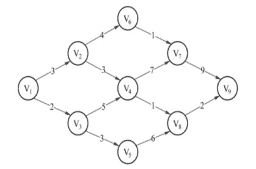
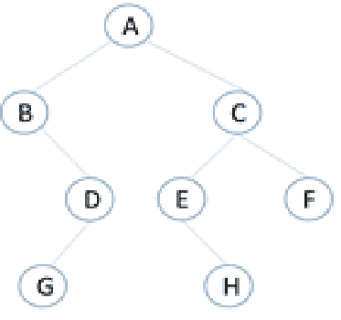

# 爱奇艺 2020 校招 Android 方向笔试题（第二场）

## 1

下列关于时间复杂度的计算说法不正确的是（）

正确答案: D   你的答案: 空 (错误)

```cpp
for/while 循环时间计算为循环体内计算时间与循环次数计算的乘积
```

```cpp
嵌套循环为循环体内计算时间与所有循环次数的乘积
```

```cpp
顺序语句为各语句计算时间的和
```

```cpp
if-else 语句为 if 语句计算时间与 else 语句计算时间的和
```

本题知识点

C++工程师 爱奇艺 Java 工程师 算法工程师 安卓工程师 iOS 工程师 测试开发工程师 前端工程师 2020

讨论

[123qwer.1](https://www.nowcoder.com/profile/567724293)

if else 只能有一个被满足

发表于 2020-01-21 12:07:08

* * *

[虫鸭](https://www.nowcoder.com/profile/503578854)

没看到是不正确的

发表于 2020-02-05 22:09:36

* * *

[青稞${{}](https://www.nowcoder.com/profile/180022031)

满足条件就执行，不满足就 else ，只会执行一个条件

发表于 2021-08-19 13:32:55

* * *

## 2

设 n 位同学从左到右依次编号为 1, 2, …, n，合唱队形需使队列满足 T1＜T2＜...＜Ti＞…Tn-1＞Tn
现已知有 10 个学生的身高（厘米）为：150、172、163、180、178、160、172、154、165、158，计算他们所组成的最长合唱队队形的长度为多少（）

正确答案: C   你的答案: 空 (错误)

```cpp
5
```

```cpp
6
```

```cpp
7
```

```cpp
8
```

本题知识点

C++工程师 爱奇艺 Java 工程师 算法工程师 安卓工程师 iOS 工程师 测试开发工程师 前端工程师 2020

讨论

[大谦](https://www.nowcoder.com/profile/377494128)

一脸懵逼

发表于 2020-01-15 14:59:09

* * *

[Katakuly](https://www.nowcoder.com/profile/7099811)

题目想问的最长合唱队队形长度，实际上是基于 150、172、163、180、178、160、172、154、165、158 这样一组序列，也就是说这十个人已经按照这个顺序排好了，但是此时是不符合 T1＜T2＜...＜Ti＞…Tn-1＞Tn 条件的，题干没描述清楚，针对原有序列实际上不允许重新排序的，此时能做的只能将其中的几个同学剔除才能保持条件。最后的结果是将 172、160、154 三人请出队列，然后得到 150、163、180、178、172、165、158 这组序列，此时就满足了条件。长度为 7。

编辑于 2020-02-10 11:18:19

* * *

[dxzmpk](https://www.nowcoder.com/profile/415472899)

题目表述有错误，应该是问从中抽取任意多个人，剩下的人能组成符合题目要求的最大长度是多少。答案是 7，也就是抽取 172、160、154 之后的结果。

发表于 2020-01-15 14:53:53

* * *

## 3

如果在带权有向图中，用顶点表示事件，用有向边表示活动，边上的权值表示活动的开销，则此带权有向图称为 AOE 网。AOE 网是一个有向无环图，AOE 网如下图所示，则关键路径（即路径长度最长）的长度为（      ）

正确答案: B   你的答案: 空 (错误)

```cpp
21
```

```cpp
23
```

```cpp
24
```

```cpp
13
```

本题知识点

C++工程师 爱奇艺 Java 工程师 算法工程师 安卓工程师 iOS 工程师 测试开发工程师 前端工程师 2020

讨论

[夏花爱秋叶](https://www.nowcoder.com/profile/4085682)

首先需要找到第一个只有输入没有输出的节点，然后去掉它，从右向左逐步得到关键路径

发表于 2020-01-30 11:08:45

* * *

[吾矢](https://www.nowcoder.com/profile/990385455)


发表于 2020-01-16 23:00:47

* * *

[喃喃呐呐](https://www.nowcoder.com/profile/979887643)

V1 -> V3 -> V4 -> V7 -> V9，2+5+7+9=23

发表于 2020-09-09 10:45:01

* * *

## 4

关于队列，下列说法错误的是（      ）

正确答案: C   你的答案: 空 (错误)

```cpp
允许插入的一端称为队尾
```

```cpp
在非空循环队列中，队头指针指向当前的队头元素
```

```cpp
入队操作是在队头执行的
```

```cpp
允许删除的一端称为队头
```

本题知识点

C++工程师 爱奇艺 Java 工程师 算法工程师 安卓工程师 iOS 工程师 测试开发工程师 前端工程师 2020

讨论

[原来微信名字可以这么长](https://www.nowcoder.com/profile/712722628)

这题我也能错真是。。。。。。。队列就像人在排队。  队头的走出去，队尾的进来

发表于 2020-01-27 15:44:56

* * *

[牛客 893561416 号](https://www.nowcoder.com/profile/893561416)

队尾进，队头出

发表于 2020-08-19 10:53:39

* * *

[前端弟弟也要努力鸭](https://www.nowcoder.com/profile/675176708)

队列是先进先出的(FIFO)，即在表的前端删除元素，在表的后端插入元素

发表于 2020-01-20 11:16:33

* * *

## 5

有如图所示的二叉树，E 结点的前辈结点有（      ）

正确答案: A B C   你的答案: 空 (错误)

```cpp
A
```

```cpp
B
```

```cpp
C
```

```cpp
D
```

本题知识点

C++工程师 爱奇艺 Java 工程师 算法工程师 安卓工程师 iOS 工程师 测试开发工程师 前端工程师 2020

讨论

[比风酷](https://www.nowcoder.com/profile/467645686)

**1.基本概念：**

①树是 n(n>=0)个节点的集合 T，当 n==0 时，称为空树；当 n>0 时，该集合满足以下条件

②必有个根节点，他没有直接前驱，有零个或多个后继。

③其余 n-1 个结点划分成 m（m>=0）个互不相交的有限集。每一个称为根的子树，每个子树的根节点有且仅有一个直接前驱，但有零个或多个直接后继。

**2.树的相关术语：**

1.  **结点**：包括一个数据元素及若干指向其结点的分支信息
2.  **结点的度**：一个节点的子树个数（说白了就是节点拥有的子分支数）
3.  **叶节点**：**度为 0 的结点**，即无后继的结点，也称终端结点
4.  **分支结点**：度不为零的结点，也称非终端结点
5.  **结点的层次**：从根节点开始定义，根节点的层次为 1，根的直接后继的层次为 2，以此类推
6.  **节点的层序编号**：将数中的结点按从上层到下层，同层从左到右的次序排成一个线性序列，把他们编成连续的自然数
7.  **树的度**：树中所有结点的度的最大值
8.  **树的高度（深度）**：数中所有结点的层次的最大值
9.  **有序树**：在树 T 中，如果个子树之间有先后次序的，则称为有序树
10.  **森林**：m（m>=0）个互不相见交的树的集合，将一颗非空树的根节点删去，树就变成一个森林；繁殖给森林增加一个统一的根结点，森林就变成一棵树
11.  **同构**：对两棵树，通过对结点是当地重命名，就可以使两棵树完全相等，（对应结点相等，对应结点的相关关系也相等），则称为两棵树的同构
12.  **孩子结点**：一个结点的直接后继称为该结点的孩子结点
13.  **双亲结点**：一个结点的直接前驱称为该结点的双亲结点
14.  **兄弟结点**：同一双亲结点的孩子结点间互称兄弟结点
15.  **堂兄结点**：父亲是兄弟关系或堂兄弟关系的陈伟堂兄弟结点
16.  **祖先结点**：一个结点的祖先结点是指从根结点到该结点的路径上的所有结点
17.  **子孙结点**：一个结点的直接后继和间接后继称为该节点的子孙结点
18.  **前辈**：层号比该结点小的结点
19.  **后辈**：层号比该结点大的结点

发表于 2020-02-13 13:29:32

* * *

[夏花爱秋叶](https://www.nowcoder.com/profile/4085682)

啥是前辈节点哟。。根据答案，前辈节点就节点的父节点和祖先节点以及这些节点的兄弟节点

发表于 2020-01-30 11:10:41

* * *

[schksk](https://www.nowcoder.com/profile/853161020)

E 的前辈节点有 A 和 C，B 和 C 是兄弟节点。故 B 也是

发表于 2020-01-25 17:42:12

* * *

## 6

关于结点树相同的折半判定树和完全二叉树，以下说法正确的是（      ）

正确答案: A   你的答案: 空 (错误)

```cpp
折半判定树的高度与完全二叉树高度一致
```

```cpp
折半判定树的高度比完全二叉树高度大
```

```cpp
折半判定树的高度比完全二叉树高度小
```

```cpp
折半判定树的高度与完全二叉树高度没有关系
```

本题知识点

C++工程师 爱奇艺 Java 工程师 算法工程师 安卓工程师 iOS 工程师 测试开发工程师 前端工程师 2020

讨论

[掌心里的小雨](https://www.nowcoder.com/profile/86073671)

考点：二叉树的性质--折半判定树和完全二叉树

*   **折半判定树**

    *   折半判定树的**构造过程**其实就是对有序列表二分查找的过程，有序列表的中点是折半判定树的根节点，比根节点小的被分到根节点的左子树，比根节点大的被分到根节点的右子树；
    *   折半判定树的**性质**：
        *   任意两棵折半查找判定树，若它们的结点个数相同，则它们的结构完全相同
        *   任意结点的左右子树中结点个数最多相差 1
        *   任意结点的左右子树的高度最多相差 1
        *   任意两个叶子所处的层次最多相差 1
*   完全二叉树：如果二叉树的深度为 k，除第 k 层外，其它各层 (1～k-1) 的结点数都达到最大个数，第 k 层所有的结点都连续集中在最左边

> 引用：[`blog.csdn.net/weixin_45655152/article/details/103689188`](https://blog.csdn.net/weixin_45655152/article/details/103689188)

编辑于 2020-08-23 14:02:19

* * *

[比风酷](https://www.nowcoder.com/profile/467645686)

若设二叉树的深度为 h，除第 h 层外，其它各层 (1～h-1) 的结点数都达到最大个数，第 h 层所有的结点都连续集中在最左边，这就是完全二叉树。折半判定数： 二分法 

发表于 2020-02-13 13:57:37

* * *

[去哪里找项目](https://www.nowcoder.com/profile/68165600)

为什么

```cpp
折半判定树的高度与完全二叉树高度一致？
```

发表于 2021-08-01 11:00:32

* * *

## 7

多个 ALOHA 用户每秒产生 60 个请求，时间槽单位为 20ms，则首次成功发送的概率为多少（

正确答案: B   你的答案: 空 (错误)

```cpp
0.167
```

```cpp
0.05
```

```cpp
0.1
```

```cpp
0.3
```

本题知识点

C++工程师 爱奇艺 Java 工程师 算法工程师 安卓工程师 iOS 工程师 测试开发工程师 前端工程师 2020

讨论

[你的 offer 对我打了烊](https://www.nowcoder.com/profile/598309941)


现在时槽长度为 20ms，则每秒 50 个时槽，产生 60 个请求，所以每个时槽产生 1.2 个请求，则 G＝1.2，因此首次尝试成功的概率是 e-1.2=0.3 垃圾题目！

发表于 2020-02-23 13:09:53

* * *

[陈耿聪是个狠人](https://www.nowcoder.com/profile/800352933)


> 在这里截图的[`wenku.baidu.com/view/99b797177375a417866f8fbe.html`](https://wenku.baidu.com/view/99b797177375a417866f8fbe.html)

发表于 2020-01-18 19:25:33

* * *

[www 虔诚祈祷!](https://www.nowcoder.com/profile/7659563)

感觉选 D 欸

发表于 2020-02-12 23:03:08

* * *

## 8

在 Linux 内核中，创建一个文件操作可以使用（      ） 

正确答案: A   你的答案: 空 (错误)

```cpp
fopen 
```

```cpp
open
```

```cpp
write
```

```cpp
create
```

本题知识点

C++工程师 爱奇艺 Java 工程师 算法工程师 安卓工程师 iOS 工程师 测试开发工程师 前端工程师 2020

讨论

[陈耿聪是个狠人](https://www.nowcoder.com/profile/800352933)


发表于 2020-01-18 19:30:43

* * *

[公众号「我不是匠人」](https://www.nowcoder.com/profile/936070)

open 也可以创建文件呀

```cpp
int fd = open("world.txt", O_CREAT | O_RDWR | O_APPEND);
char buf[10] = "hello";
write(fd, buf, strlen(buf));
```

发表于 2020-09-20 10:57:32

* * *

[vicyor](https://www.nowcoder.com/profile/2210832)

1.C 标准库<stdio.h>的 fopen 函数函数原型: FILE *fopen(const char *filename,const char * mode).2.mode 是指文件访问方式.    r                只读    r+              读/写    rb+            读/写二进制文件    w               只写,文件存在清空文件,文件不存在创建新文件    w+             读/写,文件存在清空文件,文件不存在创建新文件    a                追加,文件存在,只能追加数据,文件不存在则创建新文件    a+              追加/可读    wb             写二进制    wb+           读/写二进制    ab+           追加/读二进制    wt+           读/写文本    at+           追加/读文本

发表于 2020-02-15 12:45:26

* * *

## 9

MyISAM 引擎的表 tg_user，主键为 tg_id，tg_email 是允许为空的列，下列能正确统计出该表记录数的语句是（      ）

正确答案: A B D   你的答案: 空 (错误)

```cpp
SELECT count(*) FROM `tg_user`
```

```cpp
SELECT count(tg_id) FROM `tg_user`  

```

```cpp
SELECT count( tg_email ) FROM `tg_user ` 
```

```cpp
SELECT count(1) FROM `tg_user`
```

本题知识点

C++工程师 爱奇艺 Java 工程师 算法工程师 安卓工程师 iOS 工程师 测试开发工程师 前端工程师 2020

讨论

[夏花爱秋叶](https://www.nowcoder.com/profile/4085682)

select count(*) from table 表示返回表中包括空行和重复行在内的行数,但是会扫描所有列 select count(1) from table 也是返回表中包括空行和重复行在内的行数，不会扫描所有列,1 其实就是表示有多少个符合条件的行，但是此时没有 where,所有没条件也就是返回总行数 select count(id) from table 表示返回表中存在该列 id 的行数，但是该列的值不为空，为空的不计算，所以在此题中是不能用这个，因为 tg_email 都为空，用主键可以，因为主键肯定不为空

发表于 2020-01-30 11:21:36

* * *

[最爱小怪兽](https://www.nowcoder.com/profile/193667259)

看成 tg_id，tg_email 是允许为空的列了

发表于 2020-03-28 13:41:43

* * *

[vicyor](https://www.nowcoder.com/profile/2210832)

select count(*) from tb;  ===> row_sizeselect count(1) from tb; ====>row_sizeselect count(null) from tb; ====>0select count(filed_has_null) from tb; =====>  row_size -  null_row_sizecount 函数的参数值为 null 的话,将累加 0,参数值不为 null 将累加 1\.

发表于 2020-02-15 12:56:19

* * *

## 10

在解决汉诺塔问题时，可使用哪种数据结构进行设计（      ）

正确答案: A   你的答案: 空 (错误)

```cpp
栈
```

```cpp
数组
```

```cpp
队列
```

```cpp
二叉树
```

本题知识点

C++工程师 爱奇艺 Java 工程师 安卓工程师 iOS 工程师 测试开发工程师 前端工程师 2020

讨论

[123qwer.1](https://www.nowcoder.com/profile/567724293)

汉诺塔就是个栈啊.

发表于 2020-01-21 11:48:48

* * *

[vicyor](https://www.nowcoder.com/profile/2210832)

汉诺塔有 3 个塔,每个塔从上到下的环是由小变大的(单调栈),每次只能从塔顶拿出环(pop)加加到另一个塔的顶部(push).

发表于 2020-02-15 12:58:18

* * *

[丷丷要开心](https://www.nowcoder.com/profile/5834026)

汉诺塔问题是一个递归问题，递归问题往往需要用到栈这种数据结构来解决。

发表于 2021-03-28 21:03:38

* * *

## 11

以下安卓的核心组件功能错误的是()

正确答案: B   你的答案: 空 (错误)

```cpp
Activity 提供界面显示
```

```cpp
Service 提供管理数据
```

```cpp
Intente 提供进程间通信
```

```cpp
BroadcastReceiver 提供广播接收
```

本题知识点

安卓工程师 爱奇艺 2020

讨论

[Primer___](https://www.nowcoder.com/profile/3039649)

service 可以理解为一种消息控制,是一种默默在后台控制的服务,不是管理数据

发表于 2020-01-26 22:39:28

* * *

## 12

文件存储数据中，Context 提供了两个方法来打开数据文件里的文件 io 流，方法的第二个参数为打开文件的模式，下列哪个模式能用来检查文件是否存在()

正确答案: B   你的答案: 空 (错误)

```cpp
MODE_PRIVATE
```

```cpp
MODE_APPEND
```

```cpp
MODE_WORLD_READABLE
```

```cpp
MODE_WORLD_WRITEABLE
```

本题知识点

安卓工程师 爱奇艺 2020

讨论

[Primer___](https://www.nowcoder.com/profile/3039649)

答错了.应该这样理解,append 意为追加的意思,联想 C 语言我们知道,追加一个文件,假如文件不存在那么我们就要创建这个文件.

发表于 2020-01-26 22:41:09

* * *

## 13

adb uninstall 可以用来卸载应用，有时为了调试，希望卸载时保留数据和缓冲区目录，以下参数可以做到这一点的是（）

正确答案: C   你的答案: 空 (错误)

```cpp
-x
```

```cpp
-t
```

```cpp
-k
```

```cpp
-c
```

本题知识点

安卓工程师 爱奇艺 2020

讨论

[没想好昵称呵](https://www.nowcoder.com/profile/5345342)

```cpp
em_t8811a_emmc:/ $ pm uninstall -k --user 0 com.baidu.haokan
Success
```

*   -k 表示保存数据，如不需要，可去掉 -k。
*   --user 指定用户 id，Android 系统支持多个用户，默认用户只有一个，id=0。

发表于 2020-02-29 21:04:50

* * *

## 14

LinearLayout 设置权重的属性是哪个（）

正确答案: A   你的答案: 空 (错误)

```cpp
layout_weight
```

```cpp
layout_height
```

```cpp
layout_gravity
```

```cpp
gravity
```

本题知识点

安卓工程师 爱奇艺 2020

## 15

Paint 的 void  setAntiAlias(boolean aa)方法的作用是（）

正确答案: A   你的答案: 空 (错误)

```cpp
是否抗锯齿
```

```cpp
设置文字大小
```

```cpp
设置颜色
```

```cpp
是否加粗文本
```

本题知识点

安卓工程师 爱奇艺 2020

## 16

下面说法正确的是（）

正确答案: C   你的答案: 空 (错误)

```cpp
JSON 数据中，对象中的 key 可以是 int 类型
```

```cpp
JSON 数据中，对象中的 value 只可以是 int 类型
```

```cpp
JSON 数据中，对象中的 key 只可以是 String 类型
```

```cpp
JSON 数据中，对象中的 value 只可以是 String 类型
```

本题知识点

安卓工程师 爱奇艺 2020

讨论

[Primer___](https://www.nowcoder.com/profile/3039649)

注意啦! key 值是必须有双引号括起来的.

发表于 2020-01-26 22:44:03

* * *

## 17

下面关于 wait()和 sleep()两个方法描述错误的是（）

正确答案: D   你的答案: 空 (错误)

```cpp
wait()方法属于 Object 的方法，而 sleep()方法属于 Thread 类的方法
```

```cpp
wait()方法可以有参数，也可以无参数；
sleep()方法必须要传入 long 的参数

```

```cpp
两个方法都需要 InterruptedException 异常处理
```

```cpp
wait()无参方法调用后，线程阻塞。需要其他线程只能使用 notify()方法才能唤醒。而 sleep()可以在时间到后醒来继续运行
```

本题知识点

Java 工程师 爱奇艺 安卓工程师 2020

讨论

[2⁷⁴²⁰⁷²⁸¹-1](https://www.nowcoder.com/profile/5811321)

wait 还可以用 notifyall 唤醒

发表于 2020-01-17 19:28:46

* * *

[掌心里的小雨](https://www.nowcoder.com/profile/86073671)

*   A、B、C 选项：都可以见下图，wait()Object 的方法，而 sleep()方法属于 Thread 类的方法，而且 sleep()方法必须传 long 型参数，它们都在方法上抛出 InterruptedException 异常
     

编辑于 2020-08-08 16:34:12

* * *

[牛客 278157788 号](https://www.nowcoder.com/profile/278157788)

1、sleep 方法属于**Thread**类中方法，表示让一个线程进入睡眠状态，等待一定的时间之后，自动醒来进入到可运行状态，不会马上进入运行状态，因为线程调度机制恢复线程的运行也需要时间，一个线程对象调用了 sleep 方法之后，并不会释放他所持有的所有对象锁，所以也就不会影响其他进程对象的运行。

wait()方法是**Object 类**里的方法，当一个线程执行 wait()方法时，它就进入到一个和该对象相关的等待池中（进入等待队列，也就是阻塞的一种，叫等待阻塞），同时释放对象锁，并让出 CPU 资源，待指定时间结束后返还得到对象锁。

2、sleep 方法没有释放锁，而 wait 方法释放了锁

3、使用范围

wait，notify 和 notifyAll 只能在同步控制方法或者同步控制块里面使用，而 sleep 可以在任何地方使用

4、sleep 必须捕获异常，而 wait，notify 和 notifyAll 不需要捕获异常

发表于 2020-04-11 17:16:19

* * *

## 18

有如下抽象类，则描述正确的是：

```cpp
public abstract class Animal {
  public  void move()
  {
   System.out.println("the animal can move...");
  }
  abstract void show();
}
```

正确答案: D   你的答案: 空 (错误)

```cpp
该抽象类中不能定义实例方法 move.
```

```cpp
该抽象类可以被实例化。
```

```cpp
该抽象类不能被继承。
```

```cpp
该抽象类的子类对象要调用 show 方法，必须对 Animal 中的 show 方法进行重写。
```

本题知识点

Java 工程师 爱奇艺 安卓工程师 2020

讨论

[MarkX 丿 Blog](https://www.nowcoder.com/profile/42513778)

应该是必须重写，不调用也需要重写

发表于 2021-03-06 10:23:46

* * *

[vicyor](https://www.nowcoder.com/profile/2210832)

父类 a 方法调用 b 方法,b 方法是指父类的版本.若子类重写 b 方法未重写 a 方法.子类调用父类 a 方法,a 方法调用的 b 方法依然是父类的 b 方法,并不是子类重写了 b 方法.所以抽象类实例方法不能调用虚方法.

发表于 2020-02-15 13:11:06

* * *

[Jieker](https://www.nowcoder.com/profile/822181958)

```cpp
 ```
abstract class C extends B {
    public void C() {
        test();
    }
}
```cpp 
```

这样不也算作子类，且这样不是也没重写方法，同时还调用了该方法。

编辑于 2020-11-04 13:55:37

* * *

## 19

假设当前时间是 2018-08-20,晚上 19:08，星期一，则下面代码输出为：

```cpp
public class Test {   
   public static void main(String[] args) {   
    Date date=new Date();
    System.out.printf("%tD%n",date);   
     }   
   }    

```

正确答案: B   你的答案: 空 (错误)

```cpp
2018/8/20
```

```cpp
08/20/18
```

```cpp
2018/8/20 19:08:00
```

```cpp
08/20/18 19:08:00
```

本题知识点

Java 工程师 爱奇艺 安卓工程师 2020

讨论

[vicyor](https://www.nowcoder.com/profile/2210832)

1.%n 是指换行符。有点奇怪(\n 是换行符).2.对于时间的转换符.   tD        美国格式的日期   08/20/18   tT        24 小时时间           13:20:18   tY        四位的年               2020 更多的时间转换符:[`blog.csdn.net/junshuaizhang/article/details/40153147`](https://blog.csdn.net/junshuaizhang/article/details/40153147) （转载).

发表于 2020-02-15 13:22:00

* * *

[陈耿聪是个狠人](https://www.nowcoder.com/profile/800352933)

```cpp
public class Test {   
	   public static void main(String[] args) {   
	    Date date=new Date();
	    System.out.printf("%tD%n",date);    //01/18/20
	     }   
	   }    
```

发表于 2020-01-18 19:42:30

* * *

## 20

阅读下列代码

```cpp
  public class test
 {
     public static void main(String []args)
     [
         char ch1=97;
         char ch2='a';
         System.out.println(" ch1="+ch1);
         System.out.println(" ch2="+ch2);
    }
}
```

正确答案: B D   你的答案: 空 (错误)

```cpp
ch1=97 ch2=97
```

```cpp
ch1=a
 ch2=a

```

```cpp
ch1=97
 ch2=a

```

```cpp
ch1='a' ch2='a'
```

本题知识点

Java 工程师 爱奇艺 安卓工程师 2020

讨论

[꧁ಥ≜ಥ꧂](https://www.nowcoder.com/profile/290661484)

不用这些细节，这种题是攻心题，旨在让你心态爆炸，别无他意。 成大公司者，未攻程，先攻心！

发表于 2020-02-17 15:45:42

* * *

[牛客 840962954 号](https://www.nowcoder.com/profile/840962954)

这考的什么玩意

发表于 2020-04-30 16:20:15

* * *

[牛客 314723314 号](https://www.nowcoder.com/profile/314723314)

97 在 char 里会自动替换为 a，B 是输出后的结果，D 是存进去的值，不是输出的结果，所以带上单引号，只能这样理解了，这题不考技术

发表于 2020-03-04 17:44:25

* * *

## 21

有下列方法：

```cpp
boolean checkValue( int num )
{
    int d1,d2,d3;
    int checkNum, nRemain, rem;

    checkNum = num % 10;
    nRemain = num /10;
    d3 = nRemain % 10;
    nRemain /= 10;
    d2 = nRemain % 10;
    nRemain /= 10;
    d1 = nRemain % 10;
    rem = (d1 + d2 + d3) % 7;
    return rem == checkNum;
}
```

调用此方法如下：

```cpp
boolean bOK = checkValue(value);
```

value 取下面那些值时，bOK 的值为 true?

正确答案: A C   你的答案: 空 (错误)

```cpp
6144
```

```cpp
5073
```

```cpp
4831
```

```cpp
8300
```

本题知识点

Java 工程师 爱奇艺 安卓工程师 2020

讨论

[Hubz](https://www.nowcoder.com/profile/37744979)

前三位的和%7 的结果和最后一位比较

发表于 2020-01-19 17:07:44

* * *

[墨染°青衣颜メ](https://www.nowcoder.com/profile/679823308)

%10 是除 10 取余数，即被除数的最后一位数字，/10 是除 10 取商，但是由于是 int 类型，所以结果只取整数，即去掉被除数最后一位的数，也就是 checkNum 是传入参数的倒数第一位，nRemain 每次/10 都去掉最后一位，然后再%10 取最后一位，所以 d3 是传入参数的倒数第二位，d2 是倒数第三位，d1 是倒数第四位

编辑于 2020-02-19 16:02:56

* * *

[加菲不加猫](https://www.nowcoder.com/profile/264056822)

B 为什么对啊? rem = (7+0+5)%7 = 5 checkNum = 3..  

发表于 2020-07-13 15:34:32

* * *

## 22

以下关于静态方法和静态变量，说法正确的是（）

正确答案: A C D   你的答案: 空 (错误)

```cpp
静态方法不能调用实例方法或引用一个实例变量
```

```cpp
实例方法不能调用静态方法或引用一个静态变量
```

```cpp
静态方法可以互相调用
```

```cpp
实例方法可以任意调用方法
```

本题知识点

Java 工程师 爱奇艺 安卓工程师 2020

讨论

[神韵 499](https://www.nowcoder.com/profile/663125690)

静态方法在加载的时候已经被加载，实例方法+变量需要创建实例后才加载。所以静态方法不可以使用实例方法和变量，但是反过来就可以。实例对象创建后，静态方法肯定已经被加载了

发表于 2020-02-14 15:50:47

* * *

[大黄的知识空间](https://www.nowcoder.com/profile/149772801)

两者本质上的区别是：静态方法是在类中使用 staitc 修饰的方法，在类定义的时候已经被装载和分配；而非静态方法是不加 static 关键字的方法，在类定义时没有占用内存，只有在类被实例化成对象时，对象调用该方法才被分配内存。 静态方法中只能调用静态成员或者方法，不能调用非静态方法或者非静态成员；而非静态方法既可以调用静态成员或者方法又可以调用其他的非静态成员或者方法。

发表于 2021-07-08 20:26:29

* * *

[路终寻](https://www.nowcoder.com/profile/855703469)

感觉这个题不严谨，实例方法就调用不了别的类里的私有方法啊，何来能调用任意方法

发表于 2021-08-16 21:20:43

* * *

## 23

下面关于 try-catch-finally 语句块，描述正确的是（）

正确答案: B C   你的答案: 空 (错误)

```cpp
catch 可以和 final 单独使用
```

```cpp
try 可以和 catch 单独使用
```

```cpp
try-catch-finally 块中的语句都可以被执行
```

```cpp
如果 try 中的语句抛出异常，程序会跳过 try 块中剩余的语句，开始查找处理这个异常的代码
```

本题知识点

Java 工程师 爱奇艺 安卓工程师 2020

讨论

[Ryan_W](https://www.nowcoder.com/profile/937872576)

d 哪里错了 告诉一下

发表于 2020-01-19 16:06:39

* * *

[热爱生活 201906232319851](https://www.nowcoder.com/profile/304976579)

这道题感觉在玩文字游戏

发表于 2020-03-19 20:40:17

* * *

[射雕英雄勇](https://www.nowcoder.com/profile/3348280)

c 选项有问题吧，如果没抛错被捕获，catch 块里的语句不会执行吧

发表于 2020-01-16 17:28:41

* * *