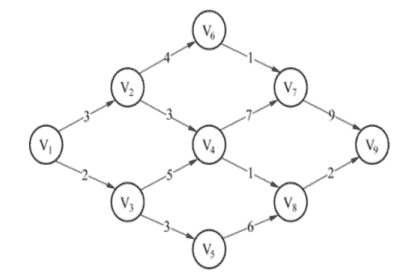
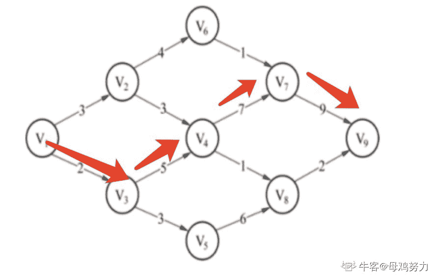
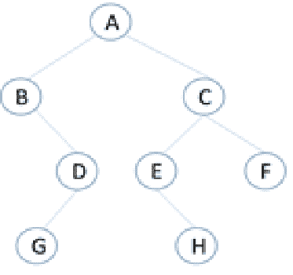
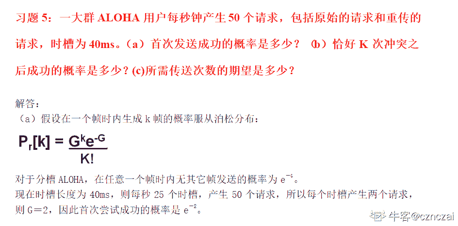
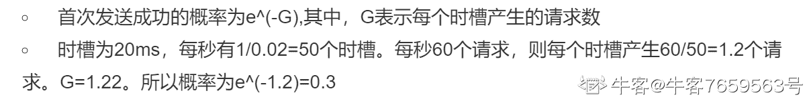
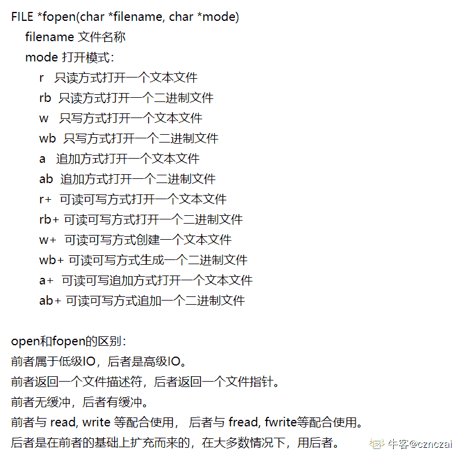

# 爱奇艺 2020 校招 iOS 方向笔试题（第二场）

## 1

下列关于时间复杂度的计算说法不正确的是（）

正确答案: D   你的答案: 空 (错误)

```cpp
for/while 循环时间计算为循环体内计算时间与循环次数计算的乘积
```

```cpp
嵌套循环为循环体内计算时间与所有循环次数的乘积
```

```cpp
顺序语句为各语句计算时间的和
```

```cpp
if-else 语句为 if 语句计算时间与 else 语句计算时间的和
```

本题知识点

C++工程师 爱奇艺 Java 工程师 算法工程师 安卓工程师 iOS 工程师 测试开发工程师 前端工程师 2020

讨论

[123qwer.1](https://www.nowcoder.com/profile/567724293)

if else 只能有一个被满足

发表于 2020-01-21 12:07:08

* * *

[虫鸭](https://www.nowcoder.com/profile/503578854)

没看到是不正确的

发表于 2020-02-05 22:09:36

* * *

[青稞${{}](https://www.nowcoder.com/profile/180022031)

满足条件就执行，不满足就 else ，只会执行一个条件

发表于 2021-08-19 13:32:55

* * *

## 2

设 n 位同学从左到右依次编号为 1, 2, …, n，合唱队形需使队列满足 T1＜T2＜...＜Ti＞…Tn-1＞Tn
现已知有 10 个学生的身高（厘米）为：150、172、163、180、178、160、172、154、165、158，计算他们所组成的最长合唱队队形的长度为多少（）

正确答案: C   你的答案: 空 (错误)

```cpp
5
```

```cpp
6
```

```cpp
7
```

```cpp
8
```

本题知识点

C++工程师 爱奇艺 Java 工程师 算法工程师 安卓工程师 iOS 工程师 测试开发工程师 前端工程师 2020

讨论

[大谦](https://www.nowcoder.com/profile/377494128)

一脸懵逼

发表于 2020-01-15 14:59:09

* * *

[Katakuly](https://www.nowcoder.com/profile/7099811)

题目想问的最长合唱队队形长度，实际上是基于 150、172、163、180、178、160、172、154、165、158 这样一组序列，也就是说这十个人已经按照这个顺序排好了，但是此时是不符合 T1＜T2＜...＜Ti＞…Tn-1＞Tn 条件的，题干没描述清楚，针对原有序列实际上不允许重新排序的，此时能做的只能将其中的几个同学剔除才能保持条件。最后的结果是将 172、160、154 三人请出队列，然后得到 150、163、180、178、172、165、158 这组序列，此时就满足了条件。长度为 7。

编辑于 2020-02-10 11:18:19

* * *

[dxzmpk](https://www.nowcoder.com/profile/415472899)

题目表述有错误，应该是问从中抽取任意多个人，剩下的人能组成符合题目要求的最大长度是多少。答案是 7，也就是抽取 172、160、154 之后的结果。

发表于 2020-01-15 14:53:53

* * *

## 3

如果在带权有向图中，用顶点表示事件，用有向边表示活动，边上的权值表示活动的开销，则此带权有向图称为 AOE 网。AOE 网是一个有向无环图，AOE 网如下图所示，则关键路径（即路径长度最长）的长度为（      ）

正确答案: B   你的答案: 空 (错误)

```cpp
21
```

```cpp
23
```

```cpp
24
```

```cpp
13
```

本题知识点

C++工程师 爱奇艺 Java 工程师 算法工程师 安卓工程师 iOS 工程师 测试开发工程师 前端工程师 2020

讨论

[夏花爱秋叶](https://www.nowcoder.com/profile/4085682)

首先需要找到第一个只有输入没有输出的节点，然后去掉它，从右向左逐步得到关键路径

发表于 2020-01-30 11:08:45

* * *

[吾矢](https://www.nowcoder.com/profile/990385455)



发表于 2020-01-16 23:00:47

* * *

[喃喃呐呐](https://www.nowcoder.com/profile/979887643)

V1 -> V3 -> V4 -> V7 -> V9，2+5+7+9=23

发表于 2020-09-09 10:45:01

* * *

## 4

关于队列，下列说法错误的是（      ）

正确答案: C   你的答案: 空 (错误)

```cpp
允许插入的一端称为队尾
```

```cpp
在非空循环队列中，队头指针指向当前的队头元素
```

```cpp
入队操作是在队头执行的
```

```cpp
允许删除的一端称为队头
```

本题知识点

C++工程师 爱奇艺 Java 工程师 算法工程师 安卓工程师 iOS 工程师 测试开发工程师 前端工程师 2020

讨论

[原来微信名字可以这么长](https://www.nowcoder.com/profile/712722628)

这题我也能错真是。。。。。。。队列就像人在排队。  队头的走出去，队尾的进来

发表于 2020-01-27 15:44:56

* * *

[牛客 893561416 号](https://www.nowcoder.com/profile/893561416)

队尾进，队头出

发表于 2020-08-19 10:53:39

* * *

[前端弟弟也要努力鸭](https://www.nowcoder.com/profile/675176708)

队列是先进先出的(FIFO)，即在表的前端删除元素，在表的后端插入元素

发表于 2020-01-20 11:16:33

* * *

## 5

有如图所示的二叉树，E 结点的前辈结点有（      ）

正确答案: A B C   你的答案: 空 (错误)

```cpp
A
```

```cpp
B
```

```cpp
C
```

```cpp
D
```

本题知识点

C++工程师 爱奇艺 Java 工程师 算法工程师 安卓工程师 iOS 工程师 测试开发工程师 前端工程师 2020

讨论

[比风酷](https://www.nowcoder.com/profile/467645686)

**1.基本概念：**

①树是 n(n>=0)个节点的集合 T，当 n==0 时，称为空树；当 n>0 时，该集合满足以下条件

②必有个根节点，他没有直接前驱，有零个或多个后继。

③其余 n-1 个结点划分成 m（m>=0）个互不相交的有限集。每一个称为根的子树，每个子树的根节点有且仅有一个直接前驱，但有零个或多个直接后继。

**2.树的相关术语：**

1.  **结点**：包括一个数据元素及若干指向其结点的分支信息
2.  **结点的度**：一个节点的子树个数（说白了就是节点拥有的子分支数）
3.  **叶节点**：**度为 0 的结点**，即无后继的结点，也称终端结点
4.  **分支结点**：度不为零的结点，也称非终端结点
5.  **结点的层次**：从根节点开始定义，根节点的层次为 1，根的直接后继的层次为 2，以此类推
6.  **节点的层序编号**：将数中的结点按从上层到下层，同层从左到右的次序排成一个线性序列，把他们编成连续的自然数
7.  **树的度**：树中所有结点的度的最大值
8.  **树的高度（深度）**：数中所有结点的层次的最大值
9.  **有序树**：在树 T 中，如果个子树之间有先后次序的，则称为有序树
10.  **森林**：m（m>=0）个互不相见交的树的集合，将一颗非空树的根节点删去，树就变成一个森林；繁殖给森林增加一个统一的根结点，森林就变成一棵树
11.  **同构**：对两棵树，通过对结点是当地重命名，就可以使两棵树完全相等，（对应结点相等，对应结点的相关关系也相等），则称为两棵树的同构
12.  **孩子结点**：一个结点的直接后继称为该结点的孩子结点
13.  **双亲结点**：一个结点的直接前驱称为该结点的双亲结点
14.  **兄弟结点**：同一双亲结点的孩子结点间互称兄弟结点
15.  **堂兄结点**：父亲是兄弟关系或堂兄弟关系的陈伟堂兄弟结点
16.  **祖先结点**：一个结点的祖先结点是指从根结点到该结点的路径上的所有结点
17.  **子孙结点**：一个结点的直接后继和间接后继称为该节点的子孙结点
18.  **前辈**：层号比该结点小的结点
19.  **后辈**：层号比该结点大的结点

发表于 2020-02-13 13:29:32

* * *

[夏花爱秋叶](https://www.nowcoder.com/profile/4085682)

啥是前辈节点哟。。根据答案，前辈节点就节点的父节点和祖先节点以及这些节点的兄弟节点

发表于 2020-01-30 11:10:41

* * *

[schksk](https://www.nowcoder.com/profile/853161020)

E 的前辈节点有 A 和 C，B 和 C 是兄弟节点。故 B 也是

发表于 2020-01-25 17:42:12

* * *

## 6

关于结点树相同的折半判定树和完全二叉树，以下说法正确的是（      ）

正确答案: A   你的答案: 空 (错误)

```cpp
折半判定树的高度与完全二叉树高度一致
```

```cpp
折半判定树的高度比完全二叉树高度大
```

```cpp
折半判定树的高度比完全二叉树高度小
```

```cpp
折半判定树的高度与完全二叉树高度没有关系
```

本题知识点

C++工程师 爱奇艺 Java 工程师 算法工程师 安卓工程师 iOS 工程师 测试开发工程师 前端工程师 2020

讨论

[掌心里的小雨](https://www.nowcoder.com/profile/86073671)

考点：二叉树的性质--折半判定树和完全二叉树

*   **折半判定树**

    *   折半判定树的**构造过程**其实就是对有序列表二分查找的过程，有序列表的中点是折半判定树的根节点，比根节点小的被分到根节点的左子树，比根节点大的被分到根节点的右子树；
    *   折半判定树的**性质**：
        *   任意两棵折半查找判定树，若它们的结点个数相同，则它们的结构完全相同
        *   任意结点的左右子树中结点个数最多相差 1
        *   任意结点的左右子树的高度最多相差 1
        *   任意两个叶子所处的层次最多相差 1
*   完全二叉树：如果二叉树的深度为 k，除第 k 层外，其它各层 (1～k-1) 的结点数都达到最大个数，第 k 层所有的结点都连续集中在最左边

> 引用：[`blog.csdn.net/weixin_45655152/article/details/103689188`](https://blog.csdn.net/weixin_45655152/article/details/103689188)

编辑于 2020-08-23 14:02:19

* * *

[比风酷](https://www.nowcoder.com/profile/467645686)

若设二叉树的深度为 h，除第 h 层外，其它各层 (1～h-1) 的结点数都达到最大个数，第 h 层所有的结点都连续集中在最左边，这就是完全二叉树。折半判定数： 二分法 

发表于 2020-02-13 13:57:37

* * *

[去哪里找项目](https://www.nowcoder.com/profile/68165600)

为什么

```cpp
折半判定树的高度与完全二叉树高度一致？
```

发表于 2021-08-01 11:00:32

* * *

## 7

多个 ALOHA 用户每秒产生 60 个请求，时间槽单位为 20ms，则首次成功发送的概率为多少（

正确答案: B   你的答案: 空 (错误)

```cpp
0.167
```

```cpp
0.05
```

```cpp
0.1
```

```cpp
0.3
```

本题知识点

C++工程师 爱奇艺 Java 工程师 算法工程师 安卓工程师 iOS 工程师 测试开发工程师 前端工程师 2020

讨论

[你的 offer 对我打了烊](https://www.nowcoder.com/profile/598309941)


现在时槽长度为 20ms，则每秒 50 个时槽，产生 60 个请求，所以每个时槽产生 1.2 个请求，则 G＝1.2，因此首次尝试成功的概率是 e-1.2=0.3 垃圾题目！

发表于 2020-02-23 13:09:53

* * *

[陈耿聪是个狠人](https://www.nowcoder.com/profile/800352933)



> 在这里截图的[`wenku.baidu.com/view/99b797177375a417866f8fbe.html`](https://wenku.baidu.com/view/99b797177375a417866f8fbe.html)

发表于 2020-01-18 19:25:33

* * *

[www 虔诚祈祷!](https://www.nowcoder.com/profile/7659563)

感觉选 D 欸

发表于 2020-02-12 23:03:08

* * *

## 8

在 Linux 内核中，创建一个文件操作可以使用（      ） 

正确答案: A   你的答案: 空 (错误)

```cpp
fopen 
```

```cpp
open
```

```cpp
write
```

```cpp
create
```

本题知识点

C++工程师 爱奇艺 Java 工程师 算法工程师 安卓工程师 iOS 工程师 测试开发工程师 前端工程师 2020

讨论

[陈耿聪是个狠人](https://www.nowcoder.com/profile/800352933)



发表于 2020-01-18 19:30:43

* * *

[公众号「我不是匠人」](https://www.nowcoder.com/profile/936070)

open 也可以创建文件呀

```cpp
int fd = open("world.txt", O_CREAT | O_RDWR | O_APPEND);
char buf[10] = "hello";
write(fd, buf, strlen(buf));
```

发表于 2020-09-20 10:57:32

* * *

[vicyor](https://www.nowcoder.com/profile/2210832)

1.C 标准库<stdio.h>的 fopen 函数函数原型: FILE *fopen(const char *filename,const char * mode).2.mode 是指文件访问方式.    r                只读    r+              读/写    rb+            读/写二进制文件    w               只写,文件存在清空文件,文件不存在创建新文件    w+             读/写,文件存在清空文件,文件不存在创建新文件    a                追加,文件存在,只能追加数据,文件不存在则创建新文件    a+              追加/可读    wb             写二进制    wb+           读/写二进制    ab+           追加/读二进制    wt+           读/写文本    at+           追加/读文本

发表于 2020-02-15 12:45:26

* * *

## 9

MyISAM 引擎的表 tg_user，主键为 tg_id，tg_email 是允许为空的列，下列能正确统计出该表记录数的语句是（      ）

正确答案: A B D   你的答案: 空 (错误)

```cpp
SELECT count(*) FROM `tg_user`
```

```cpp
SELECT count(tg_id) FROM `tg_user`  

```

```cpp
SELECT count( tg_email ) FROM `tg_user ` 
```

```cpp
SELECT count(1) FROM `tg_user`
```

本题知识点

C++工程师 爱奇艺 Java 工程师 算法工程师 安卓工程师 iOS 工程师 测试开发工程师 前端工程师 2020

讨论

[夏花爱秋叶](https://www.nowcoder.com/profile/4085682)

select count(*) from table 表示返回表中包括空行和重复行在内的行数,但是会扫描所有列 select count(1) from table 也是返回表中包括空行和重复行在内的行数，不会扫描所有列,1 其实就是表示有多少个符合条件的行，但是此时没有 where,所有没条件也就是返回总行数 select count(id) from table 表示返回表中存在该列 id 的行数，但是该列的值不为空，为空的不计算，所以在此题中是不能用这个，因为 tg_email 都为空，用主键可以，因为主键肯定不为空

发表于 2020-01-30 11:21:36

* * *

[最爱小怪兽](https://www.nowcoder.com/profile/193667259)

看成 tg_id，tg_email 是允许为空的列了

发表于 2020-03-28 13:41:43

* * *

[vicyor](https://www.nowcoder.com/profile/2210832)

select count(*) from tb;  ===> row_sizeselect count(1) from tb; ====>row_sizeselect count(null) from tb; ====>0select count(filed_has_null) from tb; =====>  row_size -  null_row_sizecount 函数的参数值为 null 的话,将累加 0,参数值不为 null 将累加 1\.

发表于 2020-02-15 12:56:19

* * *

## 10

在解决汉诺塔问题时，可使用哪种数据结构进行设计（      ）

正确答案: A   你的答案: 空 (错误)

```cpp
栈
```

```cpp
数组
```

```cpp
队列
```

```cpp
二叉树
```

本题知识点

C++工程师 爱奇艺 Java 工程师 安卓工程师 iOS 工程师 测试开发工程师 前端工程师 2020

讨论

[123qwer.1](https://www.nowcoder.com/profile/567724293)

汉诺塔就是个栈啊.

发表于 2020-01-21 11:48:48

* * *

[vicyor](https://www.nowcoder.com/profile/2210832)

汉诺塔有 3 个塔,每个塔从上到下的环是由小变大的(单调栈),每次只能从塔顶拿出环(pop)加加到另一个塔的顶部(push).

发表于 2020-02-15 12:58:18

* * *

[丷丷要开心](https://www.nowcoder.com/profile/5834026)

汉诺塔问题是一个递归问题，递归问题往往需要用到栈这种数据结构来解决。

发表于 2021-03-28 21:03:38

* * *

## 11

下列程序的运行结果是 5 5，请将横线处缺失程序补充完整（）

```cpp
#include <iostream>
#include <algorithm>
#include <vector>
#include<iterator>
using namespace std;
class f
{            
public:
 int operator()() const
 {return __________;}
private:
 static int x;
};
int f::x=0;       
int main()
{
 int A[]={7,8,9,4,0};
 vector<int> B(A+1,A+3);   
 ostream_iterator< int > output( cout, " " ); 
    generate(B.begin(),B.end(),f());
 copy(B.begin(),B.end(),output);
 cout<<endl; 
    return 0;
}
```

正确答案: A   你的答案: 空 (错误)

```cpp
x =5
```

```cpp
x+=5
```

```cpp
x*=5
```

```cpp
x=0
```

本题知识点

C++工程师 爱奇艺 算法工程师 iOS 工程师 2020

## 12

某市交通局正在查找一个车牌号。据目击者称，该车牌号是一个 4 位十进制数，是某一个数的立方数，且这 4 个数字从右边数第 2 位为 1。现需通过编写 C++程序找出该车牌号。程序如下：

```cpp
#include <iostream.h>
int main( )
{ 
 int  i=0, n=0;
 for (i=10; i<22; i++)
 {
   n = i*i*i;
    if ( _____________ )
       cout << "车牌号是：" << n << endl;
}
 return 0;
}
```

则程序中下划线处应填写的内容是（  ）。
以下有关该程序的说法，正确的是(  )。

正确答案: C   你的答案: 空 (错误)

```cpp
n\10 == 1
```

```cpp
'n % 10 == 1
```

```cpp
'n/10 % 10 == 1
```

```cpp
n\10 % 10 == 1
```

本题知识点

C++工程师 爱奇艺 算法工程师 iOS 工程师 2020

讨论

[Primer___](https://www.nowcoder.com/profile/3039649)

刹那间,注释和除号分不清了

发表于 2020-01-27 15:24:12

* * *

## 13

```cpp
#include <stdio.h>
main( )
{
   int i, n=0;
   char c, str[] = "test";
   for(i=0; str[i]; i++)
   {
      c = str[i];
      switch(i)
      {
         case 1:
         case 3:
         case 4:
            putchar(c);
            printf("%d", ++n);
            break;
         default:
            putchar('Q');
      }
   }
}
```

程序运行结果是：（   ）

正确答案: B   你的答案: 空 (错误)

```cpp
Qe1QQ
```

```cpp
Qe1Qt2
```

```cpp
Qe1Qt2Q
```

```cpp
Qs1QQ
```

本题知识点

C++工程师 爱奇艺 算法工程师 iOS 工程师 2020

讨论

[零葬](https://www.nowcoder.com/profile/75718849)

i=0，直接跳到 default 语句打印 Q；i=1，因为 switch 穿透，直接到 case 4 打印 e 和 n（n 自增后为 1），然后 break 出去；i=2，直接跳到 default 语句打印 Q；i=3，因为 switch 穿透，直接到 case 4 打印 t 和 n（n 自增后为 2），然后 break 出去；i=4 循环结束。

编辑于 2021-01-05 10:29:15

* * *

## 14

与下列代码：

```cpp
NSDictionary *dictionary = [NSDictionary dictionaryWithObjectsAndKeys:@"obj1", @"value1", @"obj2", @"value2", nil];
```

等价的是：

正确答案: B   你的答案: 空 (错误)

```cpp
NSDictionary *dictionary = @{@"obj1": @"value1",
@"obj1": @"value1",nil};

```

```cpp
NSDictionary *dictionary = @{@"obj1": @"value1",
@"obj1": @"value1"};

```

```cpp
NSDictionary *dictionary = @{@"obj1"， @"value1",
@"obj1"， @"value1"};

```

```cpp
NSDictionary *dictionary = @{@"obj1"， @"value1",
@"obj1"， @"value1",nil};

```

本题知识点

iOS 工程师 爱奇艺 2020

## 15

考虑以下代码：

```cpp
NSComparisonResult res = [nil compare: nil];
    if(res == NSOrderedSame)
        NSLog(@"Equal");
    else
        NSLog(@"Not Equal");
```

编译并执行代码的结果是 ________________.

正确答案: C   你的答案: 空 (错误)

```cpp
编译出错
```

```cpp
运行出错
```

```cpp
Equal
```

```cpp
Not Equal
```

本题知识点

iOS 工程师 爱奇艺 2020

## 16

有关类方法与实例方法说法错误的是（      ）

正确答案: D   你的答案: 空 (错误)

```cpp
类方法不能调用实例方法
```

```cpp
能用类方法的地方尽量用类方法
```

```cpp
类方法和实例方法可以同名
```

```cpp
类方法可以被类的实例对象调用
```

本题知识点

iOS 工程师 爱奇艺 2020

## 17

用户点击左滑出现的“删除”按钮时，会触发调用 tableView 的哪个方法（      ）

正确答案: A   你的答案: 空 (错误)

```cpp
tableView:commitEditingStyle:
```

```cpp
tableView:canMoveRowAtIndexPath:
```

```cpp
tableView:moveRowAtIndexPath:
```

```cpp
tableView:canEditRowAtIndexPath:
```

本题知识点

iOS 工程师 爱奇艺 2020

## 18

```cpp
int main( int argc, const char *argv[] ){      
    NSAutoreleasePool *pool = [[NSAutoreleasePool alloc] init];     
    NSString *str1 = @"1";      
    NSString *str2 = [NSString stringWithString: @"2"];           
    NSLog (@"%s: %x\n", [str1 cString], [str1 retainCount] );     
    NSLog (@"%s: %x\n", [str2 cString], [str2 retainCount] );               
    [str2 release];            
    [pool release];     
    return 0;
}
```

上面的程序输出是什么（）

正确答案: B   你的答案: 空 (错误)

```cpp
1: ffffffff
2: ffffffff
```

```cpp
1: ffffffff
2:1
```

```cpp
1: 1
2: 1
```

```cpp
1: 1
2: ffffffff
```

本题知识点

iOS 工程师 爱奇艺 2020

讨论

[青年演说家](https://www.nowcoder.com/profile/9892379)

第一种创建方式是在常量区存储引用计数是很大，第二个是在堆区 引用计数为 1 是这样么

发表于 2020-02-02 23:39:57

* * *

## 19

下面对 superView 的描述正确的是（      ）

正确答案: A   你的答案: 空 (错误)

```cpp
获取本视图的父视图
```

```cpp
控制视图显示或隐藏
```

```cpp
给视图标记，用于找到该视图
```

```cpp
控制视图的透明度
```

本题知识点

iOS 工程师 爱奇艺 2020

## 20

```cpp
NSArray *array=[NSArray arrayWithObjects:@"2",@"3",@"4",@"1", nil]; 
int a=[[arr objectAtIndex:0]intValue];
for（int i = 0, i < arr.count - 1,i++){ 
    int b=[[arr objectAtIndex:i]intValue];
    if(a < b){
        [arr replaceObjectAtIndex:0 withObject:[NSString stringWithFormat:@“%d”,b]];
} 
a=[[arr objectAtIndex:0]intValue];
}
NSLog(@“%d”,a);
```

上述程序输出是（）

正确答案: D   你的答案: 空 (错误)

```cpp
1
```

```cpp
2
```

```cpp
3
```

```cpp
4
```

本题知识点

iOS 工程师 爱奇艺 2020

## 21

```cpp
function loop() {
    initialize();
    do {
        var message = get_next_message();
        process_message(message);
    } while (message != quit);
}
```

阅读上面程序，下列说法错误的是（）

正确答案: C   你的答案: 空 (错误)

```cpp
线程和 RunLoop 之间是一一对应的
```

```cpp
默认非主线程的 RunLoop 是没有运行的
```

```cpp
在一个单独的线程中没有必要去启用 RunLoop
```

```cpp
RunLoop 管理了其需要处理的事件和消息
```

本题知识点

iOS 工程师 爱奇艺 2020

讨论

[Ryanww](https://www.nowcoder.com/profile/126034906)

选 C 线程与 runloop 密切关联，按钮事件一旦触发就能相应是 runloop 事件的功劳。主线程的 runloop 是默认启动的，对于其他线程来说是非默认启动的，需要手动配置。使用 run loop 可以使你的线程在有工作的时候工作，没有工作的时候休眠，这可以大大节省系统资源。

发表于 2020-05-19 06:33:36

* * *