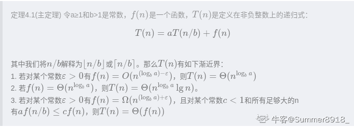
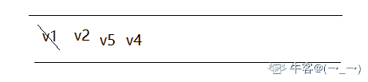
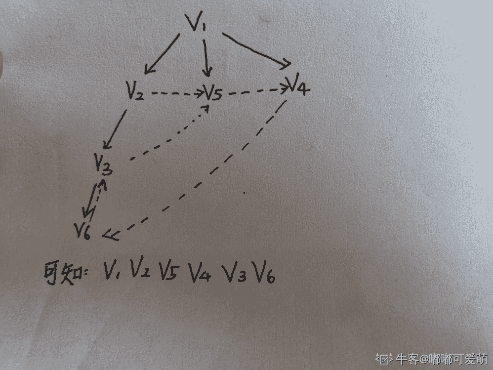
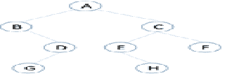

# 爱奇艺 2020 校招测试开发方向笔试题（第一场）

## 1

计算下列程序的时间复杂度（）

```cpp
for (i=1;i<n;i++)
   for(j=1;j<m;j++)
     {a1,a2,a3,a4};
```

正确答案: B   你的答案: 空 (错误)

本题知识点

Java 工程师 爱奇艺 算法工程师 C++工程师 安卓工程师 iOS 工程师 测试开发工程师 前端工程师 2020

讨论

[bukun](https://www.nowcoder.com/profile/514169517)

n * m

发表于 2020-08-07 14:46:04

* * *

[caiKaten](https://www.nowcoder.com/profile/8094368)

嵌套两个 for 循环，执行 n*m 次

发表于 2020-11-03 11:12:04

* * *

[牛客 120004240 号](https://www.nowcoder.com/profile/120004240)

第一个循环没有花括号，为什么会执行？

发表于 2021-10-04 09:28:34

* * *

## 2

求递归方程 T(n)=4T(n/2)+n 的解  (    )

正确答案: B   你的答案: 空 (错误)

本题知识点

Java 工程师 爱奇艺 算法工程师 C++工程师 安卓工程师 iOS 工程师 测试开发工程师 前端工程师 2020

讨论

[vicyor](https://www.nowcoder.com/profile/2210832)

主定理提供了分治方法带来的递归表达式的渐进复杂度分析.1.将规模为 n 的问题通过分治,得到 a 个规模为 n/b 的问题,每次递归带来的额外计算为 c(n^d)   即 T(n)=a(n/b)+c(n^d)  若 a=b^d , T(n)=O(n^dlog(n))  若 a<b^d , T(n)=O(n^d)  若 a>b^d , T(n)=O(n^logb(a))该题 a=4,b=2,d=1,a>2   T(n)=O(n^logb(a))=O(n²)

发表于 2020-02-14 22:23:45

* * *

[百年不死小强](https://www.nowcoder.com/profile/736307028)

T(n) = 4T(n/2) + nT(n)  + n = 4( T(n/2) + n/2)令 f(n) = T(n) + n,则上面的等式变为：f(n) = 4f(n/2)所以，答案为 B

发表于 2020-02-16 23:11:23

* * *

[Summer8918_](https://www.nowcoder.com/profile/839491412)



发表于 2020-01-22 19:51:27

* * *

## 3

下列关于动态规划算法说法错误的是（）

正确答案: B   你的答案: 空 (错误)

```cpp
动态规划关键在于正确地写出基本的递推关系式和恰当的边界条件
```

```cpp
当某阶段的状态确定后，当前的状态是对以往决策的总结并且直接影响未来的决策
```

```cpp
动态规划算法根据子问题具有重叠性，对每个子问题都只解一次
```

```cpp
动态规划算法将原来具有指数级复杂度的搜索算法改进成具有多项式时间算法
```

本题知识点

Java 工程师 爱奇艺 算法工程师 C++工程师 安卓工程师 iOS 工程师 测试开发工程师 前端工程师 2020

讨论

[WMYW](https://www.nowcoder.com/profile/222543223)

动态规划只是说某阶段的最优解状态是对以往状态的总结并且影响未来的的状态，并不是说所有的状态是这样的

发表于 2020-03-21 12:55:55

* * *

[vicyor](https://www.nowcoder.com/profile/2210832)

动态规划:  1.递推关系式.  2.子问题重叠.  3.最优子结构.

发表于 2020-02-14 22:29:13

* * *

[2 楼大世界](https://www.nowcoder.com/profile/401379371)

无后效性。即子问题的解一旦确定，就不再改变，不受在这之后、包含它的更大的问题的求解决策影响。

发表于 2020-06-22 22:40:49

* * *

## 4

已知图 G 的邻接表如下图所示，则从 V1 点出发进行广度优先遍历的序列为（      ）

正确答案: B   你的答案: 空 (错误)

```cpp
V1，V2，V3，V4，V5，V6
```

```cpp
V1，V2，V5，V4，V3，V6
```

```cpp
V1，V2，V3，V6，V5，V4
```

```cpp
V1，V2，V4，V6，V5，V3
```

本题知识点

Java 工程师 爱奇艺 算法工程师 C++工程师 安卓工程师 iOS 工程师 测试开发工程师 前端工程师 2020

讨论

[(→_→)](https://www.nowcoder.com/profile/324939275)

广度优先遍历用到**队列**知识点。从 v1 开始，v1 先进队列：然后访问 v1，v1 出队列，v1 邻接点 v2、v5、v4 进队列：
然后按队列里顺序访问 v2，v2 出队列，v2 临邻接点 v3、v5 进队列，v5 已经在队列里，只进 v3。然后访问 v5，v5 出，v6 进队列。...以此类推，得广度优先搜索遍历序列：v1 v2 v5 v4 v3 v6

发表于 2020-01-17 19:47:13

* * *

[里里吖](https://www.nowcoder.com/profile/850291996)



发表于 2020-03-29 15:06:59

* * *

[Primer___](https://www.nowcoder.com/profile/3039649)

首先,你要把邻接表转换成节点相连的图,再根据楼下的方法使用队列实现遍历

发表于 2020-01-27 11:31:20

* * *

## 5

以下哪个不是队列的应用（      ）

正确答案: D   你的答案: 空 (错误)

```cpp
图的广度优先搜索
```

```cpp
设置打印数据缓冲区
```

```cpp
树的层次遍历
```

```cpp
中缀表达式转后缀表达式
```

本题知识点

Java 工程师 爱奇艺 算法工程师 C++工程师 安卓工程师 iOS 工程师 测试开发工程师 前端工程师 2020

讨论

[(→_→)](https://www.nowcoder.com/profile/324939275)

后缀表达式也叫逆波兰式。中缀转后缀是用栈实现的。

发表于 2020-01-17 20:05:40

* * *

[神韵 499](https://www.nowcoder.com/profile/663125690)

表达式：a+b*c+(d*e+f)**g 转化后是 abc**+de*f+g*+ 

发表于 2020-02-14 15:08:13

* * *

## 6

有如图所示的二叉树，其后序遍历的序列为（      ）

正确答案: C   你的答案: 空 (错误)

```cpp
ABDGCEHF
```

```cpp
BGDAEHCF
```

```cpp
GDBHEFCA
```

```cpp
ACFEHBDG
```

本题知识点

Java 工程师 爱奇艺 算法工程师 C++工程师 安卓工程师 iOS 工程师 测试开发工程师 前端工程师 2020

讨论

[奥特激光 biabiabia](https://www.nowcoder.com/profile/202415115)

以此题为例:后序遍历:     特点: 左右根    快速判断: 首节点 A 会在末尾，所以选 C 前序遍历:     特点: 根左右
    快速判断 :首节点 A 会在开头、中序遍历:    特点: 左根右

编辑于 2020-02-11 11:23:00

* * *

[FrontEndEngineer](https://www.nowcoder.com/profile/785935072)

后序遍历：左右跟，A 是最大的跟，肯定是最后

发表于 2020-01-15 15:47:34

* * *

[牛客 541126623 号](https://www.nowcoder.com/profile/541126623)

先序遍历：根左右中序遍历：左根右后序遍历：左右根（三种遍历仅仅只改变根的位置）

发表于 2021-12-22 23:48:11

* * *

## 7

折半查找法对带查找列表的要求为（      ）

正确答案: B   你的答案: 空 (错误)

```cpp
必须采用链式存储结构、必须按关键字大小有序排列
```

```cpp
必须采用顺序存储结构、必须按关键字大小有序排列
```

```cpp
必须采用链式存储结构、必须没有数值相等的元素
```

```cpp
必须采用链式存储结构、必须有数值相等的元素
```

本题知识点

Java 工程师 爱奇艺 算法工程师 C++工程师 安卓工程师 iOS 工程师 测试开发工程师 前端工程师 2020

讨论

[contorta](https://www.nowcoder.com/profile/819065586)

折半查找需要和带查找元素进行比较，从而确定缩减范围的方向，逼近真实存在的位置，所以列表需要有序。顺序存储有下标啊，不香吗......内存中存储单元是连续的，利于查找。

发表于 2020-04-30 13:35:30

* * *

[杨超越护体保 offer](https://www.nowcoder.com/profile/6343048)

B

发表于 2020-03-01 12:39:31

* * *

[法克瓜](https://www.nowcoder.com/profile/598273059)

链式和顺序还是有区别的

发表于 2020-03-01 09:19:08

* * *

## 8

一组 N 个站点共享一个 30Kbps 的纯 ALOHA 信道， 每个站点平均每 100s 输出一个 2000bit 的帧。试求出 N 的最大值（      ）

正确答案: B   你的答案: 空 (错误)

```cpp
1030
```

```cpp
276
```

```cpp
1500
```

```cpp
1200
```

本题知识点

Java 工程师 爱奇艺 算法工程师 C++工程师 iOS 工程师 测试开发工程师 前端工程师 2020

讨论

[Ahuiyo](https://www.nowcoder.com/profile/443955132)

ALOHA 信道的吞吐公式为 S=Ge-2G
在式中，S 为吞吐量，G 为单位负载。
转换成一阶导数可以得到 Smax= 18．4%

本题答案：

0.184×30kbps=5.52kbps
2000bit÷100s=20bps
N=5520bps÷20bps=276

没做过 ALOHA 信道信道的题。。

编辑于 2020-01-15 10:33:01

* * *

[Primer___](https://www.nowcoder.com/profile/3039649)

aloha 信道的最高利用率为 18.4%至于这个最高利用率怎么来的,你可以参考大佬的这篇博客[`blog.csdn.net/Jaihk662/article/details/80386620`](https://blog.csdn.net/Jaihk662/article/details/80386620)

发表于 2020-01-27 11:48:09

* * *

[神韵 499](https://www.nowcoder.com/profile/663125690)

最大利用率 0.1840.184*30*1000=5520bps（已经化成 bps，1000 转换）每 s2000/1000=20 结果：5520/20=276

发表于 2020-02-14 15:04:21

* * *

## 9

在 Linux 系统中，某文件权限的分数是 754，则以下说法错误的是（   ）。

正确答案: B   你的答案: 空 (错误)

```cpp
拥有者的权限是可读、可写、可执行
```

```cpp
同用户组的权限是可写可执行
```

```cpp
其他用户权限只有可读
```

```cpp
所有用户对该文件都可读
```

本题知识点

Java 工程师 爱奇艺 算法工程师 C++工程师 iOS 工程师 测试开发工程师 前端工程师 2020

讨论

[钅不换](https://www.nowcoder.com/profile/307027944)

754 对应 3 种用户的权限：文件所有者、同组用户、其他用户权限    权限数值       具体作用
r             4               read，读取。当前用户可以读取文件内容，当前用户可以浏览目录。
w            2              write，写入。当前用户可以新增或修改文件内容，当前用户可以删除、移动目录或目录内文件。
x            1              execute，执行。当前用户可以执行文件，当前用户可以进入目录。因此 7=4+2+1 文件所有者对该文件的的权限为可读可写可执行（A 正确）；5=4+1  同组用户对该文件的权限为可读可执行；4=4 所其他用户对该文件的权限为可读（C 正确）；综上所有用户都有读权限（D 正确）

发表于 2020-01-16 15:14:12

* * *

[牛客 405875030 号](https://www.nowcoder.com/profile/405875030)

把 754 转换成二进制 111 101 100，然后三个一组一一对应，1 表示可以，0 表示不可以                                    read     write       execute 三种用户  拥有者     ：    1           1              1                 同组用户 ：    1           0              1                 其他用户 ：    1           0              0 对应选项，这样解释是不是就能看明白了

发表于 2022-02-09 17:05:59

* * *

[一个弱鸡的追梦者](https://www.nowcoder.com/profile/300018543)

是选错误的....

发表于 2021-03-15 10:58:52

* * *

## 10

有一张表，列名称和列类型如下：

```cpp
Id Int unsigned
Uname Varchar(30)
gender Char(1)
weight Tinyint unsigned
Birth Date
Salary Decimal(10,2) 
lastlogin Datetime
info Varchar(2000)
```

对这张表进行优化，可行的是（      ）

正确答案: B C D   你的答案: 空 (错误)

```cpp
不用优化
```

```cpp
将 Id 列设置为主键
```

```cpp
为了提高查询速度，让变长的列定长
```

```cpp
Info 列放在单独的一张表中
```

本题知识点

Java 工程师 爱奇艺 算法工程师 C++工程师 iOS 工程师 测试开发工程师 前端工程师 2020

讨论

[大厂 offer 呢](https://www.nowcoder.com/profile/4097742)

C 的话也不一定吧，我记得 InnoDB 表要是使用的是变长字符集（例如 UTF8），那么即使定义的是 CHAR，实际上会按 VARCHAR 存储。

发表于 2020-02-14 07:00:16

* * *

[蓝鲸向海](https://www.nowcoder.com/profile/945510754)

主键会添加索引， 定长字段有利于查询优化， 将大数据量字段单独放在一个表中可以优化数据库表的存储性能

发表于 2020-02-11 17:51:09

* * *

[手够快就风就跟不上](https://www.nowcoder.com/profile/66740160)

info 占用内存太大，单独用一张表，在没有 SQL 调用它时，性能更高吧

发表于 2020-02-08 00:21:52

* * *

## 11

以下函数输出结果为：

```cpp
def test(outNum):
    def test_in(inNum):
        return outNum+inNum
    return test_in
ret = test(20)
print(ret(100))
```

正确答案: A   你的答案: 空 (错误)

```cpp
120
```

```cpp
20
```

```cpp
100
```

```cpp
200
```

本题知识点

iOS 工程师 爱奇艺 测试开发工程师 2020

讨论

[一个小混子](https://www.nowcoder.com/profile/335048308)

1.ret = test(20)  这时 test(20)是外部的函数 2.ret(100)  这时 ret 成为了外部的函数，test（20）成为了内部的函数

发表于 2020-03-17 00:12:10

* * *

## 12

代码执行后，输出结果为（      ）

```cpp
sum = 0
def foo():
    global sum
    for i in (1, 2, 3):
        sum += 1

foo()
print sum
```

正确答案: C   你的答案: 空 (错误)

```cpp
0
```

```cpp
2
```

```cpp
3
```

```cpp
6
```

本题知识点

iOS 工程师 爱奇艺 测试开发工程师 2020

讨论

[潇洒哥 201803111556731](https://www.nowcoder.com/profile/9150699)

注意看清题目：循环体内累加的是 1，不是 i

发表于 2020-08-25 14:10:46

* * *

[万事可樂](https://www.nowcoder.com/profile/706757388)

走三遍 就是 3 global 不影响

发表于 2020-04-27 23:59:38

* * *

## 13

使用 shell 脚本比较 2 个数字，这 2 个数字由用户运行脚本时通过参数传入，下面哪项所示代码能够正确实现此功能？*（）

正确答案: A   你的答案: 空 (错误)

```cpp
#!/bin/bash 
x=$1 
y=$2 
if [ $x -gt $y ] 
then 
echo “x is greater than y” 
else 
echo “y is greater than x” 
fi 

```

```cpp
#!/bin/bash 
x=$0 
y=$1 
if [ $x -gt $y ] 
then 
echo “x is greater than y” 
else 
echo “y is greater than x” 
fi 

```

```cpp
#!/bin/bash 
x=$1 
y=$2 
if [ x > y ] 
then 
echo “x is greater than y” 
else 
echo “y is greater than x” 
fi 

```

```cpp
#!/bin/bash 
x=$0
y=$1 
if [ x > y ] 
then 
echo “x is greater than y” 
else 
echo “y is greater than x” 
fi 

```

本题知识点

iOS 工程师 爱奇艺 测试开发工程师 2020

讨论

[桃园饭桶](https://www.nowcoder.com/profile/2788977)

shell 获取命令行输入的参数：`$1-9`表示第 1 到 9 参数

```cpp
./a.sh 1 2 3 4 5
```

则`$0`是`./a.sh`

`$1`是 1，后面类推。

shell 比较数值：

| 运算符 | 含义 |
| --- | --- |
| `-gt` | 是否大于 |
| `-ge` | 是否大于等于 |
| `-ne` | 是否不等于 |
| `-lt` | 是否小于 |
| `-le` | 是否小于等于 |

发表于 2020-07-29 10:18:52

* * *

[阿达新](https://www.nowcoder.com/profile/995567233)

选 A 首先要注意参数的引用，其次是数字变量大小的比较

编辑于 2020-10-29 16:23:49

* * *

## 14

使用 Firebug 调试程序时，可以点击哪个控件使调试器跳出一个函数（      ）

正确答案: C   你的答案: 空 (错误)

```cpp
Step Into
```

```cpp
Step Over
```

```cpp
Step Out
```

```cpp
Finish
```

本题知识点

iOS 工程师 爱奇艺 测试开发工程师 2020

讨论

[Allen_Murray](https://www.nowcoder.com/profile/109105014)

step into 单步执行语句，如果遇到了一个方法，进入方法内部，继续向下执行。

step over 单步执行语句，如果遇到了一个方法，跳过方法内部细节，继续向下执行。

step out 是当你用 step into 跳进方法内部时，又想跳出来，从外面开始

发表于 2020-10-20 14:05:16

* * *

## 15

哪种模式下提供一种简单的单任务环境（      ）

正确答案: B   你的答案: 空 (错误)

```cpp
保护模式
```

```cpp
实模式
```

```cpp
虚拟 8086 模式
```

```cpp
系统管理模式
```

本题知识点

iOS 工程师 爱奇艺 测试开发工程师 2020

讨论

[www 虔诚祈祷!](https://www.nowcoder.com/profile/7659563)

选实模式。80386 开始，CPU 有三种工作方式：实模式，保护模式和虚拟 8086 模式。只有在刚刚启动的时候是 real-mode，等到操作系统运行起来以后就切换到 protected-mode。实模式只能访问地址在 1M 以下的内存称为常规内存，我们把地址在 1M 以上的内存称为扩展内存。在保护模式下，全部 32 条地址线有效，可寻址高达 4G 字节的物理地址空间; 扩充的存储器分段管理机制和可选的存储器分页管理机制，不仅为存储器共享和保护提供了硬件支持，而且为实现虚拟存储器提供了硬件支持; 支持多任务，能够快速地进行任务切换(switch)和保护任务环境(context); 4 个特权级和完善的特权检查机制，既能实现资源共享又能保证代码和数据的安全和保密及任务的隔离; 支持虚拟 8086 方式，便于执行 8086 程序。

发表于 2020-02-12 22:22:14

* * *

## 16

某公司在白盒测试中测试方法的选择策略策略说法中正确的是：（     ）

正确答案: B C D   你的答案: 空 (错误)

```cpp
采用先动态后静态的组合方式，先进行覆盖测试，然后进行静态结构分析，代码检查和静态质量度量。
```

```cpp
不同测试阶段，侧重点不同
```

```cpp
利用静态结构分析的结果，通过代码检查和动态测试的方法对结果进一步确认，使测试工作更为有效。
```

```cpp
覆盖率测试是白盒测试的重点，使用基本路径测试达到语句覆盖标准；对于重点模块，应使用多种覆盖标准衡量代码的覆盖率。
```

本题知识点

iOS 工程师 爱奇艺 测试开发工程师 2020

讨论

[布鲁小叮当](https://www.nowcoder.com/profile/447373437)

采用先静态后动态的方式

发表于 2020-03-20 16:27:29

* * *

[牛客 321310304 号](https://www.nowcoder.com/profile/321310304)

CD？

发表于 2020-06-09 20:11:22

* * *

[珠猪飞啊飞](https://www.nowcoder.com/profile/5393338)

D

发表于 2020-03-17 15:38:39

* * *

## 17

测试某公司考勤系统，早上 8 点上班，7 点半到 8 点的 30 分钟的时间里用户会登录签到系统进行签到。公司员工为 1000 人，平均每个员上登录签到系统的时长为 5 分钟。那么，系统的并发数是多少：（    ）

正确答案: C   你的答案: 空 (错误)

```cpp
500
```

```cpp
300
```

```cpp
166.7
```

```cpp
150
```

本题知识点

iOS 工程师 爱奇艺 测试开发工程师 2020

讨论

[一个小混子](https://www.nowcoder.com/profile/335048308)

5000/30

发表于 2020-03-17 00:16:25

* * *

## 18

下列哪些属于软件测试的基本过程（      ）

正确答案: A B C   你的答案: 空 (错误)

```cpp
单元测试
```

```cpp
集成测试
```

```cpp
确认测试
```

```cpp
回归测试
```

本题知识点

iOS 工程师 爱奇艺 测试开发工程师 2020

讨论

[小路多刷题](https://www.nowcoder.com/profile/4191873)

软件测试的过程：单元测试、集成测试、系统测试、验收测试

发表于 2020-08-11 16:27:25

* * *

[吃上了](https://www.nowcoder.com/profile/332836098)

```cpp
回归测试 怎么不是
```

发表于 2020-05-18 20:35:31

* * *

[higirl2020](https://www.nowcoder.com/profile/376457331)

Abc

编辑于 2020-03-17 08:52:09

* * *

## 19

某城市区域划分编码规定输入值为空白或 2 位数字，则根据黑盒测试中的等价类划分技术，区域划分编码有效等价类是：（     ） 

正确答案: A B   你的答案: 空 (错误)

```cpp
{空白}
```

```cpp
{2 位数字}
```

```cpp
{非数字字符}
```

```cpp
{少于 2 位数字}
```

本题知识点

iOS 工程师 爱奇艺 测试开发工程师 2020

讨论

[布鲁小叮当](https://www.nowcoder.com/profile/447373437)

1、有效等价类 是指对于程序的规格说明来说是合理的、有意义的输入数据构成的集合。2、无效等价类 指对程序的规格说明是不合理的或无意义的输入数据所构成的集合。

发表于 2020-03-20 16:29:30

* * *

## 20

假设有一个函数中有三个变量，其中 1980<=a<=2016,1<=b<=12,1<=c<=31,若采用边界值分析法设计测试用例，至少需要（      ）个测试用例

正确答案: D   你的答案: 空 (错误)

```cpp
6
```

```cpp
8
```

```cpp
12
```

```cpp
13
```

本题知识点

iOS 工程师 爱奇艺 测试开发工程师 2020

讨论

[一定要提升编程能力](https://www.nowcoder.com/profile/470089273)

边界值分析方法的归纳：通过变量数量和通过值域的种类，归纳变量数量很容易，如果有一个 n 变量函数，使除一个以外的所欲变量取正常值，使剩余的那个变量取最小值、略高于虽小值、正常值、略低于最大值和最大值，对每个变量都重复进行。如此，对于一个 n 变量函数，采用边界值分析会产生 4N+1 个测试用例。
————————————————
版权声明：本文为 CSDN 博主「wangxin0314」的原创文章，遵循 CC 4.0 BY-SA 版权协议，转载请附上原文出处链接及本声明。
原文链接：[`blog.csdn.net/wangxin1982314/article/details/50295401`](https://blog.csdn.net/wangxin1982314/article/details/50295401)

发表于 2020-03-14 10:29:15

* * *

[牛客 380821200 号](https://www.nowcoder.com/profile/380821200)

边界值法需考虑边界上的点，界内点，界外点。对于闭区间[1980，2016]，a 需要取边界点 1980，2016，界外点 1979，2017，内点可以随意取个 2000，此时 b，c 默认为界内点同理，b 可取 0，1，5，12，13c 可取 0，1，15，31，32 所以实际测试用例个数是 4n+1，这里 n 是输入个数，+1 是都取界内点的情况，避免重复

发表于 2021-07-20 19:36:25

* * *