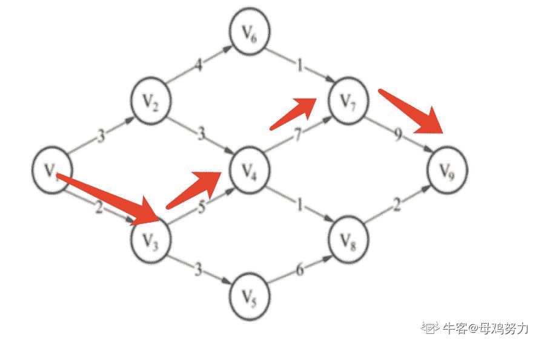
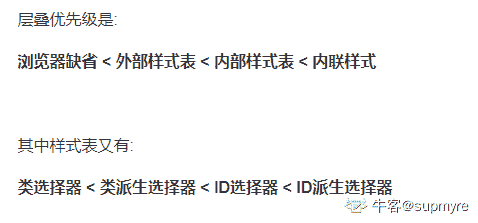

# 爱奇艺 2020 校招前端方向笔试题（第二场）

## 1

下列关于时间复杂度的计算说法不正确的是（）

正确答案: D   你的答案: 空 (错误)

```cpp
for/while 循环时间计算为循环体内计算时间与循环次数计算的乘积
```

```cpp
嵌套循环为循环体内计算时间与所有循环次数的乘积
```

```cpp
顺序语句为各语句计算时间的和
```

```cpp
if-else 语句为 if 语句计算时间与 else 语句计算时间的和
```

本题知识点

C++工程师 爱奇艺 Java 工程师 算法工程师 安卓工程师 iOS 工程师 测试开发工程师 前端工程师 2020

讨论

[123qwer.1](https://www.nowcoder.com/profile/567724293)

if else 只能有一个被满足

发表于 2020-01-21 12:07:08

* * *

[虫鸭](https://www.nowcoder.com/profile/503578854)

没看到是不正确的

发表于 2020-02-05 22:09:36

* * *

[青稞${{}](https://www.nowcoder.com/profile/180022031)

满足条件就执行，不满足就 else ，只会执行一个条件

发表于 2021-08-19 13:32:55

* * *

## 2

设 n 位同学从左到右依次编号为 1, 2, …, n，合唱队形需使队列满足 T1＜T2＜...＜Ti＞…Tn-1＞Tn
现已知有 10 个学生的身高（厘米）为：150、172、163、180、178、160、172、154、165、158，计算他们所组成的最长合唱队队形的长度为多少（）

正确答案: C   你的答案: 空 (错误)

```cpp
5
```

```cpp
6
```

```cpp
7
```

```cpp
8
```

本题知识点

C++工程师 爱奇艺 Java 工程师 算法工程师 安卓工程师 iOS 工程师 测试开发工程师 前端工程师 2020

讨论

[大谦](https://www.nowcoder.com/profile/377494128)

一脸懵逼

发表于 2020-01-15 14:59:09

* * *

[Katakuly](https://www.nowcoder.com/profile/7099811)

题目想问的最长合唱队队形长度，实际上是基于 150、172、163、180、178、160、172、154、165、158 这样一组序列，也就是说这十个人已经按照这个顺序排好了，但是此时是不符合 T1＜T2＜...＜Ti＞…Tn-1＞Tn 条件的，题干没描述清楚，针对原有序列实际上不允许重新排序的，此时能做的只能将其中的几个同学剔除才能保持条件。最后的结果是将 172、160、154 三人请出队列，然后得到 150、163、180、178、172、165、158 这组序列，此时就满足了条件。长度为 7。

编辑于 2020-02-10 11:18:19

* * *

[dxzmpk](https://www.nowcoder.com/profile/415472899)

题目表述有错误，应该是问从中抽取任意多个人，剩下的人能组成符合题目要求的最大长度是多少。答案是 7，也就是抽取 172、160、154 之后的结果。

发表于 2020-01-15 14:53:53

* * *

## 3

如果在带权有向图中，用顶点表示事件，用有向边表示活动，边上的权值表示活动的开销，则此带权有向图称为 AOE 网。AOE 网是一个有向无环图，AOE 网如下图所示，则关键路径（即路径长度最长）的长度为（      ）

正确答案: B   你的答案: 空 (错误)

```cpp
21
```

```cpp
23
```

```cpp
24
```

```cpp
13
```

本题知识点

C++工程师 爱奇艺 Java 工程师 算法工程师 安卓工程师 iOS 工程师 测试开发工程师 前端工程师 2020

讨论

[夏花爱秋叶](https://www.nowcoder.com/profile/4085682)

首先需要找到第一个只有输入没有输出的节点，然后去掉它，从右向左逐步得到关键路径

发表于 2020-01-30 11:08:45

* * *

[吾矢](https://www.nowcoder.com/profile/990385455)



发表于 2020-01-16 23:00:47

* * *

[喃喃呐呐](https://www.nowcoder.com/profile/979887643)

V1 -> V3 -> V4 -> V7 -> V9，2+5+7+9=23

发表于 2020-09-09 10:45:01

* * *

## 4

关于队列，下列说法错误的是（      ）

正确答案: C   你的答案: 空 (错误)

```cpp
允许插入的一端称为队尾
```

```cpp
在非空循环队列中，队头指针指向当前的队头元素
```

```cpp
入队操作是在队头执行的
```

```cpp
允许删除的一端称为队头
```

本题知识点

C++工程师 爱奇艺 Java 工程师 算法工程师 安卓工程师 iOS 工程师 测试开发工程师 前端工程师 2020

讨论

[原来微信名字可以这么长](https://www.nowcoder.com/profile/712722628)

这题我也能错真是。。。。。。。队列就像人在排队。  队头的走出去，队尾的进来

发表于 2020-01-27 15:44:56

* * *

[牛客 893561416 号](https://www.nowcoder.com/profile/893561416)

队尾进，队头出

发表于 2020-08-19 10:53:39

* * *

[前端弟弟也要努力鸭](https://www.nowcoder.com/profile/675176708)

队列是先进先出的(FIFO)，即在表的前端删除元素，在表的后端插入元素

发表于 2020-01-20 11:16:33

* * *

## 5

有如图所示的二叉树，E 结点的前辈结点有（      ）

正确答案: A B C   你的答案: 空 (错误)

```cpp
A
```

```cpp
B
```

```cpp
C
```

```cpp
D
```

本题知识点

C++工程师 爱奇艺 Java 工程师 算法工程师 安卓工程师 iOS 工程师 测试开发工程师 前端工程师 2020

讨论

[比风酷](https://www.nowcoder.com/profile/467645686)

**1.基本概念：**

①树是 n(n>=0)个节点的集合 T，当 n==0 时，称为空树；当 n>0 时，该集合满足以下条件

②必有个根节点，他没有直接前驱，有零个或多个后继。

③其余 n-1 个结点划分成 m（m>=0）个互不相交的有限集。每一个称为根的子树，每个子树的根节点有且仅有一个直接前驱，但有零个或多个直接后继。

**2.树的相关术语：**

1.  **结点**：包括一个数据元素及若干指向其结点的分支信息
2.  **结点的度**：一个节点的子树个数（说白了就是节点拥有的子分支数）
3.  **叶节点**：**度为 0 的结点**，即无后继的结点，也称终端结点
4.  **分支结点**：度不为零的结点，也称非终端结点
5.  **结点的层次**：从根节点开始定义，根节点的层次为 1，根的直接后继的层次为 2，以此类推
6.  **节点的层序编号**：将数中的结点按从上层到下层，同层从左到右的次序排成一个线性序列，把他们编成连续的自然数
7.  **树的度**：树中所有结点的度的最大值
8.  **树的高度（深度）**：数中所有结点的层次的最大值
9.  **有序树**：在树 T 中，如果个子树之间有先后次序的，则称为有序树
10.  **森林**：m（m>=0）个互不相见交的树的集合，将一颗非空树的根节点删去，树就变成一个森林；繁殖给森林增加一个统一的根结点，森林就变成一棵树
11.  **同构**：对两棵树，通过对结点是当地重命名，就可以使两棵树完全相等，（对应结点相等，对应结点的相关关系也相等），则称为两棵树的同构
12.  **孩子结点**：一个结点的直接后继称为该结点的孩子结点
13.  **双亲结点**：一个结点的直接前驱称为该结点的双亲结点
14.  **兄弟结点**：同一双亲结点的孩子结点间互称兄弟结点
15.  **堂兄结点**：父亲是兄弟关系或堂兄弟关系的陈伟堂兄弟结点
16.  **祖先结点**：一个结点的祖先结点是指从根结点到该结点的路径上的所有结点
17.  **子孙结点**：一个结点的直接后继和间接后继称为该节点的子孙结点
18.  **前辈**：层号比该结点小的结点
19.  **后辈**：层号比该结点大的结点

发表于 2020-02-13 13:29:32

* * *

[夏花爱秋叶](https://www.nowcoder.com/profile/4085682)

啥是前辈节点哟。。根据答案，前辈节点就节点的父节点和祖先节点以及这些节点的兄弟节点

发表于 2020-01-30 11:10:41

* * *

[schksk](https://www.nowcoder.com/profile/853161020)

E 的前辈节点有 A 和 C，B 和 C 是兄弟节点。故 B 也是

发表于 2020-01-25 17:42:12

* * *

## 6

关于结点树相同的折半判定树和完全二叉树，以下说法正确的是（      ）

正确答案: A   你的答案: 空 (错误)

```cpp
折半判定树的高度与完全二叉树高度一致
```

```cpp
折半判定树的高度比完全二叉树高度大
```

```cpp
折半判定树的高度比完全二叉树高度小
```

```cpp
折半判定树的高度与完全二叉树高度没有关系
```

本题知识点

C++工程师 爱奇艺 Java 工程师 算法工程师 安卓工程师 iOS 工程师 测试开发工程师 前端工程师 2020

讨论

[掌心里的小雨](https://www.nowcoder.com/profile/86073671)

考点：二叉树的性质--折半判定树和完全二叉树

*   **折半判定树**

    *   折半判定树的**构造过程**其实就是对有序列表二分查找的过程，有序列表的中点是折半判定树的根节点，比根节点小的被分到根节点的左子树，比根节点大的被分到根节点的右子树；
    *   折半判定树的**性质**：
        *   任意两棵折半查找判定树，若它们的结点个数相同，则它们的结构完全相同
        *   任意结点的左右子树中结点个数最多相差 1
        *   任意结点的左右子树的高度最多相差 1
        *   任意两个叶子所处的层次最多相差 1
*   完全二叉树：如果二叉树的深度为 k，除第 k 层外，其它各层 (1～k-1) 的结点数都达到最大个数，第 k 层所有的结点都连续集中在最左边

> 引用：[`blog.csdn.net/weixin_45655152/article/details/103689188`](https://blog.csdn.net/weixin_45655152/article/details/103689188)

编辑于 2020-08-23 14:02:19

* * *

[比风酷](https://www.nowcoder.com/profile/467645686)

若设二叉树的深度为 h，除第 h 层外，其它各层 (1～h-1) 的结点数都达到最大个数，第 h 层所有的结点都连续集中在最左边，这就是完全二叉树。折半判定数： 二分法 

发表于 2020-02-13 13:57:37

* * *

[去哪里找项目](https://www.nowcoder.com/profile/68165600)

为什么

```cpp
折半判定树的高度与完全二叉树高度一致？
```

发表于 2021-08-01 11:00:32

* * *

## 7

多个 ALOHA 用户每秒产生 60 个请求，时间槽单位为 20ms，则首次成功发送的概率为多少（

正确答案: B   你的答案: 空 (错误)

```cpp
0.167
```

```cpp
0.05
```

```cpp
0.1
```

```cpp
0.3
```

本题知识点

C++工程师 爱奇艺 Java 工程师 算法工程师 安卓工程师 iOS 工程师 测试开发工程师 前端工程师 2020

讨论

[你的 offer 对我打了烊](https://www.nowcoder.com/profile/598309941)


现在时槽长度为 20ms，则每秒 50 个时槽，产生 60 个请求，所以每个时槽产生 1.2 个请求，则 G＝1.2，因此首次尝试成功的概率是 e-1.2=0.3 垃圾题目！

发表于 2020-02-23 13:09:53

* * *

[陈耿聪是个狠人](https://www.nowcoder.com/profile/800352933)


> 在这里截图的[`wenku.baidu.com/view/99b797177375a417866f8fbe.html`](https://wenku.baidu.com/view/99b797177375a417866f8fbe.html)

发表于 2020-01-18 19:25:33

* * *

[www 虔诚祈祷!](https://www.nowcoder.com/profile/7659563)

感觉选 D 欸

发表于 2020-02-12 23:03:08

* * *

## 8

在 Linux 内核中，创建一个文件操作可以使用（      ） 

正确答案: A   你的答案: 空 (错误)

```cpp
fopen 
```

```cpp
open
```

```cpp
write
```

```cpp
create
```

本题知识点

C++工程师 爱奇艺 Java 工程师 算法工程师 安卓工程师 iOS 工程师 测试开发工程师 前端工程师 2020

讨论

[陈耿聪是个狠人](https://www.nowcoder.com/profile/800352933)


发表于 2020-01-18 19:30:43

* * *

[公众号「我不是匠人」](https://www.nowcoder.com/profile/936070)

open 也可以创建文件呀

```cpp
int fd = open("world.txt", O_CREAT | O_RDWR | O_APPEND);
char buf[10] = "hello";
write(fd, buf, strlen(buf));
```

发表于 2020-09-20 10:57:32

* * *

[vicyor](https://www.nowcoder.com/profile/2210832)

1.C 标准库<stdio.h>的 fopen 函数函数原型: FILE *fopen(const char *filename,const char * mode).2.mode 是指文件访问方式.    r                只读    r+              读/写    rb+            读/写二进制文件    w               只写,文件存在清空文件,文件不存在创建新文件    w+             读/写,文件存在清空文件,文件不存在创建新文件    a                追加,文件存在,只能追加数据,文件不存在则创建新文件    a+              追加/可读    wb             写二进制    wb+           读/写二进制    ab+           追加/读二进制    wt+           读/写文本    at+           追加/读文本

发表于 2020-02-15 12:45:26

* * *

## 9

MyISAM 引擎的表 tg_user，主键为 tg_id，tg_email 是允许为空的列，下列能正确统计出该表记录数的语句是（      ）

正确答案: A B D   你的答案: 空 (错误)

```cpp
SELECT count(*) FROM `tg_user`
```

```cpp
SELECT count(tg_id) FROM `tg_user`  

```

```cpp
SELECT count( tg_email ) FROM `tg_user ` 
```

```cpp
SELECT count(1) FROM `tg_user`
```

本题知识点

C++工程师 爱奇艺 Java 工程师 算法工程师 安卓工程师 iOS 工程师 测试开发工程师 前端工程师 2020

讨论

[夏花爱秋叶](https://www.nowcoder.com/profile/4085682)

select count(*) from table 表示返回表中包括空行和重复行在内的行数,但是会扫描所有列 select count(1) from table 也是返回表中包括空行和重复行在内的行数，不会扫描所有列,1 其实就是表示有多少个符合条件的行，但是此时没有 where,所有没条件也就是返回总行数 select count(id) from table 表示返回表中存在该列 id 的行数，但是该列的值不为空，为空的不计算，所以在此题中是不能用这个，因为 tg_email 都为空，用主键可以，因为主键肯定不为空

发表于 2020-01-30 11:21:36

* * *

[最爱小怪兽](https://www.nowcoder.com/profile/193667259)

看成 tg_id，tg_email 是允许为空的列了

发表于 2020-03-28 13:41:43

* * *

[vicyor](https://www.nowcoder.com/profile/2210832)

select count(*) from tb;  ===> row_sizeselect count(1) from tb; ====>row_sizeselect count(null) from tb; ====>0select count(filed_has_null) from tb; =====>  row_size -  null_row_sizecount 函数的参数值为 null 的话,将累加 0,参数值不为 null 将累加 1\.

发表于 2020-02-15 12:56:19

* * *

## 10

在解决汉诺塔问题时，可使用哪种数据结构进行设计（      ）

正确答案: A   你的答案: 空 (错误)

```cpp
栈
```

```cpp
数组
```

```cpp
队列
```

```cpp
二叉树
```

本题知识点

C++工程师 爱奇艺 Java 工程师 安卓工程师 iOS 工程师 测试开发工程师 前端工程师 2020

讨论

[123qwer.1](https://www.nowcoder.com/profile/567724293)

汉诺塔就是个栈啊.

发表于 2020-01-21 11:48:48

* * *

[vicyor](https://www.nowcoder.com/profile/2210832)

汉诺塔有 3 个塔,每个塔从上到下的环是由小变大的(单调栈),每次只能从塔顶拿出环(pop)加加到另一个塔的顶部(push).

发表于 2020-02-15 12:58:18

* * *

[丷丷要开心](https://www.nowcoder.com/profile/5834026)

汉诺塔问题是一个递归问题，递归问题往往需要用到栈这种数据结构来解决。

发表于 2021-03-28 21:03:38

* * *

## 11

分析下面 javascript 代码：

```cpp
<script>
var l = 1;
var n = m = 0;
function myFun(x)
{
 x = (x++) + 5;
}
n = myFun(l);
function anotherFun(x)
{
 x = (--x) + 5;
}
m = anotherFun(n);
alert(n);
alert(m);
</script>
```

输出结果为：（）

正确答案: D   你的答案: 空 (错误)

```cpp
6
10

```

```cpp
6
4

```

```cpp
6
undefined

```

```cpp
undefined
undefined

```

本题知识点

前端工程师 爱奇艺 2020

讨论

[吾矢](https://www.nowcoder.com/profile/990385455)

两个 function 都没有 return，所以 n 就是 undefined，然后 m 也就是 undefined

发表于 2020-01-16 23:03:35

* * *

[牛客 114443691 号](https://www.nowcoder.com/profile/114443691)

没有 return... 阴险

发表于 2020-02-20 13:45:31

* * *

[123qwer.1](https://www.nowcoder.com/profile/567724293)

加上 return 选 A;x= x++  +5  => x= 1 + 5=6;  先输出,再加;此时 x 是全局,变 6x=--x +5 ->5+5  先减再输出,此时 x 变成 5,然后参与运算

编辑于 2020-01-21 11:48:02

* * *

## 12

每个计算机都有自己所专属的 ip 地址，经常会需要进行计算机之间的相关联，此时就会用到 ip 地址，如果不考虑 IP 地址的范围，那么怎样才能知道输入的计算机 ip 地址是正确的（      ）

正确答案: D   你的答案: 空 (错误)

```cpp
cdef
```

```cpp
c
```

```cpp
defg
```

```cpp
d
```

本题知识点

前端工程师 爱奇艺 2020

讨论

[日思夜想求 offer](https://www.nowcoder.com/profile/3776464)

什么意思，有谁解答一下吗🤣

发表于 2020-01-16 15:43:30

* * *

[magician201911181327220](https://www.nowcoder.com/profile/921914419)

题目都没给完全吗？什么鬼东西

发表于 2020-05-19 10:07:19

* * *

[作答](https://www.nowcoder.com/profile/523405565)

所学知识浅显，没看懂，读书太少了

发表于 2020-04-23 09:51:09

* * *

## 13

```cpp
<input type="text" id="text">
<script>
document.getElementById("text").onkeypress = function(e) {… …}
</script>
```

不同的浏览器获取按下键盘码的方式不同，不可能获取按下键盘码的是（）

正确答案: A   你的答案: 空 (错误)

```cpp
this.keyCode
```

```cpp
e.keyCode
```

```cpp
window.event.keyCode
```

```cpp
 e.charCode
```

本题知识点

前端工程师 爱奇艺 2020

讨论

[夏花爱秋叶](https://www.nowcoder.com/profile/4085682)

// 如果绑定的是 onkeypress 事件，那么 e 代之的是 KeyboardEvent
            // 如果绑定的是 onclick 事件，那么 e 代之的是 MouseEvent
            document.getElementsByClassName('one')[0].onkeypress=function(e){
                //获取元素之后的 this 指代的是元素的 html 代码
                console.log(this); //<input type="text" class="one" />
                //获取元素之后的 e 指代的是 KeyboardEvent
                console.log(e);  // KeyboardEvent

                console.log(e.charCode);//此时的 charCode==keyCode
                console.log(e.keyCode)
            }

发表于 2020-01-30 11:39:57

* * *

[前端弟弟也要努力鸭](https://www.nowcoder.com/profile/675176708)

this 指向的是通过 id 获取的 input 元素

发表于 2020-01-20 11:51:50

* * *

[123qwer.1](https://www.nowcoder.com/profile/567724293)

this===========e.currentTarget,多几个=表示语气加重

编辑于 2020-01-21 11:40:36

* * *

## 14

HTML5 提供的 API 有（）

正确答案: A B C D   你的答案: 空 (错误)

```cpp
Pge Visibility API
```

```cpp
Fullscreen API
```

```cpp
 getUserMedia API 
```

```cpp
Battery API
```

本题知识点

前端工程师 爱奇艺 2020

讨论

[123qwer.1](https://www.nowcoder.com/profile/567724293)

** [全屏 API（Fullscreen API）](http://www.w3.org/TR/fullscreen/)** **[页面可见性 API（Page Visibility API）](http://www.w3.org/TR/2011/WD-page-visibility-20110602/)** 
** [getUserMedia API](http://dev.w3.org/2011/webrtc/editor/getusermedia.html)** **访问摄像头和麦克风，而无需使用插件**。 **[电池 API（Battery API）](http://www.w3.org/TR/battery-status/)** **[Link Prefetching](http://davidwalsh.name/html5-prefetch)** **预加载网页内容**，为浏览者提供一个平**滑的浏览体**验。 

发表于 2020-01-21 11:36:40

* * *

## 15

下面 js 语句中,a 的值不是 1 的选项是(        )

正确答案: B   你的答案: 空 (错误)

```cpp
 var a = 1 && 3  && 1;
```

```cpp
var a = 1 && 2 && 3;
```

```cpp
 var a = 1 || 0 || 3;
```

```cpp
 var a = 0 || 1 || 2;
```

本题知识点

前端工程师 爱奇艺 2020

讨论

[千叶风行者](https://www.nowcoder.com/profile/89377108)

**神奇的短路操作🤣**

**逻辑与（&&）**

1：当第一个条件为假时，后面操作不会操作

2：当第一个条件为真时，执行后面的

**逻辑与（ || ）**

1：当第一个条件为真时，后面不执行

2：当第一个条件为假时，执行后面的

发表于 2020-02-20 18:22:14

* * *

[123qwer.1](https://www.nowcoder.com/profile/567724293)

甲鱼的臀部 1、只要“||”前面为 false，无论“||”后面是 true 还是 false，结果都返回“||”后面的值。

2、只要“||”前面为 true，无论“||”后面是 true 还是 false，结果都返回“||”前面的值。

3、只要“&&”前面是 false，无论“&&”后面是 true 还是 false，结果都将返“&&”前面的值;

4、只要“&&”前面是 true，无论“&&”后面是 true 还是 false，结果都将返“&&”后面的值;

A: 1&&3  => 3    => 3&&1 = >1B:1&&2 => 2  => 2&&3    =>3C:1||0=>  1   =>    1||3    =>1D:0||1=>   1   =>   1||2    =>1

发表于 2020-01-21 11:33:32

* * *

[喃喃呐呐](https://www.nowcoder.com/profile/979887643)

&&，|| 都属于短路操作，第一个条件有结果就不会继续执行下一个条件

发表于 2020-09-09 10:48:25

* * *

## 16

当同一个 HTML 元素被多个样式定义时，以下样式中优先权最高的是（）？

正确答案: D   你的答案: 空 (错误)

```cpp
浏览器缺省设置
```

```cpp
外部样式表
```

```cpp
内部样式表（位于 <head> 标签内部）
```

```cpp
内联样式（在 HTML 元素内部）
```

本题知识点

前端工程师 爱奇艺 2020

讨论

[supmyre](https://www.nowcoder.com/profile/764488302)



发表于 2020-11-08 15:39:16

* * *

## 17

下面有关样式表的说法，正确的是（）？

正确答案: A D   你的答案: 空 (错误)

```cpp
通过样式表，用户可以使用自己的设置来覆盖浏览器的常规设置
```

```cpp
样式表不能重用
```

```cpp
每个样式表只能链接到一个文档
```

```cpp
样式表可以用来设置字体、颜色等
```

本题知识点

前端工程师 爱奇艺 2020

## 18

下面关于 HTML5 中的应用缓存说法错误的是（）

正确答案: D   你的答案: 空 (错误)

```cpp
应用缓存可以帮助你进行离线浏览
```

```cpp
应用缓存可以帮助你指定哪些文件需要缓存，哪些不需要
```

```cpp
我们需要指定”manifest”文件，“manifest”文件帮助你定义你的缓存如何工作
```

```cpp
网络命令描述需要缓存的文件，例如以下代码中，我们说”home.aspx”需要被缓存或者离线访问。NETWORK:home.aspx
```

本题知识点

前端工程师 爱奇艺 2020

讨论

[是居居吖](https://www.nowcoder.com/profile/177684868)

网络命令描述不需要缓存的文件。

发表于 2020-03-05 13:26:36

* * *

[桃子碎碎](https://www.nowcoder.com/profile/2127597)

[#commentBox" target="_blank">https://blog.csdn.net/dj0379/article/details/53350309#](https://blog.csdn.net/dj0379/article/details/53350309<a href=)commentBox

发表于 2020-02-21 18:24:58

* * *

## 19

下面的 html5 代码，哪一个可以实现自动填充表单功能（）

正确答案: C   你的答案: 空 (错误)

```cpp
<input type="text" name="movie"/>
<datalist name="movie" value="">
    <option>人在囧途</option>
    <option>美人鱼</option>
    <option>让子弹飞</option>
</datalist>

```

```cpp
<input type="text" name="movie" value=""/>
<select name="movie">
    <option>人在囧途</option>
    <option>美人鱼</option>
    <option>让子弹飞</option>
</select>

```

```cpp
<input type="text" list="movie" value=""/>
<datalist id="movie">
    <option>人在囧途</option>
    <option>美人鱼</option>
    <option>让子弹飞</option>
</datalist>

```

```cpp
<input type="text" list="movie" value=""/>
<datalist name="movie">
    <option>人在囧途</option>
    <option>美人鱼</option>
    <option>让子弹飞</option>
</datalist>

```

本题知识点

前端工程师 爱奇艺 2020

讨论

[吾矢](https://www.nowcoder.com/profile/990385455)

<datalist>标签里面用的是**id**

发表于 2020-01-16 23:14:46

* * *