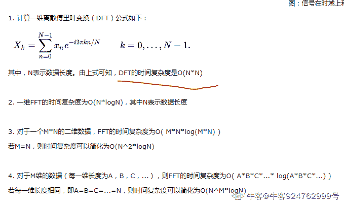

# 乐鑫科技 2020 届秋招-算法类真题

## 1

下列哪种数据结构支持子程序调用:（       ）

正确答案: B   你的答案: 空 (错误)

```cpp
堆
```

```cpp
栈
```

```cpp
队列
```

```cpp
二叉树
```

本题知识点

算法工程师 乐鑫 2020

讨论

[方北归途](https://www.nowcoder.com/profile/799893946)

转自圣才学习网，侵删：主程序调用子程序的步骤为：1\. 保存主程序当前的状态；2\. 执行子程序；3\. 把子程序的执行结果返回到主程序中调用子程序的位置。栈是只能在栈顶进行插入或删除的线性表，按照先进后出的顺序组织数据，符合程序调用的规则。

发表于 2020-07-31 12:30:03

* * *

## 2

一个栈的入栈顺序是 ACDEB，以下哪种不可能是其出栈顺序:

正确答案: D   你的答案: 空 (错误)

```cpp
BEDCA
```

```cpp
AEDCB
```

```cpp
ACDEB
```

```cpp
ACBDE
```

本题知识点

算法工程师 乐鑫 2020

讨论

[赵先森 201904111256909](https://www.nowcoder.com/profile/182769708)

栈 是随意进出的吗

发表于 2021-07-13 09:14:51

* * *

[liangchao_jiezi](https://www.nowcoder.com/profile/352449560)

**1、在原序列中相对位置比它小的，必须是逆序；**
**2、在原序列中相对位置比它大的，顺序没有要求；**
**3、以上两点可以间***行。**

发表于 2021-06-29 19:31:57

* * *

[是王牌演员](https://www.nowcoder.com/profile/9080790)

恕我无知，入栈顺序确定了，难道出栈顺序还不确定？

发表于 2020-06-02 23:37:34

* * *

## 3

使用 16KHz 采样率对一段模拟信号进行采样，共获得 480 个离散点，该段信号时间是多少？对该离散信号补零到 512 点进行 FFT 变换，得到变换后数据 X，请问 X[128] 对应的频率是多少？ （       ）

正确答案: D   你的答案: 空 (错误)

```cpp
300ms, 2KHz
```

```cpp
300ms, 4KHz
```

```cpp
30ms, 2KHz
```

```cpp
30ms, 4KHz
```

本题知识点

算法工程师 乐鑫 2020

讨论

[⌒_⌒緈諨↗](https://www.nowcoder.com/profile/717204218)

信号时间=采样频率的倒数*离散点，第 N 个点对应的频率=采样频率/FFT 点数*N

发表于 2020-02-21 21:52:20

* * *

## 4

下列代码的时间复杂度是：（       ）for(i=0; i<n>for(j=i; j>0; j/=2)printf(“%d\n”, j);</n>

正确答案: A   你的答案: 空 (错误)

```cpp
O(NlogN)
```

```cpp
O(N2)
```

```cpp
O(N)
```

```cpp
O(N×i)
```

本题知识点

算法工程师 乐鑫 2020

## 5

输入图片大小为 200×200，依次经过一层卷积（kernel size 5×5, padding 1, stride 2), pooling（kernel size 3×3, padding 0, stride 1），又一层卷积（kernel size 3×3，padding 1，stride 1）之后，输出特征图大小为： （       ）

正确答案: C   你的答案: 空 (错误)

```cpp
95
```

```cpp
96
```

```cpp
97
```

```cpp
98
```

```cpp
99
```

本题知识点

算法工程师 乐鑫 2020

讨论

[刘应龙](https://www.nowcoder.com/profile/635674325)

对于卷积前后，特征图的尺寸变化，需要注意这个公式
{[(w - f) + 2p] / s} + 1（需要注意的是对{}内的值向下取整），
其中 w 是输入特征图的 width，f 是 kennel size，p 是 padding，s 是 stride。

发表于 2020-04-16 21:28:09

* * *

[胡桃夹子的梦想](https://www.nowcoder.com/profile/757264)

padding 值是指边界 padding 的层数嘛，我还以为 1 是指 same padding，0 是 valid padding；上当了，咋不说清楚啊。

发表于 2020-06-10 11:34:27

* * *

## 6

某城市发生了一起汽车撞人逃跑事件，该城市只有两种颜色的车，比例为蓝色 15% 绿色 85%，事发时有一个目击者在现场看见了，他指证是蓝车但是根据专家在现场分析,当时那种条件目击者看正确车的颜色的可能性是 80%，那么，肇事的车是蓝车的概率到底是多少：（       ）

正确答案: B   你的答案: 空 (错误)

```cpp
15%
```

```cpp
41%
```

```cpp
80%
```

```cpp
83%
```

本题知识点

算法工程师 乐鑫 2020

讨论

[say_amen](https://www.nowcoder.com/profile/552007914)

条件概率前提是目击者已经看见是蓝车全集：｛看到蓝车且确实是蓝车｝+｛看到蓝车但事实是绿车｝所求概率 P=P｛看到蓝车且确实是蓝车｝/P｛看到蓝车且确实是蓝车｝+｛看到蓝车但事实是绿车｝

发表于 2020-01-27 17:37:57

* * *

[lastdream](https://www.nowcoder.com/profile/671457915)

蓝车看成蓝车概率= 15%*80% = 12%绿车看成蓝车概率=85%*20 = 17%蓝车的概率 = 12%/(12%+17%) 约=41%

发表于 2020-03-21 13:47:55

* * *

## 7

对实信号做离散傅里叶变换，以下说法错误的是: （       ）

正确答案: C   你的答案: 空 (错误)

```cpp
变换结果的幅值是偶函数
```

```cpp
变换结果的相位是奇函数
```

```cpp
变换过程最快可加速到 O(log(n))
```

```cpp
变换结果是周期函数
```

本题知识点

算法工程师 乐鑫 2020

讨论

[牛客 924762999 号](https://www.nowcoder.com/profile/924762999)



发表于 2020-07-14 17:30:04

* * *

[qw_123](https://www.nowcoder.com/profile/532173395)

快速傅里叶变化 FFT

发表于 2020-02-10 10:51:29

* * *

## 8

训练神经网络时，以下哪种激活函数最容易造成梯度消失: （       ）

正确答案: B   你的答案: 空 (错误)

```cpp
tanh
```

```cpp
sigmoid
```

```cpp
ReLU
```

```cpp
leaky ReLU
```

本题知识点

算法工程师 乐鑫 2020

讨论

[牛客 685342718 号](https://www.nowcoder.com/profile/685342718)

Sigmoid 的导数是,导数值范围是，连续乘上几次就容易梯度消失了。
tanh 的导数是, 当接近 1 或者-1 的时候，导数值也会变成 0。

发表于 2021-02-25 08:55:05

* * *

## 11

在证明数素无穷性时，使用了一个表达式 N＝2＊3＊5＊7＊11…….＊P + 1，其中 P 为一个素数，N 是 2 到 P 中所有素数的乘积加 1，若 P 为最大的素数，可以反证出 N 也是素数，从而证明素数是无穷多的。但有人因此认为，所有的 N 都是素数。如 N0 = 3 为  素数，N1 = 7 为素数，N2 = 31 为素数。请判断第 i 个 N 是否为素数。

本题知识点

算法工程师 乐鑫 2020

讨论

[风花月下](https://www.nowcoder.com/profile/938016745)

```cpp
import math
a=int(input())
def isPrime(x):
  for i in range(2,math.floor(math.sqrt(x))):
    if x % i == 0:
      return False
  return True
prime=[2,3,5,7,11,13,17,19,23,29,31,37,41,43,47]
result=1
for i in range(a+1):
  result *= prime[i]
result+=1
print(result,end=' ')
if isPrime(result):
  print('is a prime')
else:
  print('is not a prime')
```

发表于 2020-08-14 22:22:25

* * *

[快跑小鸭子](https://www.nowcoder.com/profile/190304369)

```cpp
为什么在题目中运行会显示超时,大佬知道怎么优化吗，看通过的代码没看出来

		import sys

		def aa(num):

		    i=2

		    whilei < num:

		        if num %i ==0:

		            returnFalse

		        i +=1

		    returnTrue

		if__name__ =="__main__":

		    a =int(sys.stdin.readline().strip())

		    num=2

		    ni=1

		    i=0

		    whilei<=a:

		        ifaa(num):

		            ni*=num

		            i+=1

		        num+=1

		    Ni=ni+1

		    if aa(Ni):

		        print('%d is a prime'%Ni)

		    else:

		        print('%d is not a prime'%Ni)

```

编辑于 2020-07-01 16:29:30

* * *

[LonelDemo](https://www.nowcoder.com/profile/1647932)

```cpp
主要是对于素数的判别要进行优化，不能超时就行

#include<iostream>
#include<math.h>
using namespace std;

bool is_prime(long long n){
    if(n==2||n==3) return 1;
    else if(n%2==0&&n!=2) return 0;
    for(int i=3;i<int(sqrt(n)+1);i=i+2)
        if(n%i==0){
            return 0;
        }   
    return 1;

}

int main(){
    int n;
    cin>>n;
    long long N=1;
    int h=2;
    while(n>=0){
        for(int i=h;i>0;i++){
            if(is_prime(i)){
                h=i+1;
                N=N*i;
                break;
            }
        }
        n--;
    }
    if(is_prime(N+1))
        cout<<N+1<<" is a prime"<<endl;
    else
        cout<<N+1<<" is not a prime"<<endl;
}
```

 发表于 2020-06-30 16:58:54

* * *

## 12

连通区域（Connected Component）一般是指图像中具有相同像素值且位置相邻的像素点组成的图像区域。每个像素点有 8 个邻接点，包括了上下左右和对角线的像素点。如果点 a 与 b 邻接，称之为 a 与 b 连通。如果域 A 与 B 连通，B 与 C 连通，则 A 与 C 也连通。试找出一个二值矩阵的所有连通域（8 邻接），并给出每个连通域的面积（邻接点的个数）和重心。

本题知识点

算法工程师 乐鑫 2020

讨论

[牛客 685342718 号](https://www.nowcoder.com/profile/685342718)

来个 bfs 把，bfs 加值都需要注意加了这个值就必须直接置位，否则重复计算就错了。（比如我

```cpp
#include <iostream>
#include <vector>
#include <queue>
#include <tuple>
using namespace std;

tuple<int, float, float> bfs(vector<vector<int>>& mat,int h, int w, int y, int x){
    vector<vector<int>> tracks,dirs{{-1,-1},{ 1,1},
                                    { 1,-1},{-1,1},
                                    { 0,-1},{-1,0},
                                    { 0, 1},{ 1,0}};
    queue<vector<int>> q;
    q.push({y,x});
    vector<int> point;
    while(not q.empty()){
        int n=q.size();
        for(int i=0; i<n; i++){
            point = q.front(), q.pop();
            tracks.push_back(point);
            mat[point[0]][point[1]]=-1;
            for(auto && dir : dirs){
                int ny=point[0]+dir[0],nx=point[1]+dir[1];
                if(0 <= ny and ny < h and 0 <= nx and nx < w and mat[ny][nx] == 1){
                    q.push({ny,nx});
                    mat[ny][nx]=-1; // 避免重复计算！
                }
            }
        }
    }
    int area = tracks.size();
    double my=0,mx=0;
    for(auto && p : tracks){
        // cout<< p[0] <<" : "<<p[1]<<endl;
        my+=p[0],mx+=p[1];
    }
    my/=area, mx/=area;
    return make_tuple(area,mx,my);
}

int main(){
    int h,w;
    cin >> h >> w;
    vector<vector<int>> mat(h,vector<int>(w,0));
    for(int y=0; y < h; y++){
        for(int x=0; x < w; x++){
            cin >> mat[y][x];
        }
    }
    vector<tuple<int, float, float>> res;
    for(int y=0; y < h; y++){
        for(int x=0; x < w; x++){
            if(mat[y][x]==1){ res.push_back(bfs(mat,h,w,y,x)); }
        }
    }
    cout << res.size() << endl;
    for( auto && [a,b,c] : res){
        printf("%d %.2f %.2f\n", a,b,c);
    }
    return 0;
}
```

发表于 2021-02-25 09:09:27

* * *

[躺平君丶](https://www.nowcoder.com/profile/148696427)

这道题说实话有点坑，最后求重心行和列要反过来，用普通的 BFS 就可以做，我来个 java 版本的

```cpp
import java.util.*;

public class Main{
    private static int[] x = new int[]{-1,0,1,1,1,0,-1,-1};
    private static int[] y = new int[]{-1,-1,-1,0,1,1,1,0};
    public static void main(String[] args){
        Scanner in = new Scanner(System.in);
        int m = in.nextInt();
        int n = in.nextInt();
        int[][] g = new int[m][n];
        int[][] st = new int[m][n];
        for(int i=0;i<m;i++){
            for(int j=0;j<n;j++){
                g[i][j] = in.nextInt();
            }
        }
        List<double[]> list = new ArrayList<>();
        List<Integer> l = new ArrayList<>();
        for(int i=0;i<m;i++){
            for(int j=0;j<n;j++){
                if(g[i][j] == 0 || st[i][j] == 1)    continue;
                Queue<int[]> q = new LinkedList<>();
                int sx = i, sy = j;
                q.offer(new int[]{i, j});
                st[i][j] = 1;
                int cnt = 1;
                while(!q.isEmpty()){
                    int size = q.size();
                    for(int k=0;k<size;k++){
                        int[] a = q.poll();
                        for(int c=0;c<8;c++){
                            int dx = a[0]+x[c];
                            int dy = a[1]+y[c];
                            if(dx>=0 && dx<m && dy>=0 && dy<n && g[dx][dy]==1 && st[dx][dy]==0){
                                cnt++;
                                q.offer(new int[]{dx,dy});
                                sx += dx;
                                sy += dy;
                                st[dx][dy] = 1;
                            }
                        }
                    }
                }
                l.add(cnt);
                list.add(new double[]{(double)sy/cnt,(double)sx/cnt});
            }
        }
        System.out.println(list.size());
        for(int i=0;i<list.size();i++){
            System.out.printf("%d %.2f %.2f\n", l.get(i), list.get(i)[0], list.get(i)[1]);
        }
    }
}
```

发表于 2021-06-29 01:03:32

* * *

[小朋友 608](https://www.nowcoder.com/profile/702549357)

```cpp
#include <iostream>
#include<vector>
using namespace std;

int calc(vector<vector<int> > &array, int x, int y,int &x1, int &y1)
{
    //计算联通区域返回 联通区域的总长度  x1 y1 用于计算总坐标
    if(x<0 || y<0 || y==array[0].size()|| x==array.size() ||array[x][y]==0 ){
        return 0;
    }

        array[x][y]=0;
        x1+=x;
        y1+=y;
        int len=1;
        int a[3]={0,-1,1};
        for(int i=0;i<3;i++){
            for(int j=0;j<3;j++){
                len+=calc(array, x+a[i],y+a[j],x1,y1);
            }
        }

        return len;
}

using namespace std;
int main(){
    int m,n;
    cin>>m>>n;
    vector<vector<int> > array(m,vector<int>(n,0));
    for(int i=0;i<m;i++){
        for(int j=0;j<n;j++){
            cin>>array[i][j];
        }
    }
    vector<int > lenv;
    vector<float> x;
    vector<float> y;
    for(int i=0;i<m;i++){
        for(int j=0;j<n;j++){
            if(array[i][j]==0)
                continue;
            else{
                int x1=0; int y1=0;
                int len=calc(array,i,j,x1,y1);
                lenv.push_back(len);
                x.push_back(x1/float(len));
                y.push_back(y1/float(len));

            }
        }
    }
    printf("%d\n",lenv.size());
    for(int i=0;i<lenv.size();i++){
        printf("%d %0.2f %0.2f\n",lenv[i],y[i],x[i]);
    }

    system("pause");
    return 0;
}

```

发表于 2020-07-31 17:53:00

* * *

## 9

一副扑克牌 54 张，现分成 3 等份每份 18 张，问大小王出现在同一份中的概率是多少?

正确答案: A   你的答案: 空 (错误)

```cpp
17/53
```

```cpp
18/53
```

```cpp
1/3
```

```cpp
20/53
```

本题知识点

算法工程师 乐鑫 2020

讨论

[CyyJenkins](https://www.nowcoder.com/profile/622138162)

随意大王在哪一堆，求小王也在那个堆中的概率，因还剩下 53 张牌，因此概率为 17/53

发表于 2020-04-21 18:44:06

* * *

[雪梦梦](https://www.nowcoder.com/profile/594171206)

方法一：
扑克牌 54 张分成 3 等份，先从 54 张牌中选 18 张，再从剩余 36 张选 18 张，最后再从 18 中拿 18 张，因此共有
种分法。
其中大小王在同一份的分法是把两张大小王放在 3 份中的 1 份，再从 52 张中选 16 张放入大小王所在的那份，再从剩余 36 张选 18 张，最后再从 18 中拿 18 张，因此共有：
种。
因此所求概率为。

方法二：
设三份分别为 A、B、C。大小王之一肯定在其中一份中，假设在 A 中，概率为 1/3。A 中剩余 17 张牌中可能含有另一张王，而 B、C 中各有 18 张牌也可能含有另一张王，因此 A 份中含有另一张王的概率是。
也因此可知，A 份中同时含有大小王的概率为:
。
B 中 C 中同时含有大小王的概率同 A，因此所求概率为:
。

发表于 2021-03-17 11:53:48

* * *

[RsingstarZengjx](https://www.nowcoder.com/profile/6372070)

分成 3 份 总的分法 M=(C54，18)*(C36，18)*(C18，***小王在同一份 N=(C3，1)*(C52，16)*(C36，18)*(C18，18) P=N /M=17/53 注：逗号后面为上标，前面为下标。

发表于 2020-02-02 11:07:17

* * *

## 10

某城市发生了一起汽车撞人逃跑事件，该城市只有两种颜色的车,比例为蓝色 15% 绿色 85%，事发时有一个目击者在现场看见了，他指证是蓝车但是 根据专家在现场分析,当时那种条件目击者看正确车的颜色的可能性是 80%，那么，肇事的车是蓝车的概率到底是多少()

正确答案: B   你的答案: 空 (错误)

```cpp
15%
```

```cpp
41%
```

```cpp
80%
```

```cpp
83%
```

本题知识点

算法工程师 乐鑫 2020

讨论

[只要思想不滑坡](https://www.nowcoder.com/profile/852746804)

蓝看成蓝：15%*80%＝12%
蓝看成绿：15%*20%=3%
绿看成蓝：85%*20%＝17%
绿看成绿：85%*80%＝68%
在他辩认的 29 次蓝车中，有 17 次是错误的，12 次是正确的。所以肇事车为蓝的概率为 12/(12+17)

发表于 2020-06-27 16:16:36

* * *