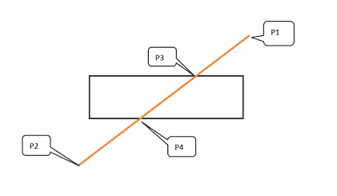
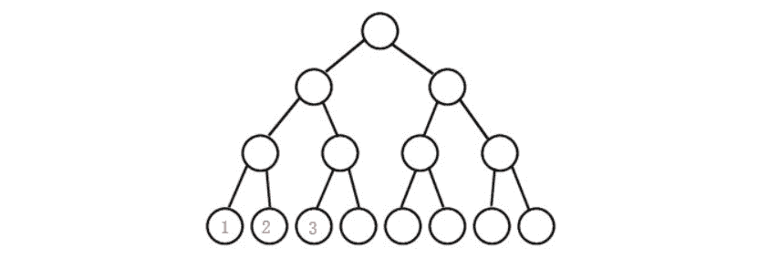

# 金山办公 2020 校招 iOS 开发工程师笔试题（一）

## 1

下面哪个是类 A 的复制构造函数：（）

正确答案: B   你的答案: 空 (错误)

```cpp
 A(const A*)
```

```cpp
A(A const&)
```

```cpp
A(A const&) const
```

```cpp
A(const A&) const
```

本题知识点

C++工程师 金山 WPS iOS 工程师 2020

## 2

定义纯虚函数，是为了：（）

正确答案: C   你的答案: 空 (错误)

```cpp
方便阅读
```

```cpp
减少运行的时间开销
```

```cpp
实现多态
```

```cpp
压缩目标代码体积
```

本题知识点

C++工程师 金山 WPS iOS 工程师 2020

## 3

```cpp
std::vector<int>* a = new std::vector<int>[3]
```

下面正确释放内存的方法：（）

正确答案: C   你的答案: 空 (错误)

```cpp
free(a);
```

```cpp
delete a;
```

```cpp
delete[] a;
```

```cpp
delete a[3];
```

本题知识点

C++工程师 金山 WPS iOS 工程师 2020

## 4

下面函数传参有问题的是：（）

正确答案: A   你的答案: 空 (错误)

```cpp
void func(std::vector<int> a);
```

```cpp
void func(const std::vector<int>* pA);
```

```cpp
void func(const std::vector<int>& a);
```

```cpp
void func(const std::vector<int>*& pA);
```

本题知识点

C++工程师 金山 WPS iOS 工程师 2020

讨论

[奋斗 ing_QT](https://www.nowcoder.com/profile/3898074)

vector 做输出参数时，传指针和传引用；vector 做输入参数时，应当加上 const 属性；所以 A 应当有 const。

发表于 2020-02-10 21:37:02

* * *

[酷狗音乐](https://www.nowcoder.com/profile/787711862)

这一题？有点牵强吧。选 A 作为值传入，效率低些，操作是可行

发表于 2020-02-10 22:05:35

* * *

[Italink](https://www.nowcoder.com/profile/945029208)

这题目怕不是有毒

发表于 2020-06-04 13:41:16

* * *

## 5

下面 result 的值是：（）

```cpp
int arr[2][3] = {{4, 5, 6}, {7, 8, 9}};
    int* p = &arr[0][0];
    int result = (*p) * (*(p + 2)) * (*(p + 4));
```

正确答案: D   你的答案: 空 (错误)

```cpp
140
```

```cpp
160
```

```cpp
168
```

```cpp
192
```

本题知识点

C++工程师 金山 WPS iOS 工程师 2020

讨论

[牛客 183810939 号](https://www.nowcoder.com/profile/183810939)

4*6*8

发表于 2020-09-28 16:27:43

* * *

## 6

类 A 想访问类 B 的私有方法：（）

正确答案: B   你的答案: 空 (错误)

```cpp
在 A 类中写 friend class B;
```

```cpp
在 B 类中写 friend class A;
```

```cpp
A 类私有继承 B 类;
```

```cpp
都不行;
```

本题知识点

C++工程师 金山 WPS iOS 工程师 2020

## 7

下面有编译错误的是：（）

正确答案: D   你的答案: 空 (错误)

```cpp
int b = 0, A;
```

```cpp
char c = '';
```

```cpp
float f = -10000000000000000000000000000000;
```

```cpp
int char;
```

本题知识点

C++工程师 金山 WPS iOS 工程师 2020

讨论

[ligong](https://www.nowcoder.com/profile/588414122)

D 选项用了保留字，但是 B 选项，编译也报错了啊。

发表于 2021-10-09 20:51:15

* * *

[是只废牛🐮](https://www.nowcoder.com/profile/394184768)

太南了

发表于 2020-04-28 07:37:30

* * *

## 8

下面 result 的值是：（）

```cpp
int result = 10;
result *= result += result %= 3;
```

正确答案: C   你的答案: 空 (错误)

```cpp
2
```

```cpp
3
```

```cpp
4
```

```cpp
5
```

本题知识点

C++工程师 金山 WPS iOS 工程师 2020

讨论

[牛客 183810939 号](https://www.nowcoder.com/profile/183810939)

从右到左计算，result 的值从 10 变为 1 变为 2 变为 4

发表于 2020-09-28 16:30:32

* * *

## 9

简单实现的函数，为了效率，函数定义应：（）

正确答案: B   你的答案: 空 (错误)

```cpp
定义成模板函数;
```

```cpp
定义成 inline 函数;
```

```cpp
定义成重载函数;
```

```cpp
定义成友元函数;
```

本题知识点

C++工程师 金山 WPS iOS 工程师 2020 牛客

讨论

[炫歌](https://www.nowcoder.com/profile/622959792)

那位大神能讲一讲？ 本人对 c++方面的不是很懂。感谢😁

发表于 2020-05-24 13:46:38

* * *

## 10

下面 a.m_val2 的值是：（）

```cpp
class A
{
public:
    A(int val1 = 2, int val2 = 5)
        : m_val1(val1)
        , m_val2(val2)
    {
    }

public:
    int m_val1;
    int m_val2;
};

...
    A a(3);
...
```

正确答案: D   你的答案: 空 (错误)

```cpp
2
```

```cpp
3
```

```cpp
4
```

```cpp
5
```

本题知识点

C++工程师 金山 WPS iOS 工程师 2020

讨论

[牛客 460830826 号](https://www.nowcoder.com/profile/460830826)

构造函数给形参添加了默认值访问形参成员的时候只给 val1 赋值了 val2 还是默认值（小白，大神勿喷）

发表于 2022-01-18 16:05:54

* * *

## 11

Objective-C 中，类与类之间通讯方式主要有哪几种，如何正确选择通讯方式？

你的答案

本题知识点

iOS 工程师 金山 WPS 2020

## 12

什么是循环引用？如何避免循环引用？

你的答案

本题知识点

iOS 工程师 金山 WPS 2020

讨论

[牛客 278719690 号](https://www.nowcoder.com/profile/278719690)

循环引用是指两个对象互为引用关系，都不能被释放。避免对象形成有向环。

发表于 2020-02-16 20:24:15

* * *

## 13

在二维平面坐标系中，已知存在一条线段（图中 P1->p2）和一个矩形区域，编程计算得出线段被矩形区域裁剪的新起始点。注意以下要求：
A、线段是有方向的，裁剪得到的新线段也需要保持原线段的方向；下图中，线段的描述是 P1->p2，则裁剪的结果是 P3->p4，反之，如果线段描述是 P2->P1，则结果是 P4->P3
B、线段的起始点在矩形区域里面时，裁剪的结果则就是原始线段
C、当线段与矩形区域没有相交线段的时候，结果输出“-1”


本题知识点

C++工程师 金山 WPS iOS 工程师 2020

讨论

[Italink](https://www.nowcoder.com/profile/945029208)

```cpp

```
#include <iostream>
using namespace std;
struct Point {
	float x, y;
};
struct Rect {
	Point leftBottom, rightTop;
	bool contain(const Point& pt) {
		return pt.x > leftBottom.x&& pt.x<rightTop.x && pt.y>leftBottom.y&& pt.y < rightTop.y;
	}
	void cut(Point& pt, const Point& dir) {		//根据方向向量将点裁剪到矩形上
		if (contain(pt))						//如果点在矩形内，则不需要对它裁剪
			return;
		Point offset = { 1,dir.y / dir.x };		//确定水平方向，计算垂直方向的偏移
		if (pt.x > rightTop.x)
			pt = { rightTop.x,pt.y + offset.y * (rightTop.x - pt.x) };
		else if (pt.x < leftBottom.x)
			pt = { leftBottom.x,pt.y + offset.y * (leftBottom.x - pt.x) };
		offset = { dir.x / dir.y,1 };			//确定垂直方向，计算水平方向的偏移
		if (pt.y > rightTop.y)
			pt = { pt.x + offset.x * (rightTop.y - pt.y), rightTop.y };
		else if (pt.y < leftBottom.y)
			pt = { pt.x + offset.x * (leftBottom.y - pt.y), leftBottom.y };
	}
};

istream& operator>>(istream& in, Point& pt) {
	in >> pt.x >> pt.y;
	return in;
}

int main() {
	Rect rect;
	Point p1, p2;
	Point dir;  //直线的方向向量

	cin >> rect.leftBottom >> rect.rightTop;
	cin >> p1 >> p2;
	dir = { p2.x - p1.x,p2.y - p1.y };
	rect.cut(p1, dir);
	rect.cut(p2, dir);
	if (p1.x == p2.x && p1.y == p2.y)
		printf("-1");
	else
		printf("(%0.2f,%0.2f)\n(%0.2f,%0.2f)", p1.x, p1.y, p2.x, p2.y);
	return 0;
}

```cpp

```

编辑于 2020-06-05 13:18:08

* * *

[算法梦工厂](https://www.nowcoder.com/profile/6384065)

```cpp
#include<bits/stdc++.h>
using namespace std;
struct point{
    double x,y;
};
struct box{
    double x1,y1,x2,y2;
};
bool isInside(point x, box s){
    return s.x1<=x.x && x.x<=s.x2 && s.y1<=x.y && x.y<=s.y2;
}
bool work1(point s, point t, box a, point& ans_s, point& ans_t){
    ans_s = s;
    ans_t = t;
    int flag = 0;
    point now = s;
    int unit = 30000;
    double add_x = (t.x - s.x) / unit, add_y = (t.y - s.y) / unit;
    for(int i=0;i<unit;i++){
        now.x += add_x;
        now.y += add_y;
        if(flag ==0 && isInside(now, a)){
            ans_s = now;
            flag = 1;
        }
        if(flag == 1 && !isInside(now, a)){
            ans_t = now;
            break;
        }
    }
    if(flag == 0){
        return false;
    }
    else{
        return true;
    }
} 
int main(){
    point s,t;
    box a;
    scanf("%lf%lf%lf%lf",&a.x1, &a.y1, &a.x2, &a.y2);
    scanf("%lf%lf%lf%lf",&s.x, &s.y, &t.x, &t.y);
    point ans_s, ans_t;
    bool flag = work1(s, t, a, ans_s, ans_t);
    if(flag == true){
        printf("(%.2lf,%.2lf)\n(%.2lf,%.2lf)\n",ans_s.x,ans_s.y,ans_t.x,ans_t.y);
    }
    else{
        printf("-1\n");
    }
    return 0;
}
```

发表于 2020-02-20 09:36:17

* * *

## 14

给定一个 M 行 N 列表格，从左上角单元格开始，每次只能向右或者向下走，最后到达右下角单元格位置，路径上所有单元格内字符串拼接起来就是路径字符串，求所有路径中路径字符串字符长度最短的路径字符串的长度。

如给定 3 行 4 列表格（m=3,n=4），各单元格字符串内容如下表所示，那么表中箭头所指的路径(灰色背景单元格）即为最短路径，对应的内容为粗斜体字符串即“武汉金山办公公司”长度为 8，最终的结果也就是这个字符串。

要求：

输入：strTableContent 为表格字符串表示，使用“|”作为单元格分隔符，“/”作为表格行分隔符，将表格从左向右，从上向下依次序列化，如下标的字符串表示为:
strTableContent=”武汉|金山|办公|/金山办公|办|软件|有限/软件有限公司|公||公司/”;

输出：GetMinPathStringLength 返回结果为”8”;


本题知识点

C++工程师 金山 WPS iOS 工程师 2020

讨论

[Italink](https://www.nowcoder.com/profile/945029208)

```cpp
#include <iostream>
#include <vector>
#include <string>
#include <limits>
#include <algorithm>
using namespace std;

class Solution {
public:
    int GetMinPathStringLength(int m, int n, string strTableContent) {
        vector<vector<int>> graph;
        int minSize = numeric_limits<int>::max();
        int count = 0;
        vector<int> row;
        for (char& ch : strTableContent) {
            if (ch == '|') {
                row.push_back(count);
                count = 0;
            }
            else if (ch == '/') {
                row.push_back(count);
                count = 0;
                graph.push_back(row);
                row.clear();
            }
            else
                count++;
        }
        vector<vector<int>> dp(m ,vector<int>(n));
        dp[0][0] = graph[0][0];
        for (int i = 1; i < m; i++)
            dp[i][0] = graph[i][0] + dp[i - 1][0];
        for (int i = 1; i < n; i++)
            dp[0][i] = graph[0][i] + dp[0][i - 1];
        for (int i = 1; i < m; i++) {
            for (int j = 1; j < n; j++) {
                dp[i][j] = min(dp[i - 1][j], dp[i][j - 1]) + graph[i][j];
            }
        }
        return dp[m-1][n-1];
    }
};
```

 发表于 2020-06-04 13:43:46

* * *

[wangshu](https://www.nowcoder.com/profile/7021268)

我写的 bfs,dp 也没问题

```cpp

	class Solution {

	public:

	    /**

	     * 返回最短路径组成的字符串的长度

	     * @param m int 整型 表格行数

	     * @param n int 整型 表格列数

	     * @param strTableContent string 字符串 表格字符串表示

	     * @return int 整型

	     */

	    const int inf=0x3f3f3f3f;

	    struct node{

	    int val,x,y;

	    node(){};

	    node(int val,int x,int y)

	    {

	        this->val=val;

	        this->x=x;

	        this->y=y;

	    }

	    bool operator <(const node &t)const{

	    return x>t.x;

	    }

	};

	    int GetMinPathStringLength(int m, int n, string str) {

	        // write code here

	        swap(n,m);

	       int dir[2][2]={1,0,0,1},mp[105][105],dis[105][105];

	        int l=str.length(),val=0,pos=0;

	        memset(dis,inf,sizeof dis);

	        for(int i=0;i<l;i++)

	        {

	            if(str[i]=='|'||str[i]=='/'){

	                mp[pos/m][pos%m]=val;

	                val=0;

	                pos++;

	            }

	            else val++;

	        }

	        priority_queue<node>q;

	        q.push(node(mp[0][0],0,0));

	        dis[0][0]=mp[0][0];

	        while(!q.empty()){

	            node now=q.top();

	            q.pop();

	            for(int i=0;i<2;i++)

	            {

	                int nx=now.x+dir[i][0];

	                int ny=now.y+dir[i][1];

	                if(nx>=n||ny>=m)continue;

	                if(dis[nx][ny]>now.val+mp[nx][ny]){

	                    dis[nx][ny]=now.val+mp[nx][ny];

	                    q.push(node(dis[nx][ny],nx,ny));

	                }

	            }

	        }

	    return dis[n-1][m-1];

	    }

	};

```

编辑于 2020-02-19 17:14:14

* * *

## 15

字符串联想是一个被广泛用于搜索引擎/输入法的功能。联想算法根据一定规则，计算出与待匹配字符串最接近的若干个联想结果。聪明的 ttt 觉得这功能很好，希望刚入职的 lhy 也实现一个简单的联想算法。

ttt：客户端将提供一个最优匹配结果数 k，一个待匹配字符串，和若干个命令。希望你能实现一个算法，它实现两种操作：
A: 增加一项搜索记录
 P: 打印当前的 k 个最优匹配结果

我们规定每个匹配记录（record）需满足：record 中存在至少一个与 s 完全匹配的子串。
并规定，若满足下列条件，则称 record a 是比 record b 更好的匹配记录
1.record a 长度短于 record b
2.长度相同，record a 的字典序小于 record b 这可把热爱摸鱼的 lhy 难倒了。为了帮 lhy 保住工作，和 ttt 一样聪明的你能帮帮 lhy 吗？

本题知识点

C++工程师 金山 WPS iOS 工程师 2020

讨论

[Italink](https://www.nowcoder.com/profile/945029208)

```cpp
#include <iostream>
#include <string>
#include <regex>
#include <set>
using namespace std;
struct cmp{
    bool operator()(const string& a,const string& b) const {
        return a.size() != b.size() ? a.size() < b.size() : a < b;
    }
};
int main() {
    int n, k;
    string str,record;
    char type;
    set<string, cmp> match;
    cin >> n >> k >> str;
    for (int i = 0; i < n; i++) {
        cin >> type;
        if (type == 'A') {
            cin >> record;
            if(regex_search(record, regex(str)))
                match.insert(record);
        }
        else {
            cout << "P:" << endl;
            int output = 0;
            for (const string& s : match) {
                cout << s << endl;
                if (++output==k)
                    break;
            }
        }
    }
    return 0;
}
```

发表于 2020-06-04 13:43:06

* * *

## 16

某地主担心农民偷取他的粮食，雇人挖了大量地窖来屯粮，这些地窖层层排列，只有一个总入口。 每个地窖都有一个随机且唯一的数字编号(1 ... N)。聪明的农夫经过一番侦察，发现所有的地窖形成了一颗满二叉树，只有叶子节点中才存放有粮食，粮食数量与地窖编号相同。 狡猾的地主设置了报警装置，只要任意两个相邻的叶子节点中粮食被偷，就会自动报警。
农夫事先并不知道地窖分布图，但是他无意间得到了地窖组成的二叉树的前序遍历和中序遍历结果，请帮忙计算一下，在不触发报警装置的情况下，农夫最多可以偷取地主多少粮食。
提示：

1.  如果一个二叉树的层数为 K，且节点总数是 2k -1 ，则它就是满二叉树，如下图所示。
2.  下图中节点 1 和节点 2，节点 2 和节点 3 均为相邻的叶子节点， 节点 1 和节点 3 不属于相邻叶子节点；



本题知识点

C++工程师 金山 WPS iOS 工程师 2020

讨论

[勇敢牛牛，不怕困难！](https://www.nowcoder.com/profile/840813925)

```cpp
#include <stdio.h>
#include <stdlib.h>

typedef int ElemType;

typedef struct TreeNode {
  ElemType data;
  struct TreeNode* left;
  struct TreeNode* right;
} TreeNode, *PTreeNode;

// ==================== function declaration ====================
PTreeNode construct(int* preorder, int* inorder, int i, int j, int n);
void collectLeaves(PTreeNode root, int* leaves, int* leavesSize);

int main(const int argc, const char* const argv[]) {
  int n;
  fscanf(stdin, "%d", &n);

  int preorder[n], inorder[n];
  int i;
  for (i = 0; i < n; ++i)
    fscanf(stdin, "%d", preorder + i);
  for (i = 0; i < n; ++i)
    fscanf(stdin, "%d", inorder + i);

  PTreeNode root = construct(preorder, inorder, 0, 0, n);
  int leaves[n], leavesSize = 0;
  collectLeaves(root, leaves, &leavesSize);

  // dynamic programming
  int dp2 = 0, dp1 = 0;
  for (i = 0; i < leavesSize; ++i) {
    int dp = fmax(dp2 + *(leaves + i), dp1);
    dp2 = dp1;
    dp1 = dp;
  }

  return fprintf(stdout, "%d", dp1), 0;
}

PTreeNode construct(int* preorder, int* inorder, int i, int j, int n) {
  if (n <= 0) return NULL;
  PTreeNode root = (PTreeNode) malloc(sizeof(TreeNode));
  if (!root) return root;
  root->data = *(preorder + i);
  root->left = root->right = NULL;
  if (n == 1) return root;

  int k = j;
  while (*(inorder + k) != *(preorder + i)) ++k;
  int l = k - j;

  root->left  = construct(preorder, inorder, i + 1, j, l);
  root->right = construct(preorder, inorder, i + 1 + l, k + 1, n - 1 - l);
  return root;
}

void collectLeaves(PTreeNode root, int* leaves, int* leavesSize) {
  if (!root) return;
  if (!root->left && !root->right) {
    *(leaves + (*leavesSize)++) = root->data;
    return;
  }
  collectLeaves(root->left,  leaves, leavesSize);
  collectLeaves(root->right, leaves, leavesSize);
}
```

发表于 2021-07-21 08:22:43

* * *

[Italink](https://www.nowcoder.com/profile/945029208)

```cpp

```
#include <iostream>
#include <vector>
#include <algorithm>
using namespace std;

vector<int> getLeavesByPreOrder(const int& n, int i = 0) {	//根据前序遍历确定叶节点
	static vector<int> leaves;
	int temp;
	cin >> temp;
	if ((i << 1) + 1 >= n) {								//添加叶节点
		leaves.push_back(temp);
		return leaves;
	}
	getLeavesByPreOrder(n, (i << 1) + 1);
	getLeavesByPreOrder(n, (i << 1) + 2);
	return leaves;
}
int main() {
	int n;
	cin >> n;
	vector<int> leaves = getLeavesByPreOrder(n);
	vector<int> dp(leaves.size());
	dp[0] = leaves[0];
	dp[1] = max(leaves[0], leaves[1]);
	for (int i = 2; i < dp.size(); i++)
		dp[i] = max(dp[i - 2] + leaves[i], dp[i - 1]);
	cout << dp.back();
	return 0;
}
```cpp

```

编辑于 2020-06-05 18:00:42

* * *

[牛客 721185958 号](https://www.nowcoder.com/profile/721185958)

```cpp
using namespace std;
#include <iostream>
#include <string.h>
#include <stdlib.h>
#include <algorithm>

static int tree[100000];
static int dp[100000];
static void getTree(int lvl, int target, int* plen)
{
    int t;
    if (lvl >= target)
    {
        cin >> tree[(*plen)++];
        return;
    }
    else
    {
        cin >> t;
        getTree(lvl + 1, target, plen);
        getTree(lvl + 1, target, plen);
    }
}
static inline int max(int x, int y)
{
    return x > y ? x : y;
}
int main()
{
    int n, k, i, len, tmp;
    while (cin >> n)
    {
        k = n + 1;
        i = 0;
        while (k > 1)
        {
            k >>= 1;
            i++;
        }
        k = i;
        len = 0;
        getTree(0, k - 1, &len);
        for (i = 0; i < n; i++)
            cin >> tmp;
        dp[0] = tree[0];
        dp[1] = tree[1];
        dp[2] = tree[2] + dp[0];
        for (i = 3; i < len; i++)
            dp[i] = tree[i] + max(dp[i - 2], dp[i - 3]);
        if (len <= 1)
            cout << dp[len - 1];
        else
            cout << max(dp[len - 1], dp[len - 2]);
        cout << endl;
    }
    return 0;
}
```

编辑于 2020-03-09 21:31:18

* * *