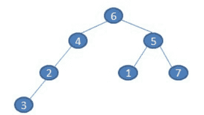
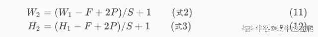

# 金山办公 2020 校招大数据和机器学习算法笔试题（一）

## 1

执行如下程序代码后，C 的值是（    ）

```cpp
int a = 0, c = 0;
do{
    --c;
    a = a - 1;
}while(a > 0);
```

正确答案: C   你的答案: 空 (错误)

```cpp
0
```

```cpp
1
```

```cpp
-1
```

```cpp
死循环
```

本题知识点

算法工程师 大数据开发工程师 金山 WPS 2020

讨论

[fxhong](https://www.nowcoder.com/profile/130398514)

--c 和 c--的区别：前者先 c=c-1,在输出 c；后者是先输出 c，在 c=c-1；do..while..语句中：先执行 do 里面的语句，在判断 while()里面条件是否成立：成立，则继续执行 do 语句；不成立，终止循环。

发表于 2022-03-18 22:32:24

* * *

[吴帅男](https://www.nowcoder.com/profile/843952881)

do while 循环体首先会无条件执行一次，然后在再根据 while 里的条件进行循环

发表于 2020-06-21 00:17:53

* * *

## 2

写出中序遍历如下二叉树的结果（ ）

正确答案: C   你的答案: 空 (错误)

```cpp
6423517      
```

```cpp
6452173
```

```cpp
3246157
```

```cpp
3217456
```

本题知识点

算法工程师 大数据开发工程师 金山 WPS 2020

讨论

[百岁山下酸菜鱼](https://www.nowcoder.com/profile/801004196)

前序遍历：根节点->左子树->右子树中序遍历：左子树->根节点->右子树后序遍历：左子树->右子树->根节点

发表于 2020-02-17 16:14:04

* * *

[fxhong](https://www.nowcoder.com/profile/130398514)

前序遍历：根左右中序遍历：左根右后序遍历：左右根

发表于 2022-03-18 22:33:00

* * *

## 3

 设指针变量 p 指向双向链表中结点 A，指针变量 s 指向被插入的结点 X，则在结点 A 的后面插入结点 X 的操作序列为（  ）。

正确答案: D   你的答案: 空 (错误)

```cpp
p->right=s； s->left=p； p->right->left=s； s->right=p->right；
```

```cpp
 s->left=p；s->right=p->right；p->right=s； p->right->left=s；
```

```cpp
p->right=s； p->right->left=s； s->left=p； s->right=p->right；
```

```cpp
s->left=p；s->right=p->right；p->right->left=s； p->right=s;
```

本题知识点

算法工程师 大数据开发工程师 金山 WPS 2020 C++工程师 牛客

讨论

[牛客 854552795 号](https://www.nowcoder.com/profile/854552795)

第一步一定是 s->left=p；要先让待插入的节点的一段插入到已知的节点上，如果开始先 p->right=s 会报错，因为此时的 s 是未定义的，指针指向他就会报错。

发表于 2022-03-21 20:37:01

* * *

## 4

为了使索引键的值在基本表中唯一，在建立索引的语句中应使用保留字(  )

正确答案: A   你的答案: 空 (错误)

```cpp
UNIQUE
```

```cpp
COUNT
```

```cpp
DISTINCT
```

```cpp
UNION
```

本题知识点

算法工程师 大数据开发工程师 金山 WPS 2020

讨论

[Sci-Hub](https://www.nowcoder.com/profile/4641369)

unique 和 distinct 都是去重的意思，但他们所用的语句不同

1：unique 可以用于在创建表时或者在修改表的结构时使用

例如：

create table test(sno int not null unique);

或者 alter table test alter unique(sname);

2:distinct 则是用于对 select 语句使用

例如： select distinct depart from test

发表于 2021-04-10 13:10:19

* * *

## 5

在一条线段上任取两点,求能构成三角形的概率是多少：（    ）

正确答案: B   你的答案: 空 (错误)

```cpp
1/8
```

```cpp
1/4
```

```cpp
1/3
```

```cpp
1/2
```

本题知识点

算法工程师 大数据开发工程师 金山 WPS 2020

讨论

[进步不生锈](https://www.nowcoder.com/profile/8398003)

设[线段](http://www.so.com/s?q=%E7%BA%BF%E6%AE%B5&ie=utf-8&src=internal_wenda_recommend_textn)[长度](http://www.so.com/s?q=%E9%95%BF%E5%BA%A6&ie=utf-8&src=internal_wenda_recommend_textn)为 l,任取[两点](http://www.so.com/s?q=%E4%B8%A4%E7%82%B9&ie=utf-8&src=internal_wenda_recommend_textn)把这条线段分为三段的长度分别是 x 、y 和 z=l-(x+y)，<x,y,z∈(0,l)>
x +y＜l
三段能构成[三角形](http://www.so.com/s?q=%E4%B8%89%E8%A7%92%E5%BD%A2&ie=utf-8&src=internal_wenda_recommend_textn),则
x+y＞z, 即 x+y>(l-x-y), x +y>l/2
y+z＞x, 即 y+(l-x-y)>x, x＜l/2
z+x＞y, 即 (l-x-y)+x>y, y＜l/2
所求概率等于 x+y=l/2、x=l/2、y=l/2[三条](http://www.so.com/s?q=%E4%B8%89%E6%9D%A1&ie=utf-8&src=internal_wenda_recommend_textn)[直线](http://www.so.com/s?q=%E7%9B%B4%E7%BA%BF&ie=utf-8&src=internal_wenda_recommend_textn)所包围[图形](http://www.so.com/s?q=%E5%9B%BE%E5%BD%A2&ie=utf-8&src=internal_wenda_recommend_textn)的[面积](http://www.so.com/s?q=%E9%9D%A2%E7%A7%AF&ie=utf-8&src=internal_wenda_recommend_textn)除以直线(x+y)=l 与 x 轴、y 轴所包围图形的面积。
故在一条线段上任取两点，能构成三角形的概率是
(l/2*l/2*1/2)÷(l*l*1/2)=l²/8÷1²/2=1/4 为什么是 1/3，不是 1/4

发表于 2020-02-11 16:34:25

* * *

[667635429](https://www.nowcoder.com/profile/667635429)

假设总线长为 10，第一段线长 x，第二段线长 y，则第三段线长 10-x-y。由三角形性质可知：x+y>10-x-y ,即 x+y>5 ;                                 x+(10-x-y)>y, 即 y<5 ；同理 x<5 ；接下来用图解法，画出方程相应的线就可以求出，x，y 可取值的范围的面积为 25，所以概率为 25/100=1/4

发表于 2020-11-13 21:44:56

* * *

[零葬](https://www.nowcoder.com/profile/75718849)

根据几何概型计算应该是 1/4

发表于 2020-12-29 15:14:37

* * *

## 6

以下正则表达式，能用来提取下面文字中的所有日期的是（ ）

```cpp
“The next meetup on data science will be held on 2017-09-21, previously it happened on 31/03, 2016”
```

正确答案: D   你的答案: 空 (错误)

```cpp
\d{4}-\d{2}-\d{2}
```

```cpp
(19|20)\d{2}-(0[1-9]|1[0-2])-[0-2][1-9]
```

```cpp
(19|20)\d{2}-(0[1-9]|1[0-2])-([0-2][1-9]|3[0-1])
```

```cpp
都不能
```

本题知识点

算法工程师 大数据开发工程师 金山 WPS 2020

讨论

[牛客 206597936 号](https://www.nowcoder.com/profile/206597936)

答案 D 题目中两个时间格式最少应该是两个分支的正则，所以不正确 BC 可以匹配第一个时间格式，C 正则更完整一点

发表于 2021-01-20 22:43:31

* * *

## 7

观察者模式定义了一种（）的依赖关系。

正确答案: A   你的答案: 空 (错误)

```cpp
一对多
```

```cpp
一对一
```

```cpp
多对多
```

```cpp
都有可能
```

本题知识点

算法工程师 大数据开发工程师 金山 WPS 2020

## 8

N-Grams 指的是 N 个单词的组合，下面的句子可以产生的 Bi-Gram（N=2)是（  ）

```cpp
“Kingsoft Corporation is a famous software company in the world.”
```

正确答案: C   你的答案: 空 (错误)

```cpp
7
```

```cpp
8
```

```cpp
9
```

```cpp
10
```

本题知识点

算法工程师 大数据开发工程师 金山 WPS 2020

## 9

堆可以用作（）

正确答案: A   你的答案: 空 (错误)

```cpp
优先队列
```

```cpp
栈
```

```cpp
降序数组
```

```cpp
普通数组
```

本题知识点

算法工程师 大数据开发工程师 金山 WPS 2020

讨论

[进步不生锈](https://www.nowcoder.com/profile/8398003)

**最大优先队列，无论入队顺序，当前最大的元素优先出队。**

**最小优先队列，无论入队顺序，当前最小的元素优先出队。**

发表于 2020-02-11 16:58:56

* * *

[DeShuiYu](https://www.nowcoder.com/profile/381741634)

为什么不可以作为降序数组

发表于 2020-11-25 11:16:51

* * *

## 10

下列哪个 HTTP 请求方法的请求体为空（ ）

正确答案: C   你的答案: 空 (错误)

```cpp
POST
```

```cpp
SEND
```

```cpp
GET
```

```cpp
PUT
```

本题知识点

算法工程师 大数据开发工程师 金山 WPS 2020

讨论

[荒岛流年](https://www.nowcoder.com/profile/573915609)

http 请求的方法总共有如下几个：get，post，put，delete，head，connect，trace，options。get 方法通常用于向服务器请求资源，如果需要带参数会把参数放于 url 末尾发送。post 则是把数据放于 http 报文试题的主体里面。put 主要是用于文件的传输。delete 是通过 url 对服务器上的某些资源进行删除。connext 是通过与服务器进行隧道链接，通过通道将数据进行加密连接。options 是查询该请求 url 可以支持什么请求的方法。trace 是让服务器把之前的请求通信在发回给客户端

发表于 2020-05-08 18:16:59

* * *

## 11

下列伪代码段说明了 OOP 的哪个特征？（ ）

```cpp
class Student
{  
    int marks;  
};
class Topper : public Student
{  
    int age;
    Topper(int age)
    {   
        this.age=age;  
    }   
};
```

正确答案: D   你的答案: 空 (错误)

```cpp
继承
```

```cpp
多态
```

```cpp
继承与多态
```

```cpp
封装和继承
```

本题知识点

算法工程师 大数据开发工程师 金山 WPS 2020

讨论

[牛客 241044857 号](https://www.nowcoder.com/profile/241044857)

用到的类属于封装

有继承关系

只有一个子类，多个子类才可以体现多态。

发表于 2020-08-06 15:32:48

* * *

## 12

Attention 机制属于以下哪种网络结构（  ）

正确答案: D   你的答案: 空 (错误)

```cpp
Seq to Seq
```

```cpp
Seq to Vector
```

```cpp
Vector to Seq
```

```cpp
Encoder-Decoder
```

本题知识点

算法工程师 大数据开发工程师 金山 WPS 2020

## 13

one-hot 和 word2vec 的相比，以下哪项是正确的（  ）

正确答案: B   你的答案: 空 (错误)

```cpp
one-hot 向量稀疏，内存占用比 Word2vec 小
```

```cpp
word2vec 的向量考虑了词的上下文语义
```

```cpp
one-hot 可以用来判断相似词
```

```cpp
Word2vec 输出的向量维度与词典大小有直接关系
```

本题知识点

算法工程师 大数据开发工程师 金山 WPS 2020

## 14

Nave Bayes(朴素贝叶斯)是一种特殊的 Bayes 分类器,特征变量是 X,类别标签是 Y,它的一个假定是（ ）

正确答案: B   你的答案: 空 (错误)

```cpp
各类别的先验概率 P(Y)是相等的
```

```cpp
特征变量 X 的各个维度是类别条件独立随机变量
```

```cpp
以 0 为均值，sqr(2)/2 为标准差的正态分布
```

```cpp
P(X|Y)是高斯分布
```

本题知识点

算法工程师 大数据开发工程师 金山 WPS 2020

## 15

在 Logistic Regression 中,如果同时加入 L1 和 L2 范数,不会产生什么效果（ ）

正确答案: D   你的答案: 空 (错误)

```cpp
可以做特征选择,并在一定程度上防止过拟合
```

```cpp
能解决维度灾难问题
```

```cpp
能加快计算速度
```

```cpp
可以获得更准确的结果
```

本题知识点

算法工程师 大数据开发工程师 金山 WPS 2020

讨论

[郭灿阳](https://www.nowcoder.com/profile/499247568)

L0 范数计算非零参数个数，无法防止过拟合 L1 范数进行特征选择，使得参数矩阵稀疏，一定程度上防止过拟合 L2 范数可以防止过拟合

发表于 2020-09-08 21:05:13

* * *

[文文呀](https://www.nowcoder.com/profile/730665086)

这个题是不是有问题啊？？

发表于 2020-02-12 23:09:42

* * *

## 16

有一个 15*15 的图像，使用一个 3*3 的 filter 进行卷积（步幅为 2）之后，得到的图像大小为（ ）

正确答案: A   你的答案: 空 (错误)

```cpp
 8*8
```

```cpp
9*9
```

```cpp
10*10
```

```cpp
11*11
```

本题知识点

算法工程师 大数据开发工程师 金山 WPS 2020

讨论

[进步不生锈](https://www.nowcoder.com/profile/8398003)

不应该是 7*7 吗

发表于 2020-02-11 20:19:46

* * *

[零葬](https://www.nowcoder.com/profile/75718849)

这题只有在 padding 为 1 的情况下才能得到答案吧

发表于 2020-10-12 22:26:32

* * *

## 17

下列哪个不属于监督学习（ ）

正确答案: C   你的答案: 空 (错误)

```cpp
逻辑回归
```

```cpp
SVM
```

```cpp
K-means
```

```cpp
XGBoost
```

本题知识点

算法工程师 大数据开发工程师 金山 WPS 2020

## 18

下面哪个是"Logistic Loss"（ ）

正确答案: A   你的答案: 空 (错误)

本题知识点

算法工程师 大数据开发工程师 金山 WPS 2020

讨论

[郭灿阳](https://www.nowcoder.com/profile/499247568)

交叉熵

发表于 2020-09-08 21:12:00

* * *

## 19

以下哪种模型可以被用来计算文档相似度是（ ）

正确答案: D   你的答案: 空 (错误)

```cpp
训练一个 word2vec 模型学习文档中的上下文关系
```

```cpp
训练一个词袋模型学习文档中的词共现关系
```

```cpp
建立文档-词矩阵，用每个文档的 cos 距离
```

```cpp
选项所有
```

本题知识点

算法工程师 大数据开发工程师 金山 WPS 2020

## 20

甲、乙、丙、丁 4 人分别掌握英、法、德、日四种语言中的两种，其中有 3 人会说英语，但没有一种语言是 4 人都会的，并且知道：

(1)没有人既会日语又会法语；

(2)甲会日语，而乙不会，但他们可以用另一种语言交谈；

(3)丙不会德语，甲和丁交谈时，需要丙为他们做翻译；

(4)乙、丙、丁不会同一种语言。

根据上述条件，以下哪项是四人分别会的两种语言？（）

正确答案: A   你的答案: 空 (错误)

```cpp
甲会英语和日语，乙会英语和德语，丙会英语和法语，丁会法语和德语。
```

```cpp
甲会英语和日语，乙会英语和法语，丙会英语和德语，丁会法语和德语。
```

```cpp
甲会英语和德语，乙会英语和日语，丙会英语和法语，丁会法语和德语。
```

```cpp
甲会英语和德语，乙会英语和法语，丙会法语和德语，丁会英语和日语。
```

本题知识点

算法工程师 大数据开发工程师 金山 WPS 2020

## 21

下列可以用来提升短文本分类模型的准确率的特征是（ ）

正确答案: A B C D   你的答案: 空 (错误)

```cpp
 词频
```

```cpp
文本的向量表示
```

```cpp
词性标注
```

```cpp
语法依赖关系
```

本题知识点

算法工程师 大数据开发工程师 金山 WPS 2020

## 22

如果神经网络有高的偏差(bias)，下列哪些方法可以尝试（ ）

正确答案: A C   你的答案: 空 (错误)

```cpp
增加隐层神经元数量
```

```cpp
增加测试(test)数据
```

```cpp
增加网络层数
```

```cpp
增加正则项
```

```cpp
增加训练(training)数据
```

本题知识点

算法工程师 大数据开发工程师 金山 WPS 2020

讨论

[小蜗的城堡](https://www.nowcoder.com/profile/706965766)

为什么不选 e 呢

发表于 2020-07-30 10:16:27

* * *

## 23

下列关于栈的叙述正确的是（）

正确答案: A D   你的答案: 空 (错误)

```cpp
栈是线性结构
```

```cpp
栈是一种树状结构
```

```cpp
栈具有先进先出的特征
```

```cpp
栈有后进先出的特征
```

本题知识点

算法工程师 大数据开发工程师 金山 WPS 2020

## 24

有关模板方法模式，以下叙述正确的是（）

正确答案: A C D   你的答案: 空 (错误)

```cpp
允许定义不同的子过程，同时维护基本过程的一致性。
```

```cpp
将定义和操作相互分离。
```

```cpp
创建一个抽象类，用抽象方法实现一个过程，这些抽象方法必须在子类中实现。
```

```cpp
实现抽象方法的子类的步骤可以独立变化，并且这些步骤可以采用 Strategy 模式来实现。
```

本题知识点

算法工程师 大数据开发工程师 金山 WPS 2020

讨论

[Sci-Hub](https://www.nowcoder.com/profile/4641369)

B 选项将定义和操作相互分离。  为什么不对？

发表于 2021-04-10 13:23:24

* * *

## 25

Which of the following statements are correct with regards to Topic Modeling（  ）

正确答案: C D   你的答案: 空 (错误)

```cpp
 It is a supervised learning technique
```

```cpp
LDA (Linear Discriminant Analysis) can be used to perform topic modeling
```

```cpp
Selection of number of topics in a model depends on the size of data
```

```cpp
Number of topic terms are not directly proportional to size of the data
```

本题知识点

算法工程师 大数据开发工程师 金山 WPS 2020

## 26

装饰器模式和代理模式有哪些相同点和不同点,并分别举例说明?

你的答案

本题知识点

算法工程师 大数据开发工程师 金山 WPS 2020

## 27

设计一个系统用来预测输入的中文电影评论表达的情感状态是正面，负面还是中立的。要求给出特征处理的方法，使用哪种预测模型，为什么使用该模型，如何评价系统的好坏等。

你的答案

本题知识点

算法工程师 大数据开发工程师 金山 WPS 2020

## 28

在计算广告中，经常存在样本非常稀疏且极度不均衡的情况，请说下你对该类问题的理解和解决思路。

你的答案

本题知识点

算法工程师 大数据开发工程师 金山 WPS 2020

## 29

给定一个长度为 n 的数组 a[0],a[1]...a[n-1]和一个数字 x，在数组中查找两个数 a 和 b（可以是相同的值，但是不可以是相同位置的数字），使得它们的和与输入的数字差的绝对值最小。比如：a = [8,3,6,1]      x=13 那么答案为：6 和 8

本题知识点

算法工程师 大数据开发工程师 金山 WPS 2020

讨论

[进步不生锈](https://www.nowcoder.com/profile/8398003)

```cpp
public static int[] Findmincha(int[] a ,int x) {
		int[] res = new int[2];
		Arrays.sort(a);
		//System.out.println("x:"+x);
//		for (int i = 0; i <a.length; i++) {
//			System.out.println("a["+i+"]:"+a[i]);
//		}		
		int min = Integer.MAX_VALUE;
		for (int i = 0; i < a.length; i++) {
			for (int j = i+1; j < a.length; j++) {
				if (Math.abs(a[i]+a[j]-x)<min) {
					min = Math.abs(a[i]+a[j]-x);
					res[0]=a[i];
					res[1]=a[j];
				}
			}
		}
		//System.out.print(res[0]+" "+res[1]);
		return res;

	}

	public static void main(String[] args) {
		Scanner sc = new Scanner(System.in);
		int n = sc.nextInt();
		int x = sc.nextInt();		
		int[] a =new int[n];
		for (int i = 0; i < a.length; i++) {
			a[i]=sc.nextInt();
		}
		int[] res = Findmincha(a,x);
		System.out.print(res[0]+" "+res[1]);

	}
```

这题只能一种答案，如果有两种答案的话，还不能选另一种？比如 3+4=7，2+5=7，但是选了另一种会报错，所以我的代码没有通过 

发表于 2020-02-11 20:42:46

* * *

[Buendia94](https://www.nowcoder.com/profile/622391059)

n,x = list(map(int, input().split(' ')))
A = [int(x) for x in input().split(' ')]
num = len(A)
a = 0
b = 1
for i in range(num - 1):
    for j in range(i+1, num):
        if abs(A[i] + A[j] - x) < abs(A[a] + A[b] - x):
            a = i
            b = j
if A[a] < A[b]: 
    print(A[a], A[b])
else:
    print(A[b], A[a])

发表于 2020-06-10 22:54:15

* * *

[覔亖甴愢丢](https://www.nowcoder.com/profile/716546521)

```cpp
import java.util.HashMap;
import java.util.Map;
import java.util.Scanner;
import java.util.StringTokenizer;

public class Main {
    static int[] array1;
    public static void main(String[] args) {
        //输入两个数  数组大小 n  要比较的数 x
        Scanner sc = new Scanner(System.in);
        int n = sc.nextInt();
        int x = sc.nextInt();

        //数组 array1
        if (2 <= n && n <= 1000 && 1 <= x && x <= 10E8) {
            array1 = new int[n];
            for (int i = 0; i < n; i++) {
                int b = sc.nextInt();
                array1[i] = b;
            }

            //结果放进 map
            Map map = new HashMap();
            int c;
            int e=1000000;
            for (int i = 0; i < n; i++) {
                for (int j = 1; j < n; j++) {
                    //去重
                    if (i == j || i > j) {
                        continue;
                    }
                    c = Math.abs(array1[i] + array1[j]- x);

                    map.put(c, Math.min(array1[i],array1[j]) + "," +Math.max(array1[i],array1[j]) );
                    e = Math.min(e, c);
                }
            }

//            System.err.println("最小绝对值"+e);
            StringTokenizer splitor = new StringTokenizer((String) map.get(e),",");
            while(splitor.hasMoreTokens()){
                System.out.print(splitor.nextElement()+" ");
            }
        }
    }
}
```

发表于 2020-02-19 19:40:38

* * *