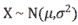
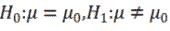
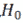
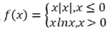
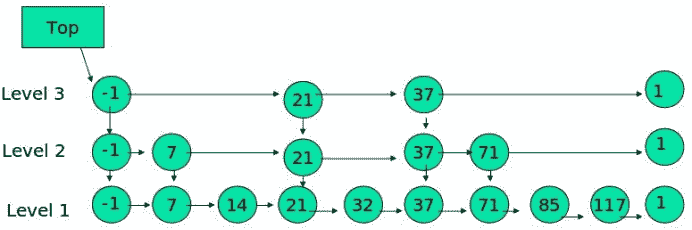

# 金山办公 2020 校招大数据和机器学习算法笔试题（二）

## 1

设随机变量 X 的概率密度 f(x)满足 f(1+x)=f(1-x),且,则 P(X<0)=（）

正确答案: A   你的答案: 空 (错误)

```cpp
0.2  
```

```cpp
0.3
```

```cpp
0.4
```

```cpp
0.6
```

本题知识点

算法工程师 大数据开发工程师 金山 WPS 2020

讨论

[零葬](https://www.nowcoder.com/profile/75718849)

不会，乱选的，求解答

发表于 2021-02-17 19:24:58

* * *

[DeShuiYu](https://www.nowcoder.com/profile/381741634)

这题怎么做？

发表于 2020-11-23 17:14:40

* * *

## 2

给定总体，已知，给定一个样本集，对总体均值 μ  进行检验，令，则（）

正确答案: D   你的答案: 空 (错误)

```cpp
若显著性水平α=0.05 时拒绝  ，若显著性水平α=0.01 时必拒绝
```

```cpp
若显著性水平α=0.05 时接受 ，若显著性水平α=0.01 时必拒绝
```

```cpp
若显著性水平α=0.05 时拒绝 ，若显著性水平α=0.01 时必接受
```

```cpp
若显著性水平α=0.05 时接受 ，若显著性水平α=0.01 时必接受
```

本题知识点

算法工程师 大数据开发工程师 金山 WPS 2020

讨论

[我是好人 x](https://www.nowcoder.com/profile/695232730)

a=p(拒绝 H0|H0 为真）即不选 H0 的可能性 a=0.05 都能接受 H0，说明 a=0.01 必能接受

发表于 2020-03-16 23:04:13

* * *

[未知李 123](https://www.nowcoder.com/profile/335305177)

当计算的概论小于 0.05 时，说明小概率事件发生，拒绝原假设。同理当计算的概论小于 0.01 时，说明小概率事件发生，拒绝原假设。如果概论值大于 0.05 时，接受原假设，那么必然大于 0.01，必然接受原假设

发表于 2022-03-10 17:13:39

* * *

[DeShuiYu](https://www.nowcoder.com/profile/381741634)

这题怎么做

发表于 2020-11-25 10:15:26

* * *

## 3

某部门共有 6 人，下面有三个判断：

有人会 Java；

有人不会 Java；

leader 不会 Java

上述三个判断只有一个是真的，则关于该部门会 Java 的人数的判断正确的是（）

正确答案: A   你的答案: 空 (错误)

```cpp
6 个人都会  
```

```cpp
6 个人都不会 
```

```cpp
仅有一个人不会  
```

```cpp
仅有一个人会
```

本题知识点

算法工程师 大数据开发工程师 金山 WPS 2020

讨论

[笑谈风声](https://www.nowcoder.com/profile/953227749)

A，三次假设，每次单独假设 ABC 都是对的，BC 很容易很容易矛盾

发表于 2020-09-29 14:08:22

* * *

[Maple_2005](https://www.nowcoder.com/profile/203246634)

假设第一句话为真，有人会 Java，代表有一部分人会或者全部都会，如果有一部分人会的话，第二句话也为真，因此全部人都会 Java； 假设第二句话为真，有人不会 Java，代表有一部分人不会或者全部不会，如果有一部分人不会的话，第一句也为真，如果全部都不会的话，第三句为真，因此第二句话假设不成立； 假设第三句话为真，假设只有 leader 不会，则第一句第二句都为真，假设除了 leader 还我女一部分人不会，则第一句第二句任然为真，假设除了 leader 其他人也不会，则第二句为真 综上所述，只有第一句话为真。

发表于 2020-06-05 03:14:11

* * *

[17839221](https://www.nowcoder.com/profile/391265573)

A

发表于 2020-03-31 11:52:21

* * *

## 4

设函数  ，则 x=0 是 f(x)的（）

正确答案: B   你的答案: 空 (错误)

```cpp
可导点，极值点
```

```cpp
不可导点，极值点
```

```cpp
可导点，非极值点
```

```cpp
不可导点，非极值点
```

本题知识点

算法工程师 大数据开发工程师 金山 WPS 2020

讨论

[Maple_2005](https://www.nowcoder.com/profile/203246634)

左右导数同号，应该是非极值点吧？？？

发表于 2020-06-05 03:18:46

* * *

[不可休思 icon](https://www.nowcoder.com/profile/209695411)

B 吧，根据左右导数的定义可以算得左右导数不相等，导数不存在；极值点判断的话，x 趋于 0-时，f(x)<0；x 趋于 0+时，f(x)<0；所以，x=0 时极值点。

发表于 2020-06-05 11:30:54

* * *

## 5

N-Grams means the combination of N words, how many Bi-Grams（N=2) will the following sentence generate?（）

```cpp
“Kingsoft Corporation is a famous software company in the world.”
```

正确答案: C   你的答案: 空 (错误)

```cpp
7
```

```cpp
8
```

```cpp
9
```

```cpp
10
```

本题知识点

算法工程师 大数据开发工程师 金山 WPS 2020

讨论

[zxcv0112358](https://www.nowcoder.com/profile/473856205)

[`zhuanlan.zhihu.com/p/32829048`](https://zhuanlan.zhihu.com/p/32829048)

> N-Gram 是一种基于统计语言模型的算法。它的基本思想是将文本里面的内容按照字节进行大小为 N 的滑动窗口操作，形成了长度是 N 的[字节片段](https://www.zhihu.com/search?q=%E5%AD%97%E8%8A%82%E7%89%87%E6%AE%B5&search_source=Entity&hybrid_search_source=Entity&hybrid_search_extra=%7B%22sourceType%22%3A%22article%22%2C%22sourceId%22%3A32829048%7D)序列。

我查到了这个，你理解为大小为 2 的滑动窗口，那么答案确实是 9

发表于 2021-12-06 12:31:40

* * *

[马儿 666888](https://www.nowcoder.com/profile/139004564)

有人说下思路吗？？

发表于 2020-02-19 20:05:12

* * *

## 6

Which of the following statement is right about the relation between MapReduce and HBase（）? 

正确答案: B   你的答案: 空 (错误)

```cpp
None of them is dispensable, MapReduce is the guarantee of the working of HBase.
```

```cpp
They are not strongly-related, without MapReduce, HBase can work normally.
```

```cpp
MapReduce can't directly access HBase.
```

```cpp
They have no relations at all
```

本题知识点

算法工程师 大数据开发工程师 金山 WPS 2020

## 7

下列的陈述错误的是（）

正确答案: C   你的答案: 空 (错误)

```cpp
数组是稠密列表并且是静态数据结构
```

```cpp
链表中的数据元素不需存在相邻的内存空间
```

```cpp
指针存储了链表的下一个节点的数据
```

```cpp
链表是节点数据和下一节点指针的集合
```

本题知识点

算法工程师 大数据开发工程师 金山 WPS 2020

讨论

[还有诗和远方的田野](https://www.nowcoder.com/profile/990737106)

指针存储了链表的前或后节点的地址

发表于 2020-02-15 19:52:49

* * *

## 8

左子树设右子数高度最多差 1 的数据结构是（）

 正确答案: A   你的答案: 空 (错误)

```cpp
AVL tree
```

```cpp
Red-black tree
```

```cpp
Lemma tree
```

```cpp
都不是
```

本题知识点

算法工程师 大数据开发工程师 金山 WPS 2020

讨论

[小五同学](https://www.nowcoder.com/profile/1671501)

左子树设右子数高度，描述的有问题吧。

发表于 2020-03-18 10:13:36

* * *

## 9

下列的陈述正确的是（）

i:单链表和循环链表不肯能向后遍历

ii:要找到当前节点的前驱节点，单链表需要从第一个节点开始遍历

正确答案: C   你的答案: 空 (错误)

```cpp
i
```

```cpp
ii
```

```cpp
i  和  ii
```

```cpp
都不对
```

本题知识点

算法工程师 大数据开发工程师 金山 WPS 2020

讨论

[零葬](https://www.nowcoder.com/profile/75718849)

为什么链表不能向后遍历

发表于 2021-01-08 11:04:28

* * *

## 10

（）是度量模块间依赖的程度

正确答案: B   你的答案: 空 (错误)

```cpp
内聚
```

```cpp
耦合
```

```cpp
模块化
```

```cpp
都不是
```

本题知识点

算法工程师 大数据开发工程师 金山 WPS 2020

讨论

[Maple_2005](https://www.nowcoder.com/profile/203246634)

低耦合，高内聚

发表于 2020-06-05 03:19:22

* * *

## 11

（）不是面向对象设计的四个原则之一

正确答案: D   你的答案: 空 (错误)

```cpp
Dependency Inversion Principle
```

```cpp
Interface Segregation Principle
```

```cpp
Open-Closed Principle
```

```cpp
Parsimonious Complexity Principle
```

本题知识点

算法工程师 大数据开发工程师 金山 WPS 2020

讨论

[danielllee](https://www.nowcoder.com/profile/119786777)

面向对象设计原则

*   一、开放封闭原则
*   二、里式替换原则
*   三、依赖倒置原则
*   四、接口隔离原则
*   五、单一职责原则

D 选项 Parsimonious Complexity Principle 为简约复杂性原则。

发表于 2020-02-19 10:11:27

* * *

## 12

校验和（Checksum）在 Internet 中被多个协议使用，但不在（）使用：

正确答案: D   你的答案: 空 (错误)

```cpp
session layer
```

```cpp
transport layer
```

```cpp
network layer
```

```cpp
data link layer
```

本题知识点

算法工程师 大数据开发工程师 金山 WPS 2020

## 13

如果响应消息的大小大于 512 字节，被称为（）：

正确答案: C   你的答案: 空 (错误)

```cpp
icmp connection
```

```cpp
smtp connection
```

```cpp
tcp connection
```

```cpp
dns connection
```

本题知识点

算法工程师 大数据开发工程师 金山 WPS 2020

## 14

在数据库管理系统中，索引中使用的数据结构类型为（）：

正确答案: D   你的答案: 空 (错误)

```cpp
哈希数据结构
```

```cpp
树数据结构
```

```cpp
内容和词汇表结构
```

```cpp
A 和 B
```

本题知识点

算法工程师 大数据开发工程师 金山 WPS 2020

## 15

在数据库管理系统中，将各种 DML 语句转换为低级文件系统命令，通过（）：

正确答案: B   你的答案: 空 (错误)

```cpp
Query processor
```

```cpp
Storage manager
```

```cpp
Query manager
```

```cpp
Storage processor
```

本题知识点

算法工程师 大数据开发工程师 金山 WPS 2020

## 16

在数据库管理系统中，存储管理器的某组件，确保数据库在系统出现故障时仍保持一致状态，称为（）：

正确答案: D   你的答案: 空 (错误)

```cpp
File manager
```

```cpp
Authorization and integrity manager
```

```cpp
Buffer manager
```

```cpp
Transaction manager
```

本题知识点

算法工程师 大数据开发工程师 金山 WPS 2020

## 17

计算机系统的对称多处理结构共享了下列哪些资源（）：

正确答案: D   你的答案: 空 (错误)

```cpp
Buses
```

```cpp
Memory
```

```cpp
Processors
```

```cpp
both   A  and  B
```

本题知识点

算法工程师 大数据开发工程师 金山 WPS 2020

## 18

能够按存活的硬件水平连续提供服务的能力，称为（）：

正确答案: D   你的答案: 空 (错误)

```cpp
优雅升级
```

```cpp
降解
```

```cpp
升级
```

```cpp
适度降级
```

本题知识点

算法工程师 大数据开发工程师 金山 WPS 2020

## 19

要执行的中断指针表包含（）：

正确答案: C   你的答案: 空 (错误)

```cpp
Interrupts
```

```cpp
Programs
```

```cpp
Addresses
```

```cpp
Compilers
```

本题知识点

算法工程师 大数据开发工程师 金山 WPS 2020

## 20

不是操作系统模式的是（）：

正确答案: D   你的答案: 空 (错误)

```cpp
User mode
```

```cpp
Kernel mode
```

```cpp
Supervisor mode
```

```cpp
System mode
```

本题知识点

算法工程师 大数据开发工程师 金山 WPS 2020 C++工程师 牛客

## 21

HTTP 的 Keepalive 模式是什么样的？适用哪些场景？

你的答案

本题知识点

算法工程师 大数据开发工程师 金山 WPS 2020

## 22

如下链表结构被称为跳表，其中-1 表示 INT_MIN，链表的最小值，1 表示 INT_MAX，链表的最大值。

跳表具有如下性质：

(1) 由很多层结构组成

(2) 每一层都是一个有序的链表

(3) 最底层（Level 1）的链表包含了所有元素

(4) 如果一个元素出现在 Level i 的链表中，则它在 Level i 之下的链表也都会出现

(5) 每个节点包含了 2 个指针，一个指向同一链表中的下一个元素，一个指向下面一层的元素。

(6) 用实验中丢硬币的次数 K 作为元素占有的层数。

假设原始链表（即跳表的第一级）有 N 个节点，分析并计算跳表查询某个值的时间复杂度，并写出插入操作的代码。

你的答案

本题知识点

算法工程师 大数据开发工程师 金山 WPS 2020

## 23

阅读以下程序：

给出该算法的时间复杂度。

简要说明语句覆盖，分支覆盖，条件覆盖之前的关系。

给出该代码的测试用例（单元测试代码），说明你设计测试用例的依据。

```cpp
int binarySearch(int[] arr, int res) {
        If(arr.length<1){
           return -1;
        }
        int low = 0;   
        int high = arr.length-1;   
        while(low <= high) {
            int middle = (low + high)/2;
            if(res == arr[middle]) {
                return middle;   
            }else if(res <arr[middle]) {   
                high = middle - 1;   
            }else {   
                low = middle + 1;   
            }
        }
        return -1;  
     }
```

你的答案

本题知识点

算法工程师 大数据开发工程师 金山 WPS 2020

## 24

给定一个二叉树，节点值由 24 个大写字母组成，找到一条最长路径，符合字符串“WPS”的连接顺序，输出该路径长度。

该路从某个初始结点到树中任意结点，通过【父节点-->子节点】关系连接而产生的任意路径，并且路径中的每个节点值都必须在给定字符串中出现。

如果找不到这样的路径返回 0；如果完全符合字符串可以继续循环，如“WPSWPS”。

示例：

输入:

```cpp
    S
  /  \
 O    W
     / \
    P   S
         \
          P
```

输出: 3

你的答案

本题知识点

算法工程师 大数据开发工程师 金山 WPS 2020

## 25

大家都使用过百度网盘类的网络应用。假如用户要在 PC 上传一个电影文件到网盘上（文件大小大概 2G），请描述为了完成上述任务，网盘客户端和服务端所涉及到的核心处理流程。

你的答案

本题知识点

算法工程师 大数据开发工程师 金山 WPS 2020