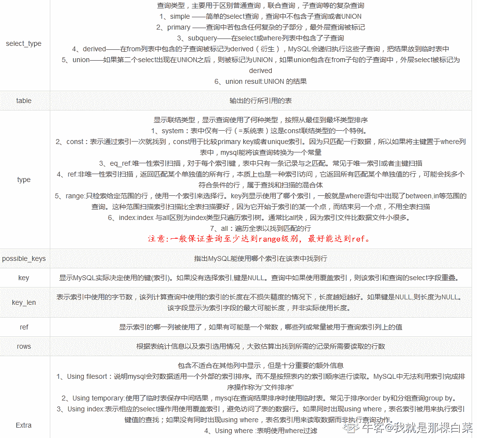

# 金山办公 2020 校招服务端开发工程师笔试题（二）

## 1

linux 系统 load average 返回的三个值，哪一个作为系统长期负载高的参考值比较准确？（）

正确答案: C   你的答案: 空 (错误)

```cpp
第一个
```

```cpp
 第二个
```

```cpp
 第三个
```

本题知识点

Java 工程师 金山 WPS 2020

讨论

[王之石](https://www.nowcoder.com/profile/157072198)

1\. load average 定义 linux 系统中的 Load 对当前 CPU 工作量的度量。简单的说是进程队列的长度。 Load Average 就是一段时间 (1 分钟、5 分钟、15 分钟) 内平均 Load 。 2\. load average 值的含义 1） 单核处理器 假设我们的系统是单 CPU 单内核的，把它比喻成是一条单向马路，把 CPU 任务比作汽车。当车不多的时候，load <1；当车占满整个马路的时候 load=1；当马路都站满了，而且马路外还堆满了汽车的时候，load>1 2） 多核处理器 我们经常会发现服务器 Load > 1 但是运行仍然不错，那是因为服务器是多核处理器（Multi-core）。 假设我们服务器 CPU 是 2 核，那么将意味我们拥有 2 条马路，我们的 Load = 2 时，所有马路都跑满车辆。 0.7 < load < 1: 此时是不错的状态，如果进来更多的汽车，你的马路仍然可以应付。 load = 1: 你的马路即将拥堵，而且没有更多的资源额外的任务，赶紧看看发生了什么吧。 load > 5: 非常严重拥堵，我们的马路非常繁忙，每辆车都无法很快的运行 3\. 三种 Load 值，应该看哪个 通常我们先看 15 分钟 load，如果 load 很高，再看 1 分钟和 5 分钟负载，查看是否有下降趋势。 1 分钟负载值 > 1，那么我们不用担心，但是如果 15 分钟负载都超过 1，我们要赶紧看看发生了什么事情。所以我们要根据实际情况查看这三个值。

发表于 2020-02-13 07:25:12

* * *

## 2

mysql explain 返回结果的 type 列字段，下面哪种类型表示的查询效率最高？（）

正确答案: B   你的答案: 空 (错误)

```cpp
index
```

```cpp
system
```

```cpp
const
```

```cpp
range
```

本题知识点

Java 工程师 金山 WPS 2020

讨论

[offer 快来球球了](https://www.nowcoder.com/profile/243031380)



发表于 2020-03-04 13:43:07

* * *

[唯仁斯婊](https://www.nowcoder.com/profile/913752204)

type：显示了连接使用了哪种类别,有无使用索引，是使用 Explain 命令分析性能瓶颈的关键项之一

> 结果值从好到坏依次是：
> system > const > eq_ref > ref > fulltext > ref_or_null > index_merge > unique_subquery > index_subquery > range > index > ALL

一般来说，得保证查询至少达到 range 级别，最好能达到 ref，否则就可能会出现性能问题。

发表于 2020-02-13 15:24:50

* * *

## 3

```cpp
char str[] = “Hello”; char *p = str; sizeof(p) = ?
```

（）

正确答案: D   你的答案: 空 (错误)

```cpp
1
```

```cpp
5
```

```cpp
6
```

```cpp
8
```

本题知识点

Java 工程师 金山 WPS 2020

讨论

[淡定阳毛](https://www.nowcoder.com/profile/577283354)

查询百度后发现，指针的长度和机器有关，64 位机对应 8 个字节，32 位机对应 4 个字节。ps:本人也不太确定，如有错误，请指正

发表于 2020-02-16 20:34:18

* * *

[江上一小白](https://www.nowcoder.com/profile/652362402)

sizeof：是运算符，获取某个数据类型所占用空间的字节数，参数可以是数组、指针、类型、对象、函数等。strlen：是函数，参数必须是字符型指针，返回字符串的长度。从代表该字符串的第一个地址开始遍历，直到遇到结束符 NULL。返回的长度大小不包括 NULL（字符串以“\0”结尾，但是不计入长度）

发表于 2020-02-16 22:23:15

* * *

## 4

一个 C 程序运行时，对于内存中堆栈的描述，哪些是正确的？（） 正确答案: B C   你的答案: 空 (错误)

```cpp
堆用来保存函数的局部变量
```

```cpp
栈用来保存函数的局部变量
```

```cpp
堆的内存由程序员直接控制
```

```cpp
A. 栈的内存由程序员直接控制
```

本题知识点

Java 工程师 金山 WPS 2020

讨论

[唯仁斯婊](https://www.nowcoder.com/profile/913752204)

数据段 ：数据段（data segment）通常是指用来存放程序中 已初始化 的 全局变量 的一块内存区域。数据段属于静态内存分配。
代码段： 代码段（code segment/text segment）通常是指用来存放 程序执行代码 的一块内存区域。这部分区域的大小在程序运行前就已经确定，并且内存区域通常属于 只读 , 某些架构也允许代码段为可写，即允许修改程序。在代码段中，也有可能包含一些 只读的常数变量 ，例如字符串常量等。程序段为程序代码在内存中的映射.一个程序可以在内存中多有个副本.

堆（heap） ：堆是用于存放进程运行中被动态分配的内存段，它的大小并不固定，可动态扩张或缩减。当进程调用 malloc/free 等函数分配内存时，新分配的内存就被动态添加到堆上（堆被扩张）/释放的内存从堆中被剔除（堆被缩减）

栈(stack) ：栈又称堆栈， 存放程序的 局部变量 （但不包括 static 声明的变量， static 意味着 在数据段中 存放变量）。除此以外，在函数被调用时，栈用来传递参数和返回值。由于栈的先进先出特点，所以栈特别方便用来保存/恢复调用现场。储动态内存分配,需要程序员手工分配,手工释放

发表于 2020-02-13 15:28:01

* * *

## 5

下面关于 TCP 协议网络端口的描述，哪些是正确的？（） 正确答案: D   你的答案: 空 (错误)

```cpp
 端口号范围大小受限于操作系统的内存
```

```cpp
端口号范围没有限制
```

```cpp
端口号范围大小受限于操作系统的文件句柄数量
```

```cpp
网络端口号范围大小受限于 TCP 协议
```

本题知识点

Java 工程师 金山 WPS 2020

## 6

顺序表的”假溢出”是什么？循环队列怎么推断是空还是满？请给出判断公式 ?

你的答案

本题知识点

Java 工程师 金山 WPS 2020

讨论

[小白 201810221347813](https://www.nowcoder.com/profile/563461221)

数组队尾元素已经占用。而队首地方还是空暇的，解决假溢出的办法就是后面满了就再从头開始，也就是头尾相接的循环 假设队列最大长度为 QueueSize。那么队列满的条件是（rear+1)%QueueSize==front.通用的计算队列长度的公式为：（rear-front+QueueSize)%QueueSize

发表于 2020-09-28 09:53:44

* * *

[zsh12138](https://www.nowcoder.com/profile/944824767)

顺序队列中，如果没有按照取余数的方式入队，就会在数组的最后，出现数组溢出，这时候，及时数组前面有空间，也不能正确入队，形成假溢出。

发表于 2020-03-30 22:19:56

* * *

## 7

什么是进程（Process）？什么是线程（Thread）？有何区别？

你的答案

本题知识点

Java 工程师 金山 WPS 2020

讨论

[唯仁斯婊](https://www.nowcoder.com/profile/913752204)

含义：

> 进程是具有一定独立功能的的程序，进程是系统进行资源分配和调度的一个独立单元。
> 线程是进程的一个实体,是 CPU 调度和分派的基本单位,它是比进程更小的能独立运行的基本单位.线程自己基本上不拥有系统资源,只拥有一点在运行中必不可少的资源(如程序计数器,一组寄存器和栈),但是它可与同属一个进程的其他的线程共享进程所拥有的全部资源

区别：

*   一个程序至少有一个进程，一个进程至少有一个线程.
*   线程的划分尺度小于进程，使得多线程程序的并发性高。
*   进程在执行过程中拥有独立的内存单元，而多个线程共享内存，从而极大地提高了程序的运行效率。
*   线程在执行过程中与进程还是有区别的。每个独立的线程有一个程序运行的入口、顺序执行序列和程序的出口。但是线程不能够独立执行，必须依存在应用程序中，由应用程序提供多个线程执行控制。
*   从逻辑角度来看，多线程的意义在于一个应用程序中，有多个执行部分可以同时执行。但操作系统并没有将多个线程看做多个独立的应用，来实现进程的调度和管理以及资源分配。

发表于 2020-02-13 15:32:39

* * *

## 8

分别描述 TCP 的 3 次握手和四次挥手的定义、目的和过程？

你的答案

本题知识点

Java 工程师 金山 WPS 2020

讨论

[ModestYjx](https://www.nowcoder.com/profile/4902505)

TCP 的第三次握手，是为了已失效的请求报文突然又传到服务端造成错误。若没有第三次握手，服务端会等待客户端发送数据，而客户端却不会发送数据，造成服务端久久等待，从而遭受攻击。

发表于 2020-09-02 11:19:34

* * *

## 9

结合生活实际，完成用户权限管理的数据库设计，可从以下几个方面着手：

1、明确设计使用的实际场景；

2、明确用户/角色/权限的关联关系；

3、明确用户组/用户/角色的关联关系；

4、提供关键数据的存储设计及表格关联关系

5、明确数据库设计的优缺点，通用性，扩展性；

你的答案

本题知识点

Java 工程师 金山 WPS 2020

## 10

把 m 个同样的足球放进 n 个同样的篮子里，允许有的篮子为空，问共有几种分法？例如：3, 2, 1 和 2, 1, 3 是同一种分法。 

本题知识点

Java 工程师 金山 WPS 2020

讨论

[豪好学习](https://www.nowcoder.com/profile/8944503)

设 f(m,n) 为 m 个足球，n 个篮子的放法数目，则先对 n 作讨论
**当 n>m：**必定有 n-m 个篮子永远空着，去掉它们对摆放足球方法数目不产生影响。即 if(n>m) f(m,n) = f(m,m)**当 n<=m：**不同的放法可以分成两类：    1、有至少一个篮子空着，即相当于 f(m,n) = f(m,n-1);    2、所有篮子都有足球，相当于可以从每个篮子中拿掉一个足球，不影响不同放法的数目，即 f(m,n) = f(m-n,n).而总的放足球的放法数目等于两者的和，即 f(m,n) =f(m,n-1)+f(m-n,n) 
递归出口条件说明：
当 n=1 时，所有足球都必须放在一个篮子里，所以返回１；
当 m==0(没有足球可放)时，定义为１种放法；ref：[`blog.csdn.net/u013074465/article/details/45505279`](https://blog.csdn.net/u013074465/article/details/45505279)

编辑于 2020-02-28 15:27:35

* * *

[Last101](https://www.nowcoder.com/profile/625551753)

import java.util.Scanner;
public class Main{
    public static void main(String[] args){
        Scanner sc=new Scanner(System.in);
        String[] strs=sc.nextLine().split(" ");
        int n=Integer.parseInt(strs[0]);
        int m=Integer.parseInt(strs[1]);
        System.out.println(solution(n,m));
    }
    private static int solution(int n,int m){
        if(n==1||m==0)
            return 1;
        else if(n>m){
            return solution(m,m);
        }else
            return solution(n,m-n)+solution(n-1,m);
    }
}这道题用递归和动态规划都可以！

发表于 2020-03-03 12:26:42

* * *

[PurDragon](https://www.nowcoder.com/profile/589122401)

```cpp
if __name__ == "__main__":
    nm = list(input().split(" "))
    n = int(nm[1])
    m = int(nm[0])

    dp = [[0 for i in range(m+1)] for j in range(n+1)]
    dp[0][0] = 0

    for i in range(1, m+1):
        dp[0][i] = 1

    for i in range(1, n+1):
        for j in range(1, m+1):
            if i >= j:
                dp[i][j] = dp[i][j-1] + dp[i-j][j]
            else:
                dp[i][j] = dp[i][j-1]

    print(str(dp[n][m]))
```

发表于 2020-02-15 22:20:00

* * *

## 11

一台新机器，第 4 年可以生产一台机器，以后每一年生产 1 台。 生产出来的新机器第 4 年又可以生产一台机器，后续每年可以生产 1 台。现在有一台新机器，求第 n 年总共有多少台机器。 计算结果对 10⁹+7 取模。 

本题知识点

Java 工程师 金山 WPS 2020

讨论

[oliver.chen](https://www.nowcoder.com/profile/264289544)

因为第四年后才开始增张，所以以后每一年增长量 n 就是三年前的机器量（因为那时候的机器到你这一年已经可以生成机器了）。因此每一年的量=增长量 n+上一年的量

```cpp
import java.util.*;

public class Main {
    public static void main(String[] args) {
        List<Double> list = new ArrayList<>();
        list.add(Double.valueOf("1"));
        list.add(Double.valueOf("1"));
        list.add(Double.valueOf("1"));
        double mode = Math.pow(10,9) + 7;
        Scanner in = new Scanner(System.in);
        int n = in.nextInt();
        int index = 2;
        if (n <= 3)
            System.out.println(1);
        else {
            for (int i = 3; i < n; i++){
                double nums = (list.get(index) + list.get(index - 2))%mode;
                list.add(nums);
                index++;
            }
            System.out.printf("%.0f",list.get(index));
        }
    }
}

```

发表于 2020-11-09 22:37:17

* * *