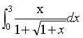

# 金山办公 2020 校招计算机视觉算法工程师笔试题（二）

## 1

下列算法中属于图像平滑处理的是？

正确答案: D   你的答案: 空 (错误)

```cpp
Hough 变换法
```

```cpp
状态法
```

```cpp
高通滤波
```

```cpp
中值滤波 
```

本题知识点

算法工程师 金山 WPS

讨论

[woolsey](https://www.nowcoder.com/profile/599545079)

hough 变换是一种特征检测方法状态法全称（可能）是空间状态法，一种人工智能求解问题的方法中值滤波就是卷积核取 medium，具有平滑功能高斯滤波是一种去噪滤波器，同样可以作为去噪滤波器的有：均值滤波，高斯滤波（高频信号能通过、低频信号不能通过，只能用于去噪），双边滤波（两个方向看图像梯度，还是只能去噪），中值滤波

发表于 2020-02-14 09:05:01

* * *

## 2

下列属于无监督学习的模型是（）

正确答案: A   你的答案: 空 (错误)

```cpp
Kmeans       
```

```cpp
KNN 
```

```cpp
SVM      
```

```cpp
决策树 
```

本题知识点

算法工程师 金山 WPS

讨论

[joyeuxni](https://www.nowcoder.com/profile/737317267)

无监督学习解决的主要是“聚类（Clustering）”问题，常见的无监督方法主要有：1.PCA；2.K-Means；3.Auto-Encoder；4.高斯混合模型；5.流行学习方法

发表于 2022-03-17 17:05:17

* * *

## 3

对一幅 100*100 像素的图像，若每像元使用 8bit 表示其灰度值，经霍夫曼编码后压缩图像的数据量为 10000bit，则图像的压缩比为（）

正确答案: C   你的答案: 空 (错误)

```cpp
 2:1
```

```cpp
 4:1
```

```cpp
8:1
```

```cpp
 1:2
```

本题知识点

算法工程师 金山 WPS

讨论

[后街女孩](https://www.nowcoder.com/profile/1329647)

100*100 的图像包含的像元为 100*100=10000，每个像元用 8Bit,则一共是 80000bit,所以压缩包为 8:1

发表于 2020-04-17 11:24:04

* * *

## 4

求定积分      （）

正确答案: C   你的答案: 空 (错误)

```cpp
1
```

```cpp
4/3
```

```cpp
 5/3
```

```cpp
3/4
```

本题知识点

算法工程师 金山 WPS

讨论

[牛客 899150604 号](https://www.nowcoder.com/profile/899150604)

定性分析法：若 x = 0，答案为 0，x=1,答案为：3*（1/2.414），x=2，答案为：3*（2/2.732），x=3，答案为：3*（3/3）。因此，定性的可以判断答案应该为 5/3

发表于 2020-02-16 18:32:18

* * *

## 5

In neural networks, nonlinear activation functions such as sigmoid, tanh, and ReLU：（）

正确答案: B   你的答案: 空 (错误)

```cpp
Speed up the gradient calculation in backpropagation,as compared to linear units
```

```cpp
Help to learn nonlinear decision boundaries
```

```cpp
Are applied only to the output units
```

```cpp
Always output values between 0 and 1
```

本题知识点

算法工程师 金山 WPS

讨论

[牛客 87268150 号](https://www.nowcoder.com/profile/87268150)

A：有时候会出现梯度消失，例如对于 signmoid 函数数据在 X 负轴很远或者正轴很远其梯度都为 0，会导致计算很慢 C:在中间的网络层也会有激活函数 D：Relu 的输出不是 0 到 1 区间

发表于 2022-02-21 19:17:45

* * *

## 6

Which of the following processes would help avoid aliasing while downsampling an image? （）

正确答案: B   你的答案: 空 (错误)

```cpp
Image sharpening
```

```cpp
 Image blurring
```

```cpp
Median filtering where you replace every pixel by the median of pixels in a window
```

```cpp
Histogram equalization
```

本题知识点

算法工程师 金山 WPS

## 7

关于 KNN 与 K-means 算法描述正确的是（）

正确答案: A   你的答案: 空 (错误)

```cpp
KNN 是分类算法,K-Means 是聚类算法
```

```cpp
它们都是监督学习
```

```cpp
都是在数据集中找离它最近的点
```

```cpp
都有明显的前期训练过程
```

本题知识点

算法工程师 金山 WPS

## 8

下列哪项不是 SVM 的优势（）

正确答案: C   你的答案: 空 (错误)

```cpp
可以和核函数结合
```

```cpp
通过调参可以往往可以得到很好的分类效果
```

```cpp
训练速度快
```

```cpp
泛化能力好
```

本题知识点

算法工程师 金山 WPS

## 9

下列有关 SVM 说法不正确的是：（）

正确答案: C   你的答案: 空 (错误)

```cpp
SVM 使用核函数的过程实质是进行特征转换的过程
```

```cpp
SVM 对线性不可分的数据有较好的分类性能
```

```cpp
SVM 因为使用了核函数，因此它没有过拟合的风险
```

```cpp
 SVM 的支持向量是少数的几个数据点向量
```

本题知识点

算法工程师 金山 WPS

## 10

下面哪个算法不能起到降维的作用？（）

正确答案: A   你的答案: 空 (错误)

```cpp
GBDT
```

```cpp
LDA
```

```cpp
PCA
```

```cpp
SVD
```

本题知识点

算法工程师 金山 WPS

讨论

[joyeuxni](https://www.nowcoder.com/profile/737317267)

GBDT：梯度下降树，在传统机器学习算法里面是对真实分布拟合的最好的几种算法之一。GBDT 可以用于分类也可以用于回归，还是可以筛选特征。

发表于 2022-03-17 20:02:55

* * *

## 11

以下描述不是解决 overfitting 问题的是（）

正确答案: B   你的答案: 空 (错误)

```cpp
使用 regularization
```

```cpp
SVM 中从多项式核转向使用高斯核
```

```cpp
拿更多的数据
```

```cpp
数据清洗，去掉一些 noise
```

本题知识点

算法工程师 金山 WPS

讨论

[woolsey](https://www.nowcoder.com/profile/599545079)

D 项，去掉噪声确实可以解决过拟合。过拟合有一种原因是模型拟合了数据中的噪音，所以去掉可以减小干扰。

> [`www.cnblogs.com/zingp/p/10511176.html#_label2`](https://www.cnblogs.com/zingp/p/10511176.html#_label2)

B 项，高斯核比多项式核更容易过拟合

> 作者：Dengyy
>     链接：[`www.nowcoder.com/questionTerminal/dd2c6a74fe9d4999a8421750051cb757`](https://www.nowcoder.com/questionTerminal/dd2c6a74fe9d4999a8421750051cb757)
>     来源：牛客网
>     
>     VM 支持向量机，一般用于二分类模型，支持线性可分和非线性划分。SVM 中用到的核函数有线性核'linear'、多项式核函数 pkf 以及高斯核函数 rbf。当训练数据线性可分时，一般用线性核函数，直接实现可分；当训练数据不可分时，需要使用核技巧，将训练数据映射到另一个高维空间，使再高维空间中，数据可线性划分，但需要注意的是，若样本 n 和特征 m 很大时，且特征 m>>n 时，需要用线性核函数，因为此时考虑高斯核函数的映射后空间维数更高，更复杂，也容易过拟合，此时使用高斯核函数的弊大于利，选择使用线性核会更好；若样本 n 一般大小，特征 m 较小，此时进行高斯核函数映射后，不仅能够实现将原训练数据再高维空间中实现线性划分，而且计算方面不会有很大的消耗，因此利大于弊，适合用高斯核函数；若样本 n 很大，但特征 m 较小，同样难以避免计算复杂的问题，因此会更多考虑线性核。

发表于 2020-02-14 09:27:22

* * *

## 12

下面的公式中，哪一个不是损失函数？（）

正确答案: D   你的答案: 空 (错误)

本题知识点

算法工程师 金山 WPS

## 13

假设一棵二叉树的结点个数为 50，则它的最小高度是（）

正确答案: C   你的答案: 空 (错误)

```cpp
4
```

```cpp
5
```

```cpp
6
```

```cpp
7
```

本题知识点

算法工程师 金山 WPS

讨论

[倒霉熊不倒霉](https://www.nowcoder.com/profile/191090399)

对于满二叉树来说，所有节点树个数为，2 的 k 次方减一， k 为二叉树的高度

发表于 2020-02-15 12:50:14

* * *

## 14

平衡二叉树的插入节点操作平均时间复杂度是（）

正确答案: D   你的答案: 空 (错误)

```cpp
O(N)
```

```cpp
O(N²)
```

```cpp
O(N * log(N))
```

```cpp
O(log(n))
```

本题知识点

算法工程师 金山 WPS

## 15

待排序元素规模较小时，宜选取哪种排序算法效率最高（）

正确答案: C   你的答案: 空 (错误)

```cpp
堆排序
```

```cpp
归并排序
```

```cpp
冒泡排序 
```

```cpp
希尔排序
```

本题知识点

算法工程师 金山 WPS

讨论

[woolsey](https://www.nowcoder.com/profile/599545079)

冒泡排序没有递归开销，复杂度里常数项小

发表于 2020-02-14 09:41:24

* * *

## 16

下列哪个神经网络结构会发生权重共享（）

正确答案: D   你的答案: 空 (错误)

```cpp
卷积神经网络 
```

```cpp
循环神经网络
```

```cpp
全连接神经网络 
```

```cpp
选项 A 和 B
```

本题知识点

算法工程师 金山 WPS

讨论

[牛客 87268150 号](https://www.nowcoder.com/profile/87268150)

循环神经网络和卷积神经网络 的区别在于隐藏层下一时刻除了使用输入 X 外，还使用上一时刻计算的结果(也是矩阵)。该区别和权重共享没关系。权重共享是对于图像的每个区域进行的操作都是一样的，都是乘以相同的卷积核。

发表于 2022-02-21 19:24:08

* * *

## 17

以下哪项是对 Early Stopping 的最佳描述？（）

正确答案: B   你的答案: 空 (错误)

```cpp
训练网络直到达到误差函数中的局部最小值
```

```cpp
在每次训练期后在测试数据集上模拟网络，当泛化误差开始增加时停止训练
```

```cpp
在中心化权重更新中添加一个梯度下降加速算子，以便训练更快地收敛
```

```cpp
更快的方法是反向传播，如‘Quickprop’算法
```

本题知识点

算法工程师 金山 WPS

## 18

请简单介绍开运算和闭运算及其分别在图像处理与分析中的作用？

你的答案

本题知识点

算法工程师 金山 WPS

讨论

[牛客 Cver](https://www.nowcoder.com/profile/1897620)

开运算：先对图像腐蚀后膨胀。作用：用来消除小的物体，平滑形状边界，并且不改变其面积。可以去除小颗粒噪声，断开物体之间的粘连。闭运算：先对图像膨胀后腐蚀。作用：用来填充物体内的小空洞，连接邻近的物体，连接断开的轮廓线，平滑其边界的同时不改变面积。

发表于 2020-02-14 16:35:09

* * *

[Kazamaki](https://www.nowcoder.com/profile/340287035)

开运算：对图像先腐蚀后膨胀。闭运算：对图像先膨胀后腐蚀。

发表于 2020-03-04 17:28:34

* * *

## 19

请简述直方图均衡化的原理和特点。

你的答案

本题知识点

算法工程师 金山 WPS

讨论

[牛客 759096424 号](https://www.nowcoder.com/profile/759096424)

直方图均衡化是一种灰度变换方法，可以通过一个变换函数将图像的灰度直方图进行处理，可以使得过明或者过暗的图像亮度分布更加均匀。

发表于 2021-07-21 12:03:22

* * *

[牛客 Cver](https://www.nowcoder.com/profile/1897620)

直方图均衡化(Histogram Equalization) 又称直方图平坦化,实质上是对图像进行非线性拉伸,重新分配图像象元值,使一定灰度范围内象元值的数量大致相等。这样,原来直方图中间的峰顶部分对比度得到增强,而两侧的谷底部分对比度降低,输出图像的直方图是一个较平的分段直方图:如果输出数据分段值较小的话,会产生粗略分类的视觉效果。

基本思想是对原始图像的像素灰度做某种映射变换, 使变换后图像灰度的概率密度呈均匀分布。这就意味着图像灰度的动态范围得到了增加, 提高了图像的对比度。

发表于 2020-02-14 16:37:15

* * *

## 20

如何解决梯度消失和梯度爆炸？

你的答案

本题知识点

算法工程师 金山 WPS

讨论

[牛客 Cver](https://www.nowcoder.com/profile/1897620)

当神经网络很深时，梯度呈指数级增长，最后到输入时，梯度将会非常大，这样能够得到一个非常大的权重更新，这就是梯度爆炸的问题，在循环神经网络中最为常见。解决方案有：

*   非饱和的激活函数（如 ReLU）
*   批量规范化（Batch Normalization）
*   梯度截断（Gradient Clipping）

发表于 2020-02-14 16:39:57

* * *

## 21

在目标检测算法中，two stage 的算法比 one stage 在检测小物体上更有效，此说法你同意么，为什么？

你的答案

本题知识点

算法工程师 金山 WPS

## 22

说一说你对 Lenet、ImageNet、AlexNet、VGG、GoogLeNet、ResNet、DenseNet 的了解（要包含其亮点和适用场景）。

你的答案

本题知识点

算法工程师 金山 WPS

讨论

[Kindfa](https://www.nowcoder.com/profile/815491610)

这个可以参考一本书去说出来就可以了。

发表于 2020-11-26 13:40:35

* * *

## 23

用伪代码实现以下需求算法。

题目：1 分、2 分、5 角的硬币组成 1 角，共有多少种组合。

你的答案

本题知识点

算法工程师 金山 WPS

讨论

[零葬](https://www.nowcoder.com/profile/75718849)

暴力枚举法：

```cpp
count = 0
# 5 分硬币最多 2 枚
for i in range(3):
    # 2 分硬币最多(10-5*i)/2 枚
    for j in range((10-5*i)//2 + 1):
        # 1 分硬币最多 10-5*i-2*j 枚
        for k in range(10-5*i-2*j):
            if 5*i + 2*j + k == 10:
                count += 1
print(count)
```

发表于 2020-10-15 09:26:31

* * *

[iphy](https://www.nowcoder.com/profile/484844062)

1 分最多 10 个硬币，2 分最多 5 个硬币，5 角最多 2 个硬币。进行三层迭代，计算出所有结果等于 1 角的加一。

发表于 2020-09-14 17:25:50

* * *