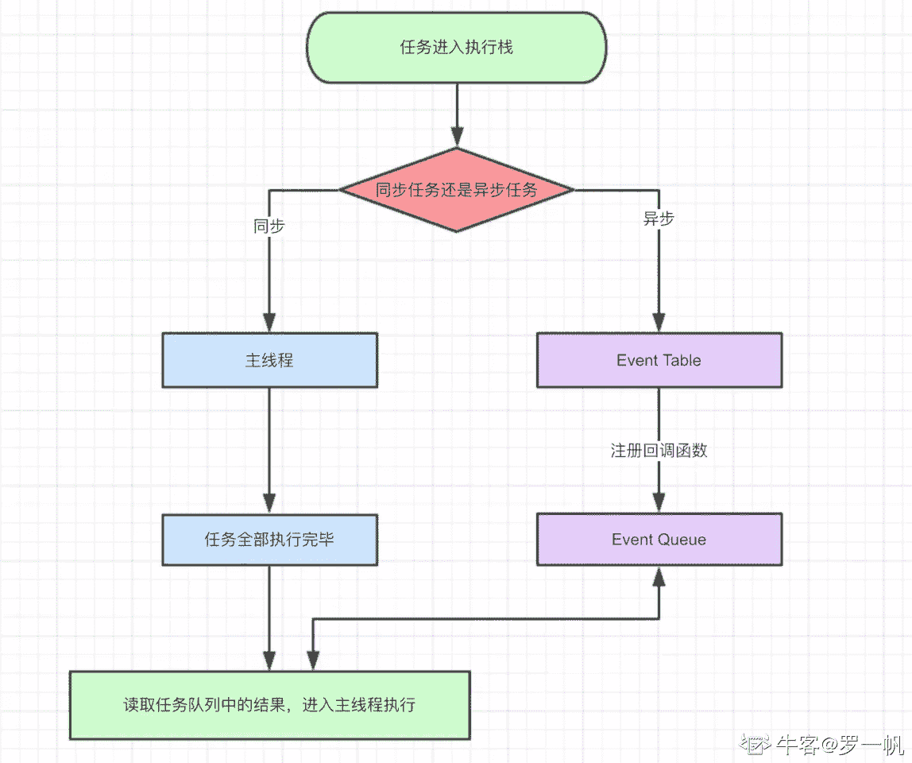

# 金山办公 2020 校招前端开发工程师笔试题（一）

## 1

[] == [] 输出的结果是？为什么？

你的答案

本题知识点

前端工程师 金山 WPS 2020

讨论

[hyyyH1](https://www.nowcoder.com/profile/891678862)

*   []==[]输出的结果为 false；
*   首先，‘==’运算符比较的是两个操作数是否相等，（这里不是指严格相等），两个操作数都是空数组，都是 Object 对象。但是对象的比较并非是值得比较，即使这两个都是空数组（包含同样的属性和数值都为空），但是这两个数组在引用上都不是同一个数组，所以他们也是不相等。

**这就涉及到不可变的原始值和可变的对象引用、以及‘==’运算符和‘===’运算符对于对象的比较规则的知识点。**

发表于 2020-02-16 21:18:44

* * *

[二叔是我的](https://www.nowcoder.com/profile/631218540)

数组的存储是堆空间，所以数组的标识存放的只是对应数据的地址值，所以数组之间都不完全相等，题目中的两个数组只是值相等，地址值不同，所以答案 false

发表于 2020-02-10 18:55:47

* * *

[qixiaomi](https://www.nowcoder.com/profile/460154190)

结果：false 原因：A==B 当 AB 均为对象时执行的是 A===B 比较，引用类型比较内存地址，因此为 false 

发表于 2020-05-05 17:36:27

* * *

## 2

请说出三种减少网页加载时间的方法。

你的答案

本题知识点

前端工程师 金山 WPS 2020

讨论

[前端今天有 offer 了么](https://www.nowcoder.com/profile/149673907)

服务器角度

*   采取 CDN 加速
*   开启 gzip 压缩
*   允许使用强缓存或协商缓存

*   增加服务器带宽

客户端角度

*   合理组织 CSS、JavaScript 代码位置
*   减少 DOM 操作、添加事件委托
*   部分操作可设置防抖和节流
*   对于可预见的操作采取 preload 或 prerender 的预加载
*   对于图片可以懒加载
*   合并 CSS 图片（精灵图/雪碧图）
*   减少使用 iframe

 资源优化打包角度

*   使用打包工具将 Js 文件、CSS 文件和静态文件进行恰当打包处理。 觉得有帮助，欢迎访问我的原文，你的点赞是我最大的支持 [`blog.csdn.net/qq_40781291/article/details/104685358`](https://blog.csdn.net/qq_40781291/article/details/104685358)

发表于 2020-03-09 10:49:44

* * *

[qixiaomi](https://www.nowcoder.com/profile/460154190)

1\. 减小加载文件的大小，去掉不必要首屏加载的部分，如分页，惰性加载图片， tree-shaking 等 2\. 服务端渲染 ssr3\. 减少 DNS 解析的时间

发表于 2020-05-05 17:39:56

* * *

[苏一恒(Mako)b 站内推找我](https://www.nowcoder.com/profile/1579420)

CDN 加速将小图标都做成精灵图的形式提升云服务器带宽图片懒加载

发表于 2020-03-01 22:22:46

* * *

## 3

请问什么情况下会遇到跨域问题？

你的答案

本题知识点

前端工程师 金山 WPS 2020

讨论

[苏一恒(Mako)b 站内推找我](https://www.nowcoder.com/profile/1579420)

跨域问题来自于浏览器的同源策略，即当协议、域名、端口号任意一个不同时，都会引发跨域问题。jsonp、CORS 可以用来解决跨域问题。

发表于 2020-03-01 22:45:34

* * *

[你要相信你可以的](https://www.nowcoder.com/profile/615743575)

当协议、端口、域名与当前的不同时就会出现跨域问题

发表于 2020-02-14 10:52:54

* * *

## 4

http 协议中与资源缓存相关的协议头有哪些？

你的答案

本题知识点

前端工程师 金山 WPS 2020

讨论

[仗键行天涯](https://www.nowcoder.com/profile/4743556)

通过响应来控制缓存，在响应头中主要有 cache-control、pragma、expires 三个响应头，其中 expires 是 HTTP1.0 中的响应头，后面直接跟一个缓存失效日期，但是服务器和客户端之间的时钟往往不同，因此通过该响应头来控制缓存失效时间不准确，一般不用，如果要设置客户端不缓存，则设置响应头“expires: -1”即可；pragema 是 HTTP1.1 协议为了兼容 HTTP1.0+协议，用来控制不缓存，“pragma: no-cache"；cache-control 是 HTTP1.1 中的响应头，其参数为相对的秒值，即过多少秒缓存失效，因此建议使用该响应头来控制缓存失效时间，其后可以跟的内容有 no-cache、no-store、max-age、must-revalidate
为了兼容各个协议版本，要想客户端不缓存资源，一般都添加三个响应头：cache-control: no-cache、pragma: no-cache、expires: -1
注意：cache-control: no-cache 控制缓存，客户端是会缓存资源的，只是在于原始服务器进行再验证之前不会想客户端提供资源，也就是资源新鲜度永远过期，这样比直接访问服务器节省了资源在网络中的传输成本，相比开启缓存增加了再验证的成本，性能失效介于两者之间；要想客户端缓存不从响应中拷贝资源副本，则应该使用 cache-control: no-store，使用该响应头内容也可以让缓存立即删除已经拷贝的副本；而 must-revalidate 是服务器希望缓存能严格遵守过期信息，一般情况下类似 no-cache，但在缓存与原始服务器进行新鲜度验证的时候，原始服务器不可用，这将会导致这一段时间中访问该资源会 504 gateway timeout，因此建议使用 no-cache

发表于 2020-02-20 17:13:08

* * *

[字节跳动 __ 番茄小说](https://www.nowcoder.com/profile/352804729)

expirecache-controlif-modified-since/last-modifiedetag/if-none-match

发表于 2020-02-14 22:05:28

* * *

[苏一恒(Mako)b 站内推找我](https://www.nowcoder.com/profile/1579420)

通用首部 Cache-Control: HTTP/1.1+控制缓存的协议头 pragma：HTTP/1.1 版本之前控制缓存的协议头实体首部 expires: 实体主题过期的时间

发表于 2020-03-01 23:18:30

* * *

## 5

CSS 中 box-sizing 有哪些值?区别是什么?

你的答案

本题知识点

前端工程师 金山 WPS 2020

讨论

[前端今天有 offer 了么](https://www.nowcoder.com/profile/149673907)

box-sizing 是 CSS3 新增属性，可调整盒子模型的样式。box-sizing：border-box 表示盒模型基于 IE 的盒模型，width 和 height 决定盒模型的 content 区、padding 区和 border 区。box-sizing：content-box 表示盒模型基于标准盒模型，width 和 height 只决定盒模型的 content 区 box-sizing：inherit 表示继承自父元素。[`blog.csdn.net/qq_40781291/article/details/104472826`](https://blog.csdn.net/qq_40781291/article/details/104472826)

发表于 2020-03-09 10:54:34

* * *

[hyyyH1](https://www.nowcoder.com/profile/891678862)

Box-sizing 用于定义用户该如何计算宽度和高度，属性值有两个：

1.  content-box，默认值，其中设置的 width 和 height 是只包含了内容的宽高（content）,但不包含内边距（padding）、边框（border）、外边距（margin），既设置的 width 是只包含内容的，如果设置了 padding 是在这个盒子外部，height 同理；
2.  border-box 其中设置的 width 和 height 是包含内容（content）、和 padding、border**但是不包含 margin,**既当设置了 width 和 padding 和 border 等值，内容实际上的宽度就是（width-padding 和 border 的宽度），height 同理

发表于 2020-02-16 22:29:37

* * *

[AngelSum](https://www.nowcoder.com/profile/309639941)

border-box：width height  决定 content、padding、margin
content-box: 表示盒模型是基于标准盒模型，width height 只决定模型的 content
inherit: 表示继承自父元素

发表于 2020-10-09 19:15:28

* * *

## 6

DOM Tree 与 Render Tree 之间的区别是什么?

你的答案

本题知识点

前端工程师 金山 WPS 2020

讨论

[牛客 439985643678](https://www.nowcoder.com/profile/7760474)

DOM 树是包含了所有 html 节点的树，渲染树是 DOM 树和 CSSOM 树组合而成的，最终渲染在页面上的树。DOM 树和渲染树都是浏览器生成的

发表于 2020-02-20 12:07:13

* * *

[叮咚❀](https://www.nowcoder.com/profile/657988653)

Dom Tree 包含了所有的 HTMl 标签，包括 display：none  ，JS 动态添加的元素等。Dom Tree 和样式结构体结合后构建呈现 Render Tree。Render Tree 能识别样式，每个 node 都有自己的 style，且不包含隐藏的节点（比如 display : none 的节点）。

发表于 2020-02-20 17:29:57

* * *

[牛客 806920363 号](https://www.nowcoder.com/profile/806920363)

呈现器是和 DOM 元素相对应的，但并非一一对应。非可视化的 DOM 元素不会插入呈现树中，例如“head”元素。如果元素的 display 属性值为“none”，那么也不会显示在呈现树中（但是 visibility 属性值为“hidden”的元素仍会显示）。

有一些 DOM 元素对应多个可视化对象。它们往往是具有复杂结构的元素，无法用单一的矩形来描述。例如，“select”元素有 3 个呈现器：一个用于显示区域，一个用于下拉列表框，还有一个用于按钮。如果由于宽度不够，文本无法在一行中显示而分为多行，那么新的行也会作为新的呈现器而添加。
另一个关于多呈现器的例子是格式无效的 HTML。根据 CSS 规范，inline 元素只能包含 block 元素或 inline 元素中的一种。如果出现了混合内容，则应创建匿名的 block 呈现器，以包裹 inline 元素。

有一些呈现对象对应于 DOM 节点，但在树中所在的位置与 DOM 节点不同。浮动定位和绝对定位的元素就是这样，它们处于正常的流程之外，放置在树中的其他地方，并映射到真正的框架，而放在原位的是占位框架。

发表于 2020-03-10 22:58:01

* * *

## 7

在 Javascript 中什么情况下会进行装箱/拆箱转换?

你的答案

本题知识点

前端工程师 金山 WPS 2020

讨论

[叮咚❀](https://www.nowcoder.com/profile/657988653)

装箱：把基本数据类型转换成对应的引用类型的操作。拆箱：把引用类型转换成基本数据类型的操作。在 Javascript 中出现 基本数据类型数据 和 引用数据类型数据要进行转换的情况下会进行装箱/拆箱操作。

发表于 2020-02-20 17:38:58

* * *

[usosweet](https://www.nowcoder.com/profile/404406554)

装箱: 将基本数据类型转换为引用的数据类型的操作.拆箱:将引用类型对象转换为对应的值类型对象,通过引用类型的 valueOf() 或 toString() 方法来实现.

发表于 2020-02-17 13:24:09

* * *

## 8

写出下列代码的执行结果：

```cpp
    new Promise((resolve) => {
console.log('1')
    resolve()
console.log('2')
     }).then(() => {
    console.log('3')
     })
     setTimeout(() => {
    console.log('4')
     })
     console.log('5')
```

你的答案

本题知识点

前端工程师 金山 WPS 2020

讨论

[罗一帆](https://www.nowcoder.com/profile/726031843)

js 在处理异步操作时利用的是事件循环机制。事件循环机制处理顺序，**同步操作<-异步操作(微任务<-宏任务)**

由于 javascript 是单线程任务所以主线程只能同时处理一个任务，所以把异步的事件放在同步的事件处理完成之后再来依次处理。



异步事件又包括微任务和宏任务：

宏任务和微任务关系：微任务执行完后再执行宏任务

**微任务操作**：1：Promise,2:MutationObserver

**宏任务操作**:1:setTimeout,2:setInterval,3:I/O 操作


所以上面代码执行顺序为:

同步：console.log(1)->console.log(2)->console.log(5);

异步：(微任务)console.log(3)->（宏任务）console.log(4);

所以答案为：1 2 5 3 4

发表于 2020-02-12 12:11:02

* * *

[前端车神](https://www.nowcoder.com/profile/808114190)

1\. 首先会执行从上往下执行，Promise 内部的代码也会同步执行，所以会打印 1、2、5，2\. 遇到的 Promise、setTimeout 会放到事件队列里面，其中 Promise 为微任务，setTimeout 为宏任务 3\. 而 script 也是宏任务，在执行一次宏任务，之后会把满足条件的微任务执行完，然后在执行宏任务，再把满足条件的微任务执行完，直到执行完所有的微任务、宏任务 4\. 因此接下来会执行 Promise 的 then 方法 打印  35\. 执行宏任务 setTimeout 打印 4

发表于 2020-02-24 01:39:29

* * *

[一咕叽 i](https://www.nowcoder.com/profile/498294663)

我来简单说说 promise，其实这个题不只是考察了 JS 单线程，还有 promise 的知识。接下来简单说一下 promise 首先，promise 一般有两个参数：resolve（做某事）、reject（拒绝做某事）。这两个参数都是函数，会在以后被调用，通过中文意思也能知道具体是作什么的。

```cpp
function x(resolve,reject){
    if
        resolve
    else
        reject
}
```

那么如何生成一个 promise？现在 y 就是一个 promise 对象，用来执行 x。当 x 走到自身逻辑判断时，假如执行了 resolve，就会调用 then；反之调用 catch

```cpp
let y=new Promise(x).then(()=>console.log("resolve")).catch(()=>console.log("reject"))

```

编辑于 2020-03-03 10:49:40

* * *

## 9

计算一个整数的二进制表示中连续出现 1 最多的次数。比如 13 的二进制是：1101，那么他的二进制表示中连续出现的 1 最多为 2 次，所以答案就是 2： 

本题知识点

前端工程师 金山 WPS 2020

讨论

[onlyouYY](https://www.nowcoder.com/profile/647539323)

```cpp
function calc(n){
    let arr=n.toString(2).split("0").sort(function(a,b){
        return b.length-a.length
    });
    console.log(arr[0].length)
    return arr[0].length;
}

```

为什么我这样写不对呀??（小白问号）

发表于 2020-05-10 01:33:50

* * *

[夏花爱秋叶](https://www.nowcoder.com/profile/4085682)

var num=parseInt(readline());// 通过 xx.toString(2)转换为二进制 num=num.toString(2);//因为想匹配到一个数组，所以使用 g 全局匹配 var reg=newRegExp(/1+/g);var arr=String(num).match(reg);var max=0;arr.forEach((item)=>{    if(item.length>max){        max=item.length    }})print(max);

发表于 2020-02-11 23:59:50

* * *

[何大帅 ii](https://www.nowcoder.com/profile/440732718)

```cpp
var num = parseInt(readline());
// 将数据转换成二进制
const str = num.toString(2);
// 用正则匹配二进制字符串中连续的 1 出现的情况
const arr = str.match(/1*/ig);

// 判断匹配中的结果
if(arr.length) {
    // 匹配中了多个连续的 1，获取长度最长的那个
    print(Math.max(... arr.map(item => item.length)));
} else {
  // 如果数组长度为 0，则是没有匹配中连续的 1，则查看是否有 1 出现
    print(str.indexOf("1") >= 0 ? 1 : 0);
}

```

编辑于 2020-04-27 15:57:31

* * *