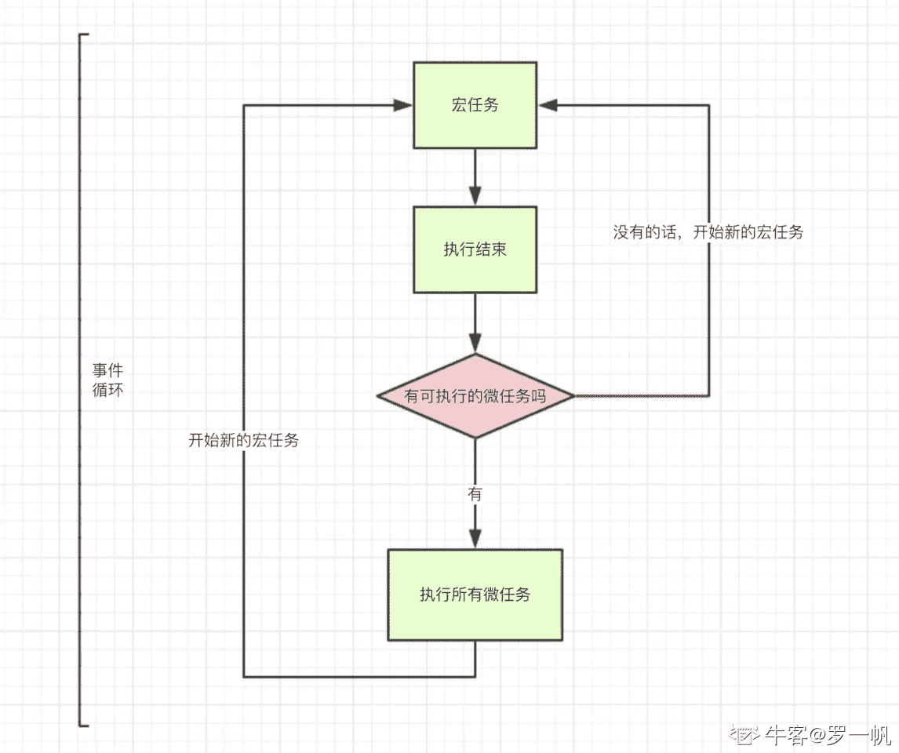

# 金山办公 2020 校招前端开发工程师笔试题（二）

## 1

写出下列代码的执行结果：

```cpp
    new Promise((resolve) => {
console.log('1')
    resolve()
console.log('2')
     }).then(() => {
    console.log('3')
     })
     setTimeout(() => {
    console.log('4')
     })
     console.log('5')
```

你的答案

本题知识点

前端工程师 金山 WPS 2020

讨论

[罗一帆](https://www.nowcoder.com/profile/726031843)

js 在处理异步操作时利用的是事件循环机制。事件循环机制处理顺序，**同步操作<-异步操作(微任务<-宏任务)**

由于 javascript 是单线程任务所以主线程只能同时处理一个任务，所以把异步的事件放在同步的事件处理完成之后再来依次处理。


异步事件又包括微任务和宏任务：

宏任务和微任务关系：微任务执行完后再执行宏任务

**微任务操作**：1：Promise,2:MutationObserver

**宏任务操作**:1:setTimeout,2:setInterval,3:I/O 操作



所以上面代码执行顺序为:

同步：console.log(1)->console.log(2)->console.log(5);

异步：(微任务)console.log(3)->（宏任务）console.log(4);

所以答案为：1 2 5 3 4

发表于 2020-02-12 12:11:02

* * *

[前端车神](https://www.nowcoder.com/profile/808114190)

1\. 首先会执行从上往下执行，Promise 内部的代码也会同步执行，所以会打印 1、2、5，2\. 遇到的 Promise、setTimeout 会放到事件队列里面，其中 Promise 为微任务，setTimeout 为宏任务 3\. 而 script 也是宏任务，在执行一次宏任务，之后会把满足条件的微任务执行完，然后在执行宏任务，再把满足条件的微任务执行完，直到执行完所有的微任务、宏任务 4\. 因此接下来会执行 Promise 的 then 方法 打印  35\. 执行宏任务 setTimeout 打印 4

发表于 2020-02-24 01:39:29

* * *

[一咕叽 i](https://www.nowcoder.com/profile/498294663)

我来简单说说 promise，其实这个题不只是考察了 JS 单线程，还有 promise 的知识。接下来简单说一下 promise 首先，promise 一般有两个参数：resolve（做某事）、reject（拒绝做某事）。这两个参数都是函数，会在以后被调用，通过中文意思也能知道具体是作什么的。

```cpp
function x(resolve,reject){
    if
        resolve
    else
        reject
}
```

那么如何生成一个 promise？现在 y 就是一个 promise 对象，用来执行 x。当 x 走到自身逻辑判断时，假如执行了 resolve，就会调用 then；反之调用 catch

```cpp
let y=new Promise(x).then(()=>console.log("resolve")).catch(()=>console.log("reject"))

```

编辑于 2020-03-03 10:49:40

* * *

## 2

请列举几个 HTML5 语义化标签，并说说语义化有什么优点？

你的答案

本题知识点

前端工程师 金山 WPS 2020

讨论

[大人冤枉吖](https://www.nowcoder.com/profile/735718340)

**语义化标签： **
<title>：页面主体内容。
<hn>：h1~h6，分级标题，<h1> 与 <title> 协调有利于搜索引擎优化。
<ul>：无序列表。
<li>：有序列表。
<header>：页眉通常包括网站标志、主导航、全站链接以及搜索框。
<nav>：标记导航，仅对文档中重要的链接群使用。
<main>：页面主要内容，一个页面只能使用一次。如果是 web 应用，则包围其主要功能。
<article>：定义外部的内容，其中的内容独立于文档的其余部分。
<section>：定义文档中的节（section、区段）。比如章节、页眉、页脚或文档中的其他部分。
<aside>：定义其所处内容之外的内容。如侧栏、文章的一组链接、广告、友情链接、相关产品列表等。
<footer>：页脚，只有当父级是 body 时，才是整个页面的页脚。
<small>：呈现小号字体效果，指定细则，输入免责声明、注解、署名、版权。
<strong>：和 em 标签一样，用于强调文本，但它强调的程度更强一些。
<em>：将其中的文本表示为强调的内容，表现为斜体。
<mark>：使用黄色突出显示部分文本。
<figure>：规定独立的流内容（图像、图表、照片、代码等等）（默认有 40px 左右 margin）。
<figcaption>：定义 figure 元素的标题，应该被置于 figure 元素的第一个或最后一个子元素的位置。
<cite>：表示所包含的文本对某个参考文献的引用，比如书籍或者杂志的标题。
<blockquoto>：定义块引用，块引用拥有它们自己的空间。
<q>：短的引述（跨浏览器问题，尽量避免使用）。
<time>：datetime 属性遵循特定格式，如果忽略此属性，文本内容必须是合法的日期或者时间格式。
<abbr>：简称或缩写。
<dfn>：定义术语元素，与定义必须紧挨着，可以在描述列表 dl 元素中使用。
<address>：作者、相关人士或组织的联系信息（电子邮件地址、指向联系信息页的链接）。
<del>：移除的内容。
<ins>：添加的内容。
<code>：标记代码。
<meter>：定义已知范围或分数值内的标量测量。（Internet Explorer 不支持 meter 标签）
<progress>：定义运行中的进度（进程）。

**优点：**

1.  代码结构清晰，方便阅读，有利于团队合作开发。
2.  方便其他设备解析（如屏幕阅读器、盲人阅读器、移动设备）以语义的方式来渲染网页。
3.  有利于搜索引擎优化（SEO）。

**来源：**[`blog.csdn.net/eeeecw/article/details/80591511`](https://blog.csdn.net/eeeecw/article/details/80591511)

发表于 2020-02-15 16:46:22

* * *

[一咕叽 i](https://www.nowcoder.com/profile/498294663)

header 头部信息 section 可用作主体的包裹 footer 页脚信息 dialog 会话框优点：语义化的标签相比较之前全都是 div 要清晰明了，并且有助于搜索引擎的排序

发表于 2020-03-03 10:06:03

* * *

[梅梅 201908241946506](https://www.nowcoder.com/profile/488239246)

**<header>顶部标签</header>
<nav>导航栏标签</nav>
<section>中心标签</section>
<article>文章标签</article>
<footer>底部标签</footer>**

发表于 2020-02-11 14:41:02

* * *

## 3

请列举几种除了 px 外的 CSS 度量单位并解释其含义。

你的答案

本题知识点

前端工程师 金山 WPS 2020

讨论

[一咕叽 i](https://www.nowcoder.com/profile/498294663)

1\. rem 相对于根字体大小的单位，比如可以设置 1rem=50px
2\. em 相对于 font-size，比如 font-size：16px（浏览器默认），则 2em=32px
3\. vm 即 viewpoint width，视窗宽度，比如 1vm 的宽度为相对于视窗的宽度的百分之一
4\. vh 即 viewpoint height ，同上

编辑于 2020-03-03 11:11:45

* * *

[大人冤枉吖](https://www.nowcoder.com/profile/735718340)

em：以父元素为基础。 rem：相对于根字体大小的单位，可以根据设计稿用 js 动态设置大小。vw,vh：视口单位，针对当前页面的可视范围进行 100 等分的划分。

发表于 2020-02-15 16:47:42

* * *

[牛客 739272693 号](https://www.nowcoder.com/profile/739272693)

em, 以父元素为基准 rem：以根目录元素为基准 vw,宽度 100%就是 100vwwh，高度 100%就是 100vh

发表于 2020-02-13 21:58:31

* * *

## 4

 new 操作符做了什么？

你的答案

本题知识点

前端工程师 金山 WPS 2020

讨论

[大人冤枉吖](https://www.nowcoder.com/profile/735718340)

```cpp
function create(){
    // 1. 创建空对象
    let obj = new Object();
    // 2. 链接原型
    let con = [].shift.call(arguments) 
    obj.__proto__ = con.prototype
    // 3. 绑定 this
    let res = con.apply(obj,arguments)
    // 4. 返回新对象
    return typeof res === 'object'?res:obj;
}
```

发表于 2020-02-15 16:55:31

* * *

[一咕叽 i](https://www.nowcoder.com/profile/498294663)

```cpp
function Fun(){
    this.x=1
}
let x=new Fun()

```

1\. new 首先会生成一个空的对象 2\. 然后构造函数里面的 this 会指向这个空对象 3\. 构造函数内的 this.x=1 就相当于将 1 赋值给了这个空对象 4\. 其实还默认做了一个事  即 return this5\. 所以最后 x 得到了 return 回来的 this。6\. 所以 x 有了 构造函数的属性

发表于 2020-03-03 10:12:09

* * *

[牛客 739272693 号](https://www.nowcoder.com/profile/739272693)

var func = function(){}var newO = new func()new 一共经历了四个阶段 1.创建了空对象 var newO = new Object()2.设置圆形脸 newO,__proto__ = func.prototype3.将 func 中的 this 指向 newOvar result = func.call(newO)

4、判断 Func 的返回值类型：

  如果是值类型，返回 obj。如果是引用类型，就返回这个引用类型的对象

发表于 2020-02-13 22:05:08

* * *

## 5

简述 cookie/session 记住登录状态机制原理。

你的答案

本题知识点

前端工程师 金山 WPS 2020

讨论

[HINIOA](https://www.nowcoder.com/profile/109032887)

用户登录验证成功后，如果是使用 Cookie 记住登录状态，则服务器会将用户名等信息放在响应头的 Set-Cookie 属性中返回给服务器，之后的 HTTP 请求都会携带这个 Cookie ，实现记住登录。如果是 session 的话，则服务器会将用户名等信息存放在本地，再随机生成一个登录标识通过 Cookie 返回给浏览器，之后浏览器每次发送请求也会携带这个 Cookie，服务器收到后便通过这个标识得到已登录的用户信息。

发表于 2020-03-19 20:46:36

* * *

[someone123456](https://www.nowcoder.com/profile/599921103)

session 是服务端的状态保存机制
cookie 是客户端的状态保存机制
当第一次访问服务器的时候 服务器会开辟一块空间用来存放用户的信息
每一个登录之后的用户信息 都会以 key value 格式记录在 session 中
同时服务器会把 sessionId（用户信息） 存在 cookie 中 返回给访问的客户端
客户端就会把 sessionID 保存在本地的 cookie 中对应的网站记录下
下次访问的时候会携带这个 sessionId
服务器会验证这个 cookie 的有效性 来判断用户是否登录

发表于 2020-03-20 12:55:15

* * *

[一咕叽 i](https://www.nowcoder.com/profile/498294663)

cookie 是缓存在浏览器中的，在第一次 http 请求时就夹带在里面，然后只要 cookie 不过期，就会一直保留 session 是缓存在内存中，即将登录信息存放在电脑的内存中。

发表于 2020-03-03 10:15:03

* * *

## 6

网页中接收事件的顺序（事件流）有哪些？它们之间的区别是什么？

你的答案

本题知识点

前端工程师 金山 WPS 2020

讨论

[HINIOA](https://www.nowcoder.com/profile/109032887)

事件流有三个阶段：1\. 事件捕获阶段：从 window 逐层向下传递到 目标元素，过程中遇到注册的捕获事件就会触发它 2\. 处于目标阶段：事件到达目标元素，触发目标元素上注册的事件 3\. 事件冒泡阶段：从目标元素向上传递到 window，过程中遇到注册的冒泡事件就会触发它

发表于 2020-03-19 20:50:25

* * *

[一咕叽 i](https://www.nowcoder.com/profile/498294663)

首先说一下什么是事件流，个人理解为假设在牛客网做题，当我点击了提交按钮，浏览器是如何知道我点击了什么东西呢？这个时候就需要使用到事件流

最开始有两种，一个是冒泡，一个是事件捕获。

先说说冒泡：和冒泡排序一样（虽然这是个**算法），都是从最底层开始，即那个点击按钮的标签

假设这是个 DOM,那么冒泡流就是从 p 开始，到 div，然后 body、html、document

```cpp
html
  head
    body
      div
        p 提交
```

再来说说事件捕获流：不用说太多，因为这刚好和上面是冒泡流相反，即从最外层的标签开始，最后才到达 p 标签。

最后来说说现在标准，DOM2 级事件流，即首先进行事件捕获流，然后到达事件所在的标签后，进行处理，然后在开始进行事件冒泡流，类似于 koa2 中的洋葱模型

编辑于 2020-03-03 11:42:11

* * *

[颜禹](https://www.nowcoder.com/profile/463780586)

有捕获和冒泡两种，冒泡是事件由子元素传递到父元素的过程，捕获是时间由父元素传递到子元素的过程

发表于 2020-02-13 13:04:12

* * *

## 7

 css 属性 position 都有哪些值？

你的答案

本题知识点

前端工程师 金山 WPS 2020

讨论

[Jason777](https://www.nowcoder.com/profile/515983277)

absolute 绝对定位 relative 相对定位 fixed 固定定位 sticky 粘性定位 static 默认值，没有定位 inherit 继承父系 initial 设置该属性为默认值

发表于 2020-02-14 18:48:14

* * *

[Elylicery](https://www.nowcoder.com/profile/351512626)

摘自《CSS》权威指南 position 的值的含义如下：

*   **static：默认值**

    *   元素框正常生成。

    *   块级元素生成一个矩形框，作为文档流的一部分，行内元素则会创建一个或多个行框，置于其父元素中

*   **relative：相对定位**

    *   元素框偏移某个距离，元素仍保持其未定位前的形状，它原本所占的空间仍保留

*   **absolute：绝对定位**

    *   元素框从文档流完全删除，并相对于其包含块定位，包含块可能是文档中的另一个元素或者是初始包含块。

    *   元素原先在正常文档流中所占的空间会关闭，就好像该元素原来不存在一样。

    *   元素定位后生成一个块级框，而不论原来它在正常文档流中生成何种类型的框。

*   **fixed：固定定位**

    *   元素框的表现类似于将 position 设置为 abosolute，不过其包含块是视窗本身。

 编辑于 2020-11-04 15:57:12

* * *

[牛客 462891256 号](https://www.nowcoder.com/profile/462891256)

相对定位不脱离文本流

发表于 2020-02-17 15:17:51

* * *

## 8

简述你对 HTTP 控制访问（CORS）的理解。

你的答案

本题知识点

前端工程师 金山 WPS 2020

讨论

[一咕叽 i](https://www.nowcoder.com/profile/498294663)

首先要搞明白什么是同源，什么是跨域。

打一个简单的比方，你自己从你家里拿东西，不会有人说，这是同源；但是你要从隔壁的邻居的冰箱去拿可乐，你觉得可能吗，这就是跨域。

从比方中回来，事实其实没有那么简单。理解了概念后，得知道如何去判断同源还是跨域。web 服务器有三要素：协议（http、https）、端口号（不过多说）、web 服务器域名（比如[`github.com/mamba666`](https://github.com/mamba666)
中[`github.com 就是域名）。三要素必须全部一致才算同源`](https://github.com%E5%B0%B1%E6%98%AF%E5%9F%9F%E5%90%8D%EF%BC%89%E3%80%82%E4%B8%89%E8%A6%81%E7%B4%A0%E5%BF%85%E9%A1%BB%E5%85%A8%E9%83%A8%E4%B8%80%E8%87%B4%E6%89%8D%E7%AE%97%E5%90%8C%E6%BA%90)

个人认为写完上面的东东后已经理解了同源跨域已经如何区分。接下来就来看看真正的干货，不讲同源，只讲跨域（以下参考 MDN）

浏览器端

如果发现有一个请求是跨域，那么浏览器会自动先拦截一下，给它的 http header 加上 Origin 字段。比如 [`localhost:8080 变为 Origin:http://localhost:8080。这样一来，服务器端就可以区分这个请求是不是跨域了。`](http://localhost:8080%E5%8F%98%E4%B8%BAOrigin:http://localhost:8080%E3%80%82%E8%BF%99%E6%A0%B7%E4%B8%80%E6%9D%A5%EF%BC%8C%E6%9C%8D%E5%8A%A1%E5%99%A8%E7%AB%AF%E5%B0%B1%E5%8F%AF%E4%BB%A5%E5%8C%BA%E5%88%86%E8%BF%99%E4%B8%AA%E8%AF%B7%E6%B1%82%E6%98%AF%E4%B8%8D%E6%98%AF%E8%B7%A8%E5%9F%9F%E4%BA%86%E3%80%82)

服务器端

当服务器端收到浏览器端发送过来的请求后，会有一个响应 header。它会告诉请求的浏览器哪儿些域名可以请求我，哪儿些方法可以执行。

响应回到浏览器端

此时浏览器会根据这个响应自动判断，然后在做决定。

服务器端返回给浏览器端的东西

*   Access-Control-Allow-Origin 允许跨域的 Origin 列表
*   Access-Control-Allow-Methods 允许跨域的方法列表（GET、POST 等）
*   Access-Control-Allow-Headers 允许跨域的 Header 列表
*   Access-Control-Expose-Headers 允许暴露给 JavaScript 代码的 Header 列表
*   Access-Control-Max-Age 最大的浏览器缓存时间，单位为 s

跨域请求形式

有两种，简单和非简单请求。这里说说我常遇到的 application/json 。这就是一种非简单请求，在以上所写的浏览器端之前，会先进行一次预请求，根据这个结果再去判断是否正式请求。

> 其实写了这么多，最重要的就是对 CORS 的理解，已经这个流程是怎么样的。

编辑于 2020-03-03 12:42:43

* * *

[叮咚❀](https://www.nowcoder.com/profile/657988653)

跨域资源共享(CORS) 是一种机制，它使用额外的 HTTP 头来告诉浏览器  让运行在一个 origin (domain) 上的 Web 应用被准许访问来自不同源服务器上的指定的资源。当一个资源从与该资源本身所在的服务器不同的域、协议或端口请求一个资源时，资源会发起一个跨域 HTTP 请求。而 CORS 允许浏览器向跨源服务器，发出跨域请求，从而克服了 AJAX 只能同源使用的限制。CORS 是一个 W3C 标准，它同时需要浏览器和服务端的支持，浏览器基本都支持，因此，想要实现 CORS 通信，只要服务器实现了 CORS 接口即可  

发表于 2020-02-20 20:09:11

* * *

[Elylicery](https://www.nowcoder.com/profile/351512626)


发表于 2020-11-04 16:09:29

* * *