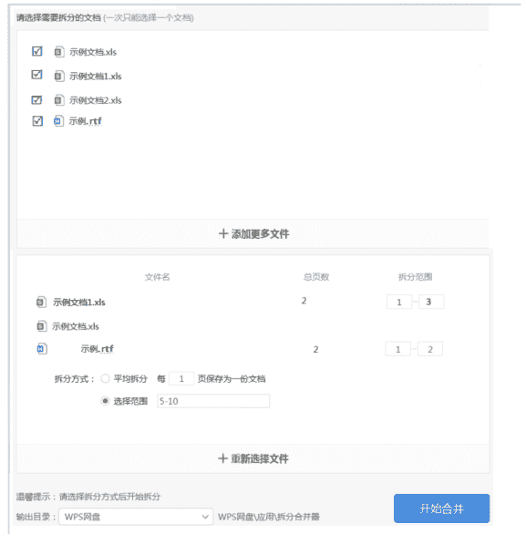
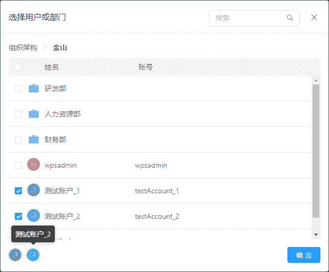
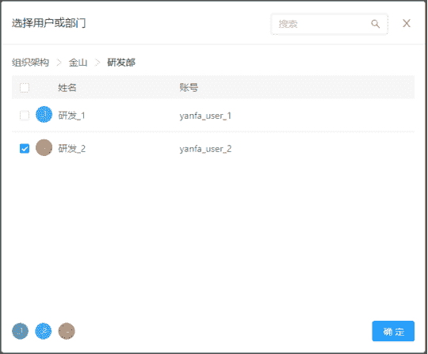

# 金山办公 2020 校招测试工程师笔试题（一）

## 1

有甲乙丙三个学生，每个人脑门上贴了一张纸条，每个人的纸条上都写了一个正整数，且某两个数的和等于第三个！（每个人可以看见另两个数，但看不见自己的）教授问甲：你能猜出自己的数吗？回答：不能；问乙，不能，问丙，不能，再问甲，不能，问乙，不能，问丙：我猜出来了，是 144！教授很满意的笑了。请问您能猜出另外两个人的数吗？

你的答案

本题知识点

测试工程师 金山 WPS 2020

讨论

[牛客 135806560 号](https://www.nowcoder.com/profile/135806560)

首先：将三个人的数分别定为 baix,y,z，且问话顺序按 x,y,z
那么如果 x 可以判断自己的数，显然 y=z，且 x=2y=2z，因为 x 可能的数为 y+z 或 y-z
在 y=z 的情况下，x=0 与题目要求正整数不符，所以 x 只可能是 y+z
所以如果 x 无法判断，那么 y<>z
如果接下来 y 能判断，那么 z=x
另外 x=2z，同理，y 可能为 x+z 或 x-z
在 x=2z 的情况下，y=x-z=z 与之前 x 不可判断的推论不符，所以 y 只能是 x+z
所以如果 y 无法判断，那么 z<>x，x<>2z
如果接下来 z 能判断，那么 y=x 或 y=2x 或 x=2y，这个推理与之前同
另外 y=3/2x，这个可以用之前的 x<>2z 推出
所以如果 z 也无法判断，那么 x<>y,y<>2x,y<>3/2x, x<>2y
再回到 x，如果他又可以判断
那么 z=2y, z=3/2y, z=5/3y, z=3y, y=2z, y=3z
反之 z<>2y, z<>3/2y, z<>5/3y, z<>3y, y<>2z, y<>3z
再回到 y，如果他可以判断
那么 z=2x, z=3x, z=5/2x, z=3/2x, x=3z, x=5/3z, x=8/5z，x=4/3z, x=4z，
反之则 x<>3z, x<>5/3z, x<>8/5z，x<>4z，z<>3x，z<>5/2x, z<>3/2x
再回到 z，如果可以判断
那么 x=3y, x=5/2y, x=8/3y, x=4y, x=3/2y, x=4/3y, y=3x, y=4x, y=7/2x, y=5/2x, y=4/3x, y=8/5x, y=13/5x, y=7/4x, y=5/4x
其中 z=x+y
最后因为 z=144, 所以只有 x=3y 或 y=3x, 所以另两个数为 36 和 108

发表于 2021-01-07 15:52:51

* * *

[刘佳楠 liu](https://www.nowcoder.com/profile/277909699)

转载知乎：[`www.zhihu.com/question/23999095`](https://www.zhihu.com/question/23999095)

发表于 2020-02-17 11:36:03

* * *

## 2

100 个人回答五道试题，有 81 人答对第一题，91 人答对第二题，85 人答对第三题，79 人答对第四题，74 人答对第五题，答对三道题或三道题以上的人算及格， 那么，在这 100 人中，至少有（ ）人及格。

你的答案

本题知识点

测试工程师 金山 WPS 2020

讨论

[n 小玩](https://www.nowcoder.com/profile/832056064)

可以反向考虑，计算答错 3 道或 3 道以上的最多人数打错题目：人数 1：192：93：154：215：26 其中存在打错多个题目的人，假设答错 2 的人数 5 个题目全部答错，则有 1：103：64：125：17 同理，假设剩余答错 3 的人数 4 个题目全部打错，则有 1：44：65：11 同理：假设剩余答错 1 的人数 3 个题目全部打错，则有 4：25：7 如上，至少答错 3 个题目的人数最多 9 + 6 + 4 = 19 所以及格人数应该至少有 81 人也不知道对不对 0.0

编辑于 2020-03-29 22:18:31

* * *

[刘伟鹏](https://www.nowcoder.com/profile/881630647)

总共有 81+91+85+79+74=410 题答对；答错 3 道题（答对题数小于 3）的人最多有 90/3=30 人，答案 70

发表于 2020-02-13 20:07:55

* * *

[1122543](https://www.nowcoder.com/profile/704503540)

答案为 最少有 81 人及格

从最多答错人数入手，故而不及格的人为答错五道题和答错四道题的人。

错题分别为

19 9 15 21 26

思路：假设 x 人答错五道题（0<=x<=9），剩下错题数为

19-x 9-x 15-x 21-x 26-x

（错题数最少的两道题之间不互相消耗就可以得到错四道题的最大人数，所以这里不同时选择 2 3 题）那么排除错题数最少的第二题，剩下四道题都错的人最多 15-x 人，此时不及格的人有 x+15-x=15 人，剩下错题数为

4 9-x 6 11

那么答错四道人数最多为 4 人

故此，不及格的人最多有 19 人

及格人数最少为 81 人

发表于 2020-08-12 11:14:46

* * *

## 3

以下是金山拆分文档页面，可以添加 xls,xlsx,doc,docx4 种格式文件，且一次最多允许添加 3 个文件，一次只能转换 1 个，请尽可能多的找出图中的错误。

你的答案

本题知识点

测试工程师 金山 WPS 2020

讨论

[涡](https://www.nowcoder.com/profile/538039840)

1.图一添加了错误格式的文件： 示例.rtf2.一次最多添加 3 个文件，图一添加了四个·文件 3.图二出现错误格式文件： 示例.rtf4.图二中示例文档 1.xls 显示只有两页，对应的拆分范围却是 1-35.图一的示例.rtf 名称前无空格，图二的示例.rtf 名称前却有若干空格 6.一次只能转换一个，图二显示三个文件转换 7.图二右下角按钮文字显示错误【开始合并】

发表于 2020-09-28 16:50:44

* * *

[dfr](https://www.nowcoder.com/profile/817162412)

1、示例文档 1.xls 的拆分范围超过了总页数 22、一次只能转换一个，图中准备转换两个 3、一次最多可添加 3 个文件，但图中添加了 4 个 4、添加文件中的第四个"示例.rtf"不是题目描述的四种格式之一

发表于 2020-08-14 11:13:29

* * *

[牛客 670389096 号](https://www.nowcoder.com/profile/670389096)

图二：

1.  总页数这列没对齐。
2.  拆分方式部分应勾选平均拆分。

发表于 2021-05-20 14:58:00

* * *

## 4

下图为某网站的组织架构搜索面板，面板中的数据来源为数据库中组织架构表(dept_user)。请依据图中所展示的功能组件、页面元素、交互逻辑等信息，设计测试用例(包括但不限于功能测试用例)。


你的答案

本题知识点

测试工程师 金山 WPS 2020

讨论

[刘伟鹏](https://www.nowcoder.com/profile/881630647)

1.搜索框：    搜索框内输入搜索条件，是否正常搜索：
            测点：（1）搜索条件输入部门或用户名时；                          （2）搜索条件输入其他；2.搜索列表：    测点：搜索列表中的部门类是否可以点击进入下一层，部门下用户列表的数据是否正确；                部门和用户是否都可以选中，选中部门是否是选中改部门所有人；

发表于 2020-02-13 20:14:54

* * *

[一切都会变好的！](https://www.nowcoder.com/profile/707011131)

这个需不需要引入数据库和面板的交互测试呢，比如数据库中组织架构表(dept_user)增删改时，搜索面板中的成员是否会相应地正确显示

发表于 2020-09-28 15:57:22

* * *

## 5

某网盘有文件夹链接分享功能，主要流程和界面如下，请尽可能多地列出该功能所需要覆盖的测试点，并为其设计简单用例。

1) 分享前，进入文件夹分享页面：

2) 设置并生成分享链接后：


3) 将链接通过 IM 发给好友，好友打开的界面：

4)成功打开后:

你的答案

本题知识点

测试工程师 金山 WPS 2020

讨论

[钟无艳 yen](https://www.nowcoder.com/profile/616739762)

分享：

1.  支持选择文件夹、文件、压缩包、图片，进入分享页面
2.  进入分享页面后，选择取消
3.  进入分享页面后，选择链接分享，无提取码，点击【创建链接】，成功生成（注意：必须由英文大小写、数字组成）
4.  进入分享页面后，选择链接分享，有提取码，选择时间范围（1 天、7 天、永久），点击【创建链接】，成功生成 
5.  进入分享页面后，选择好友分享，选择用户列表中的好友，发送资源
6.  进入分享页面后，选择好友分享，搜索非用户列表中的好友，发送资源
7.  直接点击按钮复制链接和提取码
8.  手动复制链接、复制提取码（鼠标操作、键盘快捷键操作）

查看：

1.  在有效时间范围内，输入错误链接，提示错误
2.  在有效时间范围内，输入正确链接，输入错误提取码、验证码，提示错误（注意：注意验证码是否可更换、是否有次数限制）
3.  在有效时间范围内，输入正确链接，输入正确提取码、验证码，成功跳转资源页面
4.  在无效时间范围内（1 天后、7 天后），输入正确链接，输入正确提取码，提示提取码已过期

发表于 2020-06-23 14:49:21

* * *

[白白白 11](https://www.nowcoder.com/profile/86786924)

1.      点击取消按钮，关闭界面

2.      选中有提取码，有效期选中永久有效，点击创建链接

3.      选中有提取码，有效期选中 7 天有效，点击创建链接

4.      选中有提取码，有效期选中 1 天有效，点击创建链接

5.      不选中有提取码，点击创建链接

6.      成功创建分享链接后，链接组成是否正常

7.      点击复制链接及提取码按钮

8.      手动复制链接和提取码，成功复制

9.      好友不在有效期内点击链接，显示已过期

10.   好友在有效期内点击链接，输入正确的提取码与验证码，点击提取文件，成功打开文件界面

11.   好友在有效期内点击链接，输入错误的提取码与验证码，点击提取文件，无法打开文件界面

发表于 2020-11-19 15:01:38

* * *

## 6

下图为手机版 WPS 个人中心-个人资料的界面。依正常流程，点击图 1 的【退出登录】按钮可安全退出账号登录，并弹出退出成功提示（图 2）。但目前出现的情况是点击【退出登录】后，没有弹出任何提示，并回到个人中心页面（图 3）。

1、请根据图示及描述，分析出现此问题的可能原因；

2、根据你的理解，画出【退出登录】的逻辑流程。                                    （图 1）                                                                    （图二）                            （图三）

你的答案

本题知识点

测试工程师 金山 WPS 2020

## 7

写一个函数检查随机产生的列表(整型)元素是否从小到大排序，返回 Boolean 类型。

你的答案

本题知识点

测试工程师 金山 WPS 2020

讨论

[刘伟鹏](https://www.nowcoder.com/profile/881630647)

bool method(int* temp,int n){
    for(int i=0; i<n-1; i++){
        if(temp[i]>temp[i+1])
            return false;
    }
    return true;
}

发表于 2020-02-13 23:20:57

* * *

[牛客 740004222 号](https://www.nowcoder.com/profile/740004222)

```cpp
import random
def fun():
	b=[]
	flag = True
	if flag:
		# 产生长度为 5 的 0~100 随机数的列表
		for i in range(5):
			a= random.randint(0,100)
			b.append(a)
		# 假设一个从小到大排序的列表
		# b = [10,20,30,40,50]
		print(b)
		for j in range(len(b)-1):

			if b[j]<=b[j+1]:

				flag=True
			else:
				flag= False
				break

	return flag

if __name__ == '__main__':

	print(fun())
```

发表于 2020-10-10 12:59:42

* * *