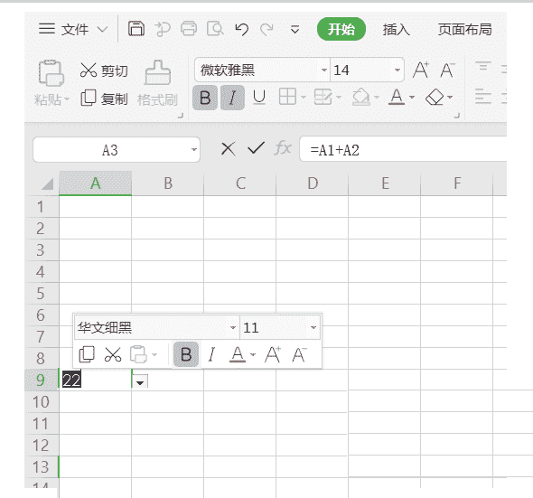
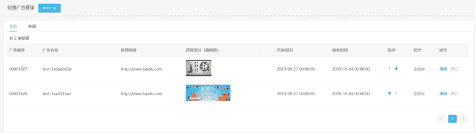
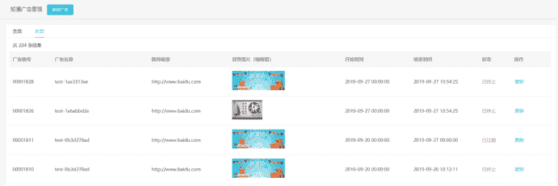
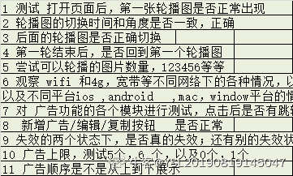
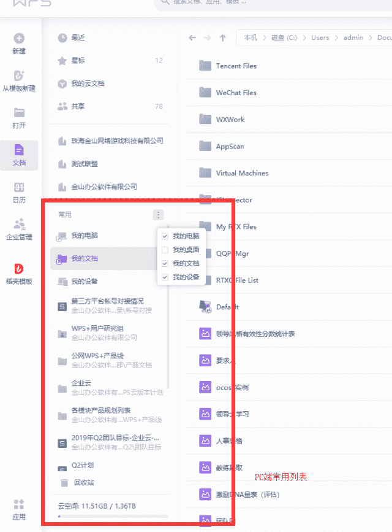
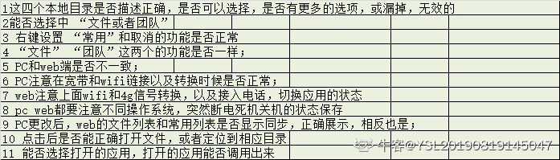
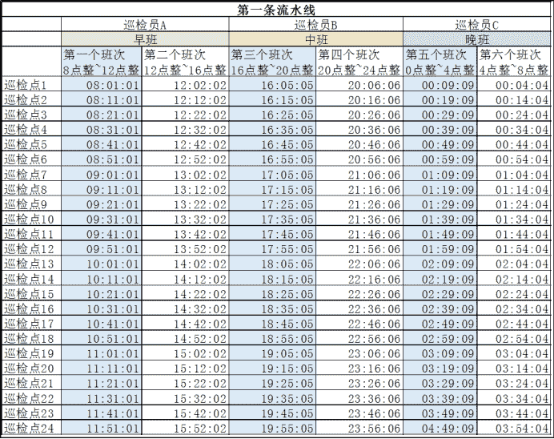

# 金山办公 2020 校招测试工程师笔试题（二）

## 1

【逻辑思维题】1，11，21，1211，111221，下一个数是什么？ 

你的答案

本题知识点

测试工程师 金山 WPS 2020

讨论

[王建云](https://www.nowcoder.com/profile/702108077)

后项是对前项项数的描述。 比如：第一项是 1，第二项是 11，意思就是 1 个 1。第三项是 21，代表前一项是 2 个 1。第四项是 1211，即为前一项是 1 个 2、1 个 1。第五项是 111221，就是说前一项是 1 个 1、1 个 2、2 个 1……

发表于 2020-02-13 08:39:53

* * *

[杀马特马](https://www.nowcoder.com/profile/652348949)

111221

发表于 2021-09-19 21:00:19

* * *

[Sev7enage](https://www.nowcoder.com/profile/844176829)

1211：第三项 21 的逆序(12)与第二项 11 的组合 111221：拆为 11 12 21 三部分  1211 拆为 12 11 两部分 111221：第四项 1211 的逆序(11 12)与第三项 21 的组合则第六项为：第五项的逆序(21 12 11)与第四项 1211 的组合结果为：2112111211

发表于 2021-01-16 11:38:00

* * *

## 2

【逻辑思维题】2+7-2+7 全部有火柴根组成,移动其中任何一根,答案要求为 30。

你的答案

本题知识点

测试工程师 金山 WPS 2020

讨论

[Juchiahau](https://www.nowcoder.com/profile/993325800)

一般理解下这是原文的题干，不过如果是这样理解那就不了这道题，所以只能抽象地理解火柴棍和其摆出的数字。如下：

发表于 2020-02-13 14:56:33

* * *

[王建云](https://www.nowcoder.com/profile/702108077)

把第二个“+”的“-”移到第一个“+”的左上方变成“4”,变为 247-217=30

发表于 2020-02-13 08:41:44

* * *

[牛客 104067593 号](https://www.nowcoder.com/profile/104067593)

rnm 两道题都是脑筋急转弯，逻辑个屁。 第一道我以为是 考逻辑数列，各种三进制，平方等等等等都算了。结果是数数。第二题认真的在想移动火柴，结果答案是 247-214，这么离谱的移动方式。要是能这么移动，那么其他所有火柴题目都不用做了，举个例子，别人让出个火柴题目，2+3 = 9+0  移动一根火柴，让等式成立。我直接他妈移动加号上面的，让等于变成不等于。

发表于 2022-02-28 15:09:25

* * *

## 3

如下，第 9 行第 1 列的单元格中内容为 22，请尽可能多的找出图中错误。

你的答案

本题知识点

测试工程师 金山 WPS 2020

讨论

[hcuwbksbqjvgebaushqje](https://www.nowcoder.com/profile/726220119)

1、字体样式：上面是微软雅黑，下面显示华文细黑 2、字体大小：上面显示 14 下面显示 113、字体颜色：应该显示为红色，实际是白色，背景颜色应该是黑色，上面的图标显示为白色 4、字体斜体：上面显示斜体，下面不显示斜体 5、A9 被选中，所以复制下面那个格应该显示为 A9 而不是 A36、计算：A1，A2 为空，所以 A9 不等于 A1+A2 吧？7、绿色光标同时在第 9 行和第 13 行？

发表于 2020-03-06 17:25:55

* * *

[YXW](https://www.nowcoder.com/profile/6971289)

上面是微软雅黑 字体大小是 14 而 22 旁边的显示不对应

发表于 2020-03-01 10:38:21

* * *

[快乐阿拉蕾](https://www.nowcoder.com/profile/745586725)

这是道视力题？？？

发表于 2021-01-27 16:20:04

* * *

## 4

WPS 后台支持针对 WPS+官网进行广告播放设置。进入后台轮播广告管理页面，生效中的广告显示在（图 1），失效的广告显示在（图 2）；失效状态分为两种：已终止和已过期；点击新增广告/编辑/复制按钮，均可以对广告进行编辑操作（图 3）；提交后的广告会按后台列表从上至下顺序显示在 WPS+官网指定位置（红色圈出区域），显示广告上限是 5 条（图 4）。请针对轮播广告功能设计测试用例。                                                                    （图 1）                                                                    （图 2）
                                                                       （图 3）
                                                                           （图 4）

你的答案

本题知识点

测试工程师 金山 WPS 2020

讨论

[hcuwbksbqjvgebaushqje](https://www.nowcoder.com/profile/726220119)

首先确保发布广告流程能够顺利走通，再进行以下的详细测试一、发布/编辑/复制广告点击创建新增/编辑/复制广告按钮，跳转到广告编辑页面 1、广告名称：为空、空格、数字、英文、中文、特殊字符 2、生效时间：设置生效时间为 x，则 x 之前，x 之后无法看到该广告，x 期间可以看到该广告 3、跳转链接：设置为内部链接、外部链接、非链接 4、图片：    最多上传 1 张图片：不上传，上传 1 张，上传多张    图片格式：JPG/png，非 JPG 和 png 图片    尺寸：2240*232px，非 2240*232px，超长尺寸，超短尺寸如何处理    大小：=300k，<300k,>300k 点击发布按钮，显示在生效中页面。二、生效界面 1、生效的广告会在此界面显示 2、编辑、终止按钮点击之后可以执行相应的操作 3、当生效页面的广告条数超过一定数量（这个数量待确认）进行分页 4、最前边显示共有 x 条结果，这个数据需要和实际存在的广告数相等三、失效界面 1、后台点击生效页面，点击某一广告的终止按钮，则前端无法查看到该广告，后台失效页面中增加该数据，显示为‘已终止’2、设置时间非当前时间，则前端无法查看到该广告，后台失效页面中增加该数据，显示为‘已过期’3、当失效页面的广告条数超过一定数量（这个数量待确认）进行分页 4、最前边显示共有 x 条结果，这个数据需要和实际存在的广告数相等 5、复制按钮点击之后可以执行正常的跳转 四、广告顺序/数量 1、按后台列表从上至下顺序显示，原本前端顺序显示为 1,2,3,4,5，调整 1 和 2 的顺序（点击排序按钮），顺序为 2,1,3,4,52、广告的数量：=0 时，不显示该区域？ =1 时，显示 1 条广告，无***播 =2 时，可以轮播查看 2 条广告，图片下显示 2 个点（待确定：轮播到最后一张后是停止轮播还是重新重头轮播） =5 时，可以轮播查看 5 条广告，图片下显示 5 个点 =6 时，按顺序从上至下显示最新的五条？（待确认） 五、兼容性测试 1、系统兼容：iOS、Android、iPad，电脑浏览器中查看该广告可以正常显示&轮播，点击链接可以正确跳转到对应的页面 2、网络兼容：2G，3G,4G，WiFi

发表于 2020-03-06 18:00:50

* * *

[YSL20190819145047](https://www.nowcoder.com/profile/237490231)

发表于 2020-02-20 15:41:25

* * *

[牛客 3838483 号](https://www.nowcoder.com/profile/3838483)

1：查看生效广告是否为当前轮播的图片 2：查看失效广告是否为失效或者终止的图片 3：点击新增广告按钮，查看是否可以新增 4：点击编辑按钮，查看是否可以进行编辑 5：点击复制按钮，查看是否复制成功 6：观看轮播图，判断轮播图片的顺序是否是提交的广告顺序 7：提交 6 条广告，查看系统会给出什么反应。若正常轮播，则出现错误。

发表于 2020-02-13 21:55:41

* * *

## 5

WPS 办公软件 PC 端新增了”常用”设置功能，功能说明如下：

1. PC 端可以设置我的电脑、我的桌面等本地目录为常用（操作：常用列表勾选相应选项即设置为常用），见图 1；

2. PC 端和 Web 端均可设置云端文件、团队为常用（操作：选择文件或团队，右键可以设置常用或取消常用），Web 端常用列表见图 2；

3. 针对云端文件/团队的常用设置，PC 和 Web 的文件列表、常用列表是保持同步的；

4. 点击常用列表中的文件即可打开文件，点击列表中的目录/团队即可定位到相应目录或团队；

请针对 PC 端”常用”功能设计测试用例。                                                             图 1                                                            图 2

你的答案

本题知识点

测试工程师 金山 WPS 2020

讨论

[YSL20190819145047](https://www.nowcoder.com/profile/237490231)

发表于 2020-02-20 15:42:18

* * *

[牛客 420940757 号](https://www.nowcoder.com/profile/420940757)

发表于 2022-02-27 23:09:37

* * *

## 6

WPS 云文档，同一个账号可以在不同设备上登录，云上的文档编辑保存后会自动上传，且上传成功后生成一份历史记录，持续编辑文档间隔两分钟会自动备份一次，某用户前一天编辑了文档，第二天打开发现最近修改的内容没有显示，请写下可能出现问题的原因和你的分析过程。

你的答案

本题知识点

测试工程师 金山 WPS 2020

讨论

[牛客 420940757 号](https://www.nowcoder.com/profile/420940757)

1.账号没有登录 2.断网了没有自动上传 3.查看有没有历史记录 4.2 分钟的内容，没有进行备份 5.自己删除了，保存

发表于 2022-02-27 23:11:12

* * *

[YSL20190819145047](https://www.nowcoder.com/profile/237490231)

发表于 2020-02-20 15:42:36

* * *

## 7

某工厂的的每条流水线 24 小时运转。每条流水线 4 个小时一个班次，每天 6 个班次；每两个班次一组，每天共三组：早班、中班、晚班。每条流水线共需要 3 名巡检员。每条流水线共有 24 个巡检点（打卡点），每个班次的 4 个小时内，需要在 24 个巡检点都巡检一次（即每个打卡点都打卡一次）。

你要根据实际打卡的时间数据，编写脚本，语言不限，统计出以下几类数据：

1. 该流水线平均打卡时间间隔、最大打卡时间间隔、最小打卡时间间隔、打卡时间间隔的最多次数

2. “最忙碌的 10 分钟”——打卡次数最多的 10 分钟

PS：下图为理论打卡时间，实际肯定不是这么精准间隔。

你的答案

本题知识点

测试工程师 金山 WPS 2020

讨论

[YSL20190819145047](https://www.nowcoder.com/profile/237490231)

设：
小时的加减法是个问题，统一提前设置格式，或者后期运算再减去
若统一设置为：前两位的小时数递减，然后，后面分钟数 +60*1 或 3，即可
第一班次打卡时间点是一个 list1=[080101,081101，，，，115101]
第二个班次未 list2=[120202,，，，155202]依次类推到第六个 list6
1 平均打卡时间间隔
思路：
    1 巡检点 2 减去巡检点 1 作为一个 list 存进 list001,是 6 个班次第一次打卡间隔的集合；
    2  1 可以用 list001=list1[1]-list1[0],list[]迭代实现 0-23
    3 上面的值先单个除以 6，再除以 23 即可
2 最大打卡间隔
    求出 23 个 list 中的最大值，先单个取出最大值，按大小排序，取出第一个，单独放一个新的 list,排序即可出来
3 最小打卡时间
    同上，类似
4  打卡间隔最多的次数
应该合并所以 list，一个排序即可实现 4 个题目
5  找出打卡最多的十分钟
    统一设置后，遍历，设置间隔为 080101 设置为 [x]-[x+9]，x=0001 取掉秒数。使 x 一直增大
区间没出现一个就记一个数，求出 在区间范围内，点数最多的一组区间

发表于 2020-02-20 15:44:25

* * *