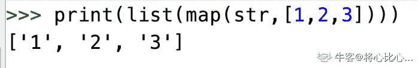

# 金山办公 2020 校招软件运维开发工程师笔试题（二）

## 1

对名为 fido 的文件用 chmod 551 fido 进行了修改，则它的许可权是(   ) 

正确答案: D   你的答案: 空 (错误)

```cpp
-rwxr-xr-x
```

```cpp
-rwxr--r--
```

```cpp
-r--r--r-
```

```cpp
-r-xr-x—x
```

本题知识点

运维工程师 金山 WPS 2020

## 2

OpenSSL 是一个(   )。

正确答案: A   你的答案: 空 (错误)

```cpp
加密软件
```

```cpp
邮件系统
```

```cpp
数据库管理系统
```

```cpp
嵌入式脚本编程语言
```

本题知识点

运维工程师 金山 WPS 2020

## 3

crontab 文件由 6 个域组成，每个域之间用空格分隔，下列哪个排列方式是正确的？(   )

正确答案: B   你的答案: 空 (错误)

```cpp
MIN HOUR DAY MONTH YEAR COMMAND
```

```cpp
MIN HOUR DAY MONTH DAYOFWEEK COMMAND
```

```cpp
COMMAND HOUR DAY MONTH DAYOFWEEK
```

```cpp
COMMAND YEAR MONTH DAY HOUR MIN
```

本题知识点

运维工程师 金山 WPS 2020

## 4

cat -n file1file2 命令的意思是？ (   )

正确答案: B   你的答案: 空 (错误)

```cpp
只会把文件 file1 的内容输出到屏幕上
```

```cpp
把文件 file1 和 file2 连在一起，然后输出到屏幕上。
```

```cpp
创建文件 file1 和 file2
```

```cpp
把 file2 的内容输出到 file1 中并保存
```

本题知识点

运维工程师 金山 WPS 2020

## 5

命令：

```cpp
awk’BEGIN { Arr[2,79]=78 __________ }’
```

为了让执行的结果是 78，不应该填（   ）语句

正确答案: D   你的答案: 空 (错误)

```cpp
print Arr[“2\03479”]
```

```cpp
print Arr[2,79]
```

```cpp
idx=2 SUBSEP 79;print Arr[idx]
```

```cpp
echo Arr[2,79]
```

本题知识点

运维工程师 金山 WPS 2020

## 6

对于 Linux 说法，下列说法正确的是（   ）

正确答案: A   你的答案: 空 (错误)

```cpp
线性访问内存非法时，当前线程会进入信号处理函数
```

```cpp
用 mv 命令移动文件时，文件的修改时间会发生变化
```

```cpp
ulimit -c 设置的是函数调用栈的大小
```

```cpp
malloc 函数是应用程序向操作系统申请内存的接口
```

本题知识点

运维工程师 金山 WPS 2020

讨论

[牛客 275893806 号](https://www.nowcoder.com/profile/275893806)

B：不会变化

C：ulimit 用于 shell 启动进程所占用的资源.-c size:设置 core 文件的最大值.单位:blocks

D：malloc 的全称是 memory allocation，中文叫动态内存分配，当无法知道内存具***置的时候，想要绑定真正的内存空间，就需要用到动态的分配内存。

发表于 2021-06-18 11:22:42

* * *

## 7

下列 Python 语句正确的是（  ）

正确答案: D   你的答案: 空 (错误)

```cpp
min = x  if  x < y  else  y     
```

```cpp
max = x > y ? x : y
```

```cpp
if (x > y) print x
```

```cpp
while True : pass
```

本题知识点

运维工程师 金山 WPS 2020

讨论

[叶秋 q](https://www.nowcoder.com/profile/666430636)

A 为啥不对？

发表于 2020-02-24 13:22:01

* * *

[言 201904141050633](https://www.nowcoder.com/profile/998981358)

直接选成错误的，Python 没有三目运算符，所以 B 中三目运算做法一般用 A 替代，Py2 里面 print 语法就可以这样，不过看起来这道题不是这么想的

发表于 2020-09-23 18:34:27

* * *

[岁无忧](https://www.nowcoder.com/profile/271841221)

难道是算单个的语句吗，那样的话就说的通了。A 里面的，x,y 使用前未赋值。但是要是这么说的话 A,B,C 明显都不对，没有干扰项的意义了

发表于 2020-07-08 21:03:41

* * *

## 8

以下选项中不是 Python 对文件的写操作方法的是 （   ）

正确答案: D   你的答案: 空 (错误)

```cpp
writelines
```

```cpp
write
```

```cpp
write 和 seek
```

```cpp
writetext
```

本题知识点

运维工程师 金山 WPS 2020

讨论

[牛客 339041540 号](https://www.nowcoder.com/profile/339041540)

D

发表于 2020-05-28 16:48:37

* * *

## 9

以下选项中，不是 Python 语言保留字的是 （   ）

正确答案: A   你的答案: 空 (错误)

```cpp
do
```

```cpp
pass
```

```cpp
except
```

```cpp
while
```

本题知识点

运维工程师 金山 WPS 2020

讨论

[漾自由的花](https://www.nowcoder.com/profile/606441100)

import keyword keyword.kwlist 可以查看所有的保留字共有 33 个保留字 ['False', 'None', 'True', 'and', 'as', 'assert', 'break', 'class', 'continue', 'def', 'del', 'elif', 'else', 'except', 'finally', 'for', 'from', 'global', 'if', 'import', 'in', 'is', 'lambda', 'nonlocal', 'not', 'or', 'pass', 'raise', 'return', 'try', 'while', 'with', 'yield']

发表于 2020-06-16 12:11:28

* * *

[牛客 937313140 号](https://www.nowcoder.com/profile/937313140)

A

发表于 2020-04-03 15:03:52

* * *

[巴黎的雨季](https://www.nowcoder.com/profile/372645619)

关键字**except**存在于**try-except**异常捕获语句当中，他的存在是为了排除各种可预测的异常情况

发表于 2020-03-02 11:36:56

* * *

## 10

一个栈的初始状态为空。现将元素 1、2、3、4、5、A、B、C、D、E 依次入栈，然后再依次出栈，则元素出栈的顺序是(   )

正确答案: B   你的答案: 空 (错误)

```cpp
12345ABCDE
```

```cpp
EDCBA54321
```

```cpp
54321EDCBA
```

```cpp
ABCDE12345
```

本题知识点

运维工程师 金山 WPS 2020

## 11

以下关于 Python 的控制结构，错误的是(   )

正确答案: D   你的答案: 空 (错误)

```cpp
每个 if 条件后要使用冒号（：）
```

```cpp
在 Python 中，没有 switch-case 语句
```

```cpp
Python 中的 pass 是空语句，一般用作占位语句
```

```cpp
elif 可以单独使用
```

本题知识点

运维工程师 金山 WPS 2020

讨论

[漾自由的花](https://www.nowcoder.com/profile/606441100)

elif 不可以可以单独使用

发表于 2020-06-16 12:00:41

* * *

## 12

以下关于字典操作的描述，错误的是(   )

正确答案: D   你的答案: 空 (错误)

```cpp
del 用于删除字典或者元素
```

```cpp
clear 用于清空字典中的数据
```

```cpp
len 方法可以计算字典中键值对的个数
```

```cpp
keys 方法可以获取字典的值视图
```

本题知识点

运维工程师 金山 WPS 2020

讨论

[牛客 43462370 号](https://www.nowcoder.com/profile/43462370)

**keys() 方法可以获取字典的键视图** **values() 方法可以获取字典的值视图**

发表于 2021-03-09 22:10:00

* * *

[牛客 162879388 号](https://www.nowcoder.com/profile/162879388)

keys 是获取字典的值

发表于 2020-05-06 10:11:06

* * *

## 13

查看变量类型的 Python 内置函数是 1

你的答案 (错误)

1 参考答案 (1) type()

本题知识点

运维工程师 金山 WPS 2020

讨论

[cute_monkey](https://www.nowcoder.com/profile/6857666)

type

发表于 2020-06-11 15:57:50

* * *

[牛客 928390004 号](https://www.nowcoder.com/profile/928390004)

type()

发表于 2020-03-28 16:23:24

* * *

## 14

Python 内置函数 1 可以返回列表、元组、字典、集合、字符串以及 range 对象中元素个数。

你的答案 (错误)

1 参考答案 (1) len()

本题知识点

运维工程师 金山 WPS 2020

讨论

[卢萨卡的野猫](https://www.nowcoder.com/profile/499692097)

```cpp
_list = [1, 2]
_tuple = (1, 2, 3)
_dict = {"name": "xx", "age": 19}
_str = "haha"
_set = {1, 2, 4, 5}
_range = range(1, 11)

print(len(_list), len(_tuple), len(_dict), len(_str), len(_set), len(_range))
```

发表于 2020-05-22 16:39:04

* * *

[牛客 528492523 号](https://www.nowcoder.com/profile/528492523)

len

发表于 2020-04-26 14:16:36

* * *

## 15

list(map(str,[1,2,3]))的执行结果为 1

你的答案 (错误)

1 参考答案 (1) [‘1’,‘2’,‘3’]

本题知识点

运维工程师 金山 WPS 2020

讨论

[岁无忧](https://www.nowcoder.com/profile/271841221)

答案的单引号是错的，太不严谨了。。。

发表于 2020-07-08 21:05:23

* * *

[将心比心...](https://www.nowcoder.com/profile/76951174)



发表于 2020-02-28 09:46:18

* * *

## 16

字典对象的 1 方法返回字典的“键”列表

你的答案 (错误)

1 参考答案 (1) keys()

本题知识点

运维工程师 金山 WPS 2020

## 17

Python3.x 语句 print(1,2,3,sep=',')的输出结果为 1

你的答案 (错误)

1 参考答案 (1) 1,2,3

本题知识点

运维工程师 金山 WPS 2020

讨论

[牛客 466449409 号](https://www.nowcoder.com/profile/466449409)

sep 指的是分割符号，即 sep=',' 表示为 1 2 3 之间用逗号分割

发表于 2021-08-04 14:08:30

* * *

[牛客 530770277 号](https://www.nowcoder.com/profile/530770277)

123

发表于 2020-06-20 18:40:30

* * *

[牛客 937313140 号](https://www.nowcoder.com/profile/937313140)

1,2,3

发表于 2020-04-03 11:33:34

* * *

## 18

表达式'Helloworld!'[-4:]的值为 1

你的答案 (错误)

1 参考答案 (1) 'rld!'

本题知识点

运维工程师 金山 WPS 2020

## 19

字符串编码格式 GBK 使用 1 个字节表示一个汉字。

你的答案 (错误)

1 参考答案 (1) 2

本题知识点

运维工程师 金山 WPS 2020

## 20

正则表达式模块 re 的 1 方法用来在整个字符串中进行指定模式的匹配。

你的答案 (错误)

1 参考答案 (1) search()

本题知识点

运维工程师 金山 WPS 2020

## 21

Python 标准库 os.path 中用来判断指定文件是否存在的方法是 1

你的答案 (错误)

1 参考答案 (1) exists()

本题知识点

运维工程师 金山 WPS 2020

讨论

[牛客 530770277 号](https://www.nowcoder.com/profile/530770277)

os.path.exists()

发表于 2020-06-20 18:37:47

* * *

[牛客 928390004 号](https://www.nowcoder.com/profile/928390004)

exists()

发表于 2020-03-28 13:51:47

* * *

## 22

Python 用来访问和操作内置数据库 SQLite 的标准库是 1

你的答案 (错误)

1 参考答案 (1) sqlite3

本题知识点

运维工程师 金山 WPS 2020

讨论

[牛客 199813657 号](https://www.nowcoder.com/profile/199813657)

sqilte3

发表于 2021-09-13 15:54:37

* * *

## 23

3+4j 不是合法的 Python 表达式。

正确答案: B   你的答案: 空 (错误)

```cpp
对
```

```cpp
错
```

本题知识点

运维工程师 金山 WPS 2020

讨论

[岁无忧](https://www.nowcoder.com/profile/271841221)

复数

发表于 2020-07-08 21:07:48

* * *

[漾自由的花](https://www.nowcoder.com/profile/606441100)

3+4j 和 3+4J 都是合法

发表于 2020-06-16 12:02:06

* * *

## 24

Python 字典中的“键”可以是元组。（）

正确答案: A   你的答案: 空 (错误)

```cpp
对
```

```cpp
错
```

本题知识点

运维工程师 金山 WPS 2020

讨论

[10011✨](https://www.nowcoder.com/profile/907042523)

键具有唯一性，元组属于不可变类型

发表于 2020-04-16 17:42:13

* * *

## 25

调用带有默认值参数的函数时，不能为默认值参数传递任何值，必须使用函数定义时设置的默认值。（）

正确答案: B   你的答案: 空 (错误)

```cpp
对
```

```cpp
错
```

本题知识点

运维工程师 金山 WPS 2020

## 26

Python 中一切内容都可以称为对象。（  ）

正确答案: A   你的答案: 空 (错误)

```cpp
对
```

```cpp
错
```

本题知识点

运维工程师 金山 WPS 2020

## 27

在异常处理结构中，不论是否发生异常，finally 子句中的代码总是会执行的。（  ）

正确答案: A   你的答案: 空 (错误)

```cpp
对
```

```cpp
错
```

本题知识点

运维工程师 金山 WPS 2020

## 28

如何在 Python 中实现多线程？

你的答案

本题知识点

运维工程师 金山 WPS 2020

讨论

[牛客 345463698 号](https://www.nowcoder.com/profile/345463698)

threading 模块, threading.Thread(target=xx,args=(xx,))

发表于 2020-03-16 16:14:58

* * *

## 29

这是什么意思： *args，**kwargs？我们为什么要用呢？

你的答案

本题知识点

运维工程师 金山 WPS 2020

讨论

[牛客 305343519 号](https://www.nowcoder.com/profile/305343519)

可变参数

发表于 2020-03-19 21:44:06

* * *

## 30

计算出从你生日之日起到今天一共过了多少天？（python、go、shell 均可）

你的答案

本题知识点

运维工程师 金山 WPS 2020

讨论

[托瓦斯克一](https://www.nowcoder.com/profile/9544536)

shell 的写法：#!/bin/bash
birth_day=$(date -d "1997-8-4" +%s)
now_day=$(date -d "2020-5-10" +%s)
mydays=$((($now_day-$birth_day)/86400))
echo $mydays

编辑于 2020-06-30 16:20:18

* * *

[牛客 345463698 号](https://www.nowcoder.com/profile/345463698)

```cpp
import datetime

now_day = datetime.datetime(2020,8,21)
birth_day = datetime.datetime(1996,8,21)
passed_days = now_day - birth_day
print("从出生到现在一共经过了%d 天" % passed_days.days)
```

发表于 2020-03-16 16:10:45

* * *

[牛客 937313140 号](https://www.nowcoder.com/profile/937313140)

```cpp
import datetime def birth_day():
    birth_day = '1990-01-14'   birth = datetime.date.fromisoformat(birth_day)  today = datetime.date.today() return today - birth
```

发表于 2020-04-03 14:22:41

* * *

## 31

讲述你如何做系统优化,提高系统性能，充分利用资源？

你的答案

本题知识点

运维工程师 金山 WPS 2020

讨论

[托瓦斯克一](https://www.nowcoder.com/profile/9544536)

1、优化内存，把不需要的服务关掉

2、定期清理备份文件，加大磁盘使用空间

3、sysctl.conf 文件做内核优化

4、文件句柄数（打开最大文件数）调到 65535

5、通过修改应用软件的配置文件，对服务进行优化，提高内存、CPU 的使用率

发表于 2020-06-30 16:40:23

* * *

## 32

说说你理解的运维开发工程师什么样的一个角色？并说说运维开发工程师应该具备哪些技能？

你的答案

本题知识点

运维工程师 金山 WPS 2020