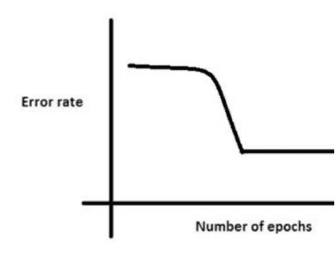
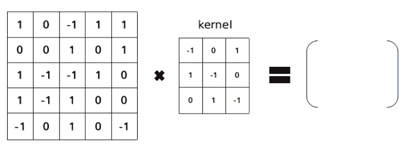
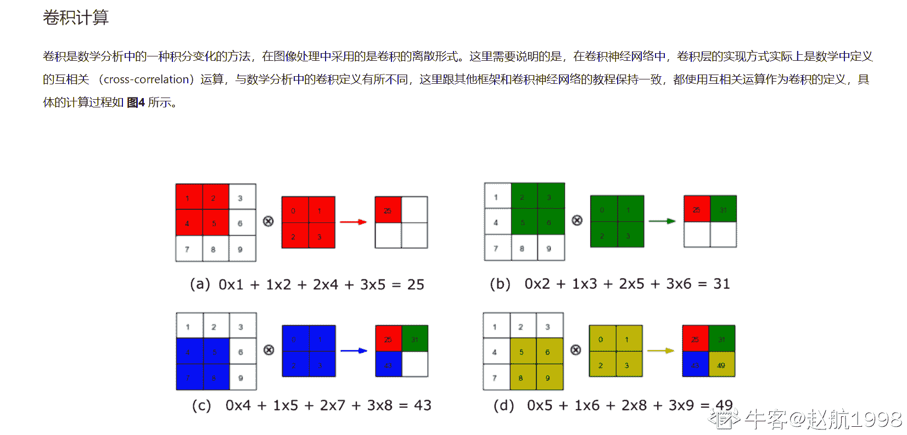

# 金山办公 2020 校招自然语言处理 NLP 工程师笔试题（一）

## 1

两个人轮流抛硬币，规定第一个抛出正面的人可以吃到苹果，请问先抛的人能吃到苹果的概率多大？ （    ）

正确答案: C   你的答案: 空 (错误)

```cpp
1/3
```

```cpp
1/2
```

```cpp
2/3
```

```cpp
3/4
```

本题知识点

算法工程师 金山 WPS 运维工程师 2020

讨论

[牛客 410357752 号](https://www.nowcoder.com/profile/410357752)

这道题的坑挺深  我第一眼直接认为就是抛出正反面的概率各为 1/2，然后第一个人就吃上了，就选了 1/2 完美结束；其实不是这样的。再审题发现，两人轮流抛硬币，轮流、轮流、轮流，没人抛出正面就一直抛。 那么第一个吃上的概率是：第一轮： 1/2 (1 直接抛出正面)
第二轮： 1/2 *  1/2 * 1/2   (1 抛出反面 *  2 抛出反面  * 1 抛出正面)第三轮： 1/2 * 1/2 * 1/2 * 1/2 * 1/2 (1 抛出反面 * 2 抛出反面 * 1 抛出反面 * 2 抛出反面  * 1 抛出正面)以此类推，发现规律了  1/4 的等比数列  求前 n 项和的公式 s = a1 * [ (1-q^n) / 1-q ]  这里就是 s = 1/2 * [ (1- (1/4)^n) / (1 - (1/4))]n 趋近无穷时，分母就等于 1， 分子是 3/4,  s = (1/2) * (4/3)  = 2/3

发表于 2020-02-19 09:25:10

* * *

[bigodf](https://www.nowcoder.com/profile/290871079)

对于每一轮来说先抛的人在这一轮中吃到的概率为 1/2， 后抛的人为 1/2*1/2=1/4，这一轮中谁也没吃到的概率为 1/2*1/2=1/4 所以先抛的人吃到的概率总共为(1/4)^(n-1) * 1/2 这样一个等比数列的和，其中 n 为轮数结果为 2/3

发表于 2020-02-17 10:18:27

* * *

[ANMC](https://www.nowcoder.com/profile/680530648)

解：


第一个人第一次没成功，第二个人第一次也没成功，第一个人第二次成功了。


编辑于 2020-02-20 11:17:40

* * *

## 2

 对一幅 100*100 像素的图像，若每像元使用 8bit 表示其灰度值，经霍夫曼编码后压缩图像的数据量为 10000bit，则图像的压缩比为（ ）

正确答案: C   你的答案: 空 (错误)

```cpp
2:1
```

```cpp
4:1
```

```cpp
8:1
```

```cpp
1:2
```

本题知识点

算法工程师 金山 WPS 运维工程师 2020

讨论

[ANMC](https://www.nowcoder.com/profile/680530648)


发表于 2020-02-20 11:20:16

* * *

[来一个熊抱吧](https://www.nowcoder.com/profile/228567234)

100*100*8 除以 10000

发表于 2020-02-18 00:59:23

* * *

## 3

在公有派生类的成员函数不能直接访问基类中继承来的某个成员，则该成员一定是基类中（    ）

正确答案: A   你的答案: 空 (错误)

```cpp
私有成员
```

```cpp
公有成员
```

```cpp
保护成员
```

```cpp
保护成员或私有成员
```

本题知识点

算法工程师 金山 WPS 运维工程师 2020

讨论

[夏了南城](https://www.nowcoder.com/profile/2209992)

公有派生类可以访问基类中继承来的保护成员

发表于 2020-08-19 16:00:46

* * *

## 4

下列关于正则表示式的描述中，正确的是（ ）

正确答案: D   你的答案: 空 (错误)

```cpp
符号. 表示匹配任意字符,包括换行符
```

```cpp
符号$ 表示匹配字符串的开始部分
```

```cpp
符号? 表示匹配 1 次或多次前面出现的内容的正则表达式
```

```cpp
符号{n} 表示匹配 n 次前面出现的正则表达式
```

本题知识点

算法工程师 金山 WPS 运维工程师 2020

讨论

[ANMC](https://www.nowcoder.com/profile/680530648)

符号“.”：匹配除 "\n" 之外的任何单个字符。要匹配包括 '\n' 在内的任何字符，请使用象 '[.\n]' 的模式。

符号“$”：匹配输入字符串的结束位置。如果设置了 RegExp 对象的 Multiline 属性，$ 也匹配 '\n' 或 '\r' 之前的位置。

符号“?”：当该字符紧跟在任何一个其他限制符 (*, +, ?, {n}, {n,}, {n,m}) 后面时，匹配模式是非贪婪的。非贪婪模式尽可能少的匹配所搜索的字符串，而默认的贪婪模式则尽可能多的匹配所搜索的字符串。例如，对于字符串 "oooo"，'o+?' 将匹配单个 "o"，而 'o+' 将匹配所有 'o'。

符号“{n}”：n 是一个非负整数。匹配确定的 n 次。例如，'o{2}' 不能匹配 "Bob" 中的 'o'，但是能匹配 "food" 中的两个 o。更多参考：[`www.cnblogs.com/jin-zhe/p/9773081.html`](https://www.cnblogs.com/jin-zhe/p/9773081.html)

发表于 2020-02-20 11:29:53

* * *

[零葬](https://www.nowcoder.com/profile/75718849)

"."匹配除了换行符之外的任意单个字符，"$"匹配的是结束，开头用"^"，"?"表示匹配前面的子表达式零次或一次。

发表于 2020-10-15 09:35:38

* * *

## 5

所谓多态性是指（）

正确答案: B   你的答案: 空 (错误)

```cpp
不同的对象调用不同名称的函数
```

```cpp
不同的对象调用相同名称的函数
```

```cpp
一个对象调用不同名称的函数
```

```cpp
一个对象调用不同名称的对象
```

本题知识点

算法工程师 金山 WPS 运维工程师 2020

## 6

在 C++中,已知在 32 位系统中,一个结构体 struct stu {short i;struct {char j; int k;};int m;char n;};,那么在考虑字节对齐下,编译后 sizeof(stu)的值是多少（）

正确答案: A   你的答案: 空 (错误)

```cpp
20
```

```cpp
12
```

```cpp
14
```

```cpp
17
```

本题知识点

算法工程师 金山 WPS 运维工程师 2020

讨论

[woqulrlr](https://www.nowcoder.com/profile/693924)

1.结构体对齐：（1）按结构体中最大的数据结构对齐（简单看作均为 4 的倍数）。2.数据结构：int 4 字节， char 4 字节

发表于 2020-03-21 13:25:30

* * *

[牛客 410357752 号](https://www.nowcoder.com/profile/410357752)

结构体的有效对齐值是其最大数据成员的自身对齐值   int k 是最大的自身对齐值 4，所以结构体的对齐值就是 4 
存放成员的起始地址必须是该成员有效对齐值的整数倍。 就是说 k 前面必须有 4 的整数倍字节这里先对齐内部的结构体 j 补齐 4 个字节 k 占 4 个字节 
外部结构体  i 也要补齐 4 个字节  m 占 4 个字节   n 呵呵 我原来以为 char 反正就占 1 个字节 后面没有 int 类型了 前面的补齐跟这里没有关系了，其实不是的  对于结构体或者类，要将其补齐为其有效对齐值的整数倍，也就是 n 也要补齐到 4 字节所以总共 20 字节

发表于 2020-02-19 09:50:36

* * *

## 7

下面 python 代码的执行结果是（    ）:

```cpp
d = {}
for i in range(26):
d[chr(i + ord("a"))] = chr((i + 13) % 26 + ord("a"))
for c in "Python":
    print(d.get(c, c), end="")
```

正确答案: A   你的答案: 空 (错误)

```cpp
Plguba
```

```cpp
Cabugl
```

```cpp
Python
```

```cpp
Pabugl
```

本题知识点

算法工程师 金山 WPS 运维工程师 2020

讨论

[牛客 791361722 号](https://www.nowcoder.com/profile/791361722)

ord(将字母转为 ascii 码）

chr(数字变为字母）

a=97

发表于 2020-02-16 21:21:22

* * *

[牛客 943846962 号](https://www.nowcoder.com/profile/943846962)

大写的 P 需要 a 加上 41，取不到返回自身 P

发表于 2020-04-19 11:08:06

* * *

[ANMC](https://www.nowcoder.com/profile/680530648)

chr() 用一个范围在 range（256）内的（就是 0～255）整数作参数，返回一个对应的字符。ord() 函数是 chr() 函数（对于 8 位的 ASCII 字符串）或 unichr() 函数（对于 Unicode 对象）的配对函数，它以一个字符（长度为 1 的字符串）作为参数，返回对应的 ASCII 数值，或者 Unicode 数值，如果所给的 Unicode 字符超出了你的 Python 定义范围，则会引发一个 TypeError 的异常。Python 中的花括号{}：代表 dict 字典数据类型，字典是 Python 中唯一内建的映射类型。字典中的值没有特殊的顺序，但都是存储在一个特定的键（key）下。键可以是数字、字符串甚至是元祖。

编辑于 2020-02-20 15:27:01

* * *

## 8

（）是调用者发出消息后，必须等待消息处理结束返回后，才能进行后续操作。

正确答案: A   你的答案: 空 (错误)

```cpp
同步消息
```

```cpp
返回消息
```

```cpp
异步消息
```

```cpp
简单消息
```

本题知识点

算法工程师 金山 WPS 运维工程师 2020 测试开发工程师 小米 2021

## 9

下面的排序算法中，初始数据集的排列顺序对算法的性能无影响的是（）

正确答案: B   你的答案: 空 (错误)

```cpp
插入排序
```

```cpp
堆排序
```

```cpp
冒泡排序
```

```cpp
快速排序
```

本题知识点

算法工程师 金山 WPS 运维工程师 2020

讨论

[ANMC](https://www.nowcoder.com/profile/680530648)

| 排序方法 | 平均时间 | 最坏情况 | 辅助存储 |
| --- | --- | --- | --- |
| 简单排序 |  |  |  |
| 快速排序 |  |  |  |
| 堆排序 |  |  |  |
| 归并排序 |  |  |  |
| 基数排序 |  |  |  |

发表于 2020-02-20 15:44:47

* * *

[mysterioussuperstar](https://www.nowcoder.com/profile/783604547)

插入排序的时间复杂度最好的情况下是 O(n),最坏的情况是 O(n²)。冒泡排序的时间复杂度最好的情况下是 O(n),最坏的情况是 O(n²)。快速排序的时间复杂度最好的情况下是 O(nlogn),最坏的情况是 O(n²)。堆排序的时间复杂度最好的情况下是 O(nlogn),最坏的情况是 O(nlogn)。因为堆排序首先是建堆，再进行排序。可以参考：[`blog.csdn.net/weixin_43447989/article/details/104296182`](https://blog.csdn.net/weixin_43447989/article/details/104296182)

发表于 2020-02-15 19:45:57

* * *

## 10

假设一棵二叉树的结点个数为 50，则它的最小高度是（）

正确答案: C   你的答案: 空 (错误)

```cpp
4
```

```cpp
5
```

```cpp
6
```

```cpp
7
```

本题知识点

算法工程师 金山 WPS 运维工程师 2020

讨论

[ANMC](https://www.nowcoder.com/profile/680530648)

答：具有个结点的完全二叉树的深度为。
证明：


发表于 2020-02-20 16:00:33

* * *

## 11

关于队列的描述中，以下描述正确的是（）

正确答案: D   你的答案: 空 (错误)

```cpp
在队列中只能删除数据
```

```cpp
队列是先进后出的线性表
```

```cpp
在队列中只能插入数据
```

```cpp
队列是先进先出的线性表
```

本题知识点

算法工程师 金山 WPS 运维工程师 2020

## 12

下列属于无监督学习的模型是（）

正确答案: A   你的答案: 空 (错误)

```cpp
Kmeans       
```

```cpp
LSTM+CRF 
```

```cpp
SVM
```

```cpp
决策树
```

本题知识点

算法工程师 金山 WPS 运维工程师 2020

## 13

神经网络训练时可能有一个停滞期，这是因为神经网络在进入全局最小值之前陷入局部最小值。为了避免这种情况，下面的哪个策略有效？（）

正确答案: C   你的答案: 空 (错误)

```cpp
增加参数的数量，使得网络不会卡在局部最小值处
```

```cpp
在开始时把学习率降低几倍，然后使用梯度下降加速算子(momentum)
```

```cpp
抖动学习速率，即改变几个时期的学习速率
```

```cpp
其他均不是
```

本题知识点

算法工程师 金山 WPS 运维工程师 2020

## 14

在包含 N 个文档的语料库中，随机选择一个文档。该文件总共包含 T 个词，词条「数据」出现 K 次。如果词条「数据」出现在文件总数的数量接近三分之一，则 TF（词频）和 IDF（逆文档频率）的乘积的正确值是多少？（）

正确答案: B   你的答案: 空 (错误)

```cpp
KT * Log(3)
```

```cpp
K * Log(3) / T
```

```cpp
T * Log(3) / K
```

```cpp
Log(3) / KT
```

本题知识点

算法工程师 金山 WPS 运维工程师 2020

## 15

用来求解隐马模型中观测序列的方式是（）

正确答案: A   你的答案: 空 (错误)

```cpp
前向算法和后向算法
```

```cpp
 kmp 算法
```

```cpp
 Baum-Welch 算法
```

```cpp
维特比算法
```

本题知识点

算法工程师 金山 WPS 运维工程师 2020

讨论

[零葬](https://www.nowcoder.com/profile/75718849)

前向后项算法是做评估问题的吧，是要求概率。这题很有意思，观测序列已经观测到了还求什么，要求也是求隐状态序列吧。

发表于 2020-10-15 10:27:47

* * *

## 16

在用于文本分类的隐狄利克雷分布（LDA）模型中，α 和 β 超参数表征什么？（）

正确答案: D   你的答案: 空 (错误)

```cpp
α ：文档中的主题数量，β：假主题中的词条数量
```

```cpp
α ：主题内生成的词条密度，β：假词条中生成的主题密度
```

```cpp
α ：文档中的主题数量，β：真主题中的词条数量
```

```cpp
α ：文档中生成的主题密度，β：真主题内生成的词密度
```

本题知识点

算法工程师 金山 WPS 运维工程师 2020

## 17

在 Transformer 的 decoder 中的 multi-head attention，Q , K , V 来自哪里？（）

正确答案: C   你的答案: 空 (错误)

```cpp
Q、K、V 均来自 encoder
```

```cpp
Q、K 来自 encoder，V 来自 decoder
```

```cpp
Q 来自 decoder，K、V 来自 encoder
```

```cpp
Q 来自 encoder，K、V 来自 decoder
```

本题知识点

算法工程师 金山 WPS 运维工程师 2020

## 18

Which of the following processes would help avoid aliasing while down sampling an image? （）

正确答案: B   你的答案: 空 (错误)

```cpp
Image sharpening
```

```cpp
Image blurring
```

```cpp
Median filtering where you replace every pixel by the median of pixels in a window
```

```cpp
Histogram equalization
```

本题知识点

算法工程师 金山 WPS 运维工程师 2020

## 19

C 语言中全局变量的存储空间在（     ）分配

正确答案: B   你的答案: 空 (错误)

```cpp
代码区
```

```cpp
静态数据区
```

```cpp
栈区
```

```cpp
堆区
```

本题知识点

算法工程师 金山 WPS 运维工程师 2020

讨论

[还是搞开发吧](https://www.nowcoder.com/profile/7719222)

全局变量存放在静态存储区,位置是固定的。 局部变量在栈空间,栈地址是不固定的。

发表于 2020-05-06 19:32:48

* * *

[牛客 42846359 号](https://www.nowcoder.com/profile/42846359)

全局变量从静态存储区域分配存储空间。

发表于 2022-03-03 14:59:24

* * *

## 20

梯度下降算法的正确步骤是什么？（）

（1）计算预测值和真实值之间的误差

（2）迭代更新，直到找到最佳权重

（3）把输入传入网络，得到输出值

（4）初始化随机权重和偏差

（5）对每一个产生误差的神经元，改变相应的（权重）值以减小误差

正确答案: D   你的答案: 空 (错误)

```cpp
1, 2, 3, 4, 5
```

```cpp
5, 4, 3, 2, 1
```

```cpp
3, 2, 1, 5, 4
```

```cpp
 4, 3, 1, 5, 2
```

本题知识点

算法工程师 金山 WPS 运维工程师 2020

## 21

图像与灰度直方图间的对应关系是（）

正确答案: B   你的答案: 空 (错误)

```cpp
一一对应
```

```cpp
多对一
```

```cpp
一对多
```

```cpp
都不对
```

本题知识点

算法工程师 金山 WPS 运维工程师 2020

讨论

[还是搞开发吧](https://www.nowcoder.com/profile/7719222)

图像与灰度直方图的对应关系是：**多对一**

发表于 2020-05-06 19:34:45

* * *

## 22

图像灰度方差说明了图像哪个属性（）

正确答案: B   你的答案: 空 (错误)

```cpp
平均灰度
```

```cpp
图像对比度
```

```cpp
图像整体亮度
```

```cpp
图像细节
```

本题知识点

算法工程师 金山 WPS 运维工程师 2020

## 23

一幅 1000*500 的 RGB 彩色 8 位图像，其存储容量为多少：（）

正确答案: C   你的答案: 空 (错误)

```cpp
0.47M
```

```cpp
0.95M 
```

```cpp
1.43M
```

```cpp
11.44M
```

本题知识点

算法工程师 金山 WPS 运维工程师 2020

讨论

[夏了南城](https://www.nowcoder.com/profile/2209992)

1000*500*8*3B=1200000012000000/8=1500000b1500000b/1024=1464.8kb1464.8/1024=1.43mb

发表于 2020-08-19 17:18:39

* * *

[a 朋友](https://www.nowcoder.com/profile/813373265)

1000*500*24/8

发表于 2020-02-23 11:57:49

* * *

[微微在在](https://www.nowcoder.com/profile/1462085)

字节数=图像水平分辨率×图像垂直分辨率×颜色深度(位数)/8

发表于 2022-01-17 20:10:24

* * *

## 24

一幅灰度级均匀分布的图像，其灰度范围在[0,255]，则该图像的信息量为：（     ）

正确答案: C   你的答案: 空 (错误)

```cpp
0
```

```cpp
255
```

```cpp
8
```

```cpp
16
```

本题知识点

算法工程师 金山 WPS 运维工程师 2020

讨论

[零葬](https://www.nowcoder.com/profile/75718849)

[0,255]中有 256 个值，则图像的信息量为 log2(256) = 8

发表于 2020-10-15 10:45:52

* * *

## 25

输入图片大小为 100×100，依次经过一层卷积（kernel size 5×5，padding 1，stride 2），pooling（kernel size 3×3，padding 0，stride 1），又一层卷积（kernel size 3×3，padding 1，stride 1）之后，输出特征图大小为： （）

正确答案: B   你的答案: 空 (错误)

```cpp
48
```

```cpp
49
```

```cpp
50
```

```cpp
51
```

本题知识点

算法工程师 金山 WPS 运维工程师 2020

讨论

[百岁山下酸菜鱼](https://www.nowcoder.com/profile/801004196)

**卷积层**【( input_size + 2*padding - kernel_size ) / stride】+1 = output_size  **注意：****卷积向下取整，池化向上取整。**

**池化层  【（input_size  -  kernel_size） / stride】+ 1 = output_size** 所以到最后是【（100 + 2*1 - 5 ）/ 2】+1 = 49【（49  - 3）/  1】+1  = 47【（47 +2- 3 ）/1】+1 = 47 我的答案是 47，不知其他做对的人们是怎么算的呢

发表于 2020-02-15 16:38:31

* * *

[Kindfa](https://www.nowcoder.com/profile/815491610)

这个题目记住公式就可以了

发表于 2020-11-26 15:46:46

* * *

[零葬](https://www.nowcoder.com/profile/75718849)

应该是 47，把中间那个池化层去掉才是 49

发表于 2020-10-15 09:09:28

* * *

## 26

什么是感受野?下图中,单通道卷积之后的结果是什么？

你的答案

本题知识点

算法工程师 金山 WPS 运维工程师 2020

讨论

[ANMC](https://www.nowcoder.com/profile/680530648)


| -2 | -2 | 4 |
| --- | --- | --- |
| 1 | 1 | -2 |
| -1 | 1 | 3 |

发表于 2020-02-21 10:36:11

* * *

[P-ShineBeam](https://www.nowcoder.com/profile/945440246)



发表于 2020-02-19 18:17:20

* * *

[牛客 Cver](https://www.nowcoder.com/profile/1897620)

感受野：在典型的 CNN 中，全连接层的每个输出层的值都依赖于每个输入值，而卷积层的输出值仅仅依赖于当前该区域的输入值，其他的区域不受影响，这个结构称为感受野。计算结果是：[-2,-2,41,1,-2-1,1,3]

编辑于 2020-03-14 14:43:36

* * *

## 27

简述你所了解的 attention 机制。

你的答案

本题知识点

算法工程师 金山 WPS 运维工程师 2020

讨论

[牛客 Cver](https://www.nowcoder.com/profile/1897620)

attention 机制是模仿了生物观察行为的内部过程，即一种将内部经验和外部感觉对齐从而增加部分区域的观察精细度的机制。例如当人看一张图片时，会快速扫描全部图像，获得需要关注的重点的目标区域，也就是注意力焦点。然后对这一区域投入更多的注意力资源，以获得更多的细节信息，并抑制其他无用的信息。

发表于 2020-02-12 14:34:42

* * *

## 28

神经网络中为什么用激活函数?请推导 sigmoid 函数在 0 处的导数是多少?

你的答案

本题知识点

算法工程师 金山 WPS 运维工程师 2020

讨论

[刘溜溜 1107](https://www.nowcoder.com/profile/41594700)

让输出归一化到 0 到 1 之间，并且激活函数必须是非线性的

发表于 2020-02-23 15:59:04

* * *

[ANMC](https://www.nowcoder.com/profile/680530648)


; 


发表于 2020-02-21 11:56:22

* * *

[牛客 Cver](https://www.nowcoder.com/profile/1897620)

1.神经网络使用激活函数能够增加模型的非线性映射，提高网络的拟合和表达能力；2.

发表于 2020-02-12 14:28:00

* * *

## 29

请简单介绍开运算和闭运算及其分别在图像处理与分析中的作用？

你的答案

本题知识点

算法工程师 金山 WPS 运维工程师 2020

讨论

[牛客 Cver](https://www.nowcoder.com/profile/1897620)

1）开运算：先对图像腐蚀后膨胀。作用：用来消除小的物体，平滑形状边界，并且不改变其面积。可以去除小颗粒噪声，断开物体之间的粘连。2）闭运算：先对图像膨胀后腐蚀作用：用来填充物体内的小空洞，连接邻近的物体，连接断开的轮廓线，平滑其边界的同时不改变面积。

发表于 2020-02-12 14:17:05

* * *

## 30

说一说你对 LeNet、ImageNet、AlexNet、VGG、GoogLeNet、ResNet、DenseNet 的了解（要包含其亮点和适用场景）。

你的答案

本题知识点

算法工程师 金山 WPS 运维工程师 2020

讨论

[牛客 Cver](https://www.nowcoder.com/profile/1897620)

LeNet 网络:主要用于识别 10 个手写邮政编码数字，5*5 卷积核，stride=1，最大池化。引入 Group 群卷积概念，最早是为了应对训练时硬件限制问题，额外的好处是减少参数，抑制过拟合.ImageNet：这个项目是一个用于视觉对象识别软件研究的大型可视化数据库。超过 1400 万的图像 URL 被 ImageNet 手动注释，以指示图片中的对象。AlexNet:AlexNet 网络 8 层网络结构 5conv +5pooling +3fc+1000output class。Alexnet 有一个特殊的计算层——LPN 层，功能是对当前层的输出结果做平滑处理。VGG:由 5 层卷积层、3 层全连接层、softmax 输出层构成。两个 3x3 的卷积层连在一起可视为 5x5 的 filter，三个连在一起可视为一个 7x7 的卷积核，这种做法减少了参数，增加了网络的非线性映射，增多了网络的拟合表达能力。GooleLeNet:Googlenet 的核心思想是 inception，通过不垂直堆砌层的方法得到更深的网络.ResNet:设计了“bottleneck”形式的 block（有跨越几层的直连）用全局平均池化 GAP 代替全连层 FC，解决全连接层参数冗余的问题，但 FC 的优势在于在迁移学习中可改善微调的效果。DenseNet:是在相同的特征层的形状下直接连接两层。DenseNet 可以自然放大到上百层而不会有优化的困难。结合了 identity mapping 属性、深度监督和多样深度。它们使得通过网络的特征重复利用和学到更紧凑，根据实验结果，更加高精度的模型。因为简洁的内部表示和特征冗余的减少，densenets 对于很多计算机视觉任务是很棒的特征提取者。

发表于 2020-02-12 14:16:53

* * *

## 31

在目标检测算法中，two stage 的算法比 one stage 在检测小物体上更有效，此说法你同意么，为什么？（）

你的答案

本题知识点

算法工程师 金山 WPS 运维工程师 2020

讨论

[牛客 Cver](https://www.nowcoder.com/profile/1897620)

同意。理由：two stage 是先由算法生成一系列作为样本的候选框，再通过卷积神经网络进行样本分类；one stage 则不用产生候选框，直接将目标边框定位的问题转化为回归问题处理。one stage 可以大部分学习到物体的背景的泛化特征，但是对于小物体定位不准，准确率不高，效果不好，但是 two stage 存在 Anchors 等机制，会对物体进行精细定位，从理论上来说，在小物体比 one stage 要好。

发表于 2020-02-12 14:16:59

* * *

## 32

列表和元组有什么区别？

你的答案

本题知识点

运维工程师 金山 WPS 算法工程师 2020

## 33

Python 解释“re”模块的 split()， sub()， subn()方法。

你的答案

本题知识点

运维工程师 金山 WPS 算法工程师 2020

讨论

[牛客 898832251 号](https://www.nowcoder.com/profile/898832251)

正则表达式

发表于 2020-10-19 16:56:19

* * *

## 34

计算出从你生日之日起到今天一共过了多少天？（python、go、shell 均可）

你的答案

本题知识点

运维工程师 金山 WPS 算法工程师 2020

讨论

[牛客 266215038 号](https://www.nowcoder.com/profile/266215038)

import datetimenow_day = datetime.datetime(2021,9,27)brith_day  = datetime.datetime(1997,2,23)pass_days = now_day - brith_dayprint("从我出生之日到今天一共过了%d 天"   % pass_days.days)

发表于 2021-09-27 10:01:07

* * *

[吴悟无](https://www.nowcoder.com/profile/5294660)

#!/usr/bin/python

import datetime

now = datetime.datetime.now()
birthday = datetime.datetime(2020, 8, 1)
print(now - birthday)

发表于 2020-11-20 11:53:22

* * *

[小广依旧](https://www.nowcoder.com/profile/475719413)

def Day_num(birth_year,birth_month,birth_day):
day = 0
for month in range(birth_month,12):
if month==3 or month==5 or month==7 or month==8 or month==10 or month==12:
day = day+31
elif month==2:
day = day+28
else:
day = day+30

if birth_year%4==0:
day = day+1-birth_day
else:
day = day-birth_day

for year in range(birth_year+1,2020):
if(year%4==0):
day = day+366
else:
day = day+356

day = day+31+29+31+30+31+16
return day

Day = Day_num(1997,3,4)
print(Day)

编辑于 2020-06-17 14:38:00

* * *

## 35

你如何监视服务器质量和网络质量？用哪些工具及优缺点？

你的答案

本题知识点

运维工程师 金山 WPS 算法工程师 2020

## 36

说说你理解的运维开发工程师是什么样的一个角色？并说说运维开发工程师应该具备哪些技能？

你的答案

本题知识点

运维工程师 金山 WPS 算法工程师 2020