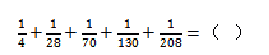
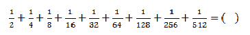
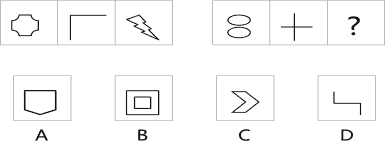
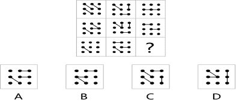
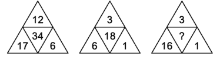
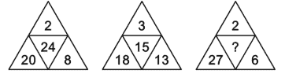
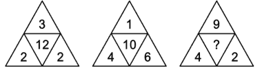
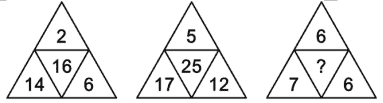

# 奇安信 2018 春招逻辑题

## 1

某学生前几次数学模拟测验的平均成绩是 80 分，这一次要考 100 分，才能把平均成绩提高到 85 分，问这一次是第（   ）次测验。

正确答案: C   你的答案: 空 (错误)

```cpp
2
```

```cpp
3
```

```cpp
4
```

```cpp
5
```

本题知识点

Java 工程师 C++工程师 iOS 工程师 安卓工程师 奇安信 2018

讨论

[crackcat](https://www.nowcoder.com/profile/293302331)

设测验次数为 n，则依题意有(80n+100)/(n+1)=85，解得 n=3，故这一次是第 n+1=4 次测验，选 C。

发表于 2020-05-21 22:02:32

* * *

## 2

甲、乙、丙三人，平均体重 68 千克。甲与乙的平均体重比丙的体重多 6 千克，甲比丙重 3 千克。求乙的体重是（   ）。

正确答案: D   你的答案: 空 (错误)

```cpp
64
```

```cpp
67
```

```cpp
70
```

```cpp
73
```

本题知识点

Java 工程师 C++工程师 iOS 工程师 安卓工程师 奇安信 2018

讨论

[crackcat](https://www.nowcoder.com/profile/293302331)

设三人体重为 a、b、c，列出方程组 a+b+c=68*3,a+b=2(c+6),a=c+3 解得 a=67，b=73，c=64，故乙的体重为 b=73，选 D 发表于 2020-05-21 22:14:06

* * *

## 3

某电网公司在两个城市之间架设一条高压电线，已知甲队单独施工 8 天可以完成，乙队单独施工每天可架设 500 米。如果甲、乙两队同时施工，4 天可以完成全长的 2／3，这条电线全长是（   ）米。

正确答案: C   你的答案: 空 (错误)

```cpp
10000
```

```cpp
11000
```

```cpp
12000
```

```cpp
13000
```

本题知识点

Java 工程师 C++工程师 iOS 工程师 安卓工程师 奇安信 2018

讨论

[crackcat](https://www.nowcoder.com/profile/293302331)

设甲日施工量为 b，乙日施工量为 b，电线全长为 m，则列出方程组：m=8a,b=500,4(a+b)=2/3m 解得 a=1500，m=12000，故选 C

发表于 2020-05-21 22:18:13

* * *

## 4

某污水处理厂的污水池有两个排水管甲和乙，一个进水管丙。若同时开放甲、丙两管，2 小时可将满池水排空；若同时开放乙、丙两水管，3 小时可将满池水排空；若单独开丙管，6 小时可将空池注满。若同时打开甲、乙、丙三水管，要排空污水池中的满池水，需（   ）小时。

正确答案: B   你的答案: 空 (错误)

```cpp
0.8
```

```cpp
1
```

```cpp
1.2
```

```cpp
1.4
```

本题知识点

Java 工程师 C++工程师 iOS 工程师 安卓工程师 奇安信 2018

讨论

[GgBoom 丶](https://www.nowcoder.com/profile/841550921)

因为所有情况丙都是开的，6-5=1

发表于 2020-06-13 17:21:50

* * *

[crackcat](https://www.nowcoder.com/profile/293302331)

用 abc 分别表示甲乙丙的每小时处理水量，m 表示池子的容量，+表示进水，-表示排水，依题意列出方程组如下：2(-a+c)=-m3(-b+c)=-m6c=m 解得 a=-4c，b=-3c，要排空污水池中的满池水，需-m/(-a-b+c)=-6c/(-4c-3c+c)=1 小时，故选 B。

发表于 2020-05-21 22:28:01

* * *

## 5

有浓度为 5%的盐水若干，蒸发了一些水分后浓度变成 8%，再加入 200 克 4%的盐水后，浓度变为 6%的盐水，问最初的盐水是（   ）克。

正确答案: C   你的答案: 空 (错误)

```cpp
200
```

```cpp
300
```

```cpp
320
```

```cpp
400
```

本题知识点

Java 工程师 C++工程师 iOS 工程师 安卓工程师 奇安信 2018

讨论

[牛客 227410498 号](https://www.nowcoder.com/profile/227410498)

应该设蒸发后的盐水质量 x 克 0.08x+8＝(x+200)×0.06 x＝200 克， 盐质量不变为 16 克，再通过原盐水浓度计算盐水质量

发表于 2021-10-24 23:31:32

* * *

[风吹过。201911101439591](https://www.nowcoder.com/profile/174378319)

假设原来盐水为 x 克， x*5%得到盐重量，水减少不影响盐重量， 第二次加入的盐是 200*4%=8g，代入下面体积进行验证。

发表于 2020-07-30 17:02:52

* * *

## 6

有金银混合粉末 30 公斤，加入银粉后，其中含金 40%，含银 60%。如加入的银粉增加 1 倍，那么金粉占 30%，银粉占 70%。试问初次加入的银粉是（   ）公斤。

正确答案: B   你的答案: 空 (错误)

```cpp
10
```

```cpp
15
```

```cpp
20
```

```cpp
25
```

本题知识点

Java 工程师 C++工程师 iOS 工程师 安卓工程师 奇安信 2018

讨论

[crackcat](https://www.nowcoder.com/profile/293302331)

设最初的金粉含量为 a，银粉含量为 b，初次加入的银粉量为 x，则可列出方程组：a+b=30,    ①a/(30+x)=40/100,    ②(b+x)/(30+x)=60/100,    ③
a/(30+2x)=30/100,    ④(b+2x)/(30+2x)=70/100    ⑤式子虽然多但只要选取两个就能求出 x，如用②和④能直接解出 x=15，故选 B。

发表于 2020-05-21 22:38:18

* * *

## 7

抛掷大、小两颗普通骰子，当大骰子的点数为 4 或 6 时，两颗骰子的点数之积大于 18 的概率是（   ）。

正确答案: B   你的答案: 空 (错误)

本题知识点

Java 工程师 C++工程师 iOS 工程师 安卓工程师 奇安信 2018

讨论

[牛客 944473669 号](https://www.nowcoder.com/profile/944473669)

难道不是 5/12 吗。。。

发表于 2020-07-28 15:42:33

* * *

## 8

书架上有书籍 15 本，其中历史类 6 本、文学类 6 本、自然科学类 3 本，从中任取 3 本，其中恰好有历史、文学、自然科学类各 1 本的概率是（   ）。

正确答案: C   你的答案: 空 (错误)

本题知识点

Java 工程师 C++工程师 iOS 工程师 安卓工程师 奇安信 2018

讨论

[crackcat](https://www.nowcoder.com/profile/293302331)

依题意列出式子 C(6,1)*C(6,1)*C(3,1)/C(15,3)=6*6*3/455=108/455 故选 C。

发表于 2020-05-21 22:47:32

* * *

## 9

某班共有 36 名同学。四种血型的人数分别是：A 型 12 人，B 型 10 人，AB 型 8 人，O 型 6 人。如果从这个班随机地找出两名同学，那么这两名同学具有相同血型的概率为（   ）。

正确答案: B   你的答案: 空 (错误)

本题知识点

Java 工程师 C++工程师 iOS 工程师 安卓工程师 奇安信 2018

讨论

[crackcat](https://www.nowcoder.com/profile/293302331)

依题意列出排列组合公式[C(12,2)+C(10,2)+C(8,2)+C(6,2)]/C(36,2)=[66+45+28+15]/630=154/630=11/45 正确答案应该是 11/45

编辑于 2021-03-18 11:04:41

* * *

## 10

某不定项选择题有 A、B、C、D 四个备选项，如果全凭猜测，猜对这道题的概率是（   ）。

正确答案: A   你的答案: 空 (错误)

本题知识点

Java 工程师 C++工程师 iOS 工程师 安卓工程师 奇安信 2018

讨论

[牛客 944473669 号](https://www.nowcoder.com/profile/944473669)

每个选项有对错，一共 2⁴=16 种，去掉都不选，一共 15 种，一个正确答案，所以 1/15

发表于 2020-07-28 15:50:33

* * *

[zt_xcyk](https://www.nowcoder.com/profile/839070)

正确答案分四种：有 1 个选项:C(4,1) = 4 有 2 个选项:C(4,2) = 6 有 3 个选项:C(4,3) = 4 有 4 个选项:C(4,4) = 1
所以正确答案应该是；1/(4+6+4+1) = 1/15 选 A

发表于 2020-07-29 14:44:31

* * *

[平底郭爆头狙杀](https://www.nowcoder.com/profile/529583134)

1/（2*2*2*2-1）=1/15 选 a

发表于 2021-08-10 20:14:32

* * *

## 11



正确答案: A   你的答案: 空 (错误)

本题知识点

Java 工程师 C++工程师 iOS 工程师 安卓工程师 奇安信 2018

讨论

[风吹过。201911101439591](https://www.nowcoder.com/profile/174378319)

1/4，和后面 1/28，后面相差了 7 倍，并且后面都小于 7 倍，只能加一点点。

发表于 2020-07-30 17:16:12

* * *

[唐基特](https://www.nowcoder.com/profile/231587829)

服了这套题了，前面十道全部是算术，这和逻辑有什么关系，

发表于 2021-05-30 12:27:21

* * *

## 12



正确答案: B   你的答案: 空 (错误)

```cpp
1
```

本题知识点

Java 工程师 C++工程师 iOS 工程师 安卓工程师 奇安信 2018

讨论

[风吹过。201911101439591](https://www.nowcoder.com/profile/174378319)

2^n 次方的关系，之间相差一个 1.

发表于 2020-07-30 17:16:50

* * *

## 13

8+18+28+38+......+188+198=(   )

正确答案: A   你的答案: 空 (错误)

```cpp
2060
```

```cpp
2080
```

```cpp
2160
```

```cpp
2180
```

本题知识点

Java 工程师 C++工程师 iOS 工程师 安卓工程师 奇安信 2018

讨论

[风吹过。201911101439591](https://www.nowcoder.com/profile/174378319)

8+198=206，10 次，1060，高斯小时候的 5050 类似

发表于 2020-07-30 17:17:23

* * *

## 14

−1+2−3+4−5+6−7+8−9+10......−1999+2000=（   ）

正确答案: A   你的答案: 空 (错误)

```cpp
1000
```

```cpp
−1000
```

```cpp
1
```

```cpp
0
```

本题知识点

Java 工程师 C++工程师 iOS 工程师 安卓工程师 奇安信 2018

讨论

[风吹过。201911101439591](https://www.nowcoder.com/profile/174378319)

-1+2=1 -3+4=1 类似，共 1000 次

发表于 2020-07-30 17:18:34

* * *

## 15

将下列各句重新排列组合：（1）借助互联网和移动互联网，消费者能接触更丰富的商品种类，激发其潜在的消费需求，从而拉动消费增长。（2）移动互联网的迅猛发展，催生了一个个性化需求时代，也催生了一个新的消费时代。（3）未来越来越多的行业通过互联网、移动互联网改造消费体验，培养用户消费习惯。（4）当前，我国居民消费正在由生存型向发展型消费升级、由物质型向服务型消费升级、由传统消费向新型消费升级，尤其是“互联网+”对促进消费升级作用越来越大。排序组合最连贯的一项是（   ）。

正确答案: C   你的答案: 空 (错误)

```cpp
1-4-3-2
```

```cpp
1-2-3-4 
```

```cpp
 2-4-3-1
```

```cpp
2-4-1-3
```

本题知识点

Java 工程师 C++工程师 iOS 工程师 安卓工程师 奇安信 2018

## 16

将下列各句重新排列组合：（1）政府不应只在口头上宣称加大打假力度，而是应尽快形成整合政府、企业、社会的力量，形成制假必重罚的机制。（2）不客气地说，在这方面需要反思的是各级政府。（3）目前阿里等企业已经研发出大数据用于打假。（4）但是某些部门并不配合，数据无法共享，直接制约打假效果。排序组合最连贯的一项是（   ）。

正确答案: C   你的答案: 空 (错误)

```cpp
1-2-3-4
```

```cpp
3-1-2-4
```

```cpp
1-3-4-2
```

```cpp
3-2-1-4
```

本题知识点

Java 工程师 C++工程师 iOS 工程师 安卓工程师 奇安信 2018

## 17

根据图形规律，填入问号处的图形应该是（   ）。

正确答案: B   你的答案: 空 (错误)

```cpp
图 A
```

```cpp
图 B
```

```cpp
图 C
```

```cpp
图 D
```

本题知识点

Java 工程师 C++工程师 iOS 工程师 安卓工程师 奇安信 2018

讨论

[野生的桔子](https://www.nowcoder.com/profile/6880361)

看了半天，莫非规律是右侧是三个图需要两笔才能完成？【那两个圆是分离的？】

发表于 2020-08-10 19:41:57

* * *

## 18

 根据图形规律，填入问号处的图形应该是（   ）

正确答案: A   你的答案: 空 (错误)

```cpp
图 A
```

```cpp
图 B
```

```cpp
图 C
```

```cpp
图 D
```

本题知识点

Java 工程师 C++工程师 iOS 工程师 安卓工程师 奇安信 2018

## 19

理论学家预测，宇宙大爆炸后的早期宇宙中的气云可能还保持着相对热度，因此不会凝结起来形成恒星。混合少量较重的元素有助于气团的冷却，因为这些元素比较容易产生电离，散发出热辐射。但这些较重的元素在宇宙早期还没有形成，所以恒星变得的很大，甚至比太阳还要大千百倍，然后他们的内核才会收紧，从而产生核聚变。一旦开始聚变，就会迅速燃烧发热，释放出大量的紫外光，在几百万年的时间里就燃烧殆尽了。针对以上文段下列各项说法正确的是（   ）。

正确答案: A   你的答案: 空 (错误)

```cpp
气云的冷却是形成恒星的关键
```

```cpp
宇宙晚期形成的恒星体积都较小
```

```cpp
核聚变释放热量会使恒星逐渐变大
```

```cpp
较重元素形成于宇宙晚期
```

本题知识点

Java 工程师 C++工程师 iOS 工程师 安卓工程师 奇安信 2018

## 20

癌细胞会潜藏在健康细胞中，从而躲开人体的免疫系统。例如，某些肿瘤会分泌一种蛋白质，淋巴结也会分泌这一种蛋白质。该蛋白质可以把肿瘤细胞的外层变得很像淋巴组织，所以，看起来，这些肿瘤就是健康的组织，而不是癌组织。因此，免疫细胞无法检测到包在伪装下的危险肿瘤，允许它在体内生长和扩散。还有些癌细胞会藏在体内器官的间隔中来躲避化疗，例如一些白血病细胞会藏到骨头的间隙中来躲避治疗。下列各项不符合文意的是（   ）。

正确答案: C   你的答案: 空 (错误)

```cpp
免疫系统不会攻击淋巴结细胞
```

```cpp
免疫系统通过检测细胞外层蛋白质来识别细胞
```

```cpp
藏在器官间隔中的癌细胞无法被消灭
```

```cpp
如果不潜伏在健康细胞中，那么癌细胞将被免疫细胞识别
```

本题知识点

Java 工程师 C++工程师 iOS 工程师 安卓工程师 奇安信 2018

## 21

根据下列数字规律，应填入括号处的数字是（   ）。 57，61，70，84，103，（   ）

正确答案: B   你的答案: 空 (错误)

```cpp
108
```

```cpp
127
```

```cpp
153
```

```cpp
267
```

本题知识点

Java 工程师 C++工程师 iOS 工程师 安卓工程师 奇安信 2018

讨论

[风吹过。201911101439591](https://www.nowcoder.com/profile/174378319)

4,9,14..每次加 5

发表于 2020-07-30 17:21:02

* * *

## 22

根据下列数字规律，应填入括号处的数字是（   ）。  -7，19，-2，24，（   ），29

正确答案: B   你的答案: 空 (错误)

```cpp
-6
```

```cpp
3
```

```cpp
17
```

```cpp
9
```

本题知识点

Java 工程师 C++工程师 iOS 工程师 安卓工程师 奇安信 2018

讨论

[风吹过。201911101439591](https://www.nowcoder.com/profile/174378319)

奇数+5

发表于 2020-07-30 17:21:28

* * *

## 23

根据下列数字规律，应填入括号处的数字是（   ）。3，8，23，68，203，（   ）

正确答案: B   你的答案: 空 (错误)

```cpp
402
```

```cpp
608
```

```cpp
684
```

```cpp
704
```

本题知识点

Java 工程师 C++工程师 iOS 工程师 安卓工程师 奇安信 2018

讨论

[张温柔欸](https://www.nowcoder.com/profile/844301854)

x3-1

发表于 2020-08-27 17:26:57

* * *

[风吹过。201911101439591](https://www.nowcoder.com/profile/174378319)

数字之间相差 3^n 个 5

发表于 2020-07-30 17:23:45

* * *

## 24

根据下列数字规律，应填入括号处的数字是（   ）。  10，8，28，44，100，（   ）

正确答案: B   你的答案: 空 (错误)

```cpp
105
```

```cpp
188
```

```cpp
234
```

```cpp
272
```

本题知识点

Java 工程师 C++工程师 iOS 工程师 安卓工程师 奇安信 2018

讨论

[(・・)](https://www.nowcoder.com/profile/540216765)

10X2+8=28;8X2+28=44;28X2+44=100;44X2+100=188;

发表于 2020-03-06 18:41:24

* * *

## 25

根据下列数字规律，应填入括号处的数字是（   ）。  55，59，68，84，109，（   ）

正确答案: C   你的答案: 空 (错误)

```cpp
117
```

```cpp
135
```

```cpp
145
```

```cpp
158
```

本题知识点

Java 工程师 C++工程师 iOS 工程师 安卓工程师 奇安信 2018

讨论

[康奕桐](https://www.nowcoder.com/profile/586019670)

相差 2²、3²、4²、5²、6²

发表于 2020-08-12 17:51:14

* * *

[风吹过。201911101439591](https://www.nowcoder.com/profile/174378319)

4.9.14.19 每次+5

发表于 2020-07-30 17:26:08

* * *

## 26

根据下列数字规律，应填入括号处的数字是（   ）。  13，7，23，17，33，（   ）

正确答案: C   你的答案: 空 (错误)

```cpp
17
```

```cpp
23
```

```cpp
27
```

```cpp
31
```

本题知识点

Java 工程师 C++工程师 iOS 工程师 安卓工程师 奇安信 2018

讨论

[康奕桐](https://www.nowcoder.com/profile/586019670)

-6、+16

发表于 2020-08-12 17:49:28

* * *

[风吹过。201911101439591](https://www.nowcoder.com/profile/174378319)

一眼，奇数+10

发表于 2020-07-30 17:26:27

* * *

## 27

茶馆里的桌子上有四个茶壶，每个茶壶上都写着一句话，第一个：“本茶壶中有红茶”；第二个：“所有的茶壶里都是绿茶”；第三个“本茶壶中不是白茶”；第四个“有些茶壶中不是绿茶”。假如只有一个为真话，那么以下为真的是（   ）。

正确答案: D   你的答案: 空 (错误)

```cpp
所有的茶壶中都是绿茶
```

```cpp
所有的茶壶中都不是红茶
```

```cpp
第二个茶壶中是红茶
```

```cpp
第三个茶壶中是白茶
```

本题知识点

Java 工程师 C++工程师 iOS 工程师 安卓工程师 奇安信 2018

## 28

在某次年度财务报告审计结束后，针对被审计的公司，有四个审计人员得出如下结论。甲：所有公司财务报告都有问题；乙：服装公司财务报告有问题；丙：并非所有的公司财务报告都有问题；丁：有的公司财务报告有问题。如果四人中只有一人断定属实，则以下选项为真的是（   ）。

正确答案: C   你的答案: 空 (错误)

```cpp
丁断定属实，服装公司财务报告有问题
```

```cpp
丁断定属实，但服装公司财务报告没有问题
```

```cpp
丙断定属实，服装公司财务报告没有问题
```

```cpp
甲断定属实，服装公司财务报告有问题
```

本题知识点

Java 工程师 C++工程师 iOS 工程师 安卓工程师 奇安信 2018

讨论

[蒸鱼不是鱼](https://www.nowcoder.com/profile/527831870)

不是所有的公司都有问题，符合的情况有一种是：所有的公司都没问题

发表于 2020-03-08 22:12:48

* * *

## 29

中国电影产业已经进入黄金时代，票房破亿不再是天方夜谭，而是家常便饭，但是今年十月期间电影票房突然下跌，让人有点猝不及防。笔者以为，国产电影遭遇“滑铁卢”，观众品味的提升是一方面原因，而国产电影的质量严重下滑才是主观原因。以下说法为真，最能支持上述观点的是（   ）

正确答案: D   你的答案: 空 (错误)

```cpp
某网站上，2016 年上映得 170 部国产电影评分，75%在 5 分以下
```

```cpp
业内人士表示，国内电影投资公司只把盈利当成最终目的，忽视电影拍摄的质量
```

```cpp
工匠精神是指工匠对自己的产品精雕细琢，精益求精的精神理念。老一辈艺术家普遍具有这种精神
```

```cpp
今年上映的电影中，少数几部制作精良的电影票房喜人，而其他电影则粗制滥造，都遭遇票房惨败
```

本题知识点

Java 工程师 C++工程师 iOS 工程师 安卓工程师 奇安信 2018

## 30

有人称，纯净水 pH 值为 5~7，呈酸性。而人体液的 pH 值在 7.35~7.45 之间，如果长期饮用纯净水，将会破坏人体正常的酸碱平衡关系，导致人体酸性化。而一旦体质呈酸性，细胞的作用就会变差，身体各个器官的作用、组织机能就会减弱。因此，纯净水将会对人体造成伤害。以下哪项如果为真，最能削弱上述观点（   ）。

正确答案: C   你的答案: 空 (错误)

```cpp
这一说法的鼓吹者往往是那些希望从中获利的保健品经销商
```

```cpp
人体有三个调节系统可以进行酸碱平衡，肾脏可以通过尿液排掉多余的有机酸，呼吸会快速排掉很多酸性成分，体液也会中和酸性废物。
```

```cpp
纯净水中所具有的酸碱物质含量实际上是非常低的。依靠少量的酸碱物质，纯净水并不能改变人体酸碱度，正常生物体的体液酸碱度总是稳定在一定范围之内。
```

```cpp
多喝水能够维持免疫系统的运作，从而帮助抵抗和治愈很多常见疾病
```

本题知识点

Java 工程师 C++工程师 iOS 工程师 安卓工程师 奇安信 2018

## 31

某文化公司招聘演员，甲、乙、丙、丁四个人去参加试演，试演结束之后四人对结果进行预测如下。甲说：我们四个人都能通过；乙说：我不能通过；丙说：乙和我都不能通过；丁说：不会所有人都通过。结果表明，只有两个人的预测是正确的，这两个人是（   ）。

正确答案: B   你的答案: 空 (错误)

```cpp
甲和丙
```

```cpp
乙和丁
```

```cpp
乙和丙
```

```cpp
丙和丁
```

本题知识点

Java 工程师 C++工程师 iOS 工程师 安卓工程师 奇安信 2018

## 32

某公司部门包括经理在内的 6 名职员，中午一起去吃饭，有关这 6 名职员，以下三个断定中只有一个是真的：（1）有人是喜欢吃面食；（2）有人不喜欢吃面食；（3）经理不喜欢吃面食。以下选项为真的是（   ）。

正确答案: A   你的答案: 空 (错误)

```cpp
6 名职员都喜欢吃面食
```

```cpp
6 名职员都不喜欢吃面食
```

```cpp
只有一个不喜欢吃面食
```

```cpp
只有一个喜欢吃面食
```

本题知识点

Java 工程师 C++工程师 iOS 工程师 安卓工程师 奇安信 2018

## 33

根据下列数字规律，应填入问号处的数字是（   ）。

正确答案: C   你的答案: 空 (错误)

```cpp
42
```

```cpp
46
```

```cpp
48
```

```cpp
50
```

本题知识点

Java 工程师 C++工程师 iOS 工程师 安卓工程师 奇安信 2018

讨论

[细雪落椿](https://www.nowcoder.com/profile/511853536)

（上角数字/右下角数字）*左下角数字=中间数字

发表于 2020-03-27 17:03:05

* * *

## 34

根据下列数字规律，应填入问号处的数字是（   ）。

正确答案: D   你的答案: 空 (错误)

```cpp
28
```

```cpp
36
```

```cpp
40
```

```cpp
42
```

本题知识点

Java 工程师 C++工程师 iOS 工程师 安卓工程师 奇安信 2018

讨论

[细雪落椿](https://www.nowcoder.com/profile/511853536)

（左下角数字-右下角数字）*上角数字=中间数字

发表于 2020-03-27 16:54:57

* * *

## 35

根据下列数字规律，应填入问号处的数字是（   ）


正确答案: C   你的答案: 空 (错误)

```cpp
24
```

```cpp
35
```

```cpp
54
```

```cpp
58
```

本题知识点

Java 工程师 C++工程师 iOS 工程师 安卓工程师 奇安信 2018

讨论

[细雪落椿](https://www.nowcoder.com/profile/511853536)

（左下角数字+右下角数字）*上角数字=中间数字

发表于 2020-03-27 16:49:00

* * *

## 36

根据下列数字规律，应填入问号处的数字是（   ）。

正确答案: A   你的答案: 空 (错误)

```cpp
6
```

```cpp
11
```

```cpp
12
```

```cpp
15
```

本题知识点

Java 工程师 C++工程师 iOS 工程师 安卓工程师 奇安信 2018

讨论

[细雪落椿](https://www.nowcoder.com/profile/511853536)

（左下角数字-右下角数字）*上角数字=中间数字

发表于 2020-03-27 16:53:40

* * *

## 37

自 2013 年以来，中国已连续 3 年蝉联全球最大的工业机器人消费市场。全国已建和在建的机器人相关产业园超过 40 个。美的、海尔等传统制造业企业，阿里巴巴、百度等新兴互联网企业，都斥巨资投入机器人领域。中国的机器人相关企业数目已多达数千家。很多人认为，机器人是第二个互联网，它将造就更多财富神话。以下哪项如果为真，最能削弱上述部分人的观点（   ）。

正确答案: D   你的答案: 空 (错误)

```cpp
机器人产业风险大，但机遇也大
```

```cpp
全国已有 28 个省、自治区及直辖市将机器人及关键零部件作为重点发展的行业
```

```cpp
现在，我国机器人产业虚火之后藏隐忧，超九成企业年产值在 1 亿元人民币之下，同国际机器人领先企业相比差距较大
```

```cpp
现在，机器人技术远未完善，涉及的各项技术比互联网难得多，未来，机器人时代，洗牌的频率和幅度也将比互联网时代更快更大
```

本题知识点

Java 工程师 C++工程师 iOS 工程师 安卓工程师 奇安信 2018

讨论

[风吹过。201911101439591](https://www.nowcoder.com/profile/174378319)

洗牌可能性大不就是可以创财吗

发表于 2020-07-30 17:30:15

* * *

## 38

某著名研究机构每年都会发布一个“全球创新企业 100 强”的报告，这个报告被中国媒体舆论广泛关注引用，很大程度是因为日本企业在这个榜单上数量最多，超过美国，而中国企业的数量是零。2015 年日本有 40 家企业上榜，超过美国的 35 家。这个报告经常被用来证明日本企业并未衰落仍然强大，以及中国企业的落后。以下哪项如果为真，最能削弱该报告的观点（   ）。

正确答案: B   你的答案: 空 (错误)

```cpp
2015 年，该报告中，另一个国家——英国，和中国一样上榜企业数量为零
```

```cpp
该报告主要参考指标为企业专利数量，而中国企业基本只在中国专利局申请，不喜欢不善于申请国际专利
```

```cpp
日本上榜的都是老牌企业，很早就是全球企业 500 强上的常客
```

```cpp
全球排名前 10 的互联网企业中国 4 家美国 6 家，其它国家没有
```

本题知识点

Java 工程师 C++工程师 iOS 工程师 安卓工程师 奇安信 2018

## 39

创作一首成功的（甚至伟大的）作品不必采用很强的旋律，但是动听的、容易哼唱的旋律，总会给予普通的外行听众更多的欢乐。许多没有研究或分析过音乐的人，很容易被擅长旋律的作曲家所吸引。将巴洛克时期的作曲家和 20 世纪的一些作曲家相比：古典作曲家和浪漫作曲家都使自己的旋律更容易上口，长旋律比短促的旋律容易掌握。根据这段话，理解正确的是（    ）。

正确答案: D   你的答案: 空 (错误)

```cpp
古典作曲家在作曲过程中更擅长对短旋律的运用
```

```cpp
现代和未来社会的音乐创作应当以大众的潮流口味为导向
```

```cpp
20 世纪的作曲家就是擅长掌握听众耳朵的作曲家 20 世纪的作曲家就是擅长掌握听众耳朵的作曲家
```

```cpp
与现代作曲家相比古典作曲家更能使自己的旋律容易上口
```

本题知识点

Java 工程师 C++工程师 iOS 工程师 安卓工程师 奇安信 2018

## 40

对运动会射击比赛赛后对 5 名运动员成绩进行统计，任意四名运动员的平均环数加上另一运动员的环数，计算后得到的环数是：90、105、110、125、150，则我国这五名运动员赛后的平均环数是（   ）。

正确答案: C   你的答案: 空 (错误)

```cpp
54
```

```cpp
56
```

```cpp
58
```

```cpp
60
```

本题知识点

Java 工程师 C++工程师 iOS 工程师 安卓工程师 奇安信 2018

讨论

[牛客 62590978 号](https://www.nowcoder.com/profile/62590978)

580/5 =116，是四人平均成绩加上第五个人的成绩，116/2 = 58 是五个人的平均成绩

发表于 2020-08-12 15:57:23

* * *