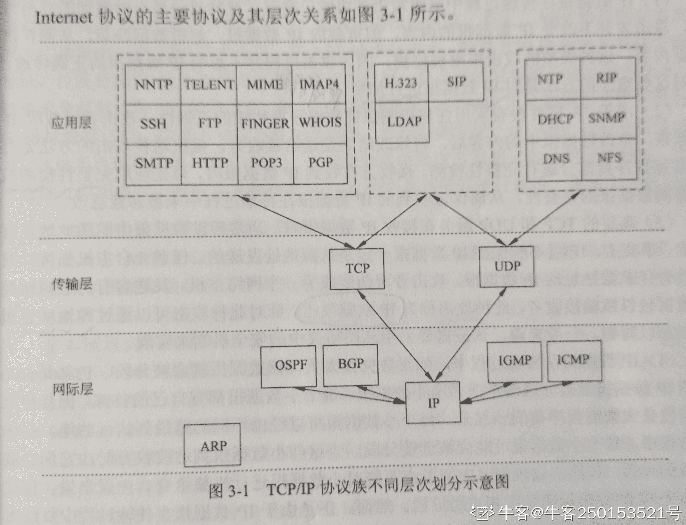

# 奇安信 2019 春招安全试题

## 1

以下工具或命令不能实现端口转发是（）

正确答案: D   你的答案: 空 (错误)

```cpp
ssh
```

```cpp
netsh
```

```cpp
htran
```

```cpp
msbuild
```

本题知识点

安全工程师 奇安信 2019

讨论

[错空](https://www.nowcoder.com/profile/795353638)

ssh 可以实现本地端口转发,远程端口转发,动态端口转发。 https://www.cnblogs.com/keerya/articles/7612715.html netsh 端口转发: https://www.jianshu.com/p/3b108844729e htran 端口转发: https://cloud.tencent.com/developer/article/1365274 MSBuild: MSBuild 是 Microsoft 和 Visual Studio 的生成系统。可以用来绕过 AppLocker https://mp.weixin.qq.com/s?__biz=MzI0MDY1MDU4MQ==&amp;amp;amp;idx=3&amp;amp;amp;mid=2247485170&amp;amp;amp;sn=aaeff82030075ceefa342a86664395a5 更多端口转发工具 http://blog.sina.cn/dpool/blog/s/blog_777f9dbb0101008r.html?vt=4 https://www.freebuf.com/articles/web/170970.html

编辑于 2020-03-01 22:57:05

* * *

[slug01sh](https://www.nowcoder.com/profile/478338830)

msbuild 是 windows 端的构建工具

发表于 2020-10-30 11:24:39

* * *

## 2

下列可用于 PHP 反序列化漏洞利用的伪协议是（）

正确答案: B   你的答案: 空 (错误)

```cpp
php://file
```

```cpp
php://phar
```

```cpp
php://input
```

```cpp
php://zlib
```

本题知识点

安全工程师 奇安信 2019

讨论

[错空](https://www.nowcoder.com/profile/795353638)

php://phar 是用来读取 phar 文件的 phar 文件在使用特定的函数时会触发反序列化漏洞具体利用方法 https://paper.seebug.org/680/

发表于 2020-03-01 23:01:55

* * *

## 3

下列命令中不能用来反弹 Shell 是（）

正确答案: D   你的答案: 空 (错误)

```cpp
bash
```

```cpp
nc
```

```cpp
icmpsh
```

```cpp
cscript
```

本题知识点

安全工程师 奇安信 2019

讨论

[Issabella](https://www.nowcoder.com/profile/585403172)

Linux 反弹 bash nc. Curl. Windows 反弹 powercat  reverseudpshell  icmpsh（反向 ICMP shell）

发表于 2021-03-31 10:22:43

* * *

## 4

SSRF 可被攻击者用来（）

正确答案: A B C   你的答案: 空 (错误)

```cpp
对本地进行端口扫描
```

```cpp
对内网 Web 应用进行指纹识别
```

```cpp
利用 file 协议读取本地文件
```

```cpp
可用来进行钓鱼攻击
```

本题知识点

安全工程师 奇安信 2019

讨论

[glory](https://www.nowcoder.com/profile/455298)

[`www.freebuf.com/articles/web/20407.html`](https://www.freebuf.com/articles/web/20407.html)

发表于 2020-03-16 19:34:02

* * *

## 5

下列哪些工具可用于文件下载（）

正确答案: A B D   你的答案: 空 (错误)

```cpp
Certutil
```

```cpp
Bitadmin
```

```cpp
Net.exe
```

```cpp
Powershell
```

本题知识点

安全工程师 奇安信 2019

讨论

[樱花漫想](https://www.nowcoder.com/profile/8353958)

Certutil.exe 是一个命令行程序，作为证书服务的一部分安装。您可以使用 Certutil.exe 转储和显示证书颁发机构（CA）配置信息，配置证书服务，备份和还原 CA 组件，以及验证证书，密钥对和证书链。

发表于 2020-05-31 09:37:10

* * *

[松居士](https://www.nowcoder.com/profile/250153521)

在 windows 的环境下，dos 窗口里有以下多个命令支持下载。最常用的有 powershell、vbs、certutil、bitadmin 等命令[`www.jianshu.com/p/bdf67ffe0b21`](https://www.jianshu.com/p/bdf67ffe0b21)

发表于 2020-06-14 22:13:18

* * *

## 6

关于 WannaCry 勒索病毒说法正确的是（）

正确答案: A B C   你的答案: 空 (错误)

```cpp
利用 MS17-010 漏洞进行传播
```

```cpp
源于“方程式黑客组织”的工具被公开
```

```cpp
文件加密后会添加后缀 .WNCRYT
```

```cpp
关闭 445、3389 等端口可阻断传播
```

本题知识点

安全工程师 奇安信 2019

讨论

[Ricardo123](https://www.nowcoder.com/profile/813062985)

D 选项应该是关闭 445 和 139 端口

发表于 2020-02-29 12:35:35

* * *

[ciphersaw](https://www.nowcoder.com/profile/543695)

针对本题，笔者罗列了 WannaCry 勒索病毒的相关概况：
1）WannaCry 是一种利用**EternalBlue（永恒之蓝）**工具，对 Windows 系统计算机进行攻击的勒索病毒。2）WannaCry 会利用 AES-128 和 RSA 算法，恶意加密用户文件，以勒索比特币，加密后文件**后缀会变成“.WNCRY”或“.WNCRYT”**。
3）EternalBlue 是 NSA（美国国家安全局）下的**Equation Group（方程式组织）**开发的系列漏洞利用工具之一，于 2017 年 4 月 14 日被黑客组织 Shadow Brokers（影子经纪人）泄漏。
4）EternalBlue 主要是利用一系列**Windows SMB 远程代码执行漏洞**，针对 445 网络端口完成入侵，此漏洞在微软发布的**MS17-010 补丁**中被修复。

综上，可知 WannaCry 勒索病毒**并不会利用 3389 端口**（用于 Windows 远程桌面协议）。
值得一提的是，**MS17-010 是补丁名称，称之为“MS17-010 漏洞”并不严谨**，此处应理解为“MS17-010 补丁所修复的漏洞中，包含了 WannaCry 所利用的 SMB 远程代码执行漏洞”。
权衡之下，ABC 为最优正解。

编辑于 2021-07-03 19:22:07

* * *

## 7

以下哪几种工具可以对网站进行自动化 Web 漏洞扫描（）

正确答案: A B D   你的答案: 空 (错误)

```cpp
AWVS
```

```cpp
APPScan
```

```cpp
Fiddler
```

```cpp
Netsparker
```

本题知识点

安全工程师 奇安信 2019

讨论

[松居士](https://www.nowcoder.com/profile/250153521)

AWVS 是业界非常推荐的漏洞扫描神器，它拥有数目非常多而且最强大的漏洞检测脚本，国内多数人使用破解版，它可以进行自动化 web 漏洞扫描。IBM appscan 是国外 IBM 安全公司的一款非常厉害的安全漏洞扫描产品，能够扫描各种生产环境的 WEB，也就是说它也可以进行自动化 web 漏洞扫描。Netsparker 是一款综合型的 web 应用安全漏洞扫描工具，它分为专业版和免费版，免费版的功能也比较强大。Netsparker 与其他综合 性的 web 应用安全扫描工具相比的一个特点是它能够更好的检测 SQL Injection 和 Cross-site Scripting 类型的安全漏洞。 

发表于 2020-06-14 22:07:23

* * *

[Ricardo123](https://www.nowcoder.com/profile/813062985)

Fiddler 是一个[http 协议](https://baike.baidu.com/item/http%E5%8D%8F%E8%AE%AE/243074)调试代理工具，它能够记录并检查所有你的电脑和互联网之间的 http 通讯，设置断点，查看所有的“进出”Fiddler 的数据（指[cookie](https://baike.baidu.com/item/cookie/1119),html,js,css 等文件）。 发表于 2020-02-29 12:37:53

* * *

## 8

SQL 注入的时候读取 MySQL 安装路径的 SQL 查询语句是（）

正确答案: C   你的答案: 空 (错误)

```cpp
select @@version
```

```cpp
select @@datadir
```

```cpp
select @@basedir
```

```cpp
select database()
```

本题知识点

安全工程师 奇安信 2019

讨论

[Pluto4ever](https://www.nowcoder.com/profile/410318549)

c ，select @@basedir 获取安装路径；其他：select @@datadir 数据库路径 select version() 获取版本

发表于 2020-04-02 10:43:31

* * *

[WHY_Hannie](https://www.nowcoder.com/profile/539843194)

[`www.cnblogs.com/phpper/p/10773004.html`](https://www.cnblogs.com/phpper/p/10773004.html)似乎相关

发表于 2020-03-19 21:08:01

* * *

[牛客 125262051 号](https://www.nowcoder.com/profile/125262051)

C，安装的时候记得是 basedir 

发表于 2021-04-28 22:25:12

* * *

## 9

Oracle 数据库默认服务端口是（）

正确答案: D   你的答案: 空 (错误)

```cpp
1433
```

```cpp
3306
```

```cpp
3389
```

```cpp
1521
```

本题知识点

安全工程师 奇安信 2019 C++工程师 牛客

讨论

[Ricardo123](https://www.nowcoder.com/profile/813062985)

端口 1433 是 SQL Server 默认的端口、SQL Server 服务使用两个端口：TCP-1433、UDP-1434。其中 1433 用于供 SQL Server 对外提供服务，1434 用于向请求者返回 SQL Server 使用了哪个 TCP/IP 端口。
端口 3306 是 MySQL 的默认端口。端口 3389 是 Windows Server 远程桌面的服务端口，可以通过这个端口，用远程桌面等连接工具来连接到远程的服务器，如果连接上了，输入系统管理员的用户名和密码后，将会变得可以像本机一样操作远程的电脑，因此远程服务器一般都将这个端口修改数值或者关闭。

发表于 2020-02-29 12:57:02

* * *

## 10

下列微软数据库（SQL Server）系统存储过程中哪些可以被攻击者用来提权（）

正确答案: A B C   你的答案: 空 (错误)

```cpp
xp_cmdshell
```

```cpp
sp_oacreate
```

```cpp
openrowset
```

```cpp
sp_replcmds
```

本题知识点

安全工程师 奇安信 2019

讨论

[松居士](https://www.nowcoder.com/profile/250153521)

使用 sp_oacreate 进行提权

--提权语句--sp_configure 的作用是显示或更改当前服务器的全局配置设置，执行成功返回 0，失败返回 1

使用 xp_cmdshell 进行提权使用沙盒进行提权 openrowset 是可以通过 OLE DB 访问 SQL Server 数据库，OLE DB 是应用程序链接到 SQL Server 的的驱动程序。具体：[`blog.51cto.com/11797152/2411770`](https://blog.51cto.com/11797152/2411770) 

发表于 2020-06-14 21:55:26

* * *

## 11

MySQL 盲注可用的函数或方法有哪些（）

正确答案: A B C D   你的答案: 空 (错误)

```cpp
Sleep
```

```cpp
Benchmark
```

```cpp
笛卡尔积
```

```cpp
 RLIKE
```

本题知识点

安全工程师 奇安信 2019

讨论

[松居士](https://www.nowcoder.com/profile/250153521)

[`www.cnblogs.com/-qing-/p/10894310.html`](https://www.cnblogs.com/-qing-/p/10894310.html)

发表于 2020-06-14 21:31:27

* * *

## 12

用来识别通过代理访问 Web 服务器的客户端最原始的 IP 地址的 HTTP 字段是（）

正确答案: A   你的答案: 空 (错误)

```cpp
X_FORWARDED_FOR
```

```cpp
CLIENT_IP
```

```cpp
REMOTE_ADDR
```

```cpp
REFERER
```

本题知识点

安全工程师 奇安信 2019

讨论

[松居士](https://www.nowcoder.com/profile/250153521)

X-Forwarded-For(XFF)是用来识别通过 HTTP 代理或负载均衡方式连接到 Web 服务器的客户端最原始的 IP 地址的 HTTP 请求头字段。 

发表于 2020-06-14 21:25:41

* * *

## 13

以下命令可以用来获取 DNS 记录的是（）

正确答案: D   你的答案: 空 (错误)

```cpp
ping
```

```cpp
who
```

```cpp
traceroute
```

```cpp
dig
```

本题知识点

安全工程师 奇安信 2019

讨论

[松居士](https://www.nowcoder.com/profile/250153521)

dig 和 nslookup

发表于 2020-06-14 21:21:20

* * *

## 14

LDAP 协议运行的端口是（）

正确答案: A   你的答案: 空 (错误)

```cpp
389
```

```cpp
110
```

```cpp
53
```

```cpp
161
```

本题知识点

安全工程师 奇安信 2019

讨论

[松居士](https://www.nowcoder.com/profile/250153521)

LDAP:   轻量级目录访问协议运行在  tcp/ip 之上， 一般使用 389 端口进行数据传输

发表于 2020-06-14 21:19:15

* * *

[Mahdis](https://www.nowcoder.com/profile/3633998)

可以

发表于 2020-07-11 12:30:10

* * *

## 15

在 TCP/IP 模型中，下列哪些是网络层中的协议（）

正确答案: A D   你的答案: 空 (错误)

```cpp
ICMP
```

```cpp
SMTP
```

```cpp
SNMP
```

```cpp
ARP
```

本题知识点

安全工程师 奇安信 2019

讨论

[松居士](https://www.nowcoder.com/profile/250153521)

SMTP：简单邮件传输协议 SNMP：简单网络管理协议 SMTP 和 SNMP 都是应用层协议

发表于 2020-06-14 21:15:45

* * *

[Archs](https://www.nowcoder.com/profile/608059020)

牛客网上 ARP 是第三层，但是自定向下这本书里面是第二层协议，所以面试应该不会出这种题，真出了写第三层保守点

发表于 2020-08-14 17:08:45

* * *

## 16

用于隐蔽信道攻击利用的常见协议有（）

正确答案: A B D   你的答案: 空 (错误)

```cpp
HTTP
```

```cpp
DNS
```

```cpp
FTP
```

```cpp
ICMP
```

本题知识点

安全工程师 奇安信 2019

讨论

[2er0x](https://www.nowcoder.com/profile/713195244)

不加密

发表于 2020-07-17 22:17:02

* * *

[阿雷～～](https://www.nowcoder.com/profile/7126429)

通过隐蔽信道（Covert Channel）从目标主机获取数据——[`www.sohu.com/a/312055679_354899`](https://www.sohu.com/a/312055679_354899)

发表于 2020-06-14 10:43:41

* * *