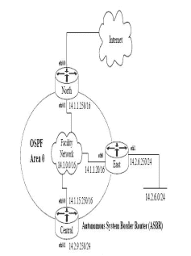

# 奇安信 2019 春招-安服试题

## 1

在 Win2003 下 netstat 的哪个参数可以看到打开该端口的 PID（ ）

正确答案: C   你的答案: 空 (错误)

```cpp
–a
```

```cpp
–n
```

```cpp
–o
```

```cpp
–p
```

本题知识点

Java 工程师 C++工程师 安全工程师 奇安信 2019

讨论

[选 C 好](https://www.nowcoder.com/profile/154246857)

 -a            显示所有连接和侦听端口。 -n            以数字形式显示地址和端口号。
 -o            显示拥有的与每个连接关联的进程 ID。

发表于 2021-09-06 22:08:48

* * *

## 2

no ip bootp server 命令的目的是（ ）

正确答案: B   你的答案: 空 (错误)

```cpp
禁止代理 ARP          

```

```cpp
禁止作为启动服务器
```

```cpp
禁止远程配置
```

```cpp
禁止 IP 源路由
```

本题知识点

Java 工程师 C++工程师 安全工程师 奇安信 2019

## 3

在以下 OSI 七层模型中，synflooding 攻击发生在哪层（ ）

正确答案: C   你的答案: 空 (错误)

```cpp
数据链路层        
```

```cpp
网络层
```

```cpp
传输层         
```

```cpp
应用层
```

本题知识点

Java 工程师 C++工程师 安全工程师 奇安信 2019

讨论

[抽象带篮子官方频道](https://www.nowcoder.com/profile/1298904)

Synflooding（同步泛滥技术）攻击手段 其实就是 DDOS 攻击 通过大量的虚假 IP 地址建立不完整连接，使得服务器超载，陷入瘫痪状态。这种攻击的特点是简单，没有任何技术含量，稍微懂一点 IP 技术的人都可以实施。 当年的 ping 白宫网站 哈哈哈哈哈哈  传输层

编辑于 2020-02-28 15:01:36

* * *

## 4

设置 IP 地址 MAC 绑定的目的：（）

正确答案: B   你的答案: 空 (错误)

```cpp
防止泄露网络拓扑
```

```cpp
防止非法接入
```

```cpp
加强认证
```

```cpp
防止 DOS 攻击
```

本题知识点

Java 工程师 C++工程师 安全工程师 奇安信 2019

讨论

[牛客 44183979 号](https://www.nowcoder.com/profile/44183979)

设置 IP 地址绑定 MAC 地址后可以防止人员私接外来设备污染局域网

发表于 2020-03-04 15:04:40

* * *

## 5

windows 中与另一台机器建立 IPC$匿名空会话连接的命令是（ ）

正确答案: D   你的答案: 空 (错误)

```cpp
net user \\192.168.0.1\IPC$
```

```cpp
net use \\192.168.0.1\IPC$ user:Administrator / passwd: aaa
```

```cpp
net user \192.168.0.1IPC$
```

```cpp
net use \\192.168.0.1\IPC$
```

本题知识点

Java 工程师 C++工程师 安全工程师 奇安信 2019

## 6

在 CISCO 设备的接口上防止 SMURF 攻击的命令：（）

正确答案: A   你的答案: 空 (错误)

```cpp
Router(Config-if)# no ip directed-broadcast
```

```cpp
Router(Config-if)# no ip proxy-arp
```

```cpp
Router(Config-if)# no ip redirects
```

```cpp
Router(Config-if)# no ip mask-reply
```

本题知识点

Java 工程师 C++工程师 安全工程师 奇安信 2019

讨论

[牛客 44183979 号](https://www.nowcoder.com/profile/44183979)

SMURF 攻击原理是冒充受害机器 H3 的 IP 地址在网络中广播发送 ICMP echo 包，收到该包的这些大量机器会发送大量的 ICMP echo-reply 包回复给受害机器 H3,造成受害机器 H3 系统资源被耗尽，属于分布式拒绝服务攻击 ddos。

```cpp
no ip directed-broadcast
```

禁止转发主机位全为 1 的广播包转发

编辑于 2020-03-04 15:13:11

* * *

## 7

 TCP/IP 协议的 4 层概念模型是 （）

正确答案: A   你的答案: 空 (错误)

```cpp
应用层、传输层、网络层和网络接口层 
```

```cpp
应用层、传输层、网络层和物理层 
```

```cpp
应用层、数据链路层、网络层和网络接口层 
```

```cpp
会话层、数据链路层、网络层和网络接口层 
```

本题知识点

Java 工程师 C++工程师 安全工程师 奇安信 2019

## 8

在 solaris 8 下,对于/etc/shadow 文件中的一行内容如下

```cpp
root:3vd4NTwk5UnLC:9038::::::
```

以下说法正确的是:（ ）
 正确答案: D   你的答案: 空 (错误)

```cpp
这里的 3vd4NTwk5UnLC 是可逆的加密后的密码.
```

```cpp
这里的 9038 是指从 1970 年 1 月 1 日到现在的天数 
```

```cpp
这里的 9038 是指从 1980 年 1 月 1 日到最后一次修改密码的天数 
```

```cpp
其他都不正确  
```

本题知识点

Java 工程师 C++工程师 安全工程师 奇安信 2019

讨论

[牛客 44183979 号](https://www.nowcoder.com/profile/44183979)

1、密码不可逆 2、9038 指从 1970 年 1 月 1 日开始算起到密码最后修改时间

发表于 2020-03-04 15:46:19

* * *

## 9

在进行路由器的安全配置时，一般通过访问控制策略，保证各接口只转发属于自己 ip 范围内的源地址数据包流出。比如：在对外接口上，设置如下策略，拒绝 10.0.0.0 0、192.168.0.0、172.16.0.0 等私网地址数据包的进入。（）

正确答案: B   你的答案: 空 (错误)

```cpp
源路由攻击（Source Routing Attacks）
```

```cpp
源 IP 地址欺骗式攻击（Source IP Address Spoofing Attacks）
```

```cpp
Ping of Death 
```

```cpp
特洛伊木马攻击（Trojan horse） 
```

本题知识点

Java 工程师 C++工程师 安全工程师 奇安信 2019

## 10

当系统里只有一个 Administrator 帐户，注册失败的次数达到设置时，该帐户是否被锁住 (   )

正确答案: B   你的答案: 空 (错误)

```cpp
是，锁定 
```

```cpp
否，即不锁定
```

本题知识点

Java 工程师 C++工程师 安全工程师 奇安信 2019

讨论

[牛客 935006236 号](https://www.nowcoder.com/profile/935006236)

账户不锁定；帐户锁定策略对 Administrator 无效

发表于 2020-08-31 21:40:44

* * *

## 11

某种技术被用来转换对外真正 IP 地址与局域网络内部的虚拟 IP 地址，可以解决合法 IP 地址不足的问题，并隐藏内部的 IP 地址，保护内部网络的安全，这种技术是什么？（）

正确答案: B   你的答案: 空 (错误)

```cpp
地址过滤
```

```cpp
NAT
```

```cpp
反转  
```

```cpp
认证
```

本题知识点

Java 工程师 C++工程师 安全工程师 奇安信 2019

讨论

[牛客 948497577 号](https://www.nowcoder.com/profile/948497577)

NAT(Network Address Translation)网络地址转换技术，私网地址访问外网的时候通过 NAT 技术可以将源内网 IP 转换为外网 IP，从而保护私网的源 IP。

发表于 2020-08-22 10:55:01

* * *

## 12

关于 smurf 攻击，描述不正确的是下面哪一项？（）

正确答案: D   你的答案: 空 (错误)

```cpp
Smurf 攻击是一种拒绝服务攻击，由于大量的网络拥塞，可能造成中间网络或目的网络的拒绝服务。
```

```cpp
攻击者发送一个 echo request 广播包到中间网络，而这个包的源地址伪造成目的主机的地址。中间网络上的许多“活”的主机会响应这个源地址。攻击者的主机不会接受到这些冰雹般的 echo replies 响应，目的主机将接收到这些包。
```

```cpp
Smurf 攻击过程利用 ip 地址欺骗的技术。
```

```cpp
Smurf 攻击是与目标机器建立大量的 TCP 半连接，耗尽系统的连接资源，达到拒绝服务攻击的目的。
```

本题知识点

Java 工程师 C++工程师 安全工程师 奇安信 2019

讨论

[风吹过。201911101439591](https://www.nowcoder.com/profile/174378319)

d 是 sys 攻击

发表于 2020-07-31 15:30:43

* * *

## 13

在进行 Sniffer 监听时，系统将本地网络接口卡设置成何种侦听模式？

正确答案: D   你的答案: 空 (错误)

```cpp
 unicast 单播模式    
```

```cpp
Broadcast（广播模式）
```

```cpp
Multicast（组播模式）
```

```cpp
Promiscuous 混杂模式， 
```

本题知识点

Java 工程师 C++工程师 安全工程师 奇安信 2019

讨论

[牛客 935006236 号](https://www.nowcoder.com/profile/935006236)

混杂模式就是接收所有经过网卡的数据包，包括不是发给本机的包。默认情况下，网卡只把发给本机的包（包括广播包）传递给上层程序，其他的包一律丢弃。

混杂模式就是指网卡能接受所有通过它的数据流，无论是什么模式、什么地址的。当网卡处于这种“混杂”模式时，它对所有遇到的每一个数据帧都产生一个硬件中断，以提醒操作系统处理流经该物理媒体上的每一个报文包。

发表于 2020-08-31 22:05:21

* * *

[牛客 44183979 号](https://www.nowcoder.com/profile/44183979)

混杂模式：接收目的地址不是自己的数据包

发表于 2020-03-04 15:47:56

* * *

## 14

TCP/IP 三次握手的通信过程是？（）

正确答案: D   你的答案: 空 (错误)

```cpp
——SYN/ACK——>，<——ACK，——SYN/ACK——>
```

```cpp
——SYN/ACK——>，<——SYN/ACK——，——ACK——>
```

```cpp
——SYN——>，<——ACK，——SYN——>，<——ACK——
```

```cpp
——SYN——>，<——SYN/ACK——，——ACK——>
```

本题知识点

Java 工程师 C++工程师 安全工程师 奇安信 2019

## 15

使用 TCP 79 端口的服务是？（）

正确答案: D   你的答案: 空 (错误)

```cpp
telnet
```

```cpp
SMTP
```

```cpp
NTP
```

```cpp
Finger
```

本题知识点

Java 工程师 C++工程师 安全工程师 奇安信 2019

## 16

客户使用哪种协议收取自己的电子邮件？（）

正确答案: B   你的答案: 空 (错误)

```cpp
SMTP
```

```cpp
POP3
```

```cpp
FTP
```

```cpp
HTTP
```

本题知识点

Java 工程师 C++工程师 安全工程师 奇安信 2019

## 17

BOTNET 是？（）

正确答案: C   你的答案: 空 (错误)

```cpp
普通病
```

```cpp
木马程序
```

```cpp
僵尸网络
```

```cpp
蠕虫病毒
```

本题知识点

Java 工程师 C++工程师 安全工程师 奇安信 2019

讨论

[神话,](https://www.nowcoder.com/profile/428322885)

僵尸网络 Botnet 是指采用一种或多种传播手段，将大量主机感染 bot 程序（僵尸程序）病毒，从而在控制者和被感染主机之间所形成的一个可一对多控制的网络 。

发表于 2020-08-15 16:42:18

* * *

## 18

SYN Flooding 攻击的原理是什么？（）

正确答案: A   你的答案: 空 (错误)

```cpp
有些操作系统协议栈在处理 TCP 连接时，其缓存区有限的空间不能装载过多的连接请求，导致系统拒绝服务
```

```cpp
有些操作系统在实现 TCP/IP 协议栈时，不能很好地处理 TCP 报文的序列号紊乱问题，导致系统崩溃
```

```cpp
有些操作系统在实现 TCP/IP 协议栈时，不能很好地处理 IP 分片包的重叠情况，导致系统崩溃
```

```cpp
有些操作系统协议栈在处理 IP 分片时，对于重组后超大的 IP 数据包不能很好得处理，导致缓存溢出而系统崩溃
```

本题知识点

Java 工程师 C++工程师 安全工程师 奇安信 2019

## 19

将日志从路由器导向服务器的命令是:（）

正确答案: D   你的答案: 空 (错误)

```cpp
Logging on
```

```cpp
Logging buffer <size>
```

```cpp
Logging buffer 1
```

```cpp
Logging 1.1.1.2
```

本题知识点

Java 工程师 C++工程师 安全工程师 奇安信 2019

## 20

下列哪些属于自主开发的 web 脚本程序编写不当造成的（）

正确答案: C   你的答案: 空 (错误)

```cpp
IIS5.0 Webdav ntdll.dll 远程缓冲区溢出漏洞
```

```cpp
apache 可以通过../../../../../../../etc/passwd 访问系统文件
```

```cpp
可以用 password=’a’ or ‘a’=’a’绕过验证
```

本题知识点

Java 工程师 C++工程师 安全工程师 奇安信 2019

## 21

/etc/ftpuser 文件中出现的账户的意义表示是？ （）

正确答案: A   你的答案: 空 (错误)

```cpp
该账户不可登陆 ftp
```

```cpp
该账户可以登陆 ftp
```

```cpp
没有关系
```

本题知识点

Java 工程师 C++工程师 安全工程师 奇安信 2019

讨论

[牛客 935006236 号](https://www.nowcoder.com/profile/935006236)

ftpuser 文件表示禁止

发表于 2020-08-31 22:11:14

* * *

## 22

Solaris 系统使用什么命令查看已有补丁的列表（）

正确答案: B   你的答案: 空 (错误)

```cpp
uname -an
```

```cpp
showrev -p
```

```cpp
oslevel -r
```

本题知识点

Java 工程师 C++工程师 安全工程师 奇安信 2019

讨论

[牛客 263523479 号](https://www.nowcoder.com/profile/263523479)

```cpp
oslevel -r
```

是 AIX 的

```cpp
uname -an
```

是 Linux 的

```cpp
showrev -p
```

才是 Solaris 的

发表于 2021-03-17 19:21:20

* * *

## 23

要限制用户连接 vty，只允许 IP1.1.1.1 可以连接，下面哪一个配置适用：（）

正确答案: C   你的答案: 空 (错误)

```cpp
：access-list 1 permit host 1.1.1.1 0.0.0.0
   line vty 0 4
   access-class 1 in

```

```cpp
：access-list 1 permit 1.1.1.1 255.255.255.255
   line vty 0 4 
   access-class 1 in

```

```cpp
：access-list 1 permit 1.1.1.1 0.0.0.0
   line vty 66 70
   access-class 1 in
```

```cpp
：access-list 1 permit 1.1.1.1
   line vty 0 4
   access-group 1 in

```

本题知识点

Java 工程师 C++工程师 安全工程师 奇安信 2019

## 24

ORACLE 的数据库监听器（LISTENER）的默认通讯端口是？（）

正确答案: A   你的答案: 空 (错误)

```cpp
TCP 1521
```

```cpp
TCP 1025
```

```cpp
TCP 1251
```

```cpp
CP 1433
```

本题知识点

Java 工程师 C++工程师 安全工程师 奇安信 2019

## 25

配置 console 日志为 2 级，下面哪一个命令适用：（）

正确答案: B   你的答案: 空 (错误)

```cpp
logging buffer
```

```cpp
logging console critical
```

```cpp
logging monitor information
```

```cpp
logging console information
```

本题知识点

Java 工程师 C++工程师 安全工程师 奇安信 2019

讨论

[牛客 935006236 号](https://www.nowcoder.com/profile/935006236)

关键字             等级     描述

Emergencies     0      紧急情况，系统不能正常运行

Alerts                1      需要立即采取措施改正的问题

Critical              2     重要情况

Errors               3     错误信息

warnings          4    警告信息

Notifications     5    普通类型，不过需要关注的重要信息

informational    6    说明性的信息

Debugging      7     调试信息

值越小，级别越高，即 0 级别的信息是最高级别的信息。

当指定设备允许显示的日志信息级别以后，等于或低于所设置值级别的日志信息将被允许显示。

发表于 2020-09-01 10:08:30

* * *

## 26

一般网络设备上的 SNMP 默认可读团体字符串是：（）

正确答案: A   你的答案: 空 (错误)

```cpp
PUBLIC
```

```cpp
CISCO
```

```cpp
DEFAULT
```

```cpp
PRIVATE
```

本题知识点

Java 工程师 C++工程师 安全工程师 奇安信 2019

讨论

[flyballon](https://www.nowcoder.com/profile/599485433)

简单网络管理协议（SNMP）是 TCP／IP 协议簇的一个应用层协议，工作在 UDP 161 端口，用于监控目标设备的操作系统、硬件设备、服务应用、软硬件配置、网络协议状态、设备性能及资源利用率、设备报错事件信息、应用程序状态等软硬件信息。

发表于 2020-09-02 14:16:53

* * *

[牛客 935006236 号](https://www.nowcoder.com/profile/935006236)

snmp 默认团体名属于 snmp 默认弱口令 public/privicy。在 win7 本机上开启 snmp 服务，并添加 pubilc 团体名和允许远程连接后（window 默认没有接受的团体名也就是社团名称，且不允许远程连接）

发表于 2020-09-01 10:20:30

* * *

## 27

管理员创建一个文件，这个文件的权限为“-rwxrw-r—”，代表什么意思？（）

正确答案: A   你的答案: 空 (错误)

```cpp
管理员可读写及可执行，管理员组用户可读写，其他用户可读

```

```cpp
管理员可读，管理员组用户可读写，其他用户可读写及可执行
```

```cpp
管理员可读写及可执行，其他用户可读写，管理员组用户可读
```

```cpp
管理员可读写，管理员组用户可读，其他用户可读写及可执行
```

本题知识点

Java 工程师 C++工程师 安全工程师 奇安信 2019

## 28

NTP 服务一般开启的端口是：（）

正确答案: C   你的答案: 空 (错误)

```cpp
UDP 110 
```

```cpp
UDP 79 
```

```cpp
UDP 123 
```

```cpp
UDP 161
```

本题知识点

Java 工程师 C++工程师 安全工程师 奇安信 2019

讨论

[牛客 935006236 号](https://www.nowcoder.com/profile/935006236)

NTP 默认使用的端口号是 UDP123。

发表于 2020-09-01 10:23:32

* * *

## 29

在 Linux 系统中，下面哪条命令可以找到文件系统中的具有 suid/sgid 标记位的文件：（）

正确答案: C   你的答案: 空 (错误)

```cpp
find / -type d  \( -perm -4000 -o -perm -2000 \) –print
```

```cpp
find / -type f  \( -perm -4000 -a -perm -2000 \) –print
```

```cpp
find / -type f  \( -perm -4000 -o -perm -2000 \) –print
```

```cpp
find / -nouser -o -nogroup –print
```

本题知识点

Java 工程师 C++工程师 安全工程师 奇安信 2019

讨论

[封玉](https://www.nowcoder.com/profile/972810200)

一条最常用的 find 命令－－在当前目录及子目录下查找所有以 file 开头的文件名。$ find . -name 'file*' $ find / -name 'vimrc' $ find ~ -name '*.c'

发表于 2020-05-13 15:54:55

* * *

## 30

下列操作中可以禁用 Cisco 设备的路由重定向功能的操作是？ （）

正确答案: A   你的答案: 空 (错误)

```cpp
Router(config-if)# no ip redirects
```

```cpp
Router(config-if)# no ip mask-reply
```

```cpp
Router(config-if)# no ip directed-broadcast
```

```cpp
Router(config-if)# no ip proxy-arp
```

本题知识点

Java 工程师 C++工程师 安全工程师 奇安信 2019

讨论

[牛客 935006236 号](https://www.nowcoder.com/profile/935006236)

no ip redirects
关闭发送 icmp 重定向报文的功能

发表于 2020-09-01 10:27:55

* * *

## 31

 Nmap 不使用 ping 进行扫描的参数是什么（ ）

正确答案: A   你的答案: 空 (错误)

```cpp
–Pn
```

```cpp
–sS
```

```cpp
–n
```

```cpp
 –Sp
```

本题知识点

Java 工程师 C++工程师 安全工程师 奇安信 2019

讨论

[牛客 935006236 号](https://www.nowcoder.com/profile/935006236)

   –sS：TCP SYN 扫描，半开放扫描，扫描速度快，不易被注意到（不完成 TCP 连接）；l  -Pn/-P0：将所有指定的主机视作开启的，跳过主机发现的过程

l  -sP：Ping Scan 只利用 ping 扫描进行主机发现，不进行端口扫描

n  默认情况下发送 ICMP 回声请求和一个 TCP 报文到 80 端口，非特权用户发送一个 SYN 报文到 80 端口

n  可以和除-P0 之外的任何发现探测类型-P*选项结合使用以达到更高的灵活性

发表于 2020-09-01 10:38:54

* * *

## 32

以下哪种方式不能提升 HTTPS 的安全性？  （ ）

正确答案: D   你的答案: 空 (错误)

```cpp
–HSTS
```

```cpp
–HTTPS Preload
```

```cpp
-Cookie 的 secure 属性
```

```cpp
–Cookie 的 HTTP Only 属性
```

本题知识点

Java 工程师 C++工程师 安全工程师 奇安信 2019

讨论

[樱花漫想](https://www.nowcoder.com/profile/8353958)

```cpp
–Cookie 的 HTTP Only 属性
```

防止 XSS 漏洞的

发表于 2020-05-31 13:19:16

* * *

[牛客 935006236 号](https://www.nowcoder.com/profile/935006236)

**HTTP 严格传输安全协议** (**HTTP Strict Transport Security**，简称：**HSTS**），是一套由互联网工程任务组发布的互联网安全策略机制。网站可以选择使用 HSTS 策略，来让浏览器强制使用 HTTPS 与网站进行通信，以减少会话劫持风险。

发表于 2020-09-11 15:38:12

* * *

## 33

判断能否 Flash 跨域产生的文件是哪个（ ）

正确答案: D   你的答案: 空 (错误)

```cpp
robots.txt
```

```cpp
–phpinfo.php
```

```cpp
-index.html
```

```cpp
-crossdomain.xml
```

本题知识点

Java 工程师 C++工程师 安全工程师 奇安信 2019

## 34

Jnz 在汇编中是什么意思（ ）

正确答案: D   你的答案: 空 (错误)

```cpp
不等于 1 跳转

```

```cpp
等于 1 跳转
```

```cpp
无论怎么样都跳转
```

```cpp
不等于 0 跳转
```

本题知识点

Java 工程师 C++工程师 安全工程师 奇安信 2019

讨论

[牛客 263523479 号](https://www.nowcoder.com/profile/263523479)

Jump if No Equal Zero.

发表于 2021-03-17 19:26:33

* * *

## 35

Ssh 密码可以用什么工具爆破（ ）

正确答案: C   你的答案: 空 (错误)

```cpp
-awvs
```

```cpp
–burpsuite
```

```cpp
–hydra
```

```cpp
–sqlmap
```

本题知识点

Java 工程师 C++工程师 安全工程师 奇安信 2019

## 36

用什么方法可以防止 xss（ ）

正确答案: B   你的答案: 空 (错误)

```cpp
token
```

```cpp
csp
```

```cpp
referrer
```

```cpp
httponly
```

本题知识点

Java 工程师 C++工程师 安全工程师 奇安信 2019

讨论

[牛客 935006236 号](https://www.nowcoder.com/profile/935006236)

内容安全策略   ([CSP](https://developer.mozilla.org/zh-CN/docs/Glossary/CSP)) 是一个额外的安全层，用于检测并削弱某些特定类型的攻击，包括跨站脚本 ([XSS](https://developer.mozilla.org/en-US/docs/Glossary/XSS)) 和数据注入攻击等。无论是数据盗取、网站内容污染还是散发恶意软件，这些攻击都是主要的手段。

发表于 2020-09-01 10:51:22

* * *

[Ngai](https://www.nowcoder.com/profile/550829119)

httponly 为什么不对？求大佬解释

发表于 2020-02-23 17:12:08

* * *

## 37

Windows 下抓取 ntlm hash 的工具有哪些（ ）

正确答案: A   你的答案: 空 (错误)

```cpp
mimikatz
```

```cpp
sqlmap
```

```cpp
nmap
```

```cpp
cain
```

本题知识点

Java 工程师 C++工程师 安全工程师 奇安信 2019

## 38

有什么工具可以 hook android app 函数（ ）

正确答案: A   你的答案: 空 (错误)

```cpp
Frida
```

```cpp
charles
```

```cpp
dex2jar
```

```cpp
apktool
```

本题知识点

Java 工程师 C++工程师 安全工程师 奇安信 2019

## 39

以下哪个答案使算式相等，算式:md5($_GET[‘a’]) == md5($_GET[‘b’])（ ）

正确答案: B   你的答案: 空 (错误)

```cpp
a=1&b=1a
```

```cpp
a[]&b[]
```

```cpp
a=0&b=null
```

```cpp
a=a&b=a1
```

本题知识点

Java 工程师 C++工程师 安全工程师 奇安信 2019

## 40

以下代码存在哪几项安全漏洞（ ）

```cpp
<?php
error_reporting(0);
$config_file = 'config.php';
$func = isset($_REQUEST['page'])?$_REQUEST['page']:'index';
call_user_func($func, $_REQUEST); 
function index($data) {
    echo <<<EOF
<form action="?page=admin" method="POST">
    <input name='passwd' placeholder='password'>
    <input type=submit>
</form>
EOF;
}
function admin($data) {
    global $config_file;
    include $config_file;   // load $admin_passwd from config
    if ($data['passwd'] === $admin_passwd)
        echo 'hello ' . $data['passwd'];
    else
        die('fuck off');
}
```

1）LFI
2）SQLI
3）XSS
4）登录绕过
5）反序列化

正确答案: A   你的答案: 空 (错误)

```cpp
存在 0 项
```

```cpp
存在 1 项
```

```cpp
存在 2 项
```

```cpp
存在 3 项
```

本题知识点

Java 工程师 C++工程师 安全工程师 奇安信 2019

## 41

状态码 403 代表含义： （）

正确答案: B   你的答案: 空 (错误)

```cpp
请求资源不存在  
```

```cpp
禁止访问被请求的资源

```

```cpp
程序内部错误  
```

```cpp
浏览器重定向到另外 URL
```

本题知识点

Java 工程师 C++工程师 安全工程师 奇安信 2019

## 42

以下哪个不属于 web 服务器： （）

正确答案: D   你的答案: 空 (错误)

```cpp
Weblogic
```

```cpp
Jboss
```

```cpp
Nginx 
```

```cpp
Redis
```

本题知识点

Java 工程师 C++工程师 安全工程师 奇安信 2019

## 43

客户端将它的操作系统、浏览器和其它属性告诉服务器是通过哪个请求报头域？（）

正确答案: D   你的答案: 空 (错误)

```cpp
Accept-Language 
```

```cpp
Referer
```

```cpp
Location   
```

```cpp
User-Agent
```

本题知识点

Java 工程师 C++工程师 安全工程师 奇安信 2019

## 44

以下这段代码，可能会出现哪种漏洞（）

```cpp
Int cartID = Integer.parseInt(request.getParameter(“cartID”));
Int user = Integer.parseInt(request.getParameter(“UserID”));
PreparedStatement pstmt  =  con.prepareStatement("select * from table where cardID = ? and userID = ?);
……
```

正确答案: D   你的答案: 空 (错误)

```cpp
越权访问漏洞、SQL 注入漏洞  

```

```cpp
SQL 注入漏洞
```

```cpp
跨站脚本漏洞、SQL 注入漏洞
```

```cpp
越权访问漏洞
```

本题知识点

Java 工程师 C++工程师 安全工程师 奇安信 2019

讨论

[牛客 263523479 号](https://www.nowcoder.com/profile/263523479)

parseInt() 方法用于将字符串参数作为有符号的十进制整数进行解析。

如果方法有两个参数， 使用第二个参数指定的基数，将字符串参数解析为有符号的整数。输入的内容强行转为 Int，不存在 SQLi 注入。越权，cardID 和 userID 可能不是对应同属于一个用户的。

发表于 2021-03-17 19:33:19

* * *

## 45

查看 centos 系统是否开启 7001 端口，以下正确的命令是（）

正确答案: C   你的答案: 空 (错误)

```cpp
netstat -anf |grep :7001
```

```cpp
netstat -ane|grop :7001
```

```cpp
 netstat –ano |grep :7001
```

```cpp
netstat -ano |grop :7001
```

本题知识点

Java 工程师 C++工程师 安全工程师 奇安信 2019

讨论

[牛客 935006236 号](https://www.nowcoder.com/profile/935006236)

查看所有端口以及监听端口的 PID，netstat -ano

发表于 2020-09-01 11:09:31

* * *

[牛客 263523479 号](https://www.nowcoder.com/profile/263523479)

提供一个 Windows 的 netstat:  -o               Displays the owning **process ID** associated with each connection.
  -p proto      Shows connections for the **protocol** specified by proto; proto may be any of: TCP, UDP, TCPv6, or UDPv6.

编辑于 2021-03-17 19:35:47

* * *

## 46

关于 SQL 注入漏洞，下列说法不正确的是：（）

正确答案: C   你的答案: 空 (错误)

```cpp
报错型注入
```

```cpp
字符型注入
```

```cpp
反射型注入
```

```cpp
 数字型注入
```

本题知识点

Java 工程师 C++工程师 安全工程师 奇安信 2019

## 47

本地域名劫持(DNS 欺骗)修改的是系统文件（）

正确答案: D   你的答案: 空 (错误)

```cpp
C:\Windows\System32\drivers\etc\lmhosts
```

```cpp
C:\Windows\System32\ etc\lmhosts
```

```cpp
C:\Windows\System32\etc\hosts
```

```cpp
C:\Windows\System32\drivers\etc\hosts
```

本题知识点

Java 工程师 C++工程师 安全工程师 奇安信 2019

## 48

在进行微软数据库（Microsoft SQL Server）口令猜测的时候，我们一般会猜测拥有数据库最高权限登录用户的密码口令，这个用户的名称是（）

正确答案: C   你的答案: 空 (错误)

```cpp
admin
```

```cpp
administrator
```

```cpp
sa
```

```cpp
root
```

本题知识点

Java 工程师 C++工程师 安全工程师 奇安信 2019

## 49

下面哪一项不属于具备远程控制功能的服务? ()

正确答案: C   你的答案: 空 (错误)

```cpp
SSH
```

```cpp
VNC
```

```cpp
NTP
```

```cpp
RDP
```

本题知识点

Java 工程师 C++工程师 安全工程师 奇安信 2019

讨论

[牛客 935006236 号](https://www.nowcoder.com/profile/935006236)

VNC(Virtual Network Console)是[虚拟网络](https://baike.baidu.com/item/%E8%99%9A%E6%8B%9F%E7%BD%91%E7%BB%9C)控制台的缩写。它 是一款优秀的[远程控制](https://baike.baidu.com/item/%E8%BF%9C%E7%A8%8B%E6%8E%A7%E5%88%B6/934368)工具软件，由著名的 [AT&T](https://baike.baidu.com/item/AT%26T) 的欧洲研究实验室开发的。VNC 是在基于 [UNIX](https://baike.baidu.com/item/UNIX) 和 [Linux](https://baike.baidu.com/item/Linux) 操作系统的免费的[开源软件](https://baike.baidu.com/item/%E5%BC%80%E6%BA%90%E8%BD%AF%E4%BB%B6/8105369)，远程控制能力强大，高效实用，其性能可以和 [Windows](https://baike.baidu.com/item/Windows) 和 [MAC](https://baike.baidu.com/item/MAC) 中的任何远程控制软件媲美。 在 Linux 中，VNC 包括以下四个命令：vncserver，vncviewer，vncpasswd，和 vncconnect。大多数情况下用户只需要其中的两个命令：vncserver 和 vncviewer。*RDP*一般指远程桌面协议。远程桌面协议(*RDP*)是一个多通道(multi-channel)的协议，让使用者(所在计算机称为用户端或'本地计算机')连上提供微软终端机服务的计算机(称为服务端或'远程计算机')。

发表于 2020-09-01 11:24:31

* * *

[樱花漫想](https://www.nowcoder.com/profile/8353958)

NTP 服务器【Network Time Protocol（NTP）】是用来使计算机时间同步化的一种协议，它可以使计算机对其服务器或时钟源（如石英钟，GPS 等等)做同步化，它可以提供高精准度的时间校正（LAN 上与标准间差小于 1 毫秒，WAN 上几十毫秒），且可介由加密确认的方式来防止恶毒的协议攻击。时间按 NTP 服务器的等级传播。按照离外部 UTC 源的远近把所有服务器归入不同的 Stratum（层）中。

发表于 2020-05-31 13:22:07

* * *

## 50

在 Oracle 下要创建 java 存储过程不需要以下哪种权限？ （）

正确答案: B   你的答案: 空 (错误)

```cpp
 create procedure
```

```cpp
create dir
```

```cpp
writeFileDescriptor
```

```cpp
readFileDescriptor
```

本题知识点

Java 工程师 C++工程师 安全工程师 奇安信 2019

## 51

利用 Oracle 以下哪种方法不能写文件  （）

正确答案: C   你的答案: 空 (错误)

```cpp
 利用 utl_file 包程序写文件
```

```cpp
 创建 java 存储过程写文件
```

```cpp
 利用 select into outfile 写文件
```

```cpp
 调用 DBMS_SCHEDULER 执行系统命令写文件
```

本题知识点

Java 工程师 C++工程师 安全工程师 奇安信 2019

## 52

要在 oracle 下执行 java 存储过程，需要具备以下那个角色？ （）

正确答案: C   你的答案: 空 (错误)

```cpp
CONNECT
```

```cpp
DBA
```

```cpp
JAVASYSPRIV
```

```cpp
RESOURCE
```

本题知识点

Java 工程师 C++工程师 安全工程师 奇安信 2019

讨论

[牛客 935006236 号](https://www.nowcoder.com/profile/935006236)

**1、系统权限分类：** DBA:拥有全部特权，是系统最高权限，只有 DBA 才可以创建数据库结构。

RESOURCE:拥有 Resource 权限的用户只可以创建实体，不可以创建数据库结构。

CONNECT:拥有 Connect 权限的用户只可以登录 Oracle，不可以创建实体，不可以创建数据库结构。

对于普通用户：授予 connect, resource 权限。
对于 DBA 管理用户：授予 connect，resource, dba 权限。

发表于 2020-09-11 16:23:53

* * *

## 53

Oracle SYSTEM 账户的默认密码是如下哪一个？ （）

正确答案: D   你的答案: 空 (错误)

```cpp
SYSTEM
```

```cpp
SYS
```

```cpp
ORACLE
```

```cpp
MANAGER
```

本题知识点

Java 工程师 C++工程师 安全工程师 奇安信 2019

讨论

[牛客 935006236 号](https://www.nowcoder.com/profile/935006236)

```cpp
system 默认:manager
sys 默认:change_on_install
使用 SQL Plus 登录数据库时，system 使用密码 manager 可直接登录。
但如果是 sys 用户，密码必须加上 as sysdba，即完整密码为：change_on_install as sysdba
```

发表于 2020-09-11 16:25:39

* * *

## 54

在 Oracle 下利用以下哪种方法不能执行系统命令？ （）

正确答案: B   你的答案: 空 (错误)

```cpp
创建 java 存储过程执行命令
```

```cpp
 利用 utl_file 包执行系统命令
```

```cpp
调用 DBMS_SCHEDULER 创建 JOB 执行系统命令
```

```cpp
调用 DBMS_JAVA.RUNJAVA 执行系统命令
```

本题知识点

Java 工程师 C++工程师 安全工程师 奇安信 2019

## 55

以下那一项针对 Oracle TNS 监听器的描述是不正确的？ （）

正确答案: A   你的答案: 空 (错误)

```cpp
 应用程序要使用 JDBC 连接数据库必须配置 TNS  
```

```cpp
TNS 是专门用于管理和配置 Oracle 数据库和客户端连接的工具 
```

```cpp
 TNS 的配置文件是一组以 ora 为扩展名的文本文件 
```

```cpp
 TNS 默认监听在服务器的 1521 端口 
```

本题知识点

Java 工程师 C++工程师 安全工程师 奇安信 2019

## 56

你所使用的系统为 win2000，所有的分区均是 NTFS 的分区，C 区的权限为 everyone 读取和运行，D 区的权限为 everyone 完全控制，现在你将一名为 test 的文件夹，由 C 区移动到 D 区之后，test 文件夹的权限为？  （）

正确答案: B   你的答案: 空 (错误)

```cpp
everyone 读取和运行
```

```cpp
everyone 完全控制
```

```cpp
everyone 读取,运行,写入
```

```cpp
其它选项都不对
```

本题知识点

Java 工程师 C++工程师 安全工程师 奇安信 2019

## 57

你是一企业网络管理员，你使用的防火墙在 UNIX 下的 IPTABLES，你现在需要通过对防火墙的配置不允许 192.168.0.2 这台主机登陆到你的服务器，你应该怎么设置防火墙规则？ （）

正确答案: B   你的答案: 空 (错误)

```cpp
iptables—A input—p tcp—s 192.168.0.2—source—port 23—j DENY
```

```cpp
iptables—A input—p tcp—s 192.168.0.2—destination—port 23—j DENY
```

```cpp
iptables—A input—p tcp—d 192.168.0.2—source—port 23—j DENY
```

```cpp
iptables—A input—p tcp—d 192.168.0.2—destination—port 23—j DENY
```

本题知识点

Java 工程师 C++工程师 安全工程师 奇安信 2019

## 58

 linux 系统列出目前与过去登录了系统的用户信息使用的命令是 （）

正确答案: A   你的答案: 空 (错误)

```cpp
last
```

```cpp
lastlog
```

```cpp
w
```

```cpp
who
```

本题知识点

Java 工程师 C++工程师 安全工程师 奇安信 2019

讨论

[牛客 935006236 号](https://www.nowcoder.com/profile/935006236)

**lastlog*命令 用于显示系统中所有用户最近一次登录信息。* *w 命令*用于显示目前登入系统的用户信息。*who 命令*显示关于当前在本地系统上的所有用户的信息。

发表于 2020-09-11 17:14:45

* * *

## 59

linux 系统用户的 bash 命令历史存放在哪个文件中？（）

正确答案: D   你的答案: 空 (错误)

```cpp
/etc/bash_history  
```

```cpp
/var/log/command_history
```

```cpp
tmp/bash/log 
```

```cpp
~/.bash_history
```

本题知识点

Java 工程师 C++工程师 安全工程师 奇安信 2019

## 60

linux 系统使用什么命令列出进程当前打开的文件？（）

正确答案: B   你的答案: 空 (错误)

```cpp
lsmod
```

```cpp
lsof
```

```cpp
ss
```

```cpp
showmount
```

本题知识点

Java 工程师 C++工程师 安全工程师 奇安信 2019

讨论

[封玉](https://www.nowcoder.com/profile/972810200)

lsof（list open files）是 linux 下一个不常用的命令，可以列出当前系统打开文件的工具。在 linux 环境下，任何事物都以文件的形式存在，通过文件不仅仅可以访问常规数据，还可以访问网络连接和硬件。所以，lsof 的功能很强大。一般 root 用户才能执行 lsof 命令，普通用户可以看见/usr/sbin/lsof 命令，但是普通用户执行会显示“permission denied”。

发表于 2020-05-13 16:03:05

* * *

## 61

linux 系统中使用 netstat 命令的哪个参数可以显示对应的进程名称？（）

正确答案: B   你的答案: 空 (错误)

```cpp
o    
```

```cpp
p
```

```cpp
l
```

```cpp
r
```

本题知识点

Java 工程师 C++工程师 安全工程师 奇安信 2019

讨论

[牛客 263523479 号](https://www.nowcoder.com/profile/263523479)

Linux 下的 netstat 这个-p 和 Windows 的 netstat 的-p 不一样，-o 也不一样.. ( : )
        -r, --route              显示路由表
        -i, --interfaces         display interface table
        -g, --groups             display multicast group memberships
        -s, --statistics         display networking statistics (like SNMP)
        -M, --masquerade         display masqueraded connections
        -v, --verbose            显示详细信息
        -W, --wide               don't truncate IP addresses
        -n, --numeric            不解析名称//!!
        --numeric-hosts          不解析主机名
        --numeric-ports          忽略端口名称
        --numeric-users          忽略用户名
        -N, --symbolic           resolve hardware names
        -e, --extend             显示更多信息
        -p, --programs           display PID/Program name for sockets//!!
        -o, --timers             display timers//!!
        -c, --continuous         continuous listing
        -l, --listening          display listening server sockets
        -a, --all                display all sockets (default: connected)//!
        -F, --fib                display Forwarding Information Base (default)
        -C, --cache              display routing cache instead of FIB
        -Z, --context            display SELinux security context for sockets

发表于 2021-03-17 19:45:39

* * *

## 62

linux 系统中如何使用 rpm 命令检查已安装的软件包的完整性？ （）

正确答案: C   你的答案: 空 (错误)

```cpp
 rpm -qa    
```

```cpp
 rpm -ea    
```

```cpp
rpm -Va   
```

```cpp
 rpm -Ca
```

本题知识点

Java 工程师 C++工程师 安全工程师 奇安信 2019

讨论

[封玉](https://www.nowcoder.com/profile/972810200)

如果用户不小心误删了几个文件，但不确定到底是那些文件，想对整个系统进行校验，以了解哪些部分可能已经损坏，可以用：  # rpm -Va

发表于 2020-05-12 20:55:10

* * *

## 63

下列哪个不是 Activiy 的生命周期（）

正确答案: C   你的答案: 空 (错误)

```cpp
onStart
```

```cpp
onResume
```

```cpp
onDetach
```

```cpp
onDestroy
```

本题知识点

Java 工程师 C++工程师 安全工程师 奇安信 2019

讨论

[牛客 935006236 号](https://www.nowcoder.com/profile/935006236)

各生命周期状态说明

| 方法 | 描述 | 用途（以当前界面播放视频为例） | 下一个方法 |
| onCreate() | 当 Activity 第一次创建时调用。该方法（如果有）会提供给你一个包含之前活动的冻结状态信息 bundle 包。 | 进行一系列初始化操作，如：创建 View，加载视频数据等。 | onStart() |
| onRestart() | 当 Activity 被停止后调用，在重新开始之前 | 当活动停止后重新启动该活动时调用（不常用），针对停止后重启操作。 | onStart() |
| onStart() | 当 Activity 被展示在用户眼前时调用。如果活动出现在前台紧接着是 onResume()，如果活动直接隐藏则紧接着是 onStop()。 | 该方法也不常用。 | onResume() or onStop() |
| onResume() | 当 Activity 将开始与用户进行交互时调用。在这个时间点你的活动将会在活动堆栈的顶端，用户输入将会访问它。 | 暂停后恢复我们会在该方法中进行一些操作，例如视频继续播放。 | onPause() |
| onPause() | 当系统将要恢复一个之前的活动。这是一个有代表性的常常用于提交未被存储的改动信息为持久数据，停止动画和消耗 CPU 的东西等。实现该方法必须要特别的迅速，因为在此方法返回之前，下一个活动将不会恢复。如果活动将返回到前台则接下来调用 onResume()，如果要隐藏到用户看不见的地方时，则调用 onStop(); | 该方法十分重要，用来做信息持久化存储操作以及停止消耗 CPU 资源操作，如记录视频播放进度时间，以及暂停视频播放操作等。 | onResume or onStop() |
| onStop() | 当另一个活动被恢复且完全覆盖该活动，而该 Activity 将不在展示给用户时调用。这种情况将发生在一个新的活动将被开始，一个退出的活动将被恢复，又或者该活动将要被销毁。如果该活动将恢复与用户交互则调用 onRestart(),如果该活动将被销毁则调用 onDestory()。 | 界面将会隐藏或销毁，做一些重要信息或未被存储的信息的存储操作。但也不要太耗时。如存储用户信息等操作，以及用户此次观看的视频地址以及时间，便于下次打开该界面时继续播放。 | onRestart() or onResume() |
| onDestory() | Activity 被销毁钱最后一个被调用的方法。这个方法将会发生因为活动将会结束（在活动中调用 finish()方法，或者系统临时销毁该实例节约空间。你可以使用 isFinishing()方法区别这两种场景）。 | 界面将要销毁，释放一些实例节约空间，如置空 List 集合等。 |

发表于 2020-09-01 21:45:50

* * *

## 64

列哪个不是 Android 的四大组件（）

正确答案: D   你的答案: 空 (错误)

```cpp
Activity
```

```cpp
Service
```

```cpp
Receiver
```

```cpp
Intent
```

本题知识点

Java 工程师 C++工程师 安全工程师 奇安信 2019

讨论

[猫头鹰.p](https://www.nowcoder.com/profile/556506632)

四大组件分别是 Activity，Service，receiver，provider

发表于 2020-09-01 17:33:09

* * *

## 65

下列哪个文件中保存有 APK 的证书公钥（）

正确答案: C   你的答案: 空 (错误)

```cpp
MANIFEST.MF 
```

```cpp
CERT.SF 
```

```cpp
CERT.RSA 
```

```cpp
AndroidManifest.xml
```

本题知识点

Java 工程师 C++工程师 安全工程师 奇安信 2019

讨论

[牛客 263523479 号](https://www.nowcoder.com/profile/263523479)

签名后，输出文件的 meta_inf 目录下生长如下文件：

MANIFEST.MF：对非文件夹非签名文件的文件，逐个生成 SHA1 的数字签名信息

CERT.SF：对 Manifest 文件，使用 SHA1-RSA 算法，用私钥进行签名。

CERT.RSA：CERT.RSA 文件中保存了公钥、所采用的加密算法等信息。

发表于 2021-03-17 19:47:43

* * *

## 66

ARM 架构中，R14 寄存器通常作用（）

正确答案: B   你的答案: 空 (错误)

```cpp
堆栈指针 SP
```

```cpp
子程序链接寄存器 LR 
```

```cpp
程序计数器 PC
```

```cpp
通用寄存器
```

本题知识点

Java 工程师 C++工程师 安全工程师 奇安信 2019

讨论

[牛客 263523479 号](https://www.nowcoder.com/profile/263523479)

寄存器 R13 在 ARM 指令中常用作堆栈指针 SP.R14 称为子程序链接寄存器 LR(Link Register),当执行子程序调用指令(BL)时,R14 可得到 R15(程序计数器 PC)的备份.

发表于 2021-03-17 19:48:57

* * *

## 67

so 文件被加载时，下列哪个块最先被执行()

正确答案: B   你的答案: 空 (错误)

```cpp
JNI_OnLoad
```

```cpp
init_array
```

```cpp
onCreate()
```

```cpp
Main_start()
```

本题知识点

Java 工程师 C++工程师 安全工程师 奇安信 2019

## 68

系统日志服务用来记录系统各种事件，出于安全考虑应该重新配置系统日志服务，以更好地记录并提醒系 1.统管理员注意各种事件；JUNOS 中下列说法正确的是（ ）

正确答案: A B C D   你的答案: 空 (错误)

```cpp
set system syslog console kernel warning 设置系统 kernel 级警告发到 console 上
```

```cpp
set system syslog file auth.log authorization info 设置登录系统日志和系统授权日志记录到 auth.log 文件中
```

```cpp
set system syslog file change.log change-log info 设置系统配置更改日志记录到单独的 change.log 文件中
```

```cpp
set system syslog file author.log authorization info 设置系统授权日志记录到单独的 author.log 文件中
```

本题知识点

Java 工程师 C++工程师 安全工程师 奇安信 2019

## 69

Cisco 路由器在网络边界运行 IGP 或 EGP 动态路由协议时，为了提高安全性，配置路由更新策略只接受合法的路由更新，防止非法路由注入；只发布所需的路由更新，防止路由信息泄漏。要使用 ACL 限制 EIGRP 不能发布 192.168.10.0/24 路由信息，下面操作正确的是（ ）

正确答案: A B C D   你的答案: 空 (错误)

```cpp
Router(config)# access-list 10 deny 192.168.10.0 0.0.0.255
```

```cpp
Router(config)# access-list 10 permit any
```

```cpp
Router(config)# router eigrp 100
```

```cpp
Router(config-router)# distribute-list 10 out
```

本题知识点

Java 工程师 C++工程师 安全工程师 奇安信 2019

## 70

rootkit 后门程序具有哪些特点（ ）

正确答案: A B C D   你的答案: 空 (错误)

```cpp
隐藏进程
```

```cpp
隐藏文件
```

```cpp
隐藏端口
```

```cpp
隐藏驱动
```

本题知识点

Java 工程师 C++工程师 安全工程师 奇安信 2019

## 71

在 AIX 下执行命令：chuser rlogin=false login=true su=true sugroups=system root，那么下面说法正确的是：（）

正确答案: B C   你的答案: 空 (错误)

```cpp
root 账号不能登录系统
```

```cpp
只有 system 组的账号才可以 su 到 root
```

```cpp
rlogin、telnet 等服务不能使用 root 账号远程直接登陆系统
```

```cpp
所有账号都可以 su 到 root
```

本题知识点

Java 工程师 C++工程师 安全工程师 奇安信 2019

## 72

可以通过以下哪些方法，可以来限制对 Linux 系统服务的访问（ ）

正确答案: A B C   你的答案: 空 (错误)

```cpp
配置 xinted.conf 文件，通过设定 IP 范围，来控制访问源
```

```cpp
通过 tcp wrapper 提供的访问控制方法
```

```cpp
通过配置 iptable，来限制或者允许访问源和目的地址
```

```cpp
配置.rhost 文件，增加+号，可以限制所有访问
```

本题知识点

Java 工程师 C++工程师 安全工程师 奇安信 2019

讨论

[牛客 263523479 号](https://www.nowcoder.com/profile/263523479)

.rhosts 文件

.rhosts 文件是/etc/hosts.equiv 文件的用户等效文件。此文件包含主机-用户组合列表，而不包含一般意义的主机。如果此文件中列出了**主机-用户组合**，则**指定用户将被授予从指定主机登录而不必提供口令的权限**。

请注意，.rhosts 文件必须驻留在用户起始目录的顶层。如果.rhost 文件位于子目录中，则不会访问这些文件。

用户可在其起始目录中创建.rhosts 文件。使用.rhosts 文件是另外一种允许在不使用/etc/hosts.equiv 文件的情况下，在不同系统的用户自己帐户之间进行受信任访问的方法。

用法如下:

Positive entries

Positive entries take these forms:

*hostname* All users from the named host are trusted and may access the system with the same user name as they have on the remote system. You can use this form in both/etc/hosts.equivand individual users'.rhostsfiles.*hostname* *username* The meaning of this form depends on which file it's in:

*   .rhostsfile in a local user's home directory — the named user from the named host can access the system as that local user.
*   /etc/hosts.equiv— the named remote user can access the system as *any* local user.

You can use the special character “+” as a wild card in place of either *hostname* or *username* to match any host or user:

+Any user from any remote host can access the system, with the same username.+*username* The named user from any remote host can access the system.*hostname* +Any user from the named host can access the system as the local user.

Negative entries

Negative entries have a “-” character preceding either the *hostname* or *username* field. For example:

*hostname* -*username* Deny access to the named user if they attempt to access your system from the named host without providing a password.
管理.rhosts 文件的唯一安全方法是完全禁用它们。reference:[`docs.oracle.com/cd/E19253-01/819-7059/remotehowtoaccess-3/index.html`](https://docs.oracle.com/cd/E19253-01/819-7059/remotehowtoaccess-3/index.html)[`www.qnx.com/developers/docs/6.5.0/index.jsp?topic=%2Fcom.qnx.doc.neutrino_utilities%2Fr%2Frhosts.html`](http://www.qnx.com/developers/docs/6.5.0/index.jsp?topic=%2Fcom.qnx.doc.neutrino_utilities%2Fr%2Frhosts.html)

发表于 2021-03-17 19:57:30

* * *

## 73

在 linux 系统中，查看文件：cat /root/.rhosts 的内容为 192.168.11.11，上述命令的结果表示（）

正确答案: A C   你的答案: 空 (错误)

```cpp
192.168.11.11 是受信任的主机
```

```cpp
192.168.11.11 是不受信任的主机
```

```cpp
从 192.168.11.11 设备上， 以 root 用户身份，rlogin 当前主机可以不用输密码。
```

```cpp
从 192.168.11.11 设备上， 以 root 用户身份，rlogin 当前主机必须输入密码
```

本题知识点

Java 工程师 C++工程师 安全工程师 奇安信 2019

## 74

以下名称的帐户中哪些是 Tomcat 内置帐户（ ）

正确答案: A B C   你的答案: 空 (错误)

```cpp
role1
```

```cpp
admin
```

```cpp
tomcat
```

```cpp
administrator
```

本题知识点

Java 工程师 C++工程师 安全工程师 奇安信 2019

讨论

[牛客 935006236 号](https://www.nowcoder.com/profile/935006236)

 <role rolename="tomcat"><role rolename="role1"/>
<role rolename="manager"/>
<role rolename="admin"/>

发表于 2020-09-11 17:44:42

* * *

## 75

DNS 运维过程中需要注意的安全事项（ ）

正确答案: A B C   你的答案: 空 (错误)

```cpp
定期通过“nslookup”命令测试服务器能否正常解析。
```

```cpp
定期检查是否有最新的 BIND 应用软件的版本，并定期更新补丁或软件。
```

```cpp
定期对日志进行分析，检查存在的安全隐患。
```

```cpp
bind 软件一般运行稳定，不用更新补丁和软件版本更新的相关信息。
```

本题知识点

Java 工程师 C++工程师 安全工程师 奇安信 2019

## 76

 数据库注入时常用的检测方法：（）

正确答案: A B C D   你的答案: 空 (错误)

```cpp
安装 IDS 检测类似有“xp_cmdshell””net use”这样的数据包
```

```cpp
检测 web 日志，看是否有 1=1，1=2 之类的请求
```

```cpp
检测 web 日志，看是否有“xp_cmdshell”
```

```cpp
检测 web 日志，看客户端请求中是否存在 select、insert 之类的 SQL 语句
```

本题知识点

Java 工程师 C++工程师 安全工程师 奇安信 2019

## 77

关于 weblogic 10 中帐户口令说法正确的是（ ）

正确答案: B D   你的答案: 空 (错误)

```cpp
weblogic 内置帐户口令写死无法更改
```

```cpp
weblogic 10 中新建帐户口令必须八位以上
```

```cpp
weblogic 10 中帐户口令长度不能超过八位
```

```cpp
weblogic 中帐户口令加密保存
```

本题知识点

Java 工程师 C++工程师 安全工程师 奇安信 2019

## 78

NAT 是一种网络地址翻译的技术,她能使得多台没有合法地址的计算机可以共享 1 个合法的 IP 地址访问 Internet（ ）

正确答案: A   你的答案: 空 (错误)

```cpp
对
```

```cpp
错
```

本题知识点

Java 工程师 C++工程师 安全工程师 奇安信 2019

## 79

 在 solaris 系统中，可以通过修改/etc/passwd 文件，在该文件行首填字#号可达到锁定用户的目的（ ）

正确答案: B   你的答案: 空 (错误)

```cpp
对
```

```cpp
错
```

本题知识点

Java 工程师 C++工程师 安全工程师 奇安信 2019

讨论

[牛客 263523479 号](https://www.nowcoder.com/profile/263523479)

猜测应该是和 Linux 的情况一样:

```cpp
把账号禁用可以有几个方法：
1\. # usermod -L <username>
    # usermod -U <username>                // 解除禁用
2\. 修改/etc/passwd 文件，可以有几个地方
1）把第二个字段中的"x"变成其它的字符，该账号就不能登录
2）把/bin/bash 修改成/sbin/nologin
3\. 修改/etc/shadow 文件
1）在第二个密码字段的前面加上一个“!”，该账号就不能登录，这个其实就是 usermod -L 命令的结果
2）在最后两个冒号之间加上数字"1"，表示该账号的密码自 1970 年 1 月 1 日起，过一天后立即过期，当然现在自然就不能登录了。
如果想解禁，把修改的东西去掉就可以了。
```

ref:[`www.cnblogs.com/lcword/p/5917377.html`](https://www.cnblogs.com/lcword/p/5917377.html)

发表于 2021-03-17 20:03:59

* * *

## 80

如果 web 网站提供文件上传的功能，应该做好 web 平台软件（iis、apache 等）的权限配置，比如禁止上传文件所在目录的脚本执行权限，这样即使入侵者上传了恶意代码，但由于恶意代码所在的目录没有脚本执行权限，所以恶意代码就不能运行。（ ）

正确答案: A   你的答案: 空 (错误)

```cpp
对
```

```cpp
错
```

本题知识点

Java 工程师 C++工程师 安全工程师 奇安信 2019

## 81

很多在线的 web 网站往往存在目录浏览的漏洞，因为此类漏洞属于 web 页面代码方面的问题，所以通过配置 iis、apache 等 web 软件的方式是不能从根本上解决此类问题的。（ ）

正确答案: B   你的答案: 空 (错误)

```cpp
对
```

```cpp
错
```

本题知识点

Java 工程师 C++工程师 安全工程师 奇安信 2019

## 82

weblogic 中设置帐户锁定阈值为 5 次，某用户访问 web 管理页面时连续输错 3 次密码第四次输入正确成功登录，在修改完配置退出登录后他又要修改配置，他又连续输错密码 2 次，这时该帐户已被锁定（ ）

正确答案: B   你的答案: 空 (错误)

```cpp
对
```

```cpp
错
```

本题知识点

Java 工程师 C++工程师 安全工程师 奇安信 2019

## 83

windows 操作系统中针对帐户安全有一种名为“克隆帐户”的攻击方式，请简要说明克隆帐户攻击的原理是什么？成功把 guest 帐户克隆后的现象是什么？如何检测克隆帐户的发生？

你的答案

本题知识点

Java 工程师 C++工程师 安全工程师 奇安信 2019

## 84

简述 SQL 注入的成因及常见的防御方法？

你的答案

本题知识点

Java 工程师 C++工程师 安全工程师 奇安信 2019

## 85

一个 web 站点，有一个 sa 权限的 sqlserver 注入点，数据库 windows 服务器在内网，可以出外网，如何利用注入点想办法拿到 web 站点的权限。

你的答案

本题知识点

Java 工程师 C++工程师 安全工程师 奇安信 2019

## 86

请简述常见的容器都有哪些？这些容器存在解析漏洞的版本，以及如何利用和修复？

你的答案

本题知识点

Java 工程师 C++工程师 安全工程师 奇安信 2019

## 87

渗透测试流程概述。

你的答案

本题知识点

Java 工程师 C++工程师 安全工程师 奇安信 2019

讨论

[Malbyl_](https://www.nowcoder.com/profile/984285851)

信息收集--漏洞扫描--漏洞利用--提升权限--日志清理--总结报告以及修复方案

发表于 2020-08-31 16:13:26

* * *

[云雀--神乎其神](https://www.nowcoder.com/profile/823476284)

第一步：明确目标  第二步：信息收集第三步：漏洞探测
第四步：漏洞验证第五步：信息分析
第六步：获取所需
第七步：信息整理
第八步：形成报告

发表于 2021-04-11 22:59:32

* * *

[旧书 201911012249549](https://www.nowcoder.com/profile/629476295)

前期交互阶段，情报收集阶段，威胁建模，漏洞分析，攻击阶段，后渗透，生成报告

编辑于 2020-09-07 19:50:45

* * *

## 88

什么是 CC 攻击？

你的答案

本题知识点

Java 工程师 C++工程师 安全工程师 奇安信 2019

## 89

CSRF 和 SSRF 和 XSS 和 XXE 有什么区别，以及修复方式？ 

你的答案

本题知识点

Java 工程师 C++工程师 安全工程师 奇安信 2019

## 90

遇到存在 SQL 注入网站，但网站有 WAF 保护，有哪些思路？

你的答案

本题知识点

Java 工程师 C++工程师 安全工程师 奇安信 2019

## 91

给你个网站，你是如何来进行渗透测试的？

你的答案

本题知识点

Java 工程师 C++工程师 安全工程师 奇安信 2019

讨论

[higirl2020](https://www.nowcoder.com/profile/376457331)

2

发表于 2020-03-16 21:56:46

* * *

[先照顾好自己](https://www.nowcoder.com/profile/929375172)

在获取书面授权的前提下对网站开展渗透测试：确定目标——信息收集——漏洞探测——漏洞利用，获取 webshell——内网转发——内网渗透——痕迹清理——撰写渗透测试报告

发表于 2022-01-07 08:37:25

* * *

## 92

owasp 漏洞都有哪些？

你的答案

本题知识点

Java 工程师 C++工程师 安全工程师 奇安信 2019

## 93

如下图所示，NORTH 和 EAST 路由器间使用 OSPF 路由协议；请写出配置 NORTH 和 EAST 路由器 OSPF 路由协议 MD5 认证的操作方法。

你的答案

本题知识点

Java 工程师 C++工程师 安全工程师 奇安信 2019

## 94

简述 APP 启动的主要流程：
题目环境：在一个虚拟化的 32 位 Windows Xp 操作系统上，存在某个恶意程序循环遍历当前运行的所有进程 。
假设当前运行进程存在正常系统进程及 Notepad.exe、paint.exe 等
假设遍历进程使用 CreateToolhelp32Snapshot、Process32First、Process32Next 函数的方法
并将收集到的进程信息发送到远程 CC，在不影响恶意进程与其 CC 通信的条件下
请思考如何保护（使其收集到的进程信息为空）及伪造信息欺骗发送到 CC。
（知识不限 0 环或 3 环，思路完整即可，方式越多分数越高，能写出关键函数及流程加分）

你的答案

本题知识点

Java 工程师 C++工程师 安全工程师 奇安信 2019</role>