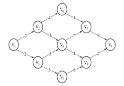

# 奇安信 2019 春招笔试题（一）

## 1

由权值为 7,2,4,1,9,3,5 的节点生成一颗哈夫曼树，其带权路径长度为（      ）

正确答案: D   你的答案: 空 (错误)

```cpp
52
```

```cpp
63
```

```cpp
74
```

```cpp
80
```

本题知识点

Java 工程师 C++工程师 前端工程师 安卓工程师 iOS 工程师 算法工程师 大数据开发工程师 运维工程师 安全工程师 奇安信 2019

讨论

[Realself](https://www.nowcoder.com/profile/831729261)

*   Hoffman 树如下

    ```cpp
                      31
              13            18
          6       7*       9     9*
       3    3*         4*    5*
     1*   2* 
    ```

*   带*号的是原始元素，也即叶子节点
    带权路径长度：(7+9) * 2+(3+4+5) * 3+(1+2) * 4=80
*   哈弗曼树带权路径长度： 所有叶结点的带权路径长度之和
*   结点的带权路径长度：结点到树根之间的路径长度与该结点上权的乘积
*   哈弗曼树合并规则：**每次都是选择两棵最小的树合并**

发表于 2020-03-24 17:54:03

* * *

[Alexandra52](https://www.nowcoder.com/profile/468186797)

这道题答案不应该是 87 么？

发表于 2020-02-27 22:24:19

* * *

## 2

AOE 网如下图所示，则该图深度优先遍历的序列为（      ）

正确答案: D   你的答案: 空 (错误)

```cpp
V1，V2，V9，V6，V7，V4，V8，V3，V5
```

```cpp
V1，V8，V3，V5，V2，V9，V6，V7，V4
```

```cpp
V1，V2，V6，V7，V9-，V5>V4，V8，V3
```

```cpp
V1，V2，V6，V7，V9，V4，V8，V3，V5
```

本题知识点

Java 工程师 C++工程师 前端工程师 安卓工程师 iOS 工程师 算法工程师 大数据开发工程师 运维工程师 安全工程师 奇安信 2019

讨论

[牛客 289587376 号](https://www.nowcoder.com/profile/289587376)

```cpp
V1，V2，V6，V7，V9，（无路可走跳到对面）V4（7 或 8 7 已经有），V8（跳到对面），V3（4 已经有），V5
```

发表于 2020-07-12 10:34:19

* * *

[我就是个废物](https://www.nowcoder.com/profile/547101875)

在线蹲一个大佬的解答

发表于 2020-04-10 16:10:27

* * *

## 3

最长上升子序列的空间复杂度为（      ）

正确答案: A   你的答案: 空 (错误)

```cpp
O(n)
```

```cpp
O(n²)
```

```cpp
O(nlogn)
```

```cpp
O(logn)
```

本题知识点

Java 工程师 C++工程师 前端工程师 安卓工程师 iOS 工程师 算法工程师 大数据开发工程师 运维工程师 安全工程师 奇安信 2019

讨论

[牛客 697021979 号](https://www.nowcoder.com/profile/697021979)

为什么百度的答案是 o（nlogn）

发表于 2020-09-25 09:44:34

* * *

## 4

下列哪项不是贪心算法的特点（      ）

正确答案: C   你的答案: 空 (错误)

```cpp
求解速度快
```

```cpp
时间复杂度低
```

```cpp
算法的关键在于解决数据的冗余问题
```

```cpp
贪心算法需要证明求解问题的解是最优解
```

本题知识点

Java 工程师 C++工程师 前端工程师 安卓工程师 iOS 工程师 算法工程师 大数据开发工程师 运维工程师 安全工程师 奇安信 2019

讨论

[牛客 606256765 号](https://www.nowcoder.com/profile/606256765)

解决算法冗余：hash

发表于 2021-03-25 22:45:41

* * *

## 5

下面有关串说法错误的是（      ）

正确答案: C   你的答案: 空 (错误)

```cpp
空串不是空白串
```

```cpp
空串是任意串的子串
```

```cpp
采用链表存储字符串时，字符串最后一个结点的指针指向'\0'
```

```cpp
两字符串相等的条件是串的长度相等，且对应位置的字符相等
```

本题知识点

Java 工程师 C++工程师 前端工程师 安卓工程师 iOS 工程师 算法工程师 大数据开发工程师 运维工程师 安全工程师 奇安信 2019

讨论

[牛客 697021979 号](https://www.nowcoder.com/profile/697021979)

null

发表于 2020-09-25 09:46:41

* * *

## 6

元素 A，B，C，D，E，F 依次进栈，若出栈序列为 C，D，F，E，B，A，则该顺序栈的容量至少为（      ）

正确答案: B   你的答案: 空 (错误)

```cpp
3
```

```cpp
4
```

```cpp
5
```

```cpp
6
```

本题知识点

Java 工程师 C++工程师 前端工程师 安卓工程师 iOS 工程师 算法工程师 大数据开发工程师 运维工程师 安全工程师 奇安信 2019

讨论

[我就是个废物](https://www.nowcoder.com/profile/547101875)

根据题目的出栈顺序得，首先 A 和 B 入栈，到 C 入栈后马上出栈，D 入栈后马上出栈，然后是 E 入栈，到 F 入栈后马上出栈，然后 E 出栈。由此得栈内最多元素时是 ABEF 四个元素，所以容量至少为 4

发表于 2020-04-10 16:14:41

* * *

## 7

串 S="hello world!"子串的个数为（      ）

正确答案: D   你的答案: 空 (错误)

```cpp
55
```

```cpp
66
```

```cpp
75
```

```cpp
78
```

本题知识点

Java 工程师 C++工程师 前端工程师 安卓工程师 iOS 工程师 算法工程师 大数据开发工程师 运维工程师 安全工程师 奇安信 2019

讨论

[二花 student](https://www.nowcoder.com/profile/224339799)

子串定义是包含空串和本身的，所以是 79，减去重复的，是 76，78 这个答案用 substring()方法跑一遍就是 78，就是列举了一遍，不考虑空串，不考虑重复。太迷了，我都开始怀疑我学的是不是正确的了🤣

发表于 2020-04-28 16:08:58

* * *

[Alexandra52](https://www.nowcoder.com/profile/468186797)

n*(n+1)/2+1 答案不是 79 么？

发表于 2020-02-27 22:36:40

* * *

[destiny_i](https://www.nowcoder.com/profile/9238708)

1.串中任意个连续的字符组成的子序列称为该串的子串。2.空串也属于子串 3.如果串中字符均不相同，那么子串个数=n(n+1) / 2 + 1;4.如果串中有重复字符，那么子串个数=n(n+1) / 2 + 1 - 重复个数;题目中“hello” 的 “ll” 重复了，所以要减去 1，所以是 12 * （12 + 1）/ 2 + 1 - 1 = 78

发表于 2021-03-05 21:21:13

* * *

## 8

设非空二叉树结点数为 90，其中度为 1 的结点数为 47，度为 2 的结点数为（      ）

正确答案: A   你的答案: 空 (错误)

```cpp
21
```

```cpp
22
```

```cpp
23
```

```cpp
27
```

本题知识点

Java 工程师 C++工程师 前端工程师 安卓工程师 iOS 工程师 算法工程师 大数据开发工程师 运维工程师 安全工程师 奇安信 2019

讨论

[牛客 460171630 号](https://www.nowcoder.com/profile/460171630)

（（90-1）-47）/2

发表于 2020-03-18 13:28:34

* * *

## 9

表长为 n 的单链表中含有头指针和尾指针，在该链表删除最后一个结点的时间复杂度为（      ）

正确答案: B   你的答案: 空 (错误)

```cpp
O(1)
```

```cpp
O(n)
```

```cpp
O(n²)
```

```cpp
其他几项都不对
```

本题知识点

Java 工程师 C++工程师 前端工程师 安卓工程师 iOS 工程师 算法工程师 大数据开发工程师 运维工程师 安全工程师 奇安信 2019

讨论

[Mkkk](https://www.nowcoder.com/profile/4953465)

虽然该链表含有尾指针，但是单链表只能通过 next 域访问到下一个节点，并不能通过尾指针直接访问到倒数第二个节点将其 next 域置为 NULL,所以删除最后一个节点的方法还是通过指针从头向后走，当 p.next == pTail 时, 将 pTail 指向 p,同时将 p.next 置为 NULL，所以时间复杂度为 O(n)

发表于 2020-04-04 22:49:29

* * *

## 10

利用冒泡排序法对序列(81,72,67,89,80,65,77,83,82,68,70,88)按升序排序，则第一趟排序结束后的结果是（      ）

正确答案: D   你的答案: 空 (错误)

```cpp
70，72，67，68，80，65，77，81，82，83，89，88
```

```cpp
80，65，67，83，81，68，70，88，82，72，77，89
```

```cpp
65，68，67，82，70，81，77，83，89，80，72，88
```

```cpp
72，67，81，80，65，77，83，82，68，70，88，89
```

本题知识点

Java 工程师 C++工程师 前端工程师 安卓工程师 iOS 工程师 算法工程师 大数据开发工程师 运维工程师 安全工程师 奇安信 2019

讨论

[bukun](https://www.nowcoder.com/profile/514169517)

冒泡

发表于 2020-10-08 10:10:06

* * *

## 11

OS 兴趣小组对进程和线程进行如下讨论，你认为正确的是(  )

正确答案: A   你的答案: 空 (错误)

```cpp
线程调用系统服务可通过陷阱方式。
```

```cpp
线程可在自主申请的地址空间活动。
```

```cpp
进程是处理器调度的最小单位，可采用抢占式优先级调度策略。
```

```cpp
创建进程产生的系统开销小于线程。
```

本题知识点

Java 工程师 C++工程师 前端工程师 安卓工程师 iOS 工程师 算法工程师 大数据开发工程师 运维工程师 安全工程师 奇安信 2019

讨论

[锯着木头数星星 i](https://www.nowcoder.com/profile/837275273)

排除法

发表于 2020-07-30 13:35:13

* * *

## 12

某系统中有 4 个并发进程，都需要同类资源 5 个，试问该系统不会发生死锁的最少资源数是：(   )

正确答案: B   你的答案: 空 (错误)

```cpp
16
```

```cpp
17
```

```cpp
18
```

```cpp
20
```

本题知识点

Java 工程师 C++工程师 前端工程师 安卓工程师 iOS 工程师 算法工程师 大数据开发工程师 运维工程师 安全工程师 奇安信 2019

讨论

[迈莫 coding](https://www.nowcoder.com/profile/2598593)

当 4 个线程都占有 4 个资源时 目前资源数为 16  再来一个资源时为他们刚好不会发生死锁的最少资源数 所以答案为 4x4+1 =17 

发表于 2020-02-27 10:48:49

* * *

[bukun](https://www.nowcoder.com/profile/514169517)

p*(m-1)+1<=r

发表于 2020-10-08 10:10:28

* * *

## 13

某系统采用动态分区存储管理技术，某时刻内 存中有三个空闲区，它们的首地址和大小分别为： 空闲区 1 (100KB,10KB)， 空闲区 2(200KB,30KB)， 空闲区 3 (300KB,15KB)。有如下作业序列： 作业 1 需求 15KB，作业 2 需求 16KB，作业 3 需求 10KB。 用哪种(  )算法能将该作业序列装入内存？（）

正确答案: B   你的答案: 空 (错误)

```cpp
最先适应算法
```

```cpp
最佳适应算法
```

```cpp
最坏适应算法
```

```cpp
下次适应算法
```

本题知识点

Java 工程师 C++工程师 前端工程师 安卓工程师 iOS 工程师 算法工程师 大数据开发工程师 运维工程师 安全工程师 奇安信 2019

讨论

[小学生学代码](https://www.nowcoder.com/profile/209628358)

首次适应算法：从空闲分区链首开始查找，直至找到一个能满足其大小要求的空闲分区为止。最佳适应算法：既能满足要求，又是最小的空闲分区分配给作业。

发表于 2020-08-01 14:35:42

* * *

## 14

设在内存中有 P1,P2,P3 三个程序，优先级按 P1>P2>P3 的次序运行，其中 CPU 和 IO 操作时间如下（CPU 和 IO 资源都只能同时由一个程序占用）：

```cpp
P1: CPU(60ms)→IO(80ms)→ CPU(20ms) 
P2: CPU(120ms)→IO(40ms)→ CPU(40ms) 
P3: CPU(40ms)→IO(80ms)→ CPU(40ms) 
```

多道并发完成三个程序比单道运行节省的时间是：(  )

正确答案: C   你的答案: 空 (错误)

```cpp
80ms
```

```cpp
 120ms
```

```cpp
 160ms
```

```cpp
200ms
```

本题知识点

Java 工程师 C++工程师 前端工程师 安卓工程师 iOS 工程师 算法工程师 大数据开发工程师 运维工程师 安全工程师 奇安信 2019

讨论

[锯着木头数星星 i](https://www.nowcoder.com/profile/837275273)

IO 在跑的时候可以跑不相关的 CPU，套一下

发表于 2020-07-30 13:36:06

* * *

[怀念。](https://www.nowcoder.com/profile/6192024)

要注意优先级 P1>P2>P3。节约时间为 P1 的 IO （80ms）在跑 P2 的 CPU。 P2 的 IO（40ms）在跑 P3 的 CPU。P2 的 CPU（40ms)在跑 P3 的 IO。

发表于 2020-10-04 17:09:39

* * *

## 15

下标从 1 开始的对称矩阵 A[5][5]，采用行序为主序将其下三角存储在一维数组 B 中。已知 B 的起始地址为 1000，且每个元素占 2 个字节，则（      ）

正确答案: D   你的答案: 空 (错误)

```cpp
当 i≤j 时，Loc(A[i][j]) = 1000+[j*(j-1)/2+i-1]*2
```

```cpp
当 i<j 时，Loc(A[i][j]) = 1000+[i*(i-1)/2+j-1]*2
```

```cpp
当 i≥j 时，Loc(A[i][j]) = 1000+[i*(j-1)/2+j-1]*2
```

```cpp
当 i≥j 时，Loc(A[i][j]) = 1000+[i*(i-1)/2+j-1]*2
```

本题知识点

Java 工程师 C++工程师 前端工程师 安卓工程师 iOS 工程师 算法工程师 大数据开发工程师 运维工程师 安全工程师 奇安信 2019

讨论

[WayhomeChen](https://www.nowcoder.com/profile/552948159)

个人认为 AD 选项都对。A 和 D 选项不是等价的吗？？？因为是对称矩阵，所以 A[i][j]=A[j][i]，所以当 i<=j 时，D 选项中的 i j 对调即可，就成了 A 选项，有问题吗？？？（我由于认为单选题不应该出现两个都对的选项，所以以为我原来想错了，就排除了 AD。。。）

发表于 2020-05-07 13:23:40

* * *

## 16

广义表 A=（a,b,(c,d)）的表尾是（      ）

正确答案: B   你的答案: 空 (错误)

```cpp
(c,d)
```

```cpp
(b,(c,d))
```

```cpp
((c,d))
```

```cpp
d
```

本题知识点

Java 工程师 C++工程师 前端工程师 安卓工程师 iOS 工程师 算法工程师 大数据开发工程师 运维工程师 安全工程师 奇安信 2019

讨论

[暂时不在 w](https://www.nowcoder.com/profile/443093050)

（1）表头：当广义表 LS 非空时，称第一个元素为 LS 的表头；

（2）表尾：称广义表 LS 中除去表头后其余元素组成的广义表为 LS 的表尾。

**参考：**[`blog.csdn.net/darkbus111/article/details/78526108`](https://blog.csdn.net/darkbus111/article/details/78526108)

发表于 2020-04-21 18:38:51

* * *

## 17

下列有关栈的说法正确的是（      ）

正确答案: A   你的答案: 空 (错误)

```cpp
对元素的保存次序与使用次序相反的，可以使用栈
```

```cpp
允许删除的一端称为栈顶，允许插入的一端称为栈底
```

```cpp
一串元素依次进栈，其出栈序列只有一种
```

```cpp
键盘缓冲区的存储可以使用栈
```

本题知识点

Java 工程师 C++工程师 前端工程师 安卓工程师 iOS 工程师 算法工程师 大数据开发工程师 运维工程师 安全工程师 奇安信 2019

## 18

下列有关串，说法正确的是（      ）

正确答案: D   你的答案: 空 (错误)

```cpp
两个串的长度相等表示两个串相等
```

```cpp
空串的串长度为 1
```

```cpp
子串可以是串中不连续的字符组成的子序列
```

```cpp
仅当两个串的长度相等且每个对应位置的字符都相等时，两个串才相等
```

本题知识点

Java 工程师 C++工程师 前端工程师 安卓工程师 iOS 工程师 算法工程师 大数据开发工程师 运维工程师 安全工程师 奇安信 2019

## 19

一棵完全二叉树共 81 个结点，从 1 开始，从左至右，从上到下依次编号，最小的叶子结点的编号是（      ）

正确答案: C   你的答案: 空 (错误)

```cpp
81
```

```cpp
40
```

```cpp
41
```

```cpp
39
```

本题知识点

Java 工程师 C++工程师 前端工程师 安卓工程师 iOS 工程师 算法工程师 大数据开发工程师 运维工程师 安全工程师 奇安信 2019

讨论

[面试好难呀](https://www.nowcoder.com/profile/250330027)

到第 5 层时，共有 2 的 5+1 次方-1 个结点，即 63 个结点，剩余 81-63=18 个结点，则第 5 层的从左往右，有 18/2=9 个结点有左右孩子，所以第一个叶子结点为第,5 层的第 10 个元素，其对应的编号为 2 的 4+1 次方-1+10=2⁵-1+10=32-1+10=41

发表于 2020-03-27 09:33:12

* * *

## 20

非标准线性规划模型转化为标准形式中，约束条件为大于等于，在约束的左端减去一个非负变量使其变换为等式约束，所减去的变量称为（）

正确答案: B   你的答案: 空 (错误)

```cpp
松弛变量
```

```cpp
剩余变量
```

```cpp
人工变量
```

```cpp
随机变量
```

本题知识点

Java 工程师 C++工程师 前端工程师 安卓工程师 iOS 工程师 算法工程师 大数据开发工程师 运维工程师 安全工程师 奇安信 2019

讨论

[牛客 606256765 号](https://www.nowcoder.com/profile/606256765)

小于等于的时候左边加的是松弛变量

发表于 2021-03-25 22:54:26

* * *

## 21

计算函数 f(n)=log2(n²)与 g(n)=n^(1/2)的渐进阶关系（）

正确答案: C   你的答案: 空 (错误)

```cpp
f(n)与 g(n)等价
```

```cpp
f(n)比 g(n)高价
```

```cpp
f(n)比 g(n)低价
```

```cpp
无法判断
```

本题知识点

Java 工程师 C++工程师 前端工程师 安卓工程师 iOS 工程师 算法工程师 大数据开发工程师 运维工程师 安全工程师 奇安信 2019

讨论

[牛客 597052737 号](https://www.nowcoder.com/profile/597052737)

答案：**B.** f(n)比 g(n)高价
分析：O(1) < O(log^n) < O(n) < O(nlog^n) < O(n²) < O(n³) < O(n^k) < O(2^n) < O(n!) < O(n^n)(常数阶 < 对数阶 < 线性阶 < 线性对数阶 < 平方阶 < 立方阶 < K 次方阶 < 指数阶 < 阶乘阶 < n 的 n 次方)f(n) = nln(n) + n = O(nlog^n)，线性对数阶 g(n) = ln(n) = O(log^n)，对数阶

发表于 2021-07-02 14:26:45

* * *

## 22

下列关于递归算法说法错误的是（）

正确答案: B   你的答案: 空 (错误)

```cpp
递归算法指函数、过程、子程序在运行过程中直接或间接调用自身而产生的重入现象
```

```cpp
递归算法描述简洁，结构清晰，算法的正确性比较容易证明，因此，能够用递归描述的算法都用递归算法进行描述
```

```cpp
寻找对问题进行分解的方法是递归算法设计的关键步骤
```

```cpp
递归算法包括递推和回归两个阶段
```

本题知识点

Java 工程师 C++工程师 前端工程师 安卓工程师 iOS 工程师 算法工程师 大数据开发工程师 运维工程师 安全工程师 奇安信 2019

## 23

利用贪心算法解决加油站问题，设各个加油站之间的距离为：1、3、4、2、5，汽车加满油以后行驶的最大距离为 7，开始为满油，求最少的加油次数（）

正确答案: B   你的答案: 空 (错误)

```cpp
1
```

```cpp
2
```

```cpp
3
```

```cpp
4
```

本题知识点

Java 工程师 C++工程师 前端工程师 安卓工程师 iOS 工程师 算法工程师 大数据开发工程师 运维工程师 安全工程师 奇安信 2019

## 24

分治法将一个规模为 n 的问题分解为 k 个规模较小的子问题来求解，以下哪项不是分治法的特性（）

正确答案: A   你的答案: 空 (错误)

```cpp
子问题具有重叠性质
```

```cpp
原问题的解由各个子问题的解合并得到
```

```cpp
子问题互相独立且与原问题相同
```

```cpp
子问题的规模大致相同
```

本题知识点

Java 工程师 C++工程师 前端工程师 安卓工程师 iOS 工程师 算法工程师 大数据开发工程师 运维工程师 安全工程师 奇安信 2019

讨论

[LYX_1129](https://www.nowcoder.com/profile/202787953)

A.子问题之间是相互独立的。用递归树来表示的话，就是一棵正常的 n 叉树。

发表于 2020-09-18 21:10:35

* * *

## 25

进程一般具有三个基本状态：运行状态、就绪状态、阻塞状态。以下对这三种状态之间的转换的说法，错误的是（  ）。

正确答案: B   你的答案: 空 (错误)

```cpp
当被进程调度程序选中时，进程由就绪状态变为运行状态
```

```cpp
当时间片用完时，进程由运行状态变为阻塞状态
```

```cpp
当重新获得资源时，进程由阻塞状态变为就绪状态
```

```cpp
当遇到其他更紧迫的进程抢占处理机时，进程由运行状态变为就绪状态
```

本题知识点

Java 工程师 C++工程师 前端工程师 安卓工程师 iOS 工程师 算法工程师 大数据开发工程师 运维工程师 安全工程师 奇安信 2019

讨论

[云少安](https://www.nowcoder.com/profile/836246904)

C 可能不严谨，但 B 一定错了。时间片用完，进程应该从运行态回到就绪态才对。

发表于 2020-03-06 14:59:52

* * *

[ScorchHu](https://www.nowcoder.com/profile/232125596)

B !

发表于 2021-03-06 00:04:18

* * *

[bukun](https://www.nowcoder.com/profile/514169517)

B

发表于 2020-09-05 15:05:06

* * *

## 26

在某分页系统中，测得 CPU 的利用率为 15%，磁盘利用率为 95%，则说明（  ）。

正确答案: A   你的答案: 空 (错误)

```cpp
可能已出现了抖动现象，应减少系统的进程数
```

```cpp
系统比较正常，可考虑适当增加进程数以提高资源利用率
```

```cpp
CPU 利用率较低，必须增加并发进程数
```

```cpp
磁盘容量过小，必须升级硬件，配置更大容量的磁盘
```

本题知识点

Java 工程师 C++工程师 前端工程师 安卓工程师 iOS 工程师 算法工程师 大数据开发工程师 运维工程师 安全工程师 奇安信 2019

## 27

编译程序对 fortran 源程序进行编译。在编译过程中形成 PCBx,PCBy 和 PCBz，则以下分析正确的是(  )

正确答案: D   你的答案: 空 (错误)

```cpp
数据集 x,y,z 是相同的数据集合。
```

```cpp
fortran 源程序和数据集 x、z 存放在相同的内存区。
```

```cpp
fortran 源程序和数据集 y 存放在相同的内存区。
```

```cpp
PCBx,PCBy 和 PCBz 可共享同一个 fortran 源程序。
```

本题知识点

Java 工程师 C++工程师 前端工程师 安卓工程师 iOS 工程师 算法工程师 大数据开发工程师 运维工程师 安全工程师 奇安信 2019

## 28

设内存分配情况如下所示，若要申请一块 50K 字节的内存空间，采用最佳适应算法，则得到的分区首址为 ：(  )

```cpp
起始地址             状态
0K-100K              已分配
100K-180K             空闲
180K-190K             已分配
190K-280K             空闲
280K-330K             已分配
330K-390K             空闲
390K-410K             已分配
410K-512K-1           空闲
```

正确答案: C   你的答案: 空 (错误)

```cpp
100K
```

```cpp
190K
```

```cpp
330K
```

```cpp
410K
```

本题知识点

Java 工程师 C++工程师 前端工程师 安卓工程师 iOS 工程师 算法工程师 大数据开发工程师 运维工程师 安全工程师 奇安信 2019

## 29

三维数组 T[0…p][0…q][0…m]，每个元素占 n 个字节：按行存储时：Loc(T[i][j][k])=（      ）

正确答案: B   你的答案: 空 (错误)

```cpp
Loc(A[1][1][1])+( i*q*m+j*m+n )*n
```

```cpp
Loc(A[1][1][1])+( (i-1)*q*m+(j-1)*m+n-1 )*n
```

```cpp
Loc(A[0][0][0])+( (i-1)*q*m+(j-1)*m+n-1 )*n
```

```cpp
Loc(A[1][1][1])+( (i-1)*q*r+(j-1)*m+n )*n
```

本题知识点

Java 工程师 C++工程师 前端工程师 安卓工程师 iOS 工程师 算法工程师 大数据开发工程师 运维工程师 安全工程师 奇安信 2019

讨论

[Jack_Liao](https://www.nowcoder.com/profile/958183442)

开始元素不是[0][0][0]吗？

发表于 2020-07-31 16:10:09

* * *

## 30

广义表 A=（a,c,d,(z,y)）的表头是（      ）

正确答案: C   你的答案: 空 (错误)

```cpp
(a)
```

```cpp
(a,b)
```

```cpp
a
```

```cpp
a,b
```

本题知识点

Java 工程师 C++工程师 前端工程师 安卓工程师 iOS 工程师 算法工程师 大数据开发工程师 运维工程师 安全工程师 奇安信 2019

## 31

以下哪个选项不是栈的应用（      ）

正确答案: C   你的答案: 空 (错误)

```cpp
递归
```

```cpp
括号匹配问题
```

```cpp
二叉树的层次遍历
```

```cpp
中缀表达式转后缀表达式
```

本题知识点

Java 工程师 C++工程师 前端工程师 安卓工程师 iOS 工程师 算法工程师 大数据开发工程师 运维工程师 安全工程师 奇安信 2019

讨论

[Jack_Liao](https://www.nowcoder.com/profile/958183442)

二叉树层次遍历使用队列来保存下一层的节点

发表于 2020-07-31 16:10:45

* * *

[223s](https://www.nowcoder.com/profile/641616950)

二叉树的层次遍历不是可以递归实现么？那么不就是使用了栈？

发表于 2020-07-15 10:50:26

* * *

## 32

下列有关串，说法错误的是（      ）

正确答案: A   你的答案: 空 (错误)

```cpp
任意一个串都拥有无数的子串
```

```cpp
串可以顺序存储，也可以链式存储
```

```cpp
定长顺序串是将串设计成一种静态结构类型
```

```cpp
定长顺序串中的 len 表示字符串的长度
```

本题知识点

Java 工程师 C++工程师 前端工程师 安卓工程师 iOS 工程师 算法工程师 大数据开发工程师 运维工程师 安全工程师 奇安信 2019

讨论

[bukun](https://www.nowcoder.com/profile/514169517)

长度为 n 的字串个数为 n * (n + 1) / 2 + 1

发表于 2020-10-08 10:14:54

* * *

## 33

已知二叉树的先序遍历序列为 ABDCEF,中序遍历序列为 DBAEFC,则其后续遍历序列为（      ）

正确答案: B   你的答案: 空 (错误)

```cpp
ABCDEF
```

```cpp
DBFECA
```

```cpp
DBEFAC
```

```cpp
ABDCEF
```

本题知识点

Java 工程师 C++工程师 前端工程师 安卓工程师 iOS 工程师 算法工程师 大数据开发工程师 运维工程师 安全工程师 奇安信 2019

讨论

[bukun](https://www.nowcoder.com/profile/514169517)

```cpp
      A
    / \
   B  C
  /  /
 D  E
    \
     F
```

编辑于 2020-09-05 15:11:40

* * *

## 34

在解线性规划问题时，可能出现的情况不包括（）

正确答案: A   你的答案: 空 (错误)

```cpp
可行域为空集，原问题有可行解
```

```cpp
可行域非空但无界，无最优解
```

```cpp
可行域非空但无界，有最优解
```

```cpp
最优解有无穷多个
```

本题知识点

Java 工程师 C++工程师 前端工程师 安卓工程师 iOS 工程师 算法工程师 大数据开发工程师 运维工程师 安全工程师 奇安信 2019

## 35

计算下列算法段的时间下界（）

```cpp
while(n>1)
  if(odd(n))
    n=3*n+1;
  else
    n=n/2;
```

正确答案: A   你的答案: 空 (错误)

本题知识点

Java 工程师 C++工程师 前端工程师 安卓工程师 iOS 工程师 算法工程师 大数据开发工程师 运维工程师 安全工程师 奇安信 2019

## 36

七个盘子的汉诺塔问题，需要移动的盘子的次数为（）

正确答案: C   你的答案: 空 (错误)

```cpp
63
```

```cpp
64
```

```cpp
127
```

```cpp
128
```

本题知识点

Java 工程师 C++工程师 前端工程师 安卓工程师 iOS 工程师 算法工程师 大数据开发工程师 运维工程师 安全工程师 奇安信 2019

讨论

[面试好难呀](https://www.nowcoder.com/profile/250330027)

移动次数为 2 的 n 次方减 1，所以结果为 2⁷-1=127

发表于 2020-03-27 09:52:42

* * *

[IUN_2930](https://www.nowcoder.com/profile/681480486)

汉诺塔公式：f(1) = 1......f(n) = 2 * f(n - 1) + 1

发表于 2022-01-15 09:18:03

* * *

## 37

给定 X 轴上的区间：[1,10],[2,9],[5,6],[4,8],[2,7],[9,11],[12,15],[10,20],利用贪心算法得到最大相容区间，删去区间数最少为多少（）

正确答案: D   你的答案: 空 (错误)

```cpp
2
```

```cpp
3
```

```cpp
4
```

```cpp
5
```

本题知识点

Java 工程师 C++工程师 前端工程师 安卓工程师 iOS 工程师 算法工程师 大数据开发工程师 运维工程师 安全工程师 奇安信 2019

讨论

[怀念。](https://www.nowcoder.com/profile/6192024)

按截至时间排序，贪心算法得到的最大相容区间为[5,6] [9,11] [12,15]

发表于 2020-10-04 17:20:40

* * *

## 38

二分搜索算法采用的是以下哪种算法策略（）

正确答案: D   你的答案: 空 (错误)

```cpp
顺序搜索策略
```

```cpp
贪心策略
```

```cpp
动态规划策略
```

```cpp
分治策略
```

本题知识点

Java 工程师 C++工程师 前端工程师 安卓工程师 iOS 工程师 算法工程师 大数据开发工程师 运维工程师 安全工程师 奇安信 2019

## 39

以下不可能发生死锁的资源是（  ）。

正确答案: A   你的答案: 空 (错误)

```cpp
一个可以供多个进程同时读取的只读文件
```

```cpp
一台只允许单进程访问的打印机
```

```cpp
可以回收使用的可重用资源
```

```cpp
在资源分配图中存在环路的资源
```

本题知识点

Java 工程师 C++工程师 前端工程师 安卓工程师 iOS 工程师 算法工程师 大数据开发工程师 运维工程师 安全工程师 奇安信 2019

## 40

设一个分页存储器的页表存放在内存中，若内存的存取周期为 0.4ms，则 CPU 从内存取一条指令（或一个操作数）需要的时间是（  ）。

正确答案: C   你的答案: 空 (错误)

```cpp
0.2ms
```

```cpp
0.4ms
```

```cpp
0.8ms
```

```cpp
1.0ms
```

本题知识点

Java 工程师 C++工程师 前端工程师 安卓工程师 iOS 工程师 算法工程师 大数据开发工程师 运维工程师 安全工程师 奇安信 2019

## 41

Linux 系统中对信号的处理被称为软中断。若此时发信号的进程 A 希望结束接收信号的进程 B，需要发出以下哪一信号(  )

正确答案: C   你的答案: 空 (错误)

```cpp
SIGHUP 
```

```cpp
SIGINT
```

```cpp
SIGKILL
```

```cpp
SIGSTOP
```

本题知识点

Java 工程师 C++工程师 前端工程师 安卓工程师 iOS 工程师 算法工程师 大数据开发工程师 运维工程师 安全工程师 奇安信 2019

## 42

在一个虚拟存储管理系统中，假如系统分配给一个作业的内存物理块数是 3，并且此作业的页面使用顺序为 6，3，6，1，5，6，4，5，3，6，5，6。若采用 OPT 置换算法，其产生的缺页次数是：(  )

正确答案: A   你的答案: 空 (错误)

```cpp
6
```

```cpp
7
```

```cpp
8
```

```cpp
9
```

本题知识点

Java 工程师 C++工程师 前端工程师 安卓工程师 iOS 工程师 算法工程师 大数据开发工程师 运维工程师 安全工程师 奇安信 2019

讨论

[牛客 697021979 号](https://www.nowcoder.com/profile/697021979)

不是 9 吗？

发表于 2020-09-25 11:17:51

* * *