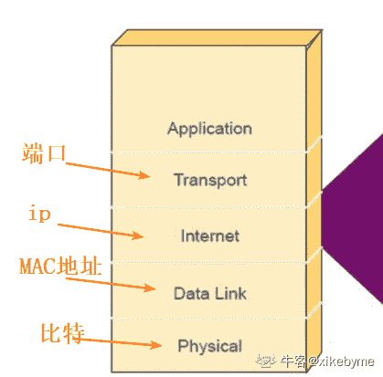
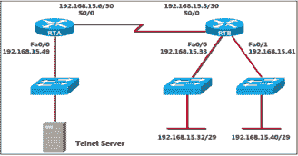

# 奇安信 2019 春招笔试题（二）

## 1

以下关于 res aw 说法正确的是（       ）

正确答案: D   你的答案: 空 (错误)

```cpp
可以将 SQLite 数据库文件复制到该目录，供程序使用
```

```cpp
不能直接打开 res aw 目录中的数据库文件
```

```cpp
可以通过 getResources().openRawResource 获得输入流对象，然后进行相应操作
```

```cpp
其他选项均正确
```

本题知识点

Java 工程师 C++工程师 前端工程师 安卓工程师 iOS 工程师 算法工程师 大数据开发工程师 运维工程师 安全工程师 奇安信 2019

## 2

Windows 是一种（）操作系统

正确答案: B   你的答案: 空 (错误)

```cpp
单用户单任务
```

```cpp
单用户多任务
```

```cpp
多用户单任务
```

```cpp
多用户多任务
```

本题知识点

Java 工程师 C++工程师 前端工程师 安卓工程师 iOS 工程师 算法工程师 大数据开发工程师 运维工程师 安全工程师 奇安信 2019 牛客

讨论

[牛客 606256765 号](https://www.nowcoder.com/profile/606256765)

？不是 d？

发表于 2021-03-26 23:51:33

* * *

## 3

在 windows 中桌面是指（）

正确答案: D   你的答案: 空 (错误)

```cpp
电脑台 
```

```cpp
活动窗口
```

```cpp
资源管理器窗口
```

```cpp
窗口、图标、对话框所在的屏幕背景
```

本题知识点

Java 工程师 C++工程师 前端工程师 安卓工程师 iOS 工程师 算法工程师 大数据开发工程师 运维工程师 安全工程师 奇安信 2019

## 4

一个 B 类网络，有 5 位掩码加入缺省掩码用来划分子网，每个子网最多（   ）台主机

正确答案: D   你的答案: 空 (错误)

```cpp
510
```

```cpp
512
```

```cpp
1022
```

```cpp
2046
```

本题知识点

Java 工程师 C++工程师 前端工程师 安卓工程师 iOS 工程师 算法工程师 大数据开发工程师 运维工程师 安全工程师 奇安信 2019

讨论

[牛客 664242583 号](https://www.nowcoder.com/profile/664242583)

B 类：255.255.0.0 加入五位后，是 11 个 0，2¹¹-2=2046

发表于 2021-08-11 15:32:28

* * *

## 5

操作系统的主要功能包括（）

正确答案: B   你的答案: 空 (错误)

```cpp
运算器管理、存储器管理、设备管理、处理器管理
```

```cpp
文件管理、处理器管理、设备管理、存储管理
```

```cpp
文件管理、设备管理、系统管理、存储管理
```

```cpp
管理器管理、设备管理、程序管理、存储管理
```

本题知识点

Java 工程师 C++工程师 前端工程师 安卓工程师 iOS 工程师 算法工程师 大数据开发工程师 运维工程师 安全工程师 奇安信 2019 牛客

## 6

主机将数据传输到 MAC 地址 ff:ff:ff:ff:ff:ff 时，这种通信属于哪种类型?（）

正确答案: D   你的答案: 空 (错误)

```cpp
单播
```

```cpp
组播
```

```cpp
任意播
```

```cpp
广播
```

本题知识点

Java 工程师 C++工程师 前端工程师 安卓工程师 iOS 工程师 算法工程师 大数据开发工程师 运维工程师 安全工程师 奇安信 2019

## 7

 如果一台交换机连接了 3 台计算机，且没有配置 VLAN，请问该交换机创建了多少个冲突域和广域?（）

正确答案: C   你的答案: 空 (错误)

```cpp
3 个广播域和 1 个冲突域
```

```cpp
3 个广播域和 3 个冲突域
```

```cpp
l 个广播域和 3 个冲突域
```

```cpp
l 个广播域和 1 个冲突域
```

本题知识点

Java 工程师 C++工程师 前端工程师 安卓工程师 iOS 工程师 算法工程师 大数据开发工程师 运维工程师 安全工程师 奇安信 2019

## 8

OSI 模型的哪一层负责将比特合并成字节，并将字节合并成帧?（）

正确答案: B   你的答案: 空 (错误)

```cpp
表示层
```

```cpp
数据链路层
```

```cpp
应用层
```

```cpp
传输层
```

本题知识点

Java 工程师 C++工程师 前端工程师 安卓工程师 iOS 工程师 算法工程师 大数据开发工程师 运维工程师 安全工程师 奇安信 2019

讨论

[清芜](https://www.nowcoder.com/profile/959204381)

数据链路层，对物理层传输的比特流进行封装，最小单位是帧

发表于 2020-05-20 08:38:20

* * *

[飞天虾仁](https://www.nowcoder.com/profile/561217803)

比特在物理层传输，数据链路层传输的是帧，因此是数据链路层

编辑于 2021-01-17 23:45:27

* * *

## 9

下面哪项是 B 类网络地址范围的二进制表示（）

正确答案: C   你的答案: 空 (错误)

```cpp
01xxxxxx
```

```cpp
0xxxxxxx
```

```cpp
10xxxxxx
```

```cpp
110xxxxx
```

本题知识点

Java 工程师 C++工程师 前端工程师 安卓工程师 iOS 工程师 算法工程师 大数据开发工程师 运维工程师 安全工程师 奇安信 2019

## 10

IP 地址为 200.10.5.68/28 的主机位于哪个子网中?（）

正确答案: C   你的答案: 空 (错误)

```cpp
200.10.5.56
```

```cpp
200.10.5.32
```

```cpp
200.10.5.64
```

```cpp
200.10.5 .0
```

本题知识点

Java 工程师 C++工程师 前端工程师 安卓工程师 iOS 工程师 算法工程师 大数据开发工程师 运维工程师 安全工程师 奇安信 2019

## 11

关于阳 Pv2，下面哪个描述是正确的?（）

正确答案: C   你的答案: 空 (错误)

```cpp
与阳 Pvl 相比它具有更低的管理距离
```

```cpp
它要比 RlPvI 会聚得更快
```

```cpp
它与 RlPvI 拥有相同的定时器
```

```cpp
同 RIPvl 相比它更难配置
```

本题知识点

Java 工程师 C++工程师 前端工程师 安卓工程师 iOS 工程师 算法工程师 大数据开发工程师 运维工程师 安全工程师 奇安信 2019

## 12

怎么显示当前目前（）

正确答案: A   你的答案: 空 (错误)

```cpp
pwd
```

```cpp
cd
```

```cpp
who
```

```cpp
ls
```

本题知识点

Java 工程师 C++工程师 前端工程师 安卓工程师 iOS 工程师 算法工程师 大数据开发工程师 运维工程师 安全工程师 奇安信 2019

## 13

如何删除一个非空子目录/tmp（）

正确答案: B   你的答案: 空 (错误)

```cpp
del /tmp/*
```

```cpp
rm -rf /tmp
```

```cpp
rm -Ra /tmp/*
```

```cpp
rm -rf /tmp/*
```

本题知识点

Java 工程师 C++工程师 前端工程师 安卓工程师 iOS 工程师 算法工程师 大数据开发工程师 运维工程师 安全工程师 奇安信 2019

## 14

下列哪个指令可以设定使用者的密码

正确答案: C   你的答案: 空 (错误)

```cpp
pwd
```

```cpp
newpwd
```

```cpp
passwd
```

```cpp
password
```

本题知识点

Java 工程师 C++工程师 前端工程师 安卓工程师 iOS 工程师 算法工程师 大数据开发工程师 运维工程师 安全工程师 奇安信 2019

讨论

[牛客 606256765 号](https://www.nowcoder.com/profile/606256765)

c？

发表于 2021-03-27 00:21:08

* * *

## 15

下列哪个指令可以切换使用者身份（）

正确答案: D   你的答案: 空 (错误)

```cpp
passwd
```

```cpp
log
```

```cpp
who
```

```cpp
su
```

本题知识点

Java 工程师 C++工程师 前端工程师 安卓工程师 iOS 工程师 算法工程师 大数据开发工程师 运维工程师 安全工程师 奇安信 2019

## 16

如果你想列出当前目录以及子目录下所有扩展名为“.txt”的文件，那么你可以使用的命令是（）

正确答案: B   你的答案: 空 (错误)

```cpp
ls *.txt
```

```cpp
find -name ".txt"
```

```cpp
ls -d .txt
```

```cpp
find ".txt"
```

本题知识点

Java 工程师 C++工程师 前端工程师 安卓工程师 iOS 工程师 算法工程师 大数据开发工程师 运维工程师 安全工程师 奇安信 2019

## 17

根据 OSI 七层模型，计算机网络中两个主机之间端口到端口的通信发生在哪一层？（）

正确答案: D   你的答案: 空 (错误)

```cpp
物理层
```

```cpp
会话层
```

```cpp
网络层
```

```cpp
传输层
```

本题知识点

Java 工程师 C++工程师 前端工程师 安卓工程师 iOS 工程师 算法工程师 大数据开发工程师 运维工程师 安全工程师 奇安信 2019 牛客

讨论

[枸杞很好](https://www.nowcoder.com/profile/1977533)



发表于 2020-04-09 16:30:28

* * *

[SupeRcl✿҉](https://www.nowcoder.com/profile/695396552)

由端口可以联想到 TCP UDP 首部中都存在端口信息 从而可以推断得知其属于传输层

发表于 2020-12-27 22:16:51

* * *

[小王同学呀](https://www.nowcoder.com/profile/812848883)

D

发表于 2020-03-16 15:59:29

* * *

## 18

以下哪些不是系统服务的常用控制类型（      ）。

正确答案: D   你的答案: 空 (错误)

```cpp
stop
```

```cpp
start
```

```cpp
restart
```

```cpp
reload
```

本题知识点

Java 工程师 C++工程师 前端工程师 安卓工程师 iOS 工程师 算法工程师 大数据开发工程师 运维工程师 安全工程师 奇安信 2019

## 19

关于文件权限，以下关系对应错误的是（      ）？

正确答案: B   你的答案: 空 (错误)

```cpp
rw-r---w-   642
```

```cpp
r-xr-x-rw   446
```

```cpp
rwxrwxrwx   777
```

```cpp
r-xrw-rwx   567
```

本题知识点

Java 工程师 C++工程师 前端工程师 安卓工程师 iOS 工程师 算法工程师 大数据开发工程师 运维工程师 安全工程师 奇安信 2019

讨论

[牛客 656843008 号](https://www.nowcoder.com/profile/656843008)

这题是问不正确的吗 446 那个 rwx 顺序不对啊

发表于 2020-09-25 12:22:02

* * *

## 20

Windows 操作系统中，本地 DNS 解析文件的目录正确的是（      ）

正确答案: A   你的答案: 空 (错误)

```cpp
C:\windows\system32\drivers\etc\hosts
```

```cpp
C:\Program Files\system32\drivers\etc\hosts
```

```cpp
C:\Program Files(x86)\system32\drivers\etc\hosts
```

```cpp
c:\windows\system\drivers\etc\hosts
```

本题知识点

Java 工程师 C++工程师 前端工程师 安卓工程师 iOS 工程师 算法工程师 大数据开发工程师 运维工程师 安全工程师 奇安信 2019

## 21

以下关于 RIP 描述错误的是（      ）。

正确答案: B   你的答案: 空 (错误)

```cpp
距离矢量协议
```

```cpp
RIP 基于 TCP
```

```cpp
向邻居发送整个路由表信息
```

```cpp
RIP 是以跳数为度量值
```

本题知识点

Java 工程师 C++工程师 前端工程师 安卓工程师 iOS 工程师 算法工程师 大数据开发工程师 运维工程师 安全工程师 奇安信 2019

## 22

在 iptables 中增加一条该主机允许被 ping 的策略，下列表述正确的是 （      ）。

正确答案: D   你的答案: 空 (错误)

```cpp
iptables –t raw –I INPUT –p icmp –j ACCEPT
```

```cpp
iptables –t filter –I OUTPUT –p icmp –j ACCEPT
```

```cpp
iptables –t filter –I INPUT –p ping –j ACCEPT
```

```cpp
iptables –t filter –I INPUT –p icmp –j ACCEPT
```

本题知识点

Java 工程师 C++工程师 前端工程师 安卓工程师 iOS 工程师 算法工程师 大数据开发工程师 运维工程师 安全工程师 奇安信 2019

## 23

 OSPF 七种邻居状态顺序正确的是（      ）。 

正确答案: A   你的答案: 空 (错误)

```cpp
Down-Init-2way-Exstart-Exchange-Loading-Full
```

```cpp
Full-Loading-Exchange-Exstart-2way-Init-Down
```

```cpp
Down-Init-2way-Exchange-Exstart-Loading-Full
```

```cpp
Down-2way-Init-Exstart-Exchange-Loading-Full
```

本题知识点

Java 工程师 C++工程师 前端工程师 安卓工程师 iOS 工程师 算法工程师 大数据开发工程师 运维工程师 安全工程师 奇安信 2019

## 24

哪一个命令能用来查找文件 TESTFILE 中只包含四个字符的行(  )？

正确答案: C   你的答案: 空 (错误)

```cpp
grep '^????$' TESTFILE
```

```cpp
grep '????' TESTFILE
```

```cpp
grep '^....$' TESTFILE
```

```cpp
grep '....' TESTFILE
```

本题知识点

Java 工程师 C++工程师 前端工程师 安卓工程师 iOS 工程师 算法工程师 大数据开发工程师 运维工程师 安全工程师 奇安信 2019

## 25

一个 bash shell 脚本的第一行是什么？（）

正确答案: A   你的答案: 空 (错误)

```cpp
#!/bin/bash
```

```cpp
#/bin/bash
```

```cpp
#/bin/csh
```

```cpp
/bin/bash
```

本题知识点

Java 工程师 C++工程师 前端工程师 安卓工程师 iOS 工程师 算法工程师 大数据开发工程师 运维工程师 安全工程师 奇安信 2019

讨论

[牛客 935839265 号](https://www.nowcoder.com/profile/935839265)

A

发表于 2020-09-23 00:12:47

* * *

## 26

正确的 DNS 查询解析的顺序是（      ）。

正确答案: A   你的答案: 空 (错误)

```cpp
本地缓存记录→区域记录→转发域名服务器→根域名服务器
```

```cpp
区域记录→本地缓存记录→转发域名服务器→根域名服务器
```

```cpp
本地缓存记录→区域记录→根域名服务器→转发域名服务器
```

```cpp
区域记录→本地缓存记录→根域名服务器→转发域名服务器
```

本题知识点

Java 工程师 C++工程师 前端工程师 安卓工程师 iOS 工程师 算法工程师 大数据开发工程师 运维工程师 安全工程师 奇安信 2019

## 27

数据库中有两个用户 audit 和 admin，物资表 wz 是属于 admin 用户的，但当前用户是 audit，要求查询物资表 wz（wno，wname，wtype，wunit）物资单位 wunit 列为 null 的记录，取结果的前 3 条记录显示，以下正确的 SQL 语句是（ ）

正确答案: A   你的答案: 空 (错误)

```cpp
select*from admin.wz where wunit is null and rownum<4
```

```cpp
select*from audit.wz where wunit is null and rownum<3
```

```cpp
select*from admin.wz where wunit = null and rownum<3
```

```cpp
select*form audit.wz where wunit is null and rownum<4
```

本题知识点

Java 工程师 C++工程师 前端工程师 安卓工程师 iOS 工程师 算法工程师 大数据开发工程师 运维工程师 安全工程师 奇安信 2019

## 28

二层以太网交换机在 MAC 地址表中查找与帧目的 MAC 地址匹配的表项，从而将帧从相应接口转发出去，如果查找失败，交换机将（      ）

正确答案: B   你的答案: 空 (错误)

```cpp
把帧丢弃
```

```cpp
把帧由除入端口以外的所有其他端口发送出去
```

```cpp
查找快速转发表
```

```cpp
查找路由表
```

本题知识点

Java 工程师 C++工程师 前端工程师 安卓工程师 iOS 工程师 算法工程师 大数据开发工程师 运维工程师 安全工程师 奇安信 2019

## 29

以下关于 Trunk 端口、链路的描述正确的是（      ）。

正确答案: C   你的答案: 空 (错误)

```cpp
Trunk 端口的 PVID 值不可以修改
```

```cpp
Trunk 端口发送数据帧时，若数据帧不带有 VLAN ID，则对数据帧加上相应的 PVID 值作为 VLAN ID
```

```cpp
Trunk 链路可以承载带有不同 VLAN ID 的数据帧
```

```cpp
Trunk 链路上传送的数据帧都是带 VLAN ID 的
```

本题知识点

Java 工程师 C++工程师 前端工程师 安卓工程师 iOS 工程师 算法工程师 大数据开发工程师 运维工程师 安全工程师 奇安信 2019

## 30

TCP 协议通过(      )来区别不同的连接。

正确答案: B   你的答案: 空 (错误)

```cpp
端口号
```

```cpp
端口号和 IP 地址
```

```cpp
端口号和 MAC 地址
```

```cpp
IP 地址和 MAC 地址
```

本题知识点

Java 工程师 C++工程师 前端工程师 安卓工程师 iOS 工程师 算法工程师 大数据开发工程师 运维工程师 安全工程师 奇安信 2019

## 31

已知两台 windows 主机 A 和 B 网线直连，主机 A 地址以及掩码 192.168.1.1/16，主机 B 地址以及掩码 192.168.2.1/16，两主机相互均可 ping 通，如果将主机 B 的掩码改为/24,则（      ）。

正确答案: D   你的答案: 空 (错误)

```cpp
主机 A 和 B 依然相互均可 ping 通。
```

```cpp
主机 A 可以 ping 通主机 B，但是主机 B 无法 ping 通主机 A。
```

```cpp
主机 B 可以 ping 通主机 A，但是主机 A 无法 ping 通主机 B。 
```

```cpp
主机 A 和主机 B 互相均不能 ping 通。
```

本题知识点

Java 工程师 C++工程师 前端工程师 安卓工程师 iOS 工程师 算法工程师 大数据开发工程师 运维工程师 安全工程师 奇安信 2019

讨论

[彩虹鱼 520](https://www.nowcoder.com/profile/162155763)

两者不处于同一个局域网内，无法 ping 通

发表于 2020-03-06 14:26:27

* * *

## 32

 如图所示，所有交换机均为二层交换机并创建 vlan6、vlan7、vlan8，PC1 与 PC2 能否正常通信？（      ）。

正确答案: A   你的答案: 空 (错误)

```cpp
能
```

```cpp
不能
```

```cpp
通信会丢包
```

```cpp
无法确定
```

本题知识点

Java 工程师 C++工程师 前端工程师 安卓工程师 iOS 工程师 算法工程师 大数据开发工程师 运维工程师 安全工程师 奇安信 2019

## 33

关于集线器上所有连接终端设备描述正确的是（      ）

正确答案: D   你的答案: 空 (错误)

```cpp
所有设备在同一冲突域
```

```cpp
所有设备在同一广播域
```

```cpp
所有设备共享相同的带宽
```

```cpp
选项全部正确
```

本题知识点

Java 工程师 C++工程师 前端工程师 安卓工程师 iOS 工程师 算法工程师 大数据开发工程师 运维工程师 安全工程师 奇安信 2019

## 34

如何删除目录 /tmp 下的所有文件及子目录（      ）。

正确答案: D   你的答案: 空 (错误)

```cpp
del /tmp/*
```

```cpp
rm -rf /tmp
```

```cpp
rm -Ra /tmp/*
```

```cpp
rm –rf /tmp/*
```

本题知识点

Java 工程师 C++工程师 前端工程师 安卓工程师 iOS 工程师 算法工程师 大数据开发工程师 运维工程师 安全工程师 奇安信 2019

## 35

三层网络设备主要根据什么转发数据包（      ）？  

正确答案: A   你的答案: 空 (错误)

```cpp
路由表
```

```cpp
MAC 地址表
```

```cpp
ARP 地址表
```

```cpp
其他选项全是
```

本题知识点

Java 工程师 C++工程师 前端工程师 安卓工程师 iOS 工程师 算法工程师 大数据开发工程师 运维工程师 安全工程师 奇安信 2019

## 36

下面哪些设备可以同时分隔冲突域和广播域（      ）

正确答案: D   你的答案: 空 (错误)

```cpp
HUB
```

```cpp
网桥
```

```cpp
交换机
```

```cpp
路由器
```

本题知识点

Java 工程师 C++工程师 前端工程师 安卓工程师 iOS 工程师 算法工程师 大数据开发工程师 运维工程师 安全工程师 奇安信 2019

## 37

A 主机可以 PING 通 B（使用 https 协议的 web 服务器，且两者之间无安全设备），但是在打开浏览器访问该服务器时却显示页面不存在，请问此时首要执行哪条命令排查问题？（    ）

正确答案: C   你的答案: 空 (错误)

```cpp
PING
```

```cpp
TRACEROUTE
```

```cpp
TELNET
```

```cpp
TRACERT
```

本题知识点

Java 工程师 C++工程师 前端工程师 安卓工程师 iOS 工程师 算法工程师 大数据开发工程师 运维工程师 安全工程师 奇安信 2019

## 38

按照 IEEE 802.1d 协议，当交换机端口处于（      ）状态时，既可以学习 MAC 帧中的源地址，又可以把接收到的 MAC 帧转发到适当的端口。

正确答案: C   你的答案: 空 (错误)

```cpp
阻塞（blocking）
```

```cpp
学习（learning）
```

```cpp
转发（forwarding）
```

```cpp
监听（listening）
```

本题知识点

Java 工程师 C++工程师 前端工程师 安卓工程师 iOS 工程师 算法工程师 大数据开发工程师 运维工程师 安全工程师 奇安信 2019

## 39

下面路由协议中术语距离矢量路由协议的是（      ）

正确答案: B   你的答案: 空 (错误)

```cpp
OSPF
```

```cpp
RIP
```

```cpp
OSPF 和 RIP
```

```cpp
OSPF 和 EIGRP
```

本题知识点

Java 工程师 C++工程师 前端工程师 安卓工程师 iOS 工程师 算法工程师 大数据开发工程师 运维工程师 安全工程师 奇安信 2019

讨论

[牛客 496093936 号](https://www.nowcoder.com/profile/496093936)

rip 和 eigrp 都算

发表于 2021-03-01 21:37:44

* * *

## 40

安全的基本原则（      ）。

正确答案: A   你的答案: 空 (错误)

```cpp
完整性、机密性、可用性
```

```cpp
完整性、机密性、不可否认性
```

```cpp
机密性、完整性、源认证、不可否认性
```

```cpp
机密性、可用性、不可否认性
```

本题知识点

Java 工程师 C++工程师 前端工程师 安卓工程师 iOS 工程师 算法工程师 大数据开发工程师 运维工程师 安全工程师 奇安信 2019

## 41

OSI 七层模型的（      ）负责封装 IP 报头信息。

正确答案: D   你的答案: 空 (错误)

```cpp
物理层
```

```cpp
传输层
```

```cpp
数据链路层
```

```cpp
网络层
```

本题知识点

Java 工程师 C++工程师 前端工程师 安卓工程师 iOS 工程师 算法工程师 大数据开发工程师 运维工程师 安全工程师 奇安信 2019

## 42

关闭 Linux 系统（不重新启动）可使用命令（      ）

正确答案: C   你的答案: 空 (错误)

```cpp
ctrl+alt+del
```

```cpp
shutdown -r
```

```cpp
halt
```

```cpp
reboot
```

本题知识点

Java 工程师 C++工程师 前端工程师 安卓工程师 iOS 工程师 算法工程师 大数据开发工程师 运维工程师 安全工程师 奇安信 2019

## 43

Linux 系统根目录下一文件名称为 360，该文件的访问权限为 rw-r—r--，现要增加所有用户的执行权限和同组用户的写权限，下列命令正确的是（     ）

正确答案: C   你的答案: 空 (错误)

```cpp
chmod a+x g+w 360
```

```cpp
 chmod o+x 360
```

```cpp
 chmod 765 360
```

```cpp
chmod g+w 360
```

本题知识点

Java 工程师 C++工程师 前端工程师 安卓工程师 iOS 工程师 算法工程师 大数据开发工程师 运维工程师 安全工程师 奇安信 2019

## 44

在给定文件中查找与设定条件相符的字符串的命令为（     ）

正确答案: C   你的答案: 空 (错误)

```cpp
gzip
```

```cpp
find
```

```cpp
grep
```

```cpp
sort
```

本题知识点

Java 工程师 C++工程师 前端工程师 安卓工程师 iOS 工程师 算法工程师 大数据开发工程师 运维工程师 安全工程师 奇安信 2019

## 45

在使用 mkdir 命令创建新的目录时，在其父目录不存在时先创建父目录的选项是（      ）

正确答案: B   你的答案: 空 (错误)

```cpp
-m
```

```cpp
=-p
```

```cpp
-f
```

```cpp
-d
```

本题知识点

Java 工程师 C++工程师 前端工程师 安卓工程师 iOS 工程师 算法工程师 大数据开发工程师 运维工程师 安全工程师 奇安信 2019

## 46

OSPF（Open Shortest Path First，开放式最短路径优先）协议使用（     ）报文来保持与其邻居的连接。

正确答案: D   你的答案: 空 (错误)

```cpp
Hello
```

```cpp
Keepalive
```

```cpp
SPF
```

```cpp
LSU
```

本题知识点

Java 工程师 C++工程师 前端工程师 安卓工程师 iOS 工程师 算法工程师 大数据开发工程师 运维工程师 安全工程师 奇安信 2019

讨论

[netstat](https://www.nowcoder.com/profile/476105729)

A 答案错了

发表于 2021-12-12 16:10:13

* * *

## 47

配置访问控制列表必须作的配置是（）

正确答案: A B C   你的答案: 空 (错误)

```cpp
启动防火墙对数据包过滤
```

```cpp
定义访问控制列表
```

```cpp
在接口上应用访问控制列表
```

```cpp
制定日志主机
```

本题知识点

Java 工程师 C++工程师 前端工程师 安卓工程师 iOS 工程师 算法工程师 大数据开发工程师 运维工程师 安全工程师 奇安信 2019

## 48

关于千兆以太网，以下说法正确的是（）

正确答案: A B   你的答案: 空 (错误)

```cpp
IEEE802.3ab 定义了千兆以太网
```

```cpp
在同一冲突域中，千兆以太网不允许中继器的互连
```

```cpp
IEEE802.3z 专门定义了千兆以太网在双绞线上的传输标准
```

```cpp
千兆以太网支持网络速率的自适应，可以与快速以太网自动协商传输速率
```

本题知识点

Java 工程师 C++工程师 前端工程师 安卓工程师 iOS 工程师 算法工程师 大数据开发工程师 运维工程师 安全工程师 奇安信 2019

## 49

如何通过命令行重启 linux 操作系统（）

正确答案: A B C   你的答案: 空 (错误)

```cpp
shutdown -r now
```

```cpp
reboot
```

```cpp
init 6
```

```cpp
shutdown
```

本题知识点

Java 工程师 C++工程师 前端工程师 安卓工程师 iOS 工程师 算法工程师 大数据开发工程师 运维工程师 安全工程师 奇安信 2019 牛客

讨论

[[The&King]](https://www.nowcoder.com/profile/277067863)

shutdown -r nowrebootinit6

发表于 2020-08-13 14:09:35

* * *

[Cai_Y](https://www.nowcoder.com/profile/451148703)

B

发表于 2020-07-31 15:28:40

* * *

[冰糕块块](https://www.nowcoder.com/profile/788223833)

A B C

发表于 2020-04-15 10:10:57

* * *

## 50

 关于 ARP 攻击，以下常用的防御办法有（      ） 。

正确答案: A B   你的答案: 空 (错误)

```cpp
ARP 防火墙
```

```cpp
ARP 静态绑定
```

```cpp
代理 ARP
```

```cpp
免费 ARP
```

本题知识点

Java 工程师 C++工程师 前端工程师 安卓工程师 iOS 工程师 算法工程师 大数据开发工程师 运维工程师 安全工程师 奇安信 2019

## 51

Windows 中常用的网络诊断命令有（      ）。

正确答案: A C D   你的答案: 空 (错误)

```cpp
ping
```

```cpp
nslookup
```

```cpp
traceroute
```

```cpp
tracert
```

本题知识点

Java 工程师 C++工程师 前端工程师 安卓工程师 iOS 工程师 算法工程师 大数据开发工程师 运维工程师 安全工程师 奇安信 2019

## 52

 Linux 中重启系统的命令有（      ）。

正确答案: B C D   你的答案: 空 (错误)

```cpp
init 0
```

```cpp
init 6
```

```cpp
shutdown -r now
```

```cpp
reboot
```

本题知识点

Java 工程师 C++工程师 前端工程师 安卓工程师 iOS 工程师 算法工程师 大数据开发工程师 运维工程师 安全工程师 奇安信 2019

## 53

关于 IPsec VPN 下列说法正确的是（      ）。

正确答案: A B   你的答案: 空 (错误)

```cpp
只有两端当加密算法、验证算法、DH 组及生命周期 IPSEC 才可以建立。
```

```cpp
IKE 网关协商一般使用野蛮模式协商速度比较快。
```

```cpp
IPSEC 只可以用于 IPV4 网络。
```

```cpp
 AH 和 ESP 都可以使用 NAT-T 技术。
```

本题知识点

Java 工程师 C++工程师 前端工程师 安卓工程师 iOS 工程师 算法工程师 大数据开发工程师 运维工程师 安全工程师 奇安信 2019

## 54

下面关于静态路由的描述正确的是（      ）

正确答案: A B C   你的答案: 空 (错误)

```cpp
对设备 CPU 具有很大的管理性开销
```

```cpp
可以增加网络的安全性
```

```cpp
设备之间没有带宽占用
```

```cpp
对于大型新添网络配置简单
```

本题知识点

Java 工程师 C++工程师 前端工程师 安卓工程师 iOS 工程师 算法工程师 大数据开发工程师 运维工程师 安全工程师 奇安信 2019

讨论

[牛客 656843008 号](https://www.nowcoder.com/profile/656843008)

a 错了 应该是没有管理性开销

发表于 2020-09-25 13:03:46

* * *

## 55

二层交换机的主要功能有（      ）

正确答案: A B C   你的答案: 空 (错误)

```cpp
MAC 地址学习
```

```cpp
数据帧的转发/过滤
```

```cpp
环路防止
```

```cpp
转发数据包
```

本题知识点

Java 工程师 C++工程师 前端工程师 安卓工程师 iOS 工程师 算法工程师 大数据开发工程师 运维工程师 安全工程师 奇安信 2019

## 56

以下描述正确的是 （      ）

正确答案: A B C   你的答案: 空 (错误)

```cpp
TCP 的协议号为 6
```

```cpp
UDP 协议号为 17
```

```cpp
DNS 基于 TCP 协议，端口号为 53
```

```cpp
HTTP 使用端口号 443
```

本题知识点

Java 工程师 C++工程师 前端工程师 安卓工程师 iOS 工程师 算法工程师 大数据开发工程师 运维工程师 安全工程师 奇安信 2019

## 57

距离矢量路由协议与链路状态路由协议的区别在于（      ）

正确答案: A B D   你的答案: 空 (错误)

```cpp
路由表的更新方式
```

```cpp
进入路由表的最佳路由算法不同
```

```cpp
距离矢量路由协议收敛速度大于链路状态路由协议
```

```cpp
链路状态路由协议占用系统和网络资源，对处理器和内存要求高
```

本题知识点

Java 工程师 C++工程师 前端工程师 安卓工程师 iOS 工程师 算法工程师 大数据开发工程师 运维工程师 安全工程师 奇安信 2019

## 58

如下图所示，该访问控制列表用于 RTB 路由器 S0/0 接口的 OUT 方向，路由到该接口的哪些（      ）数据包将被拒绝？

```cpp
access-list 101 deny tcp 192.168.15.32 0.0.0.15 any eq telnet 
access-list 101 permit ip any any 
```



正确答案: C D   你的答案: 空 (错误)

```cpp
源地址 192.168.15.37，目标端口 21
```

```cpp
源地址 192.168.15.41，目标端口 21
```

```cpp
源地址 192.168.15.36，目标端口 23
```

```cpp
源地址 192.168.15.46，目标端口 23
```

本题知识点

Java 工程师 C++工程师 前端工程师 安卓工程师 iOS 工程师 算法工程师 大数据开发工程师 运维工程师 安全工程师 奇安信 2019

## 59

ICMP 消息被封装在 IP 数据报里，其功能是（      ）三层

正确答案: B C D   你的答案: 空 (错误)

```cpp
存储转发
```

```cpp
差错控制
```

```cpp
网络拥塞控制
```

```cpp
路由控制
```

本题知识点

Java 工程师 C++工程师 前端工程师 安卓工程师 iOS 工程师 算法工程师 大数据开发工程师 运维工程师 安全工程师 奇安信 2019

讨论

[茂 201903142312318](https://www.nowcoder.com/profile/931387738)

bcd

发表于 2020-03-11 09:40:57

* * *

## 60

下列关于 ospf 协议的说法正确的是：（）

正确答案: A B D   你的答案: 空 (错误)

```cpp
ospf 支持基于接口的报文验证
```

```cpp
ospf 支持到同一目的地址的多条等值路由
```

```cpp
ospf 是一个基于链路状态算法的边界网关路由协议
```

```cpp
ospf 发现的路由可以根据不同的类型而有不同的优先级
```

本题知识点

Java 工程师 C++工程师 前端工程师 安卓工程师 iOS 工程师 算法工程师 大数据开发工程师 运维工程师 安全工程师 奇安信 2019

## 61

如果一台 PC 不能上网,那么你怎么解决这一问题。

你的答案

本题知识点

Java 工程师 C++工程师 前端工程师 安卓工程师 iOS 工程师 算法工程师 大数据开发工程师 运维工程师 安全工程师 奇安信 2019

## 62

什么是静态路由？什么是动态路由？各自的特点是什么？

你的答案

本题知识点

Java 工程师 C++工程师 前端工程师 安卓工程师 iOS 工程师 算法工程师 大数据开发工程师 运维工程师 安全工程师 奇安信 2019

## 63

请列举 OSI 参考模型及 TCP/IP 协议模型及其对应关系。

你的答案

本题知识点

Java 工程师 C++工程师 前端工程师 安卓工程师 iOS 工程师 算法工程师 大数据开发工程师 运维工程师 安全工程师 奇安信 2019

讨论

[♂♂♂♂♂♂♂♂](https://www.nowcoder.com/profile/4689896)

OSI 参考模型共有 7 层，从下到上分别为：物理层、数据链路层、网络层、运输层、会话层、表示层、应用层 TCP/IP 模型大体分为四层：网络接口层、网际层、运输层、应用层两者的对应关系为：物理层+数据链路层 => 网络接口层网络层 => 网际层运输层 => 运输层会话层 + 表示层 + 应用层 => 应用层

编辑于 2020-07-29 16:19:17

* * *

## 64

已知文件 test.txt 内容为：

```cpp
hello
world
linux
```

请给出打印 test.txt 内容时，不包含 world 字符串的命令。

你的答案

本题知识点

Java 工程师 C++工程师 前端工程师 安卓工程师 iOS 工程师 算法工程师 大数据开发工程师 运维工程师 安全工程师 奇安信 2019

讨论

[你没死我肿么能死](https://www.nowcoder.com/profile/2493468)

grep -v world test.txt

发表于 2020-08-06 16:05:50

* * *

## 65

请简述交换机的工作原理，以及交换机和路由器的区别。

你的答案

本题知识点

Java 工程师 C++工程师 前端工程师 安卓工程师 iOS 工程师 算法工程师 大数据开发工程师 运维工程师 安全工程师 奇安信 2019

讨论

[致我们终将逝去的青春 201910171500912](https://www.nowcoder.com/profile/142000590)

路由属于网络层，交换机属于数据链路层，路由进行路由转发，分割广播域，交换机进行数据转发，分割冲突域

发表于 2020-09-03 09:55:28

* * *

## 66

请简述 STP 生成树选举阻塞接口的过程，并写出每步骤选举的依据。

你的答案

本题知识点

Java 工程师 C++工程师 前端工程师 安卓工程师 iOS 工程师 算法工程师 大数据开发工程师 运维工程师 安全工程师 奇安信 2019

## 67

请写出 OSPF 的五种数据报文；OSPF 的 LSA 包含了什么信息？一共有几种？V2 版本使用几种 OSPF 的组播地址是多少？OSPF 的度量值怎么计算？

你的答案

本题知识点

Java 工程师 C++工程师 前端工程师 安卓工程师 iOS 工程师 算法工程师 大数据开发工程师 运维工程师 安全工程师 奇安信 2019