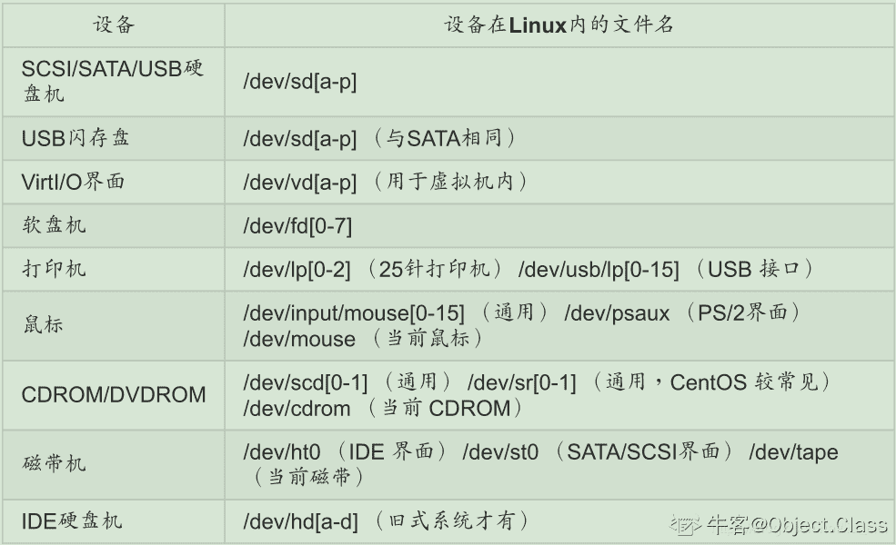

# 奇安信 2018 春招试题专业知识题 （三）

## 1

以下描述错误的是：（）

正确答案: A B C   你的答案: 空 (错误)

```cpp
SVM 是这样一个分类器，他寻找具有最小边缘的超平面，因此它也经常被称为最小边缘分类器（minimal margin classifier）  
```

```cpp
在聚类分析当中，簇内的相似性越大，簇间的差别越大，聚类的效果就越差。
```

```cpp
在决策树中，随着树中结点数变得太大，即使模型的训练误差还在继续减低，但是检验误差开始增大，这是出现了模型拟合不足的问题。
```

```cpp
聚类分析可以看作是一种非监督的分类。
```

本题知识点

Java 工程师 C++工程师 iOS 工程师 安卓工程师 运维工程师 前端工程师 算法工程师 测试工程师 安全工程师 奇安信 2018 大数据开发工程师 信息技术岗

## 2

下列几种模型方法属于判别式模型(Discriminative Model)的有（      ）

正确答案: A B   你的答案: 空 (错误)

```cpp
线性回归
```

```cpp
支持向量机
```

```cpp
混合高斯模型
```

```cpp
朴素贝叶斯
```

本题知识点

Java 工程师 C++工程师 iOS 工程师 安卓工程师 运维工程师 前端工程师 算法工程师 测试工程师 安全工程师 奇安信 2018 大数据开发工程师 信息技术岗

## 3

从网络纵深防护的角度看，下面哪一项起到第一道网络安全防线的作用（）

正确答案: C   你的答案: 空 (错误)

```cpp
Web 应用防火墙
```

```cpp
杀毒软件
```

```cpp
网络 ACL 策略
```

```cpp
IDS/IPS
```

本题知识点

Java 工程师 C++工程师 iOS 工程师 安卓工程师 运维工程师 前端工程师 算法工程师 测试工程师 安全工程师 奇安信 2018 大数据开发工程师 信息技术岗

## 4

下述攻击不属于 DOS 攻击的是：（）

正确答案: D   你的答案: 空 (错误)

```cpp
Smurf 攻击
```

```cpp
Land 攻击
```

```cpp
CC 攻击
```

```cpp
ARP 攻击
```

本题知识点

Java 工程师 C++工程师 iOS 工程师 安卓工程师 运维工程师 前端工程师 算法工程师 测试工程师 安全工程师 奇安信 2018 大数据开发工程师 信息技术岗

## 5

下列算法中哪一种采用了非对称加密技术( )

正确答案: B   你的答案: 空 (错误)

```cpp
BASE64
```

```cpp
RSA
```

```cpp
rot13
```

```cpp
3DES
```

本题知识点

Java 工程师 C++工程师 iOS 工程师 安卓工程师 运维工程师 前端工程师 算法工程师 测试工程师 安全工程师 奇安信 2018 大数据开发工程师 信息技术岗

## 6

这段字符串 SWxvdmVxaWhvbzM2MA== 最有可能是利用什么加密方式加密的？（）

正确答案: C   你的答案: 空 (错误)

```cpp
MD5
```

```cpp
RC4
```

```cpp
BASE64
```

```cpp
SHA-1
```

本题知识点

Java 工程师 C++工程师 iOS 工程师 安卓工程师 运维工程师 前端工程师 算法工程师 测试工程师 安全工程师 奇安信 2018 大数据开发工程师 信息技术岗

## 7

以下关于风险管理的描述错误的是：（）

正确答案: B   你的答案: 空 (错误)

```cpp
风险的 4 种控制方法有：降低风险/转嫁风险/规避风险/接受风险
```

```cpp
信息安全风险管理是否成功在于风险是否被切实有效的消除
```

```cpp
组织应依据信息安全方针和组织要求的安全保证程度来确定需要处理的信息安全风险
```

```cpp
信息安全风险管理是基于可接受的成本，对影响信息系统的安全风险进行识别、控制、降低或转移的过程
```

本题知识点

Java 工程师 C++工程师 iOS 工程师 安卓工程师 运维工程师 前端工程师 算法工程师 测试工程师 安全工程师 奇安信 2018 大数据开发工程师 信息技术岗

## 8

DNS 劫持的说法正确的是（）

正确答案: C   你的答案: 空 (错误)

```cpp
通过取得某域名的解析记录控制权并修改此域名的解析结果
```

```cpp
DNS 劫持通过篡改 DNS 服务器上的数据返回指向用户一个错误的 IP 地址
```

```cpp
DNS 劫持让用户得到虚假目标主机 IP 而无法其通信
```

```cpp
对于 DNS 劫持，可以采用使用国外公认的 DNS 服务器解决
```

本题知识点

Java 工程师 C++工程师 iOS 工程师 安卓工程师 运维工程师 前端工程师 算法工程师 测试工程师 安全工程师 奇安信 2018 大数据开发工程师 信息技术岗

## 9

在因特网中，IP 数据报从源结点到目的结点可能需要经过多个网络和路由器。在整个传输过程中，IP 数据报报头中的（）

正确答案: A   你的答案: 空 (错误)

```cpp
源地址和目的地址都不会发生变化
```

```cpp
源地址有可能发生变化而目的地址不会发生变化
```

```cpp
源地址不会发生变化而目的地址有可能发生变化
```

```cpp
源地址和目的地址都有可能发生变化
```

本题知识点

Java 工程师 C++工程师 iOS 工程师 安卓工程师 运维工程师 前端工程师 算法工程师 测试工程师 安全工程师 奇安信 2018 大数据开发工程师 信息技术岗

## 10

对攻击面(Attack surface)的正确定义是：（）

正确答案: B   你的答案: 空 (错误)

```cpp
一个软件系统可被攻击的漏洞的集合,软件存在的攻击面越多,软件的安全性就越低
```

```cpp
对一个软件系统可以采取的攻击方法集合,一个软件的攻击面越大安全风险就越大
```

```cpp
一个软件系统的功能模块的集合,软件的功能模块越多,可被攻击点也越多,安全风险也越大
```

```cpp
一个软件系统用户数量的集合,用户的数量越多,受到攻击可能性就越大,安全风险也越大
```

本题知识点

Java 工程师 C++工程师 iOS 工程师 安卓工程师 运维工程师 前端工程师 算法工程师 测试工程师 安全工程师 奇安信 2018 大数据开发工程师 信息技术岗

## 11

自主访问控制与强制访问控制相比具有以下哪一个优点？（）

正确答案: D   你的答案: 空 (错误)

```cpp
具有较高的安全性
```

```cpp
控制粒度较大
```

```cpp
配置效率不高
```

```cpp
具有较强灵活性
```

本题知识点

Java 工程师 C++工程师 iOS 工程师 安卓工程师 运维工程师 前端工程师 算法工程师 测试工程师 安全工程师 奇安信 2018 大数据开发工程师 信息技术岗

## 12

下面不属于软件保护机制的是哪个？（）

正确答案: D   你的答案: 空 (错误)

```cpp
Control Flow Guard (CFG)
```

```cpp
Data Execution Prevention (DEP)
```

```cpp
Address Space Layout Randomization (ASLR)
```

```cpp
Use After Free (UAF)
```

本题知识点

Java 工程师 C++工程师 iOS 工程师 安卓工程师 运维工程师 前端工程师 算法工程师 测试工程师 安全工程师 奇安信 2018 大数据开发工程师 信息技术岗

## 13

下列防御 SSH 暴力破解攻击中，最有效的是(）

正确答案: C   你的答案: 空 (错误)

```cpp
设置复杂密码
```

```cpp
更改 ssh 默认端口
```

```cpp
仅允许证书登陆
```

```cpp
禁用 Root 账户远程登陆
```

本题知识点

Java 工程师 C++工程师 iOS 工程师 安卓工程师 运维工程师 前端工程师 算法工程师 测试工程师 安全工程师 奇安信 2018 大数据开发工程师 信息技术岗

## 14

以下哪个攻击步骤是 IP 欺骗（IP Spoof）系列攻击中最关键和难度最高的？

正确答案: B   你的答案: 空 (错误)

```cpp
对被冒充的主机进行拒绝服务攻击，使其无法对目标主机进行响应
```

```cpp
与目标主机进行会话，猜测目标主机的序号规则
```

```cpp
冒充受信主机想目标主机发送数据包，欺骗目标主机
```

```cpp
向目标主机发送指令，进行会话操作
```

本题知识点

Java 工程师 C++工程师 iOS 工程师 安卓工程师 运维工程师 前端工程师 算法工程师 测试工程师 安全工程师 奇安信 2018 大数据开发工程师 信息技术岗

## 15

作为企业网络管理员，你 UNIX 下 IPTABLES 作为防火墙，你现在需要通过对防火墙的配置禁止 192.168.0.2 远程桌面访问你的服务器，你应该怎么设置防火墙规则？（）

正确答案: A   你的答案: 空 (错误)

```cpp
iptables—A input—p tcp—s 192.168.0.2—destination—port 23—j DENY
```

```cpp
iptables—A input—p tcp—s 192.168.0.2—source—port 23—j DENY
```

```cpp
iptables—A input—p tcp—d 192.168.0.2—destination—port 23—j DENY
```

```cpp
iptables—A input—p tcp—d 192.168.0.2—source—port 23—j DENY
```

本题知识点

Java 工程师 C++工程师 iOS 工程师 安卓工程师 运维工程师 前端工程师 算法工程师 测试工程师 安全工程师 奇安信 2018 大数据开发工程师 信息技术岗

## 16

小明通过 ssh 登入服务器 A 发现其开放端口如下：22、80、443、5900，下列漏洞中最不可能出现在 A 服务器上的是( )

正确答案: C   你的答案: 空 (错误)

```cpp
CSRF
```

```cpp
心脏滴血漏洞
```

```cpp
HTTP.sys 远程代码执行漏洞
```

```cpp
VNC 认证绕过漏洞
```

本题知识点

Java 工程师 C++工程师 iOS 工程师 安卓工程师 运维工程师 前端工程师 算法工程师 测试工程师 安全工程师 奇安信 2018 大数据开发工程师 信息技术岗

## 17

linux 中，能够查看网卡最大速度的命令是（）

正确答案: D   你的答案: 空 (错误)

```cpp
nslookup
```

```cpp
ifconfig
```

```cpp
sar
```

```cpp
eth
```

本题知识点

Java 工程师 C++工程师 iOS 工程师 安卓工程师 运维工程师 前端工程师 算法工程师 测试工程师 安全工程师 奇安信 2018 大数据开发工程师 信息技术岗

讨论

[郫县男子计院](https://www.nowcoder.com/profile/328790495)

nslookup 是用来查询 DNS 解析情况 ifconfig 是查看或配置网卡信息用

sysstat 是 Linux 系统中的常用工具包。它的主要用途是观察服务负载，比如 CPU 和内存的占用率、网络的使用率以及磁盘写入和读取速度等。

sysstat 工具包中包含两类工具：

*   即时查看工具：iostat、mpstat、sar
*   累计统计工具：sar

也就是说，sar 具有这两种功能。

ethtool 是用于查询及设置网卡参数的命令。

发表于 2020-02-28 16:31:44

* * *

## 18

在 Linux 中文件权限包含了哪些信息（      ）

正确答案: D   你的答案: 空 (错误)

```cpp
所有者权限
```

```cpp
组用户权限
```

```cpp
其他用户权限
```

```cpp
所有者权限、组用户权限、其他用户权限
```

本题知识点

Java 工程师 C++工程师 iOS 工程师 安卓工程师 运维工程师 前端工程师 算法工程师 测试工程师 安全工程师 奇安信 2018 大数据开发工程师 信息技术岗

## 19

文件 exer1 的访问权限为 rw-r--r-- ，现要增加所有用户的执行权限和同组用户的写权限，下列命令正确的是（）

正确答案: A   你的答案: 空 (错误)

```cpp
chmoda+xg+w exer1
```

```cpp
chmod 765 exer1
```

```cpp
chmodo+x exer1
```

```cpp
chmodg+w exer1 
```

本题知识点

Java 工程师 C++工程师 iOS 工程师 安卓工程师 运维工程师 前端工程师 算法工程师 测试工程师 安全工程师 奇安信 2018 大数据开发工程师 信息技术岗

## 20

在 Linux 主机中，安装在第二个 SATA 接口的硬盘对应的设备文件名为（      ）

正确答案: B   你的答案: 空 (错误)

```cpp
/dev/sda
```

```cpp
/dev/sdb
```

```cpp
/dev/hda
```

```cpp
/dev/hdb
```

本题知识点

Java 工程师 C++工程师 iOS 工程师 安卓工程师 运维工程师 前端工程师 算法工程师 测试工程师 安全工程师 奇安信 2018 大数据开发工程师 信息技术岗

讨论

[郫县男子计院](https://www.nowcoder.com/profile/328790495)

在 Linux 系统中,每个设备都被当成一个文件来对待,举例来说, SATA 接口的硬盘的文件名称即为/dev/sd[a-d]因此第二块就是/dev/sdb

编辑于 2020-02-28 16:33:26

* * *

## 21

linux 中，以下哪个状态的进程不能被杀死（）

正确答案: C   你的答案: 空 (错误)

```cpp
S
```

```cpp
R
```

```cpp
D
```

```cpp
T
```

本题知识点

Java 工程师 C++工程师 iOS 工程师 安卓工程师 运维工程师 前端工程师 算法工程师 测试工程师 安全工程师 奇安信 2018 大数据开发工程师 信息技术岗

讨论

[封玉](https://www.nowcoder.com/profile/972810200)

R 是进程正在运行或者运行队列中等待 S 进程处于休眠中，中断 D 不可中断，用 kill 命令也不能将其结束 Z 僵死，进程已经终止但是描述符依然存在 T 停止进程收到停止信号后停止运行

发表于 2020-05-13 16:16:31

* * *

[郫县男子计院](https://www.nowcoder.com/profile/328790495)

[`blog.csdn.net/wjd_231/article/details/81432999`](https://blog.csdn.net/wjd_231/article/details/81432999)

发表于 2020-02-28 16:39:10

* * *

## 22

shell 不仅仅是用户命令解释器，同时一种强大的编程语言，linux 缺省的 shell 是什么（）

正确答案: A   你的答案: 空 (错误)

```cpp
bash
```

```cpp
ruby
```

```cpp
PHP
```

```cpp
perl
```

本题知识点

Java 工程师 C++工程师 iOS 工程师 安卓工程师 运维工程师 前端工程师 算法工程师 测试工程师 安全工程师 奇安信 2018 大数据开发工程师 信息技术岗

## 23

办公室的一台计算机只能使用 IP 地址而无法使用域名访问外部网站，造成这种情况的原因不可能是（      ）

正确答案: B   你的答案: 空 (错误)

```cpp
该计算机设置的 DNS 服务器没有提供正常域名解析服务
```

```cpp
该计算机与 DNS 服务器不在同一子网
```

```cpp
提供被访问服务器名字解析的 DNS 服务器有故障
```

```cpp
该计算机发起的目的端口为 53 的访问请求被限制
```

本题知识点

Java 工程师 C++工程师 iOS 工程师 安卓工程师 运维工程师 前端工程师 算法工程师 测试工程师 安全工程师 奇安信 2018 大数据开发工程师 信息技术岗

## 24

windows 系统预防 arp 假冒使用的指令和参数是（      ）

正确答案: C   你的答案: 空 (错误)

```cpp
arp -a
```

```cpp
 rarp -d
```

```cpp
arp -s
```

```cpp
arp -d
```

本题知识点

Java 工程师 C++工程师 iOS 工程师 安卓工程师 运维工程师 前端工程师 算法工程师 测试工程师 安全工程师 奇安信 2018 大数据开发工程师 信息技术岗

## 25

公司办公室有一台交换机,具有 12 个 10/100Mbps 端口和 4 个 1000Mbps 端口，100M 端口使用半双工传输模式，1000M 端口使用全双工传输模式,交换机总带宽应为（      ）

正确答案: C   你的答案: 空 (错误)

```cpp
0.92G 
```

```cpp
1.6G 
```

```cpp
 2.0G
```

```cpp
3.2G
```

本题知识点

Java 工程师 C++工程师 iOS 工程师 安卓工程师 运维工程师 前端工程师 算法工程师 测试工程师 安全工程师 奇安信 2018 大数据开发工程师 信息技术岗

讨论

[郫县男子计院](https://www.nowcoder.com/profile/328790495)

12 个 10/100Mbps 端口 半双工  1.2G4 个 1000Mbps 端口  全双工   4G*2=8G 一共 9.2G

发表于 2020-02-28 16:41:00

* * *

## 26

下面对 linux 下 mysqldump 备份命令及参数描述正确的是（）

正确答案: A   你的答案: 空 (错误)

```cpp
 mysqldump -h ip -u -p DBNAME >bck.sql
```

```cpp
mysqldump -Pip -hDBNAME>bck.sql
```

```cpp
mysqldump -uip -P DBNAME>bck.sql
```

```cpp
mysqldump -h ip -uDBNAME>bck.sql
```

本题知识点

Java 工程师 C++工程师 iOS 工程师 安卓工程师 运维工程师 前端工程师 算法工程师 测试工程师 安全工程师 奇安信 2018 大数据开发工程师 信息技术岗

## 27

关于 Linux 接口 select 和 epoll 说法正确的是（      ） 正确答案: B C D   你的答案: 空 (错误)

```cpp
select 较适合于有大量并发连接,且活跃链接较多的场景
```

```cpp
select 的最大连接数为 FD_SETSIZE
```

```cpp
epoll 的效率不随 FD 数目增加而线性下降
```

```cpp
epoll 在传递内核与用户空间的消息时使用了内存共享
```

本题知识点

Java 工程师 C++工程师 iOS 工程师 安卓工程师 运维工程师 前端工程师 算法工程师 测试工程师 安全工程师 奇安信 2018 大数据开发工程师 信息技术岗

## 28

网络管理员在安装操作系统时，经常会遇到系统盘无法正常格式化导致系统安装失败，可以解决的方法有（      ）

正确答案: A C   你的答案: 空 (错误)

```cpp
lformat 
```

```cpp
format
```

```cpp
fdisk 
```

```cpp
fdisk /mbr
```

本题知识点

Java 工程师 C++工程师 iOS 工程师 安卓工程师 运维工程师 前端工程师 算法工程师 测试工程师 安全工程师 奇安信 2018 大数据开发工程师 信息技术岗

## 29

公司办公室的一台计算机通过 IP 可以访问外网，无法使用域名访问外部 web 服务器,造成这种情况可能的原因是（      ）

正确答案: A B   你的答案: 空 (错误)

```cpp
该计算机的 DNS 缓存有错
```

```cpp
没有指定正确的 DNS 服务器
```

```cpp
该计算机与 DNS 服务器 IP 地址在不同的网段
```

```cpp
网关设置出错
```

本题知识点

Java 工程师 C++工程师 iOS 工程师 安卓工程师 运维工程师 前端工程师 算法工程师 测试工程师 安全工程师 奇安信 2018 大数据开发工程师 信息技术岗

## 30

执行命令 sudo chmod 644 file 后，对 file 文件权限说法正确的是（      ）

正确答案: A C   你的答案: 空 (错误)

```cpp
所有者有读、写权限
```

```cpp
组用户有读、写权限
```

```cpp
其他用户有读权限
```

```cpp
组用户和其他用户有读、写权限
```

本题知识点

Java 工程师 C++工程师 iOS 工程师 安卓工程师 运维工程师 前端工程师 算法工程师 测试工程师 安全工程师 奇安信 2018 大数据开发工程师 信息技术岗

## 31

下列有关 Linux Core 文件的叙述中不正确是(            )

正确答案: C   你的答案: 空 (错误)

```cpp
使用 ulimit -c 命令可查看 core 文件的生成开关
```

```cpp
core 文件需要使用 kdb 来查看
```

```cpp
在程序调试过程中，可以使用 bt 命令查看程序出错的地方
```

```cpp
用 ulimit -c 0 命令可以阻止系统生成 core 文件
```

本题知识点

Java 工程师 C++工程师 iOS 工程师 安卓工程师 运维工程师 前端工程师 算法工程师 测试工程师 安全工程师 奇安信 2018 大数据开发工程师 信息技术岗

## 32

调试一个程序，首先必须使程序中包含调试信息，在添加调试信息的步骤中，Debug Info 下拉列表框，可供选择的调试信息方式中（）表示目标文件或者可执行文件中只包含全局和导出符号以及代码行信息，不包含符号调试信息 

正确答案: C   你的答案: 空 (错误)

```cpp
None
```

```cpp
 C7 Compatible:
```

```cpp
Line Numbers Only
```

```cpp
Program Database
```

本题知识点

Java 工程师 C++工程师 iOS 工程师 安卓工程师 运维工程师 前端工程师 算法工程师 测试工程师 安全工程师 奇安信 2018 大数据开发工程师 信息技术岗

## 33

小张所在的软件公司正在开发用于教学辅助的软件，该软件有上位机和下位机两个部分组成，在开发过程中，小张发现下位机发给上位机的数据有问题，但是下位机又不能长时间进入调试状态，否则下位机内部时序就有可能出现问题，从而导致其他莫名其妙的问题。在这种情况下比较有效的断点调试应该是（  ）。

正确答案: B   你的答案: 空 (错误)

```cpp
设置条件断点，在满足条件下进行调试。
```

```cpp
设置监视断点，查看程序执行过程中变量的值。
```

```cpp
设置异常断点，在程序出现异常时进行调试。
```

```cpp
设置数据断点，在程序修改数据时进行调试。
```

本题知识点

Java 工程师 C++工程师 iOS 工程师 安卓工程师 运维工程师 前端工程师 算法工程师 测试工程师 安全工程师 奇安信 2018 大数据开发工程师 信息技术岗

讨论

[蜗牛 201808310809922](https://www.nowcoder.com/profile/442146821)

断点没区别<p>B.观察，分析，统计，生产优先</p>

编辑于 2021-06-01 17:24:19

* * *

## 34

小王和他的项目组正在用 VC++开发一套视频处理软件，小王负责视频播放部分的代码，可是在开发过程中小王发现用于描述视频数据长度的变量会被莫名其妙的改成一个负值，从而导致视频播放处的代码有问题，经小王初步分析，导致该变量为负值可能是视频编码的问题，也可能是视频内容处理的问题，或者是其他模块出错导致误修改。小王准备着手解决这个 bug，比较有效的调试技巧应该是（  ）。

正确答案: C   你的答案: 空 (错误)

```cpp
对所有修改视频数据长度的代码设置断点，进行调试
```

```cpp
设置异常断点，在程序进入异常时进行调试
```

```cpp
设置数据断点，在程序修改数据时进行调试。
```

本题知识点

Java 工程师 C++工程师 iOS 工程师 安卓工程师 运维工程师 前端工程师 算法工程师 测试工程师 安全工程师 奇安信 2018 大数据开发工程师 信息技术岗

讨论

[二十马赫](https://www.nowcoder.com/profile/50854161)

c

发表于 2020-12-05 21:58:20

* * *

## 35

在 Eclipse 中，添加断点的方法，以下正确的是（      ）

正确答案: B C   你的答案: 空 (错误)

```cpp
选择想要设置断点的行，在键盘上按下快捷键 Ctrl+Alt+B
```

```cpp
将光标放置到想要设置断点的行，然后执行 Run->Toggle Breakpoint
```

```cpp
在编辑器中直接双击想要设置断点行左边的空白处
```

```cpp
其他几项说法都正确
```

本题知识点

Java 工程师 C++工程师 iOS 工程师 安卓工程师 运维工程师 前端工程师 算法工程师 测试工程师 安全工程师 奇安信 2018 大数据开发工程师 信息技术岗

## 36

下面关于 VS 调试技巧的说法，正确的是（      ）

正确答案: A C   你的答案: 空 (错误)

```cpp
可以把鼠标指向感兴趣的一个变量，查看相关表达式
```

```cpp
可以在调试过程中修改代码，但需要重新编译后重新调试
```

```cpp
在 VS 中可以设置条件断点，如果条件不满足，VS 会自动忽略该断点
```

```cpp
如果改变了方法的签名，添加新方法或者类可以不用重新启动程序
```

本题知识点

Java 工程师 C++工程师 iOS 工程师 安卓工程师 运维工程师 前端工程师 算法工程师 测试工程师 安全工程师 奇安信 2018 大数据开发工程师 信息技术岗

## 37

在 spss 的基础分析模块中，作用是“以行列表的形式揭示数据之间的关系”的是（      ）

正确答案: C   你的答案: 空 (错误)

```cpp
数据描述
```

```cpp
相关
```

```cpp
交叉表
```

```cpp
多重相应
```

本题知识点

Java 工程师 C++工程师 iOS 工程师 安卓工程师 运维工程师 前端工程师 算法工程师 测试工程师 安全工程师 奇安信 2018 大数据开发工程师 信息技术岗

## 38

SPSS 的界面中，以下是主窗口是（      ）

正确答案: B   你的答案: 空 (错误)

```cpp
语法编辑窗口
```

```cpp
数据编辑窗口
```

```cpp
结果输出窗口
```

```cpp
脚本编辑窗口
```

本题知识点

Java 工程师 C++工程师 iOS 工程师 安卓工程师 运维工程师 前端工程师 算法工程师 测试工程师 安全工程师 奇安信 2018 大数据开发工程师 信息技术岗

## 39

有两个样本点，第一个点为正样本,它的特征向量是(0,-1);第二个点为负样本,它的特征向量是(2,3),从这两个样本点组成的训练集构建一个线性 SVM 分类器的分类面方程是（      ）

正确答案: A   你的答案: 空 (错误)

```cpp
x+2y=5
```

```cpp
x-2y=5
```

```cpp
x-y=2
```

```cpp
x+y=3
```

本题知识点

Java 工程师 C++工程师 iOS 工程师 安卓工程师 运维工程师 前端工程师 算法工程师 测试工程师 安全工程师 奇安信 2018 大数据开发工程师 信息技术岗

## 40

以下说法中，不属于一元线性回归分析特点是(            )

正确答案: C   你的答案: 空 (错误)

```cpp
两个变量是非对等关系
```

```cpp
可求出两个回归方程
```

```cpp
利用一元回归方程，两个变量可以互相推算
```

```cpp
自变量是非随机的，因变量是随机的 
```

本题知识点

Java 工程师 C++工程师 iOS 工程师 安卓工程师 运维工程师 前端工程师 算法工程师 测试工程师 安全工程师 奇安信 2018 大数据开发工程师 信息技术岗

## 41

下列方法中，（      ）可以用于预测连续或有序值（      ）

正确答案: D   你的答案: 空 (错误)

```cpp
分类
```

```cpp
聚类
```

```cpp
预测
```

```cpp
回归
```

本题知识点

Java 工程师 C++工程师 iOS 工程师 安卓工程师 运维工程师 前端工程师 算法工程师 测试工程师 安全工程师 奇安信 2018 大数据开发工程师 信息技术岗

## 42

下列有关正态分布的叙述中不正确的是(            )

正确答案: C   你的答案: 空 (错误)

```cpp
标准正态分布的均值为 0，方差为 1
```

```cpp
正态曲线以均数为中心，左右对称，曲线两端永远不与横轴相交
```

```cpp
标准差σ决定正态曲线的中心位置；均数μ决定正态曲线的陡峭或扁平程度。
```

```cpp
正态分布具有均匀变动性的特点
```

本题知识点

Java 工程师 C++工程师 iOS 工程师 安卓工程师 运维工程师 前端工程师 算法工程师 测试工程师 安全工程师 奇安信 2018 大数据开发工程师 信息技术岗

## 43

假设 12 个销售价格记录组已经排序如下：5, 10, 11, 13, 15, 35, 50, 55, 72, 92, 204, 215 使用如下每种方法将它们划分成四个箱。等频（等深）划分时，15 在第几个箱子内？ ( )

正确答案: B   你的答案: 空 (错误)

```cpp
第一个 
```

```cpp
第二个
```

```cpp
第三个 
```

```cpp
第四个 
```

本题知识点

Java 工程师 C++工程师 iOS 工程师 安卓工程师 运维工程师 前端工程师 算法工程师 测试工程师 安全工程师 奇安信 2018 大数据开发工程师 信息技术岗

## 44

考虑下面的频繁 3-项集的集合：{1，2，3}，{1，2，4}，{1，2，5}，{1，3，4}，{1，3，5}，{2，3，4}，{2，3，5}，{3，4，5}假定数据集中只有 5 个项，采用合并策略，由候选产生过程得到 4-项集不包含（ ）

正确答案: C   你的答案: 空 (错误)

```cpp
1，2，3，4 
```

```cpp
1，2，3，5 
```

```cpp
1，2，4，5
```

```cpp
1，3，4，5
```

本题知识点

Java 工程师 C++工程师 iOS 工程师 安卓工程师 运维工程师 前端工程师 算法工程师 测试工程师 安全工程师 奇安信 2018 大数据开发工程师 信息技术岗

## 45

SPSS 中，数据整理的功能主要集中在（      ）等菜单中

正确答案: A D   你的答案: 空 (错误)

```cpp
数据
```

```cpp
直销
```

```cpp
分析
```

```cpp
转换
```

本题知识点

Java 工程师 C++工程师 iOS 工程师 安卓工程师 运维工程师 前端工程师 算法工程师 测试工程师 安全工程师 奇安信 2018 大数据开发工程师 信息技术岗

## 46

处理丢失数据、补充丢失值的方法有（      ）

正确答案: A B C D   你的答案: 空 (错误)

```cpp
填“0”
```

```cpp
绝对均值
```

```cpp
条件均值
```

```cpp
条件概率分布
```

本题知识点

Java 工程师 C++工程师 iOS 工程师 安卓工程师 运维工程师 前端工程师 算法工程师 测试工程师 安全工程师 奇安信 2018 大数据开发工程师 信息技术岗

## 47

小明去操场打篮球，他在罚球线投篮，有 0.4 的概率投进，想至少有一次投进的概率不低于 0.9，他至少需要投（）次

正确答案: C   你的答案: 空 (错误)

```cpp
3
```

```cpp
4
```

```cpp
5
```

```cpp
6
```

本题知识点

Java 工程师 C++工程师 iOS 工程师 安卓工程师 运维工程师 前端工程师 算法工程师 测试工程师 安全工程师 奇安信 2018 大数据开发工程师 信息技术岗

## 48

小明去操场打篮球，他在罚球线投篮，有 0.4 的概率投进，想至少有一次投进的概率不低于 0.9，他至少需要投（）次

正确答案: C   你的答案: 空 (错误)

```cpp
2/3
```

```cpp
11/15
```

```cpp
5/6
```

```cpp
13/15
```

本题知识点

Java 工程师 C++工程师 iOS 工程师 安卓工程师 运维工程师 前端工程师 算法工程师 测试工程师 安全工程师 奇安信 2018 大数据开发工程师 信息技术岗

## 49

甲、乙、丙三人分别独立解一道题，甲做对的概率为 1/2 ，甲、乙、丙三人都做对的概率是 1/24，甲、乙、丙三人全做错的概率是 1/4,则甲、乙、丙三人中恰有一人做对这一道题的概率(            )

正确答案: D   你的答案: 空 (错误)

```cpp
 1/3
```

```cpp
 1/4
```

```cpp
 7/24
```

```cpp
 11/24
```

本题知识点

Java 工程师 C++工程师 iOS 工程师 安卓工程师 运维工程师 前端工程师 算法工程师 测试工程师 安全工程师 奇安信 2018 大数据开发工程师 信息技术岗

讨论

[小学渣——1](https://www.nowcoder.com/profile/542016143)

1/24。简单信息：甲对=1/2，甲错=1/2；由题目知，乙+丙全错=1/2，乙+丙全对=1/12，非（乙+丙全错）=乙对+丙对、乙对+丙错、乙错+丙对=1/12+x = 1 - 1/2（题目信息）=1/2=（乙对+丙对、乙对+丙错）+1/12（乙丙全对）=5/12.甲、乙、丙三人中恰有一人做对情况包括： 甲对*乙丙全错=1/2*1/2 甲错*（乙丙一方对、一方错）=1/2*5/12 以上两种情况相加：1/2*（1/2+5/12）=11/24 故，答案选择 D！

编辑于 2022-02-04 13:59:47

* * *

## 50

用 1 或 2 两种数字写 10 位数，其中任意相邻两个位置不全为 1，那么这样的 10 位数有多少个(            )

正确答案: B   你的答案: 空 (错误)

```cpp
89
```

```cpp
144
```

```cpp
203
```

```cpp
269
```

本题知识点

Java 工程师 C++工程师 iOS 工程师 安卓工程师 运维工程师 前端工程师 算法工程师 测试工程师 安全工程师 奇安信 2018 大数据开发工程师 信息技术岗

## 51

已知 A={1，...，n}，从中取 2r （2r<n>正确答案: A   你的答案: 空 (错误)

```cpp
（n-2r+1,2r-1）
```

```cpp
（n+2r-1,2r）
```

```cpp
（n-2r+1,n-4r+1）
```

```cpp
（n-r+1,r）
```

本题知识点

Java 工程师 C++工程师 iOS 工程师 安卓工程师 运维工程师 前端工程师 算法工程师 测试工程师 安全工程师 奇安信 2018 大数据开发工程师 信息技术岗

## 52

P∨(¬P→(Q∨(-Q∨¬R)))的主合取范式是下列哪个选项？（      ）

正确答案: A   你的答案: 空 (错误)

```cpp
P∨Q∨R
```

```cpp
P∧Q∧R
```

```cpp
P∨Q∧R
```

```cpp
P∧Q∨R
```

本题知识点

Java 工程师 C++工程师 iOS 工程师 安卓工程师 运维工程师 前端工程师 算法工程师 测试工程师 安全工程师 奇安信 2018 大数据开发工程师 信息技术岗</n>