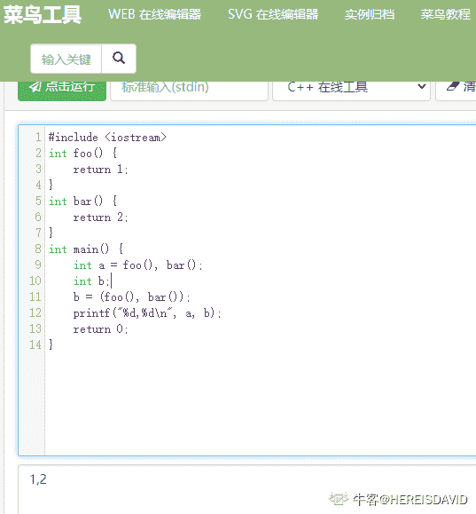

# 奇安信 2019 春招测试方向试题

## 1

```cpp
class A {
     public:
         virtual void Foo() = 0;
         virtual void Print() { printf("A\n"); }
 };
 class B: public A{
     public:
         void Foo() override { printf("FOO\n"); }
         void Print() override { printf("B\n"); }
 };
 int main() {
     A* ptr1 = new A;
     A* ptr2 = new B;
     ptr1->Print();
     ptr2->Print();
     return 0;
 }
```

正确答案: D   你的答案: 空 (错误)

```cpp
A,B
```

```cpp
A,A
```

```cpp
B,B
```

```cpp
编译报错，无法执行
```

本题知识点

测试工程师 奇安信 2019

讨论

[王皮球](https://www.nowcoder.com/profile/4622471)

A 类中有纯虚函数 Foo()，为抽象类，抽象类不能实例化对象。 发表于 2020-02-26 15:57:27

* * *

## 2

下面哪些函数是一个类的成员函数？（）

正确答案: A B C   你的答案: 空 (错误)

```cpp
默认构造函数
```

```cpp
拷贝构造函数
```

```cpp
移动构造函数
```

```cpp
友元函数
```

本题知识点

测试工程师 奇安信 2019

讨论

[牛客 205208482 号](https://www.nowcoder.com/profile/205208482)

友元函数是可以访问类成员函数的私有元素的非成员函数

编辑于 2020-09-11 16:11:01

* * *

## 3

下面关于 new 函数的说法正确的是？（）

正确答案: A   你的答案: 空 (错误)

```cpp
new 在堆上开辟内存
```

```cpp
new 在栈上开辟内存
```

```cpp
new 在代码段开辟内存
```

```cpp
new 在数据段开辟内存
```

本题知识点

测试工程师 奇安信 2019

讨论

[ZhenK](https://www.nowcoder.com/profile/647852162)

堆是由 new 分配的内存块

发表于 2020-07-31 20:45:19

* * *

## 4

```cpp
class A {
    int content_;
};
```

A 中成员 content_ 的可见性是什么？

正确答案: B   你的答案: 空 (错误)

```cpp
public
```

```cpp
private
```

```cpp
protected
```

本题知识点

测试工程师 奇安信 2019

讨论

[去年二四九](https://www.nowcoder.com/profile/591289783)

我就说怎么怪怪的，我学的 Java 啊，这套题莫名其妙，c++，python 都在考，要不是我涉猎广泛就崩溃了，测试怎么会这样搞

发表于 2020-07-31 22:36:42

* * *

[谷雨 0⁰](https://www.nowcoder.com/profile/81728073)

类中成员不做 public 或 private 声明的，默认为 private

发表于 2020-03-26 15:39:54

* * *

[易星辰 33](https://www.nowcoder.com/profile/890485375)

我觉得这道题应该指明语言，我以为是 Java，默认访问权限应该是 default，然后发现没有该选项，就选了与之较接近的 protected。结果一查才知道，在 C++中默认为 private。。。

发表于 2020-04-22 12:04:34

* * *

## 5

下面哪个不是 C++的关键字（）

正确答案: D   你的答案: 空 (错误)

```cpp
static
```

```cpp
volatile
```

```cpp
register
```

```cpp
synchornize
```

本题知识点

测试工程师 奇安信 2019

讨论

[风邀清帘](https://www.nowcoder.com/profile/140138187)

volatile 关键字是一种限定符用来声明一个对象在程序中可以被语句外的东西修改,比如操作系统、硬件或并发执行线程。
遇到该关键字，编译器不再对该变量的代码进行优化，不再从寄存器中读取变量的值，而是直接从它所在的内存中读取值，即使它前面的指令刚刚从该处读取过数据。而且读取的数据立刻被保存。
register 用来声明变量，然后声明出来的变量是直接放在 cpu 的寄存器当中，而非就是通过内存寻址访问，这样效率更高。

发表于 2020-03-28 17:01:42

* * *

## 6

下面程序的输出是什么？（）

```cpp
class A {
    public:
        void Print() {
            printf("%d\n", content_);
        }
    public:
        int content_;
};
void Add(A a) {
    a.content_ ++;
}
int main () {
    A a{content_: 1};
    Add(a);
    a.Print();
    return 0;
}
```

正确答案: B   你的答案: 空 (错误)

```cpp
0
```

```cpp
1
```

```cpp
2
```

```cpp
编译报错，无法执行
```

本题知识点

测试工程师 奇安信 2019

讨论

[刘伟鹏](https://www.nowcoder.com/profile/881630647)

**C++对象**可以作为参数传递给函数，其方法**与传递其他类型的数据相同**。

在向函数传递对象时，是通过**传值调用**传递给函数的。

因此，函数中对对象的任何修改均**不影响调用该函数的对象本身**。别跟 java 弄混了。

发表于 2020-02-27 17:17:11

* * *

[Prosat](https://www.nowcoder.com/profile/912297042)

A a｛content_ ：1｝

是什么语法，vs2017 编译不通过

发表于 2020-03-28 10:37:04

* * *

## 7

下面程序的输出是什么？

```cpp
int foo() {
    return 1;
}
int bar() {
    return 2;
}
int main() {
    int a = foo(), bar();
    int b;
    b = (foo(), bar());
    printf("%d,%d\n", a, b);
    return 0;
}
```

正确答案: D   你的答案: 空 (错误)

```cpp
1,1
```

```cpp
1,2
```

```cpp
2,2
```

```cpp
编译错误，无法执行
```

本题知识点

测试工程师 奇安信 2019

讨论

[刘伟鹏](https://www.nowcoder.com/profile/881630647)

a=1,2  则 a = 1a=（1,2），则 a = 2 但本题用的是两个子函数，子函数返回值得先用变量获取，不能直接写成 b = (foo(), bar());这类格式

发表于 2020-02-27 17:24:21

* * *

[牛客 311038338 号](https://www.nowcoder.com/profile/311038338)

跑出答案是 B

发表于 2020-08-31 20:12:42

* * *

[HEREISDAVID](https://www.nowcoder.com/profile/864672146)

？？啊这....

发表于 2020-09-26 11:30:06

* * *

## 8

下面程序的输出是什么？

```cpp
class A {
    public:
        A() { printf("A()\n"); }
        virtual ~A() { printf("~A()\n"); }
};
class B : public A {
    public:
        B() { printf("B()\n"); }
        ~B() { printf("~B()\n"); }
};
int main() {
    auto tmp = B();
    return 0;
}
```

正确答案: C   你的答案: 空 (错误)

```cpp
B() ~B()
```

```cpp
B() A() ~A() ~B()
```

```cpp
A() B() ~B() ~A()
```

```cpp
A() B() ~A() ~B()
```

本题知识点

测试工程师 奇安信 2019

讨论

[牛客 205208482 号](https://www.nowcoder.com/profile/205208482)

执行顺序：父类构造，子类构造，子类析构，父类析构

发表于 2020-09-11 16:17:23

* * *

[老胡子带着假发](https://www.nowcoder.com/profile/537271635)

先执行的后析构@__@

发表于 2020-08-08 00:42:26

* * *

## 9

A，B 是两个独立的类，则 A 中那种数据成员是非法的（）

正确答案: B   你的答案: 空 (错误)

```cpp
A* a_
```

```cpp
A a_
```

```cpp
B* a_
```

```cpp
B a_
```

本题知识点

测试工程师 奇安信 2019

讨论

[牛客 126447516 号](https://www.nowcoder.com/profile/126447516)

A a 会无限递归导致栈溢出

发表于 2020-02-26 19:16:45

* * *

## 10

下面哪些变量名是非法的（）

正确答案: C D   你的答案: 空 (错误)

```cpp
a
```

```cpp
_a
```

```cpp
1a
```

```cpp
case
```

本题知识点

测试工程师 奇安信 2019

讨论

[云画的 healer](https://www.nowcoder.com/profile/930876796)

字母或下划线开头，也不能是关键字

发表于 2020-06-14 17:05:49

* * *

## 11

C++支持以下哪些编程范式（）

正确答案: A B C   你的答案: 空 (错误)

```cpp
面向过程
```

```cpp
面向对象
```

```cpp
泛型
```

本题知识点

测试工程师 奇安信 2019

## 12

下面关于新建线程的叙述，正确的是？（）

正确答案: A   你的答案: 空 (错误)

```cpp
进入新建状态的线程，没有被分配资源
```

```cpp
当线程被创建时，可以马上启动
```

```cpp
新建线程可以使用 start()、stop() 和 wait() 等多个方法
```

```cpp
新建状态的线程，通过调用方法 join() 可以进入阻塞状态
```

本题知识点

测试工程师 奇安信 2019

讨论

[小小酥在江湖](https://www.nowcoder.com/profile/607013225)

 线程被创建后，并不马上启动，而是进入新建状态。此时线程没有被分配资源，只能使用 start( )和 stop( )两个控制方法。join（）调用这个方法的主线程强制加入

发表于 2020-07-31 20:04:12

* * *

## 13

下面语句中会产生编译错误的是？（）

正确答案: C   你的答案: 空 (错误)

```cpp
float F = 4096.0 F;
```

```cpp
double D = 4096.0;
```

```cpp
byte B = 4096;
```

```cpp
char C = 4096;
```

本题知识点

测试工程师 奇安信 2019

讨论

[猫晓 _](https://www.nowcoder.com/profile/368911933)

byte 有符号

发表于 2020-02-27 20:22:12

* * *

[牛客 499927710 号](https://www.nowcoder.com/profile/499927710)

byte 类型范围是-128~127

发表于 2020-03-27 17:36:42

* * *

[春帘幽梦媚](https://www.nowcoder.com/profile/974326429)

char 在 Java 中占两个字节

发表于 2022-03-19 21:17:42

* * *

## 14

关于 Spring MVC 的核心控制器 DispatcherServlet 的作用，以下说法错误的是()

正确答案: B   你的答案: 空 (错误)

```cpp
负责接收 HTTP 请求
```

```cpp
实现业务操作
```

```cpp
初始化上下应用对象 ApplicationContext
```

```cpp
加载配置文件
```

本题知识点

测试工程师 奇安信 2019

讨论

[、hi](https://www.nowcoder.com/profile/623067178)

DispatcherServlet 作为 SpringMVC 的前端控制器，负责接收用户的请求，并根据用户的请求返回相应的视图给用户，而实现业务的操作在 service 层。

发表于 2020-02-27 16:00:51

* * *

## 15

下列情况中，不会使线程返回所持有的对象锁是哪个？()

正确答案: D   你的答案: 空 (错误)

```cpp
当 synchronized() 语句块执行完毕
```

```cpp
内部类只能使用它所在类的静态成员变量，不能使用它所在类的方法中的局部变量
```

```cpp
内部类可以使用 abstract 修饰定义为抽象类，不能用 private 或 protected 定义
```

```cpp
外部使用内部类时，必须给出类的全名
```

本题知识点

测试工程师 奇安信 2019

讨论

[张俊琦 2021](https://www.nowcoder.com/profile/417512105)

感觉 D 跟问题没啥关系就选了

发表于 2020-07-30 19:49:29

* * *

[江边鸟](https://www.nowcoder.com/profile/451872365)

这题是串题了吧，问题问的是对象锁，BCD 又说的内部类

发表于 2020-03-27 11:02:33

* * *

[刘伟鹏](https://www.nowcoder.com/profile/881630647)

有人能解释一下题意吗，不懂

发表于 2020-02-27 17:25:00

* * *

## 16

Java 中的线程模型由三部分组成，与线程模型组成无关的是哪个？（）

正确答案: C   你的答案: 空 (错误)

```cpp
虚拟的 CPU
```

```cpp
程序代码
```

```cpp
操作系统的内核状态
```

```cpp
数据
```

本题知识点

测试工程师 奇安信 2019

讨论

[刘伟鹏](https://www.nowcoder.com/profile/881630647)

java 线程模型包括 数据，程序代码，虚拟的 CPU，与系统内核这种硬件方面没关系

发表于 2020-02-27 17:30:39

* * *

[牛客 415238995 号](https://www.nowcoder.com/profile/415238995)

```cpp
虚拟的 CPU
```

```cpp
程序代码
```

```cpp
数据
```

发表于 2021-03-06 10:05:05

* * *

## 17

在一个线程中调用下列方法，一定会改变线程运行状态的是？（）

正确答案: C   你的答案: 空 (错误)

```cpp
yield 方法
```

```cpp
urrentThread 方法
```

```cpp
sleep 方法
```

```cpp
一个对象的 notify 方法
```

本题知识点

测试工程师 奇安信 2019

讨论

[刘伟鹏](https://www.nowcoder.com/profile/881630647)

yield（）：yield（）方法能让同优先级的线程有执行的机会（不一定）；currentThread（）：Thread.currentThread()可以获取当前线程的引用；sleep（）：sleep()方法是线程类（Thread）的静态方法，让调用的线程进入指定时间睡眠状态，使得当前线程进入阻塞状态 notify（）：换醒某个线程

发表于 2020-02-27 17:38:27

* * *

## 18

Java 虚拟机（JVM）运行 Java 代码时，不会进行的操作是？（）

正确答案: A   你的答案: 空 (错误)

```cpp
加载代码
```

```cpp
校验代码
```

```cpp
编译代码
```

```cpp
执行代码
```

本题知识点

测试工程师 奇安信 2019

讨论

[zTI 哒哒](https://www.nowcoder.com/profile/269239201)

Java 虚拟机加载代码是在运行前的操作。运行代码时会校验、编译和执行代码。

发表于 2020-02-27 15:34:14

* * *

## 19

下列哪些语句关于内存回收的说明是正确的。（）

正确答案: B   你的答案: 空 (错误)

```cpp
程序员必须创建一个线程来释放内存
```

```cpp
内存回收程序负责释放无用内存
```

```cpp
内存回收程序允许程序员直接释放内存
```

```cpp
内存回收程序可以在指定的时间释放内存对象
```

本题知识点

测试工程师 奇安信 2019

## 20

所有线程都必须实现哪个方法？（）

正确答案: D   你的答案: 空 (错误)

```cpp
wait()
```

```cpp
start()
```

```cpp
stop()
```

```cpp
run()
```

本题知识点

测试工程师 奇安信 2019

讨论

[zyzyyyy](https://www.nowcoder.com/profile/448296550)

这道题不严谨吧，如果线程定义不是通过类方式的话，就不 run 方法，直接 start 方法就可以(python 为例)

发表于 2020-08-15 16:26:25

* * *

[、hi](https://www.nowcoder.com/profile/623067178)

不管是继承 Thread 还是实现 Runnable 接口，都必须实现 run() 方法, 

发表于 2020-02-27 15:49:07

* * *

## 21

char 变量的默认值是什么？（）

正确答案: A   你的答案: 空 (错误)

```cpp
\u0000'
```

```cpp
0
```

```cpp
null
```

```cpp
not  define
```

本题知识点

测试工程师 奇安信 2019

讨论

[属牛专业户](https://www.nowcoder.com/profile/121938723)

在 Java 中，char 初始为 A

发表于 2020-08-31 20:30:47

* * *

## 22

对记录序列{315，299，509，124，487，146}按从小到大的顺序进行插入排序，经过两趟排序后的结果为：（）

正确答案: B   你的答案: 空 (错误)

```cpp
{315，299，509，124，146，487}
```

```cpp
{299，315，509，124，487，146}
```

```cpp
{299，124，315，509，487，146}
```

```cpp
 {124，299，315，509，487，146}
```

本题知识点

测试工程师 奇安信 2019

讨论

[HEREISDAVID](https://www.nowcoder.com/profile/864672146)

| 轮次 | 判断 | 排序 |
| 1 | 315 | **315**，299，509，124，487，146  |
| 2 | 299 | **299**，315，509，124，487，146  |
| 3 | 509 | 299，315，**509**，124，487，146   |
| 4 | 124 | **124**，299，315，509，487，146   |
| 5 | 487 | 124，299，315，**487**，509，146  |
| 6 | 146 | 124，**146**，299，315，487，509  |

应该是这样吧？插入排序 编辑于 2020-09-26 12:01:55

* * *

[大脸猫要开心鸭](https://www.nowcoder.com/profile/522637757)

插入排序是依次将数据插入到已排序数据的正确位置，通常以第一个数为已排序数据段。第一趟排序，把 299 插入到前面数据段的正确位置，即 299 ，315， 509，124，487，146；第二趟排序，把 509 插入到前面数据段正确位置，因前面数据段已经有序，且 509 大于前面的数字，所以保持，不做插入动作。即答案

发表于 2020-09-02 11:26:43

* * *

[牛客 415238995 号](https://www.nowcoder.com/profile/415238995)

a=[315，299，509，124，487，146]for i in range(1,len(a)):    if a[i]<a[i-1]:
        temp=a[i]
         j=i-1
    while a[j]>temp:
        a[j+1]=a[j]
        j-=1
    a[j+1]=temp
print(a)

发表于 2021-03-06 10:16:08

* * *

## 23

以下不能创建一个字典的语句是（）

正确答案: C   你的答案: 空 (错误)

```cpp
dic1 = {}
```

```cpp
dic2 = {123:345}
```

```cpp
dic3 = {[1,2,3]:'uestc'}
```

```cpp
dic4 = {(1,2,3):'uestc'}
```

本题知识点

测试工程师 奇安信 2019

讨论

[大脸猫要开心鸭](https://www.nowcoder.com/profile/522637757)

字典的键必须是不可变类型，如数字，字符串，元组

发表于 2020-09-02 11:27:40

* * *

[Alein_DaydUp](https://www.nowcoder.com/profile/579315497)

list 不能作为字典的 key,tuple 可以

发表于 2020-03-27 17:43:17

* * *

## 24

Python 不支持的数据类型有（）

正确答案: A   你的答案: 空 (错误)

```cpp
char
```

```cpp
int
```

```cpp
float
```

```cpp
list
```

本题知识点

测试工程师 奇安信 2019

讨论

[小小酥在江湖](https://www.nowcoder.com/profile/607013225)

Python 没有 char 或 byte 类型来保存单一字符或 8 比特整数，可以使用长度为 1 的字符串表示字符或 8 比特整数。 

发表于 2020-07-31 20:12:00

* * *

## 25

关于 Python 内存管理，下列说法错误的是（）

正确答案: B   你的答案: 空 (错误)

```cpp
变量不必事先声明而直接赋值
```

```cpp
变量无须先创建和赋值而直接使用
```

```cpp
变量无须指定类型
```

```cpp
可以使用 del 释放资源
```

本题知识点

测试工程师 奇安信 2019

讨论

[牛客 642687959 号](https://www.nowcoder.com/profile/642687959)

B  变量必须先赋值再调用

发表于 2020-06-30 12:02:34

* * *

## 26

以下代码输出什么：（）

```cpp
list = ['a', 'b', 'c', 'd', 'e']
print list[10:]
```

 正确答案: C   你的答案: 空 (错误)

```cpp
['a']
```

```cpp
['d', 'e']
```

```cpp
[]
```

```cpp
抛出异常
```

本题知识点

测试工程师 奇安信 2019

讨论

[刘伟鹏](https://www.nowcoder.com/profile/881630647)

list[10] 超过角标异常 list[10:] 取元素成为放在新定义的 list 里面

发表于 2020-02-27 17:43:23

* * *

## 27

以下程序输出结果是什么：

```cpp
x = [90,87,93]
y = ["zhang", "wang","zhao"]
print(list(zip(y,x)))
```

正确答案: D   你的答案: 空 (错误)

```cpp
('zhang', 90), ('wang', 87), ('zhao', 93)
```

```cpp
[['zhang', 90], ['wang', 87], ['zhao', 93]]
```

```cpp
['zhang', 90], ['wang', 87], ['zhao', 93]
```

```cpp
[('zhang', 90), ('wang', 87), ('zhao', 93)]
```

本题知识点

测试工程师 奇安信 2019

讨论

[HEREISDAVID](https://www.nowcoder.com/profile/864672146)

**Python3****zip()** 函数用于将可迭代的对象作为参数，将对象中对应的元素打包成一个个元组，然后返回由这些元组组成的对象，这样做的好处是节约了不少的内存。[`www.runoob.com/python3/python3-func-zip.html`](https://www.runoob.com/python3/python3-func-zip.html) 

发表于 2020-09-26 12:29:33

* * *

## 28

下列哪个语句在 Python 中是非法的？（）

正确答案: B   你的答案: 空 (错误)

```cpp
x = y = z =1   
```

```cpp
y = x++
```

```cpp
x, y = y, x
```

```cpp
x  +=  y
```

本题知识点

测试工程师 奇安信 2019

讨论

[牛客 937313140 号](https://www.nowcoder.com/profile/937313140)

B

发表于 2020-04-03 11:06:26

* * *

[牛客 928445527 号](https://www.nowcoder.com/profile/928445527)

BA 赋值合法， B  java c++ 写法，不合法  python  += 或者 y = x + 1  C 互换 x， y 值， D 合法  类似 x =  x +y 重新 x 值

发表于 2020-04-02 00:09:17

* * *

## 29

以下对 Python 程序缩进格式描述错误的选项是（）

正确答案: D   你的答案: 空 (错误)

```cpp
不需要缩进的代码顶行写，前面不能留空白
```

```cpp
缩进可以用 tab 键实现，也可以用多个空格实现
```

```cpp
严格的缩进可以约束程序结构，可以多层缩进
```

```cpp
缩进是用来格式美化 Python 程序的
```

本题知识点

测试工程师 奇安信 2019

## 30

以下程序的输出结果是：

```cpp
for i in reversed(range(10, 0, -2)):
print(i,end=" ")
```

正确答案: D   你的答案: 空 (错误)

```cpp
0 2 4 6 8 10
```

```cpp
12345678910
```

```cpp
9 8 7 6 5 4 3 2 1 0
```

```cpp
2 4 6 8 10
```

本题知识点

测试工程师 奇安信 2019

讨论

[含光 1023](https://www.nowcoder.com/profile/399620853)

range(10,0,-2)的意思是从下标为 10 的元素开始，每次减 2，一直取到 0（但**不包括 0**）

发表于 2020-02-28 17:48:21

* * *

## 31

python 中关于字符串下列说法错误的是（）

正确答案: B   你的答案: 空 (错误)

```cpp
字符应该视为长度为 1 的字符串
```

```cpp
字符串不能转为数值类型
```

```cpp
既可以用单引号，也可以用双引号创建字符串
```

```cpp
在三引号字符串中可以包含换行回车等特殊字符
```

本题知识点

测试工程师 奇安信 2019

讨论

[牛客 937313140 号](https://www.nowcoder.com/profile/937313140)

B

发表于 2020-04-03 11:07:24

* * *

[牛客 928445527 号](https://www.nowcoder.com/profile/928445527)

B     数字类型字符串"23"，可以转化为数字

发表于 2020-04-02 00:05:44

* * *

## 32

下列哪种打开文件方式不会清空内容？（）

正确答案: A C   你的答案: 空 (错误)

```cpp
open(filename,'r')
```

```cpp
open(filename,"w+")
```

```cpp
open(filename,"rb")
```

```cpp
open(filename,"w")
```

本题知识点

测试工程师 奇安信 2019

讨论

[、hi](https://www.nowcoder.com/profile/623067178)

open/文件操作
f=open('/tmp/hello','w')
#open(路径+文件名,读写模式)
(1042)#读写模式:r 只读,r+读写,w 新建(会覆盖原有文件),a 追加,b 二进制文件.常用模式
如:'rb','wb','r+b'等等

读写模式的类型有：

rU 或 Ua 以读方式打开, 同时提供通用换行符支持 (PEP 278)
w     以写方式打开，文件若存在，首先要清空，然后（重新）创建，
a     以追加模式打开 (从 EOF 开始, 必要时创建新文件)，把所有要写入文件的数据都追加到文件的末尾，即使你使用了 seek（）指向文件的其他地方，如果文件不存在，将自动被创建。
r+     以读写模式打开
w+     以读写模式打开 (参见 w )
a+     以读写模式打开 (参见 a )

发表于 2020-02-27 15:14:24

* * *

## 33

列表和元组有什么区别？（）

正确答案: A B C   你的答案: 空 (错误)

```cpp
列表是可变的，即可以编辑。
```

```cpp
元组是不可变的，不可以编辑
```

```cpp
列表比元组慢。
```

```cpp
列表比元组快
```

本题知识点

测试工程师 奇安信 2019

讨论

[、hi](https://www.nowcoder.com/profile/623067178)

1.  列表是动态数组，它们不可变且可以重设长度（改变其内部元素的个数）。
2.  元组是静态数组，它们不可变，且其内部数据一旦创建便无法改变。
3.  元组缓存于 Python 运行时环境，这意味着我们每次使用元组时无须访问内核去分配内存。调用时速度要比列表快

 发表于 2020-02-27 15:10:38

* * *

## 34

下列关于协程的说法正确的是？（）

正确答案: C D   你的答案: 空 (错误)

```cpp
协程和线程是一样的，没有区别
```

```cpp
协程可以处理 CPU 密集型程序的效率问题
```

```cpp
协程间切换是用户态完成的，是由应用程序控制的
```

```cpp
协程可以处理 IO 密集型程序的效率问题
```

本题知识点

测试工程师 奇安信 2019

讨论

[吃上了](https://www.nowcoder.com/profile/332836098)

B.协程可以处理 IO 密集型程序的效率问题，不是 CPU

发表于 2020-03-13 20:52:02

* * *

## 35

下面这段程序，使用逻辑覆盖法进行测试，哪一组关于（a,b,c）的输入值可以达到判定覆盖。  （）

```cpp
int func(int a,b,c){
int k=1;
if ( (a>0) &&(b<0) && (a+c>0) )  k=k+a;
else  k=k+b;
if (c>0)  k=k+c;
return k;
}
```

正确答案: B   你的答案: 空 (错误)

```cpp
(a,b,c) = (3,6,1)、(-4,-5,7)
```

```cpp
(a,b,c) = (4,-9,-2)、(-4,8,3)
```

```cpp
(a,b,c) = (6,8,-2)、(1,5,4)
```

```cpp
(a,b,c) = (2,5,8)、(-4,-9,-5)
```

本题知识点

测试工程师 奇安信 2019

讨论

[属牛专业户](https://www.nowcoder.com/profile/121938723)

判定覆盖是 条件要覆盖到每一个判定的语句。

发表于 2020-08-31 20:45:36

* * *

## 36

以下说法错误的是（）

正确答案: A   你的答案: 空 (错误)

```cpp
白盒测试的逻辑覆盖法中，判定-条件覆盖是最强的覆盖准则
```

```cpp
动态测试包括白盒测试和黑盒测试
```

```cpp
性能测试、功能测试攻击测试都属于黑盒测试
```

```cpp
在软件测试阶段，测试步骤按次序可分为：单元测试-集成测试-系统测试-验收测试
```

本题知识点

测试工程师 奇安信 2019

讨论

[牛客 499927710 号](https://www.nowcoder.com/profile/499927710)

```cpp
白盒测试的逻辑覆盖法中，路径覆盖是最强的覆盖准则。
```

编辑于 2020-03-27 20:13:44

* * *

[zyzyyyy](https://www.nowcoder.com/profile/448296550)

性能测试既不属于白盒测试，也不属于黑盒测试，所以 B 选项也错

发表于 2020-08-15 11:18:30

* * *

## 37

在 Assert 类中断言测试失败是（）

正确答案: C   你的答案: 空 (错误)

```cpp
assertError
```

```cpp
assertTrue
```

```cpp
fail
```

```cpp
assertNull
```

本题知识点

测试工程师 奇安信 2019

## 38

以下程序的用例中，说法正确的是（）

```cpp
int test（int A,int B）
{
      if((A>1)AND (B<10）)   then
           X=A-B;
      if((A=2) OR (B>20))      then
           X=A+B;
       return x;
}
```

正确答案: A   你的答案: 空 (错误)

```cpp
语句覆盖测试用例：A=2,B=0
```

```cpp
条件组合覆盖测试用例：A=3,B=0;A=2,B=20;

```

```cpp
判定-条件覆盖测试用例：A=2,B=0;A=0,B=21;

```

```cpp
其他都对
```

本题知识点

测试工程师 奇安信 2019

讨论

[牛客 148995436 号](https://www.nowcoder.com/profile/148995436)

判定条件覆盖，用例的判定条件在至少执行一次以上的同时，判定条件内部每个条件真假值也要有至少一次出现，c 错条件组合，所有条件组合至少一次，b 是 21 就好了，b 错

发表于 2021-03-21 00:42:03

* * *

[牛客 242429381 号](https://www.nowcoder.com/profile/242429381)

判定条件覆盖同时满足判定覆盖和条件覆盖。条件覆盖需要满足每种应取可能值

发表于 2020-02-28 12:50:25

* * *

## 39

以下哪种不是软件测试的常用模型？（）

正确答案: B   你的答案: 空 (错误)

```cpp
V 模型
```

```cpp
S 模型
```

```cpp
H 模型
```

```cpp
W 模型
```

本题知识点

测试工程师 奇安信 2019

讨论

[lig_jun](https://www.nowcoder.com/profile/503090701)

测试模型包括 W、V、X、H 模型。

发表于 2020-03-01 10:30:07

* * *

## 40

以下哪个不是 LoadRunner 工具的业务模块？（） 正确答案: B   你的答案: 空 (错误)

```cpp
Analysis
```

```cpp
EasyBI
```

```cpp
Controller
```

```cpp
Virtual User Generator
```

本题知识点

测试工程师 奇安信 2019

讨论

[haoyun666](https://www.nowcoder.com/profile/294092442)

LoadRunner 的三大组件：1、Analysis:压力结果分析器，将收集到的数据用图表的形式展示。2、Cotroller:压力调度控制器，创建场景，运行场景。3、Vitural user Generator:虚拟用户脚本生成器，用于生成脚本，编辑测试脚本。

发表于 2020-07-31 20:04:21

* * *

[牛客 794533656 号](https://www.nowcoder.com/profile/794533656)

B

发表于 2020-06-18 20:10:17

* * *

## 41

以下对软件调试和测试的区别分析错误的是？（）

正确答案: D   你的答案: 空 (错误)

```cpp
调试是定位错误所在位置
```

```cpp
测试是发现软件中的缺陷
```

```cpp
共同的目的都是为了提升软件质量
```

```cpp
共同的目的都是为了提升软件流程
```

本题知识点

测试工程师 奇安信 2019

讨论

[牛客 203118066 号](https://www.nowcoder.com/profile/203118066)

问一下调式不是为了解决问题吗?

发表于 2021-03-23 20:40:34

* * *

[higirl2020](https://www.nowcoder.com/profile/376457331)

D

发表于 2020-03-15 22:30:52

* * *

## 42

手机上某软件上发送消息功能进行测试，以下内容里不属于有效测试项的是（）

正确答案: D   你的答案: 空 (错误)

```cpp
 发送不同长度的消息
```

```cpp
发送消息中带特殊符号、空格
```

```cpp
不同网络环境下发送消息
```

```cpp
发送的消息中包含语法错误
```

本题知识点

测试工程师 奇安信 2019

讨论

[牛客 478225305 号](https://www.nowcoder.com/profile/478225305)

D

发表于 2021-05-24 13:15:06

* * *

[珠猪飞啊飞](https://www.nowcoder.com/profile/5393338)

D.A 的长度可以测试输入长度有效性 B 的特殊符号和空格也是必要的 C 的是为了测试网络环境下的发送稳定性

发表于 2020-03-17 09:15:50

* * *

## 43

测试某网站登录功能 ，已知用户名部分只能为大写字母、小写字母、数字、符号的组合且长度需大于 8 个字符小于 15 字符，以下哪些是正确的无效等价类（）

正确答案: A C D   你的答案: 空 (错误)

```cpp
bood53453!@#@$
```

```cpp
Aa123@@#1d
```

```cpp
cdAba5&1
```

```cpp
测试 teSt12@!
```

本题知识点

测试工程师 奇安信 2019

讨论

[刘伟鹏](https://www.nowcoder.com/profile/881630647)

A 为什么算，14 个字符，不是算有效等价类吗

编辑于 2020-02-27 17:49:05

* * *

[含光 1023](https://www.nowcoder.com/profile/399620853)

B 最前面不是有一个空格嘛，怎么不算无效等价类

发表于 2020-02-28 17:55:20

* * *

[haoyun666](https://www.nowcoder.com/profile/294092442)

说一下我个人理解吧~有效等价类，指的是符合程序的输入规则的用例，在本题也就是说是要满足“只能为大写字母、小写字母、数字、符号的组合且长度需大于 8 个字符小于 15 字符”。且，一条用例要尽可能多的覆盖有效等价类（这个是在一个视频上看的）。无效等价类与之相反，指的是不符合输入规则的用例。且，一个用例只能覆盖一个无效等价类，所以本题中的无效等价类用例只要打破其中一个规则即可。A 中只打破了“大写字母”这个规则，因此是一个正确的无效等价类。B 中所有规则都满足，因此是一个有效等价类。C 中只打破了“大于 8 个字符”这个规则，因为这个是等于 8，因此是一个正确的无效等价类。D 中打破了“只能为。。。”这个规则，因此是正确的无效等价类。如有不正确，还请指出，大家一起进步呀~~~~

发表于 2020-07-31 20:41:30

* * *

## 44

以下关于软件测试活动目的的表述，正确的是（）

正确答案: A C D   你的答案: 空 (错误)

```cpp
证明程序有错误，暴露问题
```

```cpp
证明发布的程序无任何错误
```

```cpp
证明技术实现与产品设计的一致性
```

```cpp
证明产品设计与用户需求的一致性
```

本题知识点

测试工程师 奇安信 2019

讨论

[易星辰 33](https://www.nowcoder.com/profile/890485375)

没有任何一款软件是没有缺陷的，我们能做的只是尽量减少缺陷

发表于 2020-04-23 23:05:28

* * *

[higirl2020](https://www.nowcoder.com/profile/376457331)

Acd

发表于 2020-03-15 22:28:52

* * *

## 45

以下对白盒测试的描述中，错误的是（）

正确答案: A B C   你的答案: 空 (错误)

```cpp
对产品进行过完善的白盒测试后，不需要再进行黑盒测试
```

```cpp
白盒测试关注代码实现，不需要了解功能和需求
```

```cpp
白盒测试等同于单元测试，主要由开发人员进行
```

```cpp
白盒测试比黑盒测试实施成本更高，应选择合适场景使用
```

本题知识点

测试工程师 奇安信 2019

讨论

[lxl17865271297](https://www.nowcoder.com/profile/615076214)


发表于 2020-09-30 21:44:21

* * *

[改个好名字 offer 就到手](https://www.nowcoder.com/profile/279668482)

```cpp
白盒测试 不等于 单元测试。白盒测试是一种测试方法，而单元测试是测试过程。
```

发表于 2020-09-01 16:20:39

* * *

[higirl2020](https://www.nowcoder.com/profile/376457331)

Abc

编辑于 2020-03-15 22:27:38

* * *

## 46

某字符串规则规定如下：字符串长度小于 20 个字符，第一个字符必须为小写英文字母，其他字符可以是英文字母、数字以及下划线的任意组合。以下用例中属于无效等价类的是（）

正确答案: A B D   你的答案: 空 (错误)

```cpp
ahyT3425_jjudl54iiRR
```

```cpp
Wjuda+da33!!
```

```cpp
u2
```

```cpp
pp 测试 34_dfadl
```

本题知识点

测试工程师 奇安信 2019

讨论

[17_sisi](https://www.nowcoder.com/profile/224322351)

为什么 B 也算啊 题中不是说除了第一个字母小写外，后面的可以是数字，字母和下划线的任意组合吗？B 中除了首字母大写还包含了特殊字符，有两种无效的这不算无效等价类吧...

发表于 2020-11-07 23:04:23

* * *

[召唤 offer9](https://www.nowcoder.com/profile/370891660)

A  长度为 20B 第一个是大写字母 D 有汉字

发表于 2020-09-23 19:43:33

* * *

[牛客 904189234 号](https://www.nowcoder.com/profile/904189234)

ABD

编辑于 2020-02-20 10:57:29

* * *

## 47

对于一款客户端软件的压力测试一般可以包括（）

正确答案: A C D   你的答案: 空 (错误)

```cpp
响应能力压力
```

```cpp
并发压力
```

```cpp
网络流量压力
```

```cpp
存储压力
```

本题知识点

测试工程师 奇安信 2019

讨论

[、hi](https://www.nowcoder.com/profile/623067178)

客户端软件的压力测试只有客户端一个用户使用，不存在用户并发，所以不需要测试并发。

发表于 2020-02-27 14:46:13

* * *

[吃个屁还要打个嗝](https://www.nowcoder.com/profile/627655972)

A、C、D 并发压力是对服务器端的压力测试

发表于 2020-04-07 16:32:02

* * *

## 48

测试结束的标准包括（）

正确答案: A B C   你的答案: 空 (错误)

```cpp
缺陷收敛
```

```cpp
测试覆盖率达到标准
```

```cpp
用例执行完成
```

```cpp
到达版本上线时间
```

本题知识点

测试工程师 奇安信 2019

讨论

[SwordToOffer](https://www.nowcoder.com/profile/658569898)

测试结束的标准和到达版本上线的时间无关

发表于 2020-07-31 16:06:10

* * *

[吃上了](https://www.nowcoder.com/profile/332836098)

测试结束的标准和到达版本上线的时间无关

发表于 2020-03-13 21:00:14

* * *

[牛客 225541531 号](https://www.nowcoder.com/profile/225541531)

ABCD

发表于 2020-07-23 18:26:13

* * *

## 49

软件系统吞吐度量要素有哪些？（）

正确答案: A B C   你的答案: 空 (错误)

```cpp
TPS  
```

```cpp
并发数
```

```cpp
响应时间
```

```cpp
存储空间
```

本题知识点

测试工程师 奇安信 2019

讨论

[_rly](https://www.nowcoder.com/profile/7465508)

**系统吞度量要素：

**QPS（TPS）：**每秒钟 request/事务 数量

**并发数：** 系统同时处理的 request/事务数

**响应时间： ** 一般取平均响应时间** 

发表于 2020-02-25 23:37:00

* * *

## 50

在 SQL Server 数据库中，如果强制要求 grades 表中的学员必须是 Students 表中存在的学员，以下描述正确的是（）

正确答案: A   你的答案: 空 (错误)

```cpp
在 grades 表中创建外键约束

```

```cpp
在 grades 表中创建检查约束

```

```cpp
在 grades 表中创建唯一约束

```

```cpp
在 grades 表中创建默认约束

```

本题知识点

测试工程师 奇安信 2019

讨论

[Q&A](https://www.nowcoder.com/profile/791315372)

唯一约束和主键约束，相同点：提供唯一性；不同点：每个表中可以有多个唯一约束，但每个表只能有一个主键外键约束表中的某一列指向另一个表的一列检查约束：限制列中值的范围默认约束，向列中插入默认值，没有规定其他值，会将默认值添加到数据表中

发表于 2020-07-30 20:25:46

* * *

## 51

在 SQL Server  中，为数据库表建立索引能够（）

正确答案: C   你的答案: 空 (错误)

```cpp
防止非法的删除操作
```

```cpp
防止非法的插入操作
```

```cpp
提高查询性能
```

```cpp
节约数据库的磁盘空间
```

本题知识点

测试工程师 奇安信 2019

讨论

[SwordToOffer](https://www.nowcoder.com/profile/658569898)

在 SQL Server  中，为数据库表建立索引能够提高查询性能

发表于 2020-07-31 16:10:38

* * *

## 52

有如下 SQL 语句  

```cpp
create view stock_view as select * from stock where 交易所 =” 深圳”
```

执行该语句后产生的视图包含的记录个数是（）

正确答案: B   你的答案: 空 (错误)

```cpp
1
```

```cpp
2
```

```cpp
3
```

```cpp
4
```

本题知识点

测试工程师 奇安信 2019

讨论

[刘伟鹏](https://www.nowcoder.com/profile/881630647)

题不完整，没有表

发表于 2020-02-27 17:58:37

* * *

[zyzyyyy](https://www.nowcoder.com/profile/448296550)

这题也忒马虎了吧

发表于 2020-08-15 11:02:19

* * *

## 53

在 SQL Server 数据库中，下面的 T-SQL 语句段执行第三句时出现错误，数据库中的内容修改情况是（）。

```cpp
 BEGIN TRANSACTION update Account set balance=7800 where id=1 update Account set balance=9000 where id=1 
```

检查上一句，错误则执行

```cpp
  IF @@error <> 0   ROLLBACK TRANSACTION ELSE   COMMIT TRANSACTION
```

正确答案: C   你的答案: 空 (错误)

```cpp
Account 表中 id 为 1 的记录中 balance 字段的值被修改为 7800

```

```cpp
Account 表中 id 为 1 的记录中 balance 字段的值被修改为 9000

```

```cpp
Account 表中 id 为 1 的记录中 balance 字段的值不变

```

```cpp
不可能发生这种情况
```

本题知识点

测试工程师 奇安信 2019

讨论

[牛客 649978229 号](https://www.nowcoder.com/profile/649978229)

事物的特点是所有操作要么同时成功，要么同时失败，故操作失败则数据不会被修改。

发表于 2020-03-07 13:14:35

* * *

## 54

下面不属于数据定义功能的 SQL 语句是：（）

正确答案: C   你的答案: 空 (错误)

```cpp
CREAT TABLE
```

```cpp
CREAT CURSOR
```

```cpp
UPDATE
```

```cpp
ALTER TABLE
```

本题知识点

测试工程师 奇安信 2019

讨论

[风邀清帘](https://www.nowcoder.com/profile/140138187)

| 操作对象 | 操作方式 |
| 创建 | 删除 | 修改 |   |
| 模式 | CREATE SCHEMA | DROP  SCHEMA |   |   |
| 表 | CREATE TABLE | DROP TABLE | ALTEB TABLE |   |
| 视图 | CREATE VIEW | DROP VIEW |   |   |
| 索引 | CREATE INDEX | DROP INDEX | ALTEB INDEX |

发表于 2020-03-28 17:38:36

* * *

[春帘幽梦媚](https://www.nowcoder.com/profile/974326429)

CREATE CURSOR 创建一个指定大小、位模式和热点的光标。

发表于 2022-03-19 10:58:55

* * *

## 55

在 SQL 语言中，如果要建立一个工资表包含职工号，姓名，职称。工资等字段。若要保证工字段的取值不低于 8000 元，最合适的实现方法是：（）

正确答案: B   你的答案: 空 (错误)

```cpp
在创建工资表时为”工资“字段建立缺省
```

```cpp
在创建工资表时为”工资“字段建立检查约束
```

```cpp
在工资表建立一个触发器
```

```cpp
为工资表数据输入编写一个程序进行控制

```

本题知识点

测试工程师 奇安信 2019

讨论

[给你白菜我要 offer](https://www.nowcoder.com/profile/556320559)

B

发表于 2020-05-06 15:56:52

* * *

## 56

IPV6 将 IP 地址扩展到了多少位？（）

正确答案: C   你的答案: 空 (错误)

```cpp
32
```

```cpp
64
```

```cpp
128
```

```cpp
256
```

本题知识点

测试工程师 奇安信 2019

## 57

介质访问控制 MAC 属于什么层？（）

正确答案: D   你的答案: 空 (错误)

```cpp
网络层
```

```cpp
传输层
```

```cpp
物理层
```

```cpp
数据链路层
```

本题知识点

测试工程师 奇安信 2019

讨论

[牛客 660285054 号](https://www.nowcoder.com/profile/660285054)

局域网的数据链路层分为逻辑链路层 LLC 和介质访问控制 MAC 两个子层

发表于 2020-09-01 22:01:26

* * *

## 58

已知目标设备的 IP 地址，查询目标设备的 MAC 地址的协议是？（）

正确答案: B   你的答案: 空 (错误)

```cpp
IP
```

```cpp
ARP
```

```cpp
RARP
```

```cpp
ICMP
```

本题知识点

测试工程师 奇安信 2019

讨论

[HEREISDAVID](https://www.nowcoder.com/profile/864672146)

IP......ICMP 协议是 IP 协议的一个辅助 ARP 协议的基本功能就是通过目标设备的 IP 地址,查询目标设备的 MAC 地址,以保证 通信的进行 RARP 反向地址转换协议就是反过来查

发表于 2020-09-25 20:10:32

* * *

[一颗七七七](https://www.nowcoder.com/profile/341933909)

arp 根据 ip 来获取 mac 地址 rarp 根据 mac 地址找 ip

发表于 2020-06-21 22:57:43

* * *

## 59

TCP/IP 模型中，那个协议实现的是一种面向无连接的协议？（）

正确答案: C   你的答案: 空 (错误)

```cpp
TCP
```

```cpp
HTTP
```

```cpp
UDP
```

```cpp
FTP
```

本题知识点

测试工程师 奇安信 2019

讨论

[BobFrank](https://www.nowcoder.com/profile/777205903)

有的博客说 HTTP 也是面向无连接的，按理说 HTTP 用了 TCP 的 3 次握手呀

发表于 2020-08-22 21:28:07

* * *

## 60

当一个 A 类地址，子网掩码为 255.255.240.0,有多少位被用来切分子网？（）

正确答案: B   你的答案: 空 (错误)

```cpp
8
```

```cpp
12
```

```cpp
20
```

```cpp
23
```

本题知识点

测试工程师 奇安信 2019

讨论

[Noora_cy](https://www.nowcoder.com/profile/102881516)

11111111.11111111.11110000.00000000 ;12 个位置空着

发表于 2020-02-26 19:22:17

* * *

[HEREISDAVID](https://www.nowcoder.com/profile/864672146)

IPV4 的地址是 32 位二进制数组，平时我们看到的分 4 块 0~255—— 255，255，255，255 是 10 进制 255.255.240.0   转成二进制，虽然之前没看过 255 二进制是多少.......但其实    就知道 255 二进制可以转为 11111111
至于 240.....只能用最蠢的方法了....

| 15 | 1111 |
| 14 | 1110 |
| 13 | 1101 |
| 12 | 1100  |
| 11 | 1011 |
| 10 | 1010 |
| 9 | 1001 |
| 8 | 1000 |
| 7 | 0111 |
| 6 | 0110   |
| 5 | 0101  |
| 4 | 0100 |
| 3 | 0011  |
| 2 | 0010 |
| 1 | 0001 |

最后 11111111.11111111.11110000.00000000 12 个位

发表于 2020-09-25 19:37:27

* * *

[张俊琦 2021](https://www.nowcoder.com/profile/417512105)

一个字节八位 128 64 32 16 8 4 2 1

发表于 2020-07-30 21:21:16

* * *

## 61

TCP 连接建立及拆除过程描述正确的是（）

正确答案: B D   你的答案: 空 (错误)

```cpp
两次握手建立连接
```

```cpp
三次握手建立连接
```

```cpp
三次挥手拆除连接
```

```cpp
四次挥手拆除连接
```

本题知识点

测试工程师 奇安信 2019