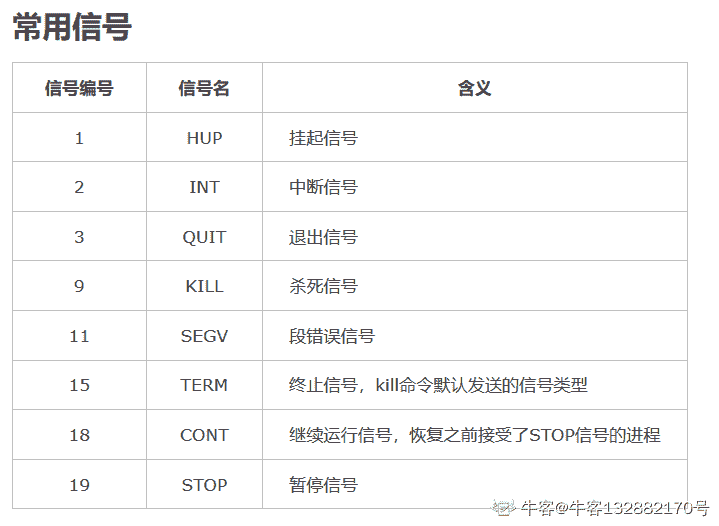

# 奇安信 2019 春招大数据

## 1

下面哪条命令可以把 f1.txt 复制为 f2.txt?（）

正确答案: C   你的答案: 空 (错误)

```cpp
cp f1.txt | f2.txt
```

```cpp
cat f1.txt | f2.txt
```

```cpp
cat f1.txt > f2.txt
```

```cpp
copy f1.txt | f2.txt
```

本题知识点

算法工程师 大数据开发工程师 奇安信 2019

讨论

[嘿~菜鸟](https://www.nowcoder.com/profile/7680294)

选项 A 改成 cp f1.txt f2.txt 就对了

发表于 2020-02-27 16:01:08

* * *

## 2

使用 ln 命令将生成了一个指向文件 old 的符号链接 new，如果你将文件 old 删除，是否还能够访问文件中的数据？（）

正确答案: A   你的答案: 空 (错误)

```cpp
不可能再访问
```

```cpp
仍然可以访问
```

```cpp
能否访问取决于文件的所有者
```

```cpp
能否访问取决于文件的权限
```

本题知识点

算法工程师 大数据开发工程师 奇安信 2019

讨论

[zcl_zc](https://www.nowcoder.com/profile/779382945)

*   软链接：ln -s 源文件/目录 目标文件/目录
    *   可以跨文件系统，类似于 windows 系统下的快捷方式；以路径的形式存在；
    *   可以为文件/目录创建
*   硬链接： ln 源文件 目标文件
    *   不可以跨文件系统，以文件副本的形式存在
    *   只能给文件创建
*   无论是硬链接还是软链接，都不会将原文件复制一份，占比较小的内存。

发表于 2020-03-29 13:34:13

* * *

[嘿~菜鸟](https://www.nowcoder.com/profile/7680294)

Linux ln 命令的功能是为某一个文件在另外一个位置建立一个同步的链接。

当在不同的目录用到相同的文件时，不需要在每一个需要的目录下都放一个必须相同的文件，只要在某个固定的目录，放上该文件，然后在其它的目录下用 ln 命令链接（link）它就可以，不必重复的占用磁盘空间。如果文件删除，链接也会失效。参考：[`www.runoob.com/linux/linux-comm-ln.html`](https://www.runoob.com/linux/linux-comm-ln.html)
 发表于 2020-02-27 16:05:12

* * *

## 3

ping 使用的协议是（）

正确答案: D   你的答案: 空 (错误)

```cpp
TCP
```

```cpp
UDP
```

```cpp
SMB
```

```cpp
ICMP
```

本题知识点

算法工程师 大数据开发工程师 奇安信 2019

讨论

[嘤嘤嘤 offer 快来我怀里](https://www.nowcoder.com/profile/132882170)

PING 命令使用的是**ICMP 协议**，是“Internet Control Message Protocol”（Internet 控制消息协议）的缩写，是 TCP/IP 协议族的一个子协议，用于在 IP 主机、路由器之间传递控制消息。它是用来**检查网络是否通畅或者网络连接速****度**的命令。作为一个生活在网络上的管理员或者黑客来说，ping 命令是第一个必须掌握的 DOS 命令，它所利用的原理是这样的：利用网络上机器 IP 地址的唯一性，给目标 IP 地址发送一个数据包，再要求对方返回一个同样大小的数据包来确定两台网络机器是否连接相通，时延是多少。

发表于 2020-03-27 11:30:24

* * *

[ac23](https://www.nowcoder.com/profile/735495065)

Ping 命令使用的是 ICMP 协议。原理：利用网络上机器 ip 地址的唯一性，给目标 ip 地址发送一个数据包，再要求对方返回一个同样大小的数据包来确定两台网络机器是否连接相通以及通讯时延。

发表于 2020-03-27 22:20:43

* * *

## 4

怎样更改一个文件的权限设置（）

正确答案: B   你的答案: 空 (错误)

```cpp
attrib
```

```cpp
chmod
```

```cpp
change
```

```cpp
file
```

本题知识点

算法工程师 大数据开发工程师 奇安信 2019

讨论

[remi24](https://www.nowcoder.com/profile/240212782)

B

发表于 2020-10-22 20:49:07

* * *

## 5

在 bash 中, 在一条命令后加入"1>&2" 意味着（）

正确答案: C   你的答案: 空 (错误)

```cpp
标准错误输出重定向到标准输入
```

```cpp
标准输入重定向到标准错误输出
```

```cpp
标准输出重定向到标准错误输出
```

```cpp
标准输出重定向到标准输入
```

本题知识点

算法工程师 大数据开发工程师 奇安信 2019

讨论

[嘤嘤嘤 offer 快来我怀里](https://www.nowcoder.com/profile/132882170)

*   bash 中 0，1，2 三个数字分别代表 STDIN_FILENO、STDOUT_FILENO、STDERR_FILENO，即标准输入（一般是键盘），标准输出（一般是显示屏，准确的说是用户终端控制台），标准错误（出错信息输出）。
*   输入输出可以重定向。重定向输入，譬如 cat < test.c 将 test.c 重定向为 cat 命令的输入源。重定向输出，譬如 ls > 1.txt 将 ls 的结果从标准输出重定向为 1.txt 文本。
*   1>&2 就是用来将标准输出重定向到标准错误输出 2 中的。此处 2 前面的&就是为了让 bash 将 2 解释成标准错误输出而不是文件 2。
*   [`www.cnblogs.com/sos-blue/p/6798810.html`](https://www.cnblogs.com/sos-blue/p/6798810.html) 

发表于 2020-03-27 11:38:27

* * *

[ac23](https://www.nowcoder.com/profile/735495065)

1>&2 用以将标准输出重定向到标准错误输出 2 中，2 之前的&符号不要忘记，是为了让 bash 将 2 解释成标准错误输出而不是文件 2.

发表于 2020-03-27 22:27:18

* * *

## 6

vi 中复制整行的命令是（）

正确答案: C   你的答案: 空 (错误)

```cpp
cc
```

```cpp
xx
```

```cpp
yy
```

```cpp
dd
```

本题知识点

算法工程师 大数据开发工程师 奇安信 2019

讨论

[ac23](https://www.nowcoder.com/profile/735495065)

yy：拷贝当前行 dd：删除当前行 cc：删除光标所在的行，然后进入编辑模式。xx：删除单个字符

发表于 2020-03-27 22:30:06

* * *

[嘤嘤嘤 offer 快来我怀里](https://www.nowcoder.com/profile/132882170)

cc:删除游标所在的行，然后进入编辑模式

yy:拷贝当前行

dd:删除当前行

xx:没找到[`www.cnblogs.com/junw_china/articles/1708967.html`](https://www.cnblogs.com/junw_china/articles/1708967.html)

编辑于 2020-03-27 11:46:42

* * *

## 7

给进程 1000 发出暂停信号，可以用下面命令（）

正确答案: A   你的答案: 空 (错误)

```cpp
kill -STOP 1000
```

```cpp
pause 1000
```

```cpp
signal -PAUSE 1000
```

```cpp
kill -9 1000
```

本题知识点

算法工程师 大数据开发工程师 奇安信 2019

讨论

[嘤嘤嘤 offer 快来我怀里](https://www.nowcoder.com/profile/132882170)

[`www.cnblogs.com/huey/p/4871503.html`](https://www.cnblogs.com/huey/p/4871503.html)

编辑于 2020-03-27 11:52:18

* * *

[ac23](https://www.nowcoder.com/profile/735495065)

kill -9 命令和 kill 命令[`blog.csdn.net/guo_guo_cai/article/details/78499477`](https://blog.csdn.net/guo_guo_cai/article/details/78499477)

发表于 2020-03-27 23:06:17

* * *

## 8

为了使文件所有者有读和写许可，其他用户只读，在设置文件许可值时，应该设为（）

正确答案: B   你的答案: 空 (错误)

```cpp
566
```

```cpp
644
```

```cpp
722
```

```cpp
744
```

本题知识点

算法工程师 大数据开发工程师 奇安信 2019

讨论

[zcl_zc](https://www.nowcoder.com/profile/779382945)

*   Linux 下文件的权限类型一般包括读，写，执行，即 r、w、x。
*   Linux 下权限的属组有 拥有者 、群组 、其它组 三种。
*   表示一个文件的权限有两种方式：
    *   十位权限：-rwxr---w- :表示拥有者有读写和执行的权限，用户组有读权限，其他组有写的权限，而第一位‘-’表示是文件，‘d’表示是目录；
    *   八进制权限表示：r = 4,w=2,x=1,上边提到的权限就可以表示为：742

发表于 2020-03-29 13:49:56

* * *

## 9

SQL 语言中，修改表结构的语句是（）

正确答案: D   你的答案: 空 (错误)

```cpp
CREATE
```

```cpp
SELECT
```

```cpp
UPDATE
```

```cpp
ALTER
```

本题知识点

算法工程师 大数据开发工程师 奇安信 2019

讨论

[牛客 579104616 号](https://www.nowcoder.com/profile/579104616)

create  建表
select  查询
update  更改表内数据

发表于 2020-09-23 19:09:05

* * *

## 10

在关系数据库系统中，为了简化用户的查询操作，同时不增加数据的存储空间，常用的方法是创建（）

正确答案: C   你的答案: 空 (错误)

```cpp
另一个 table
```

```cpp
cursor
```

```cpp
view
```

```cpp
index
```

本题知识点

算法工程师 大数据开发工程师 奇安信 2019

讨论

[嘤嘤嘤 offer 快来我怀里](https://www.nowcoder.com/profile/132882170)

数据库中的数据都是存储在表中的，而视图只是一个或多个表依照某个条件组合而成的结果集。一般来说你可以用 update，insert，delete 等 sql 语句修改表中的数据，而对视图只能进行 select 操作。
但是也存在可更新的视图，对于这类视图的 update，insert 和 delete 等操作最终会作用于与其相关的表中数据。因此，表是数据库中数据存储的基础，而视图只是为了满足某种查询要求而建立的一个对象。
（1）视图是数据库数据的特定子集。可以禁止所有用户访问数据库表，而要求用户只能通过视图操作数据，这种方法可以保护用户和应用程序不受某些数据库修改的影响。
（2）视图是抽象的，他在使用时，从表里提取出数据，形成虚的表。 不过对他的操作有很多的限制 。
（3）视图是永远不会自己消失的除非你删除它。
视图有时会对提高效率有帮助。临时表几乎是不会对性能有帮助，是资源消耗者。
视图一般随该数据库存放在一起，临时表永远都是在 tempdb 里的。
（4）视图适合于多表连接浏览时使用。不适合增、删、改。存储过程适合于使用较频繁的 SQL 语句，这样可以提高执行效率!
————————————————
版权声明：本文为 CSDN 博主「eff666」的原创文章，遵循 CC 4.0 BY-SA 版权协议，转载请附上原文出处链接及本声明。
原文链接：[`blog.csdn.net/eff666/article/details/76389143`](https://blog.csdn.net/eff666/article/details/76389143)

发表于 2020-03-27 12:09:09

* * *

[ac23](https://www.nowcoder.com/profile/735495065)

关系数据库中视图的作用[`www.cnblogs.com/repent/archive/2013/04/06/3002912.html`](https://www.cnblogs.com/repent/archive/2013/04/06/3002912.html)

发表于 2020-03-27 23:10:12

* * *

## 11

下面那个 HTTP 是网页返回正常的状态码（）

正确答案: C   你的答案: 空 (错误)

```cpp
500
```

```cpp
0
```

```cpp
200
```

```cpp
404
```

本题知识点

算法工程师 大数据开发工程师 奇安信 2019

讨论

[嘤嘤嘤 offer 快来我怀里](https://www.nowcoder.com/profile/132882170)

[`www.cnblogs.com/captain_jack/archive/2010/09/20/1831792.html`](https://www.cnblogs.com/captain_jack/archive/2010/09/20/1831792.html)
一些常见的状态码为：

*   **200** – 服务器成功返回网页
*   **404** – 请求的网页不存在
*   **503** – 服务器超时

编辑于 2020-03-27 12:10:50

* * *

## 12

下列哪些选项可以查看 hdfs 文件系统指定目录下文件的命令（）

正确答案: A   你的答案: 空 (错误)

```cpp
hadoop fs –ls /home 
```

```cpp
Hadoop –fs –ls /home
```

```cpp
Hadoop –fs ls /home
```

```cpp
Hadoop –ls /home
```

本题知识点

算法工程师 大数据开发工程师 奇安信 2019

讨论

[嘤嘤嘤 offer 快来我怀里](https://www.nowcoder.com/profile/132882170)

hadoop fs -ls /user/hadoop/output #查看指定目录下的文件和文件夹。hadoop fs -cat /user/hadoop/output #查看文件内容[`blog.csdn.net/carolzhang8406/article/details/77944044?utm_source=blogxgwz3`](https://blog.csdn.net/carolzhang8406/article/details/77944044?utm_source=blogxgwz3) 

编辑于 2020-03-27 12:15:34

* * *

## 13

下列 spark RDD 方法中 哪些会产生数据 shuffle（）

正确答案: B   你的答案: 空 (错误)

```cpp
 map()
```

```cpp
 max()
```

```cpp
flatmap()
```

```cpp
 foreachPartition()
```

本题知识点

算法工程师 大数据开发工程师 奇安信 2019

讨论

[嘤嘤嘤 offer 快来我怀里](https://www.nowcoder.com/profile/132882170)

Spark 是根据 shuffle 类算子来进行 stage 的划分。如果我们的代码中执行了某个 shuffle 类算子（比如 reduceByKey、join 等），那么就会在该算子处，划分出一个 stage 界限来。可以大致理解为，shuffle 算子执行之前的代码会被划分为一个 stage，shuffle 算子执行以及之后的代码会被划分为下一个 stage。因此一个 stage 刚开始执行的时候，它的每个 Task 可能都会**从上一个 stage 的 Task****所在的节点，去通过网络传输拉取需要自己处理的所有 ke**y，然后**对拉取到的所有相同的 key 使用我们自己编写的算子函数执行聚合操作**（比如 reduceByKey()算子接收的函数）。这个过程就是 shuffle。作者：RelaxHeart
链接：[`www.jianshu.com/p/19576a521245`](https://www.jianshu.com/p/19576a521245)
来源：简书
著作权归作者所有。商业转载请联系作者获得授权，非商业转载请注明出处。

发表于 2020-03-27 14:41:01

* * *

## 14

spark 下面哪些算子不是 transformation 算子（）

正确答案: D   你的答案: 空 (错误)

```cpp
map
```

```cpp
filter
```

```cpp
flatmap
```

```cpp
count
```

本题知识点

算法工程师 大数据开发工程师 奇安信 2019

讨论

[牛客 338566907 号](https://www.nowcoder.com/profile/338566907)

count 是执行算子

发表于 2020-08-09 14:27:26

* * *

## 15

spark streaming 中下面几种数据关系哪个正确（）

正确答案: A   你的答案: 空 (错误)

```cpp
DStream>RDD>Partition
```

```cpp
 RDD>DStream>Partition
```

```cpp
master
```

```cpp
client
```

本题知识点

算法工程师 大数据开发工程师 奇安信 2019

## 16

如果有多个 Kafka 程序同时消费一个 topic，如何保证取到不同的事件（）

正确答案: B   你的答案: 空 (错误)

```cpp
使用相同的 client.id
```

```cpp
使用相同的 group.id
```

```cpp
使用相同的 zookeeper
```

```cpp
使用相同的 bootstrap-server
```

本题知识点

算法工程师 大数据开发工程师 奇安信 2019

讨论

[嘤嘤嘤 offer 快来我怀里](https://www.nowcoder.com/profile/132882170)

[`www.cnblogs.com/qingyunzong/p/9004509.html`](https://www.cnblogs.com/qingyunzong/p/9004509.html)

发表于 2020-03-27 14:58:28

* * *

## 17

下面哪个功能是 Kafka 无法保证的（）

正确答案: A   你的答案: 空 (错误)

```cpp
有序
```

```cpp
可靠
```

```cpp
唯一
```

```cpp
不重复
```

本题知识点

算法工程师 大数据开发工程师 奇安信 2019

讨论

[ALEX-LTW](https://www.nowcoder.com/profile/956015716)

topic 要想支持有序，只能只有一个 partition。

发表于 2020-11-18 14:01:37

* * *

[菜狗子 23](https://www.nowcoder.com/profile/396919)

我如果只有一个 partition 不能够支持有序吗？

发表于 2020-04-16 16:02:31

* * *

## 18

Kafka 的两条消息是否允许相同的 key（）

正确答案: A   你的答案: 空 (错误)

```cpp
允许
```

```cpp
不允许
```

本题知识点

算法工程师 大数据开发工程师 奇安信 2019

讨论

[扶清风](https://www.nowcoder.com/profile/629205088)

允许

发表于 2020-08-21 17:40:21

* * *

## 19

ElasticSearch 的索引是（）

正确答案: B   你的答案: 空 (错误)

```cpp
正排索引
```

```cpp
倒排索引
```

```cpp
B+树索引
```

```cpp
哈希索引
```

本题知识点

算法工程师 大数据开发工程师 奇安信 2019

## 20

ElasticSearch 一个文本字段被标记为 keyword 类型，是否可以全文检索（）

正确答案: B   你的答案: 空 (错误)

```cpp
可以
```

```cpp
不可以
```

本题知识点

算法工程师 大数据开发工程师 奇安信 2019

讨论

[牛客 579104616 号](https://www.nowcoder.com/profile/579104616)

keyword 分段后就不能进行全文检索

发表于 2020-09-23 19:34:32

* * *

## 21

下面哪个进程负责 HDFS 数据存储（       ）

正确答案: B   你的答案: 空 (错误)

```cpp
NameNode
```

```cpp
DataNode
```

```cpp
SecondaryNameNode
```

```cpp
JobTracker
```

本题知识点

算法工程师 大数据开发工程师 奇安信 2019

## 22

HDFS 中的 block 默认保存几份（       ）

正确答案: C   你的答案: 空 (错误)

```cpp
2
```

```cpp
1
```

```cpp
3
```

```cpp
不确定
```

本题知识点

算法工程师 大数据开发工程师 奇安信 2019

讨论

[JackLi_](https://www.nowcoder.com/profile/800154940)

hdfs-site.xml <property><name>dfs.replication</name> <value>3</value></property>

发表于 2021-03-20 12:42:12

* * *

## 23

HBase 依靠（）存储底层数据

正确答案: A   你的答案: 空 (错误)

```cpp
HDFS
```

```cpp
memory
```

```cpp
mapreduce
```

```cpp
hadoop
```

本题知识点

算法工程师 大数据开发工程师 奇安信 2019

讨论

[前行 _ 者](https://www.nowcoder.com/profile/119319741)

hbase 依靠 hdfs 和本地磁盘储存数据

发表于 2021-01-22 15:38:51

* * *

[牛客 498163520 号](https://www.nowcoder.com/profile/498163520)

hdfs

发表于 2020-02-25 22:28:51

* * *

## 24

spark stage 划分基于（）

正确答案: B   你的答案: 空 (错误)

```cpp
窄依赖
```

```cpp
宽依赖
```

```cpp
task
```

```cpp
application
```

本题知识点

算法工程师 大数据开发工程师 奇安信 2019

讨论

[牛客 886004780 号](https://www.nowcoder.com/profile/886004780)

B

发表于 2020-03-11 12:40:35

* * *

## 25

假设 kafka 集群有三个 broker，则比较合理的 partition 数应设置为（）

正确答案: D   你的答案: 空 (错误)

```cpp
1
```

```cpp
2
```

```cpp
4
```

```cpp
6
```

本题知识点

算法工程师 大数据开发工程师 奇安信 2019

讨论

[扶清风](https://www.nowcoder.com/profile/629205088)

几个都行，按业务需求来

发表于 2020-08-21 17:39:42

* * *

## 26

下面哪些可能是 spark 数据倾斜原因（）

正确答案: A B C   你的答案: 空 (错误)

```cpp
Key 有重复数据
```

```cpp
key 有大量空值
```

```cpp
key 的类未重载 hashcode 函数
```

```cpp
使用 java.util.Date 类型作为 key
```

本题知识点

算法工程师 大数据开发工程师 奇安信 2019

讨论

[游来游去](https://www.nowcoder.com/profile/497656)

a,b,c 其实比较好理解的，都可能会导致某个 key 下面聚集了太多的数据。为什么 d 不会导致数据倾斜？看了下 Date 的源码：

```cpp
        StringBuilder sb = new StringBuilder(28);
        int index = date.getDayOfWeek();
        if (index == BaseCalendar.SUNDAY) {
            index = 8;
        }
        convertToAbbr(sb, wtb[index]).append(' ');                        // EEE
        convertToAbbr(sb, wtb[date.getMonth() - 1 + 2 + 7]).append(' ');  // MMM
        CalendarUtils.sprintf0d(sb, date.getDayOfMonth(), 2).append(' '); // dd

        CalendarUtils.sprintf0d(sb, date.getHours(), 2).append(':');   // HH
        CalendarUtils.sprintf0d(sb, date.getMinutes(), 2).append(':'); // mm
        CalendarUtils.sprintf0d(sb, date.getSeconds(), 2).append(' '); // ss
        TimeZone zi = date.getZone();
        if (zi != null) {
            sb.append(zi.getDisplayName(date.isDaylightTime(), TimeZone.SHORT, Locale.US)); // zzz
        } else {
            sb.append("GMT");
        }
        sb.append(' ').append(date.getYear());  // yyyy
        return sb.toString();

```

Date 是重写了 toString 方法的，而且很容易看到里面是精确到秒的，这样子生成的 key 其实是比较均匀的，故不会出现数据倾斜。

发表于 2020-03-15 19:00:18

* * *

## 27

下列哪个是 Hadoop 运行的模式？（　　）

正确答案: A B C   你的答案: 空 (错误)

```cpp
单机模式
```

```cpp
伪分布式
```

```cpp
分布式
```

```cpp
其他都不是
```

本题知识点

算法工程师 大数据开发工程师 奇安信 2019

讨论

[ac23](https://www.nowcoder.com/profile/735495065)

没想到伪分布式也算，原以为伪分布式是初学者自己学习模拟用的，不算数

发表于 2020-03-28 10:24:39

* * *

## 28

spark 调度模式有包括？（　　）

正确答案: A C   你的答案: 空 (错误)

```cpp
FIFO
```

```cpp
FDR
```

```cpp
FAIR
```

```cpp
RDF
```

本题知识点

算法工程师 大数据开发工程师 奇安信 2019

讨论

[牛客 579104616 号](https://www.nowcoder.com/profile/579104616)

```cpp
Spark 中的调度模式主要有两种：FIFO 和 FAIR。
    默认情况下 Spark 的调度模式是 FIFO（先进先出），谁先提交谁先执行，后面的任务需要等待前面的任务执行。
    而 FAIR（公平调度）模式支持在调度池中为任务进行分组，不同的调度池权重不同，任务可以按照权重来决定执行顺序。
```

发表于 2020-09-23 19:50:30

* * *

## 29

elasticsearch 集群监控状态包括（　　）

正确答案: A B C   你的答案: 空 (错误)

```cpp
red
```

```cpp
yellow
```

```cpp
green
```

```cpp
blue
```

本题知识点

算法工程师 大数据开发工程师 奇安信 2019

讨论

[游来游去](https://www.nowcoder.com/profile/497656)

老外搞的东西都是有一定规律的，这道题是按 nagios 的规则去猜的，果然对了

发表于 2020-03-15 19:02:18

* * *

## 30

elasticsearch 节点角色类型包括（　　）

正确答案: A B   你的答案: 空 (错误)

```cpp
node.master
```

```cpp
node.data
```

```cpp
node.slave
```

```cpp
其他都不是
```

本题知识点

算法工程师 大数据开发工程师 奇安信 2019

讨论

[ac23](https://www.nowcoder.com/profile/735495065)

Elasticsearch 节点(角色)类型解释：node.master 和 node.data[`blog.csdn.net/wfs1994/article/details/80322529`](https://blog.csdn.net/wfs1994/article/details/80322529)

发表于 2020-03-28 10:28:52

* * *

## 31

Spark shuffle 时 是否会在磁盘存储？（）

正确答案: A   你的答案: 空 (错误)

```cpp
会
```

```cpp
不会
```

本题知识点

算法工程师 大数据开发工程师 奇安信 2019

讨论

[牛客 579104616 号](https://www.nowcoder.com/profile/579104616)

在 Spark 0.6 和 0.7 时，Shufle 的结果都需要先存储到内存中(有可能要写入磁盘)，因此对于大数据量的情况下，发
生 GC 和 OOM 的概率非常大。因此在 Spark 0.8 的时候，Shuffle 的每个 record 都会直接写入磁盘，并且为下游的每个
Task 都生成一个单独的文件。这样解决了 Shuffle 解决都需要存入内存的问题，但是又引入了另外一个问题:生成的
小文件过多，尤其在每个文件的数据量不大而文件特别多的时候，大量的随机读会非常影响性能。Spark 0.8.1 为了
解决 0.8 中引入的问题，引入了 FileConsolidation 机制，在一定程度上解决了这个问题。由此可见，Hash Based
shuffle 在 Scalability 方面的确有局限性。而 Spark1.0 中引入的 Shuffle Pluggable Framework，为加入新的 Shuffle 机制
和引入第三方的 Shuffle 机制奠定了基础。在 Spark1.1 的时候，引入了 Sort Based Shuffle;并且在 Spark1.2.0 时，
Sort Based Shuffle 已经成为 Shuffie 的默认选项。

发表于 2020-09-23 20:06:32

* * *

## 32

如果 NameNode 意外终止 SecondaryNameNode 会接替它使集群继续工作？（）

正确答案: B   你的答案: 空 (错误)

```cpp
正确
```

```cpp
错误
```

本题知识点

算法工程师 大数据开发工程师 奇安信 2019

讨论

[游来游去](https://www.nowcoder.com/profile/497656)

SecondaryNameNode 这个名字取得不好，容易让人产生误解。 Secondary NameNode 所做的不过是在文件系统中设置一个检查点来帮助 NameNode 更好的工作。它不是要取代掉 NameNode 也不是 NameNode 的备份。

发表于 2020-03-15 21:58:44

* * *

## 33

Hadoop 支持数据的随机读写？（）

正确答案: B   你的答案: 空 (错误)

```cpp
正确
```

```cpp
错误
```

本题知识点

算法工程师 大数据开发工程师 奇安信 2019

讨论

[牛客 658229652 号](https://www.nowcoder.com/profile/658229652)

随机读

发表于 2021-01-13 16:39:02

* * *

[机器机器快学习](https://www.nowcoder.com/profile/390988278)

A

发表于 2020-04-14 14:17:08

* * *

[牛咕咕](https://www.nowcoder.com/profile/154498558)

随机写

发表于 2020-03-28 18:08:46

* * *

## 34

Hadoop 自身具有严格的权限管理和安全措施保障集群正常运行？（）

正确答案: B   你的答案: 空 (错误)

```cpp
正确
```

```cpp
错误
```

本题知识点

算法工程师 大数据开发工程师 奇安信 2019

讨论

[DeShuiYu](https://www.nowcoder.com/profile/381741634)

hadoop 自身并不能保证，否则本来也不会引入 zookeeper 进行 ha 了

发表于 2020-11-23 16:58:06

* * *

## 35

Hadoop 默认调度器策略为 FIFO？（）

正确答案: A   你的答案: 空 (错误)

```cpp
正确
```

```cpp
错误
```

本题知识点

算法工程师 大数据开发工程师 奇安信 2019

讨论

[牛客 237092837 号](https://www.nowcoder.com/profile/237092837)

默认的调度器 1.x 是 FIFO2.x 是 Capacity Scheduler

发表于 2020-04-16 20:37:27

* * *

## 36

因为 HDFS 有多个副本，所以 NameNode 是不存在单点问题的？（）

正确答案: B   你的答案: 空 (错误)

```cpp
正确
```

```cpp
错误
```

本题知识点

算法工程师 大数据开发工程师 奇安信 2019

讨论

[牛咕咕](https://www.nowcoder.com/profile/154498558)

多个副本和单点故障没啥关系吧,解决单点故障的应该是 HA 吧

发表于 2020-03-28 18:09:59

* * *

## 37

集群内每个节点都应该配 RAID，这样避免单磁盘损坏，影响整个节点运行？（）

正确答案: B   你的答案: 空 (错误)

```cpp
正确
```

```cpp
错误
```

本题知识点

算法工程师 大数据开发工程师 奇安信 2019

讨论

[DeShuiYu](https://www.nowcoder.com/profile/381741634)

raid，磁盘阵列。Hadoop 自己有容错机制，不必用 raid

发表于 2020-11-23 17:01:19

* * *

## 38

kafka 的数据是存储在内存中的？（）

正确答案: B   你的答案: 空 (错误)

```cpp
正确
```

```cpp
错误
```

本题知识点

算法工程师 大数据开发工程师 奇安信 2019

讨论

[牛咕咕](https://www.nowcoder.com/profile/154498558)

顺序写入磁盘

发表于 2020-03-28 18:16:23

* * *

[牛客 146051874 号](https://www.nowcoder.com/profile/146051874)

A

发表于 2021-05-15 14:59:43

* * *

## 39

关于 dropout，下列说法正确的是(         )

正确答案: B   你的答案: 空 (错误)

```cpp
dropout 是在训练时以一定概率永久丢弃一部分神经元节点
```

```cpp
dropout 近似于一种轻量级的 bagging 集成
```

```cpp
dropout 近似于一种轻量级的 boosting 集成
```

```cpp
dropout 可以加快训练速度
```

本题知识点

算法工程师 大数据开发工程师 奇安信 2019

讨论

[DeShuiYu](https://www.nowcoder.com/profile/381741634)

a 永久丢弃肯定不对，d，加快训练肯定不对。

发表于 2020-11-23 17:02:50

* * *

## 40

在卷积生成式对抗网络的生成器 G 里面，通常用（  ）来取代池化层？

正确答案: C   你的答案: 空 (错误)

```cpp
ReLU 层
```

```cpp
跨步卷积（Strided convolutional）层
```

```cpp
微步卷积（Fractional strided convolutional）层
```

```cpp
全连接层
```

本题知识点

算法工程师 大数据开发工程师 奇安信 2019

讨论

[零葬](https://www.nowcoder.com/profile/75718849)

判别器使用跨步卷积代替池化，生成器使用反卷积来代替池化，微步卷积是反卷积的一种

发表于 2020-10-24 12:37:28

* * *

## 41

在卷积生成式对抗网络的判别器 D 里面，通常用（  ）来取代池化层？

正确答案: B   你的答案: 空 (错误)

```cpp
ReLU 层
```

```cpp
跨步卷积（Strided convolutional）层
```

```cpp
微步卷积（Fractional strided convolutional）层
```

```cpp
全连接层
```

本题知识点

算法工程师 大数据开发工程师 奇安信 2019

讨论

[零葬](https://www.nowcoder.com/profile/75718849)

判别器使用跨步卷积代替池化，生成器使用反卷积来代替池化，微步卷积是反卷积的一种

发表于 2020-10-24 12:37:13

* * *

## 42

如果要存储一幅像素为 800×600 的 16 色图像，需要多少 KB？（）

正确答案: B   你的答案: 空 (错误)

```cpp
117.19
```

```cpp
234.375
```

```cpp
468.75
```

```cpp
937.5
```

本题知识点

算法工程师 大数据开发工程师 奇安信 2019

讨论

[正青春 201909121350927](https://www.nowcoder.com/profile/290971157)

1.1byte=8bit  1024byte=1kb  1 位，（单色）；2.4 位：（16 色）；8 位：（256 色）；16（64K 色，高彩色）；24（16M 色，真彩色）；32（4096M 色，增强型真彩色）计算：所有像素=800*600=480000bit480000*4 位=19200001920000/8=240000byte=234,375kb

发表于 2020-02-27 13:07:09

* * *

## 43

下列模型属于判别式模型的有哪些:（）(1)马尔科夫随机场(2)高斯过程 (3)决策树 (4)条件随机场 (5)朴素贝叶斯 (6)最大熵模型

正确答案: D   你的答案: 空 (错误)

```cpp
1,3,4,5
```

```cpp
2,3,5,6
```

```cpp
1,4,5,6
```

```cpp
2,3,4,6
```

本题知识点

算法工程师 大数据开发工程师 奇安信 2019

## 44

以下说法正确的是（）

正确答案: B   你的答案: 空 (错误)

```cpp
强化学习的核心任务是，学习一个从动作空间 A 到状态空间 S 的映射，最大化累积收益。
```

```cpp
常用的强化学习算法有 Q 学习，策略梯度，以及演员评判家算法等。
```

```cpp
强化学习会直接给决策器的输出打分。
```

```cpp
大部分涉及静态系统的决策学习过程都可以看成是一种强化学习。
```

本题知识点

算法工程师 大数据开发工程师 奇安信 2019

## 45

存在样本集合 X=(8,10,12)和集合 Y=(13,4,7),则 Cov(X,Y)的值为（      ）

正确答案: B   你的答案: 空 (错误)

```cpp
6
```

```cpp
-6
```

```cpp
9
```

```cpp
30
```

本题知识点

算法工程师 大数据开发工程师 奇安信 2019

讨论

[正青春 201909121350927](https://www.nowcoder.com/profile/290971157)

E(x)=(8+10+12)/3=10,E(Y)=(13+4+7)/3=8E(XY)=(8*13+10*4+12*7)/3=76cov(x,y)=E(XY)-E(x)E(y)=76-80=-4?

发表于 2020-02-27 15:46:25

* * *

## 46

以下哪些模型用到了 EM 算法求解(          )

正确答案: A D   你的答案: 空 (错误)

```cpp
GMM 高斯混混合模型
```

```cpp
随机森林
```

```cpp
逻辑回归
```

```cpp
K-Means 聚类
```

本题知识点

算法工程师 大数据开发工程师 奇安信 2019

## 47

下列哪些选项描述的内容是正确的？（）

正确答案: A C   你的答案: 空 (错误)

```cpp
AdaGrad 使用的是一阶差分
```

```cpp
AdaGrad 使用的是二阶差分
```

```cpp
L-BFGS 使用的是二阶差分
```

```cpp
L-BFGS 使用的是一阶差分
```

本题知识点

算法工程师 大数据开发工程师 奇安信 2019

## 48

训练 CNN 做图像分类时，下列哪些方法可以提升网络的泛化性能（      ）

正确答案: B C   你的答案: 空 (错误)

```cpp
残差学习
```

```cpp
Batch normalization
```

```cpp
对训练数据做旋转、缩放等操作
```

```cpp
学习率衰减
```

本题知识点

算法工程师 大数据开发工程师 奇安信 2019

## 49

下面哪些是 ReLU 激活函数的特性？（）

正确答案: A D   你的答案: 空 (错误)

```cpp
神经元输出为正时，没有饱和区

```

```cpp
关于原点对称
```

```cpp
 计算复杂度高，效率低
```

```cpp
神经元输出为负时，进入了饱和区
```

本题知识点

算法工程师 大数据开发工程师 奇安信 2019

## 50

下列说法正确的有（）

正确答案: A C   你的答案: 空 (错误)

```cpp
Bagging 可以降低方差
```

```cpp
Random Forest 可以降低方差
```

```cpp
Boosting 可以降低偏差
```

```cpp
Decision Tree 可以降低偏差
```

本题知识点

算法工程师 大数据开发工程师 奇安信 2019

讨论

[零葬](https://www.nowcoder.com/profile/75718849)

讲道理 B 也是对的，随机森林就是 Bagging

发表于 2020-12-29 14:50:26

* * *

[嘤嘤嘤 offer 快来我怀里](https://www.nowcoder.com/profile/132882170)

为什么 B 选项不对？随机森林不是典型的基于 bagging 的模型吗？

发表于 2020-03-27 21:23:46

* * *

## 51

使用 K-means 算法进行聚类时，哪些参数需要用户预先指定（      ）

正确答案: A B   你的答案: 空 (错误)

```cpp
聚类数目
```

```cpp
聚类中心
```

```cpp
样本集大小
```

```cpp
样本集总数
```

本题知识点

算法工程师 大数据开发工程师 奇安信 2019

## 52

ROC 曲线上的点的横纵坐标轴分别表示分类器在测试数据上的（）和（）

正确答案: B   你的答案: 空 (错误)

```cpp
准确率和召回率
```

```cpp
召回率和误报率
```

```cpp
准确率和 F 值
```

```cpp
召回率和 F 值
```

本题知识点

算法工程师 大数据开发工程师 奇安信 2019

讨论

[higirl2020](https://www.nowcoder.com/profile/376457331)

D

发表于 2020-03-16 20:41:38

* * *

## 53

ROC 空间中的 iso-accuracy 直线的斜率等于（）（N 表示测试数据集的大小，p 表示其中正例个数，n 表示其中负例个数）

正确答案: D   你的答案: 空 (错误)

```cpp
p/N
```

```cpp
n/N
```

```cpp
p/n
```

```cpp
n/p
```

本题知识点

算法工程师 大数据开发工程师 奇安信 2019

## 54

如下优化算法中，哪个需要计算损失函数的二阶导数（）

正确答案: C   你的答案: 空 (错误)

```cpp
梯度下降
```

```cpp
随机梯度下降
```

```cpp
牛顿法
```

```cpp
拟牛顿法
```

本题知识点

算法工程师 大数据开发工程师 奇安信 2019

讨论

[肖小飞](https://www.nowcoder.com/profile/443456190)

梯度下降中有一阶法，牛顿二阶法，拟牛顿法。一阶法是将 L 一阶泰勒展开。牛顿法是将 L 二阶泰勒展开，产生了 Hessian 矩阵，该矩阵求逆操作很困难。拟牛顿法引入了 Hessian 矩阵的近似矩阵来解决计算困难问题。

发表于 2020-07-31 10:06:08

* * *

## 55

假设某 TV 的一个列表中有 10 个频道，已知其中有 2 个频道为失效错误台，无法观看，现在进行遍历检查，直到 2 个错误频道都被检查到为止，则检查所需打开的频道的平均次数（即数学期望 E(X)）为（）

正确答案: C   你的答案: 空 (错误)

```cpp
7
```

```cpp
7.143
```

```cpp
7.333
```

```cpp
7.556
```

本题知识点

算法工程师 大数据开发工程师 奇安信 2019

讨论

[美团打工人](https://www.nowcoder.com/profile/4417755)

P(X=2)=2/10 * 1/9 =1/45
P(X=3)=(C(8,1)*C(2,1)/C(10,2))*1/8=2/45
P(X=4)=(C(8,2)*C(2,1)/C(10,3))*1/7=3/45
P(X=5)=(C(8,3)*C(2,1)/C(10,4))*1/6=4/45
P(X=6)=(C(8,4)*C(2,1)/C(10,5))*1/5=5/45
P(X=7)=(C(8,5)*C(2,1)/C(10,6))*1/4=6/45
P(X=8)=(C(8,6)*C(2,1)/C(10,7))*1/3=7/45
P(X=9)=(C(8,7)*C(2,1)/C(10,8))*1/2=8/45
P(X=10)=(C(8,8)*C(2,1)/C(10,9))*1/1=9/45
P(X=n)=(从 8 个好设备中检查 bai 的 n-2 个可能组合 * 从 2 个坏设备中检查了一个排列 / 从 10 个设备中检查的 n-1 个可能组合 *(最后检查为坏设备的概率）
EX=7.333

发表于 2020-06-20 22:04:40

* * *

## 56

下列哪种算法不属于 ensemble 方法（）

正确答案: A D   你的答案: 空 (错误)

```cpp
Logistic Regression
```

```cpp
Random Forest
```

```cpp
Gradient Boosting
```

```cpp
Decision Tree
```

本题知识点

算法工程师 大数据开发工程师 奇安信 2019

## 57

关于 PCA，以下哪些说法为真（）

正确答案: A B C D   你的答案: 空 (错误)

```cpp
PCA 是无监督方法
```

```cpp
PCA 寻找数据中具有最大方差的方向
```

```cpp
主成分的最大数量小于等于特征的数量
```

```cpp
所有的主成份之间正交
```

本题知识点

算法工程师 大数据开发工程师 奇安信 2019

## 58

一个序列 a=[1,4,2,5]，现有卷积核 k=[-1,1]，则用 k 对 a 进行卷积后的结果为：（）

正确答案: A   你的答案: 空 (错误)

```cpp
[1,3,-2,3,-5]
```

```cpp
[1,3,1,-3,-2]
```

```cpp
[1,3,-2,3]
```

```cpp
[1,3,-1,-3]
```

本题知识点

算法工程师 大数据开发工程师 奇安信 2019

## 59

输入图像大小为 28x28，卷积核的大小为 7x7，stride 为 1，则该图像经卷积操作后大小为（）

正确答案: A   你的答案: 空 (错误)

```cpp
22x22
```

```cpp
21x21
```

```cpp
28x28
```

```cpp
7x7
```

本题知识点

算法工程师 大数据开发工程师 奇安信 2019

讨论

[louis_ncu](https://www.nowcoder.com/profile/684852623)

(i - k + 2p ) / s + 1

发表于 2021-04-09 20:11:10

* * *

[正青春 201909121350927](https://www.nowcoder.com/profile/290971157)

(w-f)/s+1=22

发表于 2020-02-27 18:10:05

* * *

## 60

一个简单的 MLP 有 3 个输入结点和一个输出结点，没有隐藏结点，从输入结点到输出结点的权值分别为 4、5、6，激活函数为常数 3，则输入为 1、2、3 的情况下输出值为（）

正确答案: C   你的答案: 空 (错误)

```cpp
32
```

```cpp
643
```

```cpp
96
```

```cpp
48
```

本题知识点

算法工程师 大数据开发工程师 奇安信 2019

## 61

全联通网络中，输入层有 10 个结点，隐藏层有 5 个结点，则从输入层到隐藏层的最大连接数量为（）

正确答案: A   你的答案: 空 (错误)

```cpp
50
```

```cpp
少于 50
```

```cpp
多于 50
```

```cpp
不确定的值
```

本题知识点

算法工程师 大数据开发工程师 奇安信 2019

## 62

下面哪个是召回率的计算公式？（）

正确答案: D   你的答案: 空 (错误)

```cpp
(TP+TN)/总样本数
```

```cpp
TP/(TP+FP)
```

```cpp
FP/(FP+TN)
```

```cpp
TP/(TP+FN)
```

本题知识点

算法工程师 大数据开发工程师 奇安信 2019

讨论

[零葬](https://www.nowcoder.com/profile/75718849)

recall=预测为正且实际也为正的样本数/总的正样本数，而总的正样本数=预测为正且实际也为正的样本数(TP)+预测为负但实际为正的样本数(FN)

发表于 2021-01-04 11:54:40

* * *

## 63

下列关于随机梯度下降错误的是（）

正确答案: C   你的答案: 空 (错误)

```cpp
随机梯度下降的核心是，梯度是期望。
```

```cpp
对于足够大的数据集，随机梯度可能会在处理整个训练集之前就收敛到最终测试集误差的某个固定容差范围内。
```

```cpp
随机梯度下降过程中，梯度估计引入的噪声源（m 个样本的随机采样）会在极小点处消失。
```

```cpp
随机梯度下降或更广义的基于梯度优化的在线学习算法，一个重要的性质是每一步更新的计算时间不依赖训练样本数目的多寡。
```

本题知识点

算法工程师 大数据开发工程师 奇安信 2019

## 64

以下不是基于核算法的是（）

正确答案: A   你的答案: 空 (错误)

```cpp
随机森林
```

```cpp
判别分析
```

```cpp
支持向量机
```

```cpp
径向基函数
```

本题知识点

算法工程师 大数据开发工程师 奇安信 2019

## 65

下列哪个不属于 CRF 模型对于 HMM 和 MEMM 模型的优势（）

正确答案: D   你的答案: 空 (错误)

```cpp
速度慢
```

```cpp
特征灵活
```

```cpp
可容纳较多上下文信息
```

```cpp
可做到局部最优
```

本题知识点

算法工程师 大数据开发工程师 奇安信 2019

讨论

[零葬](https://www.nowcoder.com/profile/75718849)

感觉 AD 都对

发表于 2021-01-08 09:32:30

* * *

## 66

已知正例点 x=(3,3), y=(4,3),负例点 z=(1,1),其间隔最大分离超平面是？ （）

正确答案: C   你的答案: 空 (错误)

```cpp
0.5x+0.5y+2=0
```

```cpp
0.5x+0.5z+2=0
```

```cpp
0.5x+0.5y-2=0
```

```cpp
0.5y+0.5z-2=0
```

本题知识点

算法工程师 大数据开发工程师 奇安信 2019

讨论

[正青春 201909121350927](https://www.nowcoder.com/profile/290971157)

通过训练数据集构造约束最优化问题：得：min 1/2(w1²+w2²)3w1+3w2+b>=14w1+3w2+b>=1-w1-w2-b>=1w1=w2=1/2b=-2 所求方程为：0.5x+0.5y-2=0

发表于 2020-02-27 20:29:55

* * *

## 67

一个骰子，一个面是 1，两个面是 2，三个面是 3，能使 1、2、3 都至少出现一次的期望是多少（）

正确答案: C   你的答案: 空 (错误)

```cpp
6.78
```

```cpp
7.02
```

```cpp
7.3
```

```cpp
8.3
```

本题知识点

算法工程师 大数据开发工程师 奇安信 2019

讨论

[犴](https://www.nowcoder.com/profile/341020838)

链接：[`www.nowcoder.com/questionTerminal/4f9c7a62bb454497b64fe88267184568?orderByHotValue=2&pos=15&mutiTagIds=601`](https://www.nowcoder.com/questionTerminal/4f9c7a62bb454497b64fe88267184568?orderByHotValue=2&pos=15&mutiTagIds=601)
来源：牛客网
第一次获得不同的数字的期望为 1，原来没有数字。假设第一次获得 1 ， 概率 为 1/6， 第二次获得不同的期望是：1/（5/6）= 6/5      假设第二次获得 2，概率 为 2/5， 第三次获得不同的期望是：1/（3/6）= 6/3      假设第二次获得 3，概率 为 3/5， 第三次获得不同的期望是：1/（2/6）= 6/2 假设第一次获得 2 ，概率 为 2/6， 第二次获得不同的期望是：1/（4/6）= 6/4      假设第二次获得 1， 概率 为 1/4， 第三次获得不同的期望是：1/（3/6）= 6/3      假设第二次获得 3，概率 为 3/4， 第三次获得不同的期望是：1/（1/6）= 6/1 假设第一次获得 3 ， 概率 为 3/6， 第二次获得不同的期望是：1/（3/6）= 6/3      假设第二次获得 1，概率为 1/3，第三次获得不同的期望是：1/（2/6）= 6/2      假设第二次获得 2，概率 为 2/3， 第三次获得不同的期望是：1/（1/6）= 6/1 上述分析的全排列，及其概率为：1 , 2 , 3 期望：（1 + 6/5 + 6/3) * (1/6 *  2/5 * 3/3) = 7/25 = 0.281 , 3 , 2 期望：（1 + 6/5 + 6/2) * (1/6 *  3/5 * 2/2) = 13/25 = 0.522 , 1 , 3 期望：（1 + 6/4 + 6/3) * (2/6 *  1/4 * 3/3) = 3/8 = 0.3752 , 3 , 1 期望：（1 + 6/4 + 6/1) * (2/6 *  3/4 * 1/1) = 17/8 = 2.2153 , 2 , 1 期望：（1 + 6/3 + 6/1) * (3/6 *  2/3 * 1/1) = 33 , 1 , 2 期望：（1+ 6/3 + 6/2) * (3/6 *  1/3 * 2/2) = 1 总期望 = 0.28 + 0.52 + 0.375 + 2.215 + 3 + 1 = 7.3

发表于 2020-06-12 22:38:44

* * *

## 68

有如下 6 条记录的数据集：

```cpp
t1=[O,P,B], t2=[P,B,M], t3=[M,A], t4=[O,P,M], t5=[O,P,B,A], t6=[O,P,B,M,]
```

则支持度大于 50%的频繁 3 项集为（）

正确答案: A   你的答案: 空 (错误)

```cpp
OPB
```

```cpp
OPM
```

```cpp
PBM
```

```cpp
OBM
```

本题知识点

算法工程师 大数据开发工程师 奇安信 2019

讨论

[零葬](https://www.nowcoder.com/profile/75718849)

这应该是大于等于 50%吧

发表于 2020-10-24 12:34:32

* * *

## 69

下面哪种情况会影响 K-means 聚类的效果？（）

正确答案: A C D   你的答案: 空 (错误)

```cpp
数据点密度分布不均
```

```cpp
数据点呈圆形状分布
```

```cpp
数据中有异常点存在
```

```cpp
数据点呈非凸形状分布
```

本题知识点

算法工程师 大数据开发工程师 奇安信 2019

## 70

下列可用于降低维度的算法有（）

正确答案: A B D   你的答案: 空 (错误)

```cpp
主成分分析法
```

```cpp
偏最小二乘回归
```

```cpp
最小二乘法
```

```cpp
Lasso
```

本题知识点

算法工程师 大数据开发工程师 奇安信 2019

## 71

下列关于自然语言错误的是（）

正确答案: D   你的答案: 空 (错误)

```cpp
语言模型定义了自然语言中标记序列的概率分布。
```

```cpp
标记总是离散的实体。
```

```cpp
gram 模型最大似然的基本限制是，在许多情况下从训练集计数估计得到的 Pn 很可能为零。
```

```cpp
传统的 n-gram 模型，不仅考虑了词形方面的特征，而且还有词性以及语义层面上的知识，但是数据稀疏问题严重。
```

本题知识点

算法工程师 大数据开发工程师 奇安信 2019

## 72

下列选项中描述错误的是（）

正确答案: B   你的答案: 空 (错误)

```cpp
神经语言模型是一类用来克服维数灾难的语言模型。
```

```cpp
维数灾难不需要模型泛化到指数多的句子（指数相对句子长度而言）。
```

```cpp
神经语言模型共享一个词（及其上下文）和其他类似词（和上下文之间）的统计强度。
```

```cpp
词向量是用一个向量来表示一个词，一定程度上可以用来刻画词之间的语义距离。
```

本题知识点

算法工程师 大数据开发工程师 奇安信 2019

## 73

以下不属于隐马尔科夫模型的三大问题的是（）

正确答案: D   你的答案: 空 (错误)

```cpp
概率计算问题
```

```cpp
学习问题
```

```cpp
预测问题
```

```cpp
编码问题
```

本题知识点

算法工程师 大数据开发工程师 奇安信 2019

## 74

句子“If you do what you have always done you will get what you have always gotten”中的不同的 2-gram 的数量为（）

正确答案: A   你的答案: 空 (错误)

```cpp
12
```

```cpp
15
```

```cpp
16
```

```cpp
8
```

本题知识点

算法工程师 大数据开发工程师 奇安信 2019

## 75

句子“If you do what you have always done you will get what you have always gotten”中的不同的 3-gram 的数量为（）

正确答案: A   你的答案: 空 (错误)

```cpp
12
```

```cpp
14
```

```cpp
16
```

```cpp
5
```

本题知识点

算法工程师 大数据开发工程师 奇安信 2019

## 76

以下哪个正则表达式能够匹配下面句子中的所有日期串（）

```cpp
“The next meetup on data science will be held on 2017-09-21, previously it happened on 31/03, 2016”
```

正确答案: D   你的答案: 空 (错误)

```cpp
\d{4}-\d{2}-\d{2}
```

```cpp
 (19|20)\d{2}-(0[1-9]|1[0-2])-[0-2][1-9]
```

```cpp
 (19|20)\d{2}-(0[1-9]|1[0-2])-([0-2][1-9]|3[0-1])
```

```cpp
其他均不对
```

本题知识点

算法工程师 大数据开发工程师 奇安信 2019

讨论

[牛客 206597936 号](https://www.nowcoder.com/profile/206597936)

答案 D 句子中的日期有： 2017-09-21  和  31/03, 2016/([1-9]\d{3}-(0[1-9]|1[0-2])-([0-2]\d|3[0-1]))|([0-2]\d|3[0-1])\/(0[1-9]|1[0-2]),[1-9]\d{3}/g 年 [1-9]\d{3}月 (0[1-9]|1[0-2])日 ([0-2]\d|3[0-1])A、B、C  只能匹配第一个 2017-09-21 

发表于 2021-01-18 21:43:07

* * *

[卡特琳娜](https://www.nowcoder.com/profile/975338375)

C 怎么就不对了？？

发表于 2020-10-09 15:21:04

* * *

## 77

一个语料库有 N 篇文档，从中随机抽取一篇文档，切词后该文档长度为 T（个词），词“data”在该文中出现 K 次，同时词“data”在整个语料库的 1/3 的文档中出现过，则词“data”对抽出的这篇文档而言的 tfidf 为（）

正确答案: B   你的答案: 空 (错误)

```cpp
KT * Log(3)
```

```cpp
K * Log(3) / T
```

```cpp
T * Log(3) / K
```

```cpp
Log(3) / KT
```

本题知识点

算法工程师 大数据开发工程师 奇安信 2019