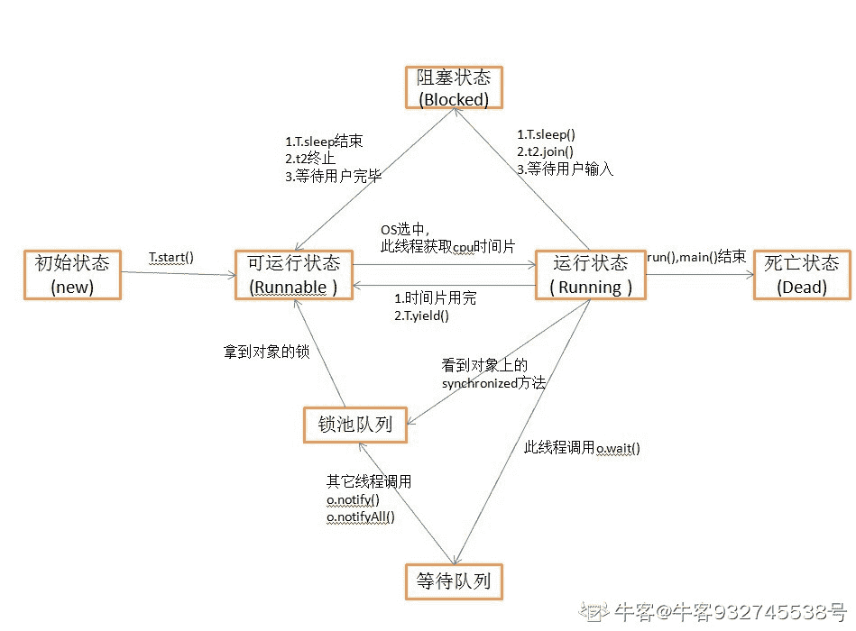
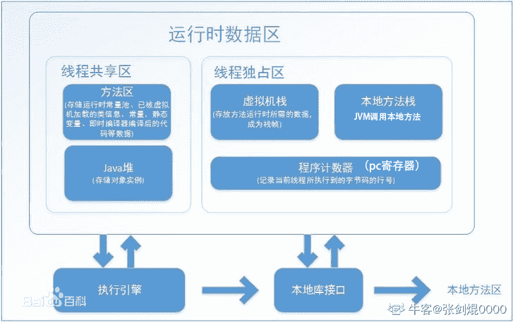
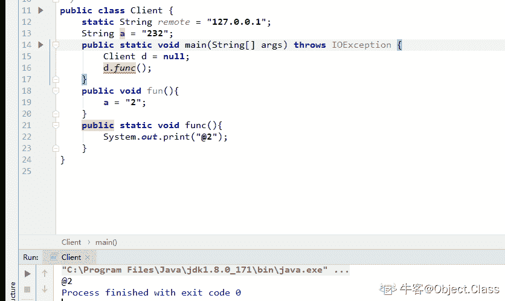
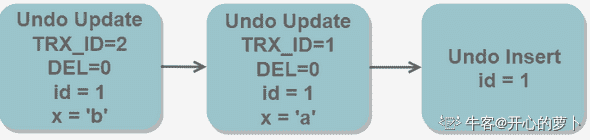
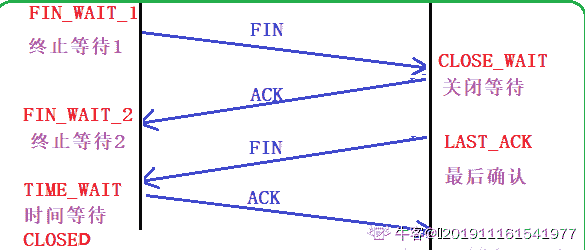

# 奇安信 2019 春招服务端开发试题

## 1

下面程序的输出是什么？（）

```cpp
class A {
    public:
        void Print() {
            printf("%d\n", content_);
        }
    public:
        int content_;
};
void Add(A a) {
    a.content_ ++;
}
int main () {
    A a{content_: 1};
    Add(a);
    a.Print();
    return 0;
}
```

正确答案: B   你的答案: 空 (错误)

```cpp
0
```

```cpp
1
```

```cpp
2
```

```cpp
编译报错，无法执行
```

本题知识点

Java 工程师 C++工程师 奇安信 2019

讨论

[上天赐我一个 offer 啊](https://www.nowcoder.com/profile/944251113)

结果是 1

发表于 2020-07-31 20:47:59

* * *

[东林林孔仁](https://www.nowcoder.com/profile/8853160)

如果 Add 的定义是这样 voidAdd(A& a) {    a.content_ ++;}那结果是 c

发表于 2020-02-27 21:09:04

* * *

[小李今天刷题了吗👀](https://www.nowcoder.com/profile/104246017)

Add 运行后没加吗？

发表于 2020-02-27 15:07:32

* * *

## 2

下面程序的输出是什么？（）

```cpp
class A {
    public:
        A() { printf("A()\n"); }
        virtual ~A() { printf("~A()\n"); }
};
class B : public A {
    public:
        B() { printf("B()\n"); }
        ~B() { printf("~B()\n"); }
};
int main() {
    auto tmp = B();
    return 0;
}
```

正确答案: C   你的答案: 空 (错误)

```cpp
B() ~B()
```

```cpp
B() A() ~A() ~B()
```

```cpp
A() B() ~B() ~A()
```

```cpp
A() B() ~A() ~B()
```

本题知识点

Java 工程师 C++工程师 奇安信 2019

## 3

下面代码的输出是什么?（）

```cpp
class A {
    public:
        A(int32_t item) : content_(item) {
        }
        void Print() {
            printf("%d\n", content_);
        }
    public:
        int32_t content_;
};
int main() {
    A a = 1.3f;
    a.Print();
    return 0;
}
```

正确答案: A   你的答案: 空 (错误)

```cpp
1
```

```cpp
1.3
```

```cpp
-672503784
```

```cpp
编译报错，无法执行
```

本题知识点

Java 工程师 C++工程师 奇安信 2019

## 4

```cpp
class A {
    public:
        virtual void Foo() = 0;
        virtual void Print() { printf("A\n"); }
};
class B: public A{
    public:
        void Foo() override { printf("FOO\n"); }
        void Print() override { printf("B\n"); }
};
int main() {
    A* ptr1 = new A;
    A* ptr2 = new B;
    ptr1->Print();
    ptr2->Print();
    return 0;
}
```

正确答案: D   你的答案: 空 (错误)

```cpp
A,B
```

```cpp
A,A
```

```cpp
B,B
```

```cpp
编译报错，无法执行
```

本题知识点

Java 工程师 C++工程师 奇安信 2019

讨论

[东林林孔仁](https://www.nowcoder.com/profile/8853160)

class A 中有纯虚函数，无法生成实例，执行 A* ptr1 = new  A 时报错。

发表于 2020-02-28 10:55:09

* * *

## 5

```cpp
class A {
    public:
        A() { Foo(); }
        virtual void Foo() {
            printf("A Foo\n");
        }
};
class B : public A {
    public:
        B() = default;
        void Foo() override { 
            printf("B Foo\n");
        }
};

int main() {
    B b = B();
    b.Foo();
    return 0;
}
```

正确答案: A   你的答案: 空 (错误)

```cpp
A Foo，B Foo
```

```cpp
B Foo, B Foo
```

```cpp
A Foo, A Foo
```

```cpp
编译报错，无法执行
```

本题知识点

Java 工程师 C++工程师 奇安信 2019

讨论

[小李今天刷题了吗👀](https://www.nowcoder.com/profile/104246017)

先调用基类构造函数再调用继承类构造函数

编辑于 2020-03-20 14:14:54

* * *

## 6

下面代码的输出是什么?（）

```cpp
class A {
    public:
        explicit A(int32_t item) : content_(item) {
        }
        void Print() {
            printf("%d\n", content_);
        }
    public:
        int32_t content_;
};
int main() {
    A a = 1.3f;
    a.Print();
    return 0;
}
```

正确答案: D   你的答案: 空 (错误)

```cpp
1
```

```cpp
1.3
```

```cpp
-672503784
```

```cpp
编译报错，无法执行
```

本题知识点

Java 工程师 C++工程师 奇安信 2019

讨论

[甫艾蒽廷](https://www.nowcoder.com/profile/7698448)

C++中的 explicit 作用功能（防止隐式转换）

发表于 2020-02-26 21:45:57

* * *

## 7

下面程序的输出是什么?（）

```cpp
int main() {
    int a[3][3]{
        {1,2,3},
        {4,5,6},
        {7,8,9},
    };
    auto p = *(a + 1);
    *p = 0;
    for(auto i = 0; i < 3; i ++) {
        for(auto j = 0; j < 3; j++) {
            printf("%d ",a[i][j]);
        }
    }
    return 0;
}
```

正确答案: B   你的答案: 空 (错误)

```cpp
103456789
```

```cpp
123056789
```

```cpp
123456789
```

```cpp
编译错误，无法执行
```

本题知识点

Java 工程师 C++工程师 奇安信 2019

讨论

[牛客 49322034 号](https://www.nowcoder.com/profile/49322034)

第七行  *(a + 1)   此时的 a 表示整个一维数组

发表于 2020-02-28 15:54:06

* * *

## 8

下面代码在 64 位系统上使用 g++ -m64 编译后的输出是什么（）

```cpp
class A {
public:
    virtual void Print();
public:
    int64_t content_;
}__attribute__((packed));
class B : public A {
public:
    void Print() override;
public:
    int64_t content_;
}__attribute__((packed));
int main() {
    printf("%d,%d\n", sizeof(A), sizeof(B));
    return 0;
}
```

正确答案: D   你的答案: 空 (错误)

```cpp
8，8
```

```cpp
8，16
```

```cpp
16，16
```

```cpp
16，24
```

本题知识点

Java 工程师 C++工程师 奇安信 2019

讨论

[东林林孔仁](https://www.nowcoder.com/profile/8853160)

g++ -m64 ：生成 64 位代码 64 位编译器中，指针变量占用 8 字节，int64_t 占用 8 字节。__attribute__((packed))的作用是告诉编译器取消在编译过程中的优化对齐。
所以 classA 的大小等于，虚拟指针（8） +  content_(8) = 16classB 的大小等于，虚拟指针（8） +  B::content_(8) +  A::content_(8) = 24

发表于 2020-02-28 11:06:17

* * *

## 9

在 64 位系统使用 gcc -m64 编译后，下面程序的输出是什么？（）

```cpp
int main() {
    char a[] = "12345";
    char *b = "12345";
    printf("%d,%d,%d,%d\n", sizeof(a), sizeof(b), sizeof(*a), sizeof(*b));
    return 0;
}
```

 正确答案: A   你的答案: 空 (错误)

```cpp
6，8，1，1
```

```cpp
5，5，1，1
```

```cpp
8，8，1，1
```

```cpp
5，8，1，1
```

本题知识点

Java 工程师 C++工程师 奇安信 2019

讨论

[小李今天刷题了吗👀](https://www.nowcoder.com/profile/104246017)

64 位系统所以是 8

发表于 2020-02-27 15:13:34

* * *

## 10

```cpp
int main() {
    int a = 65535;
    a = a >> 8;
    a = a << 8;
    printf("%d\n", a);
    return 0;
}
```

正确答案: D   你的答案: 空 (错误)

```cpp
65535
```

```cpp
64511
```

```cpp
65023
```

```cpp
65280
```

本题知识点

Java 工程师 C++工程师 奇安信 2019

讨论

[神韵 499](https://www.nowcoder.com/profile/663125690)

-右移 8 位再左移 8 位，相等于减掉了右边 8 个 1，使得变成 0   65535 -( 2⁸ - 1)

发表于 2020-02-26 20:37:00

* * *

[勤练带来力量！](https://www.nowcoder.com/profile/37903266)

1111 1111 1111 1111 -> 0000 1111 1111 1111 -> 1111 1111 1111 0000

发表于 2020-04-08 10:04:16

* * *

## 11

```cpp
#include <stdio.h>
int main() {
    int a = 1, b = 1;
    float c = 194268.02, d = 194268;
    printf("%d,%d\n", (a/b)==1, (c-d)==0.02);
}</stdio.h><stdio.h>
</stdio.h><stdio.h>int main() {
</stdio.h><stdio.h>    int a = 1, b = 1;
</stdio.h><stdio.h>    float c = 194268.02, d = 194268;
</stdio.h><stdio.h>    printf("%d,%d\n", (a/b)==1, (c-d)==0.02);
</stdio.h><stdio.h>}</stdio.h>
```

正确答案: B   你的答案: 空 (错误)

```cpp
1,1
```

```cpp
1,0
```

```cpp
0，0
```

```cpp
编译报错，无法执行
```

本题知识点

Java 工程师 C++工程师 奇安信 2019

讨论

[ypchen](https://www.nowcoder.com/profile/171666386)

194268 的二进制是 101111011011011100，去除第一位的 1，一共 17 位，而单精度 float 的尾数一共才 23 位，只有 6 位给 0.02 的二进制表示，即 000001，所以：
0 10010000 01111011011011100000001 = 194268.015625

发表于 2021-03-23 13:50:25

* * *

## 12

下面程序的输出是什么?（）

```cpp
#define MUL(x) (x * x)
int main() {
    printf("%d,%d\n", MUL(1+2), MUL(2==2));
    return 0;
}
```

正确答案: A   你的答案: 空 (错误)

```cpp
5,0
```

```cpp
5,1
```

```cpp
9,0
```

```cpp
9,1
```

本题知识点

Java 工程师 C++工程师 奇安信 2019

讨论

[放肆的青春 201903162121765](https://www.nowcoder.com/profile/124293661)

#define MUL(x) (x * x)intmain() {    printf("%d,%d\n", MUL(1+2), MUL(2==2));    return0;}是将 x 替换为 1+2   结果为 1+2 * 1+2 =52==2 *2 ==2 结果为 0

发表于 2020-04-03 14:52:26

* * *

[勤练带来力量！](https://www.nowcoder.com/profile/37903266)

define 纯替换 运算符优先级

发表于 2020-04-08 10:05:03

* * *

[甫艾蒽廷](https://www.nowcoder.com/profile/7698448)

define 仅仅是字符替换

发表于 2020-02-26 21:48:56

* * *

## 13

```cpp
int main() {
    char a[5] = {'a', 'b', 'c', 'd', 'e'};
    char b[5] = {'a', 'b', '\0', 'd', 'e'};
    printf("%d\n", strlen(a));
    return 0;
}
```

正确答案: D   你的答案: 空 (错误)

```cpp
5
```

```cpp
10
```

```cpp
7
```

```cpp
结果不确定
```

本题知识点

Java 工程师 C++工程师 奇安信 2019

讨论

[放肆的青春 201903162121765](https://www.nowcoder.com/profile/124293661)

strlen 求的长度是以'\0'结束的。

       比如 char a[30];strlen(a)的结果是不定的，而 sizeof(a)=30;

        同理：char a[30]={'a','b','c'};对于 strlen 来说也是不定的，而 sizeof 却是 30\.

编辑于 2020-04-03 15:37:34

* * *

[我不急](https://www.nowcoder.com/profile/729683731)

strlen 是函数， strlen 计算字符串的具体长度（只能是字符串），不包括字符串结束符。返回的是 字符个数。所以不确定数组 b 后面是什么 sizeof 计算声明后所占的内存数（字节大小），不是实际长度

发表于 2020-02-28 11:29:10

* * *

## 14

下面有关 Spring 依赖注入说法错误的是？（）

正确答案: A   你的答案: 空 (错误)

```cpp
如果 Bean 的某一个属性没有注入，ApplicationContext 加载后，直至第一次使用调用 getBean 方法才会抛出异常；而 BeanFacotry 则在初始化自身时检验，这样有利于检查所依赖属性是否注入
```

```cpp
IoC 就是由 Spring 来负责控制对象的生命周期和对象间的关系
```

```cpp
ApplicationContext 建立在 BeanFacotry 之上，提供了系统构架服务
```

```cpp
BeanFacotry 是最简单的容器，提供了基础的依赖注入支持
```

本题知识点

Java 工程师 C++工程师 奇安信 2019

讨论

[starxx](https://www.nowcoder.com/profile/304980153)

BeanFactory 延迟加载， 即如何有属性没有注入，直到 getBean 被调用时候才会抛错 AppliactionContext 立即加载

发表于 2020-02-28 16:28:14

* * *

[Jeff_Lui](https://www.nowcoder.com/profile/336667052)

ApplicationContext：立即加载 BeanFactory：延迟加载

发表于 2020-03-30 23:45:19

* * *

## 15

下面关于新建线程的叙述，正确的是？（）

正确答案: A   你的答案: 空 (错误)

```cpp
进入新建状态的线程，没有被分配资源
```

```cpp
当线程被创建时，可以马上启动
```

```cpp
新建线程可以使用 start()、stop() 和 wait() 等多个方法
```

```cpp
新建状态的线程，通过调用方法 join() 可以进入阻塞状态
```

本题知识点

Java 工程师 C++工程师 奇安信 2019

讨论

[牛客 932745538 号](https://www.nowcoder.com/profile/932745538)



发表于 2021-10-24 15:43:25

* * *

## 16

下面语句中会产生编译错误的是？（）

正确答案: C   你的答案: 空 (错误)

```cpp
float F = 4096.0 F;
```

```cpp
double D = 4096.0;
```

```cpp
byte B = 4096;
```

```cpp
char C = 4096;
```

本题知识点

Java 工程师 C++工程师 奇安信 2019

讨论

[Jeff_Lui](https://www.nowcoder.com/profile/336667052)

byte：取值在-128-127char：可以用字符或者字符所在的编码表示

发表于 2020-03-30 23:50:06

* * *

## 17

关于 Spring MVC 的核心控制器 DispatcherServlet 的作用，以下说法错误的是（）

正确答案: B   你的答案: 空 (错误)

```cpp
负责接收 HTTP 请求
```

```cpp
实现业务操作
```

```cpp
初始化上下应用对象 ApplicationContext
```

```cpp
加载配置文件
```

本题知识点

Java 工程师 C++工程师 奇安信 2019

讨论

[小李今天刷题了吗👀](https://www.nowcoder.com/profile/104246017)

SpringMVC 是 Spring 中的模块,它实现了 MVC 设计模式的 web 框架,首先用户发出请求,请求到达 SpringMVC 的前端控制器(DispatcherServlet),前端控制器根据用户的 url 请求处理器映射器查找匹配该 url 的 handler,并返回一个执行链,前端控制器再请求处理器适配器调用相应的 handler 进行处理并返回给前端控制器一个 modelAndView,前端控制器再请求视图解析器对返回的逻辑视图进行解析,最后前端控制器将返回的视图进行渲染并把数据装入到 request 域,返回给用户. DispatcherServlet 作为 springMVC 的前端控制器,负责接收用户的请求并根据用户的请求返回相应的视图给用户 实现业务操作时在 servlice 层,所以 C 答案错误

发表于 2020-02-28 14:22:51

* * *

## 18

下面有关 Spring DAO，描述错误的是？（）

正确答案: A   你的答案: 空 (错误)

```cpp
方便的事务管理：Spring 的声明式事务管理力度是类级别
```

```cpp
Spring 提供的 DAO 支持了 JDBC，JDO 和 Hibernate
```

```cpp
异常包装：Spring 能够包装 Hibernate 异常，把它们从 CheckedException 变为 RuntimeException ；开发者可选择在恰当的层处理数据中不可恢复的异常，从而避免烦琐的  catch / throw 及异常声明
```

```cpp
Spring 提供的 DAO （数据访问对象）支持主要的目的是便于以标准的方式使用不同的数据访问技术
```

本题知识点

Java 工程师 C++工程师 奇安信 2019

讨论

[格拉摩根键圣](https://www.nowcoder.com/profile/335405317)

Spring 的声明式事务管理级别是方法级的

发表于 2020-02-28 16:39:46

* * *

## 19

Java 中的抽象类 Reader 和 Writer 所处理的流是什么？（）

正确答案: D   你的答案: 空 (错误)

```cpp
图像流
```

```cpp
对象流
```

```cpp
字节流
```

```cpp
字符流
```

本题知识点

Java 工程师 C++工程师 奇安信 2019

## 20

在 Servlet 里，能实现重定向的方法是？（）

正确答案: A   你的答案: 空 (错误)

```cpp
运用 javax.servlet.http.HttpServletResponse 接口的 sendRedirect 方法
```

```cpp
运用 javax.servlet.http.HttpServletRequest 接口的 sendRedirect 方法
```

```cpp
运用 javax.servlet.ResponseDispatcher 接口的 forward 方法
```

```cpp
运用 javax.servlet.RequestDispatcher 接口的 forward 方法
```

本题知识点

Java 工程师 C++工程师 奇安信 2019

讨论

[后知后觉的 Jim](https://www.nowcoder.com/profile/317274447)

这特么有问题吧，没正确答案啊

发表于 2020-03-29 14:52:02

* * *

[NEVER 妥协](https://www.nowcoder.com/profile/874293114)

请求转发    运用 javax.servlet.RequestDispatcher 接口的 forward 方法请求重定向 javax.servlet.http.HttpServletResponse 接口的 sendRedirect 方法

发表于 2021-03-06 14:46:49

* * *

## 21

下面关于内部类的说法，正确的是（）

正确答案: D   你的答案: 空 (错误)

```cpp
内部类可以与它包含的类名相同
```

```cpp
内部类只能使用它所在类的静态成员变量，不能使用它所在类的方法中的局部变量
```

```cpp
内部类可以使用 abstract 修饰定义为抽象类，不能用 private 或 protected 定义
```

```cpp
外部使用内部类时，必须给出类的全名
```

本题知识点

Java 工程师 C++工程师 奇安信 2019

## 22

Java 中的线程模型由三部分组成，与线程模型组成无关的是哪个？（）

正确答案: C   你的答案: 空 (错误)

```cpp
虚拟的 CPU
```

```cpp
程序代码
```

```cpp
操作系统的内核状态
```

```cpp
数据
```

本题知识点

Java 工程师 C++工程师 奇安信 2019

讨论

[繭 201909152239388](https://www.nowcoder.com/profile/366108323)

C 线程是程序中的一个执行流。一个执行流是由 CPU 运行程序的代码、代码操纵程序的数据所形成的。Java 中的线程模型包含 3 部分：一个虚拟的 CPU，该 CPU 执行的代码，代码所操作的数据。

发表于 2020-08-27 18:18:23

* * *

## 23

在一个线程中调用下列方法，一定会改变线程运行状态的是？（）

正确答案: C   你的答案: 空 (错误)

```cpp
yield 方法
```

```cpp
urrentThread 方法
```

```cpp
sleep 方法
```

```cpp
一个对象的 notify 方法
```

本题知识点

Java 工程师 C++工程师 奇安信 2019

讨论

[T-DRAGON](https://www.nowcoder.com/profile/847693497)

sleep --> Time Waiting

发表于 2021-08-17 14:26:33

* * *

## 24

下面有关 JVM 内存，说法错误的是？（）

正确答案: C   你的答案: 空 (错误)

```cpp
原则上讲，所有的对象都在堆区上分配内存，是线程之间共享的
```

```cpp
Java 方法执行内存模型，用于存储局部变量，操作数栈，动态链接，方法出口等信息，是线程隔离的
```

```cpp
方法区用于存储 JVM 加载的类信息、常量、静态变量、即使编译器编译后的代码等数据，是线程隔离的
```

```cpp
程序计数器是一个比较小的内存区域，用于指示当前线程所执行的字节码执行到了第几行，是线程隔离的
```

本题知识点

Java 工程师 C++工程师 奇安信 2019

讨论

[小明同学 12138](https://www.nowcoder.com/profile/87802314)

C 选项错误很明显，方法区是线程共享的但是 A 选项中，所有对象都是在堆中分配内存吗？对象的分配，在 1.7 以后，默认会进行逃逸分析，当分析出当前对象只在当前线程使用，则直接存在栈中，这样做的好处是对象跟随线程的结束而结束，减少了 GC 的次数，所以，A 答案也是错误的，不是所有的对象都是在堆中分配内存的，可以改为【原则上讲，**所有****在堆区上分配内存****的对象**，是线程之间共享的】

发表于 2020-07-24 22:29:03

* * *

[JacobChung](https://www.nowcoder.com/profile/431108025)



发表于 2020-02-28 17:25:32

* * *

[newSpring(me)](https://www.nowcoder.com/profile/416562835)

C 错：方法区，储存运行时常量池，已被 JVM 加载的类信息、常量、静态变量、即时编译器编译后的代码等数据，**是线程共享的！**

发表于 2020-03-31 14:58:27

* * *

## 25

Java 虚拟机（JVM）运行 Java 代码时，不会进行的操作是？（）

正确答案: A   你的答案: 空 (错误)

```cpp
加载代码
```

```cpp
校验代码
```

```cpp
编译代码
```

```cpp
执行代码
```

本题知识点

Java 工程师 C++工程师 奇安信 2019

讨论

[甫艾蒽廷](https://www.nowcoder.com/profile/7698448)

Java 虚拟机加载代码是在运行前的操作。运行代码时会校验、编译和执行代码。

发表于 2020-02-26 21:59:58

* * *

[GerryTang](https://www.nowcoder.com/profile/54147744)

C

发表于 2021-12-29 12:13:58

* * *

[T-DRAGON](https://www.nowcoder.com/profile/847693497)


发表于 2021-08-17 14:35:51

* * *

## 26

下列哪些语句关于内存回收的说明是正确的。（）

正确答案: B   你的答案: 空 (错误)

```cpp
程序员必须创建一个线程来释放内存
```

```cpp
内存回收程序负责释放无用内存
```

```cpp
内存回收程序允许程序员直接释放内存
```

```cpp
内存回收程序可以在指定的时间释放内存对象
```

本题知识点

Java 工程师 C++工程师 奇安信 2019

## 27

所有线程都必须实现哪个方法？（）

正确答案: D   你的答案: 空 (错误)

```cpp
wait()
```

```cpp
start()
```

```cpp
stop()
```

```cpp
run()
```

本题知识点

Java 工程师 C++工程师 奇安信 2019

## 28

可以使用空引用访问静态函数？（）

正确答案: A   你的答案: 空 (错误)

```cpp
TRUE
```

```cpp
FALSE
```

本题知识点

Java 工程师 C++工程师 奇安信 2019

讨论

[郫县男子计院](https://www.nowcoder.com/profile/328790495)



发表于 2020-02-26 20:03:25

* * *

## 29

什么是反序列化？（）

正确答案: A   你的答案: 空 (错误)

```cpp
反序列化是从字流还原对象状态的过程。
```

```cpp
序列化是从对象恢复对象状态的过程。
```

```cpp
A、B 两个都对。
```

```cpp
A、B 两个都不对。
```

本题知识点

Java 工程师 C++工程师 奇安信 2019

讨论

[小李今天刷题了吗👀](https://www.nowcoder.com/profile/104246017)

把对象转换为字节序列的过程称为对象的序列化；把字节序列恢复为对象的过程称为对象的反序列化。

发表于 2020-02-27 15:46:07

* * *

## 30

什么是静态块？（）

正确答案: C   你的答案: 空 (错误)

```cpp
它用于创建同步代码。
```

```cpp
不存在静态块。
```

```cpp
它用于初始化静态数据成员，在类加载时在主方法之前执行。
```

```cpp
其他都不是。
```

本题知识点

Java 工程师 C++工程师 奇安信 2019

## 31

char 变量的默认值是什么？（）

正确答案: A   你的答案: 空 (错误)

```cpp
\u0000'
```

```cpp
0
```

```cpp
null
```

```cpp
not defined
```

本题知识点

Java 工程师 C++工程师 奇安信 2019

讨论

[郫县男子计院](https://www.nowcoder.com/profile/328790495)

1、整数类型（byte、short、int、long）的基本类型变量的默认值为 0。

2、单精度浮点型（float）的基本类型变量的默认值为 0.0f。

3、双精度浮点型（double）的基本类型变量的默认值为 0.0。

4、字符型（char）的基本类型变量的默认为 “\u0000”。

5、布尔性的基本类型变量的默认值为 false。

6、引用类型的变量是默认值为 null。

编辑于 2020-02-26 20:06:17

* * *

## 32

对记录序列{315，299，509，124，487，146}按从小到大的顺序进行插入排序，经过两趟排序后的结果为：（）

正确答案: B   你的答案: 空 (错误)

```cpp
{315，299，509，124，146，487}
```

```cpp
{299，315，509，124，487，146}
```

```cpp
{299，124，315，509，487，146}
```

```cpp
 {124，299，315，509，487，146}
```

本题知识点

Java 工程师 C++工程师 奇安信 2019

讨论

[郫县男子计院](https://www.nowcoder.com/profile/328790495)

首先 315，299，509，124，487，146 第一次 299 插入 => 299，315，509，124，487，146 第二次 509 插入 => 299，315，509，124，487，146

发表于 2020-02-26 20:07:56

* * *

## 33

 欲构造 ArrayList 类得一个实例，此类继承了 List 接口，下列哪个方法是正确的：（）

正确答案: B   你的答案: 空 (错误)

```cpp
ArrayList myList = new Object();
```

```cpp
List myList = new ArrayList();
```

```cpp
ArraylList myList = new List();
```

```cpp
List myList = new List();
```

本题知识点

Java 工程师 C++工程师 奇安信 2019

## 34

SQL 语句性能分析的关键字是什么？（）

正确答案: A   你的答案: 空 (错误)

```cpp
EXPLAIN 
```

```cpp
LOAD 
```

```cpp
TOP 
```

```cpp
SUM
```

本题知识点

Java 工程师 C++工程师 奇安信 2019

讨论

[青春渐离](https://www.nowcoder.com/profile/883163570)

explain 可以展示 sql 执行情况，以及索引使用情况。top 可以限定返回条数。

发表于 2020-03-06 22:57:17

* * *

## 35

数据库事务正确执行的四个基本要素不包括?（）

正确答案: C   你的答案: 空 (错误)

```cpp
隔离性
```

```cpp
持久性
```

```cpp
强制性
```

```cpp
一致性
```

本题知识点

Java 工程师 C++工程师 奇安信 2019

讨论

[青春渐离](https://www.nowcoder.com/profile/883163570)

原子性  共同成功共同失败隔离性  多线程中多个事务之间相互隔离不影响一致性  事务执行前后数据库的完整性约束不要持久性  事务一旦执行完成，数据修改立刻持久化到数据库

发表于 2020-03-06 22:58:38

* * *

[甫艾蒽廷](https://www.nowcoder.com/profile/7698448)

**ACID****原子性(Atomicity)、一致性(Consistency)、隔离性(Isolation)、持久性(Durability)。**

编辑于 2020-02-26 22:01:36

* * *

## 36

从数据库中删除表的命令是（）

正确答案: A   你的答案: 空 (错误)

```cpp
DROP TABLE
```

```cpp
TRUNCATE TABLE
```

```cpp
DELETE TABLE
```

```cpp
DELETE FROM TABLE
```

本题知识点

Java 工程师 C++工程师 奇安信 2019 牛客

讨论

[表哥的表格](https://www.nowcoder.com/profile/267415360)

c

发表于 2020-08-22 21:14:07

* * *

[甫艾蒽廷](https://www.nowcoder.com/profile/7698448)

**DROP TABLE** 指令。整个表格消失，无法再被用了。**TRUNCATE TABLE** 指令。表格中的资料会完全消失，表格本身会继续存在

发表于 2020-02-26 22:04:35

* * *

## 37

SELECT COUNT(SAL) AS c  FROM EMP GROUP BY DEPTNO ORDER BY c DESC limit 1; 意思是（） 

正确答案: D   你的答案: 空 (错误)

```cpp
求每个部门中的最高工资
```

```cpp
求每个部门中工资的大小
```

```cpp
求每个部门中工资的总和
```

```cpp
求人数最多的部门的人数
```

本题知识点

Java 工程师 C++工程师 奇安信 2019

讨论

[satchmo](https://www.nowcoder.com/profile/57225979)

感觉这种不给表就直接甩个语句让你说作用的题，简直反人类

发表于 2020-02-28 15:32:01

* * *

[T-DRAGON](https://www.nowcoder.com/profile/847693497)

md 绝了

发表于 2021-08-17 14:42:40

* * *

[chi 到的 JCW](https://www.nowcoder.com/profile/383581389)

SAL 不应该是 salary？？？

发表于 2020-09-02 11:11:01

* * *

## 38

在高并发、事务等场景下，mysql5.6 数据库应当使用哪种存储引擎（）

正确答案: B   你的答案: 空 (错误)

```cpp
myisam
```

```cpp
innodb
```

```cpp
memory
```

```cpp
ndbcluster
```

本题知识点

Java 工程师 C++工程师 奇安信 2019

讨论

[一只向上爬的喵](https://www.nowcoder.com/profile/419317865)

B、MYISAM 不支持事务，但是比 innodb 快一些

发表于 2021-02-08 18:11:13

* * *

[vector<>](https://www.nowcoder.com/profile/255171944)

myisam 不支持事务和行级锁

发表于 2020-04-13 21:19:00

* * *

[彩虹鱼 520](https://www.nowcoder.com/profile/162155763)

MyISAM 不支持事务，而 InnoDB 支持事务机制

发表于 2020-03-06 12:40:09

* * *

## 39

数据库中事务隔离分为 4 个级别，其中允许“不可重复读”的有？（）

正确答案: B C   你的答案: 空 (错误)

```cpp
SERIALIZABLE 
```

```cpp
READ COMMITTED 
```

```cpp
READ UNCOMMITTED
```

```cpp
REPEATABLE READ
```

本题知识点

Java 工程师 C++工程师 奇安信 2019

讨论

[青春渐离](https://www.nowcoder.com/profile/883163570)

脏读  不可重复读  幻读读未提交  全都会发生读提交     不会发生脏读     对正在读取的行锁定可重复读 不会发生脏读  不可重复读     对读取的所有行锁定序列化        不会发生脏读 不可重复读     幻读         锁表，效率低

发表于 2020-03-06 23:03:31

* * *

[小李今天刷题了吗👀](https://www.nowcoder.com/profile/104246017)

● 未授权读取（Read Uncommitted）：允许脏读取，但不允许更新丢失。如果一个事务已经开始写数据，则另外一个数据则不允许同时进行写操作，但允许其他事务读此行数据。该隔离级别可以通过“排他写锁”实现。 ● 授权读取（Read Committed）：允许不可重复读取，但不允许脏读取。这可以通过“瞬间共享读锁”和“排他写锁”实现。读取数据的事务允许其他事务继续访问该行数据，但是未提交的写事务将会禁止其他事务访问该行。 ● 可重复读取（Repeatable Read）：禁止不可重复读取和脏读取，但是有时可能出现幻影数据。这可以通过“共享读锁”和“排他写锁”实现。读取数据的事务将会禁止写事务（但允许读事务），写事务则禁止任何其他事务。 ● 序列化（Serializable）：提供严格的事务隔离。它要求事务序列化执行，事务只能一个接着一个地执行，但不能并发执行。如果仅仅通过“行级锁”是无法实现事务序列化的，必须通过其他机制保证新插入的数据不会被刚执行查询操作的事务访问到。 隔离级别越高，越能保证数据的完整性和一致性，但是对并发性能的影响也越大。对于多数应用程序，可以优先考虑把数据库系统的隔离级别设为 Read Committed，它能够避免脏读取，而且具有较好的并发性能。尽管它会导致不可重复读、虚读和第二类丢失更新这些并发问题，在可能出现这类问题的个别场合，可以由应用程序采用悲观锁或乐观锁来控制。

发表于 2020-02-27 16:45:48

* * *

[T-DRAGON](https://www.nowcoder.com/profile/847693497)

注意题目是允许 也就是会发生

编辑于 2021-08-17 14:49:16

* * *

## 40

以下哪些对 mysql myisam 存储引擎的描述是正确的：（）

正确答案: B D   你的答案: 空 (错误)

```cpp
支持外键
```

```cpp
支持表锁
```

```cpp
支持事务
```

```cpp
支持 FULLTEXT 类型的全文索引
```

本题知识点

Java 工程师 C++工程师 奇安信 2019

讨论

[郫县男子计院](https://www.nowcoder.com/profile/328790495)

 旧版的 MySQL 的全文索引只能用在 MyISAM 表格的 char、varchar 和 text 的字段上。 

 新版的 MySQL5.6.24 上 InnoDB 引擎也加入了全文索引

发表于 2020-02-26 20:10:09

* * *

[牛客 255405303 号](https://www.nowcoder.com/profile/255405303)

bd 参考链接：[`blog.csdn.net/qq_35642036/article/details/82820178`](https://blog.csdn.net/qq_35642036/article/details/82820178)

编辑于 2020-07-26 10:31:20

* * *

## 41

已知在 tmp 表的 name 字段上创建了索引， 以下哪些 sql 查询时不可能走索引（）

正确答案: B D   你的答案: 空 (错误)

```cpp
select * from tmp where name = '张三';
```

```cpp
select * from tmp where name like '%test'; 
```

```cpp
select * from tmp where name like 'test%';
```

```cpp
select * from tmp where name not in ('test', '张三');
```

本题知识点

Java 工程师 C++工程师 奇安信 2019

讨论

[青春渐离](https://www.nowcoder.com/profile/883163570)

%代表一个或多个字符，且在左侧无法使用索引使用<>或是 not in 时，会忽略索引

发表于 2020-03-06 23:25:40

* * *

[郫县男子计院](https://www.nowcoder.com/profile/328790495)

转：1、如果 MySQL 估计使用索引比全表扫描更慢，则不适用索引，ex：列 key_part1 均匀的分布在 1-100 之间。下面的 sql 则不会使用索引
select * from table_name where key_part1 > 1 and key_part1 <90
2、如果使用 memory/heap 表，并且 where 语句中不适用“=”进行索引，则不会使用索引。heap 表只有在“=”的条件下，才使用索引。
3、用 or 分割开的条件，如果 or 左右两个条件中有一个列没有索引，则不会使用索引。
ex：select * from table_name where key1='a' or key2='b'；
如果在 key1 上有索引而在 key2 上没有索引，则该查询也不会走索引

4、复合索引，如果索引列不是复合索引的第一部分，则不使用索引（即不符合最左前缀）
ex：复合索引为(key1,key2) ，一下 sql 将不会使用索引
select * from table_name where key2='b'；
5、如果 like 是以‘%’开始的，则该列上的索引不会被使用。
ex：select * from table_name where key1 like '%a'；

6.如果列为字符串，则 where 条件中必须将字符常量值加引号，否则即使该列上存在索引，也不会被使用。
ex：select * from table_name where key1=1;
如果 key1 列保存的是字符串，即使 key1 上有索引，也不会被使用。

从上面可以看出，即使我们建立了索引，也不一定会被使用，那么我们如何知道我们索引的使用情况呢？？在 MySQL 中，有 Handler_read_key 和 Handler_read_rnd_key 两个变量，如果 Handler_read_key 值很高而 Handler_read_rnd_key 的值很低，则表明索引经常不被使用，应该重新考虑建立索引。可以通过:show status like 'Handler_read%'来查看着连个参数的值.

发表于 2020-02-26 20:15:10

* * *

## 42

在 MySQL 查询时，只有满足联接条件的记录，才会包含在查询结果中，这个联接是？（）

正确答案: D   你的答案: 空 (错误)

```cpp
左联接
```

```cpp
右联接
```

```cpp
全联接
```

```cpp
内联接
```

本题知识点

Java 工程师 C++工程师 奇安信 2019

讨论

[牛客 255405303 号](https://www.nowcoder.com/profile/255405303)

d

发表于 2020-07-26 10:33:21

* * *

[mw986381673](https://www.nowcoder.com/profile/3905813)

D

发表于 2020-04-28 12:47:05

* * *

## 43

下列不属于存储过程优点的是哪个？（）

正确答案: B   你的答案: 空 (错误)

```cpp
可以通过预编译机制提高数据操作的性能
```

```cpp
可以方便地按用户视图表达数据
```

```cpp
可以减少客户端和服务端的网络流量
```

```cpp
可以实现一定的安全控制
```

本题知识点

Java 工程师 C++工程师 奇安信 2019

讨论

[小李今天刷题了吗👀](https://www.nowcoder.com/profile/104246017)

(1)减少网络通信量。 调用一个行数不多的存储过程与直接调用 SQL 语句的网络通信量可能不会有很大的差别，可是如果存储过程包含上百行 SQL 语句，那么其性能绝对比一条一条的调用 SQL 语句要高得多。 (2)执行速度更快。 有两个原因：首先，在存储过程创建的时候，数据库已经对其进行了一次解析和优化。其次，存储过程一旦执行，在内存中就会保留一份这个存储过程，这样下次再执行同样的存储过程时，可以从内存中直接调用。 (3)更强的适应性。 由于存储过程对数据库的访问是通过存储过程来进行的，因此数据库开发人员可以在不改动存储过程接口的情况下对数据库进行任何改动，而这些改动不会对应用程序造成影响。 (4) 分布式工作。 应用程序和数据库的编码工作可以分别独立进行，而不会相互压制。

发表于 2020-02-27 16:48:44

* * *

## 44

一般数据库若出现日志满了，会出现什么情况?（）

正确答案: B   你的答案: 空 (错误)

```cpp
不能执行任何操作
```

```cpp
只能执行查询等读操作，不能执行更改，备份等写操作
```

```cpp
查询，更新等读写操作正常运行
```

```cpp
只能执行更改，备份等写操作，不能进行查询等读操作
```

本题知识点

Java 工程师 C++工程师 奇安信 2019

讨论

[后知后觉的 Jim](https://www.nowcoder.com/profile/317274447)


借用 CyC 大佬的图
insert，update，delete 会创建一个新的日志，select 不创建日志，因此日志满了就只能查询

发表于 2020-03-29 18:17:51

* * *

## 45

数据库的并发操作可能带来什么问题？（）

正确答案: B   你的答案: 空 (错误)

```cpp
非法用户的使用
```

```cpp
丢失更新
```

```cpp
数据独立性会提高
```

```cpp
增加数据冗余度
```

本题知识点

Java 工程师 C++工程师 奇安信 2019 牛客

讨论

[郫县男子计院](https://www.nowcoder.com/profile/328790495)

*   ```cpp
    丢失更新
    ```

*   ```cpp
    脏读
    ```

*   ```cpp
    死锁
    ```

发表于 2020-02-26 20:33:41

* * *

## 46

表 A 中的列 B 是标识列，属于自动增长数据类型，标识种子是 2，标识递增量为 3。首先插入三行数据，然后再删除一行数据，再向表中增加数据行时，标识列将是（ ）。

正确答案: C   你的答案: 空 (错误)

```cpp
5
```

```cpp
8
```

```cpp
11
```

```cpp
2
```

本题知识点

Java 工程师 C++工程师 奇安信 2019

讨论

[微甜的酸奶](https://www.nowcoder.com/profile/559589168)

主键不重用

发表于 2020-03-28 15:51:25

* * *

## 47

关于聚集索引，下面说法正确的是（）

正确答案: A C   你的答案: 空 (错误)

```cpp
有存储实际数据
```

```cpp
没有存储实际数据
```

```cpp
物理上连续
```

```cpp
逻辑上连续
```

本题知识点

Java 工程师 C++工程师 奇安信 2019

讨论

[牛客 284999813 号](https://www.nowcoder.com/profile/284999813)

666

发表于 2020-10-31 19:50:19

* * *

## 48

当 umask 为 012 时，默认创建一个文件，文件的权限是多少（       ）

正确答案: A   你的答案: 空 (错误)

```cpp
664
```

```cpp
765
```

```cpp
764
```

```cpp
644
```

本题知识点

Java 工程师 C++工程师 奇安信 2019

讨论

[我不急](https://www.nowcoder.com/profile/729683731)

创建文件：文件默认权限 666，umask 设置全偶，直接相减。umask 有奇数有偶数，奇数减后加一。目录起始值 777：直接减 umask

发表于 2020-02-28 12:39:47

* * *

[C.HDe](https://www.nowcoder.com/profile/521092698)

Linux 操作系统: 文件默认权限 666 umask 偶位数直接减 奇位数减后+1
目录默认权限 777 umask 无论奇偶直接按位减

发表于 2021-03-05 21:03:40

* * *

[Jeff_Lui](https://www.nowcoder.com/profile/336667052)

文件：文件的默认权限是 666，如果 umask 全为偶数，直接各位相减：666-umask，如果 umask 中有奇数，偶数位相减，奇数位相减后加 1。目录：直接各位相减，777-umask。

发表于 2020-03-31 13:18:01

* * *

## 49

以下哪个选项和其余选项不是同一类型的东西（）

正确答案: A   你的答案: 空 (错误)

```cpp
lvm
```

```cpp
xfs
```

```cpp
ext4
```

```cpp
nfs
```

本题知识点

Java 工程师 C++工程师 奇安信 2019

讨论

[郫县男子计院](https://www.nowcoder.com/profile/328790495)

LVM 是 Logical Volume Manager（逻辑[卷管理](https://baike.baidu.com/item/%E5%8D%B7%E7%AE%A1%E7%90%86)）的简写，它是 Linux 环境下对[磁盘分区](https://baike.baidu.com/item/%E7%A3%81%E7%9B%98%E5%88%86%E5%8C%BA/1521981)进行管理的一种机制其他 3 个是文件系统

发表于 2020-02-26 20:55:22

* * *

## 50

关于 inode 哪项描述是正确的（）

正确答案: A   你的答案: 空 (错误)

```cpp
inode 包含了文件类型和大小
```

```cpp
inode 包含文件名信息
```

```cpp
inode 包含文件或目录的内容
```

```cpp
每个 inode 对应一个文件名
```

本题知识点

Java 工程师 C++工程师 奇安信 2019

讨论

[我不急](https://www.nowcoder.com/profile/729683731)

*   i 节点包含了文件的大多信息：文件类型，文件访问权限位，文件长度，指向文件数据块的指针等。
*   但是目录项中存放了：文件名和 i 节点编号！
*   目录块中有个 i 节点编号，指向 i 节点。

发表于 2020-02-28 14:03:29

* * *

## 51

要修改一个文件的时间戳，应该使用什么命令（）

正确答案: C   你的答案: 空 (错误)

```cpp
vim
```

```cpp
date
```

```cpp
touch
```

```cpp
echo
```

本题知识点

Java 工程师 C++工程师 奇安信 2019

## 52

在 Bash 中可以通过哪个变量获取命令的返回状态码（）

正确答案: C   你的答案: 空 (错误)

```cpp
$!
```

```cpp
$@
```

```cpp
$?
```

```cpp
$#
```

本题知识点

Java 工程师 C++工程师 奇安信 2019

## 53

在重新启动 Linux 系统的同时把内存中的信息写入硬盘，应使用（）命令实现

正确答案: A   你的答案: 空 (错误)

```cpp
shutdown -r now
```

```cpp
reboot
```

```cpp
halt
```

```cpp
init 3
```

本题知识点

Java 工程师 C++工程师 奇安信 2019

讨论

[后知后觉的 Jim](https://www.nowcoder.com/profile/317274447)

窃以为： 要将内存的内容同步到磁盘，需要在关机前使用 **sync**，然后 **关停所有服务重启 shutdown -r**

```cpp
shutdown -r 系统服务停掉后 重新启动
shutdwon -k 不会关机，通知所有在线用户
shutdown -h 将所有服务停掉后 关机
```

发表于 2020-03-29 22:28:41

* * *

## 54

在 nginx 系统测试时，假设 nginx 进程号是 28786，命令（）通知进程重读配置文件。

正确答案: D   你的答案: 空 (错误)

```cpp
kill -INT 28786
```

```cpp
kill –USR 28786
```

```cpp
kill –USR 28785
```

```cpp
kill -HUP 28786
```

本题知识点

Java 工程师 C++工程师 奇安信 2019

讨论

[higirl2020](https://www.nowcoder.com/profile/376457331)

B

发表于 2020-03-15 22:25:03

* * *

## 55

一条 tcp 连接，主动关闭的一方不可能出现的连接状态是（）

正确答案: A   你的答案: 空 (错误)

```cpp
CLOSE_WAIT
```

```cpp
FIN_WAIT2
```

```cpp
TIME_WAIT
```

```cpp
FIN_WAIT1
```

本题知识点

Java 工程师 C++工程师 奇安信 2019

讨论

[LearnToBeBetter](https://www.nowcoder.com/profile/672181833)

应该是 CLOSE_WAIT 和 LAST_ACK 两个吧

发表于 2020-06-09 10:25:22

* * *

## 56

下列选项中，哪一项是正确的开机启动脚本顺序（）

正确答案: A   你的答案: 空 (错误)

```cpp
/etc/profile
/etc/profile.d/*.sh
~/bash_profile
~/.bashrc
/etc/bashrc
```

```cpp
/etc/profile
/etc/profile.d/*.sh
~/.bashrc ~/bash_profile
/etc/bashrc
```

```cpp
/etc/profile
/etc/profile.d/*.sh 
/etc/bashrc ~/bash_profile
~/.bashrc
```

```cpp
/etc/profile.d/*.sh  
/etc/profile ~/bash_profile
~/.bashrc
/etc/bashrc
```

本题知识点

Java 工程师 C++工程师 奇安信 2019

## 57

下列选项中，对 kill -l 终止信号，描述错误的是（）

正确答案: D   你的答案: 空 (错误)

```cpp
kill -8   # 浮点异常
```

```cpp
kill -15    # 终止信号,可让程序安全退出 
```

```cpp
kill -13  # 管道破裂: 写一个没有读端口的管道
```

```cpp
kill  -4   # 终端挂起或者控制进程终止
```

本题知识点

Java 工程师 C++工程师 奇安信 2019

讨论

[小李今天刷题了吗👀](https://www.nowcoder.com/profile/104246017)

kill -4 #是执行了非法指令. 通常是因为可执行文件本身出现错误, 或者试图执行数据段. 堆栈溢出时也有可能产生这个信号。

发表于 2020-03-09 22:05:31

* * *

## 58

定义 file=/dir1/dir2/dir3/my.file.txt，以下语句执行后，输出错误的一项是（）

正确答案: A   你的答案: 空 (错误)

```cpp
${file#*/}     # 去掉第一条 / 及其左边的字串：dir3/my.file.txt
```

```cpp
  ${file##*/}    # 去掉最后一条 / 及其左边的字串：my.file.txt
```

```cpp
${file#*.}     # 去掉第一个 .  及其左边的字串：file.txt
```

```cpp
 ${file##*.}    # 去掉最后一个 .  及其左边的字串：txt
```

本题知识点

Java 工程师 C++工程师 奇安信 2019

## 59

6 块 300G 的硬盘做 raid5，新的设备容量是多大（）

正确答案: C   你的答案: 空 (错误)

```cpp
900G
```

```cpp
1800G
```

```cpp
1500G
```

```cpp
300G
```

本题知识点

Java 工程师 C++工程师 奇安信 2019

讨论

[青春渐离](https://www.nowcoder.com/profile/883163570)

可用磁盘数减 1

发表于 2020-03-06 23:38:28

* * *

## 60

找出 IO 重定向执行结果与其他三个不同的（）

正确答案: C   你的答案: 空 (错误)

```cpp
./run.sh >run.log 2>&1;
```

```cpp
./run.sh 2>&1 >run.log;
```

```cpp
 ./run.sh &>run.log;
```

```cpp
 ./run.sh 2>run.log >&2
```

本题知识点

Java 工程师 C++工程师 奇安信 2019

## 61

以下添加路由的语句正确的是（）

正确答案: B   你的答案: 空 (错误)

```cpp
ip add r 192.168.5.0/24 192.168.5.111 dev eth0
```

```cpp
ip r add  192.168.5.0/24  via 192.168.5.111 dev eth0
```

```cpp
ip add r 192.168.5.0/24 via 192.168.5.111 dev eth0
```

```cpp
ip r add  192.168.5.0/24  192.168.5.111 dev eth0
```

本题知识点

Java 工程师 C++工程师 奇安信 2019

## 62

Linux 磁盘空间满了，删除了一部分 nginx access 日志，但是发现磁盘空间还是满的，以下说法正确的是（）

正确答案: C   你的答案: 空 (错误)

```cpp
nginx 服务没重启。
```

```cpp
日志文件没有清理干净
```

```cpp
服务器磁盘问题
```

```cpp
服务器系统问题导致
```

本题知识点

Java 工程师 C++工程师 奇安信 2019

## 63

配置免密码登录时，authorized_keys 文件需要配置的权限（）

正确答案: D   你的答案: 空 (错误)

```cpp
664
```

```cpp
700
```

```cpp
600
```

```cpp
644
```

本题知识点

Java 工程师 C++工程师 奇安信 2019

## 64

[0-9a-fA-F]{2}(-[0-9a-fA-F]{2}){5} 该正则表达式可以匹配（）

正确答案: C   你的答案: 空 (错误)

```cpp
域名
```

```cpp
ip 地址
```

```cpp
mac 地址
```

```cpp
主机名+端口号
```

本题知识点

Java 工程师 C++工程师 奇安信 2019

## 65

sed 命令哪个参数可以删除指定行（）

正确答案: A   你的答案: 空 (错误)

```cpp
-n
```

```cpp
-s
```

```cpp
-i
```

```cpp
-r
```

本题知识点

Java 工程师 C++工程师 奇安信 2019

## 66

python 中以下表达式运算结果是： （）

```cpp

>>> a = 100

>>> b = False

>>> a * b > -1

>>> b = False

>>> a * b > -1
```

正确答案: A   你的答案: 空 (错误)

```cpp
TRUE
```

```cpp
0
```

```cpp
1
```

```cpp
FALSE
```

本题知识点

Java 工程师 C++工程师 奇安信 2019

讨论

[joker.06](https://www.nowcoder.com/profile/428800686)

False==0

发表于 2021-06-09 15:57:38

* * *

## 67

Python 文件只读打开模式是（）

正确答案: D   你的答案: 空 (错误)

```cpp
w
```

```cpp
a
```

```cpp
b
```

```cpp
r
```

本题知识点

Java 工程师 C++工程师 奇安信 2019

讨论

[AW-🐟](https://www.nowcoder.com/profile/8411181)

D

发表于 2021-10-12 01:59:08

* * *

[牛客 734033715 号](https://www.nowcoder.com/profile/734033715)

D  r 代表读

发表于 2021-09-15 21:39:39

* * *

[东尊](https://www.nowcoder.com/profile/615081226)

d

发表于 2021-05-12 19:06:25

* * *

## 68

fdisk 交互式中更改分区格式为 LVM 的分区编号为（）

正确答案: C   你的答案: 空 (错误)

```cpp
5
```

```cpp
83
```

```cpp
8e
```

```cpp
8f
```

本题知识点

Java 工程师 C++工程师 奇安信 2019

## 69

以下关于 python 内置函数的描述，错误的是（）

正确答案: D   你的答案: 空 (错误)

```cpp
hash() 返回一个可计算哈希的类型的数据的哈希值
```

```cpp
type() 返回一个数据对应的类型
```

```cpp
sorted() 对一个序列类型数据进行排序
```

```cpp
id() 返回一个数据的一个编号，跟其在内存中的地址无关
```

本题知识点

Java 工程师 C++工程师 奇安信 2019

讨论

[牛客 642687959 号](https://www.nowcoder.com/profile/642687959)

D id 方法的返回值就是对象的内存地址。

发表于 2020-06-30 12:32:16

* * *

[牛客 937313140 号](https://www.nowcoder.com/profile/937313140)

d

发表于 2020-04-03 14:29:11

* * *

[zaizai2108](https://www.nowcoder.com/profile/722212174)

d

发表于 2020-03-12 20:26:38

* * *

## 70

在 linux 系统中，下列哪些信号无法捕获？（）

正确答案: B   你的答案: 空 (错误)

```cpp
SIGHUP
```

```cpp
SIGKILL
```

```cpp
SIGQUIT
```

```cpp
SIGUSR1
```

本题知识点

Java 工程师 C++工程师 奇安信 2019

讨论

[小李今天刷题了吗👀](https://www.nowcoder.com/profile/104246017)

SIGKILL 和 SIGSTOP 不能被捕获

发表于 2020-03-09 22:10:56

* * *

[我不急](https://www.nowcoder.com/profile/729683731)

1.  SIGHUP：如果终端接口检测到一个连接断开，就将这个信号发送给终端相关控制进程（会话首进程）。通常用此信号通知守护进程，再次读取他们的配置文件，选用他的原因是守护进程不会有控制终端，绝不会收到这种信号。
2.  SIGKILL：这是两个不能够被捕获的信号之一，它向系统管理员提供了一种可以杀死任一进程的可靠方法；
3.  SIGQUIT：当用户在终端按退出键（ctrl+\)时，终端驱动程序产生此信号，并发送给前台进程中的所有进程。此信号不止中断前台进程组，同时产生一个 core 文件
4.  SIGUSR1: 用户定义的信号，用于应用程序

发表于 2020-02-28 17:33:08

* * *

## 71

Django 中描述项目初始化的文件是（）

正确答案: A   你的答案: 空 (错误)

```cpp
settings.py
```

```cpp
wsgi.py
```

```cpp
urls.py
```

```cpp
modles.py
```

本题知识点

Java 工程师 C++工程师 奇安信 2019

讨论

[小李今天刷题了吗👀](https://www.nowcoder.com/profile/104246017)

setting 设置嘛，猜的🙊

发表于 2020-03-09 22:11:41

* * *

## 72

和 192.168.16.97/25 在同一子网的是（）

正确答案: B D   你的答案: 空 (错误)

```cpp
192.168.16.57
```

```cpp
192.168.16.73
```

```cpp
192.168.16.164
```

```cpp
192.168.16.121
```

本题知识点

Java 工程师 C++工程师 奇安信 2019

## 73

rm 删除一部分 nginx 日志后，磁盘空间还是满的,可以采用哪种方式释放磁盘（）

正确答案: B C D   你的答案: 空 (错误)

```cpp
rm -rf /log/access.log
```

```cpp
systemctl retart nginx 
```

```cpp
echo >/log/access.log
```

```cpp
truncate -s 0 /log/access.log
```

本题知识点

Java 工程师 C++工程师 奇安信 2019

## 74

设置 DNS 可以修改下面哪个配置文件？（）

正确答案: A B   你的答案: 空 (错误)

```cpp
/etc/resolv.conf 
```

```cpp
/etc/sysconfig/network-scripts/ifcfg-eth0
```

```cpp
/etc/gateways 
```

```cpp
/etc/networks
```

本题知识点

Java 工程师 C++工程师 奇安信 2019

## 75

下面哪些命令可以查看 demo.log 文件的第 300-500 行的内容？（）

正确答案: A B D   你的答案: 空 (错误)

```cpp
cat demo.log | tail -n +300 | head -n 200
```

```cpp
cat demo.log| head -n 500 | tail -n +300
```

```cpp
head -n 300,500 demo.log
```

```cpp
sed -n '300,500p' demo.log
```

本题知识点

Java 工程师 C++工程师 奇安信 2019

## 76

下列选项中，哪些是的 iptables 开启转发的正确描述（）

正确答案: C D   你的答案: 空 (错误)

```cpp
iptables -t nat -A POSTROUTING -s 10.8.0.0/24 -j MASQUERADE 
```

```cpp
iptables -t nat -A POSTROUTING -s 10.8.0.0/24 -j DROP
```

```cpp
iptables -t nat -A POSTROUTING -s 10.8.0.0/24 -j ACCEPT    
```

```cpp
iptables -t nat -A POSTROUTING -s 10.0.0.0/255.0.0.0 -o eth0 -j SNAT --to 192.168.10.158   
```

本题知识点

Java 工程师 C++工程师 奇安信 2019

## 77

下列哪些语法是错误的（）

正确答案: A D   你的答案: 空 (错误)

```cpp
[ ! -f "$file1"  -o !  -f "$file1" ] && echo 1 || echo 01

```

```cpp
 [[ ! -f "$file1"  && !  -f "$file1" ]] && echo 1 || echo 0
```

```cpp
 [[ ! -f "$file1"  || !  -f "$file1" ]] && echo 1 || echo 00
```

```cpp
[[ ! -f "$file1"  -a !  -f "$file1" ]] && echo 1 || echo 00
```

本题知识点

Java 工程师 C++工程师 奇安信 2019

## 78

下面关于 http 协议中的 GET 和 POST 方式的区别，哪些是错误的？（）

正确答案: A C   你的答案: 空 (错误)

```cpp
他们都可以被收藏，以及缓存
```

```cpp
 GET 请求参数放在 URL 中
```

```cpp
 GET 只用于查询请求，不能用于请求数据
```

```cpp
 GET 不应该处理敏感数据的请求
```

本题知识点

Java 工程师 C++工程师 奇安信 2019

## 79

以下属于 Python 图像处理第三方库的是（）

正确答案: B D   你的答案: 空 (错误)

```cpp
mayavi
```

```cpp
skimage
```

```cpp
sklearn
```

```cpp
PIL
```

本题知识点

Java 工程师 C++工程师 奇安信 2019

讨论

[牛客 161400504 号](https://www.nowcoder.com/profile/161400504)

D

发表于 2020-03-09 01:16:15

* * *

[有一个秃头的梦想](https://www.nowcoder.com/profile/642479985)

D

发表于 2020-03-03 20:46:55

* * *

## 80

下列情况中，不会使线程返回所持有的对象锁是哪个？（）

正确答案: B   你的答案: 空 (错误)

```cpp
当 synchronized() 语句块执行完毕
```

```cpp
当调用了线程的 suspend() 方法
```

```cpp
当在 synchronized() 语句块中出现异常
```

```cpp
当持有锁的线程调用改对象的 wait() 方法
```

本题知识点

Java 工程师 C++工程师 奇安信 2019

讨论

[小武呀](https://www.nowcoder.com/profile/730498994)

本题考查 Java 线程中对象的加锁及其操作。对象加锁的使用非常灵活，定要注意。对象的锁在如下几种情况下由持有线程返还：当 synchronized()语句块执行完后，所以选项 A 错误；当在 synchronized()语句块中出现异常(exception)，所以选项 B 错误：当持有锁的线程调用该对象的 wait()方法，此时该线程将释放对象的锁，所以选项 D 错误。而当调用了线程的 suspend()方法只是使线程暂时停止执行，可以使用其他线程调用 resume()方法恢复执行，所以选项 B 正确。

发表于 2020-03-06 14:36:06

* * *