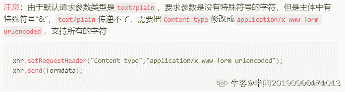
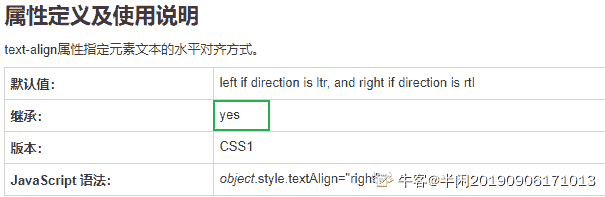
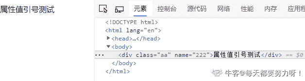
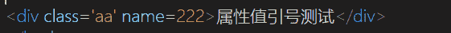

# 奇安信 2019 春招前端开发试题

## 1

下面关于 HTML 的描述正确的一项是 （）

正确答案: D   你的答案: 空 (错误)

```cpp
HTML5 中的所有标签都必须写结束标签
```

```cpp
DOCTYPE 的设置不会影响页面的展示效果
```

```cpp
HTML5 中的属性名对大小写敏感
```

```cpp
HTML5 中可以使用 data-* 自定义属性
```

本题知识点

前端工程师 奇安信 2019

讨论

[天净沙 sha](https://www.nowcoder.com/profile/180189538)

data-* 属性用于存储页面或应用程序的私有自定义数据。

data-* 属性赋予我们在所有 HTML 元素上嵌入自定义 data 属性的能力。

存储的（自定义）数据能够被页面的 JavaScript 中利用，以创建更好的用户体验（不进行 Ajax 调用或服务器端数据库查询）。

data-* 属性包括两部分：

*   属性名不应该包含任何大写字母，并且在前缀 "data-" 之后必须有至少一个字符
*   属性值可以是任意字符串

注释：用户代理会完全忽略前缀为 "data-" 的自定义属性。

发表于 2020-04-13 16:13:02

* * *

[Rebeccacacaca](https://www.nowcoder.com/profile/484266808)

<!DOCTYPE>声明有助于浏览器中正确显示网页。

网络上有很多不同的文件，如果能够正确声明 HTML 的版本，浏览器就能正确显示网页内容。

<!DOCTYPE html> 告诉浏览器当前页面使用 h5 版本解析✨

编辑于 2020-02-27 16:14:24

* * *

[小毛豆 2021](https://www.nowcoder.com/profile/248269081)

```cpp
HTML5 中的属性名对大小写不敏感
```

发表于 2020-10-19 18:39:04

* * *

## 2

下面的 HTML 代码中符合规范的是（）

正确答案: D   你的答案: 空 (错误)

```cpp
<ul>
       <ol>
           <li>item 1</li>
       </ol>
    </ul>

```

```cpp
<table>
        <tr>
            <td>Data 1</td>
            <td>Data 2</td>
        <tr>
    </table>

```

```cpp
<p>
        <ul>
            <li>Item 1</li>
        </ul>
    </p>

```

```cpp
<a href="/">
        <p>Some Text</p>
    </a>

```

本题知识点

前端工程师 奇安信 2019

讨论

[launhui](https://www.nowcoder.com/profile/2328158)

b 选项 

```cpp
<tr></tr>没有闭合
```

发表于 2020-02-24 14:51:08

* * *

[没思路好慌啊](https://www.nowcoder.com/profile/564037326)

1、块级元素可以包含内联元素或某些块级元素，但内联元素不能包含块级元素，它只能包含其它内联元素。2、块级元素不能放在 p 里面。
3、有几个特殊的块级元素只能包含内联元素，不能包含块级元素。如 h1,h2,h3,h4,h5,h6,p,dt
4、li 内可以包含 div5\. a 标签可以包括任何元素，除了自身 

编辑于 2020-03-17 16:45:54

* * *

[夏花爱秋叶](https://www.nowcoder.com/profile/4085682)

1\. p 元素不能包括任何块级元素，包括自身 2\. a 标签可以包括任何元素，除了自身 3\. tr 是表格行，td 是表格块，th 是表头

发表于 2020-03-03 21:32:06

* * *

## 3

下面哪一个不是 HTML5 中的标签（）

正确答案: C   你的答案: 空 (错误)

```cpp
article
```

```cpp
section
```

```cpp
foot
```

```cpp
main
```

本题知识点

前端工程师 奇安信 2019

讨论

[热心市民刘大爷](https://www.nowcoder.com/profile/8711276)

| <!--...--> | 定义注释。 |
| <!DOCTYPE>  | 定义文档类型。 |
| <a> | 定义锚。 |
| <abbr> | 定义缩写。 |
| <acronym> | 定义只取首字母的缩写。 |
| <address> | 定义文档作者或拥有者的联系信息。 |
| <applet> | 不赞成使用。定义嵌入的 applet。 |
| <area> | 定义图像映射内部的区域。 |
| <article> | 定义文章。 |
| <aside> | 定义页面内容之外的内容。 |
| <audio> | 定义声音内容。 |
| <b> | 定义粗体字。 |
| <base> | 定义页面中所有链接的默认地址或默认目标。 |
| <basefont> | 不赞成使用。定义页面中文本的默认字体、颜色或尺寸。 |
| <bdi> | 定义文本的文本方向，使其脱离其周围文本的方向设置。 |
| <bdo> | 定义文字方向。 |
| <big> | 定义大号文本。 |
| <blockquote> | 定义长的引用。 |
| <body> | 定义文档的主体。 |
| <br> | 定义简单的折行。 |
| <button> | 定义按钮 (push button)。 |
| <canvas> | 定义图形。 |
| <caption> | 定义表格标题。 |
| <center> | 不赞成使用。定义居中文本。 |
| <cite> | 定义引用(citation)。 |
| <code> | 定义计算机代码文本。 |
| <col> | 定义表格中一个或多个列的属性值。 |
| <colgroup> | 定义表格中供格式化的列组。 |
| <command> | 定义命令按钮。 |
| <datalist> | 定义下拉列表。 |
| <dd> | 定义定义列表中项目的描述。 |
| <del> | 定义被删除文本。 |
| <details> | 定义元素的细节。 |
| <dir> | 不赞成使用。定义目录列表。 |
| <div> | 定义文档中的节。 |
| <dfn> | 定义定义项目。 |
| <dialog> | 定义对话框或窗口。 |
| <dl> | 定义定义列表。 |
| <dt> | 定义定义列表中的项目。 |
| <em> | 定义强调文本。 |
| <embed> | 定义外部交互内容或插件。 |
| <fieldset> | 定义围绕表单中元素的边框。 |
| <figcaption> | 定义 figure 元素的标题。 |
| <figure> | 定义媒介内容的分组，以及它们的标题。 |
| <font> | 不赞成使用。定义文字的字体、尺寸和颜色。 |
| <footer> | 定义 section 或 page 的页脚。 |
| <form> | 定义供用户输入的 HTML 表单。 |
| <frame> | 定义框架集的窗口或框架。 |
| <frameset> | 定义框架集。 |
| <h1> to <h6> | 定义 HTML 标题。 |
| <head> | 定义关于文档的信息。 |
| <header> | 定义 section 或 page 的页眉。 |
| <hr> | 定义水平线。 |
| <html> | 定义 HTML 文档。 |
| <i> | 定义斜体字。 |
| <iframe> | 定义内联框架。 |
|  | 定义图像。 |
| <input> | 定义输入控件。 |
| <ins> | 定义被插入文本。 |
| <isindex> | 不赞成使用。定义与文档相关的可搜索索引。 |
| <kbd> | 定义键盘文本。 |
| <keygen> | 定义生成密钥。 |
| <label> | 定义 input 元素的标注。 |
| <legend> | 定义 fieldset 元素的标题。 |
| <li> | 定义列表的项目。 |
| <link> | 定义文档与外部资源的关系。 |
| <map> | 定义图像映射。 |
| <mark> | 定义有记号的文本。 |
| <menu> | 定义命令的列表或菜单。 |
| <menuitem> | 定义用户可以从弹出菜单调用的命令/菜单项目。 |
| <meta> | 定义关于 HTML 文档的元信息。 |
| <meter> | 定义预定义范围内的度量。 |
| <nav> | 定义导航链接。 |
| <noframes> | 定义针对不支持框架的用户的替代内容。 |
| <noscript> | 定义针对不支持客户端脚本的用户的替代内容。 |
| <object> | 定义内嵌对象。 |
| <ol> | 定义有序列表。 |
| <optgroup> | 定义选择列表中相关选项的组合。 |
| <option> | 定义选择列表中的选项。 |
| <output> | 定义输出的一些类型。 |
| <p> | 定义段落。 |
| <param> | 定义对象的参数。 |
| <pre> | 定义预格式文本。 |
| <progress> | 定义任何类型的任务的进度。 |
| <q> | 定义短的引用。 |
| <rp> | 定义若浏览器不支持 ruby 元素显示的内容。 |
| <rt> | 定义 ruby 注释的解释。 |
| <ruby> | 定义 ruby 注释。 |
| <s> | 不赞成使用。定义加删除线的文本。 |
| <samp> | 定义计算机代码样本。 |
| <script> | 定义客户端脚本。 |
| <section> | 定义 section。 |
| <select> | 定义选择列表（下拉列表）。 |
| <small> | 定义小号文本。 |
| <source> | 定义媒介源。 |
| <span> | 定义文档中的节。 |
| <strike> | 不赞成使用。定义加删除线文本。 |
| <strong> | 定义强调文本。 |
| <style> | 定义文档的样式信息。 |
| <sub> | 定义下标文本。 |
| <summary> | 为 <details> 元素定义可见的标题。 |
| <sup> | 定义上标文本。 |
| <table> | 定义表格。 |
| <tbody> | 定义表格中的主体内容。 |
| <td> | 定义表格中的单元。 |
| <textarea> | 定义多行的文本输入控件。 |
| <tfoot> | 定义表格中的表注内容（脚注）。 |
| <th> | 定义表格中的表头单元格。 |
| <thead> | 定义表格中的表头内容。 |
| <time> | 定义日期/时间。 |
| <title> | 定义文档的标题。 |
| <tr> | 定义表格中的行。 |
| <track> | 定义用在媒体播放器中的文本轨道。 |
| <tt> | 定义打字机文本。 |
| <u> | 不赞成使用。定义下划线文本。 |
| <ul> | 定义无序列表。 |
| <var> | 定义文本的变量部分。 |
| <video> | 定义视频。 |
| <wbr> | 定义视频。 |
| <xmp> | 不赞成使用。定义预格式文本。 |

发表于 2020-02-25 15:43:33

* * *

[Rebeccacacaca](https://www.nowcoder.com/profile/484266808)

h5 常用结构标签：

1.  <header></header>
2.  <nav></nav>
3.  <section></section>
4.  <aside></aside>
5.  <footer></footer>✨眼神要好
6.  <article></article>

编辑于 2020-02-27 16:40:48

* * *

[沐风雨在侧](https://www.nowcoder.com/profile/40674363)

应该是 footer

发表于 2020-05-02 21:42:07

* * *

## 4

下面哪个类型不是 HTML5 新增的表单类型（）

正确答案: C   你的答案: 空 (错误)

```cpp
color
```

```cpp
date
```

```cpp
password
```

```cpp
email
```

本题知识点

前端工程师 奇安信 2019

讨论

[Rebeccacacaca](https://www.nowcoder.com/profile/484266808)

H5 版本中新提出的表单控件

1.  电子邮件

    <input type="email">

    表单提交时，会验证数据是否符号 email 的规范（有@，并且@后面有内容）

2.  搜索类型

    <input type="search">

    提供了快速清除的功能

3.  url 类型

    <input type="url">

    提交时，验证数据是否符合 url 的规范（http://****）

4.  电话号码类型

    <input type="tel">

    在移动设备中，显示拨号键盘

5.  数字类型

    <input type="number">

    属性：

    *   value 默认显示的值
    *   max 能接收到的最大值
    *   min 能接收到的最小值
    *   step 每次调整数字时，步数大小
6.  范围类型

    <input type="range">

    提供一个滑块组件，允许用户选取指定范围的值

    属性：

    *   value 默认显示的值
    *   max 最大值
    *   min 最小值
    *   step 步长
7.  颜色类型

    <input type="color">

    提供一个颜色拾取器✨

8.  日期类型

    <input type="date">

9.  月份类型

    <input type="month">

10.  周类型

    <input type="week">

发表于 2020-02-27 16:28:58

* * *

[热心市民刘大爷](https://www.nowcoder.com/profile/8711276)

color 类型:用来选取颜色的，它提供一个颜色选取器用来选取。date 类型:以日历的形式方便用户输入 email 类型:该类型会自动要求输入的地址格式正确，否则浏览器不允许提交，并且有一个错误的信息提示 email 类型的文本框具有一个 multiple 属性，该属性允许在文本框中输入使用逗号分隔有效的 E-mail 地址的一个列表。

发表于 2020-02-25 15:46:27

* * *

[小 hu 同学](https://www.nowcoder.com/profile/807281855)

没注意到 说的是新增。。。

发表于 2021-07-02 20:10:29

* * *

## 5

关于无障碍性（Accessibility）的说法中，错误的是（）

正确答案: D   你的答案: 空 (错误)

```cpp
role 属性用来指定一个元素在页面中的作用
```

```cpp
alt 属性用来为图片提供文字性说明
```

```cpp
正确地使用语义化标签有助于提高页面的无障碍性
```

```cpp
tabindex 属性用来指定使用键盘访问该元素的快捷键
```

本题知识点

前端工程师 奇安信 2019

讨论

[夏花爱秋叶](https://www.nowcoder.com/profile/4085682)

```cpp
alt 属性用来为图片提供文字性说明
这句话严格来说，有点问题点额，因为 title 才是用来表明图片内容，alt 是在图片加载失败之后出现的提示文字，其实也可以吧。。
```

发表于 2020-03-03 21:33:36

* * *

[被迫谋生](https://www.nowcoder.com/profile/217164647)

tableindex 控制 tab 键控制网页时的顺序

发表于 2020-02-21 17:37:00

* * *

[20181111](https://www.nowcoder.com/profile/125245013)

对于 alt 属性用来为图片提供文字性说明表示质疑 alt 属性难道不是在图片未能展示的时候作为解释性说明的吗

发表于 2020-10-19 16:03:17

* * *

## 6

为了实现表单文件上传，需要将 form 元素的 enctype 属性设置为（）

正确答案: C   你的答案: 空 (错误)

```cpp
application/json
```

```cpp
text/plain
```

```cpp
multipart/form-data
```

```cpp
application/x-www-form-urlencoded
```

本题知识点

前端工程师 奇安信 2019

讨论

[夏花爱秋叶](https://www.nowcoder.com/profile/4085682)

```cpp
## form 元素的 enctype 属性
1. `enctype 属性在 get 请求中会被忽略，在 post 请求中才有效`
2. `application/x-www-form-urlencoded 表示会对特殊字符进行转义`
3. `text/plain 以文本的形式进行编码，不会对特殊字符进行编码`
4. `multipart/form-data 向服务器发送二进制文件的时候有用，例如提交文件！！！`

```

 发表于 2020-03-03 22:47:43

* * *

[Rebeccacacaca](https://www.nowcoder.com/profile/484266808)

文件选择框 type="file"
注意：需要将 form 的 method 设置为 post，enctype 设置为 multipart/form-data✨属性：multiple 无值属性，设置多文件上传（按住 ctrl 选择）

编辑于 2020-02-27 16:38:10

* * *

## 7

下面有关 HTML5 Canvas 性能优化的做法，哪项是错误的（） 正确答案: D   你的答案: 空 (错误)

```cpp
使用多个分层的 Canvas 绘制复杂场景
```

```cpp
不在动画中使用 putImageData 方法
```

```cpp
使用 Web Worker 运行时间复杂度高的代码
```

```cpp
将计算阶段的开销转嫁到 Canvas 绘制阶段
```

本题知识点

前端工程师 奇安信 2019

讨论

[暂时不在 w](https://www.nowcoder.com/profile/443093050)

在大部分情况下，需要遵循的「最佳实践」 1.  将渲染阶段的开销转嫁到计算阶段之上。
2.  使用多个分层的 Canvas 绘制复杂场景。
3.  不要频繁设置绘图上下文的 font 属性。
4.  不在动画中使用 putImageData 方法。
5.  通过计算和判断，避免无谓的绘制操作。
6.  将固定的内容预先绘制在离屏 Canvas 上以提高性能。
7.  使用 Worker 和拆分任务的方法避免复杂算法阻塞动画运行。

摘自[`blog.csdn.net/weixin_33940102/article/details/90687163?depth_1-utm_source=distribute.pc_relevant.none-task&utm_source=distribute.pc_relevant.none-task`](https://blog.csdn.net/weixin_33940102/article/details/90687163?depth_1-utm_source=distribute.pc_relevant.none-task&utm_source=distribute.pc_relevant.none-task) 

发表于 2020-02-27 15:59:22

* * *

[欢乐马 dudu](https://www.nowcoder.com/profile/592180446)

MDN 关于 Canvas 的性能优化有专门的[文章](https://developer.mozilla.org/zh-CN/docs/Web/API/Canvas_API/Tutorial/Optimizing_canvas)

发表于 2020-03-04 18:14:48

* * *

## 8

下面哪些是 HTML5 中的标签（）

正确答案: A C   你的答案: 空 (错误)

```cpp
header
```

```cpp
center
```

```cpp
footer
```

```cpp
frame
```

本题知识点

前端工程师 奇安信 2019

讨论

[Rebeccacacaca](https://www.nowcoder.com/profile/484266808)

h5 常用结构标签：

1.  <header></header>
2.  <nav></nav>
3.  <section></section>
4.  <aside></aside>
5.  <footer></footer>
6.  <article></article>

发表于 2020-02-27 16:41:14

* * *

[夜寻极光。](https://www.nowcoder.com/profile/868966489)

在 HTML 4.01 中，<center> 对其所包括的文本进行水平居中。现在已经废弃；在 HTML 4.01 中，<frame> 标签定义 <frameset> 中的子窗口（框架）。现 H5 已经不支持；

发表于 2021-08-05 18:40:49

* * *

[凯普特恩 bibibi](https://www.nowcoder.com/profile/111429378)

单选题中混入了一道多选题，好吧，我没在意看全部答案，踩坑了

发表于 2020-12-03 22:45:26

* * *

## 9

页面中包含如下代码，请问页面中 h1 中的文字颜色是 （）

```cpp
<article id="post" class="content">
   <h1 class="title">360 公司简介</h1>
</article>
<style>
  #post { color: blue }
  h1.title { color: black }
  .content .title { color: red }
  article h1 { color: green }
 </style> 
```

正确答案: C   你的答案: 空 (错误)

```cpp
蓝色
```

```cpp
黑色 
```

```cpp
红色 
```

```cpp
绿色
```

本题知识点

前端工程师 奇安信 2019

讨论

[Rebeccacacaca](https://www.nowcoder.com/profile/484266808)

1.  ```cpp
    #post { color: blue }/* id 选择器->100，但是对于 h1 来说，这是继承的样式，所以 无*/
    ```

2.  ```cpp
    h1.title { color: black }/*元素选择器的 1 + 类 10 = 11*/     
    ```

    ```cpp
    .content .title { color: red }/*类选择器 10 + 类选择器 10 = 20*/
    ```

    ```cpp
    article h1 { color: green }/* 元素选择器 1 + 元素选择器 1 = 2*/
    ```

编辑于 2020-02-27 17:02:46

* * *

[cheapCoder](https://www.nowcoder.com/profile/534614366)

继承的样式优先级为 0！！！

发表于 2020-09-30 20:09:30

* * *

[【社会人】](https://www.nowcoder.com/profile/630854493)

根据 CSS 的继承性，直接样式"比"祖先样式"优先级高，所以#post 不用考虑。又因为选择器的优先级关系：内联样式 > ID 选择器 > 类选择器 = 属性选择器 = 伪类选择器 > 标签选择器 = 伪元素选择器

发表于 2022-03-15 21:41:20

* * *

## 10

下面哪一个 CSS 属性是可继承的 （）

正确答案: B   你的答案: 空 (错误)

```cpp
position
```

```cpp
text-align
```

```cpp
background
```

```cpp
box-sizing
```

本题知识点

前端工程师 奇安信 2019

讨论

[苏一恒(Mako)b 站内推找我](https://www.nowcoder.com/profile/1579420)

通常`font`、`文本`、`可见性`的相关的属性都具有继承性。

发表于 2020-03-09 14:06:27

* * *

[高高手](https://www.nowcoder.com/profile/566035028)

什么是 css 继承？
要想了解 css 样式表的继承，我们先从文档树（HTML DOM）开始。文档树由 HTML 元素组成。


文档树和家族树类似，也有祖先、后代、父亲、孩子和兄弟^_^。这很容易理解吧，笔者在这里就不一一赘述了。希望深入了解的朋友请 google 之。

那么 CSS 样式表继承指的是，特定的 CSS 属性向下传递到子孙元素。

下面举个例子，有如下 html 代码片段：

> <p>
> CSS 样式表<em>继承特性</em>的演示代码
> </p>

需要注意的是 em 是包含在 p 之内的。


当我们指定 p 的 css 样式时，看看 em 会有什么变化呢？

> <style>
> p { color:red; }
> </style>


在浏览器中 p 和 em 字体同时变红。我们并没有指定 em 的样式，但 em 继承了它的父亲元素 p 的样式特性。

也许各位看了以后觉得这是理所当然的，根本不值一哂^_^。其实，这就是继承。在不知不觉中影响这我们的代码（想像一下如果没有继承特性，你就需要为每一个元素定义颜色属性，这是多么痛苦的一件事情！！！=_=!）。

当然也不是所有的 css 属性都会被子类继承，例如 border 属性。继续利用上面的一段代码。我们为 p 元素添加 border 属性

> p { border: 1px solid red; }


还好，p 的 border 属性没有被 em 继承，否则是不是怪怪的呢？！^_^


那么，哪些属性是可以继承的呢？css 样式表属性可以继承的有如下：

> azimuth, border-collapse, border-spacing,
> caption-side, color, cursor, direction, elevation,
> empty-cells, font-family, font-size, font-style,
> font-variant, font-weight, font, letter-spacing,
> line-height, list-style-image, list-style-position,
> list-style-type, list-style, orphans, pitch-range,
> pitch, quotes, richness, speak-header, speaknumeral,
> speak-punctuation, speak, speechrate,
> stress, text-align, text-indent, texttransform,
> visibility, voice-family, volume, whitespace,
> widows, word-spacing

吓？！这么多？！怎么记得住呢？别急，我们来理一理这些属性。

文本相关属性：

> azimuth, border-collapse, border-spacing,
> caption-side, color, cursor, direction, elevation,
> empty-cells, font-family, font-size, font-style,
> font-variant, font-weight, font, letter-spacing,
> line-height, list-style-image, list-style-position,
> list-style-type, list-style, orphans, pitch-range,
> pitch, quotes, richness, speak-header, speaknumeral,
> speak-punctuation, speak, speechrate,
> stress, text-align, text-indent, texttransform,
> visibility, voice-family, volume, whitespace,
> widows, word-spacing

列表相关属性：

> azimuth, border-collapse, border-spacing,
> caption-side, color, cursor, direction, elevation,
> empty-cells, font-family, font-size, font-style,
> font-variant, font-weight, font, letter-spacing,
> line-height, list-style-image, list-style-position,
> list-style-type, list-style, orphans, pitch-range,
> pitch, quotes, richness, speak-header, speaknumeral,
> speak-punctuation, speak, speechrate,
> stress, text-align, text-indent, texttransform,
> visibility, voice-family, volume, whitespace,
> widows, word-spacing

还有一个属性比较重要，color 属性。

值得一说的是 font-size。很显然 font-size 是可以被继承的。但是它的方式有一些特别。Font-size 的子类继承的不是实际值，而是计算后的值。下面解释下为什么 font-size 会这么特别呢？

看一个例子：

> <p>
> 字体大小属性<em>继承特性</em>的演示代码
> </p>

为 p 定义字体大小为默认字体的 80％。

> p { font-size:80%}

如果 font-size 继承的是相对值，那么结果会怎么样呢？依照这样的逻辑，em 的 font-size 为 80％X80％=64%，网页看起来应该是这样的。


但，实际情况却不是如此。em 内的文字并没有改变大小，而是和 p 保持一致。


下面举三个例子，让各位有个直观的认识

> p { font-size:14px;}

由于浏览器默认字体大小是 16px，而 p 定义了字体 14px，所以 em 继承了 p 的字体大小属性，也是 14px；

| 元素 | 值 | 计算后的值 |
| 默认字体大小 | 约 16 像素 |   |
| <body> | 未指定 | 约 16px |
| <p> | 14px | 14px |
| <em> | 未指定 | 继承值=14px |

> p { font-size:85%;}

浏览棋默认字体大小 16px,而 p 定义了字体大小(16px X 85% = 13.6px). 13.6px 这个值将被子元素 em 继承。

| 元素 | 值 | 计算后的值 |
| 默认字体大小 | 约 16 像素 |   |
| <body> | 未指定 | 约 16px |
| <p> | 85% | 16px X 85% = 13.6px |
| <em> | 未指定 | 继承值=13.6px |

> p { font-size:0.85em;}

浏览棋默认字体大小 16px,而 p 定义了字体大小(16px X 0.85em = 13.6px). 13.6px 这个值将被子元素 em 继承。

| 元素 | 值 | 计算后的值 |
| 默认字体大小 | 约 16 像素 |   |
| <body> | 未指定 | 约 16px |
| <p> | 0.85em | 16px X 0.85em= 13.6px |
| <em> | 未指定 | 继承值=13.6px |

上面的例子都比较简答，再来个复杂的

> body { font-size: 85%; }
> h1 { font-size: 200%; }
> h2 { font-size: 150%; }

浏览棋默认字体大小 16px,而 body 定义了字体大小(16px X 85% = 13.6px). 如果子元素没有指定字体大小 13.6px 这个值将被子元素继承。

| 元素 | 值 | 计算后的值 |
| 默认字体大小 | 约 16 像素 |   |
| <body> | 85% | 16px X 85% = 13.6px |
| <h1> | 200% | 继承值＝13.6px X 200%= 27.2px |
| <h2> | 150％ | 继承值＝13.6px X 150%= 20.4px |
| <p> | 未指定 | 继承值=13.6px |
| <em> | 未指定 | 继承值=13.6px |

说到这里，CSS 样式表的继承基本上讲完了。在实践中，还有一个特性值需要解释一下，这和继承的应用也是息息相关的。

样式表中的特性值描述了不同规则的相对权重，它的基本规则是：

◆统计选择符中的 ID 属性个数。

◆统计选择符中的 CLASS 属性个数。

◆统计选择符中的 HTML 标记名格式。

最后，按正确的顺序写出三个数字，不要加空格或逗号，得到一个三位数。(注意，你需要将数字转换成一个以三个数字结尾的更大的数)。相应于选择符的最终数字列表可以很容易确定较高数字特性凌驾于较低数字的。

以下是一个按特性分类的选择符的列表：

> H1{color:blue;}　    特性值为：1
> PEM{color:purple;} 特性值为：2
> .apple{red;}　  特性值为：10
> P.bright{color:yellow;}    特性值为：11
> P.brightEM.dark{color:brown;}　  特性值为：22
> #id316{color:yellow}　   特性值为：100

从上表我们可以看出#id316 具有更高的特殊性，因而它有更高的权重。当有多个规则都能应用于同一个元素时，权重越高的样式将被优先采用。而继承属性的特性值为 0；也就是说，任何一条与 css 继承值冲突的属性值都会覆盖继承的属性值！！！

这点是需要各位注意的，Enjoy it！！

发表于 2020-05-31 11:09:12

* * *

[Rebeccacacaca](https://www.nowcoder.com/profile/484266808)



发表于 2020-02-27 17:08:11

* * *

## 11

下面哪种方法可以让一个元素内的文字永远在一行内显示（文字很长时也不会换行）（）

正确答案: C   你的答案: 空 (错误)

```cpp
word-break: normal
```

```cpp
word-wrap: nowrap
```

```cpp
white-space: nowrap
```

```cpp
word-spacing: 0
```

本题知识点

前端工程师 奇安信 2019

讨论

[木易 yr](https://www.nowcoder.com/profile/8769797)

word-break:keep-all;     /* 不换行 */
white-space:nowrap;      /* 不换行 */
overflow:hidden;         /* 内容超出宽度时隐藏超出部分的内容 */
text-overflow:ellipsis;  /* 溢出时显示省略标记...；需与 overflow:hidden;一起使用*/

发表于 2020-02-28 14:37:25

* * *

[lianzujiao](https://www.nowcoder.com/profile/498182699)

work-break:normal | break-all | keep-all  /* 浏览器默认 | 允许在单词内换行 | 只在半角空格或连字符处换行*/work-wrap:normal | break-word  /* 默认换行规则 | 允许在长单词内换行*/white-space:normal | nowrap  /*默认规则 | 长文本不换行，直至遇见<br>*/word-spacing:normal | length(30px) | inherit   /*默认字符间距 | 设定段落字符间距（可负值）| 继承父辈的值*/

发表于 2020-07-10 14:22:24

* * *

[拿完 offer 请喝茶](https://www.nowcoder.com/profile/896776515)

**不换行也不省略 ： **word-break : keep-all;white-space : nowrap;  **不换行，超出用省略号代替 : **word-break : keep-all;white-space : nowrap;overflow : hidden;text-overflow : ellipsis;

发表于 2020-02-26 21:41:51

* * *

## 12

下面关于 CSS 的说法中，正确的是（）

正确答案: C   你的答案: 空 (错误)

```cpp
 在 box-sizing 为默认值时，width 属性指定的是包含 padding 在内的宽度
```

```cpp
padding 用来指定内边距，可以为负值
```

```cpp
两个相邻块级元素垂直方向的 margin 可能会合并
```

```cpp
块级元素里内容的高度超出了指定的 height 时，默认会被隐藏
```

本题知识点

前端工程师 奇安信 2019

讨论

[苏一恒(Mako)b 站内推找我](https://www.nowcoder.com/profile/1579420)

box-sizing 默认情况只 width 只包含 content 的内容 padding 不允许为负值相邻块垂直方向会合并，水平方向不会 div 固定宽高，超出后会溢出，不设置宽高，超出后会自动拓展

发表于 2020-03-09 14:17:45

* * *

[暂时不在 w](https://www.nowcoder.com/profile/443093050)

box-sizing 有两个属性：content-box,是默认值，width 和 height 只包括内容的宽和高。border-box，边框和内边距的值包含在 width 中，但不包括外边距。参考：[`developer.mozilla.org/zh-CN/docs/Web/CSS/box-sizing`](https://developer.mozilla.org/zh-CN/docs/Web/CSS/box-sizing)

发表于 2020-02-27 18:50:59

* * *

[夜寻极光。](https://www.nowcoder.com/profile/868966489)

IE 盒模型的 width 是 conteng+padding+boder 的宽度 W3C 标准盒模型的 width 是 content 的宽度，height 是 content 的高度

```cpp
box-sizing 默认值为 W3C 标准盒模型
```

发表于 2021-08-05 18:46:12

* * *

## 13

下面哪不是 display 属性的合法值（）

正确答案: D   你的答案: 空 (错误)

```cpp
table
```

```cpp
flex
```

```cpp
inline-block
```

```cpp
hidden
```

本题知识点

前端工程师 奇安信 2019

讨论

[木易 yr](https://www.nowcoder.com/profile/8769797)

display 没有 hidden 的属性补充 display:none 与 visibility: hidden 有什么区别？

*   都是看不见元素，但是 display:none 意思是不展示这个元素，该元素不占据空间，
*   而 visibility: hidden 只是将该元素隐藏了，只是用户不可见而已，占据页面空间

编辑于 2020-02-28 14:44:10

* * *

[牛客 212996375 号](https://www.nowcoder.com/profile/212996375)

不是 table-cell?

发表于 2022-01-04 16:24:41

* * *

[夜寻极光。](https://www.nowcoder.com/profile/868966489)

 ```cpp
display：table
```

此元素会作为块级表格来显示（类似 <table>），表格前后带有换行符。

发表于 2021-08-05 18:47:52

* * *

## 14

页面中有如下代码：

```cpp
 <div class="profile">
     
     <p class="desc">Some description</p>
 </div>
 <article>
     <h2>Posts</h2>
 </article>
 <style>
     .profile .avatar { float: left }
 </style>
```

如果想让 article 不受浮动影响，哪种做法是错误的 （）

正确答案: C   你的答案: 空 (错误)

```cpp
article { clear: both }
```

```cpp
.profile::after { content: ''; display: block; clear: both }
```

```cpp
.profile { clear: both }
```

```cpp
.profile { overflow: hidden }
```

本题知识点

前端工程师 奇安信 2019

讨论

[木易 yr](https://www.nowcoder.com/profile/8769797)

*   父级 div 定义 height
*   结尾处加空 div 标签 clear:both
*   父级 div 定义伪类:after 和 zoom
*   父级 div 定义 overflow:hidden
*   父级 div 也浮动，需要定义宽度
*   结尾处加 br 标签 clear:both    比较好的是第 3 种方式

发表于 2020-02-28 14:49:32

* * *

[8 点半](https://www.nowcoder.com/profile/690556949)

题目是不是应该给 profile 清除浮动啊？

1.给浮动元素的后面添加属性 clear 空元素

2.设置该浮动元素的 overflow

3.给该浮动元素的后面元素设置 clear 属性

发表于 2020-02-21 15:25:25

* * *

[夏花爱秋叶](https://www.nowcoder.com/profile/4085682)

做错的原因就在于看错了，需要让 article 不收浮动影响，没有说父元素，所以可以给 article 加 clear both;而给父元素添加 clear both 没用，需要添加 overflow:hidden;或者父元素的伪类加 clear:both 才行

发表于 2020-03-03 21:43:00

* * *

## 15

如果想让一个元素相对于屏幕（视口）定位，应该把它的 position 属性设置为 （）

正确答案: A   你的答案: 空 (错误)

```cpp
fixed
```

```cpp
absolute
```

```cpp
relative
```

```cpp
static
```

本题知识点

前端工程师 奇安信 2019

讨论

[懂猿外](https://www.nowcoder.com/profile/920860147)

static 默认值。元素出现在正常的普通流中 relative 生成相对定位的元素，相对于其在普通流中的位置进行偏移。 fixed （老 IE 不支持）生成绝对定位的元素，通常相对于浏览器窗口或 iframe 进行定位。 inherit 继承父元素的 position 属性，但需要注意的是 IE8 以及往前的版本都不支持 inherit 属性。 absolute 生成绝对定位的元素， 相对于最近一级的 不是 static 的父元素来进行定位,如果没有找到的话，最终是根据 body 进行定位。

发表于 2020-12-19 17:24:29

* * *

[木易 yr](https://www.nowcoder.com/profile/8769797)

fixed 相对于 window 固定，滚动浏览器窗口并不会使其移动

发表于 2020-02-28 14:54:42

* * *

[小 hu 同学](https://www.nowcoder.com/profile/807281855)

fixed 相对于 windons re 相对于祖先元素定位 ab 是是绝对定位，需要给父元素设置相对定位，才能使用

发表于 2021-07-02 20:19:24

* * *

## 16

如果要将一个元素旋转 90°，可以使用 CSS 中的哪个属性实现（）

正确答案: B   你的答案: 空 (错误)

```cpp
translate
```

```cpp
transform
```

```cpp
transition
```

```cpp
animation
```

本题知识点

前端工程师 奇安信 2019

讨论

[lynnlic](https://www.nowcoder.com/profile/6624292)

transform:旋转 div 元素;translate:移动，是 transform 的一个方法;
transition:属性是一个简写属性，用于设置四个过渡属性：

*   transition-property
*   transition-duration
*   transition-timing-function
*   transition-delay

发表于 2020-02-28 15:46:27

* * *

[夜寻极光。](https://www.nowcoder.com/profile/868966489)

transform 属性向元素应用 2D 或 3D 转换。该属性允许我们对元素进行旋转、缩放、移动或倾斜。

发表于 2021-08-05 18:49:47

* * *

[Jachin-x](https://www.nowcoder.com/profile/519689225)

transform：旋转 div 元素；transalte:移动；transition:过渡效果

发表于 2020-12-22 11:03:42

* * *

## 17

下面哪一个属于 CSS 命名规范 （）

正确答案: B   你的答案: 空 (错误)

```cpp
PostCSS
```

```cpp
BEM
```

```cpp
Less
```

```cpp
Sass
```

本题知识点

前端工程师 奇安信 2019

讨论

[苏一恒(Mako)b 站内推找我](https://www.nowcoder.com/profile/1579420)

这题不是让判断四个选项命名是否规范，而是考察知识广度。PostCSS：转换 CSS 的工具 BEM：命名规范 block-name__element-name--modifier-name，也就是模块名 + 元素名 + 修饰器名，以保证命名不会冲突 LESS、SASS 都是 CSS 预处理器

发表于 2020-03-09 14:32:24

* * *

[li7778864](https://www.nowcoder.com/profile/43836617)

问的是哪个是`命名规范`，不是哪个命名符合规范。

发表于 2020-02-27 21:17:30

* * *

[Birche](https://www.nowcoder.com/profile/851993890)

这题不懂，谁能解释一下？

发表于 2020-02-29 17:10:53

* * *

## 18

以下表达式值为 true 的是（）

正确答案: C   你的答案: 空 (错误)

```cpp
"9" < "10"
```

```cpp
NaN == NaN
```

```cpp
String('a') === 'a'
```

```cpp
. typeof [] === 'array'
```

本题知识点

前端工程师 奇安信 2019

讨论

[被迫谋生](https://www.nowcoder.com/profile/217164647)

a 选项比的是字符编码 b 的 NaN 代表的是一个本来要返回数值的操作数未返回数值，它与任何值都不相等 d tyoeof 操作符检测不出来 array

发表于 2020-02-21 18:04:46

* * *

[ohiokkk](https://www.nowcoder.com/profile/260253703)

D 选项：typeof [ ]==="object" 为 true

发表于 2020-02-29 15:22:06

* * *

[欢乐马 dudu](https://www.nowcoder.com/profile/592180446)

可以用 `Array.isArray()`来判断是否为 array
`typeof` 只会返回 number, object, string, undefined, symbol, boolean 以及 function

发表于 2020-03-04 19:04:21

* * *

## 19

以下代码的输出结果是

```cpp
<script>
     var x = 1;
     var obj = {
       x: 2,
       fun: function () {
         var x = 3;
         return this.x;
       }
     };
     var fun = obj.fun;
     console.log( obj.fun(), fun() );
 </script>
```

正确答案: D   你的答案: 空 (错误)

```cpp
1  2 
```

```cpp
1  3
```

```cpp
2  3
```

```cpp
2  1
```

本题知识点

前端工程师 奇安信 2019

讨论

[中年白](https://www.nowcoder.com/profile/882597565)

obj.fun()中的 this 会指向调用 fun 函数的实例对象，而 obj 对象中有 x 的值，所以是 2，而 fun()直接调用，那么 this 则指向全局 window 对象，所以是 1

发表于 2020-02-26 15:00:48

* * *

## 20

以下代码的输出结果是（）

```cpp
for (var i = 1; i < 4; i++) {
     setTimeout(function() {
         console.log(i)
     }, 0)
 }
```

正确答案: C   你的答案: 空 (错误)

```cpp
1 2 3
```

```cpp
3 3 3
```

```cpp
4 4 4 
```

```cpp
1、2、3 输出顺序不确定
```

本题知识点

前端工程师 奇安信 2019

讨论

[中年白](https://www.nowcoder.com/profile/882597565)

不管 setTimeout 中的时间是多少，都会先执行完 for 循环

发表于 2020-02-26 15:24:29

* * *

[晨风扶绿的芭蕉](https://www.nowcoder.com/profile/942688698)

这个主要是考察异步和作用域的问题。var 没有块级作用域，所以变量 i 在大括号作用域外面也能被引用。如果换成 let i= 1,结果又不一样了。在 let 中有块级作用域了，i 只会在当前括号内被引用，所以结果就是 1，2，3。其实有一点闭包的意味在里面了。这个循环执行三次，所以会打印三个数值。

发表于 2020-08-18 10:39:50

* * *

[Ainz201910230932943](https://www.nowcoder.com/profile/676723409)

异步执行问题 setTimeOut 属于异步宏任务 要等同步任务执行完毕后再进行

发表于 2020-04-08 10:37:54

* * *

## 21

以下代码的输出结果是（）

```cpp
 let obj = {
     a: 1,
     b: 2
 };
 Object.prototype.c = 3;
 Object.defineProperty(obj, 'd', {
     enumerable: false
 });
 for (let key in obj) {
     console.log(key);
 }

```

正确答案: B   你的答案: 空 (错误)

```cpp
a b
```

```cpp
a b c
```

```cpp
a b c d
```

```cpp
a b d
```

本题知识点

前端工程师 奇安信 2019

讨论

[被迫谋生](https://www.nowcoder.com/profile/217164647)

定义了属性 d 的 Enumberable 为 false 则 d 不能通过 for-in 循环

发表于 2020-02-21 17:43:16

* * *

[没思路好慌啊](https://www.nowcoder.com/profile/564037326)

for ... in 循环可以遍历自身和直系原型上的属性，不会遍历系统自带的爷爷辈分属性，（除非是自己定义的）

发表于 2020-03-17 17:06:23

* * *

[Cwlojako](https://www.nowcoder.com/profile/743436436)

原型对象上的 c 也可以？

发表于 2020-03-05 13:07:14

* * *

## 22

在 W3C DOM 事件的回调函数中，如何阻止事件冒泡（）

正确答案: B   你的答案: 空 (错误)

```cpp
preventDefault()
```

```cpp
stopPropagation()
```

```cpp
cancelBubble()
```

```cpp
return false
```

本题知识点

前端工程师 奇安信 2019

讨论

[Wesley、](https://www.nowcoder.com/profile/353969005)

`preventDefault()` 阻止事件默认行为
`stopPropagation()` W3C 标准的阻止冒泡
`cancelBubble()` ie 的阻止冒泡

发表于 2020-03-12 14:06:34

* * *

[kimeng](https://www.nowcoder.com/profile/752317675)

[`developer.mozilla.org/zh-CN/docs/Web/API/Event`](https://developer.mozilla.org/zh-CN/docs/Web/API/Event)[event.initEvent](https://developer.mozilla.org/zh-CN/docs/Web/API/Event/initEvent)通过 DocumentEvent 的接口给被创建的事件初始化某些值。event.preventBubble 已废弃 Gecko 24 防止事件冒泡。已弃用，请使用 [event.stopPropagation](https://developer.mozilla.org/zh-CN/docs/Web/API/Event/stopPropagation) 代替它。event.preventCapture 已废弃 Gecko 24 已弃用，请使用 [event.stopPropagation](https://developer.mozilla.org/zh-CN/docs/Web/API/Event/stopPropagation)代替它。[event.preventDefault](https://developer.mozilla.org/zh-CN/docs/Web/API/Event/preventDefault)取消事件（如果该事件可取消）。[event.stopImmediatePropagation](https://developer.mozilla.org/zh-CN/docs/Web/API/Event/stopImmediatePropagation)对这个特定的事件而言，没有其他***被调用。这个事件既不会添加到相同的元素上，也不会添加到以后将要遍历的元素上（例如在捕获阶段）。[event.stopPropagation](https://developer.mozilla.org/zh-CN/docs/Web/API/Event/stopPropagation)停止事件冒泡。

发表于 2020-02-27 21:36:20

* * *

## 23

下面哪一个不是 JavaScript 模块化规范（）

正确答案: C   你的答案: 空 (错误)

```cpp
AMD
```

```cpp
CommonJS
```

```cpp
RequireJS
```

```cpp
ES Modules
```

本题知识点

前端工程师 奇安信 2019

讨论

[kimeng](https://www.nowcoder.com/profile/752317675)

在 ES6 之前，业界流行的是社区制定的一些模块加载方案，如 CommonJS 和 AMD 。而 ES6 Module 作为官方规范，且浏览器端和服务器端通用，未来一定会一统天下，但由于 ES6 Module 来的太晚，受限于兼容性等因素，可以预见的是今后一段时期内，多种模块化方案仍会共存。

*   ES6 Modue 规范：JavaScript 语言标准模块化方案，浏览器和服务器通用，模块功能主要由 export 和 import 两个命令构成。export 用于定义模块的对外接口，import 用于输入其他模块提供的功能。
*   CommonJS 规范：主要用于服务端的 JavaScript 模块化方案，Node.js 采用的就是这种方案，所以各种 Node.js 环境的前端构建工具都支持该规范。CommonJS 规范规定通过 require 命令加载其他模块，通过 module.exports 或者 exports 对外暴露接口。
*   AMD 规范：全称是 Asynchronous Modules Definition，异步模块定义规范，一种更主要用于浏览器端的 JavaScript 模块化方案，该方案的代表实现者是 RequireJS，通过 define 方法定义模块，通过 require 方法加载模块。

发表于 2020-02-27 21:38:15

* * *

[夏花爱秋叶](https://www.nowcoder.com/profile/4085682)

require.js 是 amd 规范的实现者，不是规范。。

发表于 2020-03-03 21:48:39

* * *

## 24

下面关于 Canvas 和 SVG 的描述，哪一个是正确的 （）

正确答案: B   你的答案: 空 (错误)

```cpp
可以给一个 Canvas 中的不同图形分别绑定鼠标事件
```

```cpp
Canvas 和 SVG 都可以使用 JavaScript 来绘制
```

```cpp
WebGL 使用 SVG 在网页上进行 3D 图形绘制
```

```cpp
Canvas 更适合静态图片的展示
```

本题知识点

前端工程师 奇安信 2019

讨论

[求个 offer 请吃饭](https://www.nowcoder.com/profile/157946053)

Canvas 绘图中只有一个元素-canvas，每一个图形/图像都不是元素，不能直接进行事件绑定

发表于 2020-02-27 16:03:14

* * *

[夏花爱秋叶](https://www.nowcoder.com/profile/4085682)

WebGL 是一种 3D 绘图标准，是 js 和 OpenGL2.0 的结合，通过增强对 OpenGL 的 js 绑定，可以对 html5 的 canvas 提供硬件 3d 加速渲染

发表于 2020-03-04 21:21:34

* * *

[懂猿外](https://www.nowcoder.com/profile/920860147)

**Canvas 和 SVG 都允许您在浏览器中创建图形，但是它们在根本上是不同的。** **SVG 是一种使用 XML 描述 2D 图形的语言。
SVG 基于 XML，这意味着 SVG DOM 中的每个元素都是可用的。您可以为某个元素附加 JavaScript 事件处理器。
在 SVG 中，每个被绘制的图形均被视为对象。如果 SVG 对象的属性发生变化，那么浏览器能够自动重现图形。

Canvas 通过 JavaScript 来绘制 2D 图形。
Canvas 是逐像素进行渲染的。
在 canvas 中，一旦图形被绘制完成，它就不会继续得到浏览器的关注。如果其位置发生变化，那么整个场景也需要重新绘制，包括任何或许已被图形覆盖的对象。** 

发表于 2020-12-19 23:18:35

* * *

## 25

下面哪一项技术不能将数据存储到用户本地（）

正确答案: D   你的答案: 空 (错误)

```cpp
localStorage
```

```cpp
cookie
```

```cpp
indexedDB
```

```cpp
fetch
```

本题知识点

前端工程师 奇安信 2019

讨论

[多又葡萄](https://www.nowcoder.com/profile/334111319)

fetch 是用来发送网络请求的，并不是用来存储数据的

发表于 2020-02-29 21:32:25

* * *

[懂猿外](https://www.nowcoder.com/profile/920860147)

localStorage 属性允许你访问一个[Document](https://developer.mozilla.org/zh-CN/docs/Web/API/Document) 源（origin）的对象 [Storage](https://developer.mozilla.org/zh-CN/docs/Web/API/Storage)；存储的数据将保存在浏览器会话中。localStorage 类似 [sessionStorage](https://developer.mozilla.org/zh-CN/docs/Web/API/Window/sessionStorage)，但其区别在于：存储在 localStorage 的数据可以长期保留；而当页面会话结束——也就是说，当页面被关闭时，存储在 sessionStorage 的数据会被清除 。Cookie 是一些数据, 存储于你电脑上的文本文件中。
IndexedDB 是一种底层 API，用于在客户端存储大量的结构化数据**fetch 是一种 HTTP 数据请求的方式**

发表于 2020-12-19 23:24:09

* * *

## 26

通过 JavaScript 设置 Cookie，如果不指定 expires，会产生以下哪种结果（）

正确答案: B   你的答案: 空 (错误)

```cpp
报错
```

```cpp
该 Cookie 在浏览器会话结束后失效
```

```cpp
该 Cookie 永不失效
```

```cpp
该 Cookie 立即失效
```

本题知识点

前端工程师 奇安信 2019

讨论

[木易 yr](https://www.nowcoder.com/profile/8769797)

如果不定义 cookie 的过期时间，那么 cookie 的过期时间就会是会话期间，也就是说，此时的 cookie 是和 sesstion 等效的，唯一的不同是此种 cookie 是存储在客户端的内存中，Session 是存储在服务器端的内存中

发表于 2020-02-28 16:15:32

* * *

## 27

以下列举的 HTTP 响应头中，哪项与 HTTP 缓存无关（）

正确答案: B   你的答案: 空 (错误)

```cpp
Last-Modified
```

```cpp
Connection
```

```cpp
Cache-Control
```

```cpp
Etag
```

本题知识点

前端工程师 奇安信 2019

讨论

[啊呀啊呀哩呱唧](https://www.nowcoder.com/profile/513688183)

1.HTTP/1.1 定义的 Cache-Control 头用来区分对缓存机制的支持情况， 请求头和响应头都支持这个属性。 2.Last-Modified：一种弱校验器。说它弱是因为它只能精确到一秒。如果响应头里含有这个信息，客户端可以在后续的请求中带上 If-Modified-Since 来验证缓存。 3.Etags：缓存的一种强校验器。如果资源请求的响应头里含有 ETag, 客户端可以在后续的请求的头中带上 If-None-Match 头来验证缓存。

发表于 2020-03-15 22:32:21

* * *

[【社会人】](https://www.nowcoder.com/profile/630854493)

Connection 表示浏览器与服务器的连接类型

发表于 2022-03-16 07:49:51

* * *

[酥窝](https://www.nowcoder.com/profile/4088502)

last-modified：响应头下发的文件最后一次修改时间

connection：用于对连接进行规范，有 keep-alive 和 close 两个值可选

cache-control：请求头和响应头均有此属性，控制文件缓存

etag：响应头下发的文件缓存唯一标志

发表于 2020-11-13 23:53:20

* * *

## 28

有关 ES6 的 const 关键字，以下说法哪项是正确的（）

正确答案: A   你的答案: 空 (错误)

```cpp
const 只在声明所在的块级作用域内有效
```

```cpp
const 存在与 var 类似的变量提升机制
```

```cpp
const 可以用来阻止对象的属性被无意修改
```

```cpp
const 声明的全局变量，也属于顶层对象的属性 
```

本题知识点

前端工程师 奇安信 2019

讨论

[挖个窟窿过年](https://www.nowcoder.com/profile/488771072)

const 实际上保证的并不是变量的值不得改动，而是变量指向的那个内存地址不得改动。对于简单类型的数据而言，值就保存在变量指向的内存地址中，因此等同于常量。但对于复合类型的数据，变量指向的内存地址保存的只是一个指针，const 只能保证这个指针是固定的，至于它指向的数据结构是不是可变的，则完全不能控制。

编辑于 2020-06-21 11:08:40

* * *

[牛客 820178772 号](https://www.nowcoder.com/profile/820178772)

B:const 没有变量提升机制，但是会形成暂时性死区，也即在 const 声明之前使用声明变量会报错。C:const 实质只是规定声明变量的内容不被改变，对于引用类型的对象，变量存的是指针，只要不改动指针，改对象的属性是可以的。D:var 声明全局变量会注册到 window 对象上，但是 let 和 const 不会

发表于 2020-07-28 11:48:13

* * *

[凯普特恩 bibibi](https://www.nowcoder.com/profile/111429378)

又是文字陷阱呀，好吧，踩坑了

发表于 2020-12-03 22:51:57

* * *

## 29

以下代码执行后，控制台的输出依次是（）

```cpp
<div class="outer">
  <div class="inner">
    <button id="btn">click</button>
  </div>
</div>
<script>
  const inner = document.querySelector('.inner');
  const outer = document.querySelector('.outer');
  const body = document.body;
  function handler(e) {
    console.log(`${this.id || this.className || this.tagName}`);
  }

  body.addEventListener('click', handler);
  outer.addEventListener('click', handler);
  inner.addEventListener('click', handler);
</script>
```

正确答案: A   你的答案: 空 (错误)

```cpp
inner, outer, body
```

```cpp
outer, body, inner
```

```cpp
outer, inner, body
```

```cpp
body, outer, inner
```

本题知识点

前端工程师 奇安信 2019

讨论

[银河有几个你](https://www.nowcoder.com/profile/968963934)

应该问“点击 btn 按钮后，会输出什么”，只加监听，不说触发时机有毛用

发表于 2020-04-08 10:32:31

* * *

[MV13eard](https://www.nowcoder.com/profile/863005403)

addEventListener 第三个参数默认为 fasle,为 false 时事件流为事件冒泡。事件开始由最具体的元素接受，所以最先接收的是 inner，紧接着逐级向上传播到 outer，再到 body，所以依次打印 inner、outer、body 发表于 2020-02-24 22:37:03

* * *

[龙飞 2](https://www.nowcoder.com/profile/762895522)

      （以下皆为 W3C 标准）事件的传递分为三个阶段-------事件捕获，目标事件，事件冒泡。事件冒泡简单来说就是叫家长，先自己来，然后又把自己爸爸叫来了，后面又叫来爷爷，依此类推。本题出的不清楚，但也能猜到题目的意思是点击 Button，而添加监听器方法的第三个参数没写，这里默认就是冒泡（第三个参数一般是会用来取消默认事件，取消默认方法和取消冒泡方法可自行学习），所以这里由内往外走，就是 inner,outer,body。        这里涉及的 this 指向和 jQuery 选择符可以自行了解，有错误望指出。

发表于 2020-10-17 21:52:10

* * *

## 30

以下代码执行后，obj 的值是（）

```cpp
const obj = {x: 1, y: 2};
function foo(obj){
    obj.x++;
    obj.y--;
}
foo(obj);
```

正确答案: C   你的答案: 空 (错误)

```cpp
{x:1, y:2}
```

```cpp
{x:1, y:1}
```

```cpp
{x:2, y:1}
```

```cpp
报错
```

本题知识点

前端工程师 奇安信 2019

讨论

[马春林](https://www.nowcoder.com/profile/737537268)

当函数 参数是 引用变量是，参数保存的是引用变量的地址，故 obj 也改变了

发表于 2020-02-26 22:51:31

* * *

[挖个窟窿过年](https://www.nowcoder.com/profile/488771072)

const 实际上保证的并不是变量的值不得改动，而是变量指向的那个内存地址不得改动。对于简单类型的数据而言，值就保存在变量指向的内存地址中，因此等同于常量。但对于复合类型的数据，变量指向的内存地址保存的只是一个指针，const 只能保证这个指针是固定的，至于它指向的数据结构是不是可变的，则完全不能控制。

编辑于 2020-06-21 11:09:00

* * *

[夜寻极光。](https://www.nowcoder.com/profile/868966489)

把数组或者对象赋值给一个变量，其实是把它们指向的内存地址复制了一份，不是新开辟一块内存空间，内存里面的内容没变，所以不管谁改了内容，它们的内容都会变，引一发而动全身

发表于 2021-08-08 17:35:57

* * *

## 31

要让下面的代码能正常工作，在 ________ 处应当填写？

```cpp
const link = document.querySelector('a.preview');
link.addEventListener('click', function(e){
    previewImage(e.target.href);
    _____________________________
});
```

正确答案: A   你的答案: 空 (错误)

```cpp
e.preventDefault();
```

```cpp
e.stopPropagation();
```

```cpp
return false
```

```cpp
e.cancelBubble = true;
```

本题知识点

前端工程师 奇安信 2019

讨论

[daipi173](https://www.nowcoder.com/profile/3869378)

C 选项中使用 on 绑定的事件 return false 会生效，使用 addEventListener 绑定的事件 return false 不会生效

发表于 2020-04-21 12:57:12

* * *

[星星草 201810111349809](https://www.nowcoder.com/profile/733503199)

选项 a 的作用是取消标签的默认行为

发表于 2020-02-25 14:18:07

* * *

[哈哈哈哈哈 201811061236413](https://www.nowcoder.com/profile/816121478)

要取消链接被点击后的默认行为

发表于 2020-03-06 01:09:06

* * *

## 32

以下代码执行后控制台的输出是（）

```cpp
[...[1,,3,,5]].map((_, n) => n);
```

正确答案: A   你的答案: 空 (错误)

```cpp
[0,1,2,3,4]
```

```cpp
[1,2,3,4,5]
```

```cpp
[1,undefined,3,undefined,5]
```

```cpp
[0,undefined,2,undefined,4]
```

本题知识点

前端工程师 奇安信 2019

讨论

[MV13eard](https://www.nowcoder.com/profile/863005403)

```cpp
[...[1,,3,,5]] = [1,undefined ,3,undefined,5]    //数组包含五个元素
```

map 遍历回调函数传两个参数，第一个是 item，第二个是 index,这里返回的是 index,即数组下标，所有是[0,1,2,3,4]

发表于 2020-02-24 22:42:12

* * *

[多弗朗亮司](https://www.nowcoder.com/profile/30494205)

拿 _ 作形参名就离谱

发表于 2020-09-11 22:09:08

* * *

[牛客 881513039 号](https://www.nowcoder.com/profile/881513039)

数组的的扩展方法，有些方法是不会遍历 空值的，也就是稀松数组，会跳过 empty，具体那些方法是选择跳过还是不跳过，可以查文档，我也记不清，不然我也不会错，不过大部分是会跳过空值的

发表于 2020-09-25 11:32:09

* * *

## 33

下列元素中，默认是 display:inline 的有（）

正确答案: A C   你的答案: 空 (错误)

```cpp
a
```

```cpp
p
```

```cpp
span
```

```cpp
div
```

本题知识点

前端工程师 奇安信 2019

讨论

[懂猿外](https://www.nowcoder.com/profile/920860147)

常见的 inline 内联元素：

span、img、a、lable、input、abbr（缩写）、em（强调）、big、cite（引用）、i（斜体）、q（短引用）、textarea、select、small、sub、sup，strong、u（下划线）、button（默认 display：inline-block））

常见的 block 块级元素：

div、p、h1…h6、ol、ul、dl、table、address、blockquote、form

常见的 inline-block 内联块元素：

img、input

发表于 2020-12-19 23:48:12

* * *

[木易 yr](https://www.nowcoder.com/profile/8769797)

此元素会被显示为内联元素

发表于 2020-02-28 18:30:17

* * *

## 34

以下对 HTML 描述错误的是（）

正确答案: B C   你的答案: 空 (错误)

```cpp
HTML5 是 HTML 的第 5 个 版本
```

```cpp
HTML 的标签区分大小写，故 `<a>` 和 `<A>` 是不同的标签
```

```cpp
页面上的 JS 只有在图片资源都加载完成后才能开始工作
```

```cpp
同步加载外链 CSS 会阻塞后续内联 JS 的执行
```

本题知识点

前端工程师 奇安信 2019

讨论

[二花 student](https://www.nowcoder.com/profile/224339799)

HTML5 是第 5 个版本？？迷我🤣

发表于 2020-04-27 16:47:30

* * *

[连夜的月光](https://www.nowcoder.com/profile/220262211)

D 是对的，解析 CSS 构建 CSSOM 会阻塞 JS 的执行，不阻塞 JS 的加载。所以要把 CSS 文件放在前面加载。

发表于 2020-02-26 13:29:20

* * *

[Ainz201910230932943](https://www.nowcoder.com/profile/676723409)

HTML5 不是第六个版本吗 4.01 我记得才是第五个啊

发表于 2020-04-08 11:14:34

* * *

## 35

以下说法正确的是？（）

正确答案: B C   你的答案: 空 (错误)

```cpp
页面上所有的 HTML 标签都要闭合
```

```cpp
HTML 标签中属性的值应该用双引号
```

```cpp
HTML 标签中属性的值不加引号浏览器也能识别
```

```cpp
如果忘记写结束标签，浏览器无法加载网页
```

本题知识点

前端工程师 奇安信 2019

讨论

[每天都要努力呀！](https://www.nowcoder.com/profile/956413803)

B 答案是应该，没有写必须，所有是对的，双引号，单引号，甚至部分属性不写引号，都可用，浏览器会自动改为双引号浏览器显示代码：
实际代码：

编辑于 2020-04-27 12:48:35

* * *

[凯普特恩 bibibi](https://www.nowcoder.com/profile/111429378)

你这个忘记写结束标签我理解的就是成对标签你忘记写结束标签了，那浏览器是无法加载的呀，会报错的。像你 img 这种单标签，还用忘记写结束标签么？？？

发表于 2020-12-03 22:53:56

* * *

[啊 yq](https://www.nowcoder.com/profile/303750837)

* * *

等标签就可以不闭合

发表于 2020-04-09 21:16:14

* * *

## 36

以下表达式值为 false 的是（）

正确答案: B C D   你的答案: 空 (错误)

```cpp
"abc" === "abc"
```

```cpp
{x:1} === {x:1}
```

```cpp
Symbol(1) === Symbol(1) 
```

```cpp
NaN === NaN
```

本题知识点

前端工程师 奇安信 2019

讨论

[被迫谋生](https://www.nowcoder.com/profile/217164647)

b.值同但是对象指针不同 c.symbol 代表独一无二的值？ d.NaN 与任何值都不相等，包括 NaN 本身

发表于 2020-02-21 18:00:16

* * *

[前端小窝](https://www.nowcoder.com/profile/522760159)

B 选项左右各自创建了对象，类型相同，要想表示值相同应该用  left.x===right.x

发表于 2020-03-27 10:03:18

* * *

[牛客 682345279 号](https://www.nowcoder.com/profile/682345279)

```cpp
Symbol(）都是独一无二的，里面的 1 是描述这个 symbol 的
```

发表于 2021-03-08 15:35:41

* * *