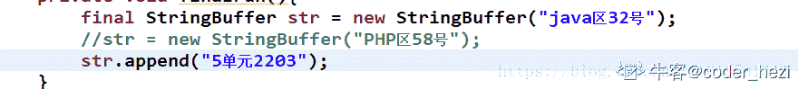
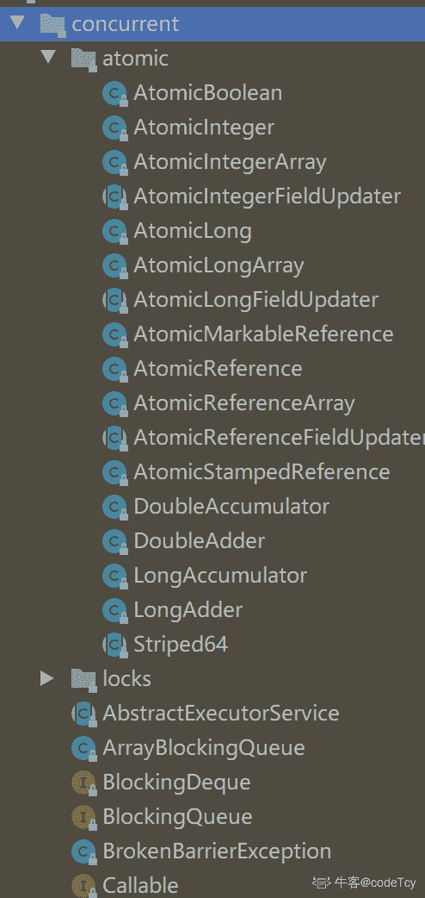
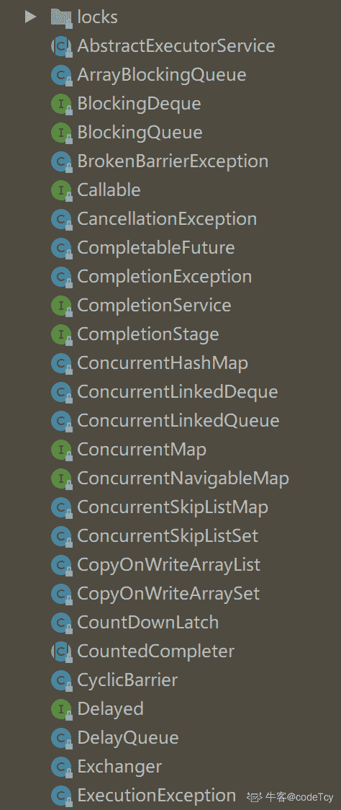

# 奇安信 2019 春招移动端开发试题

## 1

在 Activity 中需要找到一个 id 是 bookName 的的 TextView 组件,下面哪种语句写法是正确的（）(注：API level 26 以上，包括 level 26)

正确答案: A C   你的答案: 空 (错误)

```cpp
TextView tv = this.findViewById(R.id.bookName);
```

```cpp
TextView tv = (TextView)this.findViewById(R.id.code);
```

```cpp
TextView tv = (TextView)this.findViewById(R.id.bookName);
```

```cpp
TextView tv = (TextView)this.findViewById(R.string.bookName);
```

本题知识点

安卓工程师 iOS 工程师 奇安信 2019

## 2

表示下拉列表的组件是（）

正确答案: B   你的答案: 空 (错误)

```cpp
Gallery
```

```cpp
Spinner
```

```cpp
GridView
```

```cpp
ListView
```

本题知识点

安卓工程师 iOS 工程师 奇安信 2019

讨论

[華麗麗](https://www.nowcoder.com/profile/1450277)

gallery 是用来水平滚动的显示一系列项目 gridview 布局是一个网格，一行可以有对个项，并且整个视图可以滚动，比如手机中的图库，列表 总的来说，listview 主要用于 单列多行 gridview 用于多行多列的网状

编辑于 2020-09-19 19:10:29

* * *

## 3

如果将一个 TextView 的 android:layout_height 属性值设置为 wrap_content,那么该组件将是以下哪种显示效果（）

正确答案: D   你的答案: 空 (错误)

```cpp
该文本域的宽度将填充父容器宽度
```

```cpp
该文本域的宽度仅占据该组件的实际宽度
```

```cpp
该文本域的高度将填充父容器高度
```

```cpp
该文本域的高度仅占据该组件的实际高度
```

本题知识点

安卓工程师 iOS 工程师 奇安信 2019

## 4

android 中下列属于 Intent 的作用的是（）

正确答案: C   你的答案: 空 (错误)

```cpp
实现应用程序间的数据共享
```

```cpp
是一段长的生命周期，没有用户界面的程序，可以保持应用在后台运行，而不会因为切换页面而消失
```

```cpp
可以实现界面间的切换，可以包含动作和动作数据，连接四大组件的纽带
```

```cpp
处理一个应用程序整体性的工作
```

本题知识点

安卓工程师 iOS 工程师 奇安信 2019

## 5

绑定 Service 的方法是（）

正确答案: A   你的答案: 空 (错误)

```cpp
bindService
```

```cpp
startService
```

```cpp
onStart
```

```cpp
onBind
```

本题知识点

安卓工程师 iOS 工程师 奇安信 2019

## 6

关于 BroadcastReceiver 的说法不正确的是（）

正确答案: B   你的答案: 空 (错误)

```cpp
是用来接收广播 Intent 的
```

```cpp
一个广播 Intent 只能被一个订阅了此广播的 BroadcastReceiver 所接收
```

```cpp
对有序广播，系统会根据接收者声明的优先级别按顺序逐个执行接收者 
```

```cpp
接收者声明的优先级别在的 android:priority 属性中声明，数值越大优先级别越高
```

本题知识点

安卓工程师 iOS 工程师 奇安信 2019

讨论

[牛客 714925798 号](https://www.nowcoder.com/profile/714925798)

不是订阅了广播的 BroadcastReceiver 能接收吗

发表于 2020-04-14 11:17:05

* * *

## 7

下面在 AndroidManifest.xml 文件中注册 BroadcastReceiver 方式正确的（）

正确答案: A   你的答案: 空 (错误)

```cpp
<receiver android:name="com.lite.lanxin.NewBroad">
<intent-filter>
<action android:name="android.provider.action.NewBroad"/>
<action>
</intent-filter>
</receiver>

```

```cpp
<receiver android:name="com.lite.lanxin.NewBroad">
<intent-filter>
android:name="android.provider.action.NewBroad"/>
</intent-filter>
</receiver>

```

```cpp
<receiver android:name="com.lite.lanxin.NewBroad">
<action android:name="android.provider.action.NewBroad"/>
<action></receiver>

```

```cpp
<intent-filter>
<receiver android:name="com.lite.lanxin.NewBroad">
<action> android:name="android.provider.action.NewBroad"/>
<action>
</receiver>
</intent-filter>

```

本题知识点

安卓工程师 iOS 工程师 奇安信 2019

## 8

关于 res/raw 目录说法正确的是（）

正确答案: A   你的答案: 空 (错误)

```cpp
这里的文件是原封不动的存储到设备上不会转换为二进制的格式
```

```cpp
这里的文件是原封不动的存储到设备上会转换为二进制的格式
```

```cpp
这里的文件最终以二进制的格式存储到指定的包中
```

```cpp
这里的文件最终不会以二进制的格式存储到指定的包中
```

本题知识点

安卓工程师 iOS 工程师 奇安信 2019

## 9

以下哪个不属于网络相关的开源项目（）

正确答案: C   你的答案: 空 (错误)

```cpp
OkHttp
```

```cpp
Retrofit
```

```cpp
RxBinding
```

```cpp
Volley
```

本题知识点

安卓工程师 iOS 工程师 奇安信 2019

## 10

下面关于 Activity 的状态，那些说法是错误的（）

正确答案: D   你的答案: 空 (错误)

```cpp
Activity 处于 paused 状态时，Activity 失去焦点或被非全屏的 Activity 覆盖或被透明的 Activity 覆盖，Activity 仍然可见，但失去与用户交互的能力，Activity 此时所有的状态信息和成员变量还被保存，当内存紧张时，这个 Activity 会被回收
```

```cpp
Activity 处于 stopped 状态时 Activity 被另一个 Activity 完全覆盖，Activity 不可见，Activity 此时所有的状态信息和成员变量还被保存，当内存紧张时，这个 Activity 会被回收
```

```cpp
Activity 处于 onStart 状态时表示 Activity 被启动，这 Activity 已经可见了，但是还没有处于前台，所以可以理解为 Activity 可见但我们无法与 Activity 交互
```

```cpp
当前 Activity 弹出 dialog 后，由于 Activity 被遮挡，所以此时 Activity 处于 onPause 状态
```

本题知识点

安卓工程师 iOS 工程师 奇安信 2019

讨论

[華麗麗](https://www.nowcoder.com/profile/1450277)

dialog 对话框只是 activity 的一个组件

发表于 2020-09-19 19:14:29

* * *

## 11

关于引用那个说法是错误的（）

正确答案: B   你的答案: 空 (错误)

```cpp
软引用：当内存不足时，会被虚拟机回收
```

```cpp
虚引用：当虚拟机执行回收 gc 时，被回收
```

```cpp
强引用：常见的引用方式，无论如何，虚拟机宁愿抛出 Outofmemory 异常也不会回收的对象
```

```cpp
软引用非常适合于创建缓存
```

本题知识点

安卓工程师 iOS 工程师 奇安信 2019

讨论

[華麗麗](https://www.nowcoder.com/profile/1450277)

虚引用任何时候都会被垃圾回收

发表于 2020-09-19 19:16:00

* * *

## 12

Activity 的启动模式有哪些（）

正确答案: A B C D   你的答案: 空 (错误)

```cpp
standard
```

```cpp
singleTop
```

```cpp
singleTask
```

```cpp
singleInstance
```

本题知识点

安卓工程师 iOS 工程师 奇安信 2019

## 13

关于 Flutter，以下说法正确的是（）

正确答案: A B C   你的答案: 空 (错误)

```cpp
Google 推出的移动应用程序开发框架,新一代的移动端跨平台解决方案
```

```cpp
其开发语言为 Dart
```

```cpp
完全开源
```

```cpp
虽然在国外获得了一些关注，但国内还没有任何一家公司跟进并使用相关技术进行开发。
```

本题知识点

安卓工程师 iOS 工程师 奇安信 2019

讨论

[牛客 521914457 号](https://www.nowcoder.com/profile/521914457)

abc

发表于 2022-03-16 17:13:38

* * *

[牛客 190471154 号](https://www.nowcoder.com/profile/190471154)

abc

发表于 2021-09-25 09:37:04

* * *

[牛客 474340065 号](https://www.nowcoder.com/profile/474340065)

ABC

发表于 2020-08-18 00:52:42

* * *

## 14

```cpp
class A{ 
public:
    virtual void say(void) {
        cout<<"A"<<endl;
    }
};
class B : public A{
public:
    void say(void){
        cout<<"B"<<endl;
    }
};
class C : public B{
public:
    void say(void){
        cout<<"C"<<endl;
    }
};
C * pc = new C;
A * pa = pc;
pa->say();
```

以上程序输出（）

正确答案: C   你的答案: 空 (错误)

```cpp
A
```

```cpp
B
```

```cpp
C
```

```cpp
都不是
```

本题知识点

安卓工程师 iOS 工程师 奇安信 2019

## 15

若 MyClass 为一个类，执行 MyClass a[4], *p[5];语句会自动调用该类构造函数的次数是（）

正确答案: B   你的答案: 空 (错误)

```cpp
0
```

```cpp
4
```

```cpp
5
```

```cpp
9
```

本题知识点

安卓工程师 iOS 工程师 奇安信 2019

## 16

以下 STL 结构中哪种是连续存储的（）

正确答案: D   你的答案: 空 (错误)

```cpp
map
```

```cpp
set
```

```cpp
list
```

```cpp
vector
```

本题知识点

安卓工程师 iOS 工程师 奇安信 2019

## 17

某平台 int 和 double 类型变量占 32 位，char 型变量占 8 位，则以下结构体 sizeof(T)是多少

```cpp
#pragma pack(4)
struct  T {
    int a;
    char c;
    union{
        char b;
        double d;
    } u;
};
```

正确答案: C   你的答案: 空 (错误)

```cpp
9
```

```cpp
10
```

```cpp
12
```

```cpp
16
```

本题知识点

安卓工程师 iOS 工程师 奇安信 2019

## 18

```cpp
void f(char s[]){
    cout<<sizeof(s)<<","<<strlen(s);
}
char str[] = "hello world";
cout<<sizeof(str)<<","<<strlen(str)<<",";
f(str);
```

以上代码在 32 位平台上输出（）

正确答案: A   你的答案: 空 (错误)

```cpp
12, 11, 4, 11
```

```cpp
12, 11, 12, 11
```

```cpp
4, 11, 4, 11
```

```cpp
4, 12, 4, 12
```

本题知识点

安卓工程师 iOS 工程师 奇安信 2019

## 19

```cpp
class A{
    int m1;
    int m2;
    int m3;
public:
    A():m3(3), m1(2){
        m2 = 2;
    }
};
A a;
```

以上代码中类 A 的成员变量 m1, m2, m3 的初始化顺序是   

正确答案: C   你的答案: 空 (错误)

```cpp
m1, m2, m3
```

```cpp
m3, m1, m2
```

```cpp
m1, m3, m2
```

```cpp
m2, m3, m1
```

本题知识点

安卓工程师 iOS 工程师 奇安信 2019

## 20

在 iOS/Mac OS 操作系统中，最小的调度单位是什么?（）

正确答案: A   你的答案: 空 (错误)

```cpp
线程
```

```cpp
进程
```

```cpp
协程
```

```cpp
汇编指令
```

本题知识点

安卓工程师 iOS 工程师 奇安信 2019

讨论

[牛客 931161738 号](https://www.nowcoder.com/profile/931161738)

最小调度单位是线程

发表于 2020-08-27 15:33:39

* * *

## 21

在 iOS/Mac OS 操作系统中，用户态的第一个进程是？（）

正确答案: C   你的答案: 空 (错误)

```cpp
daemon
```

```cpp
agent
```

```cpp
launchd
```

```cpp
Init
```

本题知识点

安卓工程师 iOS 工程师 奇安信 2019

## 22

在 iOS/Mac OS 操作系统中，文件系统是什么类型？（）

正确答案: C   你的答案: 空 (错误)

```cpp
NTFS
```

```cpp
Ext2/3/4
```

```cpp
HFS+/APFS
```

```cpp
FAT32
```

本题知识点

安卓工程师 iOS 工程师 奇安信 2019 C++工程师 牛客

讨论

[小雨兮兮](https://www.nowcoder.com/profile/365022050)

A

发表于 2020-06-01 20:18:27

* * *

## 23

使用 Object-C 开发 iOS 应用时，进程的 main()函数执行之前的过程有哪些？（）

正确答案: A B   你的答案: 空 (错误)

```cpp
dyld 加载动态库
```

```cpp
执行类的+load
```

```cpp
初始化 Window
```

```cpp
dyld 替换所有动态库中引用的其他库符号
```

本题知识点

安卓工程师 iOS 工程师 奇安信 2019

## 24

以下不会出现在进程生命周期内的调度方向是？（）

正确答案: B   你的答案: 空 (错误)

```cpp
SIDL->SRun(Runnable)
```

```cpp
SSleep->SRun(Running)
```

```cpp
SZOMB->Dead
```

```cpp
SRtop->SRun(Runnable)
```

本题知识点

安卓工程师 iOS 工程师 奇安信 2019

## 25

以下哪些是 UIView 和 CALayer 的区别（）

正确答案: A C D   你的答案: 空 (错误)

```cpp
UIView 可以响应事件，CALayer 不可以
```

```cpp
UIView 是 CALayer 的代理
```

```cpp
UIView 不能修改默认 CALayer 的 Class，但可以添加新的 Layer
```

```cpp
UIView 更加侧重于对 Layer 的管理，CALayer 更加侧重于内容的绘制
```

本题知识点

安卓工程师 iOS 工程师 奇安信 2019

## 26

在 Mach-O 文件中，哪个区包含了动态链接的符号桩（）

正确答案: A   你的答案: 空 (错误)

```cpp
__TEXT 段
```

```cpp
__PAGEZERO 段
```

```cpp
__DATA 段
```

```cpp
Header 区
```

本题知识点

安卓工程师 iOS 工程师 奇安信 2019

## 27

下列哪个不是动态语言的特性（）

正确答案: A   你的答案: 空 (错误)

```cpp
在运行时动态加载 lib
```

```cpp
在运行时替换一个类
```

```cpp
在运行时修改类的方法
```

```cpp
在运行时添加类的方法
```

本题知识点

安卓工程师 iOS 工程师 奇安信 2019

## 28

在 UIKit 中 frame 和 bounds 的区别是（）

正确答案: C   你的答案: 空 (错误)

```cpp
frame 是 bounds 的别名
```

```cpp
frame 是 bounds 的继承类
```

```cpp
frame 坐标参考系是父视图，bounds 是自身
```

```cpp
frame 坐标参考系是自身，bounds 是父视图
```

本题知识点

安卓工程师 iOS 工程师 奇安信 2019

## 29

什么是 key window?（）

正确答案: D   你的答案: 空 (错误)

```cpp
App 中唯一的 UIWindow 对象
```

```cpp
最上层的一个 window
```

```cpp
可见的，可以添加 view 的 window
```

```cpp
用来接收键盘以及一些非触摸类的消息的 window
```

本题知识点

安卓工程师 iOS 工程师 奇安信 2019

## 30

以下关于 iOS 中 Runloop 的说法错误的是（）

正确答案: C   你的答案: 空 (错误)

```cpp
主线程的 Runloop 启动就会创建
```

```cpp
Runloop 是线程安全的，创建后会被存放在线程本地存储中
```

```cpp
Runloop 的机制可以实现省电，流畅，响应快的特点
```

```cpp
Runloop 使用 mach 信号驱动
```

本题知识点

安卓工程师 iOS 工程师 奇安信 2019

## 31

layoutSubview 在以下哪个情况下不会被调用（）

正确答案: A B C D   你的答案: 空 (错误)

```cpp
addSubview
```

```cpp
UIScrollView 滚动
```

```cpp
旋转 screen
```

```cpp
改变子 View 大小
```

本题知识点

安卓工程师 iOS 工程师 奇安信 2019

## 32

以下哪些会导致 App 启动变慢（）

正确答案: A B C D   你的答案: 空 (错误)

```cpp
链接的动态库多
```

```cpp
代码中 Class 较多
```

```cpp
C++静态变量多
```

```cpp
+Load 方法过多，执行时间太久
```

本题知识点

安卓工程师 iOS 工程师 奇安信 2019

## 33

Java 语言里，byte 类型的取值范围是（）

正确答案: A   你的答案: 空 (错误)

```cpp
-128 ~ 127
```

```cpp
-228 ~128
```

```cpp
 -255 ~ 256
```

```cpp
 -255 ~ 255
```

本题知识点

安卓工程师 iOS 工程师 奇安信 2019

讨论

[黄岩 20191218081292](https://www.nowcoder.com/profile/163747689)

A

发表于 2020-05-27 16:58:20

* * *

## 34

关于 java 数组，下面说法错误的是（）

正确答案: C   你的答案: 空 (错误)

```cpp
定义数组的方式可以为 int[] arr; 或 int arr[];
```

```cpp
数组的初始化分为静态初始化和动态初始化两种
```

```cpp
数组在动态初始化完成后，可以再次动态修改其长度
```

```cpp
数组里的元素类型必须相同
```

本题知识点

安卓工程师 iOS 工程师 奇安信 2019

讨论

[牛客 218452773 号](https://www.nowcoder.com/profile/218452773)

c

发表于 2021-06-23 19:51:21

* * *

[柳迎风](https://www.nowcoder.com/profile/994791546)

c

发表于 2020-11-22 11:20:28

* * *

[Franxx](https://www.nowcoder.com/profile/255276703)

a

发表于 2020-04-17 22:09:56

* * *

## 35

关于 Java 类 LinkedList 的特点，下面描述正确的是（）

正确答案: B   你的答案: 空 (错误)

```cpp
查询快
```

```cpp
增删快
```

```cpp
元素不重复
```

```cpp
元素自然排序
```

本题知识点

安卓工程师 iOS 工程师 奇安信 2019

讨论

[黄岩 20191218081292](https://www.nowcoder.com/profile/163747689)

B

发表于 2020-05-27 16:57:51

* * *

## 36

下面说法错误的是（）

正确答案: B   你的答案: 空 (错误)

```cpp
用 abstract 关键字修饰的抽象类不能直接被实例化
```

```cpp
用 abstract 关键字修饰的方法可以在其声明类中实现
```

```cpp
用 interface 关键字修饰的接口类不能直接被实例化
```

```cpp
用 interface 关键字修饰的接口类里能够定义常量
```

本题知识点

安卓工程师 iOS 工程师 奇安信 2019

讨论

[coder_hezi](https://www.nowcoder.com/profile/56601192)

```cpp
用 abstract 关键字修饰的方法应该是必须在其声明类中实现
```

发表于 2020-03-13 23:59:58

* * *

## 37

关于 final 关键字，下面说法错误的是（）

正确答案: D   你的答案: 空 (错误)

```cpp
final 关键字修饰类时，说明该类不能被继承
```

```cpp
final 关键字修饰方法时，说明该方法不能被子类重写
```

```cpp
final 关键字修饰成员变量时，该成员变量必须被显式初始化
```

```cpp
final 关键字修饰引用类型的成员变量时，说明该变量所指向对象的内容不可变
```

本题知识点

安卓工程师 iOS 工程师 奇安信 2019

讨论

[華麗麗](https://www.nowcoder.com/profile/1450277)

final 成员变量只能显式初始化一次，也可以隐式初始化 final 指向成员变量表示引用不变

编辑于 2020-09-19 19:27:16

* * *

[coder_hezi](https://www.nowcoder.com/profile/56601192)

被 final 修饰的变量其实就相当于定义了一个常量，无法被修改的变量，如果 final 修饰的是一个基本数据类型的变量，那么这个变量的值就定了，不能变了，而如果修饰的是一个引用变量，**那么该变量存的是一个内存地址**，该地址就不能变了，**但是该内存地址所指向的那个对象还是可以变的****** 

发表于 2020-03-14 00:03:05

* * *

[Jackkinson](https://www.nowcoder.com/profile/558629)

final 修饰的变量在显示初始化后不可变，但并不是这个对象的内容不可变

发表于 2020-03-12 16:56:36

* * *

## 38

下列属于 java.util.concurrent 包的类有（）

正确答案: A B C D   你的答案: 空 (错误)

```cpp
ConcurrentHashMap
```

```cpp
BlockingQueue
```

```cpp
AtomicInteger
```

```cpp
ReentrantLock
```

本题知识点

安卓工程师 iOS 工程师 奇安信 2019

讨论

[alaa](https://www.nowcoder.com/profile/293830529)



发表于 2021-03-15 21:43:36

* * *

[繭 201909152239388](https://www.nowcoder.com/profile/366108323)

AD？

发表于 2020-08-27 18:07:55

* * *

## 39

Java 里关于方法的重写(Override)和重载(Overloade),下面说法正确的是（）

正确答案: A B C D   你的答案: 空 (错误)

```cpp
方法重写是指父类与子类之间多态性的一种表现
```

```cpp
方法重载是指同一个类中多态性的一种表现
```

```cpp
子类中定义的某方法与其父类中的某方法有相同的签名(名称、参数、返回值)，称之为方法重写
```

```cpp
一个类中定义了多个同名的方法，但方法签名(名称、参数、返回值)不相同，称之为方法重载
```

本题知识点

安卓工程师 iOS 工程师 奇安信 2019

讨论

[黄岩 20191218081292](https://www.nowcoder.com/profile/163747689)

A,B,C,D

发表于 2020-05-27 16:56:57

* * *

## 40

关于 volatitle 关键字, 下面说法错误的是（）

正确答案: C D   你的答案: 空 (错误)

```cpp
可以保证多线程对变量操作时的可见性
```

```cpp
可以禁止编译器进行指令重排
```

```cpp
可以保证对变量任何操作的多线程安全
```

```cpp
可以保证对变量任何操作的原子性
```

本题知识点

安卓工程师 iOS 工程师 奇安信 2019

## 41

关于常用类多线程安全问题，下面说明错误的是（）

正确答案: B D   你的答案: 空 (错误)

```cpp
Vector 是多线程安全的
```

```cpp
HashMap 是多线程安全的
```

```cpp
ArrayList 不是多线程安全的
```

```cpp
String、StringBuffer、StringBuilder 都是多线程安全的
```

本题知识点

安卓工程师 iOS 工程师 奇安信 2019

讨论

[Jackkinson](https://www.nowcoder.com/profile/558629)

Vector 是安全的，StringBuilder 是不安全的，HashMap 是不安全的，ArrayList 是不安全的安全的：StringBuilder，ConcurrentHashMap，Vector，Hashtable 等。

编辑于 2020-03-14 09:07:08

* * *

## 42

关于 Java 类初始化顺序，下面说法正确的是（）

正确答案: B C   你的答案: 空 (错误)

```cpp
父类的构造函数先于子类的静态代码块初始化
```

```cpp
子类的静态成员先于父类的构造函数初始化
```

```cpp
静态成员和静态代码块按声明的顺序初始化
```

```cpp
访问类的静态成员变量时，所有非静态成员变量也会被初始化
```

本题知识点

安卓工程师 iOS 工程师 奇安信 2019

讨论

[黄岩 20191218081292](https://www.nowcoder.com/profile/163747689)

B

发表于 2020-05-27 16:49:12

* * *

## 43

下列实现单例的方式中，哪些有多线程安全问题（）

正确答案: A B C   你的答案: 空 (错误)

```cpp
class Singleton {
    private static Singleton instance;
    public static Singleton getInstance(){
        if (null == instance){
            instance = new Singleton();
        }
        return  instance;
    }
}

```

```cpp
class Singleton{
    private static Singleton instance;
    public static Singleton getInstance(){
        if (null == instance){
            synchronized (Singleton.class) {
                instance = new Singleton();
            }
        }
        return  instance;
    }
}

```

```cpp
class Singleton {
    private static volatile Singleton instance;
    public static Singleton getInstance(){
        if (null == instance){
            synchronized (Singleton.class) {
                instance = new Singleton();
            }
        }
        return  instance;
    }
}

```

```cpp
class Singleton {
    private static volatile Singleton instance;
    public static Singleton getInstance(){
        if (null == instance){
            synchronized (Singleton.class) {
                if (null == instance) {
                    instance = new Singleton();
                }
            }
        }
        return  instance;
    }
}

```

本题知识点

安卓工程师 iOS 工程师 奇安信 2019

## 44

下面的代码运行输出结果可能是哪个（）

```cpp
class ThreadNotify{
    private volatile Object lock = new Object();
    void startThread(final String name) {
        new Thread(new Runnable() {
            @Override
            public void run() {
                try {
                    synchronized (lock) {
                        lock.wait();
                        System.out.println("thread " + name + " finish");
                    }
                } catch (InterruptedException e){
                    e.printStackTrace();
                }
            }
        }).start();
    }
    void notifyThread() {
        new Thread(new Runnable() {
            @Override
            public void run() {
                try {
                    synchronized (lock){
                        Thread.sleep(1000);
                        lock.notify();
                        Thread.sleep(1000);
                        System.out.println("thread notify finish");
                    }
                } catch (InterruptedException e){
                    e.printStackTrace();
                }
            }
        }).start();
    }
    public static void main() {
        ThreadNotify threadNotify = new ThreadNotify();
        threadNotify.startThread("one");
        threadNotify.startThread("two");
        threadNotify.notifyThread();
        try {
            Thread.sleep(5000);
        } catch (InterruptedException e){
            e.printStackTrace();
        }
    }
}
```

正确答案: C D   你的答案: 空 (错误)

```cpp
thread one finish
thread notify finish

```

```cpp
thread two finishthread notify finish
```

```cpp
thread notify finish
thread one finish

```

```cpp
thread notify finish
thread two finish

```

本题知识点

安卓工程师 奇安信 2019

## 45

关于 Objective-C，以下说法错误的是（）

正确答案: B   你的答案: 空 (错误)

```cpp
不支持命名空间
```

```cpp
支持类的多重继承
```

```cpp
可以实现多个接口
```

```cpp
可以和 c++混合编程
```

本题知识点

安卓工程师 iOS 工程师 奇安信 2019

## 46

以下说法不正确的是：（）

正确答案: A   你的答案: 空 (错误)

```cpp
nonatomic：提供多线程保护，提高性能
```

```cpp
assign:说明设置器直接进行赋值，针对基础数据类型
```

```cpp
retain:此属性只用于 Objective-C 的对象类型，对参数进行 release 旧值，再 retain 新值
```

```cpp
copy:此属性只对实现 NSCopying 协议的对象有效
```

本题知识点

安卓工程师 iOS 工程师 奇安信 2019

## 47

关于 Objective-C 的 ARC 机制的工作原理错误的是（）

正确答案: D   你的答案: 空 (错误)

```cpp
编译器会自动在代码里面插入适当的 retain，release，autorelease 的语句;
```

```cpp
ARC 是编译器的特性，并非运行时的特性；
```

```cpp
当代码中出现多个对 retain 和 release 的重复调用，ARC 优化器负责移出多余的 retain 和 release 语句;
```

```cpp
ARC 会对 CoreFundation 的 api 进行内存管理，不需要手动去释放
```

本题知识点

安卓工程师 iOS 工程师 奇安信 2019

## 48

iOS 沙盒中不包含以下哪些目录（）

正确答案: B   你的答案: 空 (错误)

```cpp
Documents
```

```cpp
Appdatas
```

```cpp
Library
```

```cpp
Caches
```

本题知识点

安卓工程师 iOS 工程师 奇安信 2019

讨论

[牛客 964986348 号](https://www.nowcoder.com/profile/964986348)

B

发表于 2020-09-23 09:06:40

* * *

## 49

main()执行前，系统执行了那些操作（）

正确答案: C   你的答案: 空 (错误)

```cpp
加载依赖库
```

```cpp
调用 Objective-C 类的+load 方法
```

```cpp
加载一系列的 UI 资源，包括图片,nib 文件。
```

```cpp
将 Category 插入方法列表
```

本题知识点

安卓工程师 iOS 工程师 奇安信 2019

## 50

在 ARC 机制下，没有手动添加 Autorelease Pool 的情况下, autorelease 对象什么时候释放（）

正确答案: B   你的答案: 空 (错误)

```cpp
函数执行结束时立即释放
```

```cpp
当前的 runloop 结束时释放
```

```cpp
在函数结束后的一段时间内随机释放
```

```cpp
在系统发出 memory warning 时自动释放
```

本题知识点

安卓工程师 iOS 工程师 奇安信 2019

## 51

关于 Category，下面那些是错误的（）

正确答案: B   你的答案: 空 (错误)

```cpp
可以给类添加新的成员方法
```

```cpp
可以添加类的成员变量
```

```cpp
和原类方法冲突时，覆盖原来方法
```

```cpp
可以在不同的 Objective-C 代码文件中实现
```

本题知识点

安卓工程师 iOS 工程师 奇安信 2019

## 52

关于代码段：

```cpp
NSString *obj = [[NSData alloc] init]; 
```

以下说法正确的是：（）

正确答案: D   你的答案: 空 (错误)

```cpp
编译失败
```

```cpp
运行时崩溃
```

```cpp
编译时，编译器将 obj 解释为 NSData 类型
```

```cpp
可以正常编译运行，运行时 变量 obj 为 NSData 类型
```

本题知识点

安卓工程师 iOS 工程师 奇安信 2019

## 53

以下哪一段代码不会抛出异常（）

正确答案: C   你的答案: 空 (错误)

```cpp
NSArray *array=@[1，2，3];
NSNumber * number=array[3];

```

```cpp
NSString *key=nil;
NSDictionary *dict=@{key:@"v"};

```

```cpp
NSString *str=nil;
NSString *str2=[str substringFromIndex:3];

```

```cpp
NSString *str=@"hi";
NSString *str2=[str substringFromIndex:3];

```

本题知识点

安卓工程师 iOS 工程师 奇安信 2019

## 54

关于 NSOperationQueue 的说法，错误的是（）

正确答案: B   你的答案: 空 (错误)

```cpp
主要用于多线程并发处理
```

```cpp
它是一个队列，有严格的先进先出
```

```cpp
它不会遵守严格的先进先出
```

```cpp
NSOperationQueue 可以通过调整权重来调整队列的执行顺序
```

本题知识点

安卓工程师 iOS 工程师 奇安信 2019

## 55

NSOperationQueue 可以通过调整权重来调整队列的执行顺序（）

正确答案: B   你的答案: 空 (错误)

```cpp
void *p = obj;
```

```cpp
void *p = (__bridge void*)obj;
```

```cpp
void *p = (void*)p;
```

```cpp
无法转换
```

本题知识点

安卓工程师 iOS 工程师 奇安信 2019

## 56

下面情况不会产生死锁的是（）

正确答案: D   你的答案: 空 (错误)

```cpp
在主线程执行 dispatch_sync(dispatch_get_main_queue(), ^{});
```

```cpp
dispatch_queue_t queue = dispatch_create_queue(“…”, NULL);
   dipatch_async(queue, ^{
      dispatch_sync(queue, ^{});
   });

```

```cpp
dispatch_queue_t queue = dispatch_get_main_queue();
   dispatch_async(queue, ^{
     dispatch_sync(queue, ^{});
   });

```

```cpp
以上都会产生死锁
```

本题知识点

安卓工程师 iOS 工程师 奇安信 2019

## 57

关于 block 在内存中的位置，错误的是：（）

正确答案: C   你的答案: 空 (错误)

```cpp
block 可能存放在：代码区、堆区、栈区
```

```cpp
block 没有引用外部变量时，保存在代码区
```

```cpp
MRC 时，block 引用外部变量，会从栈区自动 copy 到堆区
```

```cpp
ARC 时，block 如果引用外部变量，会保存到堆区
```

本题知识点

安卓工程师 iOS 工程师 奇安信 2019

## 58

crash 文件中的异常编码，触发系统过热保护被系统终止的是：（）

正确答案: D   你的答案: 空 (错误)

```cpp
0x8badf00d
```

```cpp
0xdead10cc
```

```cpp
0xbaaaaaad
```

```cpp
0xc00010ff
```

本题知识点

安卓工程师 iOS 工程师 奇安信 2019

## 59

ARM64 中，LR 寄存器指向返回地址，并对应于那个寄存器：（）

正确答案: C   你的答案: 空 (错误)

```cpp
X0
```

```cpp
X1
```

```cpp
X30
```

```cpp
X31
```

本题知识点

安卓工程师 iOS 工程师 奇安信 2019

## 60

在 Mach-O 的 Header 中，magic 字段表示设备为 64 位的是：（）

正确答案: B   你的答案: 空 (错误)

```cpp
0xFEEDFACE
```

```cpp
0xFEEDFACF
```

```cpp
0xFEED0064
```

```cpp
0xFEED0032
```

本题知识点

安卓工程师 iOS 工程师 奇安信 2019

## 61

下面常见的 hook 方式，错误的是:（）

正确答案: C   你的答案: 空 (错误)

```cpp
Method Swizzle 通过修改 OC 函数的 IMP 达到替换方法实现；
```

```cpp
fishhook 修改内存中懒加载和非懒加载符号表指针指向的地址来达到修改方法；
```

```cpp
fishhook 可以修改 Objective-C 和 C 函数；
```

```cpp
fishhook 只能修改系统函数；
```

本题知识点

安卓工程师 iOS 工程师 奇安信 2019