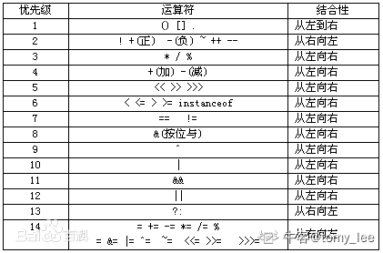

# 奇安信 2019 春招终端开发试题

## 1

表达式求值：2 << 1 + 2（）

正确答案: D   你的答案: 空 (错误)

```cpp
4
```

```cpp
6
```

```cpp
8
```

```cpp
16
```

本题知识点

Java 工程师 C++工程师 奇安信 2019 安卓工程师 iOS 工程师

讨论

[tomy_lee](https://www.nowcoder.com/profile/2041009)

先 1+2，然后 2<<3。得 16

发表于 2020-07-23 16:50:41

* * *

[Gripure](https://www.nowcoder.com/profile/988718352)

2 的二进制为 0000 0010，左移 3 位，为 0001 0000，十进制为 2⁴=16

发表于 2020-02-27 09:20:59

* * *

[Jay_Jay](https://www.nowcoder.com/profile/9895948)

<发表于 2020-02-21 20:55:29

* * *

## 2

这段代码最终结果输出是？（）

```cpp
int   g_total_cost;
int   g_book_price = 10;
int   g_num_books = 5;
void main() 
{
    g_total_cost = (g_book_price * g_num_books, g_total_cost);
    printf("%d\n", g_total_cost);
}
```

正确答案: A   你的答案: 空 (错误)

```cpp
0
```

```cpp
5
```

```cpp
15
```

```cpp
50
```

本题知识点

Java 工程师 C++工程师 奇安信 2019 安卓工程师 iOS 工程师

讨论

[Gripure](https://www.nowcoder.com/profile/988718352)

逗号表达式，以最后一个为准，所以为 0

发表于 2020-02-27 09:22:41

* * *

## 3

C 语言中指针变量占用多少字节存储空间？（）

正确答案: D   你的答案: 空 (错误)

```cpp
1
```

```cpp
4
```

```cpp
8
```

```cpp
不确定
```

本题知识点

Java 工程师 C++工程师 奇安信 2019 安卓工程师 iOS 工程师

讨论

[223s](https://www.nowcoder.com/profile/641616950)

根机器内存有关

发表于 2020-07-15 14:17:24

* * *

[三夭五先生](https://www.nowcoder.com/profile/805454495)

例如指针变量为 int 为 4 字节，为 char 型就为 1 字节

发表于 2020-03-05 18:20:36

* * *

## 4

下面这个结构体*T*S 的对象在栈上会占用多少字节的空间？（）

```cpp
#pragma pack(4)
typedef struct TS {
    char            a_char;
    unsigned int    a_int;
} T_S;
#pragma pack()
```

正确答案: C   你的答案: 空 (错误)

```cpp
1
```

```cpp
4
```

```cpp
8
```

```cpp
不确定
```

本题知识点

Java 工程师 C++工程师 奇安信 2019 安卓工程师 iOS 工程师

讨论

[tomy_lee](https://www.nowcoder.com/profile/2041009)

#pragma pack(n)来设定变量以 n 字节对齐方式。n 字节对齐就是说变量存放的起始地址的偏移量有两种情况：第一、如果 n 大于等于该变量所占用的字节数，那么偏移量必须满足默认的对齐方式，第二、如果 n 小于该变量的类型所占用的字节数，那么偏移量为 n 的倍数，不用满足默认的对齐方式。结构的总大小也有个约束条件，分下面两种情况：如果 n 大于所有成员变量类型所占用的字节数，那么结构的总大小必须为占用空间最大的变量占用的空间数的倍数；否则必须为 n 的倍数。复制自：[`blog.csdn.net/sweetfather/article/details/79771288`](https://blog.csdn.net/sweetfather/article/details/79771288)

发表于 2020-07-23 16:54:05

* * *

## 5

请选择下面代码的输出结果（）

```cpp
char g_string_digis[]="01234556789";
void main()
{
    printf("%d\n", sizeof(g_string_digis));
}
```

正确答案: C   你的答案: 空 (错误)

```cpp
10
```

```cpp
11
```

```cpp
12
```

```cpp
13
```

本题知识点

Java 工程师 C++工程师 奇安信 2019 安卓工程师 iOS 工程师

讨论

[牛客 248955670 号](https://www.nowcoder.com/profile/248955670)

C 语言会自动在在双引号""括起来的内容的末尾补上"\0"代表结束

发表于 2020-03-02 02:05:32

* * *

[顺哥 201908081431420](https://www.nowcoder.com/profile/61714407)

坑人啊，两个 5

发表于 2020-03-24 20:25:39

* * *

[223s](https://www.nowcoder.com/profile/641616950)

怎么搞两个 5，我吐了

发表于 2020-07-15 14:18:46

* * *

## 6

下列有关类继承的叙述中，错误的是（）

正确答案: D   你的答案: 空 (错误)

```cpp
继承可以实现软件复用
```

```cpp
虚基类可以解决由多继承产生的二义性问题
```

```cpp
派生类构造函数要负责调用基类的构造函数
```

```cpp
派生类没有继承基类的私有成员
```

本题知识点

Java 工程师 C++工程师 奇安信 2019 安卓工程师 iOS 工程师

讨论

[tomy_lee](https://www.nowcoder.com/profile/2041009)

c++会继承基类的私有成员，但不可见。Java 不会继承 

编辑于 2020-07-23 17:00:13

* * *

## 7

设 int a=1，b=2;，则(a++)+b 和 a+++b 这两个表达式的值分别为（）

正确答案: A   你的答案: 空 (错误)

```cpp
3，3
```

```cpp
3，4
```

```cpp
4，3
```

```cpp
4，4
```

本题知识点

Java 工程师 C++工程师 奇安信 2019 安卓工程师 iOS 工程师

讨论

[牛客 850558915 号](https://www.nowcoder.com/profile/850558915)

个人观点： (a++)+b a++ +b

发表于 2020-09-28 17:09:06

* * *

[烟火蛋糕](https://www.nowcoder.com/profile/393930852)

这题为啥选 A 啊，a++的值是 a，++b 的值是 b+1，应该选 B 才对吧

发表于 2020-09-12 09:37:09

* * *

[223s](https://www.nowcoder.com/profile/641616950)

运算符优先级问题，++，--优先级大于+，-

发表于 2020-07-15 14:19:38

* * *

## 8

下列关于 this 指针的描述中，正确的是（）

正确答案: D   你的答案: 空 (错误)

```cpp
类的成员函数都有 this 指针
```

```cpp
类的友元函数都有 this 指针
```

```cpp
任何与类相关的函数都有 this 指针
```

```cpp
类的非静态成员函数都有 this 指针
```

本题知识点

Java 工程师 C++工程师 奇安信 2019 安卓工程师 iOS 工程师

## 9

下列选项中属于函数指针的是（）

正确答案: B   你的答案: 空 (错误)

```cpp
(int *)p(int, int)
```

```cpp
int (*p)(int, int)
```

```cpp
int *p(int, int)
```

```cpp
都不是
```

本题知识点

Java 工程师 C++工程师 奇安信 2019 安卓工程师 iOS 工程师

## 10

以下为 Windows 下的 32 位 C++程序，请计算 sizeof 的值：（）

```cpp
      char str[] = "Hello";
      char *p = str;
      sizeof(str) = ?
      sizeof(p) = ?
```

正确答案: C   你的答案: 空 (错误)

```cpp
5，4
```

```cpp
6，6
```

```cpp
6，4
```

```cpp
5，5
```

本题知识点

Java 工程师 C++工程师 奇安信 2019 安卓工程师 iOS 工程师

讨论

[牛客 747601080 号](https://www.nowcoder.com/profile/747601080)

6，4

发表于 2021-01-16 13:07:38

* * *

## 11

这段代码的输出结果是？（）

```cpp
union _T_S {
    unsigned int        a_int;
    struct {
        unsigned int    a_bit_1:1;
        unsigned int    a_bit_2:1;
        unsigned int    a_bit_3:1;
        unsigned int    a_bit_4:1;
        unsigned int    a_bits:8;
    };
};
void main()
{
    union _T_S ts = {0};
    ts.a_bits = 8;
    printf("%d\n", ts.a_int);
}
```

正确答案: B   你的答案: 空 (错误)

```cpp
256
```

```cpp
128
```

```cpp
64
```

```cpp
8
```

本题知识点

Java 工程师 C++工程师 奇安信 2019 安卓工程师 iOS 工程师

讨论

[Gripure](https://www.nowcoder.com/profile/988718352)

PC 端小端存储，联合体和结构体共用低位 12 位，赋值改变了 4~8 位的值为 1000，所以联合体 32 为：0000 0000 0000 0000 0000 0000 1000 0000，十进制为 128。

发表于 2020-02-27 18:46:40

* * *

## 12

32 位操作系统下，以下代码                                              

```cpp
char str[]="Hello"；   
char* p=str；                                                                     
int n = strlen（p）                                                                  
```

请计算 sizeof（str）=1   sizeof（p）=2  sizeof(n)=3

你的答案 (错误)

123 参考答案 (1) 6
(2) 4
(3) 4

本题知识点

Java 工程师 C++工程师 奇安信 2019 安卓工程师 iOS 工程师

## 13

```cpp
int i =1；                                                                           
int inc(  ){ return ++i;}                                                           
void main(  )  {                                                                  
printf("%d,%d",inc(  ),inc(  )*inc(  )) ;                                     
}                                                                               
```

上述程序输出结果是 1

你的答案 (错误)

1 参考答案 (1) 4,6

本题知识点

Java 工程师 C++工程师 奇安信 2019 安卓工程师 iOS 工程师

## 14

对于 int *pa[5];的描述中,正确的是: （）

正确答案: D   你的答案: 空 (错误)

```cpp
pa 是一个指向数组的指针，所指向的数组是 5 个 int 型元素
```

```cpp
pa 是一个指向某数组中第 5 个元素的指针，该元素是 int 型变量
```

```cpp
pa[5]表示数组的第 5 个元素的值，是 int 型的值
```

```cpp
pa 是一个具有 5 个元素的指针数组，每个元素是一个 int 型指针
```

本题知识点

Java 工程师 C++工程师 奇安信 2019 安卓工程师 iOS 工程师

## 15

在 C++中执行以下 4 条语句后输出 rad 值为：（）

```cpp
static int hot=200； int &rad=hot； hot=hot+100； cout<<rad<<endl；
```

正确答案: C   你的答案: 空 (错误)

```cpp
0
```

```cpp
100
```

```cpp
300
```

```cpp
200
```

本题知识点

Java 工程师 C++工程师 奇安信 2019 安卓工程师 iOS 工程师

## 16

考虑函数原型 void test(int a,int b=7,char ch='*'),下面的函数调用中，属于不合法调用的是：（）

正确答案: C   你的答案: 空 (错误)

```cpp
test(5)
```

```cpp
test(5,8)
```

```cpp
test(6,"#")
```

```cpp
test(0,0,"*")
```

本题知识点

Java 工程师 C++工程师 奇安信 2019 安卓工程师 iOS 工程师

## 17

如何命令行解压一个 tar 压缩文件到当前目录，如 test.tar.gz。tar test.tar.gz 的参数是?（）

正确答案: D   你的答案: 空 (错误)

```cpp
ztvf 
```

```cpp
zcvf 
```

```cpp
xjvf 
```

```cpp
zxvf
```

本题知识点

Java 工程师 C++工程师 奇安信 2019 安卓工程师 iOS 工程师

## 18

假设文件 file 的内容只有两行：“abc“和”def”, “cat file | grep -v def” 的输出是?（）

正确答案: A   你的答案: 空 (错误)

```cpp
abc 
```

```cpp
def 
```

```cpp
abc def
```

```cpp
fed
```

```cpp
cba 
```

本题知识点

Java 工程师 C++工程师 奇安信 2019 安卓工程师 iOS 工程师

## 19

假设当前目录没有任何文件和子目录，需要创建 a 子目录，a 下创建 b 子目录。命令是？（）

正确答案: C   你的答案: 空 (错误)

```cpp
mkdir -c a/b
```

```cpp
mkdir -m a/b
```

```cpp
mkdir -p a/b
```

```cpp
mkdir -v a/b
```

本题知识点

Java 工程师 C++工程师 奇安信 2019 安卓工程师 iOS 工程师

## 20

linux 查看内存的命令有?（）

正确答案: C E   你的答案: 空 (错误)

```cpp
mm
```

```cpp
mstat
```

```cpp
top
```

```cpp
minfo
```

```cpp
free
```

本题知识点

Java 工程师 C++工程师 奇安信 2019 安卓工程师 iOS 工程师

## 21

用 top 命令查看哪些信息？（）

正确答案: A C D E   你的答案: 空 (错误)

```cpp
CPU 时间占用率
```

```cpp
CPU 数目
```

```cpp
总内存量
```

```cpp
空闲内存量
```

```cpp
系统运行时间
```

```cpp
系统的总用户数量
```

本题知识点

Java 工程师 C++工程师 奇安信 2019 安卓工程师 iOS 工程师

## 22

针对下面的"ls -l"的输出，我们可以得出哪些结论？（）

```cpp
"drwxr-xr-x 10 nobody users        4096 Nov 26  2016 file"
```

正确答案: B E   你的答案: 空 (错误)

```cpp
"file"是个文件
```

```cpp
"file"是个目标
```

```cpp
“file”占用了 4096 个数据块
```

```cpp
"file"的属主是 nobody，所以没有人可以改写或修改“file”
```

```cpp
nobody 所在有组是 users
```

```cpp
users 组的任何用户都可以改写“file”
```

本题知识点

Java 工程师 C++工程师 奇安信 2019 安卓工程师 iOS 工程师

## 23

下面哪些文件是 Linux 系统常用的配置文件？（）

正确答案: A C F   你的答案: 空 (错误)

```cpp
 /boot/grub/grub.cfg
```

```cpp
/bin/systemctl
```

```cpp
 /etc/shadow
```

```cpp
/local/fstab
```

```cpp
/proc/cpuinfo
```

```cpp
/var/spool/cron/crontabs/root
```

本题知识点

Java 工程师 C++工程师 奇安信 2019 安卓工程师 iOS 工程师

## 24

16GB 物理内存的服务器，以下 swap 分区的大小比较合适的有？（）

正确答案: C D   你的答案: 空 (错误)

```cpp
2
```

```cpp
4
```

```cpp
8
```

```cpp
16
```

本题知识点

Java 工程师 C++工程师 奇安信 2019 安卓工程师 iOS 工程师

## 25

linux 操作系统中，以下哪些模块不属于内核层？（）

正确答案: B E   你的答案: 空 (错误)

```cpp
进程调度
```

```cpp
shell 
```

```cpp
内存管理 
```

```cpp
文件系统
```

```cpp
图形系统
```

本题知识点

Java 工程师 C++工程师 奇安信 2019 安卓工程师 iOS 工程师

## 26

调用 Win32 函数 VirtualAlloc 分配内存块以保存数据，下面哪些标志位是必须要设置的？（）

正确答案: A D   你的答案: 空 (错误)

```cpp
MEM_COMMIT
```

```cpp
MEM_RESERVE
```

```cpp
PAGE_READONLY
```

```cpp
PAGE_READWRITE
```

```cpp
PAGE_EXECUTE
```

```cpp
PAGE_GUARD
```

本题知识点

C++工程师 奇安信 2019

## 27

针对 Win32 函数 CreateFile 的输入参数 dwCreationDisposition，下面的描述中哪些是正确的？（）

正确答案: B C E   你的答案: 空 (错误)

```cpp
CREATE_NEW：目标文件已经存在时其内容会被清空
```

```cpp
CREATE_NEW：目标文件不存在时会创建文件
```

```cpp
CREATE_ALWAYS：目标文件存在时其内容会被清空
```

```cpp
OPEN_ALWAYS： 目标文件不存时直接返回失败
```

```cpp
目标文件不存在时 OPEN_ALWAYS 和 CREATE_ALWAYS 的是一样的
```

本题知识点

Java 工程师 C++工程师 奇安信 2019 安卓工程师 iOS 工程师

## 28

在 windows 系统中，DLL（动态链接库）文件被隐式加载时，系统优先从以下哪个目录查找该 DLL 文件？（）

正确答案: B   你的答案: 空 (错误)

```cpp
Windows 的系统目录
```

```cpp
包含可执行文件的目录
```

```cpp
进程的当前目录
```

```cpp
Path 环境变量中所列出的目录
```

本题知识点

Java 工程师 C++工程师 奇安信 2019 安卓工程师 iOS 工程师

讨论

[漫漫长夜迢迢路](https://www.nowcoder.com/profile/842980172)

A

发表于 2020-08-28 14:36:48

* * *

## 29

有关 windows 系统的 DLL（动态链接库）,下列说法正确的是？（）

正确答案: A C D   你的答案: 空 (错误)

```cpp
DLL 文件是 PE 文件
```

```cpp
DLL 没有 x86 和 x64 之分
```

```cpp
DLL 可以扩展应用程序的特性
```

```cpp
DLL 有助于节省内存
```

```cpp
DLL 可以像 EXE 一样独立运行
```

本题知识点

Java 工程师 C++工程师 奇安信 2019 安卓工程师 iOS 工程师

## 30

下列哪些是 Windows 内核对象？（）

正确答案: A C D E   你的答案: 空 (错误)

```cpp
事件
```

```cpp
消息
```

```cpp
文件
```

```cpp
进程
```

```cpp
I/O 完成端口
```

```cpp
访问令牌
```

本题知识点

Java 工程师 C++工程师 奇安信 2019 安卓工程师 iOS 工程师