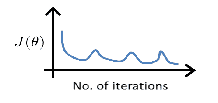
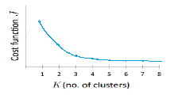

# 奇安信 2019 校招笔试题（二）

## 1

在 Web 系统中，使用（ ）来唯一标识和定位 Internet 中的资源

正确答案: C   你的答案: 空 (错误)

```cpp
域名
```

```cpp
IP 地址
```

```cpp
URL（统一资源定位符）
```

```cpp
MAC 地址
```

本题知识点

Java 工程师 C++工程师 前端工程师 安卓工程师 iOS 工程师 算法工程师 大数据开发工程师 运维工程师 安全工程师 奇安信 2019

## 2

以下关于 HTTP，描述错误的是（ ）

正确答案: D   你的答案: 空 (错误)

```cpp
HTTP 是一种面向对象的协议。
```

```cpp
HTTP 采用一次性连接策略，每次连接只处理一个请求。
```

```cpp
HTTP 是一种无状态的协议，服务器不保留与客户交易时的任何状态。
```

```cpp
HTTP 协议是一种基于 TCP 的传输层协议。
```

本题知识点

Java 工程师 C++工程师 前端工程师 安卓工程师 iOS 工程师 算法工程师 大数据开发工程师 运维工程师 安全工程师 奇安信 2019

讨论

[郫县男子计院](https://www.nowcoder.com/profile/328790495)

看走眼，Http 是应用层协议

发表于 2020-02-28 09:51:35

* * *

## 3

制作一个关于书籍的符号列表，且符号为实心的圆，下面正确的是（      ）

正确答案: A   你的答案: 空 (错误)

```cpp
list-style-type:disc;
```

```cpp
list-type:disc;
```

```cpp
list-style-type:circle;
```

```cpp
list-type:circle;
```

本题知识点

Java 工程师 C++工程师 前端工程师 安卓工程师 iOS 工程师 算法工程师 大数据开发工程师 运维工程师 安全工程师 奇安信 2019

讨论

[inMeTheTiger,](https://www.nowcoder.com/profile/489017124)

list-style： 把图像设置成列表中的列表项目前的标记。list-style-type: css 提供的属性，用来设置列表项的标记类型。none：无标记。disc： 默认，实心圆。square： 空心圆。decimal： 数字。

发表于 2020-08-15 20:06:20

* * *

## 4

网页中调用数据时，可使用的数据模板是（     ）

正确答案: C   你的答案: 空 (错误)

```cpp
gridlist
```

```cpp
rule
```

```cpp
datatemplate
```

```cpp
datelist
```

本题知识点

Java 工程师 C++工程师 前端工程师 安卓工程师 iOS 工程师 算法工程师 大数据开发工程师 运维工程师 安全工程师 奇安信 2019

## 5

若要给网页添加背景音乐，以下哪些元素可以实现（      ）

正确答案: A D   你的答案: 空 (错误)

```cpp
bgsound 
```

```cpp
music
```

```cpp
voicw
```

```cpp
audio
```

本题知识点

Java 工程师 C++工程师 前端工程师 安卓工程师 iOS 工程师 算法工程师 大数据开发工程师 运维工程师 安全工程师 奇安信 2019

## 6

若要做一个页面，用户可在某个区域内画自己想要的图形，怎样才能使用户描绘自己想要的图形（      ）

正确答案: B C   你的答案: 空 (错误)

```cpp

```

```cpp
SVG
```

```cpp
Canvas
```

```cpp
frame
```

本题知识点

Java 工程师 C++工程师 前端工程师 安卓工程师 iOS 工程师 算法工程师 大数据开发工程师 运维工程师 安全工程师 奇安信 2019

## 7

若想要将网页中用户登录的状态保存在客户端，以下哪种方式可用（      ）

正确答案: A B   你的答案: 空 (错误)

```cpp
 localStorage
```

```cpp
sessionStorage
```

```cpp
 file
```

```cpp
数据库
```

本题知识点

Java 工程师 C++工程师 前端工程师 安卓工程师 iOS 工程师 算法工程师 大数据开发工程师 运维工程师 安全工程师 奇安信 2019

## 8

在开发一个网页时，往往是需要先把整体的布局规划出来，如果要完成页面的整体布局框架，可使用哪些技术（      ）

正确答案: C D   你的答案: 空 (错误)

```cpp
i
```

```cpp
b
```

```cpp
table
```

```cpp
div
```

本题知识点

Java 工程师 C++工程师 前端工程师 安卓工程师 iOS 工程师 算法工程师 大数据开发工程师 运维工程师 安全工程师 奇安信 2019

## 9

在一个新闻页面中存放了大量的新闻数据，需要将这些数据逐条显示出来，要如何实现（     ）

正确答案: A B C D   你的答案: 空 (错误)

```cpp
<ul>
    <li>html5 数据更新</li>
    <li>插件已全部更新</li>
    <li>弹性盒子的使用方法</li>
</ul>

```

```cpp
<dl>
    <dt></dt>
    <dd>html5 数据更新</dd>
    <dd>插件已全部更新</dd>
    <dd>弹性盒子的使用方法</dd>
</dl>

```

```cpp
<ol>
    <li>html5 数据更新</li>
    <li>插件已全部更新</li>
    <li>弹性盒子的使用方法</li>
</ol>

```

```cpp
<dl>
    <dd>html5 数据更新</dd>
    <dd>插件已全部更新</dd>
    <dd>弹性盒子的使用方法</dd>
</dl>

```

本题知识点

Java 工程师 C++工程师 前端工程师 安卓工程师 iOS 工程师 算法工程师 大数据开发工程师 运维工程师 安全工程师 奇安信 2019

## 10

在网页中有一组数据列表，点击每个数据都会跳转到另外一个页面，怎样才能实现这些数据的页面跳转（      ）

正确答案: A D   你的答案: 空 (错误)

```cpp
<ul>
    <li><a href=''>内容</a></li>
    <li><a href=''>内容</a></li>
</ul>

```

```cpp
 <li onClick="">内容</li>
 <li onClick="">内容</li>

```

```cpp
<ul>
 <li>内容</li>
 <li>内容</li>
</ul>

```

```cpp
<ul>
 <li onClick="">内容</li>
 <li onClick="">内容</li>
</ul>

```

本题知识点

Java 工程师 C++工程师 前端工程师 安卓工程师 iOS 工程师 算法工程师 大数据开发工程师 运维工程师 安全工程师 奇安信 2019

## 11

在 CSS3 中，如何使用弹性盒子的原理使元素行显示（      ）

正确答案: C   你的答案: 空 (错误)

```cpp
<style type="text/css">
.main{
  -webkit-box-orient:horizonal;
  }
</style>

```

```cpp
<style type="text/css">
 .main{
  display:-webkit-border;
  }
</style>

```

```cpp
<style type="text/css">
.main{
  display:-webkit-box;
  -webkit-box-orient:horizonal;
  }
</style>

```

```cpp
<style type="text/css">
 .main{
  -webkit-box-flex:left;
  }
</style>

```

本题知识点

Java 工程师 C++工程师 前端工程师 安卓工程师 iOS 工程师 算法工程师 大数据开发工程师 运维工程师 安全工程师 奇安信 2019

## 12

若要使页面中的某个按钮元素始终在浏览器底部显示，以下正确的是（      ）

正确答案: A   你的答案: 空 (错误)

```cpp
<style type="text/css">
  .sub{
     position: fixed;
     bottom: 1em;
         }
 </style>

```

```cpp
<style type="text/css">
  .sub{
     position: absolute;
         }
 </style>

```

```cpp
<style type="text/css">
 .sub{
   position: relative;
   bottom:1em;
         }
 </style>

```

```cpp
<style type="text/css">
 .sub{
   position: relative;
         }
 </style>

```

本题知识点

Java 工程师 C++工程师 前端工程师 安卓工程师 iOS 工程师 算法工程师 大数据开发工程师 运维工程师 安全工程师 奇安信 2019

## 13

在写一个登陆页面的时候，要求所有的元素都在页面的左边来显示，并且元素距离页面边框有一定的距离，怎么来做（      ）

正确答案: C   你的答案: 空 (错误)

```cpp
text-align: left;
padding:2em;

```

```cpp
align: left;
margin:2em;

```

```cpp
text-align: left;
margin:2em;

```

```cpp
align: left;
padding:2em;

```

本题知识点

Java 工程师 C++工程师 前端工程师 安卓工程师 iOS 工程师 算法工程师 大数据开发工程师 运维工程师 安全工程师 奇安信 2019

## 14

在做移动开发时，在页面上插入一张图片，要求使这张图片的宽度和高度完全适应内容区域，怎样来实现（      ）

正确答案: A   你的答案: 空 (错误)

```cpp
background-repeat:no-repeat;
background-size:contain;
background-position:center;

```

```cpp
background-repeat:repeat-X;
background-size:contain;
background-position:center;

```

```cpp
background-repeat:repeat;
background-size:contain;
background-position:center;

```

```cpp
background-repeat:repeat-Y;
background-size:contain;
background-position:center;

```

本题知识点

Java 工程师 C++工程师 前端工程师 安卓工程师 iOS 工程师 算法工程师 大数据开发工程师 运维工程师 安全工程师 奇安信 2019

讨论

[安卓菜鸡](https://www.nowcoder.com/profile/414120529)

。。

发表于 2021-11-29 17:51:40

* * *

## 15

页面上分别有“提交”、“重置”，“取消”三个按钮，若想让这三个按钮在一行显示，每个按钮的四个角都是有弧度的，并且每个按钮之间要有空间隔开，该如何实现（      ）

正确答案: A B   你的答案: 空 (错误)

```cpp
float:left;
border-radius:5px;
border: #0C9 1px solid; 
margin:1em;

```

```cpp
float:right;
border-radius:5px;
border: #0C9 1px solid; 
margin:1em;
padding:1em;

```

```cpp
border-radius:5px;
border: #0C9 1px solid; 
margin:1em;

```

```cpp
float:left;
border-radius:5px;
border: #0C9 1px solid; 
padding:1em

```

本题知识点

Java 工程师 C++工程师 前端工程师 安卓工程师 iOS 工程师 算法工程师 大数据开发工程师 运维工程师 安全工程师 奇安信 2019

## 16

假如在开发中，要使表格表头单元格的内容居中显示，其他表格内容靠左显示，并且表头单元格的内容加粗显示，正确的作法是（      ）

正确答案: A D   你的答案: 空 (错误)

```cpp
table tr th{
   text-align:center;
   font-weight:bold;
}
table tr td{
   text-align:left;
}

```

```cpp
th{
   text-align:center;
   text-weight:bold;
}
td{
   text-align:left;
}

```

```cpp
table tr th{
   text-align:center;
   text-weight:bold;
}
table tr td{
   text-align:left;
}

```

```cpp
th{
   text-align:center;
   font-weight:bold;
}
td{
   text-align:left;
}

```

本题知识点

Java 工程师 C++工程师 前端工程师 安卓工程师 iOS 工程师 算法工程师 大数据开发工程师 运维工程师 安全工程师 奇安信 2019

## 17

在做移动开发时，不同的屏幕像素不同，为了时页面中的元素能够适应屏幕，给页面中的元素设定一个最小的宽度和高度，这样，即使屏幕发生改变，元素总会显示成所设置的最小的大小，这样的需求要怎么实现（      ）

正确答案: A B   你的答案: 空 (错误)

```cpp
min-width:6em;
min-height: 2em;

```

```cpp
min-width: 120px;
min-height: 38px;

```

```cpp
width: 2em;
height: 2em;

```

```cpp
width: 120px;
height: 38px;

```

本题知识点

Java 工程师 C++工程师 前端工程师 安卓工程师 iOS 工程师 算法工程师 大数据开发工程师 运维工程师 安全工程师 奇安信 2019

## 18

若要设置盒子距离左右边框有一定的大小，盒子内的内容居中显示，该要如何实现（      ）

正确答案: C D   你的答案: 空 (错误)

```cpp
padding:12px;
-webkit-box-pack:center;
webkit-box-align:center;

```

```cpp
padding：0 1.5em;
-webkit-box-pack:center;
webkit-box-align:center;

```

```cpp
margin：0 1.5em;
-webkit-box-pack:center;
webkit-box-align:center;

```

```cpp
margin：0 12px;
-webkit-box-pack:center;
webkit-box-align:center;

```

本题知识点

Java 工程师 C++工程师 前端工程师 安卓工程师 iOS 工程师 算法工程师 大数据开发工程师 运维工程师 安全工程师 奇安信 2019

## 19

在单例模式中，具有哪些特点（      ）

正确答案: A C D   你的答案: 空 (错误)

```cpp
类只能有一个实例
```

```cpp
类至少有一个实例
```

```cpp
只能通过全局的一个入口点对实例对象进行访问
```

```cpp
必须自行创建对象
```

本题知识点

Java 工程师 C++工程师 前端工程师 安卓工程师 iOS 工程师 算法工程师 大数据开发工程师 运维工程师 安全工程师 奇安信 2019

## 20

下列关于@property 属性 readwrite 与 readonly 说法正确的是（      ）

正确答案: A C D   你的答案: 空 (错误)

```cpp
readonly 只生成 getter 不会有 setter 方法
```

```cpp
readwrite 只生成 getter 不会有 setter 方法
```

```cpp
默认情况下为 readwrite
```

```cpp
readwrite 会自动生成存取器
```

本题知识点

Java 工程师 C++工程师 前端工程师 安卓工程师 iOS 工程师 算法工程师 大数据开发工程师 运维工程师 安全工程师 奇安信 2019

## 21

@private、@protected 和@public 三者的区别是（      ）

正确答案: A B C   你的答案: 空 (错误)

```cpp
@private 实例变量只能被声明它的类访问
```

```cpp
@protected 实例变量能被声明它的类和子类访问
```

```cpp
@public 实例变量可以被在任何地方访问
```

```cpp
没有显式制定范围的实例变量都是@package
```

本题知识点

Java 工程师 C++工程师 前端工程师 安卓工程师 iOS 工程师 算法工程师 大数据开发工程师 运维工程师 安全工程师 奇安信 2019

讨论

[牛客 134720814 号](https://www.nowcoder.com/profile/134720814)

```cpp
没有显式制定范围的实例变量都是@protected
```

发表于 2020-08-01 11:50:54

* * *

## 22

下列说法中正确的是（      ）

正确答案: B D   你的答案: 空 (错误)

```cpp
Objective-C 支持多重继承
```

```cpp
Objective-C 中的类可以实现多个接口
```

```cpp
@class 用于注入对象
```

```cpp
协议里的方法默认是必须实现的
```

本题知识点

Java 工程师 C++工程师 前端工程师 安卓工程师 iOS 工程师 算法工程师 大数据开发工程师 运维工程师 安全工程师 奇安信 2019

## 23

在 OC 中，使用 Category 时应注意（      ）

正确答案: A C D   你的答案: 空 (错误)

```cpp
Category 只能增加方法
```

```cpp
Category 可以增加方法和成员变量
```

```cpp
在 Category 方法的实现中可以访问原来类中的成员变量
```

```cpp
Category 中可以覆盖原来类中的方法
```

本题知识点

Java 工程师 C++工程师 前端工程师 安卓工程师 iOS 工程师 算法工程师 大数据开发工程师 运维工程师 安全工程师 奇安信 2019

讨论

[带风的少年](https://www.nowcoder.com/profile/153953300)

我前端到这就蒙蔽了

发表于 2020-03-27 01:55:10

* * *

[牛客 855538120 号](https://www.nowcoder.com/profile/855538120)

<p>ACD</p>

编辑于 2020-06-11 21:05:35

* * *

## 24

plist 文件能够存储哪些类型的数据（      ）

正确答案: A B C D   你的答案: 空 (错误)

```cpp
NSString
```

```cpp
NSArray
```

```cpp
NSDictionary
```

```cpp
NSNumber
```

本题知识点

Java 工程师 C++工程师 前端工程师 安卓工程师 iOS 工程师 算法工程师 大数据开发工程师 运维工程师 安全工程师 奇安信 2019

## 25

```cpp
NSDictionary *dict = [NSDictionary dictionaryWithObject:@"a value" forKey:@"aKey"];
NSLog(@"%@",[dict objectForKey:@"aKey"]);
[dict release];
```

控制台中打印的最后一条信息会是：（）

正确答案: C   你的答案: 空 (错误)

```cpp
a value
```

```cpp
aKey : a value
```

```cpp
崩溃信息
```

```cpp
a value : aKey
```

本题知识点

Java 工程师 C++工程师 前端工程师 安卓工程师 iOS 工程师 算法工程师 大数据开发工程师 运维工程师 安全工程师 奇安信 2019

## 26

下面程序段的输出结果是什么：（）

```cpp
NSMutableArray * arr1 = [[NSMutableArray alloc] initWithObjects:@"1",@"2",@"3", nil];
[arr1 addObject:@"0"];
[arr1 replaceObjectAtIndex:2 withObject:@"3"];
NSLog(@"%@",arr1);
```

正确答案: B   你的答案: 空 (错误)

```cpp
0,1,2,3
```

```cpp
1,2,3,0
```

```cpp
1,3,3,0
```

```cpp
0,3,2,3
```

本题知识点

Java 工程师 C++工程师 前端工程师 安卓工程师 iOS 工程师 算法工程师 大数据开发工程师 运维工程师 安全工程师 奇安信 2019

## 27

（      ）是通过不断对系统进行加压，以测试系统在超负荷环境下是否可以正常运行

正确答案: B   你的答案: 空 (错误)

```cpp
性能测试
```

```cpp
负载测试
```

```cpp
压力测试
```

```cpp
配置测试
```

本题知识点

Java 工程师 C++工程师 前端工程师 安卓工程师 iOS 工程师 算法工程师 大数据开发工程师 运维工程师 安全工程师 奇安信 2019

## 28

以下有关软件测试中路径测试的说法，错误的是（ ）。

正确答案: D   你的答案: 空 (错误)

```cpp
路径测试是整个测试的柱石，是结构测试之一
```

```cpp
穷举路径测试是不可能完成的
```

```cpp
在研究路径测试时，通常使用程序控制流图代替程序框图
```

```cpp
为了达到完全覆盖，路径选择时应尽量选择复杂的路径代替简单的路径
```

本题知识点

Java 工程师 C++工程师 前端工程师 安卓工程师 iOS 工程师 算法工程师 大数据开发工程师 运维工程师 安全工程师 奇安信 2019

讨论

[珠猪飞啊飞](https://www.nowcoder.com/profile/5393338)

能解析下为什么选 d 吗

发表于 2020-03-17 09:12:22

* * *

[higirl2020](https://www.nowcoder.com/profile/376457331)

D

发表于 2020-03-15 22:24:28

* * *

## 29

某公司现正研发一套教务信息管理系统。该系统中有一项子功能即实现学期考试成绩信息的录入。按用户的要求，成绩输入的取值范围是 0~100。现该公司决定用黑盒测试中的等价类划分法来对成绩进行测试。选择比较合理的一项。（）

正确答案: A   你的答案: 空 (错误)

```cpp
有效等等价类：① 60
无效等价类：② -20；③ 150

```

```cpp
有效等等价类① 45
无效等价类② -10

```

```cpp
有效等等价类① 70
无效等价类② 110；③ 180

```

```cpp
有效等等价类① 30
无效等价类② -10； ③ -150

```

本题知识点

Java 工程师 C++工程师 前端工程师 安卓工程师 iOS 工程师 算法工程师 大数据开发工程师 运维工程师 安全工程师 奇安信 2019

## 30

假定一个系统包括 6 个模块（ABCDEF），其中 B、C、D 是 A 的子模块，E 是 B 的子模块、F 是 D 的子模块,采用由底向上渐增式测试时共需准备（      ）个驱动模块，（     ）个桩模块。

正确答案: B   你的答案: 空 (错误)

```cpp
0 0
```

```cpp
5 0
```

```cpp
5 5
```

```cpp
0 5
```

本题知识点

Java 工程师 C++工程师 前端工程师 安卓工程师 iOS 工程师 算法工程师 大数据开发工程师 运维工程师 安全工程师 奇安信 2019

## 31

在软件测试的（      ）模型中，可能会导致前期需求分析产生错误直到验收测试阶段才能发现

正确答案: A   你的答案: 空 (错误)

```cpp
V
```

```cpp
W
```

```cpp
X
```

```cpp
H
```

本题知识点

Java 工程师 C++工程师 前端工程师 安卓工程师 iOS 工程师 算法工程师 大数据开发工程师 运维工程师 安全工程师 奇安信 2019

讨论

[吃个屁还要打个嗝](https://www.nowcoder.com/profile/627655972)

V

发表于 2020-04-07 16:28:40

* * *

[higirl2020](https://www.nowcoder.com/profile/376457331)

V

发表于 2020-03-15 22:23:07

* * *

## 32

对函数 foo 进行测试，要求满足语句覆盖 100%，至少需要（      ）个测试用例

```cpp
void foo(int a, int b)
{      
    if(a>1)  b= b/a;
    if((a==2) ||(b>1)) b=b+1; 
    return ;
}
```

正确答案: A   你的答案: 空 (错误)

```cpp
1
```

```cpp
2
```

```cpp
3
```

```cpp
4
```

本题知识点

Java 工程师 C++工程师 前端工程师 安卓工程师 iOS 工程师 算法工程师 大数据开发工程师 运维工程师 安全工程师 奇安信 2019

讨论

[牛客 726292042 号](https://www.nowcoder.com/profile/726292042)

1 个  a=2

编辑于 2020-04-18 15:00:23

* * *

[维修太阳](https://www.nowcoder.com/profile/948862214)

C

发表于 2020-03-18 23:42:34

* * *

[higirl2020](https://www.nowcoder.com/profile/376457331)

2

发表于 2020-03-15 22:20:34

* * *

## 33

在软件测试阶段，可以采用哪些策略进行单元测试（      ）

正确答案: A B C D   你的答案: 空 (错误)

```cpp
逻辑覆盖
```

```cpp
代码评审
```

```cpp
同行评审
```

```cpp
循环覆盖
```

本题知识点

Java 工程师 C++工程师 前端工程师 安卓工程师 iOS 工程师 算法工程师 大数据开发工程师 运维工程师 安全工程师 奇安信 2019

讨论

[福大馨](https://www.nowcoder.com/profile/651222)

B，软件测试中，同行评审是用来检验软件开发，软件评测各阶段的工作是否齐全，规范，各阶段产品是否达到了规定的技术要求和质量要求，以决定是否可以转入下一阶段的工作。

发表于 2020-11-22 10:47:04

* * *

[higirl2020](https://www.nowcoder.com/profile/376457331)

abcd

发表于 2020-03-15 22:18:53

* * *

## 34

关于自顶向下集成的叙述中正确有（      ）

正确答案: A B   你的答案: 空 (错误)

```cpp
所有被主程序调用的下层单元都作为桩出现
```

```cpp
能够在早期对主要控制或关键抉择进行验证
```

```cpp
驱动的开发工作量大
```

```cpp
可以较早地验证底层组件
```

本题知识点

Java 工程师 C++工程师 前端工程师 安卓工程师 iOS 工程师 算法工程师 大数据开发工程师 运维工程师 安全工程师 奇安信 2019

## 35

在软件测试的 W 模型，具有哪些特点（      ）

正确答案: A C D   你的答案: 空 (错误)

```cpp
软件测试过程与软件开发同步进行
```

```cpp
软件测试过程是一个独立的流程
```

```cpp
程序、需求、功能和设计都作为测试的对象
```

```cpp
无法支持迭代、自发性以及变更调整
```

本题知识点

Java 工程师 C++工程师 前端工程师 安卓工程师 iOS 工程师 算法工程师 大数据开发工程师 运维工程师 安全工程师 奇安信 2019

讨论

[higirl2020](https://www.nowcoder.com/profile/376457331)

Ac

发表于 2020-03-15 22:16:51

* * *

## 36

某公司在新开发的系统中使用了第三方组件（但只有接口，无法获得源代码），则不应采用（  ）方法对组件进行测试。

正确答案: A B C   你的答案: 空 (错误)

```cpp
基本路径覆盖
```

```cpp
分支覆盖
```

```cpp
环路覆盖
```

```cpp
黑盒测试
```

本题知识点

Java 工程师 C++工程师 前端工程师 安卓工程师 iOS 工程师 算法工程师 大数据开发工程师 运维工程师 安全工程师 奇安信 2019

## 37

某公司使用缺陷探测率(DDP) 来衡量测试工作效率，对缺陷探测率正确的理解是：（     ）

正确答案: A B   你的答案: 空 (错误)

```cpp
测试者发现的错误越多，发布后客户发现的错误就越少，缺陷探测率越高。
```

```cpp
客户方发现并反馈技术支持人员进行修复的 Bugs 数目越多，缺陷探测率越低。
```

```cpp
测试周期越长，缺陷探测率越高。
```

```cpp
客户方发现并反馈技术支持人员进行修复的 Bugs 数目越多，缺陷探测率越高。
```

本题知识点

Java 工程师 C++工程师 前端工程师 安卓工程师 iOS 工程师 算法工程师 大数据开发工程师 运维工程师 安全工程师 奇安信 2019

讨论

[higirl2020](https://www.nowcoder.com/profile/376457331)

B

发表于 2020-03-15 22:13:14

* * *

## 38

在对数据库进行测试评审时，关键要重视数据库的完整性，也就是达到以下标准（      ）

正确答案: A C   你的答案: 空 (错误)

```cpp
实体完整性、参照完整性、用户定义完整性
```

```cpp
实体完整性、属性完整性、参照完整性
```

```cpp
主键唯一、表与表之间的主外键关系完整、属性约束完整性
```

```cpp
实体完整性、用户定义完整性、关系完整性
```

本题知识点

Java 工程师 C++工程师 前端工程师 安卓工程师 iOS 工程师 算法工程师 大数据开发工程师 运维工程师 安全工程师 奇安信 2019

讨论

[higirl2020](https://www.nowcoder.com/profile/376457331)

C

发表于 2020-03-15 22:11:05

* * *

## 39

给定两个对象，分别用元组表示 A（0,1,1.1）,B（0,0,0,0），那么 A 和 B 之间的汉明距离为（      ）

正确答案: C   你的答案: 空 (错误)

```cpp
1
```

```cpp
2
```

```cpp
3
```

```cpp
4
```

本题知识点

Java 工程师 C++工程师 前端工程师 安卓工程师 iOS 工程师 算法工程师 大数据开发工程师 运维工程师 安全工程师 奇安信 2019

讨论

[郫县男子计院](https://www.nowcoder.com/profile/328790495)

对两个字符串进行异或运算，并统计结果为 1 的个数，那么这个数就是汉明距离

发表于 2020-02-28 09:56:03

* * *

## 40

下面关于 Jarvis－Patrick（JP）聚类算法的说法不正确的是（     ）

正确答案: D   你的答案: 空 (错误)

```cpp
JP 聚类擅长处理噪声和离群点，并且能够处理不同大小、形状和密度的簇
```

```cpp
JP 算法对高维数据效果良好，尤其擅长发现强相关对象的紧致簇
```

```cpp
JP 聚类是基于 SNN 相似度的概念
```

```cpp
JP 聚类的基本时间复杂度为 O(m)
```

本题知识点

Java 工程师 C++工程师 前端工程师 安卓工程师 iOS 工程师 算法工程师 大数据开发工程师 运维工程师 安全工程师 奇安信 2019

## 41

贝叶斯分类器是一种（      ）

正确答案: A C   你的答案: 空 (错误)

```cpp
基于贝叶斯公式的分类器
```

```cpp
是一种无监督的学习
```

```cpp
是一种概率预测模型
```

```cpp
可处理小样本数据的方法
```

本题知识点

Java 工程师 C++工程师 前端工程师 安卓工程师 iOS 工程师 算法工程师 大数据开发工程师 运维工程师 安全工程师 奇安信 2019

## 42

下面选项中 t 是 s 的子序列的是（）

正确答案: A B C D   你的答案: 空 (错误)

```cpp
s=<{2,4},{3,5,6},{8}> t=<{2},{3,6},{8}>
```

```cpp
s=<{2,4},{3,5,6},{8}> t=<{2},{8}>
```

```cpp
s=<{1,2},{3,4}> t=<{1},{3}>
```

```cpp
s=<{2,4},{2,4}> t=<{2},{4}>
```

本题知识点

Java 工程师 C++工程师 前端工程师 安卓工程师 iOS 工程师 算法工程师 大数据开发工程师 运维工程师 安全工程师 奇安信 2019

## 43

不是通过聚集多个分类器的预测来提高分类准确率的技术是（）

正确答案: B C D   你的答案: 空 (错误)

```cpp
组合
```

```cpp
聚集
```

```cpp
合并
```

```cpp
投票
```

本题知识点

Java 工程师 C++工程师 前端工程师 安卓工程师 iOS 工程师 算法工程师 大数据开发工程师 运维工程师 安全工程师 奇安信 2019

## 44

BP 算法具有哪些特点（      ）

正确答案: A B C   你的答案: 空 (错误)

```cpp
易形成局部极小
```

```cpp
迭代次数多
```

```cpp
收敛速度慢
```

```cpp
能够得到整体最优
```

本题知识点

Java 工程师 C++工程师 前端工程师 安卓工程师 iOS 工程师 算法工程师 大数据开发工程师 运维工程师 安全工程师 奇安信 2019

## 45

以下属于智能优化算法的是（      ）

正确答案: A C D   你的答案: 空 (错误)

```cpp
模拟退火算法
```

```cpp
EM 算法
```

```cpp
遗传算法
```

```cpp
蚁群算法
```

本题知识点

Java 工程师 C++工程师 前端工程师 安卓工程师 iOS 工程师 算法工程师 大数据开发工程师 运维工程师 安全工程师 奇安信 2019

## 46

目前处理非均衡数据的层面集中在哪几个方面？（      ）

正确答案: A B C D   你的答案: 空 (错误)

```cpp
预处理
```

```cpp
代价敏感学习
```

```cpp
集成学习
```

```cpp
改进传统机器学习算法
```

本题知识点

Java 工程师 C++工程师 前端工程师 安卓工程师 iOS 工程师 算法工程师 大数据开发工程师 运维工程师 安全工程师 奇安信 2019

## 47

使用 Eclipse 集成开发环境的 CDT 调试器可是让用户通过设置断点、暂停和（      ）的方法来控制程序的运行过程。

正确答案: B   你的答案: 空 (错误)

```cpp
搜索
```

```cpp
单步执行代码
```

```cpp
过程管理
```

```cpp
其他选项都不正确
```

本题知识点

Java 工程师 C++工程师 前端工程师 安卓工程师 iOS 工程师 算法工程师 大数据开发工程师 运维工程师 安全工程师 奇安信 2019

## 48

Eclipse 集成开发环境的插件中，下来标签中能够提供 plug-in id 的是（      ）。

正确答案: C   你的答案: 空 (错误)

```cpp
runtime 
```

```cpp
requires
```

```cpp
plugin 
```

```cpp
workspace
```

本题知识点

Java 工程师 C++工程师 前端工程师 安卓工程师 iOS 工程师 算法工程师 大数据开发工程师 运维工程师 安全工程师 奇安信 2019

## 49

使用 cc 或者 gcc 编辑器在调试 C/C++程序时，使用（      ）参数可以看见程序的函数名、变量名。

正确答案: A   你的答案: 空 (错误)

```cpp
-g
```

```cpp
-a
```

```cpp
-t
```

```cpp
-l
```

本题知识点

Java 工程师 C++工程师 前端工程师 安卓工程师 iOS 工程师 算法工程师 大数据开发工程师 运维工程师 安全工程师 奇安信 2019

## 50

在 linux 下使用 GDB 调试程序，若没有输入全命令，可以通过（      ）方式补全命令。

正确答案: B   你的答案: 空 (错误)

```cpp
单击 tab 键
```

```cpp
双击 tab 键
```

```cpp
单击 alt+tab
```

```cpp
单击 ctrl+tab
```

本题知识点

Java 工程师 C++工程师 前端工程师 安卓工程师 iOS 工程师 算法工程师 大数据开发工程师 运维工程师 安全工程师 奇安信 2019

## 51

唯一约束（UNIQUE）用来保证一列（或一组列）中的数据是唯一的，类似于主键。以下关于唯一性约束描述正确的是：(  )

正确答案: C   你的答案: 空 (错误)

```cpp
表中任意两行在指定列上都不允许有相同的值，不允许空（NULL）
```

```cpp
唯一约束列不可修改或更新
```

```cpp
表可包含多个唯一约束，但每个表只允许一个主键
```

```cpp
唯一约束可以用来定义外键
```

本题知识点

Java 工程师 C++工程师 前端工程师 安卓工程师 iOS 工程师 算法工程师 大数据开发工程师 运维工程师 安全工程师 奇安信 2019

## 52

设在关系模式 R(A,B,C,D,E)中，满足表达式σ2>'5'(R)相应的 SQL 查询表达式是：（      ）

正确答案: C   你的答案: 空 (错误)

```cpp
select * from R where E>'5' 
```

```cpp
select * from R where C>'5'
```

```cpp
select * from R where B>'5'
```

```cpp
select * from R where E<'2'
```

本题知识点

Java 工程师 C++工程师 前端工程师 安卓工程师 iOS 工程师 算法工程师 大数据开发工程师 运维工程师 安全工程师 奇安信 2019

## 53

社区住户管理系统中有两张表中都存储了住户的电话，在住户的电话发生改变时，如果只更新了一张表中的数据，那么这两张表中就有了不一致的数据。以下那个是产生数据不一致的根本原因：(  )

正确答案: D   你的答案: 空 (错误)

```cpp
未对数据进行完整性控制
```

```cpp
数据存储量太大
```

```cpp
没有严格保护数据
```

```cpp
数据冗余
```

本题知识点

Java 工程师 C++工程师 前端工程师 安卓工程师 iOS 工程师 算法工程师 大数据开发工程师 运维工程师 安全工程师 奇安信 2019

## 54

设有两个事务 T1、T2，对数据 B 的并发操作如下所示：

```cpp
    步骤                 T1                        T2
    1                   R(A)=50
                       R(B) =100
                       求和=150 
    2                                          R(B) =10
                                               B←B*2
                                               (B) =200
    3                  R(A)=50
                      R(B) =200
                      和=250
```

下列说法中正确的是：（      ）
 正确答案: A   你的答案: 空 (错误)

```cpp
该操作不可重复读
```

```cpp
该操作不存在问题
```

```cpp
该操作读"脏"数据
```

```cpp
该操作丢失修改
```

本题知识点

Java 工程师 C++工程师 前端工程师 安卓工程师 iOS 工程师 算法工程师 大数据开发工程师 运维工程师 安全工程师 奇安信 2019

## 55

在分析学校资产管理系统 ER 图时，发现共有 25 个不同实体类型，在这些实体类型之间存在着 18 个不同的二元联系(指两个实体之间的联系)其中 12 个是 1:n 联系，6 个是 m:n 联系，还存在 2 个 m:n 的三元联系，那么这个 ER 结构转换成的关系模型个数正确的是：（      ） 

正确答案: C   你的答案: 空 (错误)

```cpp
43
```

```cpp
37
```

```cpp
33
```

```cpp
31
```

本题知识点

Java 工程师 C++工程师 前端工程师 安卓工程师 iOS 工程师 算法工程师 大数据开发工程师 运维工程师 安全工程师 奇安信 2019

## 56

雇员表 EMP 和部门表 DEPT 结构如下：
雇员表 EMP
(  雇员编号 EMPNO ,   姓名 ENAME ,
  工作岗位 JOB ,  领导编号 MGR ,
  受雇时间 HIREDATE ,  工资 SAL ,
  奖金 COMM ,  部门编号 DEPTNO );
部门表 DEPT
（ 部门编号 DEPTNO，所在部门名称 DNAME，
    位置 LOC );
下列操作语句正确的是：（      ）

正确答案: A B C D   你的答案: 空 (错误)

```cpp
查询雇员姓名、雇员工资、所在部门名称、领导姓名、领导工资
语句：SELECT E.ENAME,E.SAL,D.DNAME,M.ENAME,M.SAL
FROM EMP E,EMP M,DEPT D
WHERE E.MGR=M.EMPNO AND E.DEPTNO=D.DEPTNO;

```

```cpp
查询雇员姓名、雇员工资、所在部门名称、领导姓名、领导工资、领导所在部门
语句：SELECT  E.ENAME 雇员姓名,E.SAL 雇员工资,D.DNAME 所在部门,M.ENAME 领导姓名,M.SAL 领导工资,MD.DNAME 领导所在部门
FROM EMP E, EMP M, DEPT D,DEPT MD
WHERE  E.MGR=M.EMPNO AND E.DEPTNO=D.DEPTNO AND M.DEPTNO=MD.DEPTNO;

```

```cpp
列出至少有 4 个员工的部门名称
语句：SELECT D.DNAME,COUNT(E.EMPNO)
FROM EMP E,DEPT D
WHERE E.DEPTNO=D.DEPTNO
GROUP BY D.DNAME
HAVING COUNT(E.EMPNO)>4;

```

```cpp
列出受雇日期早于其直接上级领导的所有员工的编号、姓名、部门名称
语句：SELECT E.EMPNO,E.ENAME,D.DNAME
FROM EMP E,EMP M ,DEPT D
WHERE E.MGR=M.EMPNO AND E.DEPTNO=D.DEPTNO AND E.HIREDATE <M.HIREDATE;

```

本题知识点

Java 工程师 C++工程师 前端工程师 安卓工程师 iOS 工程师 算法工程师 大数据开发工程师 运维工程师 安全工程师 奇安信 2019

## 57

大学生春季运动会的数据库，保存了比赛信息的三个表如下：

```cpp
运动员 sporter（运动员编号 sporterid，姓名 name，性别 sex，所属系号 department），
项目 item（项目编号 itemid，名称 itemname，比赛地点 location）， 
成绩 grade（运动员编号 id，项目编号 itemid，积分 mark）。
```

经查李四因为作弊，其成绩都记 0 分，请在数据库中作出相应修改。下列操作语句正确的是：（   ）
 正确答案: A B D   你的答案: 空 (错误)

```cpp
UPDATE grade SET mark=0
WHERE sporterid = (
         SELECT sporterid
         FROM sporter
         WHERE name='李四') ;

```

```cpp
UPDATE grade SET mark=0
WHERE sporterid in (
         SELECT sporterid
         FROM sporter
         WHERE name='李四') ;

```

```cpp
UPDATE grade SET mark=0
WHERE sporterid exists (
         SELECT sporterid
         FROM sporter
         WHERE name='李四') ;

```

```cpp
UPDATE grade SET mark=0
WHERE exists (
         SELECT sporterid
         FROM sporter
         WHERE name='李四') ;

```

本题知识点

Java 工程师 C++工程师 前端工程师 安卓工程师 iOS 工程师 算法工程师 大数据开发工程师 运维工程师 安全工程师 奇安信 2019

## 58

下面的存储过程实现用户验证的功能，如果不成功，返回 0，成功则返回 1.

```cpp
CREATE PROCEDURE VALIDATE @USERNAME CHAR(20),@PASSWORD CHAR(20),@LEGAL BIT OUTPUT  AS
IF EXISTS(SELECT * FROM REN WHERE SNAME = @USERNAME AND PWD = @PASSWORD)
SELECT @LEGAL = 1
ELSE
SELECT @LEGAL = 0
```

该用户的用户名和密码分别是'Tom'和'123'，执行该存储过程语句和结果正确的是：（      ）

正确答案: C D   你的答案: 空 (错误)

```cpp
declare @LEGAL bit
exec dbo.validate 'Tom','123',@LEGAL OUTPUT
SELECT @LEGAL
结果：0

```

```cpp
declare @LEGAL bit
exec dbo.validate 'TomCat','123',@LEGAL OUTPUT
SELECT @LEGAL
结果：1

```

```cpp
declare @LEGAL bit
exec dbo.validate 'Tom','123',@LEGAL OUTPUT
SELECT @LEGAL
结果：1

```

```cpp
declare @LEGAL bit
exec dbo.validate 'TomCat','123',@LEGAL OUTPUT
SELECT @LEGAL
结果：0

```

本题知识点

Java 工程师 C++工程师 前端工程师 安卓工程师 iOS 工程师 算法工程师 大数据开发工程师 运维工程师 安全工程师 奇安信 2019

## 59

烟草系统数据库中有一张'卷烟库存表' 结构如下
( 卷烟品牌 VARCHAR(40) PRIMARY KEY NOT NULL, 库存数量 INT NULL, 库存单价 MONEY NULL, 库存金额 MONEY NULL ) 
创建一个触发器'T_INSERT_ 卷烟库存表'，要求每当'卷烟库存表'发生插入数据动作，则引发该触发器。 触发器功能： 强制执行业务规则，保证插入的数据中，库存金额 = 库存数量 * 库存单价。创建触发器语句正确的是：（      ）

正确答案: B   你的答案: 空 (错误)

```cpp
CREATE TRIGGER 
T_INSERT_ 卷烟库存表 
ON 卷烟库存表 FOR UPDATE 
AS 
BEGIN TRANSACTION 
UPDATE 卷烟库存表  SET 
   库存金额 = 库存数量 * 库存单价 
WHERE 卷烟品牌 IN (SELECT 卷烟品牌 from UPDATED) 
COMMIT TRANSACTION 

```

```cpp
CREATE TRIGGER 
T_INSERT_ 卷烟库存表 
ON 卷烟库存表 FOR INSERT 
AS 
BEGIN TRANSACTION 
UPDATE 卷烟库存表  SET 
   库存金额 = 库存数量 * 库存单价 
WHERE 卷烟品牌 IN (SELECT 卷烟品牌 from INSERTED) 
COMMIT TRANSACTION 

```

```cpp
CREATE TRIGGER 
T_INSERT_ 卷烟库存表 
ON 卷烟库存表 FOR INSERT 
AS 
BEGIN TRANSACTION 
UPDATE 卷烟库存表  SET 
   库存金额 = 库存数量 * 库存单价 
WHERE 卷烟品牌 IN (SELECT 卷烟品牌 from 卷烟库存表) 
COMMIT TRANSACTION 

```

```cpp
CREATE TRIGGER 
T_INSERT_ 卷烟库存表 
ON 卷烟库存表 FOR INSERT 
AS 
BEGIN TRANSACTION 
UPDATE 卷烟库存表  SET 
   库存金额 = 库存数量 * 库存单价 
WHERE 卷烟品牌 IN (SELECT 卷烟品牌 from DELETED) 
COMMIT TRANSACTION 

```

本题知识点

Java 工程师 C++工程师 前端工程师 安卓工程师 iOS 工程师 算法工程师 大数据开发工程师 运维工程师 安全工程师 奇安信 2019

## 60

建立学生表 gh_student 和成绩表 gh_grade 如下：

```cpp
create table gh_student(
stuno varchar(3) primary key,stuname varchar(4),stuclass varchar(3))，
create table gh_grade(
grade_stuno varchar(3) ,grade_lessonno varchar(3) ,grade  varchar(3))。
```

这两个表之间的外键关系启用了语句：ALTER TABLE [gh_grade] ADD FOREIGN KEY ([grade_stuno]) REFERENCES [gh_student] ([stuno]) ON DELETE CASCADE。你需要从 gh_student 表删除所有记录，应使用的 SQL 语句正确的是：（      ）

正确答案: B   你的答案: 空 (错误)

```cpp
DROP TABLE  gh_student
```

```cpp
DELETE FROM gh_student
```

```cpp
TRUNCATE TABLE  gh_student
```

```cpp
DELETE FROM gh_grade
```

本题知识点

Java 工程师 C++工程师 前端工程师 安卓工程师 iOS 工程师 算法工程师 大数据开发工程师 运维工程师 安全工程师 奇安信 2019

## 61

创建进程原语的主要功能如下：                                                                              ①创建进程控制块 PCB ②屏蔽中断③打开中断④填写程序入口地址及优先数⑤将 PCB 加入就绪队列。 以下关于操作流程的排序正确的是（     ）

正确答案: B   你的答案: 空 (错误)

```cpp
①②③④⑤
```

```cpp
②①④⑤③
```

```cpp
⑤④②③①
```

```cpp
以上排序均有错。
```

本题知识点

Java 工程师 C++工程师 前端工程师 安卓工程师 iOS 工程师 算法工程师 大数据开发工程师 运维工程师 安全工程师 奇安信 2019

## 62

OS 通过①对进程 X 进行管理，当进程 X 被唤醒，意味着该进程②。①②处填写正确的是（     ）

正确答案: C   你的答案: 空 (错误)

```cpp
①PCB②优先级变为最大
```

```cpp
①JCB②移至等待队列队首
```

```cpp
①PCB②变为就绪状态
```

```cpp
①JCB②重新占有 CPU
```

本题知识点

Java 工程师 C++工程师 前端工程师 安卓工程师 iOS 工程师 算法工程师 大数据开发工程师 运维工程师 安全工程师 奇安信 2019

## 63

进程 P1 在执行过程中读取了文件 FILE1，并对文件的属性进行设置，最后启动打印机进行输出，以下相关的描述正确的是（    ）

正确答案: A B   你的答案: 空 (错误)

```cpp
该过程中为系统功能调用。
```

```cpp
该过程涉及到文件操作类，资源申请类和信息维护类的功能子程序。
```

```cpp
该过程涉及到文件操作类，资源申请类和控制类的功能子程序。
```

```cpp
该过程涉及到控制类，资源申请类和信息维护类的功能子程序。
```

本题知识点

Java 工程师 C++工程师 前端工程师 安卓工程师 iOS 工程师 算法工程师 大数据开发工程师 运维工程师 安全工程师 奇安信 2019

## 64

OS 不同，对作业的响应时机也不同，以下描述正确的是（     ）

正确答案: B C D   你的答案: 空 (错误)

```cpp
实时 OS 必须在一个机器周期的时间内响应一个新任务。
```

```cpp
实时 OS 必须在被控对象规定的时间内响应一个新任务。
```

```cpp
分时 OS 是在当前时间片耗尽后响应一个新任务。
```

```cpp
批处理 OS 实在当前作业完成后响应一个新任务。
```

本题知识点

Java 工程师 C++工程师 前端工程师 安卓工程师 iOS 工程师 算法工程师 大数据开发工程师 运维工程师 安全工程师 奇安信 2019

## 65

页式虚拟存储系统中，页长为 1024B，进程执行的逻辑地址空间范围为 0~7 页。若将其映射至 32 块内存区中，则以下说法正确的是（     ）

正确答案: A C   你的答案: 空 (错误)

```cpp
逻辑地址的有效位为 13 位，物理地址至少 15 位。
```

```cpp
逻辑地址的有效位为 13 位，物理地址至多 15 位。
```

```cpp
逻辑地址和物理地址的页内地址均为 10 位。
```

```cpp
逻辑地址和物理地址的页内地址均为 11 位。
```

本题知识点

Java 工程师 C++工程师 前端工程师 安卓工程师 iOS 工程师 算法工程师 大数据开发工程师 运维工程师 安全工程师 奇安信 2019

## 66

儿童游乐场有 4 个两端单座翘翘板可供小朋友们玩耍，使用信号量机制保证该设备正常安全的使用，以下说法正确的是（      ）

正确答案: A B   你的答案: 空 (错误)

```cpp
至少设置 4 个互斥信号量，来表示 4 个设备的使用权。
```

```cpp
S1,S2,S3,S4 : semaphore;              S1=2; S2=2, S3=2,S4=2
```

```cpp
S1,S2,S3,S4 : semaphore;              S1=1; S2=1, S3=1,S4=1
```

```cpp
S1,S2,S3,S4 : semaphore;              S1=0，S2=0, S3=0,S4=0
```

本题知识点

Java 工程师 C++工程师 前端工程师 安卓工程师 iOS 工程师 算法工程师 大数据开发工程师 运维工程师 安全工程师 奇安信 2019

讨论

[w621126zz](https://www.nowcoder.com/profile/694467419)

两端单做跷跷板是什么样子的？

发表于 2020-04-07 11:28:25

* * *

## 67

UNIX 系统的对换空间的分配利用函数 malloc(  )来实现，以下分析正确的是（     ）

正确答案: A B C   你的答案: 空 (错误)

```cpp
执行过程中若找到大于申请量的空闲区，则需要继续判断登记项中的块数是否和申请量相等。
```

```cpp
若登记项中的块数=申请量，则删除该登记项。
```

```cpp
若登记项中的块数>申请量，则修改登机项中起始地址和块数。
```

```cpp
若登记项中的块数<申请量，则分配不成功，置返回值为 1。
```

本题知识点

Java 工程师 C++工程师 前端工程师 安卓工程师 iOS 工程师 算法工程师 大数据开发工程师 运维工程师 安全工程师 奇安信 2019

## 68

若登记项中的块数正确答案: A C D   你的答案: 空 (错误)

```cpp
若磁带每英寸可以记录 800B,记录平均长度为 160B，则不采用成组操作时的空间利用率为 25%
```

```cpp
若磁带每英寸可以记录 800B,记录平均长度为 160B，则当块因子为 5 时，利用率能达到 70%
```

```cpp
若磁带每英寸可以记录 800B,记录平均长度为 160B，则当块因子为 5 时，利用率能达到 62.5%
```

```cpp
若磁带每英寸可以记录 800B,记录平均长度为 160B，块因子至少为 4，才能使得利用率过半。
```

本题知识点

Java 工程师 C++工程师 前端工程师 安卓工程师 iOS 工程师 算法工程师 大数据开发工程师 运维工程师 安全工程师 奇安信 2019

## 69

网络管理员执行 find / -name index.php & 指令, 为了直观现需把 find 转入前台，用到的指令是（      ）

正确答案: A C   你的答案: 空 (错误)

```cpp
jobs
```

```cpp
bg
```

```cpp
fg
```

```cpp
ps
```

本题知识点

Java 工程师 C++工程师 前端工程师 安卓工程师 iOS 工程师 算法工程师 大数据开发工程师 运维工程师 安全工程师 奇安信 2019

## 70

程序员备份软件时使用 tar 工具封装起来，需要修改软件担心解包后的文件当前目录存在，解包时用到的参数有（      ）

正确答案: A B D   你的答案: 空 (错误)

```cpp
x
```

```cpp
f
```

```cpp
c
```

```cpp
k
```

本题知识点

Java 工程师 C++工程师 前端工程师 安卓工程师 iOS 工程师 算法工程师 大数据开发工程师 运维工程师 安全工程师 奇安信 2019

## 71

在卷积神经网络中，激活函数的引入是为了（）

正确答案: C   你的答案: 空 (错误)

```cpp
防止过拟合
```

```cpp
梯度下降
```

```cpp
加入非线性因素等，将某些特征过滤映射出来
```

```cpp
加速训练
```

本题知识点

Java 工程师 C++工程师 前端工程师 安卓工程师 iOS 工程师 算法工程师 大数据开发工程师 运维工程师 安全工程师 奇安信 2019

## 72

以下关于 KNN 的描述，不正确的是（ ）

正确答案: A   你的答案: 空 (错误)

```cpp
KNN 算法只适用于数值型的数据分类。
```

```cpp
KNN 算法对异常值不敏感。
```

```cpp
KNN 算法无数据输入假定。
```

```cpp
其他说法都正确
```

本题知识点

Java 工程师 C++工程师 前端工程师 安卓工程师 iOS 工程师 算法工程师 大数据开发工程师 运维工程师 安全工程师 奇安信 2019

## 73

假设你实现了 K-means 算法且检查它是正确运行的,绘制了代价函数与迭代次数的函数关系，其中代价函数如下，这意味着（ ）


正确答案: D   你的答案: 空 (错误)

```cpp
学习率太大
```

```cpp
算法运行正确
```

```cpp
算法运行正确，但是 K 值过大
```

```cpp
代价函数不可能随迭代次数增大而增大，一定是代码有 bug
```

本题知识点

Java 工程师 C++工程师 前端工程师 安卓工程师 iOS 工程师 算法工程师 大数据开发工程师 运维工程师 安全工程师 奇安信 2019

## 74

假设你用了 k=3 和 k=5 运行了 K-means 算法，发现 k=5 时代价函数反而比 k=3 时代价函数大，这种现象的可能原因是（ ）

正确答案: C   你的答案: 空 (错误)

```cpp
这在数学上是不可能的，一定是代码有 bug
```

```cpp
聚类的正确类别数是 k=3
```

```cpp
在运行 k=5 时可能陷入了局部最小值，可以重新初始化 k=5 个聚类中心点运行 K-means 算法
```

```cpp
在运行 k=3 时运气好，可以重新初始化 k=3 个聚类中心点运行 K-means 算法直到代价函数大于 k=5 时的代价函数
```

本题知识点

Java 工程师 C++工程师 前端工程师 安卓工程师 iOS 工程师 算法工程师 大数据开发工程师 运维工程师 安全工程师 奇安信 2019

## 75

贝叶斯分类器的训练中，最大似然法估计参数的过程包括以下哪些步骤（      ）

正确答案: A B C D   你的答案: 空 (错误)

```cpp
写出似然函数
```

```cpp
求导数，令偏导数为 0，得到似然方程组
```

```cpp
对似然函数取对数，并整理
```

```cpp
解似然方程组，得到所有参数即为所求
```

本题知识点

Java 工程师 C++工程师 前端工程师 安卓工程师 iOS 工程师 算法工程师 大数据开发工程师 运维工程师 安全工程师 奇安信 2019

## 76

在机器学习中特征选择是一个重要的“数据预处理”过程，即试图从数据集的所有特征中挑选出与当前学习任务相关的特征子集，接着再利用数据子集来训练学习器。下列关于特征选择的说法正确的是（      ）

正确答案: A B C D   你的答案: 空 (错误)

```cpp
过滤式方法是一种将特征选择与学习器训练相分离的特征选择技术
```

```cpp
包裹式选择将后续的学习器也考虑进来作为特征选择的评价准则
```

```cpp
嵌入式是一种将特征选择与学习器训练完全融合的特征选择方法
```

```cpp
包裹式选择需要训练学习器，因此在获得较好性能的同时也产生了较大的开销
```

本题知识点

Java 工程师 C++工程师 前端工程师 安卓工程师 iOS 工程师 算法工程师 大数据开发工程师 运维工程师 安全工程师 奇安信 2019

## 77

下列有关模拟退火算法描述正确的有      （      ）

正确答案: A C D   你的答案: 空 (错误)

```cpp
是一种优化算法
```

```cpp
最终必然可以找到全局最优解
```

```cpp
可以随机选取初始解
```

```cpp
对问题本身没有特别要求，不会因为问题实例的改变影响性能
```

本题知识点

Java 工程师 C++工程师 前端工程师 安卓工程师 iOS 工程师 算法工程师 大数据开发工程师 运维工程师 安全工程师 奇安信 2019

## 78

若想显示一个文件的字符数可以使用命令（      ）

正确答案: B   你的答案: 空 (错误)

```cpp
sort
```

```cpp
wc
```

```cpp
uniq
```

```cpp
tee
```

本题知识点

Java 工程师 C++工程师 前端工程师 安卓工程师 iOS 工程师 算法工程师 大数据开发工程师 运维工程师 安全工程师 奇安信 2019

## 79

在 windows 系统中可以使用哪个 DOS 命令进行路由信息跟踪（      ）

正确答案: B   你的答案: 空 (错误)

```cpp
traceroute
```

```cpp
tracert
```

```cpp
trace
```

```cpp
其他几项都不对
```

本题知识点

Java 工程师 C++工程师 前端工程师 安卓工程师 iOS 工程师 算法工程师 大数据开发工程师 运维工程师 安全工程师 奇安信 2019

## 80

下列关于神经网络说法正确的是（      ）

正确答案: A B C D   你的答案: 空 (错误)

```cpp
每层神经元只与下一层神经元之间完全互连
```

```cpp
神经元之间不存在同层连接
```

```cpp
神经元之间不存在跨层连接
```

```cpp
隐层和输出层的神经元都是具有激活函数的功能神经元，只需包含一个隐层便可以称为多层神经网络
```

本题知识点

Java 工程师 C++工程师 前端工程师 安卓工程师 iOS 工程师 算法工程师 大数据开发工程师 运维工程师 安全工程师 奇安信 2019

讨论

[AngusCai](https://www.nowcoder.com/profile/3408913)

残差网络不算跨层连接吗？

发表于 2020-02-22 10:04:19

* * *