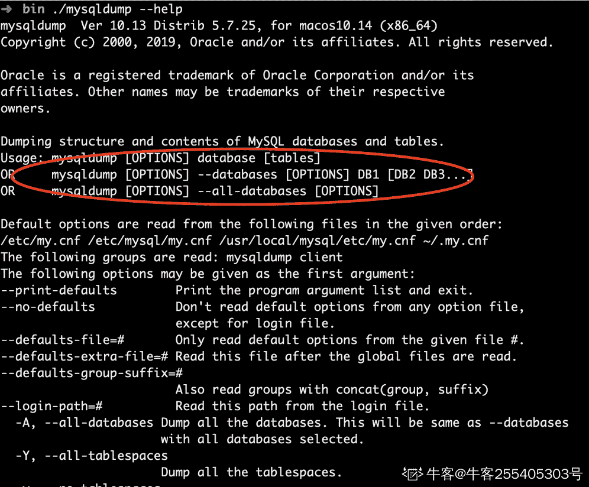
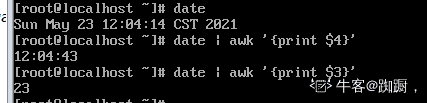
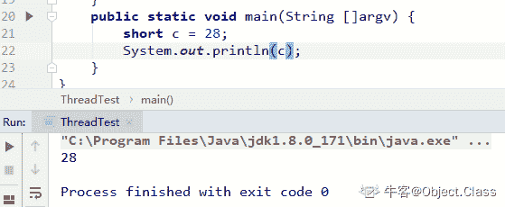
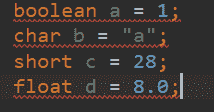
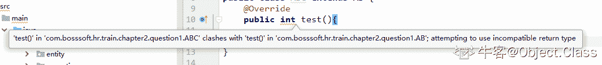

# 奇安信 2019 校招笔试题（三）

## 1

公司网络中心代理服务器 squid 服务配置文件 squid.conf 有配置语句 access_log  /var/log/squid.log,网络管理员查看 squid.log 使用的指令是（      ）

正确答案: C   你的答案: 空 (错误)

```cpp
vi /var/log/squid.log
```

```cpp
cat /var/log/squid.log
```

```cpp
tail -f /var/log/squid.log
```

```cpp
head /var/log/squid.conf
```

本题知识点

Java 工程师 C++工程师 前端工程师 安卓工程师 iOS 工程师 算法工程师 大数据开发工程师 运维工程师 安全工程师 奇安信 2019

## 2

公司网络中心 linux 服务器安装了 vsftpd 服务，办公室计算机无法访问 FTP 服务,在服务器端查看 vsftpd 服务是否开启的方式有（      ）

正确答案: A B C   你的答案: 空 (错误)

```cpp
ps -ef | grep xinetd
```

```cpp
ps -ef | grep vsftpd
```

```cpp
netstat -na | more
```

```cpp
netconfig 
```

本题知识点

Java 工程师 C++工程师 前端工程师 安卓工程师 iOS 工程师 算法工程师 大数据开发工程师 运维工程师 安全工程师 奇安信 2019

## 3

网络管理员配置服务器时为不同的服务指定不同的端口,配置 WWW、DNS、FTP、SSH、MAIL 等服务时使用的的端口范围是（      ）

正确答案: B   你的答案: 空 (错误)

```cpp
0-499
```

```cpp
1-1023
```

```cpp
1-1024
```

```cpp
1-5000
```

本题知识点

Java 工程师 C++工程师 前端工程师 安卓工程师 iOS 工程师 算法工程师 大数据开发工程师 运维工程师 安全工程师 奇安信 2019

## 4

学校机房有 1024 台计算机，为了广播教学网络管理员把所有计算机划分一个网段,子网掩码是（      ） 正确答案: D   你的答案: 空 (错误)

```cpp
255.255.255.0
```

```cpp
255.255.254.0
```

```cpp
255.255.252.0
```

```cpp
255.255.248.0
```

本题知识点

Java 工程师 C++工程师 前端工程师 安卓工程师 iOS 工程师 算法工程师 大数据开发工程师 运维工程师 安全工程师 奇安信 2019

讨论

[没灵魂](https://www.nowcoder.com/profile/428370242)

1024=2¹⁰-->要 11 位来做主机号，所以 11111111.11111111.11111000.00000000=255.255.248.0

发表于 2020-03-07 23:51:38

* * *

## 5

ping 命令不断发送大数据包会增加服务器负载，网络管理员可以通过以下方式禁止入侵者进行 ping 探测 linux server（      ）

正确答案: B C   你的答案: 空 (错误)

```cpp
echo 0 > /proc/sys/net/ipv4/icmp_echo_ignore_all
```

```cpp
echo 1 > /proc/sys/net/ipv4/icmp_echo_ignore_all
```

```cpp
iptables -A INPUT -p icmp -s 0.0.0.0/0.0.0.0 -j DROP
```

```cpp
iptables -A INPUT -p icmp -d 0.0.0.0/0.0.0.0 -j DROP
```

本题知识点

Java 工程师 C++工程师 前端工程师 安卓工程师 iOS 工程师 算法工程师 大数据开发工程师 运维工程师 安全工程师 奇安信 2019

## 6

网络管理员要维护网站后台数据库,为了安全要定期修改数据库登录口令,修改 mysql 数据库登录口令的方式有（      ）

正确答案: A C   你的答案: 空 (错误)

```cpp
mysql>use mysql; 
mysql>update User set Password=PASSWORD('newpassword') where User='root'; 

```

```cpp
mysql>use mysql; 
mysql>update User set Password=('newpassword') where User='root'; 

```

```cpp
mysqladmin -u root -p password 'newpassword'
```

```cpp
mysqladmin -u root  password 'newpassword'
```

本题知识点

Java 工程师 C++工程师 前端工程师 安卓工程师 iOS 工程师 算法工程师 大数据开发工程师 运维工程师 安全工程师 奇安信 2019

## 7

电子商务网站的数据库每天需要备份,网络管理员备份 mysql 的 net 数据库所有表的方法有（      ）

正确答案: A C   你的答案: 空 (错误)

```cpp
mysqldump -u root -p --database net > /misc/net.dmp
```

```cpp
mysqldump -u root -p  net users > /misc/net.dmp
```

```cpp
mysqlhotcopy -u root -p 口令 net  /misc
```

```cpp
mysqlhotcopy net  /misc
```

本题知识点

Java 工程师 C++工程师 前端工程师 安卓工程师 iOS 工程师 算法工程师 大数据开发工程师 运维工程师 安全工程师 奇安信 2019

讨论

[牛客 255405303 号](https://www.nowcoder.com/profile/255405303)

acmysqlhotcopy:[`www.cnblogs.com/diantong/p/11022104.html`](https://www.cnblogs.com/diantong/p/11022104.html) 物理备份只支持 myisammysqldump 逻辑备份库大了速度慢


编辑于 2020-07-26 10:53:08

* * *

## 8

公司内部交换机 sw1 与交换机 sw2 连接,网络管理员使用的双绞线形式有（      ）

正确答案: B C D   你的答案: 空 (错误)

```cpp
直通线
sw1 的 uplink 端口连接 sw2 的 uplink 端口

```

```cpp
交叉线
sw1 的 uplink 端口连接 sw2 的 uplink 端口

```

```cpp
直通线
sw1 的 uplink 端口连接 sw2 的 data 端口

```

```cpp
交叉线
sw1 的 data 端口连接 sw2 的 data 端口

```

本题知识点

Java 工程师 C++工程师 前端工程师 安卓工程师 iOS 工程师 算法工程师 大数据开发工程师 运维工程师 安全工程师 奇安信 2019

讨论

[我是哈哈哈.jpg](https://www.nowcoder.com/profile/4142902)

相同的设备相连使用交叉线，不同的设备相连使用直通线。这题大概可以这样理解，直通线连接的两边必须要是不一样的端口，而交叉线两边连接一样的端口

发表于 2020-02-26 00:43:28

* * *

## 9

部门较多的公司为了管理方便、提高网络服务质量和提高网络安全必须要划分 VLAN，网络管理员可以划分 VLAN 的方法有（      ）

正确答案: A B C   你的答案: 空 (错误)

```cpp
根据数据链路层地址划分
```

```cpp
根据网络层地址划分
```

```cpp
根据交换机端口划分
```

```cpp
根据路由器端口划分
```

本题知识点

Java 工程师 C++工程师 前端工程师 安卓工程师 iOS 工程师 算法工程师 大数据开发工程师 运维工程师 安全工程师 奇安信 2019

讨论

[牛客 394409038 号](https://www.nowcoder.com/profile/394409038)

交换机不包括三层交换机？

发表于 2020-09-23 20:05:06

* * *

## 10

校园网中把不同的机房划分为不同的 VLAN，网络管理员划分 VLAN 时有静态 VLAN 和动态 VLAN，下列属于动态 VLAN（      ）

正确答案: A B D   你的答案: 空 (错误)

```cpp
根据 MAC 地址划分
```

```cpp
根据 IP 地址划分
```

```cpp
根据交换机端口划分
```

```cpp
根据广播组地址划分
```

本题知识点

Java 工程师 C++工程师 前端工程师 安卓工程师 iOS 工程师 算法工程师 大数据开发工程师 运维工程师 安全工程师 奇安信 2019

## 11

关于中文信息处理，以下正确的叙述是（    ）  

正确答案: C   你的答案: 空 (错误)

```cpp
中文信息的输入码与其在计算机内部的编码一致          
```

```cpp
中文信息在计算机内采用 ASCII 码表示 
```

```cpp
中文字符在计算机内采用双字节编码表示  
```

```cpp
BIG5 码是一种简体汉字的编码
```

本题知识点

Java 工程师 C++工程师 前端工程师 安卓工程师 iOS 工程师 算法工程师 大数据开发工程师 运维工程师 安全工程师 奇安信 2019

## 12

现拥有足够数量未分类的数据，需要依据现有数据将这些划分成三类，请问可以使用哪种技术实现这一目标？（       ）

正确答案: B   你的答案: 空 (错误)

```cpp
分类
```

```cpp
聚类
```

```cpp
关联分析
```

```cpp
HMM
```

本题知识点

Java 工程师 C++工程师 前端工程师 安卓工程师 iOS 工程师 算法工程师 大数据开发工程师 运维工程师 安全工程师 奇安信 2019

## 13

文本分类评价体系中，下面说法正确的是（       ）

正确答案: A B D   你的答案: 空 (错误)

```cpp
precision（查准率）指 被分类器认为是正例的数据中，有多少是真正的正例
```

```cpp
recall（召回率）是指在所有正例中（人为判断），分类器找出多少正例
```

```cpp
在 F1 中 P 和 R 的重要性程度不一样，P 比 R 重要。

```

```cpp
由于 P 和 R 仅仅衡量正例被正确分类的情况。为了衡量正例和负例被正确分类的情况，出现了 Accurarcy(正确率)
```

本题知识点

Java 工程师 C++工程师 前端工程师 安卓工程师 iOS 工程师 算法工程师 大数据开发工程师 运维工程师 安全工程师 奇安信 2019

## 14

分类模型测试方法有哪些（       ）

正确答案: A B D   你的答案: 空 (错误)

```cpp
保持(holdout)方法
```

```cpp
K-折交叉确认(k-fold cross-validation)方法
```

```cpp
黑盒法
```

```cpp
留一法
```

本题知识点

Java 工程师 C++工程师 前端工程师 安卓工程师 iOS 工程师 算法工程师 大数据开发工程师 运维工程师 安全工程师 奇安信 2019

讨论

[higirl2020](https://www.nowcoder.com/profile/376457331)

B

发表于 2020-03-15 22:09:31

* * *

## 15

计算函数 log2(n³)+n 的渐进表达式（）

正确答案: A   你的答案: 空 (错误)

```cpp
O(n)
```

```cpp
O(n³)
```

```cpp
O(log2(n))
```

```cpp
O(1)
```

本题知识点

Java 工程师 C++工程师 前端工程师 安卓工程师 iOS 工程师 算法工程师 大数据开发工程师 运维工程师 安全工程师 奇安信 2019

## 16

设有递归算法如下：

```cpp
#include<stido.h>
int f(int x)
{
   int y;
   if(x==1)
      y=2;
   else
     y=x/2+f(x-1);
     return y;
}
```

计算 f(6)=( )

正确答案: D   你的答案: 空 (错误)

```cpp
8
```

```cpp
9
```

```cpp
10
```

```cpp
11
```

本题知识点

Java 工程师 C++工程师 前端工程师 安卓工程师 iOS 工程师 算法工程师 大数据开发工程师 运维工程师 安全工程师 奇安信 2019

## 17

 已知有 10 个学生的身高（厘米）为：150、172、163、180、178、160、172、154、165、158，计算他们所组成的最长合唱队队形的长度为多少（）

正确答案: C   你的答案: 空 (错误)

```cpp
5
```

```cpp
6
```

```cpp
7
```

```cpp
8
```

本题知识点

Java 工程师 C++工程师 前端工程师 安卓工程师 iOS 工程师 算法工程师 大数据开发工程师 运维工程师 安全工程师 奇安信 2019

讨论

[郫县男子计院](https://www.nowcoder.com/profile/328790495)

***** 题目真实情况是：设 n 位同学从左到右依次编号为 1, 2, …, n，合唱队形需使队列满足 T1＜T2＜…＜Ti＞…Tn-1＞Tn 现已知有 10 个学生的身高（厘米）为：150、172、163、180、178、160、172、154、165、158，计算他们所组成的最长合唱队队形的长度为多少（C）
A. 5
B. 6
C. 7
D. 8

解析：
150、172（163）、180、178、172、165、158

发表于 2020-02-27 21:13:58

* * *

## 18

利用贪心算法解决部分背包问题，容量为 20 的背包，装入物品的价值分别为{7、5、3、9、15、12}，物品的重量为{3、4、10、5、12、9}，求背包的最大价值量（）

正确答案: C   你的答案: 空 (错误)

```cpp
28
```

```cpp
31
```

```cpp
31.75
```

```cpp
32
```

本题知识点

Java 工程师 C++工程师 前端工程师 安卓工程师 iOS 工程师 算法工程师 大数据开发工程师 运维工程师 安全工程师 奇安信 2019

讨论

[牛客 398420292 号](https://www.nowcoder.com/profile/398420292)

为什么题目不能讲清晰一点计算所有物品的单位重量价值，按单位重量价值降序放进背包，7+9+12，最后 3 格空间放 1/4 的物品 4 号。这个东西不讲明白很有歧义

发表于 2020-09-11 15:22:16

* * *

## 19

下列关于 SLP 模型所具有的特点说法错误的是（）

正确答案: D   你的答案: 空 (错误)

```cpp
数据可以提前放在存储器中
```

```cpp
可指定符号地址是输出变量
```

```cpp
直线式程序的结束就是停机
```

```cpp
直线式程序中不可以去掉 READ、WRITE、HALT 指令
```

本题知识点

Java 工程师 C++工程师 前端工程师 安卓工程师 iOS 工程师 算法工程师 大数据开发工程师 运维工程师 安全工程师 奇安信 2019

## 20

六个盘子的汉诺塔问题，需要移动的盘子的次数为（）

正确答案: A   你的答案: 空 (错误)

```cpp
63
```

```cpp
64
```

```cpp
127
```

```cpp
128
```

本题知识点

Java 工程师 C++工程师 前端工程师 安卓工程师 iOS 工程师 算法工程师 大数据开发工程师 运维工程师 安全工程师 奇安信 2019

讨论

[郫县男子计院](https://www.nowcoder.com/profile/328790495)

链接：[`www.nowcoder.com/questionTerminal/30f1ff91ae8e403783bb9f603c4d09c9?orderByHotValue=1&page=1&onlyReference=false`](https://www.nowcoder.com/questionTerminal/30f1ff91ae8e403783bb9f603c4d09c9?orderByHotValue=1&page=1&onlyReference=false)
来源：牛客网
**Hanoi(n, a, b, c) = Hanoi(n-1, a, c, b) + 1 + Hanoi(n-1, b, a, c)**：将 a 上面 n-1 个盘子移到 b，再将 a 最下面的盘子移到 c，再将 b 上的 n-1 个盘子移到 c，此时，**n 盘子汉诺塔问题 **变成了**移****动一个盘子 + ****两个 n-1 盘子汉诺塔问题。**故 **f(n) = f(n-1) + 1 + f(n-1) = 2f(n-1) + 1****=> f(n) + 1 = 2(f(n-1) + 1) ****=> f(n) + 1 = 2^(n-1) (f(1) + 1)****=> f(n) + 1 = 2^n****=> f(n) = 2^n -1**

发表于 2020-02-27 21:14:48

* * *

## 21

计算函数 f(n)=nln(n)+n 与 g(n)=ln(n)的渐进阶关系（）

正确答案: B   你的答案: 空 (错误)

```cpp
f(n)与 g(n)等价
```

```cpp
f(n)比 g(n)高价
```

```cpp
f(n)比 g(n)低价
```

```cpp
无法判断
```

本题知识点

Java 工程师 C++工程师 前端工程师 安卓工程师 iOS 工程师 算法工程师 大数据开发工程师 运维工程师 安全工程师 奇安信 2019

讨论

[牛客 597052737 号](https://www.nowcoder.com/profile/597052737)

答案：**B.** f(n)比 g(n)高价 分析：O(1) < O(log^n) < O(n) < O(nlog^n) < O(n²) < O(n³) < O(n^k) < O(2^n) < O(n!) < O(n^n)(常数阶 < 对数阶 < 线性阶 < 线性对数阶 < 平方阶 < 立方阶 < K 次方阶 < 指数阶 < 阶乘阶 < n 的 n 次方)f(n) = nln(n) + n = O(nlog^n)，线性对数阶 g(n) = ln(n) = O(log^n)，对数阶

发表于 2021-07-02 14:24:50

* * *

## 22

下列那句诗体现了贪心算法（）

正确答案: D   你的答案: 空 (错误)

```cpp
飞鸟之影，未尝动也
```

```cpp
从前有座山，山里有座庙，庙里有个老和尚，再给小和尚讲故事
```

```cpp
众里寻他千百度，蓦然回首，那人却在灯火阑珊处
```

```cpp
江南可采莲，莲叶何田田，鱼戏莲叶间，鱼戏莲叶东，鱼戏莲叶西，鱼戏莲叶南
```

本题知识点

Java 工程师 C++工程师 前端工程师 安卓工程师 iOS 工程师 算法工程师 大数据开发工程师 运维工程师 安全工程师 奇安信 2019

讨论

[Jack_Liao](https://www.nowcoder.com/profile/958183442)

B 是递归.  但是感觉 D 不是分治算法吗?

发表于 2020-08-01 00:18:28

* * *

## 23

解决无向图的团问题所需要的步骤（）

正确答案: A B C   你的答案: 空 (错误)

```cpp
问题变换
```

```cpp
非确定性选择
```

```cpp
确定性验证
```

```cpp
对团问题进行编码
```

本题知识点

Java 工程师 C++工程师 前端工程师 安卓工程师 iOS 工程师 算法工程师 大数据开发工程师 运维工程师 安全工程师 奇安信 2019

## 24

  某工厂生产甲乙两种产品，需要 A、B、C 三种类型的设备，已知生产甲产品占有 A、B、C 三种设备的时间为 3、2、0；生产乙产品占有 A、B、C 三种设备的时间为 2、1、3，A、B、C 三台设备的可利用时间为 55、30、65，产品甲和乙的利润分别为 150 元\千克、250 元\千克，求最大利润（）

正确答案: B   你的答案: 空 (错误)

```cpp
5000
```

```cpp
6000
```

```cpp
6500
```

```cpp
6700
```

本题知识点

Java 工程师 C++工程师 前端工程师 安卓工程师 iOS 工程师 算法工程师 大数据开发工程师 运维工程师 安全工程师 奇安信 2019

## 25

以下哪种不是线性表（）

正确答案: C   你的答案: 空 (错误)

```cpp
栈
```

```cpp
队列
```

```cpp
二叉树
```

```cpp
串
```

本题知识点

Java 工程师 C++工程师 前端工程师 安卓工程师 iOS 工程师 算法工程师 大数据开发工程师 运维工程师 安全工程师 奇安信 2019

讨论

[霞飞路五号](https://www.nowcoder.com/profile/800777833)

除首尾外，当前结点只有一个前驱只有一个后继

发表于 2020-06-23 09:38:59

* * *

## 26

某查找算法的最大语句执行次数为 2n²+n+3，则该算法的时间复杂度为（）

正确答案: B   你的答案: 空 (错误)

```cpp
O(n)
```

```cpp
O(n²)
```

```cpp
O(2n²+n+3)
```

```cpp
O(2n²)
```

本题知识点

Java 工程师 C++工程师 前端工程师 安卓工程师 iOS 工程师 算法工程师 大数据开发工程师 运维工程师 安全工程师 奇安信 2019

## 27

字符串 zhongzhi 的非空真子串一共有多少个（）

正确答案: B   你的答案: 空 (错误)

```cpp
34
```

```cpp
35
```

```cpp
36
```

```cpp
37
```

本题知识点

Java 工程师 C++工程师 前端工程师 安卓工程师 iOS 工程师 算法工程师 大数据开发工程师 运维工程师 安全工程师 奇安信 2019

讨论

[牛客 137496344 号](https://www.nowcoder.com/profile/137496344)

非空真子集，所以不能算它本身，结果就是 8+7+6+5+4+3+2=8!-1=35

发表于 2020-07-30 20:02:52

* * *

## 28

设 S='you have an apple'。则 SubString(Sub,S,2,4)的返回值为（      ）,下标从 1 开始。

正确答案: A   你的答案: 空 (错误)

```cpp
ou h
```

```cpp
ha
```

```cpp
ou
```

```cpp
have
```

本题知识点

Java 工程师 C++工程师 前端工程师 安卓工程师 iOS 工程师 算法工程师 大数据开发工程师 运维工程师 安全工程师 奇安信 2019

讨论

[w621126zz](https://www.nowcoder.com/profile/694467419)

空格不考虑吗？

发表于 2020-04-07 15:48:50

* * *

## 29

关于平衡二叉排序树，以下说法正确的是（      ）

正确答案: A   你的答案: 空 (错误)

```cpp
空树是平衡二叉排序树
```

```cpp
左子树与有字数的高度差的绝对值小于 1
```

```cpp
左子树比右子树低
```

```cpp
所有结点的平衡因子取值只能是 0 或 1
```

本题知识点

Java 工程师 C++工程师 前端工程师 安卓工程师 iOS 工程师 算法工程师 大数据开发工程师 运维工程师 安全工程师 奇安信 2019

讨论

[Jack_Liao](https://www.nowcoder.com/profile/958183442)

所有结点的平衡因子取值只能是 0 或 1 或者 1

发表于 2020-08-01 00:21:19

* * *

## 30

关于 B 树，下列说法错误的是（      ）

正确答案: D   你的答案: 空 (错误)

```cpp
树中每个结点最多有 m 棵子树
```

```cpp
根节点至少有两棵子树
```

```cpp
m 路查找树中结点最多有 m-1 个关键字
```

```cpp
m 路查找树中结点最多有 m-1 棵子树
```

本题知识点

Java 工程师 C++工程师 前端工程师 安卓工程师 iOS 工程师 算法工程师 大数据开发工程师 运维工程师 安全工程师 奇安信 2019

## 31

关于线性表，以下说法错误的是（      ）

正确答案: B   你的答案: 空 (错误)

```cpp
一个线性表中的数据元素类型相同
```

```cpp
线性表中每个元素都有一个前驱和一个后继
```

```cpp
顺序存储是线性表的一种存储结构
```

```cpp
链式存储是线性表的一种存储结构
```

本题知识点

Java 工程师 C++工程师 前端工程师 安卓工程师 iOS 工程师 算法工程师 大数据开发工程师 运维工程师 安全工程师 奇安信 2019

讨论

[牛客 137496344 号](https://www.nowcoder.com/profile/137496344)

第一个没有前驱，最后一个没有后驱。

发表于 2020-07-30 20:06:48

* * *

## 32

关于顺序表，下列说法错误的是（      ）

正确答案: C   你的答案: 空 (错误)

```cpp
比链式存储的存储密度大
```

```cpp
可以方便的存取表中任一元素
```

```cpp
插入删除操作不需要移动结点
```

```cpp
顺序表需要占用连续的存储空间
```

本题知识点

Java 工程师 C++工程师 前端工程师 安卓工程师 iOS 工程师 算法工程师 大数据开发工程师 运维工程师 安全工程师 奇安信 2019

## 33

现有一个拥有 11 个结点的折半判定树，则在等概率情况下查找失败的平均成功查找长度为（      ）

正确答案: A   你的答案: 空 (错误)

```cpp
14/3
```

```cpp
3
```

```cpp
2
```

```cpp
3/14
```

本题知识点

Java 工程师 C++工程师 前端工程师 安卓工程师 iOS 工程师 算法工程师 大数据开发工程师 运维工程师 安全工程师 奇安信 2019

讨论

[gengduc](https://www.nowcoder.com/profile/972944395)

(5*8+4*4)/12=14/3

发表于 2021-04-27 10:45:34

* * *

## 34

依次输入（27,29,14,11,28,20,17,23）,构造二叉排序树，等概率下查找成功的平均查找长度为（      ）

正确答案: A   你的答案: 空 (错误)

```cpp
11/4
```

```cpp
4/11
```

```cpp
39/9
```

```cpp
9/39
```

本题知识点

Java 工程师 C++工程师 前端工程师 安卓工程师 iOS 工程师 算法工程师 大数据开发工程师 运维工程师 安全工程师 奇安信 2019

讨论

[郫县男子计院](https://www.nowcoder.com/profile/328790495)

                27   14                     2911  20             28    17  23(1*1 + 2*2 + 3*3 + 2*4) / 8 = 22 / 8 = 11 / 4

发表于 2020-02-27 21:54:20

* * *

## 35

下列关于网络协议 TCP 和 UDP 说法错误的是（）

正确答案: D   你的答案: 空 (错误)

```cpp
TCP 面向连接，通信前需要先建立连接；UDP 面向无连接，通信前不需要建立连接
```

```cpp
TCP 保障可靠传输（按序、无差错、不丢失、不重复）；UDP 不保障可靠传输
```

```cpp
TCP 面向字节流的传输，UDP 面向数据报的传输
```

```cpp
UDP 需要三次握手，TCP 不需要
```

本题知识点

Java 工程师 C++工程师 前端工程师 安卓工程师 iOS 工程师 算法工程师 大数据开发工程师 运维工程师 安全工程师 奇安信 2019

## 36

xml 是 Android 网络编程中常用的数据交换格式，android 中常用的 xml 解析方式，且是内置于 Android 系统中。也是官方解析布局文件所使用的方式（）

正确答案: D   你的答案: 空 (错误)

```cpp
SAX 解析 XML
```

```cpp
DOM 解析 XML
```

```cpp
READER 解析 XML
```

```cpp
PULL 解析 XML
```

本题知识点

Java 工程师 C++工程师 前端工程师 安卓工程师 iOS 工程师 算法工程师 大数据开发工程师 运维工程师 安全工程师 奇安信 2019

讨论

[牛客 527627483 号](https://www.nowcoder.com/profile/527627483)

d

发表于 2020-07-17 09:33:43

* * *

[努力上进的小杨](https://www.nowcoder.com/profile/855107575)

D

发表于 2020-02-24 21:20:53

* * *

## 37

在开发一款游戏 APP 中，有背景音乐播放及动画等多媒体运行，在游戏过程中可能会发生如来电等中断事件，暂时动画及音乐等代码逻辑，应该放在 Activity 的（）方法中处理比较合适。

正确答案: A   你的答案: 空 (错误)

```cpp
onPause( )
```

```cpp
onRestart( )
```

```cpp
onResume( )
```

```cpp
onStop( )
```

本题知识点

Java 工程师 C++工程师 前端工程师 安卓工程师 iOS 工程师 算法工程师 大数据开发工程师 运维工程师 安全工程师 奇安信 2019

## 38

在 Android 的 Service 生命周期中，回调的方法中不包含（）

正确答案: A   你的答案: 空 (错误)

```cpp
onPause( )
```

```cpp
onCreate( )
```

```cpp
onUnbind( )
```

```cpp
onBind( )
```

本题知识点

Java 工程师 C++工程师 前端工程师 安卓工程师 iOS 工程师 算法工程师 大数据开发工程师 运维工程师 安全工程师 奇安信 2019

讨论

[牛客 424845714 号](https://www.nowcoder.com/profile/424845714)

Aservice 生命周期 onCreate() -> onStartCommand() ->onDestroy() 或是 onCreate() -> onBind() ->onUnbind()->onDestroy() 

发表于 2020-07-21 08:44:48

* * *

## 39

下列哪些是和网络访问无关的框架（）

正确答案: B   你的答案: 空 (错误)

```cpp
Android Async HTTP
```

```cpp
RoboGuice
```

```cpp
OkHttp
```

```cpp
AndroidAsync
```

本题知识点

Java 工程师 C++工程师 前端工程师 安卓工程师 iOS 工程师 算法工程师 大数据开发工程师 运维工程师 安全工程师 奇安信 2019

## 40

Picasso 是 Square 公司开源的一个 Android 图形缓存库。可以实现图片下载和缓存功能。下面说法错误的是（）

正确答案: D   你的答案: 空 (错误)

```cpp
支持加载加载网络图片及 Resources, assets 等中的资源文件
```

```cpp
能自动检测到 Adapter 的重用，会取消上次的加载
```

```cpp
可以转换图片以适应布局大小，来减少内存消耗
```

```cpp
不支持加载过程中和加载错误时显示对应图片
```

本题知识点

Java 工程师 C++工程师 前端工程师 安卓工程师 iOS 工程师 算法工程师 大数据开发工程师 运维工程师 安全工程师 奇安信 2019

## 41

WebView 是一个基于 webkit 引擎、展现 web 页面的控件，它有多种的页面加载方式，下面哪种是错误的（）

正确答案: D   你的答案: 空 (错误)

```cpp
webView.loadUrl("http://www.google.com/");
加载一个网页：

```

```cpp
webView.loadUrl("file:///android_asset/index.html");
加载 apk 包中的 html 页面

```

```cpp
加载手机本地的 html 页面
webView.loadUrl("content://com.android.htmlfileprovider/sdcard/test.html")

```

```cpp
WebView.loadData("page.html")加载本地页面资源
```

本题知识点

Java 工程师 C++工程师 前端工程师 安卓工程师 iOS 工程师 算法工程师 大数据开发工程师 运维工程师 安全工程师 奇安信 2019

## 42

HttpURLConnection 类中 getResponseCode()可以获取网络连接的响应状态码，下面状态含义解释正确的是（）

正确答案: D   你的答案: 空 (错误)

```cpp
404 Bad Request 该状态码表示请求报文中存在语法错误
```

```cpp
400 Not Found 该状态码表明服务器上无法找到请求的资源
```

```cpp
500 服务器暂时处于超负载或正在进行停机维护，现在无法处理请求
```

```cpp
200 OK 表示从客户端发来的请求在服务器端被正常处理
```

本题知识点

Java 工程师 C++工程师 前端工程师 安卓工程师 iOS 工程师 算法工程师 大数据开发工程师 运维工程师 安全工程师 奇安信 2019

## 43

在 WebView 组件使用中，WebSettings 类可以对对 WebView 进行配置和管理，在下列选项的方法解释正确的是（）

正确答案: A   你的答案: 空 (错误)

```cpp
webSettings.setPluginsEnabled(true);支持插件
```

```cpp
webSettings.setJavaScriptEnabled(true);禁用 JavaScript :
```

```cpp
webSettings.setLoadWithOverviewMode(true);将图片调整到适合 webview 的大小
```

```cpp
webSettings.setUseWideViewPort(true);缩放至屏幕的大小
```

本题知识点

Java 工程师 C++工程师 前端工程师 安卓工程师 iOS 工程师 算法工程师 大数据开发工程师 运维工程师 安全工程师 奇安信 2019

## 44

使用 URLConnection 的有如下几个步骤，请选择正确的排序（）
①把网址封装成一个 URL 对象
②获取客户端与服务器的连接对象
③发送请求，建立连接
④获取服务器响应中的流
⑤对流中的数据进行操作
⑥对连接对象初始化

正确答案: B   你的答案: 空 (错误)

```cpp
①②③④⑤⑥
```

```cpp
①②⑥③④⑤
```

```cpp
①⑥②③⑤④
```

```cpp
①⑥②③④⑤
```

本题知识点

Java 工程师 C++工程师 前端工程师 安卓工程师 iOS 工程师 算法工程师 大数据开发工程师 运维工程师 安全工程师 奇安信 2019

## 45

 对下述代码错误描述正确的是( )

```cpp
NSTimer *myTimer = [NSTimer timerWithTimeInterval:1.0 target:self selector:@selector(doSomeThing:) userInfo:nil repeats:YES]; 
[myTimer fire]
```

正确答案: A   你的答案: 空 (错误)

```cpp
没有将 timer 加入 runloop
```

```cpp
 doSomeThing 缺少参数
```

```cpp
 忘记传递数据给 userInfo
```

```cpp
myTimer 对象未通过[[myTimer alloc] init]方法初始化
```

本题知识点

Java 工程师 C++工程师 前端工程师 安卓工程师 iOS 工程师 算法工程师 大数据开发工程师 运维工程师 安全工程师 奇安信 2019

## 46

```cpp
NSString *str = @“lanou”;
[str retain];
NSLog(@“%lu”,str.retainCount);
```

此处打印出来的值是多少（）

正确答案: D   你的答案: 空 (错误)

```cpp
1
```

```cpp
2
```

```cpp
-1
```

```cpp
 ULONG_MAX
```

本题知识点

Java 工程师 C++工程师 前端工程师 安卓工程师 iOS 工程师 算法工程师 大数据开发工程师 运维工程师 安全工程师 奇安信 2019

## 47

 关于 readwrite, readonly, assign, automatic 的说法，下列说法错误的是（）

正确答案: D   你的答案: 空 (错误)

```cpp
readwrite 是可读可写特性；需要生成 getter 方法和 setter 方法时
```

```cpp
readonly 是只读特性 只会生成 getter 方法 不会生成 setter 方法 ;
不希望属性在类外改变

```

```cpp
assign 是赋值特性，setter 方法将传入参数赋值给实例变量；
仅设置变量时

```

```cpp
nonatomic 非原子操作，决定编译器生成的 setter getter 是否是
原子操作；nonatomic 表示多线程安全；一般使用 atomic

```

本题知识点

Java 工程师 C++工程师 前端工程师 安卓工程师 iOS 工程师 算法工程师 大数据开发工程师 运维工程师 安全工程师 奇安信 2019

## 48

下面哪些属于 UITableViewDelegate 协议的方法？（）

正确答案: C   你的答案: 空 (错误)

```cpp
tableView:cellForRowAtIndexPath:
```

```cpp
tableView:numberOfRowsInSection:
```

```cpp
tableView:didSelectRowAtIndexPath:
```

```cpp
numberOfSectionsInTableView:
```

本题知识点

Java 工程师 C++工程师 前端工程师 安卓工程师 iOS 工程师 算法工程师 大数据开发工程师 运维工程师 安全工程师 奇安信 2019

## 49

 关于内存管理，下列说法错误的是（）

正确答案: C   你的答案: 空 (错误)

```cpp
谁申请，谁释放
```

```cpp
内存管理主要要避免“过早释放”和“内存泄漏”，对于“过早释放”
需要注意@property 设置特性时，一定要用对特性关键字，对于“内存泄
漏”，一定要申请了要负责释放

```

```cpp
 关键字 alloc 或 new 生成的对象可以自动释放
```

```cpp
设置正确的 property 属性，对于 retain 需要在合适的地方释放， 
```

本题知识点

Java 工程师 C++工程师 前端工程师 安卓工程师 iOS 工程师 算法工程师 大数据开发工程师 运维工程师 安全工程师 奇安信 2019

## 50

NSRunLoop 的以下描述错误的是（）

正确答案: C   你的答案: 空 (错误)

```cpp
Runloop 并不是由系统自动控制的
```

```cpp
有 3 类对象可以被 run loop 监控：sources，timers，observers
```

```cpp
 线程是默认启动 run loop 的
```

```cpp
NSTimer 可手动添加到新建的 NSRunLoop 中
```

本题知识点

Java 工程师 C++工程师 前端工程师 安卓工程师 iOS 工程师 算法工程师 大数据开发工程师 运维工程师 安全工程师 奇安信 2019

## 51

iOS 中持久化方式有哪些？（）

正确答案: A B C D   你的答案: 空 (错误)

```cpp
属性列表文件
```

```cpp
 对象归档
```

```cpp
 SQLite 数据库
```

```cpp
CoreData
```

本题知识点

Java 工程师 C++工程师 前端工程师 安卓工程师 iOS 工程师 算法工程师 大数据开发工程师 运维工程师 安全工程师 奇安信 2019

## 52

 以下适合在客户端做数据持久化存储的数据的有（）

正确答案: B D   你的答案: 空 (错误)

```cpp
redis
```

```cpp
localStorage
```

```cpp
sessionStorage
```

```cpp
 userData
```

本题知识点

Java 工程师 C++工程师 前端工程师 安卓工程师 iOS 工程师 算法工程师 大数据开发工程师 运维工程师 安全工程师 奇安信 2019

## 53

下列关于 H5 客户端存储的 localStorage 和 sessionStorage 功能描述错误的是(          )

正确答案: D   你的答案: 空 (错误)

```cpp
H5 中,客户端存储是一个 window 的属性，包括 localStorage 和 sessionStorage
```

```cpp
localStorage:一直存储在本地
```

```cpp
sessionStorage:浏览器关闭则消失
```

```cpp
localStorage 必须经过页面跳转才可以存储值
```

本题知识点

Java 工程师 C++工程师 前端工程师 安卓工程师 iOS 工程师 算法工程师 大数据开发工程师 运维工程师 安全工程师 奇安信 2019

## 54

localStorage 与 cookie 都可以完成客户端存储功能,下列选项中对两者的描述错误的是(      )

正确答案: D   你的答案: 空 (错误)

```cpp
cookie 在浏览器与服务器之间来回传递,localStorage 不会把数据发给服务器，仅在本地保存.
```

```cpp
localStorage 在所有同源窗口中都是共享的,cookie 也是在所有同源窗口中都是共享的.
```

```cpp
cookie 只在设置的 cookie 过期时间之前一直有效，即使窗口或浏览器关闭。
localStorage  始终有效，长期保存。

```

```cpp
cookie 数据和 sessionStorage,localStorage 存储大小相同,都是 4k 左右
```

本题知识点

Java 工程师 C++工程师 前端工程师 安卓工程师 iOS 工程师 算法工程师 大数据开发工程师 运维工程师 安全工程师 奇安信 2019

## 55

下列关于 JavaScript 节点操作的函数说明中,错误的是(        )

正确答案: D   你的答案: 空 (错误)

```cpp
neborNode.previousSibling 获取已知节点的相邻的上一个节点
```

```cpp
nerbourNode.nextSlbling: 获取已知节点的下一个节点
```

```cpp
parentObj.children  只选择元素节点,（但是 IE678 会包含注释节点 )
```

```cpp
neborNode.siblings 可以获取元素的同胞节点
```

本题知识点

Java 工程师 C++工程师 前端工程师 安卓工程师 iOS 工程师 算法工程师 大数据开发工程师 运维工程师 安全工程师 奇安信 2019

## 56

设当前目录下有图片 1.png,则关于下列代码的说法中,正确的是(        )

```cpp
<input type="button" value="添加节点" id="btn" />
 <div id="info"></div>
 <script>
 document.getElementById("btn").onclick=function(){
     var obj=document.createElement("img");
     obj.setAttribute("src","1.png");
     obj.setAttribute("width","200px");        
     document.getElementById("info").appendChild(obj);
 }   
  </script>
```

正确答案: A   你的答案: 空 (错误)

```cpp
单击按钮,创建一个 img 对象,并将其插入到 info 元素中
```

```cpp
单击按钮,创建一个 img 对象,并将其插入到 info 之前
```

```cpp
单击按钮,创建一个 img 对象,并将其插入到 info 之后
```

```cpp
此段代码会报错
```

本题知识点

Java 工程师 C++工程师 前端工程师 安卓工程师 iOS 工程师 算法工程师 大数据开发工程师 运维工程师 安全工程师 奇安信 2019

## 57

要在 canvas 画布中绘制出下面图形,需要利用哪个矩阵(         )


正确答案: A   你的答案: 空 (错误)

```cpp
            [0,0,0,1,1,0,0],
            [0,1,1,1,1,0,0],
            [0,0,0,1,1,0,0],
            [0,0,0,1,1,0,0],
            [0,0,0,1,1,0,0],
            [0,0,0,1,1,0,0],
            [0,0,0,1,1,0,0],
            [0,0,0,1,1,0,0],
            [0,0,0,1,1,0,0],
            [1,1,1,1,1,1,1]
```

```cpp
            [0,1,1,1,1,1,0],
            [1,1,0,0,0,1,1],
            [0,0,0,0,0,1,1],
            [0,0,0,0,1,1,0],
            [0,0,0,1,1,0,0],
            [0,0,1,1,0,0,0],
            [0,1,1,0,0,0,0],
            [1,1,0,0,0,0,0],
            [1,1,0,0,0,1,1],
            [1,1,1,1,1,1,1]
```

```cpp
            [1,1,1,1,1,1,1],
            [0,0,0,0,0,1,1],
            [0,0,0,0,1,1,0],
            [0,0,0,1,1,0,0],
            [0,0,1,1,1,0,0],
            [0,0,0,0,1,1,0],
            [0,0,0,0,0,1,1],
            [0,0,0,0,0,1,1],
            [1,1,0,0,0,1,1],
            [0,1,1,1,1,1,0]
```

```cpp
            [0,0,0,0],
            [0,0,0,0],
            [0,1,1,0],
            [0,1,1,0],
            [0,0,0,0],
            [0,0,0,0],
            [0,1,1,0],
            [0,1,1,0],
            [0,0,0,0],
            [0,0,0,0]

```

本题知识点

Java 工程师 C++工程师 前端工程师 安卓工程师 iOS 工程师 算法工程师 大数据开发工程师 运维工程师 安全工程师 奇安信 2019

## 58

下列选项中,关于 canvas 的描述错误的是(         )

正确答案: C   你的答案: 空 (错误)

```cpp
  canvas 标签只是图形容器，必须使用脚本来绘制图形
```

```cpp
可以在 HTML 页面中使用多个 <canvas> 元素.
```

```cpp
对 canvas 画布,可以采用下面的代码进行画布大小的设置.
canvas{
    width:1024px;
    height:768px;
    background-color:red;
}
```

```cpp
getContext("2d") 对象是内建的 HTML5 对象，拥有多种绘制路径、矩形、圆形、字符以及添加图像的方法.
```

本题知识点

Java 工程师 C++工程师 前端工程师 安卓工程师 iOS 工程师 算法工程师 大数据开发工程师 运维工程师 安全工程师 奇安信 2019

## 59

在使用 vue 框架时，如何调用 ajax,下述描述正确的是(        )

正确答案: C   你的答案: 空 (错误)

```cpp
vue 中 ajax 调取数据需使用 vue.ajax({})方法
```

```cpp
vue 中 ajax 调取数据需使用$.ajax({})方法
```

```cpp
vue 中 ajax 调取数据需使用 axios 插件
```

```cpp
vue 中 ajax 调取数据需使用 vue=>ajax({})方法
```

本题知识点

Java 工程师 C++工程师 前端工程师 安卓工程师 iOS 工程师 算法工程师 大数据开发工程师 运维工程师 安全工程师 奇安信 2019

讨论

[牛客 137037217 号](https://www.nowcoder.com/profile/137037217)

C

发表于 2021-07-14 16:54:42

* * *

## 60

在 vue 框架中,有如下数据 list,下列选项中哪项代码不能在页面正常显示 list 的三条数据(        )

```cpp
list:[
     {
      name:'apple',
      price:34
     },{
      name:'banana',
      price:50
     },{
      name:'orange',
      price:70
     }
    ]
```

正确答案: D   你的答案: 空 (错误)

```cpp
<ul>
     <li v-for="item in list">{{item.name+item.price}}</li>
    </ul>

```

```cpp
<ul>
     <li v-for="item in list" v-text="item.name+item.price"></li>
    </ul>

```

```cpp
<ul>
     <li v-for="(item,index) in list">{{index+item.name+item.price}}</li>
    </ul>

```

```cpp
<ul>
     <li v-for="item  in list">item.name+item.price</li>
</ul>

```

本题知识点

Java 工程师 C++工程师 前端工程师 安卓工程师 iOS 工程师 算法工程师 大数据开发工程师 运维工程师 安全工程师 奇安信 2019

讨论

[牛客 311021034 号](https://www.nowcoder.com/profile/311021034)

对比 A 和 D，D 缺少 MUSTACHE 语法

发表于 2020-09-13 00:53:34

* * *

## 61

shell 不仅是用户与内核的接口，也是高级编程语句，支持了多种运算符，字符串的运算符有（      ）

正确答案: A B C   你的答案: 空 (错误)

```cpp
=
```

```cpp
'-z
```

```cpp
'==
```

```cpp
'-s
```

本题知识点

Java 工程师 C++工程师 前端工程师 安卓工程师 iOS 工程师 算法工程师 大数据开发工程师 运维工程师 安全工程师 奇安信 2019

讨论

[牛客 581179338 号](https://www.nowcoder.com/profile/581179338)

一直以为判断两个字符串是否相等是用== 原来= 也可以。。。

发表于 2020-12-28 15:03:43

* * *

## 62

网络管理员要统计 linux 系统有多少用户可以本地登录，把可以登录的用户名排序后保存到/misc/userlogin.txt 中（      ）

正确答案: A C   你的答案: 空 (错误)

```cpp
cat /etc/passwd | grep -v '/sbin/nologin' | awk -F : 'print {$1}' | sort > /misc/userlogin.txt
```

```cpp
cat /etc/passwd | grep -v '/sbin/nologin' | awk 'print {$1}' | sort > /misc/userlogin.txt
```

```cpp
cat /etc/passwd | grep -v '/sbin/nologin' | cut -f 1 -d : | sort > /misc/userlogin.txt
```

```cpp
cat /etc/passwd | grep -v '/sbin/nologin' | cut -f 7 -d : | sort > /misc/userlogin.txt
```

本题知识点

Java 工程师 C++工程师 前端工程师 安卓工程师 iOS 工程师 算法工程师 大数据开发工程师 运维工程师 安全工程师 奇安信 2019

讨论

[封玉](https://www.nowcoder.com/profile/972810200)

awk 提供了极其强大的功能：可以进行正则表达式的匹配、样式装入、流控制、数字运算符、进程控制语句甚至于内置的变量和函数。  简单地说，awk 就是一种用于处理文本的编辑语言工具，它扫描文件中的每一行，查找与命令行中所给定内容相匹配的模式，如果发现匹配内容，则进行下一个编程步骤。如果找不到匹配内容，则继续处理下一行。(1)打印指定列  @ubuntu:~$awk ' { print $1, $2} '   file 注意，其中单引号中大括号内就是 awk 语句，只能被单引号包含。$1 表示第一列，$2 表示第二列，$n 表示第 n 列。而$0 表示整一行（即一行中的所有列）（2）@ubuntu:~$awk ' BEGIN {  FS=":" } {print $1}' /etc/passwd 注意：BEGIN 意味着紧跟在它后面的动作{FS=":"}会在 awk 读取第一行之前处理。  上面的语句等价于  @ubuntu:~$awk -F：'{ print $1 }' /etc/passwd

发表于 2020-05-12 20:21:44

* * *

## 63

网络管理员使用 date 指令查看当前时间，希望只输出"时:分:秒",下列语句正确的是（      ）

正确答案: A C   你的答案: 空 (错误)

```cpp
date +%H:%M:%S
```

```cpp
date +%h:%m:%s
```

```cpp
date | awk '{print $3}'
```

```cpp
date | awk '{print $4}'
```

本题知识点

Java 工程师 C++工程师 前端工程师 安卓工程师 iOS 工程师 算法工程师 大数据开发工程师 运维工程师 安全工程师 奇安信 2019

讨论

[踟蹰，](https://www.nowcoder.com/profile/83306580)



发表于 2021-05-23 12:05:22

* * *

## 64

linux 系统用户登录成功后就开启了 shell,shell 是用户与内核的接口,启动 shell 需要读取的文件有（      ）

正确答案: A B C   你的答案: 空 (错误)

```cpp
/etc/profile
```

```cpp
~/.bash_profile
```

```cpp
~/.bashrc
```

```cpp
/etc/inittab
```

本题知识点

Java 工程师 C++工程师 前端工程师 安卓工程师 iOS 工程师 算法工程师 大数据开发工程师 运维工程师 安全工程师 奇安信 2019

## 65

有下列程序，则程序运行后，文件 date.txt 内写入的内容是（）

```cpp
#include#includeusing namespace std;struct Date{     char mo, da, yr;  };int main(){   Date dt1= {'A','0','C'};ofstream tfile1("date.txt");tfile1.write((char *) &dt1, sizeof dt1);tfile1.close();Date dt2;ifstream tfile2("date.txt");tfile2.read ((char *) &dt2, sizeof dt2);cout<<dt2.mo<<dt2.da<<dt2.yr<<endl;tfile2.close();}
```

正确答案: B   你的答案: 空 (错误)

```cpp
654899
```

```cpp
A0C
```

```cpp
6548C
```

```cpp
A099
```

本题知识点

Java 工程师 C++工程师 前端工程师 安卓工程师 iOS 工程师 算法工程师 大数据开发工程师 运维工程师 安全工程师 奇安信 2019

## 66

有下列程序，程序运行后，文件 test1.txt 中写入的内容是**##，请将横线处缺失程序补充完整（）

```cpp
#include#includeusing namespace std;void main(){ofstream file1("test1.txt");file1 << "";
file1.close();
char ch;
ifstream file2("test1.txt");
while (file2.get(ch))
cout << ch;
file2.close();
file1.open("test1.txt",          );
file1 <<"##";
file1.close();
}
```

正确答案: C   你的答案: 空 (错误)

```cpp
ios::binary
```

```cpp
ios::out
```

```cpp
ios::app 
```

```cpp
ios::in
```

本题知识点

Java 工程师 C++工程师 前端工程师 安卓工程师 iOS 工程师 算法工程师 大数据开发工程师 运维工程师 安全工程师 奇安信 2019

## 67

已知表达式 a++中的”++”是作为友元函数重载的运算符，则与 a++等效的运算符函数调用形式为( )

正确答案: D   你的答案: 空 (错误)

```cpp
operator++(a)
```

```cpp
a.operator++(0)
```

```cpp
a.operator++( ) 
```

```cpp
operator++(a, 0)
```

本题知识点

Java 工程师 C++工程师 前端工程师 安卓工程师 iOS 工程师 算法工程师 大数据开发工程师 运维工程师 安全工程师 奇安信 2019

讨论

[牛客 404666064 号](https://www.nowcoder.com/profile/404666064)

因为“++”运算符既可以作为前缀运算符，又可以作为后缀运算符，所以重载这个运算符时，重载后缀“++”时必须多一个虚拟参数：int。

发表于 2020-09-02 01:31:01

* * *

## 68

下列程序的运行结果是 5  10  , 请将横线处缺失程序补充完整（）

```cpp
class R
{
public:
R(){i= 5;}
R(     ){i= x;}
void show()  { cout<<i<<" "; }
private:
int i;
};
int main()
{
R R1;
R R2(10);
R1.show();
R2.show();
return 0;
}
```

正确答案: D   你的答案: 空 (错误)

```cpp
int  i=5
```

```cpp
int  x=5 
```

```cpp
int  i 
```

```cpp
int  x
```

本题知识点

Java 工程师 C++工程师 前端工程师 安卓工程师 iOS 工程师 算法工程师 大数据开发工程师 运维工程师 安全工程师 奇安信 2019

## 69

下列程序的运行结果是（）

```cpp
class A
{
public:
   virtual void print(){cout<<"A::" <<endl;}
};
class C:public A
{
public:
  void print(){cout<<"C::" <<endl;}
};   
int main()
{
     A *ptrA;
     C *ptrC=new C();
     ptrA= static_cast<A*>(ptrC);
  ptrA->print();
  return 0;
}
```

正确答案: A   你的答案: 空 (错误)

```cpp
C:: 
```

```cpp
A::
```

```cpp
A::C:: 
```

```cpp
C::A::
```

本题知识点

Java 工程师 C++工程师 前端工程师 安卓工程师 iOS 工程师 算法工程师 大数据开发工程师 运维工程师 安全工程师 奇安信 2019

## 70

下列程序的运行结果是 D::，请将横线处缺失程序补充完整（）

```cpp
class B
{
public:
virtual void foo(){cout<<"B::";}
}; 
class D:public B
{
public:
virtual void foo(){cout<<"D::";}
};
int main()
{   
   D *pb=new D;
         =dynamic_cast<D &>(*pb);
   p2.foo();
 return 0;
}
```

正确答案: B   你的答案: 空 (错误)

```cpp
B&p2
```

```cpp
D &p2
```

```cpp
D *p2
```

```cpp
B *p2
```

本题知识点

Java 工程师 C++工程师 前端工程师 安卓工程师 iOS 工程师 算法工程师 大数据开发工程师 运维工程师 安全工程师 奇安信 2019

## 71

下列程序的运行结果是（）

```cpp
#includeusing namespace std;class base {public:int n;base(int x) { n = x;}virtual void set(int m) { n = m; cout << n <<' ';}};class deriveA:public base{public:deriveA(int x):base(x) { }void set(int m) { n += m; cout << n <<' ';}};class deriveB:public base{public:deriveB(int x):base(x) { }void set(int m) { n +=m; cout <<n << ' ';}};void f(base p){p.set(0);}int main()
{
     deriveA d1(1);
     deriveB d2(3);
     f(d1);
  f(d2);
     return 0;
}
```

正确答案: A   你的答案: 空 (错误)

```cpp
0  0
```

```cpp
1  3
```

```cpp
0  1
```

```cpp
0  3
```

本题知识点

Java 工程师 C++工程师 前端工程师 安卓工程师 iOS 工程师 算法工程师 大数据开发工程师 运维工程师 安全工程师 奇安信 2019

## 72

下列程序的运行结果是（）

```cpp
#includeusing namespace std;class B{public:void show(){cout<<"B";}};class D:public B{public:void show(){cout<<"D";}};void fun1(B ptr){ptr.show();}void fun2(B &ref){ref.show();}void fun3(B b){b->show();}
int main()
{
B b,int main(){B b,p=new D;D d;fun1(b);fun2(d);fun3(p);return 0;}
```

正确答案: C   你的答案: 空 (错误)

```cpp
DBB
```

```cpp
BBD
```

```cpp
BBB
```

```cpp
BDD
```

本题知识点

Java 工程师 C++工程师 前端工程师 安卓工程师 iOS 工程师 算法工程师 大数据开发工程师 运维工程师 安全工程师 奇安信 2019

## 73

下列程序的运行结果是 1 2 3 4 3 6 5，请将横线处缺失程序补充完整（）

```cpp
#include#include#includeusing namespace std;int main()
{
 int iarray[]={1,1,2,7,4,6,5};
 vectorivector(iarray,iarray+sizeof(iarray)/sizeof(int));
 ivector[0]=adjacent_find(ivector.begin(),ivector.end());
 ivector[1]=count(ivector.begin(),ivector.end(),1);
 ivector[2]=count_if(ivector.begin(),ivector.end(),bind2nd(less(),       ));
 ivector[3]=find(ivector.begin(),ivector.end(),4);
 ivector[4]=*find_if(ivector.begin(),ivector.end(),bind2nd(greater(),2));
 for(int i=0;i<ivector.size();i++)
  cout<<ivector[i]<<" ";
   return 0;
}ivector[0]=adjacent_find(ivector.begin(),ivector.end());
 ivector[1]=count(ivector.begin(),ivector.end(),1);
 ivector[2]=count_if(ivector.begin(),ivector.end(),bind2nd(less(),       ));
 ivector[3]=ivector[1]=count(ivector.begin(),ivector.end(),1);ivector[2]=count_if(ivector.begin(),ivector.end(),bind2nd(less(),       ));
 ivector[3]=ivector[3]=find(ivector.begin(),ivector.end(),4);ivector[4]=*find_if(ivector.begin(),ivector.end(),bind2nd(greater(),2));
 for(int i=0;i<ivector.size();i++)
  cout<<ivector[i]<<" ";
   return 0;
}for(int i=0;i<ivector.size();i++)cout<<ivector[i]<<" ";return 0;}
```

正确答案: D   你的答案: 空 (错误)

```cpp
7
```

```cpp
6
```

```cpp
5
```

```cpp
4
```

本题知识点

Java 工程师 C++工程师 前端工程师 安卓工程师 iOS 工程师 算法工程师 大数据开发工程师 运维工程师 安全工程师 奇安信 2019

## 74

下列程序的运行结果是 6641，请将横线处缺失程序补充完整（）

```cpp
#include#include#includeusing namespace std;int main(){int iarray[]={1,1,2,7,4,6,5};vectorivector(iarray,iarray+sizeof(iarray)/sizeof(int));
 int iarray1[]={2,7};
 vectorivector1(iarray1,iarray1+sizeof(iarray1)/sizeof(int));
 int iarray2[]={4,6};
 vectorivector2(iarray2,iarray2+sizeof(iarray2)/sizeof(int));
 cout<<(find_end(ivector.begin(),ivector.end(),ivector1.begin(),ivector1.end())+3);
 cout<<(find_first_of(ivector.begin(),ivector.end(),ivector1.begin(),ivector1.end())+3);
 cout<<search(ivector.begin(),ivector.end(),ivector2.begin(),ivector2.end());
 cout<<search_n(ivector.begin(),ivector.end(),       equal_to())<<endl;
   return 0;
}int iarray1[]={2,7};vectorivector1(iarray1,iarray1+sizeof(iarray1)/sizeof(int));
 int iarray2[]={4,6};
 vectorivector2(iarray2,iarray2+sizeof(iarray2)/sizeof(int));
 cout<<(find_end(ivector.begin(),ivector.end(),ivector1.begin(),ivector1.end())+3);
 cout<<(find_first_of(ivector.begin(),ivector.end(),ivector1.begin(),ivector1.end())+3);
 cout<<search(ivector.begin(),ivector.end(),ivector2.begin(),ivector2.end());
 cout<<search_n(ivector.begin(),ivector.end(),       equal_to())<<endl;
   return 0;
}int iarray2[]={4,6};vectorivector2(iarray2,iarray2+sizeof(iarray2)/sizeof(int));
 cout<<(find_end(ivector.begin(),ivector.end(),ivector1.begin(),ivector1.end())+3);
 cout<<(find_first_of(ivector.begin(),ivector.end(),ivector1.begin(),ivector1.end())+3);
 cout<<search(ivector.begin(),ivector.end(),ivector2.begin(),ivector2.end());
 cout<<search_n(ivector.begin(),ivector.end(),       equal_to())<<endl;
   return 0;
}cout<<(find_end(ivector.begin(),ivector.end(),ivector1.begin(),ivector1.end())+3);
 cout<<cout<<(find_first_of(ivector.begin(),ivector.end(),ivector1.begin(),ivector1.end())+3);cout<<search(ivector.begin(),ivector.end(),ivector2.begin(),ivector2.end());
 cout<<cout<<search_n(ivector.begin(),ivector.end(),       equal_to())<<endl;
   return 0;
}return 0;}
```

正确答案: A   你的答案: 空 (错误)

```cpp
2,1,
```

```cpp
1,2,
```

```cpp
3,6,
```

```cpp
 6,3,
```

本题知识点

Java 工程师 C++工程师 前端工程师 安卓工程师 iOS 工程师 算法工程师 大数据开发工程师 运维工程师 安全工程师 奇安信 2019

## 75

在 Java 中，创建一个带有”检查”字样的按钮的语句为（）

正确答案: A   你的答案: 空 (错误)

```cpp
Button  a = new Button(“检查”)
```

```cpp
Label b = new Label(“检查”)
```

```cpp
Checkbox c = new Checkbox(“检查”)
```

```cpp
TextField d = new TextField(“检查”)
```

本题知识点

Java 工程师 C++工程师 前端工程师 安卓工程师 iOS 工程师 算法工程师 大数据开发工程师 运维工程师 安全工程师 奇安信 2019

## 76

下列对于 JSP 的基本动作描述错误的是（）

正确答案: B   你的答案: 空 (错误)

```cpp
include 在页面被请求时引入文件
```

```cpp
useBean 设置 JavaBean 属性
```

```cpp
forward 将请求转到新的页面
```

```cpp
getProperty 输出某个 JavaBean 的属性。
```

本题知识点

Java 工程师 C++工程师 前端工程师 安卓工程师 iOS 工程师 算法工程师 大数据开发工程师 运维工程师 安全工程师 奇安信 2019

## 77

以下哪个语句会产生错误（      ）

正确答案: A B C   你的答案: 空 (错误)

```cpp
boolean a=1;
```

```cpp
char b="a";
```

```cpp
short c=28;
```

```cpp
float d=8.0;
```

本题知识点

Java 工程师 C++工程师 前端工程师 安卓工程师 iOS 工程师 算法工程师 大数据开发工程师 运维工程师 安全工程师 奇安信 2019

讨论

[郫县男子计院](https://www.nowcoder.com/profile/328790495)

?

发表于 2020-02-27 21:56:50

* * *

[eacong](https://www.nowcoder.com/profile/965970230)



发表于 2020-08-19 16:18:34

* * *

## 78

关于 equals()与 hashcode()说法正确的是（      ）

正确答案: A B D   你的答案: 空 (错误)

```cpp
equals()相等的两个对象，hashcode()一定相等
```

```cpp
equals()方法不相等的两个对象，hashcode()有可能相等
```

```cpp
hashcode()相等，equals()一定相等
```

```cpp
hashcode()不等，equals()一定也不相等
```

本题知识点

Java 工程师 C++工程师 前端工程师 安卓工程师 iOS 工程师 算法工程师 大数据开发工程师 运维工程师 安全工程师 奇安信 2019

讨论

[斩龙骑士](https://www.nowcoder.com/profile/727056222)

我要是重写 equals 方法呢...

发表于 2020-03-28 23:11:08

* * *

## 79

关于方法的 overriding 说法正确的是（      ）

正确答案: A B C   你的答案: 空 (错误)

```cpp
函数名必须一致
```

```cpp
参数列表必须一致
```

```cpp
返回值类型必须一致
```

```cpp
参数列表可以不一致
```

本题知识点

Java 工程师 C++工程师 前端工程师 安卓工程师 iOS 工程师 算法工程师 大数据开发工程师 运维工程师 安全工程师 奇安信 2019

讨论

[郫县男子计院](https://www.nowcoder.com/profile/328790495)

参数列表，方法名，返回类型要一致，**即外壳不变，核心重写！****重载：****重载(overloading) 是在一个类里面，方法名字相同，而参数不同。返回类型可以相同也可以不同。** 

发表于 2020-02-27 22:00:28

* * *

## 80

下列说法中正确的是（      ）

正确答案: A B   你的答案: 空 (错误)

```cpp
一个类可以同时实现多个接口
```

```cpp
一个接口可以继承多个不同接口
```

```cpp
一个抽象类可以继承多个不同抽象类
```

```cpp
一个类不能同时继承一个类和实现一个接口
```

本题知识点

Java 工程师 C++工程师 前端工程师 安卓工程师 iOS 工程师 算法工程师 大数据开发工程师 运维工程师 安全工程师 奇安信 2019