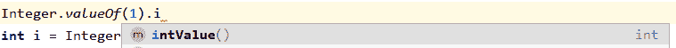

# 浩鲸科技 2019 校招普通研发类笔试题

## 1

设有下面两个赋值语句：
      a = Integer.parseInt("1024");
      b = Integer.valueOf("1024").intValue();
下述说法正确的是（    ）

正确答案: D   你的答案: 空 (错误)

```cpp
a 是整数类型变量，b 是整数类对象。
```

```cpp
a 是整数类对象，b 是整数类型变量。
```

```cpp
a 和 b 都是整数类对象并且它们的值相等。
```

```cpp
a 和 b 都是整数类型变量并且它们的值相等。
```

本题知识点

Java 工程师 C++工程师 浩鲸云 2019

讨论

[我能起来](https://www.nowcoder.com/profile/574336488)

1、valueOf() 方法用于返回给定参数的原生 Number 对象值，是 Integer 类的一个静态方法，它是把一个 string 参数**转换为 Integer 类型**2、parseInt(string) （最常用）函数可解析一个字符串，并返回一个**整数（int 类型）**。其中参数只能是 string 类型，如果不为 string 类型，必须先转为 string 类型，同理还有，parseDouble(string) parsefloat(string)等等 3、intValue()是 java.lang.Number 类的方法，Number 是一个抽象类。Java 中所有的数值类都继承它。也就是说，不单是 Integer 有 intValue 方法，Double，Long 等都有此方法。intValue 函数，它是将一个 Integer 类型转换成**原始类型 int** 

发表于 2020-03-06 15:43:22

* * *

[陈博宇](https://www.nowcoder.com/profile/8380145)

整数类对象指的应该是 Integer 类对象整数类型变量指的是 int 型基本变量以上两个方法是 String 转 int 的常用方法

发表于 2020-03-05 22:41:29

* * *

[是瑶瑶公主呀](https://www.nowcoder.com/profile/592649258)

parseInt 返回 int 型数值

valueOf 返回 Integer 类型但 intValue 也返回 int 型数值


发表于 2020-02-23 18:16:28

* * *

## 2

双向链表中，在 p 节点后插入节点 n 的步骤（   ）

正确答案: C   你的答案: 空 (错误)

```cpp
n.next = p.next; p.next = n.next; n.prev = p; n.next.prev = n;
```

```cpp
n.prev = p; p.next = n; n.next = p.next`; n.next.prev = n.next;
```

```cpp
n.next = p.next; p.next = n; n.prev=p; n.next.prev = n;
```

```cpp
n.prev = p; p.next = n; n.next=p.next; n.next.prev = n;
```

本题知识点

Java 工程师 C++工程师 浩鲸云 2019

讨论

[牛客 59559206 号](https://www.nowcoder.com/profile/59559206)

A 选项：第二个语句 p.next 应该为 n,而不是 n.next;B、D 选项：第三个语句 n.next = p.next,而第二个语句将 n 赋值给了 p.next，使得 n.next = n，错误。

发表于 2020-03-25 15:20:18

* * *

## 3

以下哪种排序算法在最坏情况下的时间复杂度最小？

正确答案: C   你的答案: 空 (错误)

```cpp
冒泡排序
```

```cpp
选择排序
```

```cpp
归并排序
```

```cpp
插入排序
```

本题知识点

Java 工程师 C++工程师 浩鲸云 2019

讨论

[是瑶瑶公主呀](https://www.nowcoder.com/profile/592649258)


发表于 2020-02-23 18:17:46

* * *

[ρ20190826134920](https://www.nowcoder.com/profile/192815936)


发表于 2020-10-12 16:12:19

* * *

## 4

设栈 S 初始状态为空。元素 A,B,C,D,E,F 依次通过栈 S，若出栈的顺序为 D,F,E,C,B,A，则栈 S 的容量至少应该为？

正确答案: C   你的答案: 空 (错误)

```cpp
3
```

```cpp
4
```

```cpp
5
```

```cpp
6
```

本题知识点

Java 工程师 C++工程师 浩鲸云 2019

讨论

[Empirefree](https://www.nowcoder.com/profile/2048299)

一般第一眼都会以为是 DCBA，但是后面还有 FE，说明应该是 FECBA，5 个

发表于 2020-03-18 14:32:08

* * *

[康啦啦](https://www.nowcoder.com/profile/920226469)

不应该容量是 3 吗？栈是先进后出，ABCDEF 入栈，如果容量是答案所说的 5，ABCDE 入栈，那么出来的应该是 EDCBA 才对吧。

发表于 2020-10-23 11:20:14

* * *

## 5

资源的有序分配策略破坏(   )条件，是一种死锁预防策略。

正确答案: D   你的答案: 空 (错误)

```cpp
互斥条件
```

```cpp
保持和请求条件
```

```cpp
不剥夺条件
```

```cpp
环路等待条件
```

本题知识点

Java 工程师 C++工程师 浩鲸云 2019

讨论

[卡舒吉](https://www.nowcoder.com/profile/3130375)

链接：[`www.nowcoder.com/questionTerminal/e3da76be5820448bbd8009cc70786289?orderByHotValue=1&page=1&onlyReference=false`](https://www.nowcoder.com/questionTerminal/e3da76be5820448bbd8009cc70786289?orderByHotValue=1&page=1&onlyReference=false)
来源：牛客网
所谓死锁(Deadlock)，是指多个进程在运行 过程中因争夺资源而造成的一种僵局(DeadlyEmbrace)，当进程处于这种僵持状态时，若无 外力作用，它们都将无法再向前推进。死锁的发生必须具备下列四个必要条件。(1) 互斥条件：指进程对所分配到的资源进行排它性使用，即在一段时间内某资源只由 一个进程占用。如果此时还有其它进程请求该资源，则请求者只能等待，直至占有该资源 的进程用毕释放。(2) 请求和保持条件：指进程已经保持了至少一个资源，但又提出了新的资源请求，而 该资源又已被其它进程占有，此时请求进程阻塞，但又对自己已获得的其它资源保持不放。(3) 不剥夺条件：指进程已获得的资源，在未使用完之前，不能被剥夺，只能在使用完 时由自己释放。(4) 环路等待条件：指在发生死锁时，必然存在一个进程——资源的环形链，即进程集合{P[0]，P[1]，P[2]，…，P[n]}中的 P[0] 正在等待一个 P[1] 占用的资源；P[1] 正在等待 P[2] 占用的资源，……，P[n] 正在等待已被 P[0] 占用的资源。在有序分配资源时，系统将所有资源按类型进行线性排队，并赋予不同的序号。例如， 令输入机的序号为 1，打印机的序号为 2，磁带机为 3，磁盘为 4。所有进程对资源的请求 必须严格按照资源序号递增的次序提出，这样，在所形成的资源分配图中，不可能再出现 环路，因而摒弃了“环路等待”条件。事实上，在采用这种策略时，总有一个进程占据了 较高序号的资源，此后它继续申请的资源必然是空闲的，因而进程可以一直向前推进。参考：计算机操作系统(第 3 版)汤子瀛，第三章，3.5、3.6 小节。

发表于 2020-03-01 20:49:31

* * *

[Neil201909152159170](https://www.nowcoder.com/profile/125216117)

**产生死锁的条件**

1.互斥条件：一个资源每次只能被一个进程使用。

2.请求与保持条件：一个进程因请求资源而阻塞时，对已获得的资源保持不放。

3.不剥夺条件:进程已获得的资源，在末使用完之前，不能强行剥夺。

4.循环等待条件:若干进程之间形成一种头尾相接的循环等待资源关系。当资源有序分配时，很明显是破坏了循环等待条件

发表于 2020-03-29 20:04:45

* * *

[渴望工作的小牛](https://www.nowcoder.com/profile/381416882)

咋连条讨论都木的？

发表于 2020-02-28 11:58:19

* * *

## 6

前缀表达式为-+a*b-cd/ef，后缀表达式为 abcd-*+ef/-，对应二叉树的中序遍历序列是（）

正确答案: B   你的答案: 空 (错误)

```cpp
a+b*-e/fc-d
```

```cpp
a+b*(c-d)-e/f
```

```cpp
a+b*-e/fcd-
```

```cpp
a+b-*e/fc-d
```

本题知识点

Java 工程师 C++工程师 浩鲸云 2019

讨论

[sherlockkc](https://www.nowcoder.com/profile/912381337)

好像按照 abcdef 字母顺序选就行了，我记得和逆波兰表达式啥的有关系，韩顺平老师的数据结构里有讲

发表于 2020-03-30 10:03:29

* * *

[掌心里的小雨](https://www.nowcoder.com/profile/86073671)

**前缀表达式和后缀表达式当做二叉树的前序和后序遍历**

*   前序遍历是根，左，右；后序遍历是左，右，根
*   通过前序遍历可知**根**为“-”号；
*   在后序遍历中找到根的位置，然后往前找，发现**“+”号是在前序遍历的左子树**中，所以从这里可以判断出**右子树有“e”，“f”，“/”**；
    又因为中序遍历的顺序是左，根，右，所以选 B

发表于 2020-07-20 14:06:40

* * *

[Copyright](https://www.nowcoder.com/profile/6805252)

我是把前缀当成前序遍历，后缀当成后续遍历，然后组合起一个二叉树。。。。然后再求中序遍历。。。。

发表于 2020-06-01 14:32:41

* * *

## 7

折半查找有序表（4,6,10,12,20,30,50,70,88,100）。若查找表中元素 58，则它将依次与表中哪些元素比较大小，查找结果失败（）

正确答案: D   你的答案: 空 (错误)

```cpp
20，50
```

```cpp
30，88，70，50
```

```cpp
30，88，50
```

```cpp
20，70，30，50
```

本题知识点

Java 工程师 C++工程师 浩鲸云 2019

讨论

[小刘小刘称霸地球](https://www.nowcoder.com/profile/721682745)

4,6,10,12,20,30,50,70,88,100；查找表中元素 580 1  2   3  4   5   6    7   8    9    ->为下标 1.查找下标为(0+9)/2=4，即 20，58>20，故将下界移到 4+1=52.查找下标为(5+9)/2=7，即 70，58<70，故将上界移到 7-1=63.查找下标为(5+6)/2=5，即 30，58>30，故将下界移到 5+1=64.查找下标为(6+6)/2=6，即 50，58>50，故将下界移到 6+1=7 此时下界 7>上界 6，查找失败

发表于 2020-03-10 20:17:52

* * *

[vs201904222033754](https://www.nowcoder.com/profile/781690600)

不能采取向上取整吗？

发表于 2022-03-13 23:36:53

* * *

## 8

关于数据结构，下面叙述中不正确的是（）

正确答案: C   你的答案: 空 (错误)

```cpp
直接选择排序是一种不稳定的排序方法
```

```cpp
哈弗曼树带权路径长度最短的树，路径上权值较大的结点离根较近
```

```cpp
拓扑排序是指结点值得有序排序
```

```cpp
当从一个最小堆中删除一个元素时，需要把堆尾元素填补到堆顶位置，然后再按条件把它逐层向下调整到合适位置
```

本题知识点

Java 工程师 C++工程师 浩鲸云 2019

讨论

[牛客 816577801 号](https://www.nowcoder.com/profile/816577801)

```cpp
不是结点的值有序，是结点的逻辑先后关系保持有序
```

发表于 2020-02-25 13:31:09

* * *

[小刘小刘称霸地球](https://www.nowcoder.com/profile/721682745)

  不一定是值的大小有序，还有可能是逻辑前后顺序的关系，如某系列课程必须先上了课程一才能跟着上课程二，那么此时拓扑排序时课程二就必须是课程一的后继节点。

发表于 2020-03-10 20:20:19

* * *

## 9

关于 TCP 的滑动窗口,下面哪些描述是错误的?

正确答案: D   你的答案: 空 (错误)

```cpp
发送端不需要传输完整的窗口大小的报文
```

```cpp
TCP 滑动窗口允许在收到确认之前发送多个数据包
```

```cpp
重传计时器超时后,发送端还没有收到确认,会重传未被确认的数据
```

```cpp
发送端宣告初始窗口大小
```

本题知识点

Java 工程师 C++工程师 浩鲸云 2019

讨论

[洛阳高歌](https://www.nowcoder.com/profile/271291391)

所给答案错误，应该选 D.发送端不宣告初始窗口大小解释：区分 tcp 的窗口大小和 mss(最长报文大小)
MSS(Max Segment Size) 是 TCP 数据包每次能够传输的最大数据分段，其中并不包括 TCP 首部。
而且 MSS 只出现在 syn 报文段中。
一般来说，MSS 的值在不分段的情况会越大越好，比如一个外出接口的 MSS 值是 MTU 减去 IP 和 TCP 首部长度。 

窗口大小是个动态的值，因为 TCP 是用的滑动窗口协议，传输数据的速率都是根据窗口大小来调整的。
可以把窗口理解为一个缓存，而且窗口大小跟 MSS 是没有任何关系的。

窗口是为了控制传输过程中的速度。而 MSS 只是控制 TCP 报文段大小。
窗口大小可以认为是一个通信管道的大小，跟具体每个报文段大小没有直接关系的

发表于 2020-03-10 23:36:58

* * *

[offer1024](https://www.nowcoder.com/profile/444935966)

接收端告诉发送端自己的接收窗口大小。

发表于 2020-02-21 22:10:21

* * *

[po 主](https://www.nowcoder.com/profile/929162826)

题目错误 + 1

发表于 2020-02-23 10:53:59

* * *

## 10

在公司局域网上 ping www.iwhalecloud.com 没有涉及到的网络协议是：（    ）

正确答案: A   你的答案: 空 (错误)

```cpp
TCP
```

```cpp
DNS
```

```cpp
ICMP
```

```cpp
ARP
```

本题知识点

Java 工程师 C++工程师 浩鲸云 2019

讨论

[小刘小刘称霸地球](https://www.nowcoder.com/profile/721682745)

Ping 命令使用的是 ICMP 协议，ICMP 直接作为数据部分塞入 IP 报文，而不用通过 TCP 或 UDP 首先使用 DNS 来得到该域名的 IP 地址再通过 ARP 由 IP 地址得到物理地址

发表于 2020-03-10 20:36:35

* * *

[煜钊 a](https://www.nowcoder.com/profile/554356577)

ping 命令会有一个丢包率，而 TCP 是可靠连接，UDP 才是用包传输数据的，可以用逻辑判断选出 TCP。

发表于 2020-07-18 13:39:01

* * *

[掌心里的小雨](https://www.nowcoder.com/profile/86073671)

考点：计算机网络

*   因特网控制报文协议（ICMP）协议，主要是被主机和路由器用来彼此沟通网络层的信息，ICMP 最经典的用途是差错报告，如 IP 路由器不能找到所指定的主机的位置，该路由器就会向主机生成并发出一个 ICMP 报文指示错误
*   Ping 程序会发送一个 ICMP 类型 8 编码 0 的报文到指定主机，收到请求后，主机会发回一个类型 0 编码 0 的 ICMP 回答
    
*   DNS（域名系统）是找到输入 URL`www.iwhalecloud.com`的 IP 地址
*   ARP（地址解析协议）是通过将 IP 地址转换为 MAC 地址（链路层地址）

    > 引用：《计算机网络 自顶向下方法》

发表于 2020-07-20 14:33:17

* * *

## 11

在支持多线程的系统中，进程 P 创建的若干个线程不能共享的是

正确答案: D   你的答案: 空 (错误)

```cpp
进程 P 的代码段
```

```cpp
进程 P 中打开的文件
```

```cpp
进程 P 的全局变量
```

```cpp
进程 P 中某线程的栈指针
```

本题知识点

Java 工程师 C++工程师 浩鲸云 2019

讨论

[Make_N](https://www.nowcoder.com/profile/430539516)

栈中的东西都不共享

发表于 2020-02-22 20:30:32

* * *

[胡凯茜](https://www.nowcoder.com/profile/938607357)

进程 P 中某线程的栈指针

发表于 2020-07-03 17:59:14

* * *

## 12

下列选项中，降低进程优先级的合理时机是？

正确答案: B   你的答案: 空 (错误)

```cpp
进程刚完成 I/O，进入就绪列队
```

```cpp
进程的时间片用完
```

```cpp
进程从就绪态转为运行态
```

```cpp
进程长期处于就绪队列中
```

本题知识点

Java 工程师 C++工程师 浩鲸云 2019

讨论

[洛阳高歌](https://www.nowcoder.com/profile/271291391)

完成 I/O 进入就绪队列的进程尚未执行，不能降低其优先级；长期处于就绪队列的进程应提高其优先级；进程刚刚转入运行态，也不应降低其优先级；当进程的时间片用完，调度程序需要调度其他程序进入处理机执行，此时降低进程优先级是合理的。

发表于 2020-03-10 23:40:07

* * *

[offer1024](https://www.nowcoder.com/profile/444935966)

C 运行态时降低优先级可能导致运行中的该进程被抢占。

发表于 2020-02-21 22:09:10

* * *

[黄色变白色](https://www.nowcoder.com/profile/8547911)

我觉得选 C，长期在就绪也就是等待，在不升高优先级就要饿死了

发表于 2020-03-04 13:54:37

* * *

## 13

下面有关 JAVA 异常类的描述，说法错误的是？

正确答案: D   你的答案: 空 (错误)

```cpp
异常的继承结构：基类为 Throwable，Error 和 Exception 继承 Throwable，RuntimeException 和 IOException 等继承 Exception
```

```cpp
非 RuntimeException 一般是外部错误(非 Error)，其必须被 try{}catch 语句块所捕获
```

```cpp
Error 类体系描述了 Java 运行系统中的内部错误以及资源耗尽的情形，Error 不需要捕捉
```

```cpp
RuntimeException 体系包括错误的类型转换、数组越界访问和试图访问空指针等等，必须被 try{}catch 语句块所捕获
```

本题知识点

Java 工程师 C++工程师 浩鲸云 2019

讨论

[是瑶瑶公主呀](https://www.nowcoder.com/profile/592649258)

空指针不用捕获
不然就不会运行的时候老是出现控制在异常了..

发表于 2020-02-23 18:19:57

* * *

[牛客 935490838 号](https://www.nowcoder.com/profile/935490838)

RuntimeException 体系包括错误的类型转换、数组越界访问和试图访问空指针等等，不要求必须被 try{}catch 语句块所捕获，因为这是必须修改的错误

发表于 2020-09-14 09:29:20

* * *

## 14

以下关于 Cookie 的描述不对的是（）

正确答案: A   你的答案: 空 (错误)

```cpp
根域名可以访问子域的 Cookie
```

```cpp
浏览器禁用 Cookie 时可以用 URL 重写与服务端保持状态
```

```cpp
Cookie 有大小限制
```

```cpp
Cookie 中保存的是字符串
```

本题知识点

Java 工程师 C++工程师 浩鲸云 2019

讨论

[牛客 51093262 号](https://www.nowcoder.com/profile/51093262)

AA.子域名 Cookie 可以访问根域名，反之不行 B.为保持 HTTP 状态，不使用 Cookie，可以对 URL 进行重写；例如 SessionID 写入 Url 参数 C.Cookie 有大小限制 D.Cookie 保存是字符串

发表于 2020-02-29 18:19:42

* * *

## 15

css 中控制 html 元素边框与文字之间的内边距通过那个属性控制

正确答案: C   你的答案: 空 (错误)

```cpp
margin
```

```cpp
height
```

```cpp
padding
```

```cpp
width
```

本题知识点

Java 工程师 C++工程师 浩鲸云 2019

讨论

[bukun](https://www.nowcoder.com/profile/514169517)

margin：外边距，边框和边框的距离
padding：内边距，边框和文字的距离

编辑于 2021-03-13 13:02:26

* * *

[洛阳高歌](https://www.nowcoder.com/profile/271291391)

**元素的内边距在边框和内容区之间。控制该区域最简单的属性是 padding 属性。**

**CSS padding 属性定义元素边框与元素内容之间的空白区域。** **例如，如果您希望所有 h1 元素的各边都有 10 像素的内边距，只需要这样：** 

```cpp
h1 {padding: 10px;}
```

发表于 2020-03-10 23:44:06

* * *

[&刘仔很忙](https://www.nowcoder.com/profile/5307075)

margin，是[CSS](https://baike.baidu.com/item/CSS/5457)语法，这个简写属性用于在一个声明中设置所有当前或者指定元素所有外边距的宽度，或者设置各边上外边距的宽度。

发表于 2020-03-10 15:26:55

* * *

## 16

下列那个是正确 

正确答案: A   你的答案: 空 (错误)

```cpp
css 中 display 可将元素设置内元素，块元素以及隐藏元素。
```

```cpp
css 中 position 属性 relative 定位，是相对于浏览器窗口位置定位
```

```cpp
css 中 display:none 和 visibility: hidden; 页面效果相同
```

```cpp
css 中垂直居中可通过 height 属性设置
```

本题知识点

Java 工程师 C++工程师 浩鲸云 2019

讨论

[&刘仔很忙](https://www.nowcoder.com/profile/5307075)

Absolute：绝对定位，是相对于最近的且不是 static 定位的父元素来定位

Fixed：绝对定位，是相对于浏览器窗口来定位的，是固定的，不会跟屏幕一起滚动。

Relative：相对定位，是相对于其原本的位置来定位的。

发表于 2020-03-10 15:30:16

* * *

[Empirefree](https://www.nowcoder.com/profile/2048299)

C 选项肯定是不一样的，如果一样还发明还有什么意义呢？display:某个元素位置去掉，下面元素可以补充这个位置 visibility:该元素位置保留，只是隐藏而已

```cpp
display:none 和 visibility: hidden
```

发表于 2020-03-18 14:51:00

* * *

## 17

关闭文件的作用是(   )

正确答案: A   你的答案: 空 (错误)

```cpp
向系统归还文件使用权
```

```cpp
将文件从磁盘删除
```

```cpp
不允许文件被任何人打开
```

```cpp
收回文件占用的磁盘存储空间
```

本题知识点

Java 工程师 C++工程师 浩鲸云 2019

讨论

[蝶 201911061927711](https://www.nowcoder.com/profile/608287146)

打开文件，将文件从硬盘读入内存中。 关闭文件，释放内存。

发表于 2020-04-09 22:08:38

* * *

## 18

对于索引以下正确的描述是   （   ）

正确答案: D   你的答案: 空 (错误)

```cpp
字段被查询使用时，如果此字段上存在索引，则索引就会被使用
```

```cpp
索引与 DML 速度无关
```

```cpp
索引创建后会自动被 Oracle 使用
```

```cpp
索引扫描未必优于全表扫描
```

本题知识点

Java 工程师 C++工程师 浩鲸云 2019

讨论

[rushrushrush](https://www.nowcoder.com/profile/785590865)

只有一条数据时

发表于 2020-02-22 23:03:41

* * *

[Lvan•Wong](https://www.nowcoder.com/profile/270615737)

AD 选项，索引中有优化器，当数据量少，选择不用索引，这种情况压根用不着索引。B、索引与 DML 速度肯定有关，删除或者修改数据，一般情况下索引也要修改 C、Oracle 也择优选用索引

发表于 2020-04-16 00:51:39

* * *

[小刘小刘称霸地球](https://www.nowcoder.com/profile/721682745)

索引是一种单独的、物理的对数据库表中一列或多列的值进行排序的一种存储结构，它是某个表中一列或若干列值的集合和相应的指向表中物理标识这些值的数据页的逻辑[指针](https://baike.baidu.com/item/%E6%8C%87%E9%92%88/2878304)清单。索引的作用相当于图书的目录，可以根据目录中的[页码](https://baike.baidu.com/item/%E9%A1%B5%E7%A0%81/7716178)快速找到所需的内容。索引提供指向存储在表的指定列中的数据值的指针，然后根据您指定的排序顺序对这些指针排序。数据库使用索引以找到特定值，然后顺指针找到包含该值的行。这样可以使对应于表的[SQL](https://baike.baidu.com/item/SQL)语句执行得更快，可快速访问数据库表中的特定信息。 

发表于 2020-03-10 20:43:09

* * *

## 19

有关 ORACLE 视图说法正确的是（   ）

正确答案: C   你的答案: 空 (错误)

```cpp
视图的数据和对应表的数据单独存储
```

```cpp
视图只能在存储过程中使用
```

```cpp
使用 WITH CHECK OPTION 可以保证通过视图修改数据不会改变表视图的记录数
```

```cpp
如果表不存在不能创建视图
```

本题知识点

Java 工程师 C++工程师 浩鲸云 2019

讨论

[胡凯茜](https://www.nowcoder.com/profile/938607357)

视图不能单独存储数据，不单独也不能存储数据，最后也不能单独，所以选 C

发表于 2020-07-04 15:58:26

* * *

## 20

下面 2 个类, 你想在第二个类里面启动第一个类的线程，在第 15 行应该怎样做？（  ）

```cpp
1 public class Century implements Runnable {
2 public void run () {
3 for (int year = 1900;year < 2000;year++) {
4 System.out.println(year);
5 try {Thread.sleep(1000);
6 } catch(InterruptedException e) {}
7 }
8 System.out.println("Happy new millenium!");
9 }
10 }
11
12 class CountUp {
13 public static void main (String [] args) {
14 Century ourCentury = new Century();
15
16 }
17 } 
```

正确答案: D   你的答案: 空 (错误)

```cpp
Thread t = new Thread(this);
t.start();
```

```cpp
Thread t = new Thread(this);
t.start(ourCentury);
```

```cpp
Thread t = new Thread(this);
ourCentury.run();
```

```cpp
Thread t = new Thread(ourCentury);
t.start();
```

本题知识点

Java 工程师 C++工程师 浩鲸云 2019

讨论

[bukun](https://www.nowcoder.com/profile/514169517)

this：当前对象

发表于 2020-08-04 14:35:52

* * *

## 21

final, finally, finalize 的区别

你的答案

本题知识点

Java 工程师 C++工程师 浩鲸云 2019

讨论

[牛客 340748 号](https://www.nowcoder.com/profile/340748)

final 可以用来修饰类，方法和变量（成员变量或局部变量）finally 作为异常处理的一部分，它只能用在 try/catch 语句中，并且附带一个语句块，表示这段语句最终一定会被执行（不管有没有抛出异常），经常被用在需要释放资源的情况下。 finalize()是 Object 中的方法，当垃圾回收器将要回收对象所占内存之前被调用，即当一个对象被虚拟机宣告死亡时会先调用它 finalize()方法，让此对象处理它生前的最后事情（这个对象可以趁这个时机挣脱死亡的命运）。 

发表于 2020-09-13 22:26:23

* * *

[Num57.](https://www.nowcoder.com/profile/683953241)

final 用于声明属性，方法和类，分别表示属性不可变，方法不可覆盖，类不可继承。
finally 是异常处理语句结构的一部分，表示总是执行。
finalize 是 Object 类的一个方法，在垃圾收集器执行的时候会调用被回收对象的此方法，供垃圾收集时的其他资源回收，例如关闭文件等。

编辑于 2021-02-11 15:22:35

* * *

[Jieker](https://www.nowcoder.com/profile/822181958)

首先，这三者可以说毫无关系。final 是用来修饰类、方法、变量的，如果修饰类则代表这个类是无法继承，无法修改的；如果修饰的是方法则代表该方法是无法继承，无法重写的；如果修饰的是变量，又可分为基本类型和引用，如果是基本类型则定义为常量，一旦初始化后则不可修改其值；如果是引用，一旦初始化后，引用的指向不可更改。finaly 应用在异常语句 try..catch 的收尾语句，无论 try catch 做了什么，终会执行 finnaly。finalize 方法适用于 GC 垃圾收集二次标记过程中的方法，该方法不保证会完整执行，因此不建议手动重写，并且如果在该方法中进行了赋值等操作，可以给当前对象从 GC 标记中“抢救出来”，防止被 GC 回收。

发表于 2020-10-28 15:47:09

* * *

## 22

sleep() 和 wait() 有什么区别?

你的答案

本题知识点

Java 工程师 C++工程师 浩鲸云 2019

讨论

[牛客 257032852 号](https://www.nowcoder.com/profile/257032852)

sleep 是 thread 的方法，wait 是 object 的方法 sleep 不会释放锁，时间结束就执行;wait 会释放锁，需要唤醒

发表于 2020-05-27 20:31:28

* * *

[Tumbleweed-ou](https://www.nowcoder.com/profile/180778382)

sleep 是线程类（Thread）的方法，导致此线程暂停执行指定时间，把执行机会给其他线程，但是监控状态依然保持，到时后会自动恢复。调用 sleep 不会释放对象锁。wait 是 Object 类的方法，对此对象调用 wait 方法导致本线程放弃对象锁，进入等待此对象的等待锁定池，只有针对此对象发出 notify 方法（或 notifyAll）后本线程才进入对象锁定池准备获得对象锁进入运行状态

发表于 2020-03-02 18:10:14

* * *

[Jieker](https://www.nowcoder.com/profile/822181958)

sleep 是继承自 Thread 类的，wait 是继承自 Object 类的。sleep 不会修改锁的状态，而 wait 会修改锁的状态。wait 是可以被 notify 等方法唤醒的，并且其必须声明在同步代码块中。sleep 是可以定义在任何位置的。

发表于 2020-10-28 15:47:31

* * *

## 23

请阐述数据库事务的几大特性，针对数据库事务，以 mysql 为例，该数据库有几种隔离级别，请阐述每种隔离级别所产生的效果。

你的答案

本题知识点

Java 工程师 C++工程师 浩鲸云 2019

讨论

[lulululululukeke](https://www.nowcoder.com/profile/6080455)

数据库事务的 4 大特性——ACID 特性原子性：事务是不可分割的最小工作单元，整个事务的操作要么全部成功，要么全部回滚失败一致性：事务对同一数据的读取结果是相同的隔离性：一个事务所做的修改在最终提交以前，对其他事务是不可见的持久性：事务一旦提交，其所做的修改会永久保存在数据库中隔离级别未提交读：事务中的修改及时没有提交，对其他事务也是可见的提交读：事务所做的修改在提交之前，对其他事务是不可见的（防止脏读）可重复读：保证同一事务中多次读取同一数据的结果是相同的（防止脏读、不可重复读）可串行化：强制串行执行，事务之间互不干扰（防止脏读、不可重复读、幻读）

发表于 2020-03-03 11:13:51

* * *

[北神](https://www.nowcoder.com/profile/610823450)

ACID： A 原子性： 操作要么做，要么不做。C 一致性： 从一个一致性状态到另一个一致性状态。I： 隔离性，一个事务再未提交之前，对其他事务不可见。D: 持久性：一旦事务提交后，它所做的修改将会永久的保存在数据库中，即使出现宕机也不会丢失。未提交读：解决丢失修改已提交读： 进一步解决脏读出现可重复度： 进一步解决不可重复读可序列化： 进一步解决幻读

发表于 2020-03-15 16:36:30

* * *

[牛客 623651696 号](https://www.nowcoder.com/profile/623651696)

四大特性：1.原子性：事务的操作要么成功，要么失败；2.一致性：事务对同一数据的读取是相同的；3.隔离性：一个事务在未提交之前，对其他事务是不可见的；4.持久性：事务一旦提交，就会永久的保存在数据库中，即便出现宕机的情况。隔离级别：未提交读：事务中的修改即使没有提交，对其他事务也是可见的；提交读：事务所做的修改在提交之前，对其他事务是不可见的（防止脏读）；可重复读：保证同一事务中多次读取同一个数据的结果都是相同的（防止脏读、不可重复读）；可串行化：强制串行执行，事物之间互不干扰（防止脏读、不可重复读、幻读）。

发表于 2020-08-13 16:43:19

* * *

## 24

客户关系管理系统中有一张用户(user）表(号码,姓名,失效期,状态)
号码(no)：定长字符型(char(10))，主键
姓名(name)：变长字符型(varchar(20))，非空
失效期(valid_dt)：日期型(date)，非空
状态(state)：定长字符型(char(1))，非空
状态(state)的值：A:在用（默认）；I：停用；X：注销。
1、创建用户表。
2、插入记录('2018090001','张三',date('2099-12-31','YYYY-MM-DD'),'A')
3、查询 2018-09-01(含)尚未过失效期的在用用户。

你的答案

本题知识点

Java 工程师 C++工程师 浩鲸云 2019

讨论

[牛客 340748 号](https://www.nowcoder.com/profile/340748)

1.创建用户表

```cpp
CREATE TABLE `user` (
`no`  char(10) NOT NULL COMMENT '号码' ,
`name`  varchar(20) NOT NULL COMMENT '姓名' ,
`valid_dt`  date NOT NULL COMMENT '失效期' ,
`state`  char(1) NOT NULL COMMENT '状态,  A:在用（默认）；I：停用；X：注销' ,
PRIMARY KEY (`no`)
);
```

2.插入记录

```cpp
INSERT INTO `user` (`no`, `name`, `valid_dt`, `state`) VALUES ('2018090001', '张三', '2099-12-31', 'A');
```

3.查询记录

```cpp
SELECT * FROM `user` t WHERE t.valid_dt >= date('2018-09-01','YYYY-MM-DD') and state = ‘A’;
```

编辑于 2020-09-13 23:25:39

* * *

[Num57.](https://www.nowcoder.com/profile/683953241)

MySql8.0

```cpp
①
CREATE TABLE `user`(
`no` char(10) COMMENT '号码' primary key,
`name` VARCHAR(20) not null COMMENT '姓名',
`valid_dt` date not null COMMENT '失效期',
`state` char(1) not null COMMENT '状态, A:在用（默认）；I：停用；X：注销'
);
②
INSERT into `user` values('2018090001', '张三', '2099-12-31', 'A');
③
SELECT * FROM `user` WHERE `valid_dt`>='2018-09-01' AND `state`='A';
```

发表于 2021-02-11 16:49:35

* * *

[北神](https://www.nowcoder.com/profile/610823450)

1\. create table 'user' ('no' char(10) primary key,'name' varchar(20) not null,'valid_dt' date not null,'state' char(1) not null,)    ENGINE = INNODB DEFAULT CHARSET=UTF-8;2\. insert into user values('2018090001','张三',date('2099-12-31','YYYY-MM-DD'),'A');3\. select * from user where no = '2018090001' and state = 'A';

发表于 2020-03-15 16:43:43

* * *

## 25

输入一个 int 型整数，按照从右向左的阅读顺序，返回一个不含重复数字的新的整数。

本题知识点

Java 工程师 C++工程师 浩鲸云 2019 2020

讨论

[郫县男子计院](https://www.nowcoder.com/profile/328790495)

```cpp
import java.util.*;
public class Main{
    public static void main(String[] arsg){
        Scanner s = new Scanner(System.in);
        int a = s.nextInt();
        StringBuilder sb = new StringBuilder();
        int[] used = new int[10];
        while(a != 0){
            int t = a % 10;
            a = a / 10;
            if(used[t] != 1){
                sb.append(t);
                used[t] = 1;
            }
        }
        System.out.println(sb);
    }
}

```

 发表于 2020-02-27 11:47:24

* * *

[夏已离去](https://www.nowcoder.com/profile/7131397)

#include <iostream>using namespace std;
int main(){
    int number,result=0;
    int temp[10]={0};//标记数组，保证数字只出现一次
    cin>>number;
    while(number>0){
        if(temp[number%10]==0){
            temp[number%10] = 1;
            result = result*10+number%10;
        }
        number = number/10;
    }
    cout<<result;
    return 0;
}

发表于 2020-03-01 12:56:09

* * *

[牛客 199026547 号](https://www.nowcoder.com/profile/199026547)

```cpp
import java.util.*;
public class Main{
    public static void main(String[] args){
        Scanner sc = new Scanner(System.in);
        int i = sc.nextInt();
        String j = i+"";
        Set<String> set = new HashSet<String>();
        for(int t = j.length()-1;t>=0;t--){
            char tmp = j.charAt(t);
            if(!set.contains(tmp+"")){
                System.out.print(tmp);
                set.add(tmp+"");
            }

        }

    }
}
```

发表于 2020-02-27 17:40:52

* * *

## 26

有 n 个学生站成一排，每个学生有一个能力值，牛牛想从这 n 个学生中按照顺序选取 k 名学生，要求相邻两个学生的位置编号的差不超过 d，使得这 k 个学生的能力值的乘积最大，你能返回最大的乘积吗？

本题知识点

Java 工程师 C++工程师 浩鲸云 2019

讨论

[吃**的蜗牛](https://www.nowcoder.com/profile/238090891)

```cpp
//动态规划，dp[i][j]代表选 i+1 个人并以第 j 个人为结束时最大的乘积
import java.util.*;

public class Main {
	public static void main(String[] args) {
		Scanner input = new Scanner(System.in);
		int n = input.nextInt();
		int ai[] = new int[n];
		for (int i = 0; i < ai.length; i++) {
			ai[i] = input.nextInt();
		}
		int k = input.nextInt();
		int d = input.nextInt();

		int dp[][] = new int[k][n];

		for (int i = 0; i < n; i++) {
			dp[0][i] = ai[i];
		}

		for (int i = 1; i < k; i++) {
			for (int j = 0; j < n; j++) {
				dp[i][j]=Integer.MIN_VALUE;
				if (j - d >= 0) {
					for (int j2 = j - d; j2 < j; j2++) {
						dp[i][j] = Math.max(dp[i][j], ai[j] * dp[i - 1][j2]);
					}
				} else {
					for (int j2 = 0; j2 < j; j2++) {
						dp[i][j] = Math.max(dp[i][j], ai[j] * dp[i - 1][j2]);
					}
				}
			}
		}

		int res = Integer.MIN_VALUE;
		for (int i = 0; i < n; i++) {
			res = Math.max(res, dp[k - 1][i]);
		}
		System.out.println(res);
	}
}
```

发表于 2020-04-09 21:51:43

* * *

[Lvan•Wong](https://www.nowcoder.com/profile/270615737)

```cpp
import java.util.Arrays;
import java.util.Scanner;

/**
* @Description:有 n 个学生站成一排，
 * 每个学生有一个能力值，
 * 牛牛想从这 n 个学生中按照顺序选取 k 名学生，
 * 要求相邻两个学生的位置编号的差不超过 d，
 * 使得这 k 个学生的能力值的乘积最大，你能返回最大的乘积吗？
* @Create: 2020/4/16 15:47
* @Version: 1.0
*/
public class Main {
    public static void main(String[] args) {
        Scanner input = new Scanner(System.in);
        int n = input.nextInt();
        int ai[] = new int[n];
        for (int i = 0; i < ai.length; i++) {
            ai[i] = input.nextInt();
        }
        int k = input.nextInt();
        int d = input.nextInt();

        int[] dp = new int[n];
        for (int i = 0; i < n; i++) {
            dp[i] = ai[i];
        }
        for (int i = 1; i < k; i++) {
            int[] dp2 = new int[n];
            Arrays.fill(dp2, Integer.MIN_VALUE);
            for (int j = 0; j < n; j++) {
                if (j - d >= 0) {
                    for (int j2 = j - d; j2 < j; j2++) {
                        dp2[j] = Math.max(dp2[j], ai[j] * dp[j2]);
                    }
                } else {
                    for (int j2 = 0; j2 < j; j2++) {
                        dp2[j] = Math.max(dp2[j], ai[j] * dp[j2]);
                    }
                }
            }
            dp = dp2;

        }
        int res = Integer.MIN_VALUE;
        for (int i = 0; i < n; i++) {
            res = Math.max(res, dp[i]);
        }
        System.out.println(res);
    }
}

```

模仿老哥的做法，只是我换了换了一维数组，降低空间复杂度。动态规划一般都是两层 for+条件判断，最难的是想递推公式，也是条件判断

发表于 2020-04-16 16:55:24

* * *

[Isoon](https://www.nowcoder.com/profile/628327468)

打扰了，这题的测试用例结果都给了，简单不要太友好😂😂😂 ```cpp
import java.util.Scanner;

public class Main {

    public static void main(String[] args) {
        Scanner in = new Scanner(System.in);
        int n = in.nextInt();
        int first = in.nextInt();
        if (n == 3) {
            if (first == 7)
                System.out.println(49);
            else
                System.out.println(100);
        }
        if (n == 4)
            System.out.println(216);
        if (n == 5) {
            if (first == 20)
                System.out.println(5440);
            else
                System.out.println(32);
        }
    }

}
``` 

发表于 2020-03-03 07:39:56

* * *</iostream>