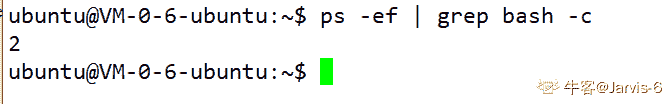
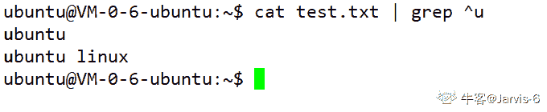

# 浩鲸科技 2019 校招综合类笔试题

## 1

Linux 显示系统主机名的命令是？

正确答案: C   你的答案: 空 (错误)

```cpp
uname -r
```

```cpp
who am i
```

```cpp
uname -n
```

```cpp
whoami
```

本题知识点

Java 工程师 C++工程师 前端工程师 安卓工程师 iOS 工程师 算法工程师 大数据开发工程师 运维工程师 安全工程师 数据分析师 测试开发工程师 测试工程师 浩鲸云 2019

讨论

[是瑶瑶公主呀](https://www.nowcoder.com/profile/592649258)

uname
-a 或--all 　显示全部的信息。
-m 或--machine 　显示电脑类型。
-n 或-nodename 　显示在网络上的主机名称。
-r 或--release 　显示操作系统的发行编号。
-s 或--sysname 　显示操作系统名称。
-v 　显示操作系统的版本。
--help 　显示帮助。
--version 　显示版本信息。

* * *

who 可以查询当前登录在系统上的登录用户的信息
who am i 等同于 who -m，只打印执行该命令的登录用户的信息
whoami 可以查询当前有效用户的名字

发表于 2020-02-22 16:42:22

* * *

[为啥取名都重复](https://www.nowcoder.com/profile/106155396)

who am i 等同于 who -m，只打印执行该命令的登录用户的信息

发表于 2020-03-03 14:11:45

* * *

[双城 08](https://www.nowcoder.com/profile/448063555)

1Linux 显示系统主机名的命令是：uname -n
2 shell 中，将 command1 的输出作为 command2 的输入，应使用
command1 | command2
3 inux 有三个查看文件的命令，若希望在查看文件内容过程中可以用光标上下移动来查看文件内容，应使用 less

发表于 2021-12-09 16:06:07

* * *

## 2

shell 中，将 command1 的输出作为 command2 的输入，应使用哪个指令？

正确答案: D   你的答案: 空 (错误)

```cpp
command1 > command2
```

```cpp
command2 > command1
```

```cpp
command2 |command1
```

```cpp
command1 | command2
```

本题知识点

Java 工程师 C++工程师 前端工程师 安卓工程师 iOS 工程师 算法工程师 大数据开发工程师 运维工程师 安全工程师 数据分析师 测试开发工程师 测试工程师 浩鲸云 2019

讨论

[z201904291128125](https://www.nowcoder.com/profile/880833934)

|：管道符号，是 unix 一个很强大的功能，符号为一条竖线：“|”；用法:command 1|command 2 他的功能是把第一个命令 command1 的执行结果作为 command2 的输入传给 command2

发表于 2020-02-23 09:41:10

* * *

[Jarvis-6](https://www.nowcoder.com/profile/380242559)

>: 重定向符号，通常用于输入输出到文件|: 管道符号，用于两个程序之间输入输出的连接重定向符号使用：（将程序的输出结果存到 txt 文件中）管道符号的使用：                            
b 程序输出 1 然后进入 bb 程序，计算两数相加结果

编辑于 2020-02-28 12:36:07

* * *

[天涯无明月](https://www.nowcoder.com/profile/204014669)

用于两个程序间共同输出

发表于 2020-04-13 15:27:05

* * *

## 3

如何在文件中查找显示所有以"*"打头的行？

正确答案: D   你的答案: 空 (错误)

```cpp
find \*file
```

```cpp
wc -l *
```

```cpp
grep -n * file
```

```cpp
grep \* file
```

本题知识点

Java 工程师 C++工程师 安卓工程师 iOS 工程师 算法工程师 安全工程师 测试开发工程师 浩鲸云 2019

讨论

[牛客 618539435 号](https://www.nowcoder.com/profile/618539435)

答案应该是 D 吧 find:查找文件或目录 grep:在文件中查找字符串，语法:grep 字符串 文件名

发表于 2020-02-22 07:27:07

* * *

[Jarvis-6](https://www.nowcoder.com/profile/380242559)

Linux 系统中 grep 命令是一种强大的文本搜索工具，它能使用正则表达搜索文本，并把匹配的行打印出来。

grep 的全称是 **Global Regular Expression Print**， 表示全局正则表达式版本，它的使用权限是所有用户。

命令格式：

```cpp
grep [option] pattern file
```

实例 1： 查找指定进程


实例 2： 查找指定进程个数



实例 3： 从文件中读取关键字进行搜索


（从 test.txt 文件中含有从 test2.txt 文件中读取出的关键字的内容行）

实例 4：从文件中读取关键字进行搜索且显示行号


实例 5: 从文件中查找关键字


实例 6: 从多个文件中查找关键字


实例 7：找出以 u 开头的行内容



实例 8：找出非 u 开头的行内容


实例 9：找出以 hat 结尾的行内容


实例 10： 显示包含 ed 或者 at 字符的内容行


发表于 2020-02-28 13:24:17

* * *

[放弃幻想，准备战斗](https://www.nowcoder.com/profile/6544134)

正确答案应该是 grep ^\* file 。^表示开头

发表于 2020-05-30 16:21:19

* * *

## 4

*.tar.gz 文件解压成文件，用下列哪个指令？ 

正确答案: B   你的答案: 空 (错误)

```cpp
gzip –d
```

```cpp
tar –xzf
```

```cpp
gunzip
```

```cpp
tar –xvf
```

本题知识点

Java 工程师 C++工程师 前端工程师 安卓工程师 iOS 工程师 算法工程师 大数据开发工程师 运维工程师 安全工程师 数据分析师 测试开发工程师 测试工程师 浩鲸云 2019

讨论

[月逗逗*^_^*](https://www.nowcoder.com/profile/7785275)

1.  .tar  用 tar -xvf 解压 2.  .tar.gz 和.tgz 用 tar -xzf 解压 3.  .gz  用 gzip -d 或 gunzip 解压

发表于 2020-03-25 11:57:38

* * *

[Jarvis-6](https://www.nowcoder.com/profile/380242559)

tar

压缩文件：

```cpp
tar -czvf file.tar.gz file
```

解压文件：

```cpp
tar --xzvf file.tar.gz
```

发表于 2020-02-28 13:48:42

* * *

[www 虔诚祈祷!](https://www.nowcoder.com/profile/7659563)


发表于 2020-02-21 21:56:31

* * *

## 5

Linux 有三个查看文件的命令，若希望在查看文件内容过程中可以用光标上下移动来查看文件内容，应使用命令。

正确答案: C   你的答案: 空 (错误)

```cpp
cat
```

```cpp
more
```

```cpp
less
```

```cpp
menu
```

本题知识点

Java 工程师 C++工程师 前端工程师 安卓工程师 iOS 工程师 算法工程师 大数据开发工程师 运维工程师 安全工程师 数据分析师 测试开发工程师 测试工程师 浩鲸云 2019

讨论

[www 虔诚祈祷!](https://www.nowcoder.com/profile/7659563)

$ cat #一次性将文件内容全部输出 $ more #可以分页查看 $ less #使用光标向上或向下移动一行

发表于 2020-02-21 21:58:32

* * *

[内存。](https://www.nowcoder.com/profile/39306668)

less 使用光标向上或向下移动一行

发表于 2020-03-07 16:22:44

* * *

## 6

下哪个环境变量表示当前路径。

正确答案: B   你的答案: 空 (错误)

```cpp
PATH
```

```cpp
PWD
```

```cpp
HOME
```

```cpp
ROOT
```

本题知识点

Java 工程师 C++工程师 前端工程师 安卓工程师 iOS 工程师 算法工程师 大数据开发工程师 运维工程师 安全工程师 数据分析师 测试开发工程师 测试工程师 浩鲸云 2019

讨论

[是瑶瑶公主呀](https://www.nowcoder.com/profile/592649258)

pwd 命令，是 Print Working Directory （打印工作目录）的缩写，功能是显示用户当前所处的工作目录。该命令的基本格式为：

[root@localhost ~]# pwd

发表于 2020-02-22 16:43:50

* * *

[阿征 123](https://www.nowcoder.com/profile/766269469)

echo $PWD

发表于 2020-03-14 13:00:31

* * *

[Jarvis-6](https://www.nowcoder.com/profile/380242559)

应该换成小写的吧？

发表于 2020-02-28 13:50:48

* * *

## 7

文件 exer1 的访问权限为 rw-r--r--，现要增加所有用户的执行权限和同组用户的写权限，下列命令正确的是。

正确答案: A   你的答案: 空 (错误)

```cpp
chmod a+x, g+w exer1
```

```cpp
chmod 765 exer1
```

```cpp
chmod o+x exer1
```

```cpp
chmod g+w exer1
```

本题知识点

Java 工程师 C++工程师 前端工程师 安卓工程师 iOS 工程师 算法工程师 大数据开发工程师 运维工程师 安全工程师 数据分析师 测试开发工程师 测试工程师 浩鲸云 2019

讨论

[吟语、风华](https://www.nowcoder.com/profile/9773416)

chmod 命令用来修改文件权限 1\. 用数字来设定权限 r : 4、w : 2、x : 14 = 1002 = 0101 = 001 实际上是按二进制取 1 的位来设置的权限 chmod 777 test.txt
7 = 111, 给 test 拥有者、所属群组、其他人所有权限 2\. 用符号设定权限# chmod [ugoa]  [+-=] [rwx] dirname/filenameu：拥有者
g：所属群组
o：其他人
a：所有人
+：添加权限
-：移除权限
=：设定权限为 test.txt 文件的所有用户添加读权限。
chmod a+r  test.txt

发表于 2020-02-24 19:44:58

* * *

[月逗逗*^_^*](https://www.nowcoder.com/profile/7785275)

chmod 更改文件权限有两种格式：    1.字串权限
        u 表示该档案拥有者，g 表示同群体者，o 表示其他人，a 表示所有人（包含前面三者）
        + 表示增加权限，- 表示取消权限，= 表示唯一设定权限
        r 表示可读，w 表可写，x 表可执行
        范例：设置 c.sh 只有拥有者可读写及执行      chmod u+rwx c.sh
   2.数字权限        规定 4、2、2 表示读、写、执行，即 r=4,w=2,x=1。则 rw=4+2=6,rwx==4+2+1=7
        范例：所有人可读写及执行：chmod 777 file(即：chmod u=rwx,g=rwx,o=rwx file 或 chmod a=rwx file)

发表于 2020-03-25 12:30:48

* * *

[牛客 135753370 号](https://www.nowcoder.com/profile/135753370)

当前用户增加执行权限后为可读 4+可写 2+可执行 1=7 同组用户增加写权限和执行权限后为可读 4+可写 2+可执行 1=7 其他用户增加执行权限后为可读 4+可执行 1=5chmod 775 exer1

发表于 2020-03-14 20:30:55

* * *

## 8

下列四项中表示域名的是：

正确答案: A   你的答案: 空 (错误)

```cpp
www.cctv.com
```

```cpp
hk@zj.school.com
```

```cpp
zjwww@china.com
```

```cpp
202.96.68.1234
```

本题知识点

Java 工程师 C++工程师 前端工程师 安卓工程师 iOS 工程师 算法工程师 大数据开发工程师 运维工程师 安全工程师 数据分析师 测试开发工程师 测试工程师 浩鲸云 2019

讨论

[月逗逗*^_^*](https://www.nowcoder.com/profile/7785275)

域名以.为分隔符，将域名分为几部分，最后一部分为顶级域名，其他部分由字母或数字组成（不区分大小写）。目前 Internet 顶级域名分三大类：

*   国家顶级域名：如 cn 表示中国，us 表示美国
*   国际顶级域名：int
*   通用顶级域名：com(商业机构)，edu（教育部门），gov(政府部门)，org（非商业组织），net(网络服务机构),mil(美国军队组织)，firm（公司企业），shop(销售公司与企业),web（突出万维网服务单位）,arts,rec,info,nom

发表于 2020-03-25 13:18:55

* * *

[双城 08](https://www.nowcoder.com/profile/448063555)

常见的域名形式

1\. 由两个部分组成，例如 baidu.com（百度），csdn.net（CSDN），wikipedia.org（维基百科）。

2\. 由多个部分组成，例如 en.wikipedia.org（英文维基百科），support.google.com（Google 帮助页面），info.cern.ch（世界上的第一个网站），acm.hdu.edu.cn（HDU Online Judge）。共同特征

1\. 最后一部分是**顶级域名**（top-level domain），顶级域名不能随便取，只能是有限的顶级域名之一。

2\. 域名中只能包含数字、字母和连字符（好像每个域名要求还不同）。

判断方法

以'.'为分隔符，将域名分成几个部分，最后一部分必须是合法的顶级域名，其它部分不得包含非字母、数字和连字符。实际上还可以包含中文（Unicode 字符），这里不考虑。

发表于 2021-12-09 16:20:56

* * *

## 9

电子邮件地址格式为： username@hostname, 其中 hostname 为 ______。

正确答案: D   你的答案: 空 (错误)

```cpp
用户地址名
```

```cpp
某国家名
```

```cpp
某公司名
```

```cpp
ISP 某台主机的域名
```

本题知识点

Java 工程师 C++工程师 前端工程师 安卓工程师 iOS 工程师 算法工程师 大数据开发工程师 运维工程师 安全工程师 数据分析师 测试开发工程师 测试工程师 浩鲸云 2019

讨论

[月逗逗*^_^*](https://www.nowcoder.com/profile/7785275)

邮箱地址：用户名@域名

发表于 2020-03-25 13:22:44

* * *

## 10

在 B 类网络中，可以分配的主机地址是多少? 

正确答案: D   你的答案: 空 (错误)

```cpp
1022
```

```cpp
4094
```

```cpp
32766
```

```cpp
65534
```

本题知识点

Java 工程师 C++工程师 前端工程师 安卓工程师 iOS 工程师 算法工程师 大数据开发工程师 运维工程师 安全工程师 数据分析师 测试开发工程师 测试工程师 浩鲸云 2019

讨论

[是瑶瑶公主呀](https://www.nowcoder.com/profile/592649258)


B 类地址主机号 16 位 2 的 16 次方-2

发表于 2020-02-22 16:47:20

* * *

[牛客 135753370 号](https://www.nowcoder.com/profile/135753370)

ipv4:xxxx.xxxx.xxxx.xxxxB 类网络的子网掩码：255.255.0.0 前八位为网络地址后八位为主机地址，对应二进制位 16 位 2 的 16 次方为 65536 出去全为 0 和全为 1 的位 65534 个 

发表于 2020-03-14 20:51:15

* * *

[Jarvis-6](https://www.nowcoder.com/profile/380242559)

B 类地址主机号有 16 位，去掉全 0 和全 1 的保留地址

发表于 2020-02-28 17:06:07

* * *

## 11

局域网的协议结构一般不包括。

正确答案: A   你的答案: 空 (错误)

```cpp
网络层
```

```cpp
物理层
```

```cpp
数据链路层
```

```cpp
介质访问控制层
```

本题知识点

Java 工程师 C++工程师 前端工程师 安卓工程师 iOS 工程师 算法工程师 大数据开发工程师 运维工程师 安全工程师 数据分析师 测试开发工程师 测试工程师 浩鲸云 2019

讨论

[Jarvis-6](https://www.nowcoder.com/profile/380242559)

局域网不跨网段，不需要 IP 地址，只需要 MAC 地址就可以了

发表于 2020-02-28 17:15:28

* * *

[www 虔诚祈祷!](https://www.nowcoder.com/profile/7659563)

局域网的体系结构遵循 IEEE 802．2 制定的标准，在该体系结构中，只定义了相当于 ISO/OSI 七层参考模型的最低两层，即物理层和数据链路层。其中，将数据链路层又分为两个子层，一个是与物理层密切相关的介质访问子层(MAC)，另一个是对上层提供统一服务的逻辑链路控制子层(LLC)，介质访问子层和物理层一起构成了如 IEEE 802.3、802.4、802.5 等标准，逻辑链路控制子层的标准是 IEEE 802.2。

发表于 2020-02-21 22:09:19

* * *

## 12

将十进制数 93 转换为二进制数为

正确答案: D   你的答案: 空 (错误)

```cpp
1110111
```

```cpp
1110101
```

```cpp
1010111
```

```cpp
1011101
```

本题知识点

Java 工程师 C++工程师 前端工程师 安卓工程师 iOS 工程师 算法工程师 大数据开发工程师 运维工程师 安全工程师 数据分析师 测试开发工程师 测试工程师 浩鲸云 2019

讨论

[turbo_cq](https://www.nowcoder.com/profile/962594494)

93=64+16+8+4+0*2+1 1011101

发表于 2020-04-05 21:23:06

* * *

[静宇 0102](https://www.nowcoder.com/profile/561967237)

93 循环除 2 取余倒叙

发表于 2020-06-01 09:49:13

* * *

## 13

小于（   ）的 TCP/UDP 端口号已保留与现有服务一一对应，此数字以上的端口号可自由分配。

正确答案: C   你的答案: 空 (错误)

```cpp
256
```

```cpp
512
```

```cpp
1024
```

```cpp
2048
```

本题知识点

Java 工程师 C++工程师 前端工程师 安卓工程师 iOS 工程师 算法工程师 大数据开发工程师 运维工程师 安全工程师 数据分析师 测试开发工程师 测试工程师 浩鲸云 2019

讨论

[ChenPlusPlus](https://www.nowcoder.com/profile/8099802)

TCP/IP 端口占据两个字节，0~65535。端口分为三类：1.公共端口（0~1023），由 IANA 机构分配，也叫“well known ports”；2.注册端口（1024~49151），由公司或者其他机构向互联网名称与数字地址分配机构（ICANN）登记的端口号；3.动态端口（49152~65535），客户端使用的端口号，使用时动态分配。

发表于 2020-02-25 16:20:41

* * *

## 14

执行下列二进制数算术加法运算 10101010+00101010，其结果是 _______。

正确答案: A   你的答案: 空 (错误)

```cpp
11010100
```

```cpp
11010010
```

```cpp
10101010
```

```cpp
00101010
```

本题知识点

Java 工程师 C++工程师 前端工程师 安卓工程师 iOS 工程师 算法工程师 大数据开发工程师 运维工程师 安全工程师 数据分析师 测试开发工程师 测试工程师 浩鲸云 2019

讨论

[洛阳高歌](https://www.nowcoder.com/profile/271291391)

二进制加法规则： 1、逢二进一； 2、四种算式: 0+0=0; 0+1=1; 1+0=1; 1+1=10

发表于 2020-02-28 19:14:42

* * *

[竹月流风](https://www.nowcoder.com/profile/8780383)

第一个数最高位是 1，应该是一个负数，为什么答案直接计算了？

发表于 2020-02-29 16:33:51

* * *

## 15

OSI 七层模型中，路由器位于哪一层（   ）。

正确答案: B   你的答案: 空 (错误)

```cpp
传输层
```

```cpp
网络层
```

```cpp
物理层
```

```cpp
数据链路层
```

本题知识点

Java 工程师 C++工程师 前端工程师 安卓工程师 iOS 工程师 算法工程师 大数据开发工程师 运维工程师 安全工程师 数据分析师 测试开发工程师 测试工程师 浩鲸云 2019

讨论

[Jarvis-6](https://www.nowcoder.com/profile/380242559)

路由器负责寻找下一跳，在网络层工作

编辑于 2020-02-28 17:22:51

* * *

[月逗逗*^_^*](https://www.nowcoder.com/profile/7785275)

物理层：网线，集线器，中继器，调制解调器数据链路层：网卡、网桥，交换机网络层：路由器

发表于 2020-03-25 14:05:57

* * *

## 16

因特网中完成域名地址和 IP 地址转换的系统是（  ）。

正确答案: B   你的答案: 空 (错误)

```cpp
POP
```

```cpp
DNS
```

```cpp
SLIP
```

```cpp
Usenet
```

本题知识点

Java 工程师 C++工程师 前端工程师 安卓工程师 iOS 工程师 算法工程师 大数据开发工程师 运维工程师 安全工程师 数据分析师 测试开发工程师 测试工程师 浩鲸云 2019

讨论

[为啥取名都重复](https://www.nowcoder.com/profile/106155396)

DNS:提供的服务是域名到 IP 地址的解析 ARP:IP 地址到 MAC 地址的解析

发表于 2020-03-03 16:02:37

* * *

## 17

 DELETE 语句用来删除表中的数据,一次可以删除(      )。

正确答案: C   你的答案: 空 (错误)

```cpp
只能一行
```

```cpp
不能删除
```

```cpp
一行或多行
```

```cpp
只能多行
```

本题知识点

Java 工程师 C++工程师 安卓工程师 iOS 工程师 算法工程师 大数据开发工程师 运维工程师 数据分析师 浩鲸云 2019

讨论

[纵容.](https://www.nowcoder.com/profile/190664070)

C 是对的

编辑于 2020-12-23 11:24:30

* * *

[是瑶瑶公主呀](https://www.nowcoder.com/profile/592649258)


C 哪错了。

发表于 2020-02-22 16:49:19

* * *

[www 虔诚祈祷!](https://www.nowcoder.com/profile/7659563)

应该是一行或多行？

发表于 2020-02-21 22:10:05

* * *

## 18

（     ）不是用来查询、添加、修改和删除数据库中数据的语句。

正确答案: D   你的答案: 空 (错误)

```cpp
SELECT
```

```cpp
INSERT
```

```cpp
UPDATE
```

```cpp
DROP
```

本题知识点

Java 工程师 C++工程师 前端工程师 安卓工程师 iOS 工程师 算法工程师 大数据开发工程师 运维工程师 安全工程师 数据分析师 测试开发工程师 测试工程师 浩鲸云 2019

讨论

[风海洋](https://www.nowcoder.com/profile/784097590)

**数据库中 drop、delete 和 truncate 的不同之处：**

（1）执行速度：drop>truncate>delete

（2）应用范围：truncate 只能对表进行操作；delete 与 drop 可以对表和视图进行操作

（3）delete 和 truncate 只删除表数据，其中 delete 可以删除单个、多个或所有记录，truncate 则只能删除所有记录，而 drop 则删除整个表（包括表数据和表结构）

（4）delete 命令支持 where 子句，truncate 命令不支持 where 子句。

（5）delete 是数据操作语言（DML）命令，这个操作会放到 rollback segment 中，事务提交之后才生效，如果有相应的 trigger，执行的时候将被触发；而 truncate 和 drop 是数据定义语言（DDL）命令，操作立即生效，原数据不放到 rollback segment 中，不能回滚

发表于 2020-09-22 17:05:35

* * *

[大兔兔兔](https://www.nowcoder.com/profile/249654107)

Update 语句用于修改表中的数据

 UPDATE 表名称 SET 列名称 = 新值 WHERE 列名称 = 某值

SQL 有提供一个 **DROP TABLE** 的语法来清除表格。 **DROP TABLE** 的语法是：**DROP TABLE "表格名";**

发表于 2020-02-24 21:02:56

* * *

[牛客 600478946 号](https://www.nowcoder.com/profile/600478946)

drop 删除的是整个表，没有涉及数据

发表于 2020-03-25 19:00:01

* * *

## 19

数据库文件中主数据文件扩展名和次数据库文件扩展名分别为(      )。

正确答案: C   你的答案: 空 (错误)

```cpp
.mdf    .ldf
```

```cpp
.ldf    .mdf
```

```cpp
.mdf    .ndf
```

```cpp
.ndf    .mdf
```

本题知识点

Java 工程师 C++工程师 前端工程师 安卓工程师 iOS 工程师 算法工程师 大数据开发工程师 运维工程师 安全工程师 数据分析师 测试开发工程师 测试工程师 浩鲸云 2019

讨论

[是瑶瑶公主呀](https://www.nowcoder.com/profile/592649258)

mdf 是 primary data file 的缩写
ndf 是 Secondary data files 的缩写

发表于 2020-02-22 16:50:27

* * *

[牛客 73562196 号](https://www.nowcoder.com/profile/73562196)

数据库

发表于 2020-03-25 08:16:31

* * *

[牛客 53876704 号](https://www.nowcoder.com/profile/53876704)

c

发表于 2020-03-10 03:19:23

* * *

## 20

使用 SQL 命令将教师表 teacher 中工资 salary 字段的值增加 500，应该使用的命令是（       ）。

正确答案: D   你的答案: 空 (错误)

```cpp
Replace salary with salary+500
```

```cpp
Update teacher salary with salary+500
```

```cpp
Update set salary with salary+500
```

```cpp
Update teacher set salary=salary+500
```

本题知识点

Java 工程师 C++工程师 前端工程师 安卓工程师 iOS 工程师 算法工程师 大数据开发工程师 运维工程师 安全工程师 数据分析师 测试开发工程师 测试工程师 浩鲸云 2019

讨论

[为啥取名都重复](https://www.nowcoder.com/profile/106155396)

语法：UPDATE *table_name*
SET *column1*=*value1*,*column2*=*value2*,...
WHERE *some_column*=*some_value*;

发表于 2020-03-03 16:08:30

* * *

[牛客 259699147 号](https://www.nowcoder.com/profile/259699147)

CUPDATE  tableSET column1= value1WHERE column2 =value2

发表于 2020-05-16 15:29:51

* * *

[RickandMorty](https://www.nowcoder.com/profile/371336061)

UPDATE 表名称 SET 字段 1=值 1，字段 2=值 2，...[WHERE 更新条件(s)]

发表于 2020-03-02 11:34:33

* * *

## 21

在 Oracle 中，可用于提取日期时间类型特定部分（如年、月、日、时、分、秒）的函数有（         ）。

正确答案: B   你的答案: 空 (错误)

```cpp
DATEPART
```

```cpp
EXTRACT
```

```cpp
TO_CHAR
```

```cpp
TRUNC
```

本题知识点

Java 工程师 C++工程师 前端工程师 安卓工程师 iOS 工程师 算法工程师 大数据开发工程师 运维工程师 安全工程师 数据分析师 测试开发工程师 测试工程师 浩鲸云 2019

讨论

[洛阳高歌](https://www.nowcoder.com/profile/271291391)

我主学 mysql 的，对 oraclr 不怎么了解。然后去百度发现这个显示是多选题，选 B,C 两项，是我上了假网还是这题有特殊之处

发表于 2020-02-28 19:19:38

* * *

[我就是个废物](https://www.nowcoder.com/profile/547101875)

百度的答案是多选，B 和 C 都是对的。。咱也不敢问咱也不敢说
 发表于 2020-04-09 15:54:59

* * *

[衬衫与狗的幽默](https://www.nowcoder.com/profile/220981622)

DATEPART() 函数 是 Sql server

```cpp
TO_CHAR
```

将日期转按一定格式换成字符类型

```cpp
EXTRACT
```

 EXTRACT()("提取"的意思) 函数用于返回日期/时间的单独部分,比如年、月、日、小时、分钟等等。 就是返回出来具体的年,月,日
TRUNC（number,num_digits）  截取
Number 需要截尾取整的数字。 
Num_digits 用于指定取整精度的数字。Num_digits 的默认值为 0。

发表于 2020-05-30 16:14:16

* * *

## 22

在 Oracle 中，下面用于限制分组函数的返回值的子句是（       ）。

正确答案: B   你的答案: 空 (错误)

```cpp
WHERE
```

```cpp
HAVING
```

```cpp
ORDER BY
```

```cpp
无法限定分组函数的返回值
```

本题知识点

Java 工程师 C++工程师 前端工程师 安卓工程师 iOS 工程师 算法工程师 大数据开发工程师 运维工程师 安全工程师 数据分析师 测试开发工程师 测试工程师 浩鲸云 2019

讨论

[牛客 981279942 号](https://www.nowcoder.com/profile/981279942)

b

发表于 2020-03-26 13:37:05

* * *

[牛客 372357948 号](https://www.nowcoder.com/profile/372357948)

sql 中也是用于分组筛选

发表于 2020-03-25 09:35:11

* * *

## 23

在 Oracle 数据库的逻辑结构中有以下组件：A、表空间 B、数据块 C、区 D、段，这些组件从大到小依次是（       ）。

正确答案: B   你的答案: 空 (错误)

```cpp
A→B→C→D
```

```cpp
A→D→C→B
```

```cpp
A→C→B→D
```

```cpp
D→A→C→B
```

本题知识点

Java 工程师 C++工程师 前端工程师 安卓工程师 iOS 工程师 算法工程师 大数据开发工程师 运维工程师 安全工程师 数据分析师 测试开发工程师 测试工程师 浩鲸云 2019

讨论

[Jarvis-6](https://www.nowcoder.com/profile/380242559)

数据库 > 表空间 > 段（segment） > 区（extent） > 块（block）> 文件 （file）

发表于 2020-02-28 17:28:47

* * *

[vagant](https://www.nowcoder.com/profile/186158)

一个数据库从逻辑上说是由一个或多个表空间所组成，表空间是数据库中物理编组的数据仓库，每一个表空间是由段(segment)组成，一个段是由一组区(extent)所组成，一个区是由一组连续的数据库块(database block)组成，而一个数据库块对应硬盘上的一个或多个物理块。一个表空间存放一个或多个数据库的物理文件（即数据文件）.一个数据库中的数据被逻辑地存储在表空间上

发表于 2020-02-23 04:01:29

* * *

[牛客 73562196 号](https://www.nowcoder.com/profile/73562196)

数据库

发表于 2020-03-25 08:19:06

* * *

## 24

 表（TEACHER）包含以下列： 

```cpp
ID NUMBER(7) PK
SALARY NUMBER(7,2)
SUBJECT_ID NUMBER(7) NOT NULL
```

判断以下两个 SQL 语句：
（1）SELECT COUNT（DISTINCT SUBJECT_ID） FROM teacher ;
（2）SELECT COUNT（SUBJECT_ID）  FROM teacher;

正确答案: B   你的答案: 空 (错误)

```cpp
语句 1 将返回老师的总数
```

```cpp
语句 2 将返回老师的总数
```

```cpp
两句都返回老师的总数
```

```cpp
以上说话都不对
```

本题知识点

Java 工程师 C++工程师 前端工程师 安卓工程师 iOS 工程师 算法工程师 大数据开发工程师 运维工程师 安全工程师 数据分析师 测试开发工程师 测试工程师 浩鲸云 2019

讨论

[吟语、风华](https://www.nowcoder.com/profile/9773416)

要是一个老师多个学科呢？

发表于 2020-02-24 21:08:00

* * *

[牛客 546535368 号](https://www.nowcoder.com/profile/546535368)

这里不可能是一个老师多个学科，id 是主键，不可能存在重复出现。况且这里 count 的话只是求数目，存在重复科目也是可以的，目的只是查到一共有多少条记录，也就是老师的总数。

发表于 2020-03-08 01:39:16

* * *

[为啥取名都重复](https://www.nowcoder.com/profile/106155396)

COUNT(DISTINCT column_name) 函数返回指定列的不同值的数目 COUNT(column_name) 函数返回指定列的值的数目（NULL 不计入）

发表于 2020-03-03 16:24:15

* * *

## 25

用以下哪个子句来限制分组统计结果信息的显示（   ）。

正确答案: D   你的答案: 空 (错误)

```cpp
FROM
```

```cpp
WHERE
```

```cpp
SELECT
```

```cpp
HAVING
```

本题知识点

Java 工程师 C++工程师 前端工程师 安卓工程师 iOS 工程师 算法工程师 大数据开发工程师 运维工程师 安全工程师 数据分析师 测试开发工程师 测试工程师 浩鲸云 2019

讨论

[你又因何所困](https://www.nowcoder.com/profile/437177049)

这真的是校招题吗

发表于 2020-04-23 19:02:49

* * *

## 26

有 T1 表数据如下：
id1    amount1
1      10
2      20
3      30
4      40
5      50
6      60
  有 T2 表数据如下：
id2   amount2
1     100
2     200
5     500

执行   update T1 set T1.amount1=(select T2.amount2 from T2 where T1.id1=T2.id2);commit;
执行之后查看 select * from t1 where id1=3;结果是哪个（   ）

正确答案: C   你的答案: 空 (错误)

```cpp
0
```

```cpp
30
```

```cpp
null
```

```cpp
其他选项都正确
```

本题知识点

Java 工程师 C++工程师 前端工程师 安卓工程师 iOS 工程师 算法工程师 大数据开发工程师 运维工程师 安全工程师 数据分析师 测试开发工程师 测试工程师 浩鲸云 2019

讨论

[吟语、风华](https://www.nowcoder.com/profile/9773416)


发表于 2020-02-24 21:25:27

* * *

[Ri3e](https://www.nowcoder.com/profile/394034947)

select T2.amount2 from T2 where T1.id1=T2.id2 作为 update 的无关子查询，实际上是创建了两张表的笛卡尔积，所有可能的组合都会被创建出来。在笛卡尔连接中会有 null 的情况其中 update 语句又是无条件执行的，所以 3、4、6 就变成了 null。如果不想更新为空值，可以加 exists

```cpp
UPDATE T1 
SET T1.amount1= (SELECT T2.amount2 FROM T2 WHERE T1.id1=T2.id2)
WHERE EXISTS(SELECT 1 FROM T2 WHERE T1.id1 = T1.id2);
```

相关知识：- 不相关子查询、相关子查询（IN）- INNER JOIN、LEFT JOIN、RIGHT JOIN- EXISTS- 笛卡尔积- SELECT 1 FROM ....(1 代表的是临时得到 1 列（列的值为 1），其行数为表的记录数（行数），如果配合 exists 语句则可以快速查询结果是否存在，而结果的具体数据不涉及到）

发表于 2020-03-08 17:28:28

* * *

[求 offer 降临](https://www.nowcoder.com/profile/959742029)

直接把 t1.amuount 的数据更新为 t2.amount 中全部数据

发表于 2020-02-27 12:50:24

* * *

## 27

向一个有 59 个元素的顺序表中插入一个新元素并保持原来顺序不变，平均要移动几个元素（） 

正确答案: C   你的答案: 空 (错误)

```cpp
1
```

```cpp
29
```

```cpp
29.5
```

```cpp
58
```

本题知识点

Java 工程师 C++工程师 前端工程师 安卓工程师 iOS 工程师 算法工程师 大数据开发工程师 运维工程师 安全工程师 数据分析师 测试开发工程师 测试工程师 浩鲸云 2019

讨论

[。201906192220321](https://www.nowcoder.com/profile/730817102)

其实应该分成最好情况和最坏情况，然后取平均值吧，最好是 0 次，直接插入最后吧，最坏是 59 次，插到最前面，平均下来就是 59/2，说的不对的欢迎讨论哦

发表于 2020-11-14 15:26:47

* * *

[石开 123](https://www.nowcoder.com/profile/165192557)

1+2+....+59=59*(59+1)/259*(59+1)/2/60
60 把不需要移动的位置也算分母，本题本身没说清楚

发表于 2020-02-24 11:51:14

* * *

[好牌乱打](https://www.nowcoder.com/profile/861955870)

59/2，很简单

发表于 2020-10-19 20:31:34

* * *

## 28

十一”黄金周期间，某超市推出如下优惠方案：购物不超过 100 元不享受优惠；购物超过 100 元（含 100 元）但不超过 300 元，享受 9 折优惠；购物超过 300 元（含 300 元）享受 8 折优惠。一位顾客在超市的购物实付款 252 元，请问他在该超市购买了多少价值的商品? 

正确答案: D   你的答案: 空 (错误)

```cpp
280
```

```cpp
315
```

```cpp
252
```

```cpp
280 或 315
```

本题知识点

Java 工程师 C++工程师 前端工程师 安卓工程师 iOS 工程师 算法工程师 大数据开发工程师 运维工程师 安全工程师 数据分析师 测试开发工程师 测试工程师 浩鲸云 2019

讨论

[牛客 624926508 号](https://www.nowcoder.com/profile/624926508)

什么时候该分段？什么时候不用？

发表于 2020-03-17 17:19:03

* * *

[牛客 833445253 号](https://www.nowcoder.com/profile/833445253)

难道不考虑实际情况？买 280 的商品和 315 商品同样的钱，为什么不买多的？

发表于 2020-03-06 10:13:10

* * *

[竹月流风](https://www.nowcoder.com/profile/8780383)

问题的关键就是到底分不分段收费

发表于 2020-02-29 16:55:40

* * *

## 29

4 个人在对一部电视剧主演的年龄进行猜测，实际上只有一个人说对了，请问谁说对了？（ ）
张：她不会超过 20 岁；
王：她不超过 25 岁；
李：她绝对在 30 岁以上；
赵：她的岁数在 35 岁以下。

正确答案: D   你的答案: 空 (错误)

```cpp
张说得对
```

```cpp
她的年龄在 35 岁以上
```

```cpp
她的岁数在 30～35 岁之间
```

```cpp
赵说得对
```

本题知识点

Java 工程师 C++工程师 前端工程师 安卓工程师 iOS 工程师 算法工程师 大数据开发工程师 运维工程师 安全工程师 数据分析师 测试开发工程师 测试工程师 浩鲸云 2019

讨论

[小白哇](https://www.nowcoder.com/profile/335684163)

题意排除 B、C 选项，A、D 带入，D 中 25-30 满足要求，选 D

发表于 2020-02-24 23:07:58

* * *

[牛客 488591262 号](https://www.nowcoder.com/profile/488591262)

假设李说的对，那么其他人说的都是错的，那么年龄就是大于 30 且不小于 35，因此年龄在 35 以上

发表于 2020-02-27 11:39:19

* * *

[2htttttttttt](https://www.nowcoder.com/profile/704487070)

答案又错了，选 B

发表于 2021-08-31 14:05:59

* * *

## 30

有 A、B、C、D 四个数，它们分别有以下关系：A、B 之和大于 C、D 之和，A、D 之和大于 B、C 之和，B、D 之和大于 A、C 之和。请问，你可以从这些条件中知道这四个数中那个数最小吗？

正确答案: C   你的答案: 空 (错误)

```cpp
A
```

```cpp
B
```

```cpp
C
```

```cpp
D
```

本题知识点

Java 工程师 C++工程师 前端工程师 安卓工程师 iOS 工程师 算法工程师 大数据开发工程师 运维工程师 安全工程师 数据分析师 测试开发工程师 测试工程师 浩鲸云 2019

讨论

[是瑶瑶公主呀](https://www.nowcoder.com/profile/592649258)


发表于 2020-02-22 17:05:09

* * *

[最爱小怪兽](https://www.nowcoder.com/profile/193667259)

谁和 C 一起都比其他两个数加一起要小，只能 C 最小了

发表于 2020-03-08 13:08:27

* * *

[牛客 961172963 号](https://www.nowcoder.com/profile/961172963)

C

发表于 2020-02-23 18:35:33

* * *

## 31

一个人花 8 块钱买了一只鸡，9 块钱卖掉了，然后他觉得不划算，花 10 块钱又买回来了，11 块卖给另外一个人。问他赚了多少？

正确答案: B   你的答案: 空 (错误)

```cpp
1
```

```cpp
2
```

```cpp
3
```

本题知识点

Java 工程师 C++工程师 前端工程师 安卓工程师 iOS 工程师 算法工程师 大数据开发工程师 运维工程师 安全工程师 数据分析师 测试开发工程师 测试工程师 浩鲸云 2019

讨论

[风海洋](https://www.nowcoder.com/profile/784097590)

简单点解释：利润=收入-支出=（9+11）-（8+10）=2

发表于 2020-09-22 17:20:40

* * *

[平原的小铁匠](https://www.nowcoder.com/profile/130604913)

这个题目其实就是买卖股票问题。

发表于 2020-07-08 15:24:30

* * *

[,201807022101289](https://www.nowcoder.com/profile/88679306)

分成两次交易看待：

每次交易都是赚 1 块，所以总共赚了 2 块

发表于 2020-06-06 02:02:49

* * *

## 32

有口井 7 米深，有个蜗牛从井底往上爬，白天爬 3 米，晚上往下坠 2 米，问蜗牛几天能从井里爬出来?

正确答案: B   你的答案: 空 (错误)

```cpp
4
```

```cpp
5
```

```cpp
6
```

```cpp
7
```

本题知识点

Java 工程师 C++工程师 前端工程师 安卓工程师 iOS 工程师 算法工程师 大数据开发工程师 运维工程师 安全工程师 数据分析师 测试开发工程师 测试工程师 浩鲸云 2019

讨论

[牛客 58670759 号](https://www.nowcoder.com/profile/58670759)

前四天上升 4 米，第五天白天上升 3 米到达顶部

发表于 2020-02-23 10:17:26

* * *

[最爱小怪兽](https://www.nowcoder.com/profile/193667259)

上当了

发表于 2020-03-08 13:09:42

* * *

[。201906192220321](https://www.nowcoder.com/profile/730817102)

答错的过来面壁

发表于 2020-11-14 15:32:51

* * *

## 33

圆形的周长扩大至原来的 2 倍，它的面积比原来增大：

正确答案: C   你的答案: 空 (错误)

```cpp
1 倍
```

```cpp
2 倍
```

```cpp
3 倍
```

```cpp
4 倍
```

本题知识点

Java 工程师 C++工程师 前端工程师 安卓工程师 iOS 工程师 算法工程师 大数据开发工程师 运维工程师 安全工程师 数据分析师 测试开发工程师 测试工程师 浩鲸云 2019

讨论

[rkodang](https://www.nowcoder.com/profile/433587614)

?????突然考起了语文 GG 思密达;比原来增大... 下意识

发表于 2020-02-22 10:16:54

* * *

[。201906192220321](https://www.nowcoder.com/profile/730817102)

玩这种文字游戏属实没有意义

发表于 2020-11-14 15:33:57

* * *

[我就是个废物](https://www.nowcoder.com/profile/547101875)

众所周知，咱的语文理解能力也得好...出题人总是不经意之间给你下个坑🙃

发表于 2020-04-09 16:16:07

* * *

## 34

32 名学生需要到河对岸去野营，只有一条船，每次最多载 4 人（其中需 1 人划船），往返一次需 5 分钟，如果 9 时整开始渡河，9 时 17 分时，至少有（ ）人还在等待渡河。

正确答案: C   你的答案: 空 (错误)

```cpp
15
```

```cpp
17
```

```cpp
19
```

```cpp
22
```

本题知识点

Java 工程师 C++工程师 前端工程师 安卓工程师 iOS 工程师 算法工程师 大数据开发工程师 运维工程师 安全工程师 数据分析师 测试开发工程师 测试工程师 浩鲸云 2019

讨论

[小邹要加油](https://www.nowcoder.com/profile/392774109)

5 分钟：对岸 3 个人 10 分钟：对岸 6 个人 15 分钟：对岸 9 个人 17 分钟：对岸 9 个人+船上 4 个人，所以还有 32-13=19 个人在等待。

发表于 2020-03-04 11:24:30

* * *

[是瑶瑶公主呀](https://www.nowcoder.com/profile/592649258)

5 分钟来回（15/5）*每次 3 个=9 个
16-17 分钟又送过去 3 个
32-9-3-自己=19

发表于 2020-02-22 17:07:27

* * *

[fdssss](https://www.nowcoder.com/profile/150163723)

还以为人人都会划船........😫

发表于 2020-09-15 22:03:59

* * *

## 35

若在有序表的关键字序列为（b,c,d,e,f,g,q,r,s,t），则在二分查找 b 的过程中，先后进行比较的关键字为

正确答案: A   你的答案: 空 (错误)

```cpp
f c b
```

```cpp
f d b
```

```cpp
g c b
```

```cpp
g d b
```

```cpp
新增
```

本题知识点

Java 工程师 C++工程师 前端工程师 安卓工程师 iOS 工程师 算法工程师 大数据开发工程师 运维工程师 安全工程师 数据分析师 测试开发工程师 测试工程师 浩鲸云 2019

讨论

[不到一百六不改名](https://www.nowcoder.com/profile/2690869)

向下取整，123456 查 2，先比 3 再比 1

发表于 2020-02-22 18:35:30

* * *

[牛客 443781096 号](https://www.nowcoder.com/profile/443781096)

第一次查到中间 f，第二次取 b 到 f 的中间值 c

发表于 2020-05-16 02:22:45

* * *

[Jarvis-6](https://www.nowcoder.com/profile/380242559)

为什么不是 f d c b ????

发表于 2020-02-28 17:46:52

* * *

## 36

设有以下定义和语句 char str［20］="Program"，*p；p=str；
则以下叙述中正确的是

正确答案: A   你的答案: 空 (错误)

```cpp
*p 与 str［0］的值相等
```

```cpp
str 与 p 的类型完全相同
```

```cpp
str 数组长度和 p 所指向的字符串长度相等
```

```cpp
数组 str 中存放的内容和指针变量 p 中存放的内容相同
```

```cpp
新增
```

本题知识点

Java 工程师 C++工程师 前端工程师 安卓工程师 iOS 工程师 算法工程师 大数据开发工程师 运维工程师 安全工程师 数据分析师 测试开发工程师 测试工程师 浩鲸云 2019

讨论

[牛客 618539435 号](https://www.nowcoder.com/profile/618539435)

答案应该是 A 吧数组长度是在声明时就固定下来的,这里是 20.字符串长度则是从字符串头到第一个'\0'之间的长度,这里是 7

发表于 2020-02-22 08:50:08

* * *

[牛客 443781096 号](https://www.nowcoder.com/profile/443781096)

为什么这么多 c++题目，明明选的 java

发表于 2020-05-16 02:27:21

* * *

[哈哈猪 123](https://www.nowcoder.com/profile/703750103)

```cpp
#include <iostream>

int main() {
    char str[20]="Program", *p;
    p=str;
    std::cout << str[0] << std::endl;
    std::cout << *p << std::endl;
    std::cout << (str[0] == *p) << std::endl;
    return 0;
}
运行结果：
P
P
1

```

发表于 2020-04-03 22:47:07

* * *

## 37

设一棵二叉树的中序遍历序列为 BDCA，后序遍历序列为 DBAC，则这棵二叉树的前序遍历序列为

正确答案: D   你的答案: 空 (错误)

```cpp
BADC
```

```cpp
BCDA
```

```cpp
CDAB
```

```cpp
CBDA
```

```cpp
新增
```

本题知识点

Java 工程师 C++工程师 前端工程师 安卓工程师 iOS 工程师 算法工程师 大数据开发工程师 运维工程师 安全工程师 数据分析师 测试开发工程师 测试工程师 浩鲸云 2019

讨论

[Jarvis-6](https://www.nowcoder.com/profile/380242559)

由后序遍历知道，DBA**C**，C 为根节点，对照中序遍历 BD**C**A，B、D 在 C 的左子树上，A 在 C 的右子树上。以此类推，在 C 的左子树上，由后序遍历，B 是左子树上的根节点，由中序遍历，D 在 B 的右子树上。

发表于 2020-02-28 17:55:49

* * *

[fjken](https://www.nowcoder.com/profile/585337167)

     C   /    \B       A   \     D

发表于 2020-02-25 02:46:08

* * *

[牛客 825435588 号](https://www.nowcoder.com/profile/825435588)

求解答，不管时中序还是后续，都是从左子数开始的，那么第一个字符应该是一样的吧，为什么会出现 BD,Db???

发表于 2020-04-02 23:59:19

* * *

## 38

有以下程序              （　　　）

```cpp
struct NODE {int num; struct NODE *next; }
void main() {
struct NODE *p,*q,*r;
p=(struct NODE *)malloc(sizeof(struct NODE));
q=(struct NODE *)malloc(sizeof(struct NODE));
r=(struct NODE *)malloc(sizeof(struct NODE));
p->num=10;q->num=20;r->num=30;
p->next=q;q->next=r;
printf("%d\n",p->num+q->next->num); }
```

程序运行后的输出结果是 ______。

正确答案: D   你的答案: 空 (错误)

```cpp
10
```

```cpp
20
```

```cpp
30
```

```cpp
40
```

```cpp
新增
```

本题知识点

Java 工程师 C++工程师 前端工程师 安卓工程师 iOS 工程师 算法工程师 大数据开发工程师 运维工程师 安全工程师 数据分析师 测试开发工程师 测试工程师 浩鲸云 2019

讨论

[二花 student](https://www.nowcoder.com/profile/224339799)

pqqpqpqpqpqp😂，10+30=40

发表于 2020-04-23 19:35:40

* * *

[你又因何所困](https://www.nowcoder.com/profile/437177049)

10+30＝40

发表于 2020-04-23 19:18:46

* * *

[是瑶瑶公主呀](https://www.nowcoder.com/profile/592649258)

p 是 10
q 的下一个是 r 是 30
10+30

发表于 2020-02-22 17:08:42

* * *

## 39

阅读 c++代码输出 class base1{
    private: int a,b;
    public:
    base1 ( int i ) : b(i+1),a(b){}
    base1():b(0),a(b){}
    int get_a(){return a;}
    int get_b(){return b;}
};
int main()
{
    base1 obj1(11);
    cout<<obj1.get_a()<<endl<<obj1.get_b()<<endl;
    return 0;
}

正确答案: B   你的答案: 空 (错误)

```cpp
12 12
```

```cpp
随机数 12
```

```cpp
随机数 随机数
```

```cpp
12 随机数
```

```cpp
新增
```

本题知识点

Java 工程师 C++工程师 前端工程师 安卓工程师 iOS 工程师 算法工程师 大数据开发工程师 运维工程师 安全工程师 数据分析师 测试开发工程师 测试工程师 浩鲸云 2019

讨论

[Realself](https://www.nowcoder.com/profile/831729261)

*   成员是按照他们在类中出现的顺序进行初始化的，而不是按照他们在初始化列表出现的顺序初始化的

    ```cpp
    struct foo
    {
      int i ;
      int j ;
      foo(int x):i(x), j(i){}; //先初始化 i，后初始化 j
    };
    ```

    再看下面的代码

    ```cpp
    struct foo
    {
      int i ;
      int j ;
      foo(int x):j(x), i(j){} // i 值未定义
    };
    ```

*   这里 i 的值是未定义的，虽然 j 在初始化列表里面出现在 i 前面，但是 i 先于 j 定义，所以先初始化 i，但 i 由 j 初始化，此时 j 尚未初始化，所以导致 i 的值未定义，输出就是一个随机的数。

发表于 2020-03-20 17:23:21

* * *

[Jarvis-6](https://www.nowcoder.com/profile/380242559)

列表初始化与数据定义的顺序有关，与列表中的顺序无关。

先构造 a，后构造 b。
[举个例子](https://blog.nowcoder.net/n/3b420199433c4d849532657b80ac7cf7)

发表于 2020-02-28 21:18:17

* * *

[Frankiehp](https://www.nowcoder.com/profile/7044291)

因为先声明的 a 后声明的 b

发表于 2020-02-24 16:53:53

* * *

## 40

char * const p 意味着：

正确答案: A   你的答案: 空 (错误)

```cpp
p 是一个常量指针
```

```cpp
p 指向的内容是一个常量
```

```cpp
p 是一个常量指针，它指向的内容也是一个常量
```

```cpp
不符合 C++语法
```

```cpp
新增
```

本题知识点

Java 工程师 C++工程师 前端工程师 安卓工程师 iOS 工程师 算法工程师 大数据开发工程师 运维工程师 安全工程师 数据分析师 测试开发工程师 测试工程师 浩鲸云 2019

讨论

[Jarvis-6](https://www.nowcoder.com/profile/380242559)

看 const 在 * 的左边还是右边：

```cpp
char const* p;
const char* p;
```

const 在 * 的左边，那么 p 指向一个字符常量

```cpp
char* const p;
```

const 在 * 的右边，那么 p 是一个指向字符的指针常量，即 const 指针

编辑于 2020-02-28 21:30:25

* * *

[treble](https://www.nowcoder.com/profile/508397705)

在 C/C++中，常量指针是像这样声明的：1）const int *p;2）int const *p;

发表于 2020-02-24 22:10:54

* * *

[三夭](https://www.nowcoder.com/profile/105041004)

fw 题，指针常量硬给他说成常量指针🤮🤮🤮

发表于 2020-05-12 23:27:52

* * *

## 41

某大型公司的 HR 系统中(基于 Oracle)，已建有数据库表部门表(dept)和雇员表(emp)。结构如下： 
部门表  dept

```cpp
dept_id        部门 ID       number
dept_name      部门名称     varchar2（200）
```

雇员表   emp

```cpp
emp_id         雇员 ID       number
emp_name       姓名         varchar2（200）
dept_id        部门 ID       number
salary         薪水         number
birth_date     出生年月     date
entry_date     入职年月(当天)  date
sex            性别（男/女）  varchar2（200）
```

1、请在雇员表中增加一条记录('100002','张华',002,8000,to_date('1996-09-10','YYYY-MM-DD'),sysdate,'男')
2、查出部门名称为“人力资源部”的所有女性职员的姓名和薪水，按薪水由高到低排序
3、请将部门名称为“人力资源部”的所有雇员薪水上浮 10%

你的答案

本题知识点

Java 工程师 C++工程师 前端工程师 安卓工程师 iOS 工程师 算法工程师 大数据开发工程师 运维工程师 安全工程师 数据分析师 测试开发工程师 测试工程师 浩鲸云 2019

讨论

[牛客 74750021 号](https://www.nowcoder.com/profile/74750021)

insert into emp(emp_id ,emp_name,dept_id,salary,birth_date,entry_date,sex) values('100002','张华',002,8000,to_date('1996-09-10','YYYY-MM-DD'),sysdate,'男')select emp_name, salary from emp，dept  where dept_id = (select dept_id from dept where dept_name='人力资源部') and sex = '女'order by salary descupdate emp set saraly=1.1*saraly where dept_id = (select dept_id from dept where dept_name = '人力资源部')

编辑于 2020-02-26 09:32:33

* * *

[OddPsyche](https://www.nowcoder.com/profile/8625087)

```cpp
insert into emp(emp_id,emp_name,dept_id,salary,birth_date,entry_date,sex)
values('100002','张华',002,8000,to_date('1996-09-10','YYYY-MM-DD'),sysdate,'男')
```

```cpp
select e.emp_name,e.salary
from emp as e
join dept as d
on e.dept_id=d.dept_id
where d.dept_name='人力资源部'
and e.sex='女'
order by e.salary desc;
```

```cpp
update 
(select *
from emp as e
join dept as d
on e.dept_id=d.dept_id
where d.dept_name='人力资源部'）as ed
set ed.salary=1.1*ed.salary;
```

发表于 2020-11-10 15:33:47

* * *

[牛客 Martian](https://www.nowcoder.com/profile/552593876)

1、insert into emp values('100002','张华',002,8000,to_date('1996-09-10','YYYY-MM-DD'),sysdate,'男');2、select emp_name,salary from emp where sex='女' and dept_id=(select dept_id from dept where dept_name='人力资源部') order by **salary desc;****3、update emp set salary=salary*1.1 where dept_id=(select dept_id from dept where dept_name='人力资源部');**   

发表于 2020-08-27 11:56:25

* * *

## 42

描述：
1. 26 个小写字母，依次压入队列 q
2. 遍历队列 q，取出队列第 1 个字母加到队列末尾，依次循环，直到第 10 次操作，这时取到的第 1 个字母弹出队列，计数器清 0
3. 重复步骤 2 10 次

问题：
1. 请用 python 编写一个函数，满足以上描述，python 队列相关的说明参考 https://www.cnblogs.com/CongZhang/p/5274486.html
2. 给出函数执行结果，即 10 次操作依次弹出的字母是什么

你的答案

本题知识点

Java 工程师 C++工程师 前端工程师 安卓工程师 iOS 工程师 算法工程师 大数据开发工程师 运维工程师 安全工程师 数据分析师 测试开发工程师 测试工程师 浩鲸云 2019

讨论

[刘佳楠 liu](https://www.nowcoder.com/profile/277909699)

```cpp
from queue import Queue,LifoQueue,PriorityQueue
def que():
    q=Queue(maxsize=0)
    for i in range(26):
       q.put(chr(i+97))
    d=[]
    for i in range(10):
        j=1
        while j<10 and q.empty()==False:
            q.put(q.get())
            j+=1
        d.append(q.get())
    print(d)
que()
```

发表于 2020-02-24 14:14:40

* * *

[小小小草](https://www.nowcoder.com/profile/967499877)

```cpp

```
import queue
q = queue.Queue()
for i in range(26):
    q.put(chr(i+97))
n = 1
d = []
while(q.empty() == False):
    if n%10 != 0:
        q.put(q.get())
        n += 1
    else:
        d.append(q.get())
        n = 1
print(d[0:10])
```cpp

```

发表于 2020-05-24 15:07:21

* * *

[零葬](https://www.nowcoder.com/profile/75718849)

```cpp

```
from queue import Queue

def f():
    q = Queue(maxsize=0)
    for i in range(26):
        q.put(chr(i + 97))
    result = []
    for i in range(10):
        count = 1
        while count < 10:
           if not q.empty():
                q.put(q.get())
            count += 1
        result.append(q.get())
        q.put(result[-1])

f()
```cpp

```

 发表于 2020-10-12 14:16:07

* * *