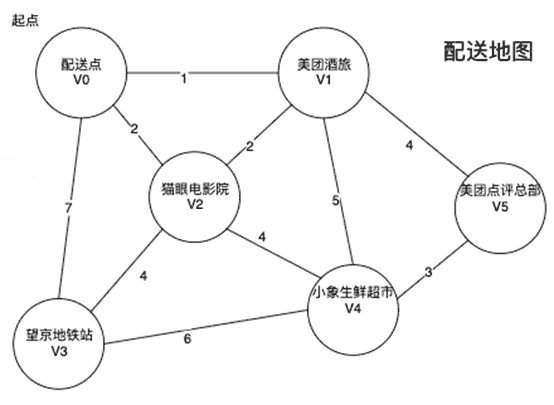

# 美团 2020 校招测试方向笔试题

## 1

当使用美团团购购买套餐后，后台发生了哪些业务流程？

你的答案

本题知识点

测试工程师 美团 2020

讨论

[可乐 Chloe](https://www.nowcoder.com/profile/9063163)

1.客户端向服务器发起套餐购买，并带上用户 ID、商品 ID、token 等信息。2.服务器收到客户端发送的请求，校验用户信息以及根据商品 ID 查询库存情况，并将库存结果返回客户端。3.客户端收到服务器返回的库存结果，库存不足提示库存信息，库存充足选择调起支付平台的支付 SDK，并向服务器发起支付请求。4.服务器收到客户端的请求后，校验用户信息以及商品 ID 信息，校验通过，服务器通知支付平台后台生成预支付订单号。支付平台后台将生成的预支付订单信息，预支付订单号返回美团服务器后台。美团服务器后台收到信息，生成带签名的客户端支付信息返回客户端。5.客户端输入密码确认支付、支付平台返回支付结果给客户端。6.客户端同步支付结果到美团服务器后台，上传订单信息、签名、用户信息等。7.服务器根据客户端上传的订单号以及订单信息到支付宝或微信服务后台验单 8.验单通过，更新库存信息，更新用户账户信息，更新商品信息，更新订单管理记录，并将结果返回客户端和商家 9.客户端、商家后台订单信息及时更新，提示购买成功，并生成对应的订单记录。

编辑于 2020-06-01 01:22:31

* * *

[♕did](https://www.nowcoder.com/profile/888634386)

1.通过域名，dns 解析到对应 ip，请求网关，通过负载均衡和转发请求到对应服务器 2.三次握手，请求购买套餐接口，查询用户 token 是否有效，数据库数据是否有库存，是否符合情况 3.符合接口逻辑，返回 success，并通过 kafka 等消息将操作 发送给别的服务 4.将返回数据返回给浏览器，浏览器解析 html 代码，呈现用户

发表于 2020-03-11 17:05:09

* * *

[虫草君](https://www.nowcoder.com/profile/644613669)

购买套餐的信息首先进入中间件，类似 rocketmq 队列，然后后端服务开始对该消息进行消费，通过规则运算查看是否库存满足，如果库存满足，在线程安全的模式下，将库存减 1，同时发起扣款请求，提示客户完成支付，客户输入选择好支付渠道，输入密码完成支付后，后台确定支付信息，核对支付金额，确认无误，发起交易成功信息，提示客户交易成功，同时告知商家客户已经成功团购好某套餐，并将对应的团购金额支付给商家

发表于 2020-04-18 12:17:36

* * *

## 2

当用户第一次打开并登陆外卖 App 后会看到 App 的首页，打开和登陆外卖 App 的过程中发生了哪些具体的动作行为以及可能导致的缺陷？

你的答案

本题知识点

测试工程师 美团 2020

讨论

[牛客 991652147 号](https://www.nowcoder.com/profile/991652147)

抓住重点的词汇：第一次打开  第一次登陆   看到首页 1.第一次打开的话就会进行一个初始化，这个是所有哦 APP 都要注意的点，可能会出现闪退，可能会出现加载时间长（这些分析的点都是将自己看做一个用户的使用角度去考虑的）2.第一次登陆，登陆用户界面都是要进行简单的校验，校验可能出现的错误：登陆不上，密码没有，账户异常都是 3.看到首页，美团的首页都是要定位到门店信息的，c/s 模式有一个比较大的特点就是客户端会缓存一部分的数据，但是第一次打开的用户要根据自己的网络，定位来进行加载然后进行缓存，因此可以注意的就是缺陷可能包括定位，网络

发表于 2021-03-19 22:48:51

* * *

[最棒的 Celia!](https://www.nowcoder.com/profile/884774667)

第一次打开的话应该还有新用户注册的过程吧，或是登录即代表默认注册。

发表于 2020-03-17 13:19:44

* * *

[不朽一页](https://www.nowcoder.com/profile/988934090)

打开 APP 的时候应该还有一个检测更新，安卓的 APP 是可以进行强更的（虽然很少见到）。

发表于 2020-04-17 16:18:00

* * *

## 3

当使用美团 App 扫描美团单车上的二维码后，发生了什么？

你的答案

本题知识点

测试工程师 美团 2020

讨论

[牛客 792686738 号](https://www.nowcoder.com/profile/792686738)

1、二维码识别：开锁 URL、车辆 ID、车辆 GPS 等

2、网络通信

3、业务逻辑判断：车锁状态正常、账号余额充足、用户身份正常、用户 GPS 位置正常

4、执行开锁、计费开始

发表于 2020-03-18 20:02:24

* * *

[海滩长颈鹿](https://www.nowcoder.com/profile/477940651)

1、二维码识别：开锁 URL、车辆 ID、车辆 GPS 等

2、网络通信

3、业务逻辑判断：车锁状态正常、账号余额充足、用户身份正常、用户 GPS 位置正常

4、执行开锁、计费开始

发表于 2021-06-27 22:20:32

* * *

[小张不慌呀~~](https://www.nowcoder.com/profile/706589144)

二维码识别：车辆 url,车辆 id,车辆 GPS 网络通信和页面渲染业务逻辑判断：车锁状态正常，账户余额充足，用户身份正常，用户 GPS 位置正常执行开锁、计费开始

发表于 2020-11-02 10:14:08

* * *

## 4

当前的移动互联网产品，大都为以移动 App 形式呈现的一个典型的 Client/Server 或客户/服务器的体系结构：用户通过 UI 操作触发移动用户端发送一个网络请求给后台服务，众多后台微服务以及各种数据存储相互协作，得到用户想要的信息，并发送回移动应用端。移动端根据接收到的响应，展示不同的信息给用户。

假设当你在移动 App 中，点击一个按钮，比方说，美团的登陆按钮，如果从移动 App 的界面看起来，任何事情都没有发生，你将如何分析定位问题大致发生在什么地方？

你的答案

本题知识点

测试工程师 美团 2020

讨论

[牛客 530229531 号](https://www.nowcoder.com/profile/530229531)

1.从网络方面，可能发生了断网，或者碰到了极弱网的情况 2.从客户端发生考虑，可能是用户的移动设备发生故障，未读取到用户点击操作，同时可能是用户操作系统发生故障 3.从服务器段考虑，可能是系统负载较大，对用户响应很慢，也有可能用户请求再传输过程中丢失，导致服务器未读取到请求

发表于 2020-03-19 17:09:01

* * *

[大家好，我是鬼](https://www.nowcoder.com/profile/780638474)

界面未给出响应的原因：程序问题：1、按钮的监听事件未正确调用，或者干脆就没有添加监听 2、监听确认被调用，但监听过程出现错误或异常，例如参数传输失败。    3、前端调用接口错误，如后端出现运行时异常，没有给出相应的提示消息设备问题：1、网络延迟，响应没有及时出现，超时 2、手机卡顿，出现死机现象 3、响应被中断

发表于 2020-03-19 16:39:15

* * *

[小小夏央](https://www.nowcoder.com/profile/3977217)

首先检测网络情况，看是否是断网，或者及其弱的网再检查手机问题，判断是否是手机硬件故障导致屏幕失灵再检查操作系统，判断是否是操作系统发生 bug 未读取到点击操作，或者系统发生了卡顿最后检查软件版本，看是否需要更新到响应版本

发表于 2020-03-22 21:00:01

* * *

## 5

将给定的字符串，按照规则删除字符，输出删除后的字符串。删除规则为：相同字符连续，则删除，如”aaaab”删除后的字符串为”b” 。注：仅是单个字符连续才删除，如 babababa 则不能删除；  

本题知识点

测试工程师 美团 2020

讨论

[~201904232215271](https://www.nowcoder.com/profile/571230718)

```cpp
#include <iostream>
(720)#include <string>

using namespace std;

int main()
{
	string str;
	char c[256];
	int index, last;

	while (cin >> str)
	{
		index = 0;
		last = index;
		if (str[0] != str[1])
			c[index++] = str[0];
		int len = str.size();
		for (int i = 0; i < len - 1; i++)
		{
			if (str[i] != str[i + 1])
			{
				c[index++] = str[i + 1];
				last = index - 1;
			}
			else
				index = last;
		}
		string str2(c, c + index);
		if (str2.empty())
			cout << "no" << endl;
		else
			cout << str2 << endl;
	}
}

```

发表于 2020-03-12 01:14:13

* * *

[Isoon](https://www.nowcoder.com/profile/628327468)

分享一个双指针的思路，抛砖引玉。 ```cpp
import java.util.Scanner;

public class Main {

    public static void main(String[] args) {
        Scanner in = new Scanner(System.in);
        while (in.hasNext()) {
            String str = in.nextLine();
            StringBuilder sb = new StringBuilder();
            // i 记录连续子串的头部
            for (int i = 0; i < str.length(); i++) {
                // j 为移动指针，记录连续子串的尾部
                int j = i;
                // 若后一个字符跟当前一样，则 j 后移一位
                while (j + 1 < str.length() && str.charAt(j) == str.charAt(j + 1))
                    j++;
                if (i == j)
                    // ij 相等说明不是连续的，拼接之
                    sb.append(str.charAt(i));
                else
                    // 当前子串是连续，跳过
                    i = j;
            }
            if (sb.toString().equals(""))
                System.out.println("no");
            else
                System.out.println(sb);
        }
    }

}
``` 

发表于 2020-03-12 11:12:03

* * *

[面向对象.class](https://www.nowcoder.com/profile/966391496)

左右两边都不相同，就保留，第一个和最后一个特殊处理一下计划好了

```cpp
while True:
    try:
        input_str = input()
        result = ""
        for i in range(len(input_str)):
            if len(input_str) == 1:
                result = input_str
                break
            if i == 0:
                if input_str[i + 1] != input_str[i]:
                    result = result + input_str[i]
            elif i == len(input_str) - 1:
                if input_str[i - 1] != input_str[i]:
                    result = result + input_str[i]
            else:
                if input_str[i - 1] != input_str[i] and input_str[i + 1] != input_str[i]:
                    result = result + input_str[i]
        if len(result) == 0:
            print("no")
        else:
            print(result)
    except:
        break
```

发表于 2020-03-21 15:28:53

* * *

## 6

小美和小团在玩一个游戏，小美任意给出一个大字符串 str1 以及一个独立的小字符串 str2，小团需要从这个大字符串 str1 里找到包含独立小字符串 str2 中所有字符的最小子字符串 str3；
例如，小美给出一个大字符串"meituan2019"和一个子字符串"i2t"，那么小团给出的答案就应该是"ituan2"；

需要注意：
1、str1 中有可能没有完整包含 str2 所有字符的情况，此时返回""，即为空字符串；
2、str1 不会为空，但 str2 有可能为空，此时返回整个 str1；
3、str2 可能存在重复的字符，此时 str3 需要包含相等数量该字符；

本题知识点

测试工程师 美团 2020

讨论

[Bonhill7](https://www.nowcoder.com/profile/366740719)

```cpp
class Solution:
    def getMinString(self , str1 , str2 ):
        # write code here
        str1l=list(str1)
        str2l=list(str2)
        if len(str2)==0:
            return str1
        tmp1=str1l.copy()
        p=[]
        for i in range(len(str2)):
            x=0
            for j in range(len(str1)):
                if tmp1[j]==str2l[i]:
                    p.append(j)
                    tmp1[j]=" "
                    x=1
                    break
            if x==0:
                return ""
        return(str1[min(p):max(p)+1])

```

用列表存，暴力遍历对应字符所在位置，完事

发表于 2020-03-13 14:57:28

* * *

[yuchende](https://www.nowcoder.com/profile/203107667)

```cpp
public String getMinString (String str1, String str2) {
        // write code here
        if(str2==null||str2.length()==0){ return str1;}
        int[] strA = new int[128];
        int[] strB = new int[128];
        int left = 0,right = 0;
        for(int i=0;i<str1.length();i++){
            strA[str1.charAt(i)]++;
        }
        for(int i=0;i<str2.length();i++){
            strB[str2.charAt(i)]++;
        }
        // 没有完全包含所有字符,str2 中有个字符多了几个或一个。
        for(int k=0;k<str2.length();k++){//str.charAt()
            if(strA[str2.charAt(k)]<strB[str2.charAt(k)]){
                return "";
            }
        }
        //find left
        for(int k=0;k<str1.length();k++){
            //保证相同数目的字符在范围内
            if(--strA[str1.charAt(k)]<strB[str1.charAt(k)]){
                left=k;
                break;
            }
        }
        for(int k=str1.length()-1;k>=0;k--){
            if(--strA[str1.charAt(k)]<strB[str1.charAt(k)]){
                right=k;
                break;
            }
        }

        return str1.substring(left,right+1);
    }
```

既然是包含它的最小子序列，那么序列的左右两边必定包含 str2 的字符

1. 自己构建 hash 函数表，记录每个单词出现的次数。

2. 找出特殊情况，str2 中某个字符的数量，少于 str1 中。

3. 找出 left,与 right

str1=aaabbc str2=aab   [--3<2 index=0]   [--2<2 index=1=left]

str1=abbcd str2=bbc    [--1<0 index=0]   [--2<2 index=1=left ]

left 满足 str1 当前字符在 str2 中，并且 str1 当前字符在右边的数量小于当前字符在 str2 中的数量. 即--strA[ str1.charAt(k) ]<strB[ str1.charAt(k) ]

发表于 2020-04-02 12:32:08

* * *

[冰糖雪梨 ls](https://www.nowcoder.com/profile/468346289)

python 代码在此：

```cpp
python 版本
# 寻找最小子串
str1,str2=input().split('","')
str1=str1.replace("\"","")
str2=str2.replace("\"","")
str_set=[]
for i in range(0,len(str2)):
    str_set.append(str2[i])
save=[]
i=0
j=0
flag=False
while(i<len(str1) and j<len(str2)):
    if(str1[i] in str_set): # 遇到子串元素
        save.append(str1[i])
        str_set.remove(str1[i]) # 待查找集合中 删掉该元素
        flag=True
        j+=1
    elif flag:
        save.append(str1[i])
    i+=1
if len(str2)==0:
    print("\""+str1+"\"")
elif j!=len(str2):
    print("\"\"")
else:
    string='"'
    for ch in save:
        string=string+ch
    print(string+"\"")

```

编辑于 2020-04-14 18:02:26

* * *

## 7

一个班级男生和女生数量相同，老师要求男生女生进行排队，男生全部排在队列前面，女生紧跟着排在男生队列后面，形成一个队列，现在要求男生女生交叉排列并且第一位是男生，且每个人在在原队列中的顺序不变，如何来做？

要求：

交叉前：队列[男 1，男 2，男 3，男 4…男 n，女 1，女 2，女 3，女 4…女 n]

交叉后：队列[男 1，女 1，男 2，女 2，男 3，女 3，男 4，女 4…男 n，女 n]

本题知识点

测试工程师 美团 2020

讨论

[微软索尼任天堂](https://www.nowcoder.com/profile/293309982)

```cpp
import java.util.*;
public class Main{
    public static void main(String[] args){
        Scanner sc=new Scanner(System.in);
        int n=sc.nextInt();
        int[] result=new int[2*n];
        for(int i=0;i<n;i++){
            result[i*2]=sc.nextInt();
        }
        for(int i=0;i<n;i++){
            result[i*2+1]=sc.nextInt();
        }
        for(int i:result){
            System.out.println(i);
        }
    }
}
```

不用两个数组倒腾来倒腾去，直接一个结果数组，男生下标是 i*2，女生是 i*2+1 就行

发表于 2020-03-17 11:27:25

* * *

[@offer@](https://www.nowcoder.com/profile/320810)

将前 n 个值和后 n 个值分别存入两个数组 A，B，用一个变量记录 2n 个数，序号为偶数输出 A 数组，序号为奇数输出 B 数组。

```cpp
import java.util.ArrayList;
import java.util.Scanner;

public class Main {

	public static void main(String[] args) {		
		Scanner sc = new Scanner(System.in);
        int n = sc.nextInt();
        int size = 2*n;
        ArrayList<Integer> list = new ArrayList<Integer>(2*n);
        int[] arr = new int[n];
        int[] brr = new int[n];
        for (int i = 0; i <n; i++) {
			arr[i] = sc.nextInt();
		}
        for (int i = 0; i <n; i++) {
			brr[i] = sc.nextInt();
		}
        for (int i=0,j=0,k=0; k<size;k++) {
			if(k%2==0) {//偶数位
				System.out.println(arr[i]);
				i++;
			}
			else {
				System.out.println(brr[j]);
				j++;
			}

		}
        sc.close();
	}

}

```

发表于 2020-03-09 17:26:10

* * *

[面向对象.class](https://www.nowcoder.com/profile/966391496)

```cpp
def sort():
    get_input = []
    while True:
        try:
            get_input.append(int(input()))
        except:
            break
    nums = get_input[0]
    student = get_input[1:]
    for i in range(0, int(len(student)/2)):
        print(student[i])
        print(student[i + nums])

if __name__ == '__main__':
    sort()
```

发表于 2020-03-23 18:54:09

* * *

## 8

给定一个仅包含 0 和 1 的二维二进制矩阵，找出只包含 1 的最大矩形，并返回其面积。

本题知识点

测试工程师 美团 2020

讨论

[牛客 35031561 号](https://www.nowcoder.com/profile/35031561)

直接枚举矩阵左上角坐标（x1,y1）和右下角坐标（x2,y2）,然后在暴力计算矩阵中是否全为 1，如果是更新一下最大矩阵面积。
时间复杂度为：`O（N*M*N*M*N*M）`, N,M <= 20,
实测可以通过所有样例。

```cpp
import java.util.*;
public class Main {
    static int solve(int[][] arr, int n, int m) {
        int area = 0;
        for(int a = 0; a < n; a++){
            for(int b = 0; b < m; b++) {
                for(int c = 0; c <= a; c++){
                    for(int d = 0; d <= b; d++) {
                        int t = 0;
                        for(int i=c; i <= a; i++)
                            for(int j=d; j <= b; j++)
                                if(arr[i][j] == 1) t++;
                        if(t == (a-c+1)*(b-d+1)) 
                            area = Math.max(area, t);
                    }
                }
            }
        }
        return area;
    }
    public static void main(String[] args){
        Scanner sc = new Scanner(System.in);
        if(sc.hasNext()) sc.nextLine();
        List list = new ArrayList();
        while(true){
            char[] s = sc.nextLine().toCharArray();
            StringBuilder sb = new StringBuilder();
            for(int i=0; i < s.length;i++)
                if(s[i] == '0' || s[i] == '1')
                    sb.append(s[i]);
            if(sb.length() == 0) break;
            list.add(sb.toString());
            if(s[s.length-1] != ',') break;
        }
        if(sc.hasNext()) sc.nextLine();
        int n = list.size(), m = list.get(0).length();
        int[][] a = new int[n][m];
        for(int i=0; i < n; i++)
            for(int j=0; j < m; j++)
                a[i][j] = list.get(i).charAt(j) == '1' ? 1 : 0;
        int area = solve(a, n, m);
        System.out.println(area);
    }
}
```

编辑于 2020-07-12 15:31:26

* * *

[冰糖雪梨 ls](https://www.nowcoder.com/profile/468346289)

100%通过代码：

```cpp
# 动态规划方法：
class Solution:
    def maximalRectangle(self, matrix) -> int:
        if not matrix:return 0
        height=len(matrix)
        width=len(matrix[0])
        heights=[0]*width
        left=[0]*width # 初始化左边界为最左边界
        right=[width]*width # 初始化右边界为最右边界

        maxarea=0
        for i in range(height):
            cur_left,cur_right=0,width
            # 更新当前行的高度
            for j in range(width):
                if matrix[i][j]=='1':heights[j]+=1
                else: heights[j]=0
            # 更新左边界
            for j in range(width):
                if matrix[i][j]=='1':left[j]=max(left[j],cur_left)
                else:
                    left[j]=0
                    cur_left=j+1  
                    # 是我们遇到的最右边的 0 的序号加 1。当将矩形向左 “扩展” ，
                    # 不能超过该点，否则会遇到 0。
            # 更新右边界
            for j in range(width-1,-1,-1):
                if matrix[i][j]=='1':right[j]=min(right[j],cur_right)
                else:
                    right[j]=width
                    cur_right=j
            # 更新最大边界
            for j in range(width):
                maxarea=max(maxarea,heights[j]*(right[j]-left[j]))
        return maxarea

s=Solution()
string=input().strip()
save=''
save=save+string
while(string!="}"):
    string=input().strip()
    save=save+string
matrix=save.replace("{","[")
matrix=matrix.replace("}","]")
matrix=eval(matrix)
print(s.maximalRectangle(matrix))

```

思路解说:[`blog.csdn.net/qinglingLS/article/details/105600606`](https://editor.csdn.net/md/?articleId=105600606)

编辑于 2020-09-23 09:50:18

* * *

[阿尔法加](https://www.nowcoder.com/profile/512064526)

100%通过#include<iostream>
using namespace std;

int main()
{
    int matrix[20][20];
    int i=-2,j=0,row=-1,col;
    char ch;
    while(cin.get(ch)){
        if(ch=='{'){
            i++;
            j=0;
            row++;
        }
        if(ch=='}'){
            col=j;
        }
        if(ch=='1'){
            matrix[i][j]=1;
            j++;
        }
        if(ch=='0'){
           matrix[i][j]=0;
            j++;
        }
    }
    int a[row][col+2];
    for(int i=0;i<row;i++)
    {
        a[i][0]=0;
        a[i][col+1]=0;
    }
    for(int i=0;i<row;i++)
        for(int j=1;j<col+1;j++)
            a[i][j]=matrix[i][j-1];
    for(int i=0;i<row;i++)
        for(int j=0;j<col+2;j++)
        {
            int sum=0,m=i;
            while(a[m][j]>0 && m<row)
            {
                sum+=a[m][j];
                m++;
            }
            a[i][j]=sum;
        }
    int area=0,width=0;
    for(int i=0;i<row;i++)
        for(int j=1;j<col+1;j++)
        {
            int pre=j,nex=j;
            while(a[i][pre]>=a[i][j])
                pre--;
            while(a[i][nex]>=a[i][j])
                nex++;
            width=nex-pre-1;
            int area_temp=a[i][j]*width;
            if(area_temp>area)
                area=area_temp;
        }
    cout<<area<<endl;
    return 0;
}

发表于 2020-08-21 13:22:00

* * *

## 9

美团外卖是知名的外卖平台，现在有一名新入职的外卖小哥。请你给他写一段程序根据外卖地图和交通拥堵情况，告诉他从“配送点”V0，到各个目的地的最短配送距离。其中拥堵程度可以与路径参数直接相加，例如：V0 点拥堵，拥堵系数是 2，那么在地图上 V0 点的 3 条线路的参数都要加 2，由原来的 1、2、7 变为 3、4、9 再进行。 路径规划计算。路径参数越大代表路程越长。 

本题知识点

测试工程师 美团 2020

讨论

[冰糖雪梨 ls](https://www.nowcoder.com/profile/468346289)

100%通过，python

```cpp
# dijksta 算法
class Solution:
    '''
    输入：邻接矩阵，
    输出，源点 V0 到各点的最小距离
    '''
    def Dijkstr(self,graph,v0):
        # final 保存已经遍历过的点，d 保存最短路径
        n=len(graph)
        final,D=[0]*n,[0]*n
        for i in range(0,n):
            D[i]=graph[v0][i]
        D[v0]=0
        final[v0]=1
        for v in range(1,n):
            min = float("Inf")
            for w in range(0,n):
                if final[w]==0 and D[w]<min:
                    k=w
                    min=D[w]
            final[k]=1
            for w in range(0,n):
                if final[w]==0 and min +graph[k][w]<D[w]:
                    D[w]=min +graph[k][w]
        return D

s = Solution()
aim,crowd,exp=map(int,input().split())

graph=[
[0,1,2,7,9999,9999],
[1,0,2,9999,5,4],
[2,2,0,4,4,9999],
[7,9999,4,0,6,9999],
[9999,5,4,6,0,3],
[9999,4,9999,9999,3,0]
]
for i in range(0,len(graph)):
    for j in range(0,len(graph)):
        if i==crowd&nbs***bsp;j==crowd:
            graph[i][j]+=exp
print(s.Dijkstr(graph,0)[aim])
```

编辑于 2020-04-18 19:09:06

* * *

[牛客 157007370 号](https://www.nowcoder.com/profile/157007370)

inf =9999m=[    [0,1,2,7,inf,inf],    [1,0,2,inf,5,4],    [2,2,0,4,4,inf],    [7,inf,4,0,6,inf],    [inf,5,4,6,0,3],    [inf,4,inf,inf,3,0]]a,b,c=map(int,input().split())fori inrange(6):    m[b][i]+=c    m[i][b]+=cfork inrange(6):    fori inrange(6):        forj inrange(6):            ifm[i][j]>m[i][k]+m[k][j]:                m[i][j]=m[i][k]+m[k][j]print(m[0][a])

发表于 2020-03-26 18:36:58

* * *

[牛客 35031561 号](https://www.nowcoder.com/profile/35031561)

```cpp
import java.util.*;
public class Main {
    static int dijkstra(int[][] g, int n, int target, int k, int value){
        boolean[] finished = new boolean[n];
        int[] distance = new int[n];
        Arrays.fill(distance, Integer.MAX_VALUE);
        distance[0] = k == 0 ? value : 0;
        if(k != 0) {
            for(int i=0; i < n; i++)
                if(i != k && g[k][i] != -1) {
                    g[i][k] = g[k][i] += value;
                }
        }
        for(int i=0; i < n; i++) {
            int t = -1;
            for(int j=0; j < n; j++) {
                if(finished[j]==false &&(t == -1 || distance[t] > distance[j])) {
                   t = j;
                }
            }
            finished[t] = true;
            for(int j=0; j < n; j++) {
                if(g[t][j] != -1) {
                    distance[j] = Math.min(distance[j], distance[t]+g[t][j]);
                }
            }

        }
        return distance[target];
    }
    public static void main(String[] args){
        Scanner sc = new Scanner(System.in);
        int target = sc.nextInt();
        int k = sc.nextInt(), value=sc.nextInt();
        int n = 6;
        int[][] g = new int[n][n];
        for(int i=0; i < n; i++){
            Arrays.fill(g[i], -1);
            g[i][i] = 0;
        }
        g[0][1] = 1; g[0][2] = 2; g[0][3] = 7;
        g[1][0] = 1; g[1][2] = 2; g[1][4] = 5; g[1][5] = 4;
        g[2][0] =  2; g[2][1] = 2; g[2][4] = 4; g[2][3] = 4;
        g[3][0] = 7; g[3][2] = 4; g[3][4] = 6;
        g[4][1] = 5; g[4][2] = 4; g[4][3] = 6; g[4][5] = 3;
        g[5][1]=4; g[5][4] = 3;
        System.out.println(dijkstra(g, n, target, k, value));
    }
}
```

发表于 2020-07-12 19:50:51

* * *