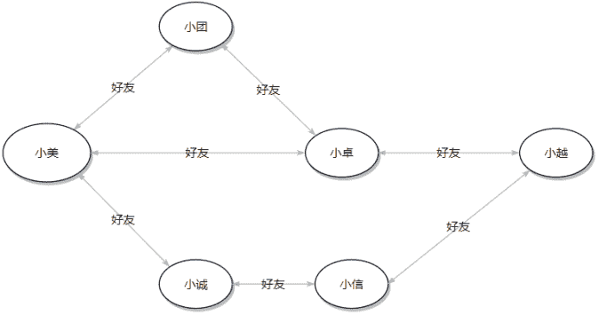

# 美团 2020 校招后台开发方向笔试题

## 1

RESTful 调用和 RPC 调用有什么区别？如果让你设计一个 RPC 服务治理框架你会设计那些模块？是否了解过 Service Mesh，如果了解 Service Mesh 是用来解决什么问题的？

你的答案

本题知识点

Java 工程师 C++工程师 美团 2020

讨论

[学习牛🐮是每天的事](https://www.nowcoder.com/profile/485471143)

RESTful:采用的是 http 协议，RPC 采用的是 TCP 协议，Http 7 层网络协议涉及到数据打包丢包，TCP 三层网络协议速度上会更快，先看看业务需求吧，如果没有那么大业务诉求，单体架构得了，弄个 nginx 做负载就可以了如果需要的话：先简单做个业务需求分析调研 CAP 原则 是以 CP/AP 哪个为主导？注册中心：使用阿里 19 年新推出的 NACOS 做注册中心以及配置中心；负载策略：使用 Ribbon 做个简单的轮询 也不会引起严重的雪崩效应网关：使用 gateway 做网关，熔断机制：Hystrix 做个断路器日志监控：全链路监控采用 Sleuth + Zipkin + RabbitMQ + ES + Kibana 数据库：mysql +sharding
Service Mesh:了解一点，微服务网格，引入便边车模式，主要是解决现在的 springcloud 微服务架构现存的与技术语言的耦合度，边车模式协助做网络传输，不用考虑底层技术语言。

发表于 2020-12-26 23:40:28

* * *

[默兮 y](https://www.nowcoder.com/profile/545786141)

。。。

发表于 2020-08-22 17:31:48

* * *

## 2

请描述避免多线程竞争时有哪些手段？

你的答案

本题知识点

Java 工程师 C++工程师 美团 2020

讨论

[哈啰内推排头兵](https://www.nowcoder.com/profile/64533110)

七种锁 的实现方式：1\. 临界区（Monitor），通过对多线程的串行化访问公共资源或一段代码，速度快，适合控制数据访问。2\. 互斥锁。java 中的 Mutex 类为互斥类。互斥量能够处理进程之间以及线程之间的资源竞争。但开销大，性能低。、3\. 信号量（Semaphore）。为控制一个具有优先数量用户资源而设计。‘***。用于通知线程有一些事件已经开始，从而启动后继任务的开始。5\. 读写锁。允许其他程序正在写的情况下读取资源。所以如果资源允许脏读，此锁较为合适。6\. 原子锁。通过原子操作 Interlocked.CompareExchange 实现“无锁”竞争。7\. 原子性操作。野外原子性操作本身线程安全，故无需加锁。8. 

发表于 2020-04-05 22:54:50

* * *

[花落谁家谁知](https://www.nowcoder.com/profile/498254084)

1 基于忙等的互斥 2.基于信号量与锁的同步 3.基于不可变量的共享内存读 4.局部变量或者 ThreadLocal

发表于 2020-08-22 18:38:49

* * *

[秀里儿](https://www.nowcoder.com/profile/50886749)

1\. 临界区：通过对多线程的串行化来访问公共资源，速度快，适合控制数据访问 2\. 互斥量：在对内存进行读写访问时给访问资源上锁，此时其他线程无法对上锁资源进行处理 3\. 信号量：控制剧有限数量用户资源而设计，通过一个计数器减操作完成对资源的访问，然后转交给其他线程，另外线程的计数器在通信线程减操作的同时进行加操作，通过计数器实现通信 4\. 条件变量：通过阻塞，和通知解除阻塞来避免竞争 5\. 读写锁： 读时不上锁，写时上锁，如果资源允许脏读会比较合适 6\. 原子锁， 通过原子操作， Interlocked.CompareExchange 实现“无锁”竞争 7.原子性操作， 野外原子性操作天生线程安全，不需要加所

发表于 2020-04-01 10:34:00

* * *

## 3

1929 年，匈牙利作家 Frigyes Karinthy 在短篇故事‘Chains’中首次提出的“六度人脉理论”，是指地球上所有的人都可以通过六层以内的熟人链和任何其他人联系起来。我们定义 A 的‘一度好友’为 A 直接相识的好友，A 的‘二度好友’为 A 一度好友的好友且与 A 不是一度好友，A 的‘三度好友’为 A 二度好友的好友且与 A 不是一度好友、二度好友，以此类推。

在美团点评，小美、小团、小卓、小越、小诚、小信的好友关系见下图。

小团、小卓、小诚是小美的一度好友。小越、小信是小美的二度好友。小诚、小越是小信的一度好友，小美、小卓是小信的二度好友，小团是小信的三度好友。

现在已知每个人的所有一度好友，需要为‘小点’推荐 10 个六度好友，请使用伪代码写出计算方法。

你的答案

本题知识点

Java 工程师 C++工程师 美团 2020

讨论

[闪闪红星 201904141503574](https://www.nowcoder.com/profile/185761381)

对人体

发表于 2020-03-26 23:35:59

* * *

[牛客 439269072 号](https://www.nowcoder.com/profile/439269072)

1\. 首先要把所有人物名字都放到一个 List<String>列表 p 中。
2\. 之后要想办法把每个人之间的关系建立出来。使用一个 List<Integer>[]  list，其中数组下标表示该人物姓名在 p 中的位置，存储的元素则是该人物一度好友的下标。如：小美的下标为 1，一度好友有小团（下标 2），小城（下标 3）。则 list[1].add(2);list[1].add(3)。3\. 定义一个队列，Queue<Node> 其中 node 有两个属性，index 下标，deep 深度。把要查找的人物，放入队列中（下标根据 p 查找，deep 初始为 1）。将该人物 list 中的元素入队，深度+1。如果已经遍历过该元素则跳过。如果达到要求深度则直接返回 queue

发表于 2022-03-13 10:31:23

* * *

[bianluzhiguai](https://www.nowcoder.com/profile/420501992)

dict1 := make(map[string]map[string]struct{}{})dict2 := make(map[string]map[string]struct{}{}) dict3 := make(map[string]map[string]struct{}{}) dict4 := make(map[string]map[string]struct{}{}) dict5 := make(map[string]map[string]struct{}{}) for people{for people's friends{ dict1[people's name] [people's friend] = struct{}}}for people{if dict1["小点"]["people's name] == struct{}{  //如果是小点朋友，跳过 delete people // 把这个人从待选集合中删掉 continue}else{for name,v  range dict1["小点"]{if dict1[name][people's name] == struct{}{dict2["小点"]["people's name] = struct{}    //生成二度朋友 delete people}//以此类推，找到六度朋友

发表于 2022-02-27 15:16:11

* * *

## 4

请简述 HTTP 的 5 个常用 Method 及其含义，以及 5 个常用 Status Code 及其含义？HTTP 与 HTTPS 的区别是什么，简述一下 HTTPS 的实现原理。

你的答案

本题知识点

Java 工程师 C++工程师 美团 2020

讨论

[公众号「我不是匠人」](https://www.nowcoder.com/profile/936070)

get 从服务器端获取资源 put 提交资源 post 更新资源 delete 删除资源 connect 建立 tunnel 隧道 100 请求已收到，正等待后续资源 200 ok 成功 206 partial content 部分资源 301 永久重定向 400 bad request 客户端请求语法错误 https 是 http 加上 ssl 的应用层协议。在 http 的基础上增加了安全性和可靠性。端口的不同：http 默认是 80 端口， https 默认是 443 端口安全性：http 是明文传输，https 是密文传输。认证：http 没有认证，【原错误回答：https 在建立 TCP 连接前会进行 ssl 层的握手】**https****是先进行 TCP 连接，再进行 SSL 层的握手，**在这个过程中需要认证。成本上：https 的证书需要成本，同时加密和解密时对 CPU 和内存开销增加。https 的原理：https 通信时，首先建立 ssl 层的连接，客户端将 ssl 版本号和加密组件发到客户端，客户端收到后对 ssl 版本号和加密组件进行匹配，同时将 CA 证书及密钥发送到客户端。客户端对证书进行验证，验证通过后使用非对称加密对数据通信时的密钥进行协商。协商后得到一致的获得一致的对称加密密钥。然后使用对称加密算法进行【原错误回答：TCP 连接】**数据交换**，后续的过程跟 http 的过程一致。三次握手，数据交换，四次挥手，通信结束。

编辑于 2021-05-22 08:19:36

* * *

[peonyX](https://www.nowcoder.com/profile/975538406)

如果我不知道常用的是哪些，我是不是应该把我知道的都写上

发表于 2020-04-20 18:13:54

* * *

[哈啰内推排头兵](https://www.nowcoder.com/profile/64533110)

HTTP 常用 Method 列举：1\. HEAD --- 获取报文头部信息。
2\. GET --- 返回报文主体信息，不会对数据产生任何影响。3\. POST --- 传输实体主体，用于给服务器发送数据，如表单提交等 4\. OPTIONS --- 询问支持方法 5\. PUT --- 传输文件，报文主体中包含文件内容，保存到指定 URI 资源的存放位置 6\. DELETE --- 删除指定 URI 下的指定资源。-------------------------------------------------------常用 Status Code* 200  OK  标识请求已经完成。* 403 Forbidden 没有访问资源的权限* 404 NOT FOUND 找不到请求资源* 500 Not Implement 服务端不支持或不能被处理。* 502 Bad Getaway 网关错误———————————————————HTTP 与 HTTPS 区别：HTTPS 是 HTTP 经由加入 SSL 层来提高数据传输的安全性。其中 SSL 依靠证书来验证服务器的身份，并对浏览器与服务器之间的 通信进行数据加密。HTTP 不适合传输敏感信息。HTTPs 实现原理：。发起请求：客户端通过 TCP 和服务器建立连接后，发出一个请求证书的消息给到服务器。。证书返回：服务器端在收到请求后回应客户端并且返回证书

发表于 2020-04-05 23:42:29

* * *

## 5

给出一个布尔表达式的字符串，比如：true or false and false，表达式只包含 true，false，and 和 or，现在要对这个表达式进行布尔求值，计算结果为真时输出 true、为假时输出 false，不合法的表达时输出 error（比如：true true）。表达式求值是注意 and 的优先级比 or 要高，比如：true or false and false，等价于 true or (false and false)，计算结果是 true。

本题知识点

Java 工程师 C++工程师 美团 2020

讨论

[牛客 243800614 号](https://www.nowcoder.com/profile/243800614)

a=input()try:    print("true"ifeval(a.replace("t","T").replace("f","F")) else"false")except:    print("error")

发表于 2020-03-11 21:27:52

* * *

[pmad](https://www.nowcoder.com/profile/33830038)

解题思路：将字符串分割后分别压栈，若遇到顶层为 and 时候进行弹出对比，最后保证栈中只有 true、false、or 字符串，再对栈中符号进行判断

```cpp
public static void main(String[] args) {
        Scanner scanner=new Scanner(System.in);
        String[] ss=scanner.nextLine().split(" ");
        Stack<String> stack=new Stack<>();
        for(int i=0;i<ss.length;i++){
            String curr=ss[i];
            //当前值为 true 或 false 时
            if(curr.equals("true")||curr.equals("false")){
                if(stack.isEmpty()){
                    stack.push(curr);
                }else{
                    String top=stack.peek();
                    if(top.equals("true")||top.equals("false")){
                        System.out.println("error");
                        return;
                    }else{
                        if(top.equals("or")) stack.push(curr);
                        else{
                            stack.pop();
                            String pre=stack.pop();
                            if(curr.equals("false")||pre.equals("false")) stack.push("false");
                            else stack.push("true");
                        }
                    }
                }
            }
            //当前值为 and 或 or 时
            else{
                if(stack.isEmpty()){
                    System.out.println("error");
                    return;
                }else{
                    String top=stack.peek();
                    if(top.equals("and")||top.equals("or")){
                        System.out.println("error");
                        return;
                    }
                    stack.push(curr);
                }
            }
        }
        if(!stack.isEmpty()&&(stack.peek().equals("or")||stack.peek().equals("and"))){
            System.out.println("error");
            return;
        }
        while(!stack.isEmpty()){
            String curr=stack.pop();
            if(curr.equals("true")){
                System.out.println("true");
                break;
            }
            if(stack.isEmpty()) System.out.println("false");
        }
    }
```

发表于 2020-03-08 12:12:06

* * *

[songdayi](https://www.nowcoder.com/profile/33258433)

我觉得这题考虑的有两点：1.输入格式判断 2.格式正确时,怎么求值 1.可设立计数点，从 0 开始，逐渐加 1，    2k 时 输入的只能是 false 或 true,     2k+1 时，输入的只能是 and 或 or.    考虑到 输入顺序正确但是个数不对，即 false and,所以再加上一个**size(false/true)-size(and/or)==1**的判断 2.求值的话，就正常地利用栈 ，表达式求值，注意运算符优先级

```cpp
#include<iostream>
(720)#include<string>
#include<stack>
using namespace std;

string Reduce(string str1,string str2,string op)
{
    if(op=="and")
    {
        if((str1=="true"&& str2=="true"))
            return "true";
        else return "false";
    }
    else//o***bsp;   {
        if(str1=="false"&&str2=="false")
            return "false";
        else return "true";
    }
} 
bool Comp(string op1,string op2)//op1:栈外 Op2:栈内  op1>op2 return true
{
    if(op1=="and"&&op2=="or")
        return true;
    else return false;
}
int main()//false&nbs***bsp;true and false&nbs***bsp;true and false
{
    string str;
    string output;
    stack <string> S,OP;
    int count=0;
    while(cin.peek()!='\n')
    {
        cin>>str;
        if((count%2==0)&&(str=="false"||str=="true"))
            S.push(str);
        else if((count%2==1)&&(str=="and"||str=="or"))//op
        {
            if(OP.empty())
                OP.push(str);  
            else
            {   while(!OP.empty()&&!Comp(str,OP.top()))
                {
                    string s1,s2,op,output;
                    s1=S.top();
                    S.pop();
                    s2=S.top();
                    S.pop();
                    op=OP.top();
                    OP.pop();
                    output=Reduce(s1,s2,op);
                    S.push(output);
                }
                OP.push(str);
            }
        }
        else 
        {
            cout<<"error";
            return 0;
        }
        count++;
    }
    if(S.size()-OP.size()!=1)
    {
        cout<<"error";
        return 0;
    }
    while(!OP.empty())
    {
        string s1,s2,op,output;
        s1=S.top();
        S.pop();
        s2=S.top();
        S.pop();
        op=OP.top();
        OP.pop();
        output=Reduce(s1,s2,op);
        S.push(output);
    }
    cout<<S.top();
    return 0;
}
```

发表于 2020-03-28 14:18:46

* * *

## 6

给出两个字符串，分别是模式串 P 和目标串 T，判断模式串和目标串是否匹配，匹配输出 1，不匹配输出 0。模式串中‘？’可以匹配目标串中的任何字符，模式串中的 ’*’可以匹配目标串中的任何长度的串，模式串的其它字符必须和目标串的字符匹配。例如 P=a?b，T=acb，则 P 和 T 匹配。

本题知识点

Java 工程师 C++工程师 美团 2020

讨论

[Asche](https://www.nowcoder.com/profile/432694093)

```cpp
import java.util.*;

public class Main{
    public static void main(String[] args){
        Scanner sc = new Scanner(System.in);
        String p = sc.next();
        String s = sc.next();
        // System.out.println(s + " - " + p);
        int m = s.length(), n = p.length();
        boolean[][] dp = new boolean[m + 1][n + 1];
        dp[0][0] = true;
        for(int i = 1; i <= n; i++) dp[0][i] = dp[0][i - 1] && p.charAt(i - 1) == '*';
        for(int i = 1; i <= m; i++){
            for(int j = 1; j <= n; j++){
                if(s.charAt(i - 1) == p.charAt(j - 1) || p.charAt(j - 1) == '?'){
                    dp[i][j] = dp[i - 1][j - 1];
                }
                if(p.charAt(j - 1) == '*'){
                    dp[i][j] = dp[i - 1][j] || dp[i][j - 1];
                }
            }
        }
        System.out.println((dp[m][n] ? 1 : 0));
    }
}
```

发表于 2020-03-10 15:37:07

* * *

[WhyVent](https://www.nowcoder.com/profile/359517104)

```cpp
import java.util.regex.Pattern;
import java.util.*;
public class Main {
    public static void main(String[] args) {
        Scanner scanner = new Scanner(System.in);
        String p = scanner.nextLine();
        String t = scanner.nextLine();

        if (Pattern.matches(p.replace("*",".*").replace("?","."),t)){
            System.out.println(1);
        }else {
            System.out.println(0);
        }
    }
}
```

发表于 2020-03-20 10:18:52

* * *

[君亦流水](https://www.nowcoder.com/profile/194349140)

```cpp
#include <iostream>
(720)#include <string>
using namespace std;

int compare(string &strS, string &strT, int i, int j) {
    if (i >= strS.size()) {
        if (j >= strT.size())
            return 1;
        return 0;
    } 
    else if (j >= strT.size()){
        for (int k = i; k < strS.size(); k++)
            if (strS[k] != '*')
                return 0;
        return 1;
    }
    if (strS[i] == '*') {
        for (int k = j; k <= strT.size(); k++)
            if (compare(strS, strT, i+1, k))
                return 1;
        return 0;
    }
    if (strS[i] == '?') {
        if (compare(strS, strT, i+1, j+1))
            return 1;
        return 0;
    }
    if (strS[i] == strT[j])
        return compare(strS, strT, i+1, j+1);
    return 0;
}

int main() {
    string strS, strT;
    cin >> strS >> strT;
    cout << compare(strS, strT, 0, 0) << '\n';
    return 0;
}
```

回溯做的，当然动态规划更好了，但是我水平有限 0.0

发表于 2020-04-03 22:33:39

* * *

## 7

打车派单场景, 假定有 N 个订单，  待分配给 N 个司机。每个订单在匹配司机前，会对候选司机进行打分，打分的结果保存在 N*N 的矩阵 A，  其中 Aij 代表订单 i 司机 j 匹配的分值。

假定每个订单只能派给一位司机，司机只能分配到一个订单。求最终的派单结果，使得匹配的订单和司机的分值累加起来最大，并且所有订单得到分配。

本题知识点

Java 工程师 C++工程师 美团 2020

讨论

[嘟嘟嘟嘟噜](https://www.nowcoder.com/profile/3385548)

```cpp
import java.util.*;
//过 100%
public class Main {
    private double t = 0.00;
    private int[] flag;
    private double res = -1000.00;//0.00 只能过 80%
    private ArrayList<Integer> add;
    public void Solution(double[][] nums)
    {
        int n = nums.length;
        flag = new int[n];
        for(int i = 0;i<n;i++)
        {
            ArrayList<Integer> temp = new ArrayList<>();
            temp.add(i+1);
            flag[i] = 1;
            t = nums[0][i];
            Best(temp, nums, 1);
            t = 0.00;
            flag[i] = 0;
        }
        System.out.println(String.format("%.2f", res));
        for(int i = 0;i<add.size();i++)
        {
            System.out.println(i+1 +" "+ add.get(i));
        }
    }
    public void Best(ArrayList<Integer> temp, double[][] nums, int end)
    {
        if(end==nums.length)
        {
            if(res<t)
            {
                res = t;
                add = (ArrayList<Integer>) temp.clone();
            }
        }
        for(int i = 0;i<nums.length;i++)
        {
            if(flag[i]!=1)
            {
                flag[i] = 1;
                t += nums[end][i];
                temp.add(i+1);
                Best(temp, nums, end+1);
                temp.remove(temp.size()-1);
                t -= nums[end][i];
                flag[i] = 0;
            }
        }
    }
    public static void main(String[] args)
    {
        Scanner in = new Scanner(System.in);
        while(in.hasNext())
        {
            int n = in.nextInt();
            double[][] nums = new double[n][n];
            for(int i = 0;i<n;i++)
                for(int j = 0;j<n;j++)
                    nums[i][j] = in.nextDouble();
            Main s = new Main();
            s.Solution(nums);
        }
    }
}
```

参考楼上的答案，修改了初始值后，过 100%

发表于 2020-04-08 17:30:51

* * *

[王银峰](https://www.nowcoder.com/profile/885800963)

```cpp
//每行每列选一个，且不重复，类似于 N 皇后问题与全排列问题，回溯法解决
#include <iostream>
#include <vector>
#include <stdio.h>
using namespace std;

void recur(vector<vector<double>>& nums, vector<int>& ans, vector<int>& curT, vector<bool>& visited, double curProfit, double& sum, int row){
    int n = nums.size();
    //退出条件
    if(row == n){
        if(curProfit > sum){        //更新最大和与每行对应的列
            sum = curProfit;
            ans = curT;
        }
        return;
    }
    //轮流考虑当前 row 行，选取每一列的可能性
    for(int i=0; i<n; i++){
        //该列未选取
        if(!visited[i]){
            //更新状态
            visited[i] = true;
            curProfit += nums[row][i];
            curT[row] = i;

            recur(nums, ans, curT, visited, curProfit, sum, row+1);
            //还原状态
            visited[i] = false;
            curProfit -= nums[row][i];
        }
    }
}

int main(){
    int n;
    while(cin >> n){
        vector<vector<double>> nums(n, vector<double>(n));
        for(int i=0; i<n; i++){
            for(int j=0; j<n; j++)
                cin >> nums[i][j];
        }
        //最大和的情况下，各行选取的列； 当前状态下各行选取的列
        vector<int> ans(n), curT(n);
        //记录已选取的列，避免重复
        vector<bool> visited(n, false);
        //最大和与当前和
        double sum = -1, curProfit = 0;
        //初始行号
        int row = 0;
        recur(nums, ans, curT, visited, curProfit, sum, 0);

        printf("%4.2f\n", sum);

        for(int i=0; i<n; i++){
            cout << i+1 << ' ' << ans[i]+1 << endl;
        }
    }
    return 0;
}
```

回溯法解决

发表于 2020-07-28 21:15:18

* * *

[JTong666](https://www.nowcoder.com/profile/223944710)

```cpp
import java.util.*;
public class Main {
	private double t = 0.00;
	private int[] flag;
	private double res = 0.00;
	private ArrayList<Integer> add;
	public void Solution(double[][] nums)
	{
		int n = nums.length;
		flag = new int[n];	
		for(int i = 0;i<n;i++)
		{
			ArrayList<Integer> temp = new ArrayList<>();
			temp.add(i+1);
			flag[i] = 1;
			t += nums[0][i];
			Best(temp, nums, 1);
			t = 0.00;
			flag[i] = 0;
		}
		System.out.println(String.format("%.2f", res));
		for(int i = 0;i<add.size();i++)
		{
			System.out.println(i+1 +" "+ add.get(i));
		}
	}
	public void Best(ArrayList<Integer> temp, double[][] nums, int end)
	{
		if(end==nums.length)
		{
			if(res<t)
			{
				res = t;
				add = (ArrayList<Integer>) temp.clone();
			}
		}
		for(int i = 0;i<nums.length;i++)
		{
			if(flag[i]!=1)
			{
				flag[i] = 1;
				t += nums[end][i];
				temp.add(i+1);
				Best(temp, nums, end+1);
				temp.remove(temp.size()-1);
				t -= nums[end][i];
				flag[i] = 0;
			}
		}
	}
	public static void main(String[] args)
	{
		Scanner in = new Scanner(System.in);
		while(in.hasNext())
		{
			int n = in.nextInt();
			double[][] nums = new double[n][n];
			for(int i = 0;i<n;i++)
				for(int j = 0;j<n;j++)
					nums[i][j] = in.nextDouble();
			Main s = new Main();
			s.Solution(nums);
		}
	}
}

```

不是知道为什么越界 求大佬看看

发表于 2020-03-11 18:54:48

* * *

## 8

2110 年美团外卖火星第 3000 号配送站点有 26 名骑手，分别以大写字母 A-Z 命名，因此可以称呼这些骑手为黄家骑士特工 A，黄家骑士特工 B…黄家骑士特工 Z，某美团黑珍珠餐厅的外卖流水线上会顺序产出一组包裹，美团配送调度引擎已经将包裹分配到骑手，并在包裹上粘贴好骑手名称，如 RETTEBTAE 代表一组流水线包裹共 9 个，同时分配给了名字为 A B E R T 的 5 名骑手。请在不打乱流水线产出顺序的情况下，把这组包裹划分为尽可能多的片段，同一个骑手只会出现在其中的一个片段，返回一个表示每个包裹片段的长度的列表。

本题知识点

Java 工程师 C++工程师 美团 2020

讨论

[pmad](https://www.nowcoder.com/profile/33830038)

典型的滑动窗口，先判断当前字符的最后一个位置在哪，在不断的更新另一个指针使得开始指针与结尾指针满中间没有的元素在后面不会出现。

```cpp
import java.util.*;
public class Main{
    public static void main(String[] args){
        Scanner scanner=new Scanner(System.in);
        String s=scanner.nextLine();
        int i=0,j=0,len=s.length();
        while(j<len){
            char c=s.charAt(j);
            int tail=s.lastIndexOf(c);
            int pre=j;
            i=j+1;
            j=tail;
            while(i<j){
                char inner=s.charAt(i);
                j=Math.max(j,s.lastIndexOf(inner));
                i++;
            }
            j++;
            System.out.print(j-pre+" ");
        }
    }
}
```

 发表于 2020-03-08 21:46:16

* * *

[小白白 pang](https://www.nowcoder.com/profile/671673610)

```cpp
//c++版
#include<iostream>
(720)#include<algorithm>
#include<string>
using namespace std;
int main(){
	string s;
	cin >> s;//getline(cin,s);while(cin.peek()!='\n'){cin>>s};
    if(s.size()==1){
        cout<<1;
        return 0;
    }
    for(int i=0;i<s.size();++i){
        int pos=s.find_last_of(s[i]);
        int j=i;
        int k=0;
        for( k=i;k<pos;++k){
            if(s.find_last_of(s[k])>pos)
                pos=s.find_last_of(s[k]);
        }
        cout<<k+1-j<<' ';
        i=k;

    }
	return 0;
}
```

发表于 2020-04-01 12:25:40

* * *

[吃**的蜗牛](https://www.nowcoder.com/profile/238090891)

```cpp
import java.util.*;

public class Main{
    public static void main(String args []){
        Scanner input = new Scanner(System.in);
        String s = input.nextLine();
        int n = s.length();
        int max_i = s.lastIndexOf(s.charAt(0));
        int ans = 1;
        for(int i = 1; i < n; i++){
            char c = s.charAt(i);
            int index = s.lastIndexOf(c);
            if(i <= max_i){
               ans++;
               if(index>max_i) max_i=index;
            }else{
               System.out.print(ans+" ");
               ans = 1;
               max_i = index;
            }
        }
        System.out.print(ans+" ");
        System.out.println();
    }
}
```

发表于 2020-08-12 16:27:42

* * *

## 9

已知一种新的火星文的单词由英文字母（仅小写字母）组成，但是此火星文中的字母先后顺序未知。给出一组非空的火星文单词，且此组单词已经按火星文字典序进行好了排序（从小到大），请推断出此火星文中的字母先后顺序。

本题知识点

Java 工程师 C++工程师 美团 2020

讨论

[popo_fkh](https://www.nowcoder.com/profile/4131517)

```cpp
import java.lang.reflect.Array;
import java.util.*;

/**
 * 给定按火星字典序排列的单词，求单词中出现过的字符的字典序
 * wrt wrf er ett rftt
 * x z x
 * abc bbc
 * hij ikjk kih jkca jkaa jj
 * 构造一个字符的有向无环图，再找拓扑序列
 */
public class Main {
    // 保存图，定义如果字符 i 在字符 j 前，那么存在 i 到 j 路径，即 map[i][j]=1
    private static int[][] map = new int[26][26];
    // 保存每个节点的入度
    private static int[] indegree = new int[26];
    // 记录出现过的字符
    private static boolean[] flag = new boolean[26];
    private static Set<Character> set = new HashSet<>();
    // 保存结果
    private static List<Character> ans = new ArrayList<>();

    public static void main(String[] args) {
        // wrt wrf er ett rftt
        Scanner sc = new Scanner(System.in);
        String[] input = sc.nextLine().split(" ");
        int maxLen = 0;
        // 创建有向图
        build(input);
        // 找拓扑序列
        topology();
        if(ans.size() == set.size()) {
            for (Character c : ans) {
                System.out.print(c);
            }
        } else {
            System.out.println("invalid");
        }
    }

    public static void topology() {
        while(ans.size() < set.size()) {
            // 是否在一个遍历中找到入度为 0 的节点，如果没找到，要 break;如果一次遍历找到两个入度为 0 的点，说明是无法确认顺序的
            int cnt = 0;
            for(int i = 0; i < indegree.length; i++) {
                if(indegree[i] == 0 && flag[i]) cnt++;
            }
            if (cnt != 1) break;
            // 找没有入度的节点，加入序列，在有向图中删除这个节点和从这个节点出发的边
            for (int i = 0; i < indegree.length; i++) {
                if (indegree[i] == 0 && flag[i]) {
                    ans.add((char) ('a' + i));
                    flag[i] = false;    // 删除节点
                    for (int j = 0; j < 26; j++) {       // 删除从这个节点出发的边
                        if (map[i][j] == 0) continue;
                        indegree[j]--;
                        map[i][j] = 0;
                    }
                }
            }
        }
    }

    //[wrt wrf er ett rftt]
    public static void build(String[] strs) {
        // 找到相邻的两个字符串，第一个不相同的字符可以确定字符的顺序
        // 如 wrt 和 wrf 可以得到：t->f
        String pre = strs[0];
        for (char c : pre.toCharArray()) {
            set.add(c);
        }
        for(int i = 1; i < strs.length; i++) {
            String cur = strs[i];
            for (char c : cur.toCharArray()) {
                set.add(c);
            }
            for(int j = 0; j < Math.min(pre.length(), cur.length()); j++) {
                if(pre.charAt(j) == cur.charAt(j)) continue;
                if(map[pre.charAt(j)-'a'][cur.charAt(j)-'a'] == 1) break;
                map[pre.charAt(j)-'a'][cur.charAt(j)-'a'] = 1;
                indegree[cur.charAt(j)-'a'] += 1;
                flag[pre.charAt(j)-'a'] = true;
                flag[cur.charAt(j)-'a'] = true;
                break;
            }
            pre = cur;
        }
    }
}

```

发表于 2020-04-09 17:01:20

* * *

[牛客 771353678 号](https://www.nowcoder.com/profile/771353678)

这题先根据词的排序得到字母的有向无环图，a->b 代表字母 a 在字母 b 的字典序前面，然后得出该图的拓扑序即可。时间 T(n)

发表于 2020-03-26 13:24:40

* * *

[曾科特](https://www.nowcoder.com/profile/455968121)

```cpp
def word_order(words):
    n = len(words)
    first = words[0][0]
    d = {}
    s = set(words[0])
    for i in range(1, n):
        pre = words[i - 1]
        cur = words[i]
        shorest = min(len(pre), len(cur))
        s.update(list(cur))
        for j in range(shorest):
            if pre[j] != cur[j]:
                if pre[j] not in d.keys() and cur[j] not in d.values():
                    d[pre[j]] = cur[j]
                break
    t = first
    res = first
    while d.get(t):
        if t == d.get(d.get(t)):
            return 'invalid'
        res += d.get(t)
        t = d.get(t)
    return res if len(s) == len(res) else 'invalid'

words = input().strip().split()
order = word_order(words)
print(order)

```

发表于 2020-03-11 20:04:45

* * *