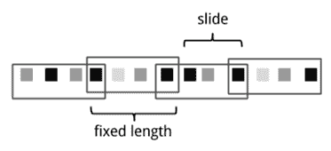

# 美团 2020 校招数据分析方向笔试题

## 1

广告是互联网企业重要的变现模式，在美团的广告业务中，商家会和美团的销售签订不同类型的广告合同（比如，按点击收费的广告 cpc、按曝光收费的广告 cpm、按时长收费的广告 cpt）。美团会为商家创建相关的广告内容素材创意（比如，门店图片、活动图片、促销文字等），并通过美团的广告引擎，根据用户访问的行为特征，基于算法策略将商家的广告内容投放到美团的 app 或者外部合作伙伴（比如如：腾讯，头条）的 app 不同的展示位置上。普通用户访问这些广告后，会对商家产生兴趣，可能产生购买转换行为，美团会和商家做广告的计费结算，同时为商户提供用户的广告效果信息（比如：广告带来的门店访问量、订单数等）。

1、 如果让你对这个业务进行抽象，你会抽象出哪些数据分析主题，并说出你这样分的原因；

2、 请你根据问题 1 抽象的主题，进行主题模型设计，并说明设计的模型内容，以及模型之间的关系。

你的答案

本题知识点

数据分析师 美团 2020

讨论

[Nick_v](https://www.nowcoder.com/profile/137844164)

收费模式：按点击收费的广告 cpc，按曝光收费的广告 cpm，按时长收费的广告 cpt 广告投放流程：广告素材创意 => 用户访问的行为特征 => 基于算法策略 => 投放到美团的 app 或者外部合作伙伴的 app => 不同的展示位置上商家引流流程：广告投放 => 用户访问 => 购买转换行为 => 和商家做广告的计费结算 => 为商户提供用户的广告效果信息（访问量、订单数量）1、 如果让你对这个业务进行抽象，你会抽象出哪些数据分析主题，并说出你这样分的原因；
广告素材特点和用户访问量的主题：用来分析不同特点和素材的广告对吸引用户访问是否有较大的关系。用户访问行为特征和最终购买行为主题：分析用户在广告页面滑动、点击、停留等特征，是否对最终购买行为有较大的关系。收费模式、商户类型、商户付费的关系：分析不同类型的商户在不同模式下的付费意愿，用于向未使用广告业务的商户推广投放时段和访问量订单数的关系：能带来高访问量或订单数的投放时段，价格可以适当调整不同类型商户广告投放的效果分析：分析哪些类型商户广告投放效果较差，可以帮助商户调整引流策略 2、 请你根据问题 1 抽象的主题，进行主题模型设计，并说明设计的模型内容，以及模型之间的关系。用户访问行为特征和最终购买行为主题：特征值可以选择用户点击进入广告后的行为特征，包括滑动速度、滑动方向、停留时间、点击等。
结合最终购买行为，用来分析用户行为特征对购买行为的影响。可以实时预测用户行为是否有较大几率产生购买行为。对购买意愿弱的用户，可以在页面中实施其他推广营销策略，加强用户的购买意愿。

发表于 2020-03-16 14:06:32

* * *

[董慧芳](https://www.nowcoder.com/profile/834446827)

1、数据分析主题（1）广告合同分析：哪种广告合同的收益最大（3）广告渠道分析：美团 app 与各种外部合作伙伴的不同渠道中，哪种渠道的点击率和点击量最大（4）广告素材分析
什么样的话术和图片有更多点击率（5）广告展位分析那个位置的广告点击率最高，平台收益最大（6）用户行为分析：哪类用户的广告点击率最高，点击量最大（7）技术算法分析:哪种算法带来的广告收益最大，（8）商家类型分析：哪种类型的商家的广告点击率最高，点击量最大不同商家偏爱的广告合同方式是什么，最优的广告投放方式是什么（9）以上 8 中分析的交叉分析哪类渠道的哪种广告合同平台的收益最大哪种商家通过哪种广告合同进行付费，平台的收益最大哪类用户对哪类商家广告的点击率最大诸如此类的……2、主题模型主要分为用户，商家，广告，技术四大主题，广告主题：围绕平台收益计算的广告相关的指标，包括广告渠道，展位、素材、合同类型用户主题：分析用户广告点击的行为，比如偏爱哪种商家，偏爱哪种渠道商家主题：分析商家的广告投放行为，哪类商家偏爱哪种广告合同方式，让平台收益最大的商家类型是什么技术主题：分析推荐算法能否实现预期的效果，可以通过 abtest 进行研究模型之间的关系：核心主题是广告主题 ，用户、商家、技术主题均围绕广告主题进行扩展。分析方法：abtest，统计分析，相关分析，因果分析

发表于 2020-09-04 10:57:14

* * *

[zxcv19](https://www.nowcoder.com/profile/726711662)

1\.可以抽象出 3 个数据分析主题 1）对比不同类型的广告合同对企业广告业务收入的影响 2）对比不同类型的广告内容素材对门店访问量，订单数量，以及企业广告业务收入的影响 3）对比不同平台展示对门店访问量，订单数量，以及企业广告业务收入的影响原因：根据广告业务中的 3 个因素进行分析，分别研究每个因素对业务效果和业务收入的影响，使得企业能够及时调整业务形式和内容 2\.模型 1：分别建立单变量回归模型，如自变量是不同类型的广告合同，因变量是广告业务的总收入模型 2：建立多变量回归模型计算出模型 1 和模型 2 的回归系数，可以估算出每个自变量对因变量的影响大小；通过对比模型 1 和模型 2 的回归系数，可以判断出变量之间是否有相关性及其大小

发表于 2020-03-27 08:33:20

* * *

## 2

说明关系型数据库通过索引提升查询效率的背后原理 。

你的答案

本题知识点

数据分析师 美团 2020

讨论

[小风铃女侠](https://www.nowcoder.com/profile/462170018)

没有索引，查找时搜索全表，产生大量的磁盘 IO 采用 B+ 树索引，B+树中左子树的键值小于右子树，相当于给键值排序。查找时搜索全树。采用 hash 索引，将键值转换成 hash 存储在 hash 表中。查找时搜索该键对应的 hash 值即可。（主要是减少了比较的次数？

发表于 2020-06-02 14:41:55

* * *

[风声晨起](https://www.nowcoder.com/profile/439202744)

没有索引，查找数据时会进行全表查询，因此会产生大量的磁盘 IO；使用 B+树这种二叉查找树，这样随机查找某个键值时可以通过从根节点执行二分查找加速查询，查询成本取决于树的层数；针对范围查询和排序的优化以及磁盘读写速度的优化

发表于 2020-08-23 14:33:07

* * *

[富贵在天](https://www.nowcoder.com/profile/738251283)

索引就是排好序的快速查找数据结构，背后是一个查找树，每个节点分别包含索引键值和一个指向对应数据记录物理地址的指针，这样就可以在一定复杂度内获取到相应数据，从而快速的检索出符合条件的记录。

发表于 2020-04-08 11:31:02

* * *

## 3

【污水处理问题】一家污水处理厂通过去掉污水中有害的污物来净化水质，生产出用于灌溉使用的水源。该处理过程每小时可以去掉处理池中剩余污物的 12%。

问：1.一天后处理池中将大概处理掉百分之几的污物？

       2.要多长时间才能把污物的量减少一半？ 

你的答案

本题知识点

数据分析师 美团 2020

讨论

[zeroplus](https://www.nowcoder.com/profile/952831948)

1.一天处理的量：1-(1-12%)²⁴=1-4.65%=95.35%2.设需要 N 小时降为一半：(1-12%)^N=0.5，解得 N=5.42   发表于 2021-03-04 10:05:56

* * *

[牛客 712789171 号](https://www.nowcoder.com/profile/712789171)

import math
from sympy import *
x=Symbol('x')
print(solve([x-(1-0.88**24)]),[x]){x: 0.953485952546540}import math
from sympy import *
x=Symbol('x')
print(solve([0.5-(1-0.88**x)]),[x])

```cpp
{x: 5.42227097958022}
```

发表于 2020-11-11 23:35:08

* * *

[白银](https://www.nowcoder.com/profile/440831270)

1.2. 

发表于 2020-03-15 10:40:31

* * *

## 4

在 4*4 的棋盘上摆满了黑白棋子，黑白两色的位置和数目随机其中左上角坐标为(1,1),右下角坐标为(4,4),现在依次有一些翻转操作，要对一些给定支点坐标为中心的上下左右四个棋子的颜色进行翻转，请计算出翻转后的棋盘颜色。

本题知识点

数据分析师 美团 2020

讨论

[MarkShawn2020](https://www.nowcoder.com/profile/95661246)

**最短答案，没有之一。**

```cpp
a = eval(input())
b = eval(input())

for x, y in b:
    x -= 1
    y -= 1
    if x > 0:
        a[x-1][y] = 1 - a[x-1][y]
    if x < 3:
        a[x+1][y] = 1 - a[x+1][y]
    if y > 0:
        a[x][y-1] = 1 - a[x][y-1]
    if y < 3:
        a[x][y+1] = 1 - a[x][y+1]

print(str(a).replace(" ", ""))
```

编辑于 2020-03-24 19:50:22

* * *

[许愿邮储！许愿邮储！许愿邮储！](https://www.nowcoder.com/profile/201724298)

> 解析：[`blog.csdn.net/m0_43545515/article/details/105011268`](https://blog.csdn.net/m0_43545515/article/details/105011268)
> 1、解题：翻转的含义是将本来是白棋（0）变为黑棋（1），黑棋（1）变为白棋（0）；
> 2、怎么办：
> （1）考虑边界条件：在棋盘坐标（2，2）、（2，3）、（3，2）、（3，3）中间区域是有完整的上下左右的，然而四边的位置需要特殊考虑的。
> （2）数组的索引也需要小心处理，数组的索引 = 坐标值 - 1

``

```cpp
#filpColor 函数是将黑白棋子的颜色翻转，1 变为 0，0 变为 1
def flipChess(color):
    #color 代表棋子的颜色
    if color == 1:
        return 0
    else:
        return 1
    #可简化为
    #return 0 if color == 1 else 1
#array 是存储需要翻转棋盘数组，position 是定支点位置
def doFlip(array, position):
    for i in position:
        #获取数组索引 = 棋盘坐标 - 1 
        row, col = i[0] - 1, i[1] -1
        #如果定支点还有左方棋子（即行索引大于 0），则进行翻转
        if row > 0:
            array[row - 1][col] = flipChess(array[row - 1][col])
        #如果定支点还有右方棋子（即行索引小于 3），则进行翻转
        if row < 3:
            array[row + 1][col] = flipChess(array[row + 1][col])
        #如果定支点还有上方棋子（即列索引大于 0），则进行翻转
        if col > 0:
            array[row][col - 1] = flipChess(array[row][col - 1])
        #如果定支点还有下方棋子（即列索引小于 3），则进行翻转
        if col < 3:
            array[row][col + 1] = flipChess(array[row][col + 1])
    return array

if __name__ == '__main__':
    array = eval(input())
    position = eval(input())     
    doFlip(array, position)
    print(str(array).replace(' ',''))
```

编辑于 2020-03-22 14:26:57

* * *

[零葬](https://www.nowcoder.com/profile/75718849)

这个题虽然不难，但是这个输入给我整得很烦，早知道我就用 eval 函数了😂 ```cpp
def solve(grid, x, y):
    x -= 1
    y -= 1
    if x > 0:
        if grid[x - 1][y]:
            grid[x - 1][y] -= 1
        else:
            grid[x - 1][y] += 1
    if y > 0:
        if grid[x][y - 1]:
            grid[x][y - 1] -= 1
        else:
            grid[x][y - 1] += 1
    if x < 3:
        if grid[x + 1][y]:
            grid[x + 1][y] -= 1
        else:
            grid[x + 1][y] += 1
    if y < 3:
        if grid[x][y + 1]:
            grid[x][y + 1] -= 1
        else:
            grid[x][y + 1] += 1
    return grid

raw = input()[1:-1]
temp = [raw[:9][1:-1], raw[10:19][1:-1], raw[20:29][1:-1], raw[30:39][1:-1]]
grid = [list(map(int, line.split(','))) for line in temp]
raw = input()[1:-1]
temp = [raw[:5][1:-1], raw[6:11][1:-1], raw[12:17][1:-1]]
cordinates = [list(map(int, line.split(','))) for line in temp]
for op in cordinates:
    grid = solve(grid, op[0], op[1])
print(''.join([c for c in str(grid) if c != ' ']))
``` 

发表于 2020-12-23 15:24:31

* * *

## 5

山峰元素是指其值大于或等于左右相邻值的元素。给定一个输入数组 nums，任意两个相邻元素值不相等，数组可能包含多个山峰。找到索引最大的那个山峰元素并返回其索引。

假设 nums[-1] = nums[n] = -∞。

本题知识点

数据分析师 美团 2020

讨论

[懒床的二哥](https://www.nowcoder.com/profile/522983648)

```cpp
def mountain_peak(a):
    b =len(a) -1
    for i in range(1,b):
        right_position = a[i]
        left = a[i-1]
        right = a[i+1]
        if right_position > left:
            if right_position > right:
                d = i       
                e = right_position
            else:
                continue
    print(d,e)

a = [1, 3, 5, 17, 4, 6, 15, 3,9,7,9,6,8,5]
A = mountain_peak(a)
```

发表于 2020-03-11 17:20:21

* * *

[Jaylynn](https://www.nowcoder.com/profile/320252455)

```cpp
def peakIndex(arr):
    arr.insert(0,float('-inf'))
    arr.append(float('-inf'))
    res = []
    for i in range(1,len(arr)-1):
        if arr[i]>= arr[i-1] and arr[i]>=arr[i+1]:
            res.append(i-1)
    return max(res)

if __name__ == '__main__':
    arr = list(map(int,input().split()))
    print(peakIndex(arr))
```

发表于 2020-03-19 17:53:44

* * *

[cda 乔木](https://www.nowcoder.com/profile/228838489)

```cpp
import sys
nums = list(map(int,sys.stdin.readline().strip().split(' ')))
result = 0
i=len(nums)-1
while i>0:
    if nums[i]>=nums[i-1]:
        result = i
        break
    i-=1
print(str(result))
```

发表于 2020-03-09 00:20:24

* * *

## 6

给定一个整数数组，返回一个数组。该返回数组中第 i 个数字为，原数组中第 i 个位置的数字至少往右走多少步才能遇到比它大的数字。如果遇不到或者已经处于最右的位置，则置为-1。

本题知识点

数据分析师 美团 2020

讨论

[阿皓](https://www.nowcoder.com/profile/434542380)

```cpp
num = int(input())
block, stack, result = [], [], []
for i in range(num):
    block.append(int(input()))
    result.append(-1)

i = 0
while(i<num):
    if (not(len(stack)==0)) and (block[i]>block[stack[-1]]):
        cur = stack.pop()
        result[cur] = i - cur

    else:
        stack.append(i)
        i += 1

for i in range(len(result)):
    print(result[i])
```

发表于 2020-03-25 20:33:47

* * *

[小橙子&](https://www.nowcoder.com/profile/697888971)

本题其实看到数据的大小就知道暴力会超时，特意做了下暴力，然后就是只能 AC0.6，随便优化下，只能到了 0.8，最后只有大幅度优化，才能 AC

```cpp
N = int(input().strip())
data = []
for i in range(N):
    data.append(int(input().strip()))
dp = [-1] * N
for i in range(N-1,-1,-1):
    cur = data[i]
    j = i + 1
    while j < N:
        if i == N - 1:
            break
        if dp[j] == -1 and cur >= data[j]:
            break
        if data[j] > cur:
            dp[i] = j - i 
            break
        j = j + dp[j]
for i in dp:
    print(i)

```

发表于 2020-08-21 22:17:19

* * *

[零葬](https://www.nowcoder.com/profile/75718849)

称每个元素右边第一个比它大的元素为右大元素，然后利用栈开始搜索🤣 ```cpp
import java.io.BufferedReader;
import java.io.InputStreamReader;
import java.io.IOException;
import java.util.Stack;
import java.util.Arrays;

public class Main {
    public static void main(String[] args) throws IOException {
        BufferedReader br = new BufferedReader(new InputStreamReader(System.in));
        String strNum;
        while((strNum = br.readLine()) != null){
            int n = Integer.parseInt(strNum);
            int[] data = new int[n];
            for(int i = 0; i < n; i++)
                data[i] = Integer.parseInt(br.readLine());
            int[] res = new int[n];
            Arrays.fill(res, -1);
            int i = 0;
            // 栈用于存储待寻找右大元素的下标
            Stack<Integer> stack = new Stack<>();
            // 遍历数组元素，优先寻找栈顶元素的右大元素
            while(i < n){
                if(!stack.isEmpty() && data[i] > data[stack.peek()]){
                    /* 如果栈不为空，且当前元素大于栈顶元素时直接
                    计算当前元素与最近右大元素的距离*/
                    int cur = stack.pop();    // 栈顶元素的右大已经找到，弹出
                    res[cur] = i - cur;
                }else{
                    // 否则将当前元素的下标加入栈
                    stack.push(i);
                    i += 1;
                }
            }
            for(Integer distance: res)
                System.out.println(distance);
        }
    }
}
``` 

发表于 2021-01-14 09:27:42

* * *

## 7

数据对象 data1List，员工表，存储员工 ID，员工姓名

数据对象 data2List， 员工工作时长表，存储员工 ID，月份，工时

计算每个员工 1-3 月每月工时及总工时

本题知识点

数据分析师 美团 2020

讨论

[zxcv19](https://www.nowcoder.com/profile/726711662)

```cpp
data1List = input().split()
data2List = input().split()
total = int(data2List[2]) + int(data2List[4]) + int(data2List[6])
print(data1List[1] + " " + data2List[2] + " " + data2List[4] + " " + data2List[6] + " " + str(total))
```

发表于 2020-03-29 11:02:48

* * *

[Novempire](https://www.nowcoder.com/profile/72901857)

select 员工姓名,月份,sum(工时) from data1List d1
join data2List d2
on d1.员工 ID = d2.员工 ID
where 月份 between 1 and 3
group by 员工姓名,月份
with rollup

发表于 2021-06-11 14:55:15

* * *

[零葬](https://www.nowcoder.com/profile/75718849)

```cpp
def workingTime(list1, list2):
    t1 = list2[2]     # 一月份工时
    t2 = list2[4]     # 二月份工时
    t3 = list2[6]     # 三月份工时
    t = int(t1) + int(t2) + int(t3)     # 总工时
    result = [list1[1], t1, t2, t3, t]
    return ' '.join(map(str, result))

if __name__ == "__main__":
    list1 = input().split()
    list2 = input().split()
    print(workingTime(list1, list2))
```

发表于 2020-12-23 15:26:16

* * *

## 8

在实时计算中，数据流源源不断地流入计算单元，经常需要借助窗口来处理数据，其中有一类窗口为滑动窗口（Sliding Window），其特点是窗口长度固定，每次滑动一定的位移（slide）

 

现给定一个数组 nums，有一个长度为 k 的滑动窗口从数组的最左侧移动到数组的最右侧。注意你只可以看到在滑动窗口 k 内的数字，滑动位移大小 slide=1，即滑动窗口每次只向右移动一位。

要求返回每一个滑动窗口内的中位数，解释中位数定义，例如：对于[2,3,4]，中位数是 3；对于[2,3]，中位数是 (2 + 3) / 2 = 2.5

注意：为了简化窗口计算，规定如果没有累计到窗口大小的数，不能触发计算，即不输出结果！

本题知识点

数据分析师 美团 2020

讨论

[零葬](https://www.nowcoder.com/profile/75718849)

直接调用 statistic 中的 median 函数求取中位数

```cpp
import statistics

n, k = map(int, input().split())
data = list(map(int, input().split()))
for i in range(n - k + 1):
     print('%.1f ' % statistics.median(data[i: i + k]), end='')
```

发表于 2020-12-23 15:30:37

* * *

[zxcv19](https://www.nowcoder.com/profile/726711662)

```cpp
import statistics
n, k = input().split()
nums = list(map(int,input().split()))
result = ""
if int(n) >= int(k):
    for idx, val in enumerate(nums[0:int(n)-int(k)+1]):
        result = result + str(round(float(statistics.median(nums[idx:idx+int(k)])),2)) + " "
print(result)
```

发表于 2020-03-29 11:01:58

* * *

[pyxiea](https://www.nowcoder.com/profile/773172)

用 python 可以使用 statistic 模块快速求中位数，如果使用其他语言，可以考虑使用快排的 partition 来求中位数

使用 statistic 模块：

```cpp
import sys
import statistics

def parse_nums(nums_str):
    return [int(x) for x in nums_str.strip().split()]

for line in sys.stdin:
    n, k = parse_nums(line)
    nums = parse_nums(input())
    res = []
    for i in range(n - k + 1):
        res.append(statistics.median(nums[i:i + k]))
    print(' '.join(['%.1f' % x for x in res]))

```

自己实现快速求解中位数：

```cpp
import sys
import random

def parse_nums(nums_str):
    return [int(x) for x in nums_str.strip().split()]

def partition(arr, low, high):
    r = random.randint(low, high)
    arr[low], arr[r] = arr[r], arr[low]
    pivot = arr[low]
    while low < high:
        while low < high and arr[high] >= pivot:
            high -= 1
        arr[low] = arr[high]
        while low < high and arr[low] <= pivot:
            low += 1
        arr[high] = arr[low]
    arr[low] = pivot
    return low

def get_kth(nums, k):
    mid = partition(nums, 0, len(nums) - 1)
    if mid == k:
        return nums[mid]
    elif mid < k:
        return get_kth(nums[mid + 1:], k - mid - 1)
    else:
        return get_kth(nums[:mid], k)

def get_medium(nums):
    if len(nums) % 2 == 1:
        return get_kth(nums, len(nums) // 2)
    else:
        a = get_kth(nums, len(nums) // 2)
        b = get_kth(nums, len(nums) // 2 - 1)
        return (a + b) / 2

for line in sys.stdin:
    n, k = parse_nums(line)
    nums = parse_nums(input())
    res = []
    for i in range(n - k + 1):
        res.append(get_medium(nums[i:i + k]))
    print(' '.join(['%.1f' % x for x in res]))
```

发表于 2020-04-05 13:33:00

* * *

## 9

输入年份月份，请输出这个月的天数 本题知识点

数据分析师 美团 2020

讨论

[小菊子](https://www.nowcoder.com/profile/962412059)

```cpp
def get_month_year(x, y):
    if y in [1, 3, 5, 7, 8, 10, 12]:
        return 31
    elif y in [4, 6, 9 ,11]:
        return 30
    elif y == 2 and x%4 == 0 and x%100 != 0&nbs***bsp;x%400 == 0:
        return 29
    else:
        return 28
while True:
    try:
        year, month = map(int,input().split())
        print(get_month_year(year, month))
    except:
        break;

```

发表于 2020-03-15 21:26:44

* * *

[枫飘七里](https://www.nowcoder.com/profile/618137484)

```cpp
day=[31,28,31,30,31,30,31,31,30,31,30,31]

while True:
    try:
        year,month = map(int,input().split())
        if month==2:
            if (year%4==0 and year%100!=0) or (year%400==0):
                print(day[month-1]+1)
                continue
        print(day[month-1])
    except:
        break
```

 编辑于 2020-11-07 16:29:40

* * *

[小橙子&](https://www.nowcoder.com/profile/697888971)

此题考的就是什么是闰年什么是平年。。。。

```cpp
dic = {'1':'31','2':['28','29'],'3':'31','4':'30','5':'31','6':'30',
      '7':'31','8':'31','9':'30','10':'31','11':'30','12':'31'}
while True:
    try:
        data = input().strip(' ').split(' ')
        if data[1] != '2':
            print(dic[data[1]])
        else:
            cur= int(data[0])

            if cur % 4 == 0 and cur % 100 != 0:
                print(dic[data[1]][1])
            elif cur % 100 == 0 and cur % 400 == 0:
                print(dic[data[1]][1])
            else:
                print(dic[data[1]][0])
    except:
        break
```

发表于 2020-08-21 23:08:30

* * *

## 10

一个正整数 N 可以分解为 M(M>1)个正整数的和，即 N=K+L，例如 N=5、M=2 时可以分解为(1+4,2+3)。给定一个正整数 N(1<N<200)及正整数 M(1<M<200)，求有多少种可能的分解组合(注：K+L 和 L+K 算一种)

本题知识点

数据分析师 美团 2020

讨论

[Rago](https://www.nowcoder.com/profile/8991699)

实际上就是 N 个球装到 M 个杯子里，要求每个杯子都要有球，有多少种装法。

发表于 2020-03-08 14:54:34

* * *

[zxcv19](https://www.nowcoder.com/profile/726711662)

```cpp
n,m = map(int, input().split(","))
dic = {}
def loop(n, m):
    if (m == 1)&nbs***bsp;(n - m == 1)&nbs***bsp;(n == m):
        dic[(n, m)] = 1
    elif m == 2: 
        dic[(n, m)] = int( n / 2)
    else: 
        left, i, total = n - m, 1, 0
        while left >= i and i <= m:
            if (left, i) in dic.keys():
                total = total + dic[(left, i)]
                i = i + 1
            else:
                loop(left, i)
        dic[(n, m)] = total
loop(n,m)
print(dic[(n,m)])
```

发表于 2020-04-03 06:26:03

* * *

[游泳健将 SSS](https://www.nowcoder.com/profile/242565499)

自己想的：通过 70% 超时 23333 思路比较简单，就是递归 找出所有的 k 拆分，且拆分的数要求是单调增。因为 l+k=k+l。

```cpp
data= [int(x) for x in input().split(',')]
N=data[0]
K=data[1]

def Data(data,min_,k):
    if k==1:
        if data>=min_:
            return 1
        else:
            return 0
    else:
        temp=0
        for i in range(min_,data//k+1):
            temp+=Data(data-i,i,k-1)
        return temp
print(Data(N,1,K))
```

感觉应该用动态规划，理解了一下楼里大佬的，稍稍修改，另外加了注释。就 100%通过了

```cpp
data= [int(x) for x in input().split(',')]
N=data[0]
K=data[1]

def Data(data,k): #k 拆分
    if data<k:
        return 0 #楼里大佬的问题，没判断无法划分的问题。。。
    else:
        if k==1:
            return 1
        else:
            D={}
            D[0,0]=0
            for i in range(1,data+1):
                for j in range(1,min(i+1,k+1)):
                    if j==1:
                        D[i,j]=1
                    else:
                        D[i,j]=D[i-1,j-1] #D[i,j]=D[i-j,j]+D[i-1,j-1]
                        if i>=2*j:        #意思是分割有两种情况：不包含 1 和包含 1，当然可能不一定包含 1
                            D[i,j]+=D[i-j,j]
            return D[data,k]
print(Data(N,K))
```

编辑于 2020-06-10 21:20:25

* * *