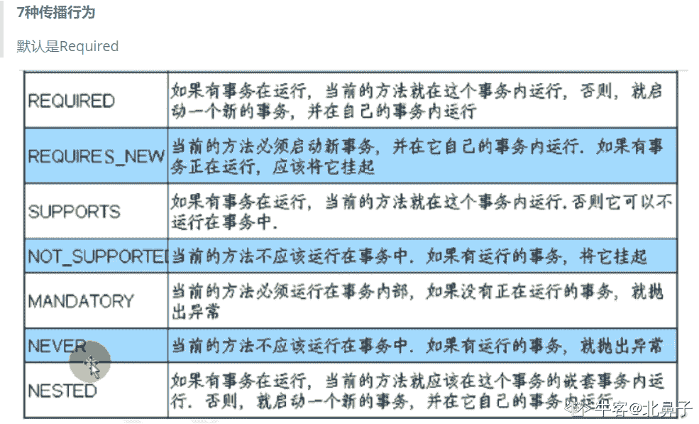

# 美团 2020 校招系统开发方向笔试题

## 1

如果线上某台虚机 CPU Load 过高，该如何快速排查原因？只介绍思路和涉及的 Linux 命令即可 。

你的答案

本题知识点

Java 工程师 C++工程师 美团 2020

讨论

[牛客 540449595 号](https://www.nowcoder.com/profile/540449595)

不知道

发表于 2020-03-13 00:34:30

* * *

[牛客 949211551 号](https://www.nowcoder.com/profile/949211551)

使用 top 命令 查找出 cpu 过高的进程如果是 java 进程可以 使用 jstack 查看对应的线程的状态，是否出现死锁等特殊状况还可以通过 jmap dump 下对内存镜像，通过内存分析工具了解内存和 gc 的情况

发表于 2020-05-20 16:47:23

* * *

[牛客 664242583 号](https://www.nowcoder.com/profile/664242583)

top 查看负载过高

发表于 2021-08-14 14:19:51

* * *

## 2

请简要描述 MySQL 数据库联合索引的命中规则，可举例说明。

你的答案

本题知识点

Java 工程师 C++工程师 美团 2020

讨论

[牛客 183888347 号](https://www.nowcoder.com/profile/183888347)

联合索引 1\. 白话: 将多个索引关联在一起,作为一个索引树存在. 这样在查询过程中可以根据单个索引值来覆盖得到另一个索引的值 减少了树的搜索次数,显著提高查询的性能 2\. 规则 1----最左前缀原则在搜索过程中,可以根据最左的 N 个字段或者最左的 M 个字符来在索引树中完成定位 3\. 规则 2---索引下推在索引的搜索过程中,对索引中包含的字段先做判断,直接过滤掉不满足条件的记录,减少回表的次数

发表于 2020-05-18 20:16:06

* * *

[牛客 750611974 号](https://www.nowcoder.com/profile/750611974)

左前缀匹配原则 1、使用联合索引前缀部分索引键；可触发索引 2、使用联合索引全部索引键（用 and 连接）；可触发索引 3、使用联合索引部分索引键但是不是前缀；不可触发索引 4、使用联合索引全部索引键不是 and 操作；不可触发索引

发表于 2021-03-12 16:45:57

* * *

## 3

什么是分布式事务，分布式事务产生的原因是什么？分布式事务的解决方案有哪些？分别有哪些优缺点？

你的答案

本题知识点

Java 工程师 C++工程师 美团 2020

讨论

[盏茶做酒](https://www.nowcoder.com/profile/411049206)

分布式事物：将一次大的操作分为很多小的操作，这些小的操作位于各自的服务器上，分布式事物需要保证这些小的操作要么全部成功，要么全部失败。分布式事物产生的原因：1.为了解决不同数据库操作时数据不一致的问题。2.应用 SOA 话。分布式事物的解决方案：1.2PC：两阶段提交优点：保证数据的强一致性，适合对数据要求高的强一致性领域。缺点：实现复杂，牺牲了可用性，性能不高，不适合高并发，高性能的场景。2.3PC:三阶段提交优点：相对于二阶段，它减低了阻塞的范围，解决了协调者这参与者同时挂掉的问题，即等待超时后，协调者或参与者会中断事务，避免单点问题。缺点：数据不一致性依然存在。3.补偿事务（TCC）优点：1）性能提升，2）数据最终一致， 3）可靠性更高缺点：花费高

发表于 2020-03-19 11:43:17

* * *

[不知名小菜鸡](https://www.nowcoder.com/profile/294882534)

在微服务场景下，由于服务拆分，导致的一个业务需要经过多次服务调用。分布式事务保证了跨服务的数据一致性。即，要么所有服务都成功，要么所有服务都回滚。传统的事务则是本地服务场景下，对同一数据库中的多次操作要满足一致性。

发表于 2020-12-20 23:33:22

* * *

[李峭鹏](https://www.nowcoder.com/profile/488171917)

一次大的操作由不同的小操作组成的，这些小的操作分布在不同的服务器上，分布式事务需要保证这些小操作要么全部成功，要么全部失败。从本质上来说，分布式事务是为了保证不同数据库的数据一致性。
2.1 数据库分库分表
当数据库单表数据达到千万级别，就要考虑分库分表，那么就会从原来的一个数据库变成多个数据库。例如如果一个操作即操作了 01 库，又操作了 02 库，而且又要保证数据的一致性，那么就要用到分布式事务。
2.2 应用 SOA 化
所谓的 SOA 化，就是业务的服务化。例如电商平台下单操作就会产生调用库存服务扣减库存和订单服务更新订单数据，那么就会设计到订单数据库和库存数据库，为了保证数据的一致性，就需要用到分布式事务。归根到底是要操作多数据库，并且要保证数据的一致性，而产生的分布式事务的。解决方案有：1.用 XA 实现两阶段提交（2PC）
    XA 是一个分布式事务协议，由 Tuxedo 提出。XA 中大致分为两部分：事务管理器和本地资源管理器。其中本地资源管理器往往由数据库实现，比如 Oracle、Mysql 等数据库都实现了 XA 接口，而事务管理器作为全局的调度者，负责各个本地资源的提交回滚。缺点：1、同步阻塞问题，2、单点故障，3、数据不一致；2.三阶段提交（3PC）    3PC 其实在 2PC 的基础上增加了 CanCommit 阶段，是 2PC 的变种，并引入了超时机制。一旦事务参与者迟迟没有收到协调者的 Commit 请求，就会自动进行本地 commit，这样相对有效的解决了协调者单点故障的问题。但是，性能和数据一致性问题没有根本解决。
3 补偿事务（TCC）
    TCC（Try-Confirm-Cancel）又称补偿事务。它实际上与 2PC、3PC 一样，都是分布式事务的一种实现方案而已。它分为三个操作：
        Try 阶段：主要是对业务系统做检测及资源预留。
        Confirm 阶段：确认执行业务操作。
        Cancel 阶段：取消执行业务操作。

发表于 2020-08-26 22:39:28

* * *

## 4

请描述 https 的请求过程。

你的答案

本题知识点

Java 工程师 C++工程师 美团 2020

讨论

[buerdepepeqi](https://www.nowcoder.com/profile/2538016)

https 的请求过程 1.浏览器向服务器发起请求，请求携带了浏览器支持的加密算法和哈希算法 2.服务器收到请求，选择浏览器支持的加密算法和哈希算法 3.服务器将数字证书返回给浏览器 4.浏览器进入数字证书的认证环节 5.浏览器生成一个随机数 R，并使用网站公钥对 R 进行加密，浏览器将加密后的 R 传送给服务器 6.服务器通过自己的私钥解密得到 R7 服务器以 R 为密钥将使用了对称加密算法的加密网页内容传输给浏览器 8.浏览器以 R 为密钥使用之前约定好的解密算法获取网页内容

发表于 2020-03-17 13:18:17

* * *

[嘿~菜鸟](https://www.nowcoder.com/profile/7680294)

1、域名解析：输入域名会对域名进行解析，得到对应的 ip 地址，访问域名，其实访问的是域名对应的 ip 地址；解析过程：查找浏览器的 dns 缓存；查找计算机的 dns 缓存；查找路由器的 dns 缓存；查找互联网服务提供商的 dns 缓存；从根域名服务器开始递归搜索，到顶级域名服务器，再到自己输入的域名服务器；2、浏览器与服务器建立 tcp 连接（三次握手过程）；3、浏览器向服务器发送请求；4、服务器收到请求，进行响应处理，将生产的 html 返回给客户端；5、客户端收到数据，浏览器对页面进行渲染，展示给用户。第一次握手：建立连接时，客户端发送 syn 包（syn=j）到服务器，并进入 SYN_SEND 状态，等待服务器确认；第二次握手：服务器收到 syn 包，必须确认客户的 SYN（syn=j+1），同时自己也发送一个 SYN 包（syn=k），即 syn+ack 包，此时服务器进入 SYN_SEND 状态；第三次握手：客户端收到服务器的 SYN+ACK 包，向服务器发送确认包（ack=k+1），此包发送完毕，客户端和服务器进入 ESTABLISTED 状态，完成三次握手。第三次是为了防止已经失效的连接请求报文段突然又传到服务器端，因而产生错误。

发表于 2020-03-26 10:43:19

* * *

[不知名小菜鸡](https://www.nowcoder.com/profile/294882534)

https 相比于 http 更加安全，数据是加密传输。由于是加密传输需要商定密钥，因此在建立 https 连接之前，需要先交换客户端和服务器的密钥。客户端和服务端各自维护一对公钥和私钥，将自己的公钥发送给对方用于加密，自己则使用私钥可以解密。这样，通过非对称加密的方法，来传输用于数据加密的对称密钥。客户端还需要对服务端提供的 CA 证书进行校验，这其中包括与 CA 认证机构的通信，验证证书指纹等，有一套成熟的机制可以确认证书的有效性。一旦证书有效，就可以通过上述过程商定密钥并进行加密传输。

发表于 2020-12-20 23:37:55

* * *

## 5

什么是事务传播行为？你知道 Spring 事务中都有哪些传播类型吗？如何使用/指定传播类型？

你的答案

本题知识点

Java 工程师 C++工程师 美团 2020

讨论

[北鼻子](https://www.nowcoder.com/profile/359623741)

事务传播用于描述当一个由事务传播行为修饰的方法被嵌套入另外一个方法时，事务如何传播。常用于定义发生事务嵌套时，如何继续执行。7 种传播行为解析 

发表于 2020-06-27 14:11:02

* * *

[牛客 571982804 号](https://www.nowcoder.com/profile/571982804)

*   指的是什么情况下有事务（增删改），什么情况下没有事务（查询） ，常用枚举：REQUIRED、SUPPORTS

发表于 2020-05-07 19:42:24

* * *

## 6

 IO 设计中 Reactor 和 Proactor 区别。

你的答案

本题知识点

Java 工程师 C++工程师 美团 2020

讨论

[buerdepepeqi](https://www.nowcoder.com/profile/2538016)

Reactor 是同步 IOProactor 是异步 IOReactor 的主线程只监听文件描述上是否有事件发生，如果有事件发生的话就将事件递交给工作线程，由工作线程读写数据、接受新的链接，处理客户请求 Proactor 的主线程和内核负责 IO 操作，工作线程处理业务逻辑

发表于 2020-03-17 13:21:20

* * *

## 7

以字符串的形式读入两个数字，再以字符串的形式输出两个数字的和。

本题知识点

Java 工程师 C++工程师 美团 2020

讨论

[中南的小菜鸡](https://www.nowcoder.com/profile/4371282)

```cpp
//题目给出的范围不足以让两个 int 相加越界
import java.util.Scanner;

/**
 * @ClassName Main
 * @Description TODO
 * @Author Wlison
 * @Date 2020/3/11 9:38
 * @Version 1.0
 **/
public class Main {
    public static void main(String[] args) {
        Scanner sc = new Scanner(System.in);
        while (sc.hasNext()) {
            String a = sc.nextLine();
            String b = sc.nextLine();
            String res ="\""+ (Integer.parseInt(a.substring(1,a.length()-1))+Integer.parseInt(b.substring(1,b.length()-1)))+"\"";
            System.out.println(res);
        }
    }
}
```

发表于 2020-03-12 09:48:23

* * *

[绝色人才](https://www.nowcoder.com/profile/7789724)

```cpp
#include<iostream>
(720)#include<string>
#include<vector>

using namespace std;

// 两个字符串相加，模拟手算。两个字符串只有数字，没有符号
string addString(string str1,string str2){
    string res="";
    int pos1=str1.size()-1, pos2=str2.size()-1;
    int C=0, num1=0, num2=0, sum=0;
    // 从后向前逐个相加。
    for(;pos1>=0||pos2>=0; pos1--, pos2--){
        num1=pos1>=0? str1[pos1]-'0': 0;
        num2=pos2>=0? str2[pos2]-'0': 0;
        sum=num1+num2+C;
        res= to_string(sum%10) + res;
        C=sum/10;
    }
    if(C){
        res= to_string(C)+res;
    }
    return res;
}
// 两个字符串相减，模拟手算。两个字符串只有数字，没有符号
string minusString(string str1, string str2){
    bool res_positive=true;
    // 若 str1 表示的数字小于 str2 的，两者交换，并将结果符号设为负。
    if(str1.size()<str2.size() || (str1.size()==str2.size()&& str1<str2)){
        res_positive=false;
        string temp=str2;
        str2=str1;
        str1=temp;
    }
    string res="";
    int pos1=str1.size()-1, pos2=str2.size()-1;
    int C=0, num1=0, num2=0;
    // 从后向前逐个相减
    for(;pos1>=0||pos2>=0; pos1--, pos2--){
        num1=pos1>=0? str1[pos1]-'0': 0;
        num2=pos2>=0? str2[pos2]-'0': 0;
        if(num1-C<num2){
            num1= num1-C+10;
            C=1;
        }else{
            num1=num1-C;
            C=0;
        }
        res= to_string(num1-num2) + res;
    }
    pos1=0;
    // 找到第一个非零位置
    while(pos1<res.size()&& res[pos1]=='0'){
        pos1++;
    }
    if(pos1==res.size()){ // res 都是 0
        res="0";
    }else if(pos1>0){  // res 前缀部分是 0
        res=res.substr(pos1);
    }
    if(res_positive==false){ // 结果 res 是负数
        res= "-"+res;
    }
    return res;
}

int main(){
    string str1, str2;
    getline(cin, str1);
    getline(cin, str2);
    // 去掉引号
    str1=str1.substr(1, str1.size()-2);
    str2=str2.substr(1, str2.size()-2);
    // 去掉正负号，记录数值正负
    bool positive1=true, positive2=true;
    if(str1[0]=='-'){
        positive1=false;
        str1=str1.substr(1);
    }else if(str1[0]=='+')
        str1=str1.substr(1);
    if(str2[0]=='-'){
        positive2=false;
        str2=str2.substr(1);
    }else if(str2[0]=='+')
        str2=str2.substr(1);

    string res;
    // 这两个字符串异号
    if(positive1 ^ positive2){
        if(positive1==false){ // 第一个字符串是负数
            res=minusString(str2, str1);
        }else { // 第二个字符串是负数
            res=minusString(str1,str2);
        }
    }else{ // 同号
        res=addString(str1,str2);
        if(positive1==false)
            res="-"+res;
    }
    cout<<"\"" <<res<<"\""<<endl;

    return 0;
}

```

发表于 2020-03-22 21:48:08

* * *

[风雨有期](https://www.nowcoder.com/profile/822329262)

#include <stdio.h>int main(){
    long a;
    long b;
    char c;
    scanf("\"%d\"",&a);
    c=getchar();
    scanf("\"%d\"",&b);
    printf("\"%d\"",a+b);
    return 0;
}就正常的加法不就行了吗??没看到其他大佬怎么程序那么复杂，输入限制下条件呀。

发表于 2020-04-09 11:50:57

* * *

## 8

给定一个字符串，你的任务是计算这个字符串中有多少个回文子串（回文串是一个正读和反读都一样的字符串）。

具有不同开始位置或结束位置的回文串，即使是由相同的字符组成，也会被计为是不同的子串。

本题知识点

Java 工程师 C++工程师 美团 2020

讨论

[浮躁 201805142206312](https://www.nowcoder.com/profile/7070776)

```cpp

```
import java.util.ArrayList;
import java.util.Scanner;

public class Main {
    public static void main(String[] args) {
        Scanner in = new Scanner(System.in);
        String s = in.nextLine();
        ArrayList<String> list = new ArrayList<>();
        //longestPalindrome(s);
        for (int i = 0; i < s.length(); i++) {
            for (int j = i; j < s.length(); j++) {
                list.add(s.substring(i,j+1));
            }
        }
        int cnt = 0;
        for(String temp : list) {
            if(isPalindrome(temp))cnt++;
        }
        System.out.println(cnt);
    }
    public static boolean isPalindrome(String s) {
        if(s.length() ==  1)
            return true;

        StringBuilder sb = new StringBuilder(s);

        return sb.toString().equals(sb.reverse().toString());
    }
}
```cpp

```

编辑于 2020-03-08 16:40:04

* * *

[中南的小菜鸡](https://www.nowcoder.com/profile/4371282)

```cpp
import java.util.Scanner;

/**
 * @ClassName Main
 * @Description TODO
 * @Author Wlison
 * @Date 2020/3/11 9:38
 * @Version 1.0
 **/
public class Main {
    public static void main(String[] args) {
        Scanner sc = new Scanner(System.in);
        while (sc.hasNext()) {
            String s = sc.nextLine();
            int res = 0;
            for (int i = s.length(); i > 0; i--) {
                for (int j = 0; j < s.length()-i+1; j++) {
                    String temp = s.substring(j,i+j);
                    if (judge(temp))res++;
                }
            }
            System.out.println(res);
        }
    }
    public static boolean judge(String s){
        char[] chs = s.toCharArray();
        int len = s.length();
        for (int i = 0; i < chs.length; i++) {
            if (chs[i]!=chs[len-i-1])return false;
        }
        return true;
    }
}
```

发表于 2020-03-12 09:50:18

* * *

[OSeven](https://www.nowcoder.com/profile/404946923)

#include <iostream>
#include <string>
#include <algorithm>
using namespace std;

int main()
{
    string str;
    cin >> str;
    int len = str.length();

    int count = 1; 
    for (int i = 1; i < str.length(); i++)
    {
        string x = "";
        x+= str[i];
        for (int j =1; j <= i;j++)
        {
            x+=str[i - j];
            string tem = x;
            reverse(tem.begin(), tem.end());
            if (x == tem)
                count++;
        }
        count++;
    }
    cout << count << endl;
    return 0;
}

发表于 2020-03-09 15:54:45

* * *

## 9

 有 N 堆金币排成一排，第 i 堆中有 C[i] 块金币。每次合并都会将相邻的两堆金币合并为一堆，成本为这两堆金币块数之和。经过 N-1 次合并，最终将所有金币合并为一堆。请找出将金币合并为一堆的最低成本。

其中，1 <= N <= 30，1 <= C[i] <= 100

本题知识点

Java 工程师 C++工程师 美团 2020

讨论

[死命令](https://www.nowcoder.com/profile/590291861)

```cpp
/**手动模拟最小情况，发现关键就是在确定区间，确定分割点*/ 已 AC

import java.util.*;

public class Main{
    public static void main(String[] args){
        Scanner sc = new Scanner(System.in);
        int n = sc.nextInt();
        int[] money = new int[n+1];
        int[] preSum = new int[n+1];
        for(int i = 1; i <= n; i++){
            money[i] = sc.nextInt();
            if(i == 1) preSum[i] = money[i];
            else preSum[i] = preSum[i-1] + money[i];
        }
        sc.close();

        int[][] dp = new int[n + 1][n + 1];
        for(int len = 2; len <= n; len++){
            for(int i = 1; i <= n - len + 1; i++){
                int j = i + len - 1;
                dp[i][j] = Integer.MAX_VALUE;
                int sum = preSum[j] - preSum[i - 1];
                for(int k = i; k < j; k++){
                    dp[i][j] = Math.min(dp[i][j],dp[i][k] + dp[k + 1][j] + sum);
                }
            }
        }
        System.out.println(dp[1][n]);
    }
}

```

发表于 2020-03-16 12:58:44

* * *

[牛客 279675892 号](https://www.nowcoder.com/profile/279675892)

```cpp
public static void main(String[] args) {
    Scanner in = new Scanner(System.in); int n = in.nextInt(); int[] jinbi = new int[n]; int[] sum = new int[n]; for(int i=0;i<n;i++) {
        jinbi[i] = in.nextInt(); if(i==0) sum[i]=jinbi[i]; else sum[i]=sum[i-1]+jinbi[i];
    }
    in.close(); long temp = 0; long min =0; long[][] dp = new long[n][n]; for(int l=1;l<n;l++) { for(int i=0;i<n&&i+l<n;i++) {
            min = dp[i][i]+dp[i+1][i+l]; for(int k=i+1;k<=i+l-1;k++) {
                temp = dp[i][k] + dp[k+1][i+l]; if(temp<min) min = temp;
            } if(i>0)
                dp[i][i+l]=min+sum[i+l]-sum[i-1]; else  dp[i][i+l]=min+sum[l];
        }
    }
    System.out.println(dp[0][n-1]); for(int i =0;i <n;i++){ for(int j = 0;j<n;j++){
            System.out.print(dp[i][j] + " ");
        }
        System.out.println();
    }
}

```

发表于 2020-03-11 14:33:58

* * *

[未命名。555](https://www.nowcoder.com/profile/105060415)

```cpp
N = int(input())
C = list(map(int,input().split(' ')))

dp = [[0 for _ in range(N)] for _ in range(N)]

for i in range(N-1):
    dp[i][i+1] = C[i]+C[i+1]

for i in range(N-1)[::-1]:
    for j in range(i+2, N):
        dp[i][j] = dp[i][i] + dp[i+1][j] + sum(C[i:j+1])
        for k in range(i+1, j):
            dp[i][j] = min(dp[i][k]+dp[k+1][j] + sum(C[i:j+1]), dp[i][j])

print(dp[0][-1])

```

编辑于 2020-03-11 11:01:38

* * *

## 10

给定一组个字符串，为每个字符串找出能够唯一识别该字符串的最小前缀。

本题知识点

Java 工程师 C++工程师 美团 2020

讨论

[Summer8918_](https://www.nowcoder.com/profile/839491412)

C++前缀树解法

```cpp
#include<iostream>
(720)#include<vector>
#include<string>
using namespace std;
class trie_node{
public:
    int cnt;
    trie_node* next[26];
    trie_node(){
        cnt=1;
        for(int i=0;i<26;i++){
            next[i]=nullptr;
        }
    }
};
int main(){
    trie_node* root=new trie_node();
    int n=0;
    cin>>n;
    vector<string> strs(n);
    for(int i=0;i<n;i++){
        string tmp;
        cin>>tmp;
        strs[i]=tmp;
        trie_node* p=root;
        for(int j=0;j<tmp.length();j++){
            if(p->next[tmp[j]-'a']!=nullptr){
                p->next[tmp[j]-'a']->cnt++;
            }
            else{
                p->next[tmp[j]-'a']=new trie_node();
            }
            p=p->next[tmp[j]-'a'];
        }
    }
    for(int i=0;i<n;i++){
        trie_node* p=root;
        int j=0;
        for(;j<strs[i].length();j++){
            if(p->next[strs[i][j]-'a']->cnt == 1){
                cout<<strs[i].substr(0,j+1)<<endl;
                break;
            }
            p=p->next[strs[i][j]-'a'];
        }
        if(j==strs[i].length()){
            cout<<strs[i]<<endl;
        }
    }
    return 0;
}
```

发表于 2020-03-10 22:34:41

* * *

[cdf](https://www.nowcoder.com/profile/7051860)

暴力比较字符串 hash 值

```cpp
#include<bits/stdc++.h>
using namespace std;
int n;
int mod=1e9+7;
vector<string> v,v2;
bool vis[200];
int h[200];
int main(){
    ios::sync_with_stdio(0);
    cin>>n;
    v=vector<string>(n);
    v2=vector<string>(n);
    for (int i=0;i<n;i++){
        cin>>v[i];
    }
    memset(vis,0,sizeof(vis));
    memset(h,0,sizeof(h));
    int w=1;
    for (int i=0;i<100;i++){
        for (int j=0;j<n;j++){
            if(vis[j] || i>=v[j].size()){
                continue;
            }
            h[j]=(h[j]+w*(v[j][i]))%mod;
        }
        for (int j=0;j<n;j++){
            if(vis[j]) continue;
            bool f=true;
            for (int k=0;k<n;k++){
                if(j==k || vis[k] ){
                    continue;
                }
                if(h[j]==h[k]){
                    f=false;
                    break;
                }
            }
            if(f){
                vis[j]=true;
                v2[j]=v[j].substr(0,i+1);
            }
        }
        w=(w*137)%mod;
    }
    for (auto s:v2){
        cout<<s<<endl;
    }
}

```

发表于 2020-03-10 23:37:53

* * *

[yQpy.](https://www.nowcoder.com/profile/79816031)

python 字典树版本，创建一个字典树，之后进行如下操作：1.对于每一个单词，将其他单词插入字典树，然后再寻找本单词每一个字母是否在字典树中，在的话就证明不能唯一表示单词，就添加本单词。2.如果不在的话，就返回结果。

```cpp
class solution:
    def __init__(self):
        self.pretree={}
    def inset(self,a):
        temp=self.pretree
        for x in a:
            if x not in temp:
                temp[x]={}
            temp=temp[x]
    def core(self,a):
        temp=self.pretree
        res=''
        for x in a:
            if x in temp:
                res+=x
                temp=temp[x]
            else:
                res+=x
                return res
        return res
n=int(input())
strings=[]
res=[]
for i in range(n):
    strings.append(input())
for string in strings:
    a=solution()
    for string_else in strings:
        if string==string_else:
            continue
        a.inset(string_else)
    res.append(a.core(string))
for x in res:
    print(x)
```

发表于 2020-07-11 22:01:05

* * *