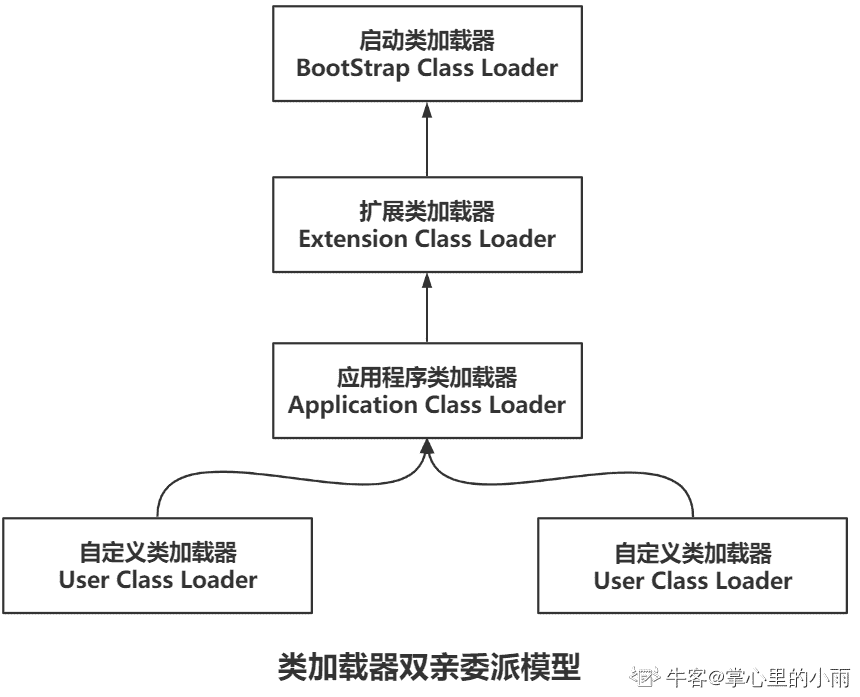
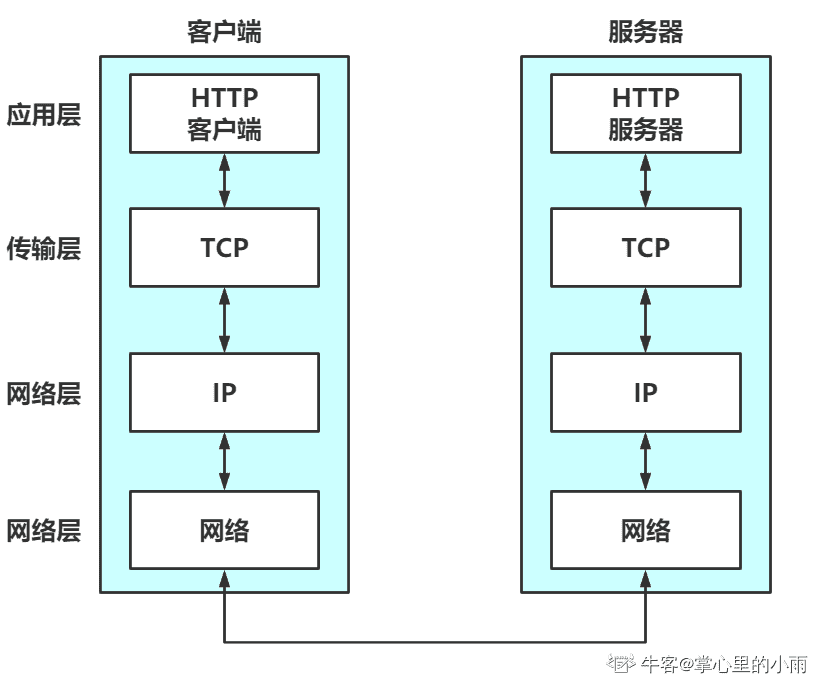
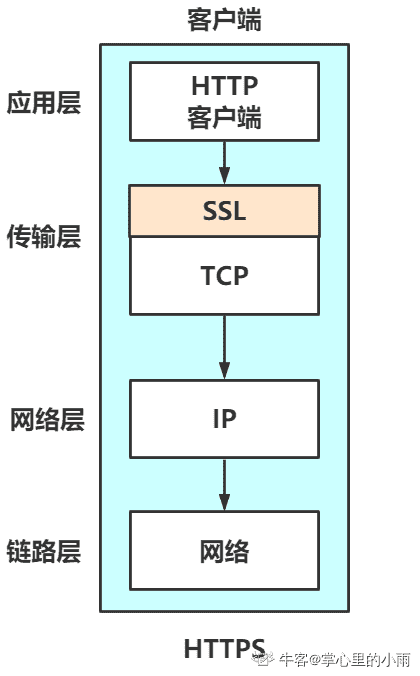
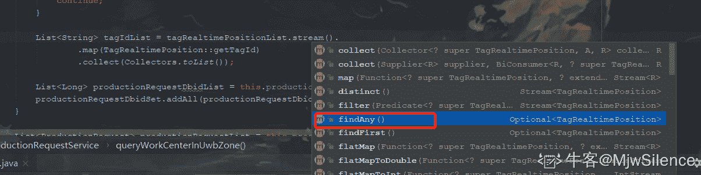
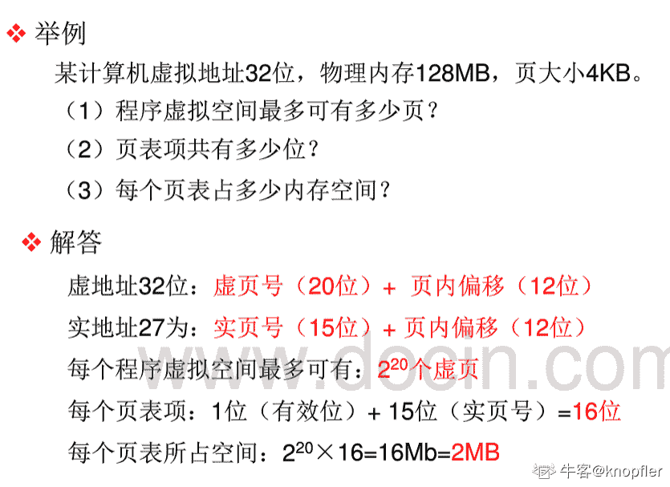
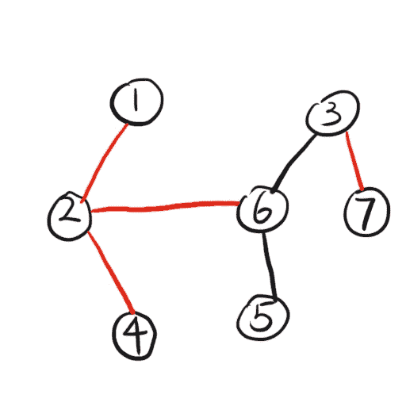

# 快手 2020 校园招聘秋招笔试--工程 A 试卷

## 1

若用斜杠记法标识子网掩码，则 255.255.240.0 对应于

正确答案: B   你的答案: 空 (错误)

```cpp
/19
```

```cpp
/20
```

```cpp
/21
```

```cpp
/22
```

本题知识点

Java 工程师 C++工程师 快手 2020

讨论

[牛客 898427848 号](https://www.nowcoder.com/profile/898427848)

这是思科 CISCO 的表示方法，一般在网络中也通用了。
/20 的意思就是掩码中有 20 个 1，用十进制表示，就是 255.255.240.0 二进制中 255 有 8 个 1，240 是 1111 0000 有 4 个 1，一共 20 个 1

发表于 2020-03-17 16:26:11

* * *

[掌心里的小雨](https://www.nowcoder.com/profile/86073671)

考点：计算机网络-地址结构-子网掩码
子网掩码是由一台主机或者路由器使用的分配位，可以通过 IP 地址获得网络和子网信息，由点分十进制编写

*   IP 子网掩码与对应的 IP 地址长度相同（IPv4 为 32 位，IPv6 为 128 位）；
*   斜杠标记法也称为前缀长度
*   IPv4 的例子：
    *   255.0.0.0，二进制表示：11111111 00000000 00000000 00000000，前缀长度为：/8
    *   255.255.240.0，二进制表示：11111111 11111111 11110000 00000000，前缀长度为：/20
*   IPv6 也是同理，数 1 的个数。

发表于 2020-06-10 09:42:01

* * *

[爱上我群](https://www.nowcoder.com/profile/1713001)

这是思科 CISCO 的表示方法，一般在网络中也通用了。
/20 的意思就是掩码中有 20 个 1，用十进制表示，就是 255.255.240.0

发表于 2020-03-15 09:18:26

* * *

## 2

通常情况，JVM 中使用类加载器的优先级是

正确答案: A   你的答案: 空 (错误)

```cpp
BootstrapClassLoader > ExtensionClassLoader > ApplicationClassLoader > UserClassLoader
```

```cpp
ExtensionClassLoader > BootstrapClassLoader > ApplicationClassLoader > UserClassLoader
```

```cpp
BootstrapClassLoader > ExtensionClassLoader > UserClassLoader > ApplicationClassLoader
```

```cpp
ExtensionClassLoader > BootstrapClassLoader > UserClassLoader > ApplicationClassLoader
```

本题知识点

Java 工程师 C++工程师 快手 2020

讨论

[懒得想啊](https://www.nowcoder.com/profile/605559722)

根类加载器（bootstrap class loader）扩展类加载器（extensions class loader）系统类加载器（system class loader）用户类加载器（user class loader） 

发表于 2020-03-17 23:48:25

* * *

[掌心里的小雨](https://www.nowcoder.com/profile/86073671)

考点：Java 虚拟机-双亲委派模型

*   类加载器工作过程：1\. 类加载器收到了类加载的请求，它首先不会自己去尝试加载这个类，而是把这个请求委派给父类加载器去完成；2\. 所有的加载请求最终都应该传送到最顶层的启动类加载器中； 3\. **只有当父加载器反馈自己无法完成这个加载请求（它的搜索范围中没有找到所需的类）时，子加载器才会尝试自己去完成加载。**
*   题目当中，提到“**通常情况**”是因为这个双亲委派模型**并不是一个具有强制性约束力的模型**，而是 Java 设计者们推荐给开发者的一种类加载器实现的最佳实践
    

发表于 2020-06-10 09:47:52

* * *

## 3

二叉树的中序和先序遍历分别是 d b e a f c g 和 a b d e c f g。那么它的后序遍历是？

正确答案: C   你的答案: 空 (错误)

```cpp
e d b g f c a
```

```cpp
e d b f g c a
```

```cpp
d e b f g c a
```

```cpp
d e f g b c a
```

本题知识点

Java 工程师 C++工程师 快手 2020

讨论

[N 旭东](https://www.nowcoder.com/profile/996643094)

首先看先序遍历确定根节点 第一个即为根节点也就是 a

在看中序遍历 在中序遍历中找根节点 a 在 a 的左边的都是左子树的节点 右边都是右子树的节点

再看先序遍历 根节点后的第一个节点为左子树的根节点

对应到中序遍历 找到左子树根节点 左边是左子树的左节点 右边是左子树的右节点

所以答案就出来了

发表于 2020-03-24 21:30:31

* * *

[积极努力前进 qwq](https://www.nowcoder.com/profile/648183464)

前序  根左右  中序 左根右  后序  左右根

发表于 2020-05-10 18:30:57

* * *

## 4

以下关于网络协议说法错误的是

正确答案: B   你的答案: 空 (错误)

```cpp
HTTP 状态码中 400 代表请求报文语法有误，服务器无法识别
```

```cpp
https 相比于 http 更安全，是由于每一次请求都会做非对称加密，保证了请求内容的安全性
```

```cpp
在 OSI 网络模型中，HTTP 工作于应用层，而 HTTPS 的安全传输机制工作在传输层
```

```cpp
GET 请求会被浏览器主动 cache，但 post 不会，除非手动设置
```

本题知识点

Java 工程师 C++工程师 快手 2020

讨论

[掌心里的小雨](https://www.nowcoder.com/profile/86073671)

考点：计算机网路-HTTP

*   **B 选项**：HTTPS 比 HTTP 安全是因为加了 SSL 协议，而 SSL 协议采用的是公开密钥加密的加密方式，加密算法是公开的，而密钥却是保密的
    *   加密和解密同用一个密钥的方式称为**共享密钥加密**，但是这个方式有一个缺点：以共享密钥方式加密时必须将密钥也发给对方，发送密钥的过程也有可能被窃听
    *   另一种是**公开密钥加密方式**，有两把密钥，一把是私有的，一把是公开的，发送一方使用对方的公开密钥进行加密处理，对方收到被加密的信息后，再使用自己的私有密钥进行解密，这种方法更安全，但是处理起来更复杂，效率低
    *   所以一般采用两种方式混合使用，**先使用公开密钥加密确保密钥安全**的前提下，**使用共享密钥的方式进行通信以提高效率**
*   **C 选项**：通常情况下，HTTP 直接和 TCP 通信。而 HTTPS 是 HTTP 使用了 SSL 协议，通信就会则演变成先和 SSL 通信，再由 SSL 和 TCP 通信
    *   一般情况下，如下图：
    *   
    *   用 HTTPS 之后，如下图：
    *   
*   D 选项：如果要对响应进行缓存，需要满足以下条件：
    *   请求报文的 HTTP 方法本身是可缓存的，包括 GET 和 HEAD，但是 PUT 和 DELETE 不可缓存，**POST 在多数情况下不可缓存的**
    *   响应报文的状态码是可缓存的，包括：200, 203, 204, 206, 300, 301, 404, 405, 410, 414, and 501。
    *   响应报文的 Cache-Control 首部字段没有指定不进行缓存

发表于 2020-06-10 10:34:13

* * *

[牛客 898427848 号](https://www.nowcoder.com/profile/898427848)

https 使用的是非对称加密，举例子就是 A 生成一个公钥 A，发送给 B。B 收到后对称生成一个秘钥 B 并用 A 加密，发送给 A。最后 A 接收到后用私钥得到秘钥 B，之后 A 与 B 之间就可以进行加密通信了，并不用每次做一次非对称加密。感觉和集群搭建的时候做的一样。

发表于 2020-03-17 16:42:23

* * *

[Rita.wu](https://www.nowcoder.com/profile/45946280)

对称加密与非对称加密一起

发表于 2020-03-20 23:48:41

* * *

## 5

数据库中某一个字段的值并不唯一，但是需要创建索引加速查询速度，应该选择的索引类型为

正确答案: D   你的答案: 空 (错误)

```cpp
主键索引
```

```cpp
唯一索引
```

```cpp
不唯一索引
```

```cpp
普通索引
```

本题知识点

Java 工程师 C++工程师 快手 2020

讨论

[hgnulb](https://www.nowcoder.com/profile/8667211)

索引类型 ①普通索引：仅加速查询 ②唯一索引：加速查询 + 列值唯一（可以有 null） ③主键索引：加速查询 + 列值唯一（不可以有 null）+ 表中只有一个 ④组合索引：多列值组成一个索引，专门用于组合搜索，其效率大于索引合并 ⑤全文索引：对文本的内容进行分词，进行搜索 ps.索引合并，使用多个单列索引组合搜索 ⑥覆盖索引，select 的数据列只用从索引中就能够取得，不必读取数据行，换句话说查询列要被所建的索引覆盖

发表于 2020-03-23 22:17:22

* * *

[嘿~菜鸟](https://www.nowcoder.com/profile/7680294)

普通索引允许被索引列有重复值

发表于 2020-03-20 21:30:29

* * *

## 6

下列哪些方法不是 Java8 的 Stream 中的中间操作方法？

正确答案: C   你的答案: 空 (错误)

```cpp
filter()
```

```cpp
map()
```

```cpp
findAny()
```

```cpp
limit()
```

本题知识点

Java 工程师 C++工程师 快手 2020

讨论

[ダイコン](https://www.nowcoder.com/profile/4429976)

Stream 中间操作 1.过滤：filter()2.截断流：limit()3.跳过元素：skip(n)4.筛选：distinct()5.映射：map() flatMap()6.排序：sorted()

发表于 2020-03-20 12:26:32

* * *

[MjwSilence](https://www.nowcoder.com/profile/579805)



发表于 2020-05-14 10:14:26

* * *

[古时的风筝](https://www.nowcoder.com/profile/958230288)

写了一篇关于 Stream 的详细使用文字。[`blog.nowcoder.net/n/cac8f2e8eebf46c29932ffa2c23e37d0`](https://blog.nowcoder.net/n/cac8f2e8eebf46c29932ffa2c23e37d0)

发表于 2021-01-06 11:00:36

* * *

## 7

网络互联层上包含 5 个协议，其中 ARP 的作用是（ ）

正确答案: C   你的答案: 空 (错误)

```cpp
用于传输 IP 数据报
```

```cpp
实现物理地址到 IP 地址的映射
```

```cpp
实现 IP 地址到物理地址的映射
```

```cpp
用于网络互联层上控制信息的产生和接收分析
```

本题知识点

Java 工程师 C++工程师 快手 2020

讨论

[嘿~菜鸟](https://www.nowcoder.com/profile/7680294)

        ARP 协议，全称“Address Resolution Protocol”,中文名是地址解析协议，使用 ARP 协议可实现通过 IP 地址获得对应主机的物理地址（MAC 地址）。         在 TCP/IP 的网络环境下，每个联网的主机都会被分配一个 32 位的 IP 地址，这种互联网地址是在网际范围标识主机的一种逻辑地址。为了让报文在物理网路上传输，还必须要知道对方目的主机的物理地址（MAC）才行。这样就存在把 IP 地址变换成物理地址的地址转换的问题。        在以太网环境，为了正确地向目的主机传送报文，必须把目的主机的 32 位 IP 地址转换成为目的主机 48 位以太网的地址（MAC 地址）。这就需要在互联层有一个服务或功能将 IP 地址转换为相应的物理地址（MAC 地址），这个服务或者功能就是 ARP 协议。         所谓的“地址解析”，就是主机在发送帧之前将目标 IP 地址转换成目标 MAC 地址的过程。ARP 协议的基本功能就是通过目标设备的 IP 地址，查询目标设备的 MA 地址，以保证主机间相互通信的顺利进行。         ARP 协议和 DNS 有点相像之处。不同点是：DNS 是在域名和 IP 之间的解析，另外，ARP 协议不需要配置服务，而 DNS 要配置服务才行。 ARP 协议要求通信的主机双方必须在同一个物理网段（即局域网环境）！[`www.cnblogs.com/kangxi/p/10109271.html`](https://www.cnblogs.com/kangxi/p/10109271.html)

发表于 2020-03-20 21:37:04

* * *

## 8

下面代码中父进程打印出的值设为 u 和 v，子进程打印出的值为 x 和 y if (fork() == 0) {
    a = a + 5; 
    printf(“%d, %d\n”, a, &a); 

}

else { 

    a = a – 5;
    printf(“%d, %d\n”, a, &a); 

} 

正确答案: C   你的答案: 空 (错误)

```cpp
u = x + 10 且 v = y
```

```cpp
u = x + 10 且 v != y
```

```cpp
u + 10 = x 且 v = y
```

```cpp
u + 10 = x 且 v != y
```

本题知识点

Java 工程师 C++工程师 快手 2020

讨论

[牛客 473815194 号](https://www.nowcoder.com/profile/473815194)

Linux 下的 fork()函数在 unistd.h 头文件中，是 POSIX 标准中要求的类 UNIX 系统都需要提供的一个头文件（在《UNIX 环境高级编程》的前两章中有提到这些历史）。调用 fork 函数会创建一个子进程，并对当前进程返回新的子进程的进程 ID（非负整数），对于子进程本身则返回 0，出错返回负数。当执行到 fork()函数时，系统会生成一个子进程，并将拷贝当前进程的变量、内存、堆栈等资源，除了共享代码段。因此，由于父进程的 fork 返回值大于 0，执行 else 部分语句，子进程执行 if 部分语句，对 a 的操作互不影响，因此差值拉大为 10。对 a 的修改以及输出的 a 的地址，是进程中的基址所对应的偏移地址，并非真正的物理地址。由于父子进程拷贝了一模一样的资源状况，因此虚拟地址也是相同的。

编辑于 2020-03-21 09:48:45

* * *

[啊竹🐟](https://www.nowcoder.com/profile/840993797)

fork()后，父子进程变量地址一致：

子进程“继承”父进程的变量，其地址总是一样的，因为在 fork 时整个虚拟地址空间被复制，但是虚拟地址空间所对应的物理内存却没有复制（这个时候父子进 程中变量 x 对应的虚拟地址和物理地址都相同）。等到虚拟地址空间被写时，对应的物理内存空间被复制（这个时候父子进程中变量 i 对应的虚拟地址还是相同的，但是物理地址不同），也就是"写时复制"。

发表于 2020-08-28 22:50:50

* * *

[knopfler](https://www.nowcoder.com/profile/6025833)

在子进程中对 a 进行的操作不会对父进程中的 a 产生影响，反之同理，这是两个不同的数，即 v!=y. x=a+5,u=a-5,所以 x-u=10，即 u+10=x

发表于 2020-03-21 10:11:36

* * *

## 9

一个有 64MB 物理内存的机器使用 32 位虚拟地址空间。假设内存页面大小为 4KB，单个页表项的大小对齐到 Byte，则整个页表的大小约为

正确答案: C   你的答案: 空 (错误)

```cpp
16 MB
```

```cpp
8 MB
```

```cpp
2 MB
```

```cpp
24 MB
```

本题知识点

Java 工程师 C++工程师 快手 2020

讨论

[折木 2233](https://www.nowcoder.com/profile/626609924)

终于做出来了。。。

内存以 Byte 为一个单位，32 位指的是 2 的 32 次方 Byte

虚拟地址 32 位，即 4GB

虚拟空间 4G，一个页大小为 4KB，即 2 的 12 次方 Byte，也就是有

虚拟页号（20 位）+页内地址（12 位）的地址结构。

可以有 2 的 20 次方个虚页。

物理空间 64MB，即 2 的 10+10+6 次方 Byte，页块空间对应，所以实际物理空间地址为：

实页号（14 位）+页内地址（12 位）。

实页号（14）位就是一个页表项，需要 14bit 空间存储一个页表项，又因为页表项大小对其到 Byte，所以用 2B 存储一个页表项

共有虚页数个页表项，即有 2 的 20 次方个页表项，则整个页表大小位 2 的 20+1 次方个 B，即 2MB

发表于 2020-03-22 00:53:21

* * *

[knopfler](https://www.nowcoder.com/profile/6025833)

图片中题目物理内存为 128MB。但本体内存位 64MB，所以实页号只有 14，但最后结果还是 2MB，实页号为 14 的时候，有一个有效位和一个修改位，页表项是实页号加 2 等于 15 位，最后结果还是 2MB。这么理解有问题不

发表于 2020-03-21 22:31:27

* * *

[嘿~菜鸟](https://www.nowcoder.com/profile/7680294)

虚地址 32 位：虚页号（20 位）+页内偏移（12 位）实地址 27 位：实页号（15 位）+页内偏移（12 位）每个程序虚拟空间最多可有：2²⁰个虚页；每个页表项：1 位（有效位）+15 位（实页号）=16 位；每个页表所占空间：2^(20 )X 16 = 16Mb = 2MB 参考：[`www.docin.com/p-1009708921-f17.html`](https://www.docin.com/p-1009708921-f17.html)

发表于 2020-03-20 22:45:31

* * *

## 10

采用插入方式构建一颗大小为 n 的红黑树的时间复杂度是多少？

正确答案: C   你的答案: 空 (错误)

```cpp
O(log(n))
```

```cpp
O(n)
```

```cpp
O(n*log(n))
```

```cpp
O(n²)
```

本题知识点

Java 工程师 C++工程师 快手 2020

讨论

[RedPage](https://www.nowcoder.com/profile/210457275)

插入一个元素到红黑树的时间为 log(N)，其中 N 为当前红黑树的元素个数；因此，采用插入方式构建元素个数为 N 的红黑树的时间复杂度为:Nlog(N)。应该是这样吧？

发表于 2020-03-22 10:54:00

* * *

## 11

甲盒中有 200 个螺杆，其中有 160 个 A 型的，乙盒中有 240 个螺母，其中有 180 个 A 形的，现从甲乙两盒中各任取一个，则能配成 A 型的螺栓的概率为？

正确答案: C   你的答案: 空 (错误)

```cpp
1/20
```

```cpp
15/16
```

```cpp
3/5
```

```cpp
19/20
```

本题知识点

Java 工程师 C++工程师 快手 2020

讨论

[掌心里的小雨](https://www.nowcoder.com/profile/86073671)


发表于 2020-06-10 11:14:13

* * *

[脸红因为风太烫 xx](https://www.nowcoder.com/profile/479939790)

记“从甲盒中任取一个螺杆是 A 型”为事件 A,P(A)=![]=![];

记“从乙盒中任取一个螺母是 A 型”为事件 B,则 P(B)=![].

要配套使用,需 A、B 同时发生.∴P(A·B)=P(A)·P(B)=![]·![]=![].

发表于 2020-03-21 21:37:46

* * *

## 12

有一条很长的阶梯，如果每步跨 2 阶，那么最后剩下 1 阶；每步跨 3 阶，最后剩 2 阶；每步跨 5 阶，最后剩 4 阶；每步跨 6 阶，最后剩 5 阶。只有当你能够每步跨 7 阶时，才正好到头，一阶也不剩。问阶梯共有几阶?

正确答案: C   你的答案: 空 (错误)

```cpp
84
```

```cpp
91
```

```cpp
119
```

```cpp
126
```

本题知识点

Java 工程师 C++工程师 快手 2020

讨论

[浮华演员](https://www.nowcoder.com/profile/660955778)

由题目可知：楼梯阶数     除      2       余     1 ；排除 AD 楼梯阶数     除      3       余     2 ；排除 B

发表于 2020-03-22 17:34:48

* * *

[掌心里的小雨](https://www.nowcoder.com/profile/86073671)

取余：**119%7==0**,能整除
( )

发表于 2020-06-10 11:17:32

* * *

[RedPage](https://www.nowcoder.com/profile/210457275)

这个数假设为 num，满足 num=2n+1=3m+2=5x+4=6y+5=7z;由 5x+4 可以推断，num+1 是 5 的倍数，5 的倍数各位为 0 或 5，所以 84 或者 119；由 2n+1 推出为奇数，因此 119。应该是这样？

发表于 2020-03-22 10:57:12

* * *

## 13

某种产品中，合格品率为 85%，一个合格品被检查成次品的概率是 10%，一个次品被检查成合格品的概率为 5%。问题：求一个被检查成合格品的产品确实为合格品的概率为（）

正确答案: B   你的答案: 空 (错误)

```cpp
0.75
```

```cpp
0.99
```

```cpp
0.915
```

```cpp
0.85
```

本题知识点

Java 工程师 C++工程师 快手 2020

讨论

[牛客 549810433 号](https://www.nowcoder.com/profile/549810433)

> 由最后的问题可知，考察的是，”贝叶斯问题“，从某个结果出发，计算概率

*   1.设：
    记，“生产合格品”事件为 A，则反事件(生产不合格品)为 _A。
    再记，“检查合格”事件为 B，反事件(检查不合格)为 _B
*   2.由题目可直接得：
    *   P(A) = 85%
    *   P(_A) = 15%
*   3.那 P(B)怎样求那？

    ```cpp
    这里由全概率公式可知：
          P(B) = P(A)P(B|A) + P(_A)P(B|_A) 
    而 P(B|A),P(B|_A)其实题目已经给，
          P(B|A) = (1 - 10%)
          P(B|_A) = 5%
    解释：P(#1|#2)即为，在#2 事件发生的基础上，#1 事件发生的概率，所以题设中其实已经引导我们分解 P(B)、P(_B)使用“全概率”
    ```

*   4.最后用贝叶斯公式

    ```cpp
    由题设中得为题即为条件概率：
      P(A|B) = P(AB) / P(B)
    使用贝叶斯公式：
      P(AB) = P(A) * P(B|A) //其实本质就是灵活使用“条件概率”
      P(A|B) = P(AB) / P(B) = (P(A) * P(B|A)) / P(B)
    ```

*   5.将步骤 2、3 中得结果代入步骤 4

    ```cpp
     P(A|B) = P(AB) / P(B) 
            = (P(A) * P(B|A)) / P(B)
            = (P(A) * P(B|A)) / (P(A)P(B|A) + P(_A)P(B|_A))
            = (85% * 90%) / (85% * 90% + 15% * 5%)
            = 102 / 103
            = 0.99 //约等
    ```

编辑于 2020-03-22 10:33:06

* * *

[四季巴拉](https://www.nowcoder.com/profile/663941282)

这是个条件概率(B)，求在产品被检查出合格（A）的条件下，产品确实合格 A+的概率 P(A)=0.85*0.9+0.15*0.05，本来就合格+次品误检成合格 P(A+)=0.85*0.9，本来就合格 P(B)=P(A+)/p(A)

发表于 2020-03-21 22:25:55

* * *

[牛客 203643269 号](https://www.nowcoder.com/profile/203643269)

贝叶斯公式求逆序概率

发表于 2020-03-21 19:22:06

* * *

## 14

下列关于一个类的静态成员的描述中，不正确的是

正确答案: D   你的答案: 空 (错误)

```cpp
该类的对象共享其静态成员变量的值
```

```cpp
静态成员变量可被该类的所有方法访问
```

```cpp
该类的静态方法只能访问该类的静态成员变量
```

```cpp
该类的静态数据成员变量的值不可修改
```

本题知识点

Java 工程师 C++工程师 快手 2020

讨论

[掌心里的小雨](https://www.nowcoder.com/profile/86073671)

考点：Java-Static-成员变量

*   静态成员变量值是所有类的实例共享的，所以调用的时候只需**类名.属性名** 就可调用
*   静态的方法中调用非静态的成员变量是不行的，因为静态方法**不需要创建实例就可以调用**，如果此时调用非静态的成员，不能确定类是否已被实例化，被调用的成员是否存在，所以只能访问该类的静态成员变量
*   静态变量可以改变值，不能改变值的量叫常量，用 final 关键字修饰。 **静态变量其拥有的值是可变的 ，而且它会保持最新的值**，因为是所有共享的，有人把它改变了，其他人用的是改变之后的值

发表于 2020-06-10 11:35:31

* * *

[牛客 509980979 号](https://www.nowcoder.com/profile/509980979)

感觉 C 的表述有问题，该类的静态方法还可以访问该类的静态方法吧...

发表于 2020-06-10 12:09:33

* * *

## 15

设计模式将抽象部分与它的实现部分相分离

正确答案: B   你的答案: 空 (错误)

```cpp
Singleton（单例）
```

```cpp
Bridge（桥接）
```

```cpp
Composite（组合）
```

```cpp
Facade（外观）
```

本题知识点

Java 工程师 C++工程师 快手 2020

讨论

[掌心里的小雨](https://www.nowcoder.com/profile/86073671)

**单例模式**特点：

*   单例类只能有一个实例。
*   单例类必须自己创建自己的唯一实例。
*   单例类必须给所有其他对象提供这一实例。

**桥接模式**特点：

*   将抽象部分与它实现部分分离，使他们都可以独立变化，抽象类和子类实现自己的对象

**组合模式**特点：

*   将对象组合成树形结构以表示‘部分-整体’的层次结构。组合模式使得用户对单个对象和组合对象的使用具有一致性

**外观模式**特点：

*   为子系统中一组接口提供一个一致的界面，此模式定义了一个高层接口

编辑于 2020-06-10 17:01:52

* * *

## 16

下面关于模板的描述，错误的是

正确答案: A   你的答案: 空 (错误)

```cpp
函数模板和类模板的参数可以是任意的数据类型
```

```cpp
类模板不能直接使用，必须先实例化为相应的模板类．然后定义了模板类的对象
```

```cpp
函数模板不能直接使用，需要实例化为模板函数后才能使用
```

```cpp
类模板的成员函数都是模板函数
```

本题知识点

Java 工程师 C++工程师 快手 2020

讨论

[RedPage](https://www.nowcoder.com/profile/210457275)

模板的实参是用来实例化类类型参数（typename ）的，因此实参必须为有已确定内存空间大小的数据类型（指针、用户自定义类···）；也不能为抽象类，可为具体类（抽象类的限制）。不是任意的数据类型。

发表于 2020-03-22 11:23:22

* * *

## 17

下列关于多态性的描述，错误的是( )

正确答案: C   你的答案: 空 (错误)

```cpp
C++语言的多态性分为编译时的多态性和运行时的多态性
```

```cpp
编译时的多态性可通过函数重载实现
```

```cpp
运行时的多态性可通过模板和虚函数实现
```

```cpp
实现运行时多态性的机制称为动态绑定
```

本题知识点

Java 工程师 C++工程师 快手 2020

讨论

[悦宝知恩 offer 我都要](https://www.nowcoder.com/profile/88692918)

是编译时多态。所有的模板都是在编译时产生对应的代码，它没有面向对象中的虚表，无法实现动态多态。

发表于 2020-11-25 15:09:11

* * *

[RedPage](https://www.nowcoder.com/profile/210457275)

模板应该属于编译动态吧？

发表于 2020-03-22 11:25:10

* * *

## 18

在公有派生情况下，有关派生类对象和基类对象的关系，下列叙述不正确的是( )

正确答案: C   你的答案: 空 (错误)

```cpp
派生类的对象可以赋给基类的对象
```

```cpp
派生类的对象可以初始化基类的引用
```

```cpp
派生类的对象可以直接访问基类中的成员
```

```cpp
派生类的对象的地址可以赋给指向基类的指针
```

本题知识点

Java 工程师 C++工程师 快手 2020

讨论

[sadferg](https://www.nowcoder.com/profile/844836634)

派生类不能访问基类中的私有成员变量

发表于 2020-03-20 15:43:03

* * *

## 19

C++将父类的析构函数定义为虚函数，下列正确的是哪个？

正确答案: A   你的答案: 空 (错误)

```cpp
释放父类指针时能正确释放子类对象
```

```cpp
释放子类指针时能正确释放父类对象
```

```cpp
这样做是错误的
```

```cpp
其他全错
```

本题知识点

Java 工程师 C++工程师 快手 2020

讨论

[mysterioussuperstar](https://www.nowcoder.com/profile/783604547)

C++的多态肯定是使用子类的指针指向父类的对象，

发表于 2020-03-19 18:13:59

* * *

## 20

下列关于数据库索引的说法，错误的是（）

正确答案: B   你的答案: 空 (错误)

```cpp
一个表只能有一个主键索引，但是可以有多个唯一索引。
```

```cpp
主键索引不一定是唯一索引，唯一索引不是主键索引。
```

```cpp
主键可以与外键构成参照完整性约束，防止数据不一致。
```

```cpp
联合索引就是将多个列组合在一起创建索引，可以覆盖多个列。
```

本题知识点

Java 工程师 C++工程师 快手 2020

讨论

[我是真的菜得 1P](https://www.nowcoder.com/profile/81461441)

主键索引是特殊的唯一索引，但是唯一索引不一定是主键索引。

发表于 2020-03-22 16:45:22

* * *

[bukun](https://www.nowcoder.com/profile/514169517)

主键非空唯一

发表于 2020-08-01 18:21:55

* * *

[vector<>](https://www.nowcoder.com/profile/255171944)

主键索引是一种特殊的唯一索引

发表于 2020-04-13 21:46:42

* * *

## 21

现在你面前有一棵 n 个节点的树（全连通无环图）。树上的边只有 2 种颜色，红色或者黑色。现在还给你一个整数 k，考虑下面这个 k 个节点的序列[a1, a2, ..., ak]。[a1, a2, ..., ak]如果是”好序列“当且仅当满足下面的条件：1\. 我们要走一条从 a1 开始到 ak 结束的路径。2\. 从 a1 开始，到 a2 走一条 a1 到 a2 的最短路。然后从 a2 开始，继续走一条到 a3 的最短路，以此类推，最终到 a(k-1)和 ak。3\. 走的路径中**至少包含一条**黑色的边。我们看一下上面的图片中的树，如果 k=3，那么下面的序列是“好序列”：[1,4,7], [5,5,3]。下面的序列不是好序列： [1,4,6], [5,5,5], [3,7,3]。总共有 n^k（n 的 k 次方种路径方案），那么有多少路径是“好序列”呢？这个值可能非常大，输出的结果对(10⁹+7)取模就可以。

本题知识点

Java 工程师 C++工程师 快手 2020

讨论

[刘禅挥泪斩孔明](https://www.nowcoder.com/profile/1263929)

好序列的个数不太好直接算出来，于是考虑用总的路径方案数减去坏序列的个数来得到，总的路径方案数正如题目所说，是 n^k 个，而一个坏序列由于不能有黑色的边，所以只能在一个没有黑边的子图里取它的所有节点，假如一个没有黑边的子图有 m 个节点，那么这个子图里一共有 m^k 个坏序列，如果我们在处理输入的时候不加黑边只加红边，那么这棵树就成为若干个没有黑边的子图（因为我们根本就不加黑边），用 dfs 数它们的节点数，就能够得到坏序列的个数。求幂用上快速幂。Python3 代码:

```cpp
def fastPow(x, n): #快速幂
	ans = 1
	while n:
		if n & 1: ans = ans * x % MOD
		x = x * x % MOD
		n >>= 1
	return ans

def scan(): return map(int, input().split())

def dfs(now): #dfs 求某个子图的节点数
	vis[now] = True
	ans = 1
	for i in G[now]:
		if vis[i] == False:
			ans += dfs(i)
	return ans

MOD = 1000000007
n, k = scan()
G = [[] for _ in range(n+1)]
for _ in range(n-1):
	u, v, color = scan()
	if color == 0: #只加红边，不加黑边
		G[u].append(v)
		G[v].append(u)
vis = [False] * (n+1)
cntBad = 0 #坏序列的个数
for i in range(1, n+1):
	if vis[i] == False:
		cntBad = (cntBad + fastPow(dfs(i), k)) % MOD
print((fastPow(n, k) - cntBad + MOD) % MOD)
```

编辑于 2020-03-14 11:12:47

* * *

[knopfler](https://www.nowcoder.com/profile/6025833)

反着求，先求出所有序列个数，再减去不符合的个数。

黑边把图分成一个，一个的连通分量。

所以我们只要用 dfs 求出每个不包含黑边的连通分量的个数 sz，sz^k 就是该集合不符合的个数。

```cpp
#include <bits/stdc++.h>
using namespace std;
typedef long long ll;
const int maxn=100050;
vector<int>ve[maxn];
struct node{
    int nxt,to,f;
}e[maxn*2];
int cnt=0,head[maxn],vis[maxn];
void add(int u,int v,int f){
    e[cnt].to=v;
    e[cnt].f=f;
    e[cnt].nxt=head[u];
    head[u]=cnt++;
}
int sz=0;
void dfs(int u,int fa){
    vis[u]=1;
    sz++;
    for(int i=head[u];~i;i=e[i].nxt){
        int v=e[i].to;
        int f=e[i].f;
        if(v==fa||f||vis[v]) continue;
        dfs(v,u);
    }
}
const ll mod=1e9+7;
ll fpow(ll a,ll p){
    ll ans=1;
    while(p){
        if(p&1) ans=ans*a%mod;
        a=a*a%mod;
        p>>=1;
    }
    return ans;
}
int main()
{
    int n,k;
    memset(head,-1,sizeof(head));
    scanf("%d%d",&n,&k);
    for(int i=1;i<n;i++){
        int x,y,z;
        scanf("%d%d%d",&x,&y,&z);
        add(x,y,z);
        add(y,x,z);
    }
    ll ans=fpow(n,k);
    for(int i=1;i<=n;i++){
        if(vis[i]) continue;
        sz=0;
        dfs(i,i);
        ans=(ans+mod-fpow(sz,k))%mod;
    }
    printf("%lld\n",ans);
    return 0;
}
```

发表于 2020-03-20 21:47:27

* * *

[爱上我群](https://www.nowcoder.com/profile/1713001)

```cpp
package com.wql; import java.io.Serializable; import java.math.BigInteger; import java.util.HashMap; import java.util.HashSet; import java.util.Scanner; import java.util.Set; public class main { static int mod = 1000000007; static Set<Integer>[] adj; static boolean[] visited; public static void main(String[] args) {
        Scanner scanner = new Scanner(System.in); int n = scanner.nextInt(); int k = scanner.nextInt(); adj = new HashSet[n+1]; visited = new boolean[n+1];
        BigInteger bad = new BigInteger("0"); for (int i = 0; i <= n; i++) { adj[i] = new HashSet<>();
        } while (scanner.hasNext()) { int a = scanner.nextInt(); int b = scanner.nextInt(); int weight = scanner.nextInt(); if(weight== 0){ adj[a].add(b); adj[b].add(a);
            }
        } for (int i = 0; i <= n; ++i) { if(!visited[i]){
                bad = bad.add(fastPow(dfs(i),k)).mod(new BigInteger(""+mod));
            }
            BigInteger big = fastPow(n,k);
            System.out.println(big.subtract(bad).add(new BigInteger(mod+"")).mod(new BigInteger(mod+"")));
        }
    } public static int dfs(int num) { visited[num] = true; int res = 1; for (int next : adj[num]) { if (!visited[next]) res += dfs(next);
        } return res;
    } public static BigInteger fastPow(int n,int k){ if(k==0){ return new BigInteger("1");
            }
            BigInteger half = fastPow(n,k/2); if(k%2==0){ return half.multiply(half).mod(new BigInteger(mod+""));
            }else { return half.multiply(half).multiply(new BigInteger(n+"")).mod(new BigInteger(n+""));
            }
        }
    }

```

发表于 2020-03-15 11:20:28

* * *

## 22

给定一个 32 位 int 型正整数，我们定义如下操作，取其十进制各位数字的平方和，并不断重复这个操作。如果某次操作完成后得到的结果是 1，则返回 true；否则继续执行，直到证明永远不会得到结果为 1，返回 false input:19

output:true

原因：

1² + 9²=82

8² + 2² = 68

6² + 8² =  100

1² + 0² + 0² = 1 

本题知识点

Java 工程师 C++工程师 快手 2020

讨论

[AnthonyJ](https://www.nowcoder.com/profile/572593478)

```cpp
import java.util.*;
public class Main{
    public static void main(String [] args) {
//建立一个二维数组,提高后面平方的运算速度
        int[][] lib = new int[10][2];
        for (int i = 0; i < 10; i++) {
            lib[i][0] = i;
            lib[i][1] = i*i;
        }
//读取数据
        Scanner scanner = new Scanner(System.in);
        int m = scanner.nextInt();
        int[] arr = new int[m];
        for (int i = 0; i < m; i++) {
                arr[i] = scanner.nextInt();
        }
        for (int i = 0; i < m; i++) {
            List<Integer> list = new ArrayList<>();
            System.out.println(isOne(arr[i],lib,list));
        }
    }

    private static boolean isOne(int num, int[][] lib, List<Integer> list) {
        if (num == 1) return true;
//这里最重要的就是判断什么时候是 false,其实就是循环了
//每次判断 list 中是否已经含有当前数字,如果有,那就不可能为 1 了;
        if (list.contains(num))  return false;
//并且插入 num
        list.add(num);
        int n = 0;
        while(num > 0){
            int tmp = num % 10;
            n += lib[tmp][1];
            num /= 10;
        }
        return isOne(n,lib, list);
    }
}
```

发表于 2020-03-20 18:13:48

* * *

[远征的梦想](https://www.nowcoder.com/profile/216070581)

```cpp
import java.util.Scanner;

public class CalSquareSum {

    public static void main(String[] args) {
        Scanner sc = new Scanner(System.in);
        int m = sc.nextInt();
        for (int i = 0; i < m; i++) {
            int num = sc.nextInt();
            int slow = num;
            int fast = getNext(num);
            while (slow != fast && fast != 1) {
                slow = getNext(slow);
                fast = getNext(getNext(fast));
            }
            System.out.println(fast == 1 ? "true" : "false");
        }
    }

    private static int getNext(int num) {
        int res = 0;
        while (num > 0) {
            int temp = num % 10;
            res += temp * temp;
            num /= 10;
        }
        return res;
    }
}

```

发表于 2020-04-11 20:21:46

* * *

[牛客 496912358 号](https://www.nowcoder.com/profile/496912358)

这一道题必须要用快慢指针，不然会超时的

> import java.util.*;
> public class Main{
>     public static void main(String[] args){
>         Scanner sc = new Scanner(System.in);
>         int m = sc.nextInt();
>         boolean result = false;
>         int j = 0;
>         int num = 0;
>         int cc = 0;
>         int[] ll = new int[m];
>         while(sc.hasNextInt()){
>             ll[j] = sc.nextInt();
>             j++;
>         }
>         j = 0;
>         int slow = 0;
>         int fast = 0;
>         while(j<m){
>             num = ll[j];
>             slow = num;
>             fast = num;
>             do{
>                 slow = squareSum(slow);
>                 fast = squareSum(fast);
>                 fast = squareSum(fast);
>             }while(fast!=slow);
>             if(fast==1){
>                 System.out.println(true);
>             }else{
>                 System.out.println(false);
>             }
>             j++;
>         }
>     }
>     public static int squareSum(int n){
>         int rr = 0;
>         while(n>0){
>             rr += Math.pow(n%10,2);
>             n /= 10;
>         }
>         return rr;
>     }
> }

发表于 2020-03-20 17:47:08

* * *

## 23

给定两个版本号，只有在版本号更高的时候，才可以升级。「.」号作为分割符使用，版本号中只有数和.号。

例如：0.1<1.11.2<13.37

本题知识点

Java 工程师 C++工程师 快手 2020

讨论

[AnthonyJ](https://www.nowcoder.com/profile/572593478)

```cpp
import java.util.*;
public class Main{
//读取数据
    public static void main(String [] args) {
        Scanner scanner = new Scanner(System.in);
        int m = scanner.nextInt();
        String[][] str = new String[m][2];
        if (scanner.hasNext()){
            for (int i = 0; i < m; i++) {
                str[i][0] = scanner.next();
                str[i][1] = scanner.next();
            }
            for (int i = 0; i < m; i++) {
                System.out.println(isUpdate(str[i][0].trim().split("\\."),str[i][1].trim().split("\\.")));
            }
        }
    }
//把 String->int 并使两数组等长;
    private static boolean isUpdate(String[] v1, String[] v2) {
        int max = Math.max(v1.length,v2.length);
        int[] ve1 = new int[max];
        int[] ve2 = new int[max];
        for (int i = 0; i < max; i++) {
            if (i >= v1.length){
                ve1[i] = 0;
            }else {
                ve1[i] = Integer.parseInt(v1[i]);
            }
        }
        for (int i = 0; i < max; i++) {
            if (i >= v2.length){
                ve1[i] = 0;
            }else {
                ve2[i] = Integer.parseInt(v2[i]);
            }
        }
        return doUpdate(ve1,ve2,0);
    }
//比大小
    private static boolean doUpdate(int[] v1, int[] v2, int i) {
        if (i == v1.length){
            return false;
        }
        if (v1[i] < v2[i]){
            return true;
        }else if (v1[i] > v2[i]){
            return false;
        }else {
            return doUpdate(v1,v2,i+1);
        }
    }
}
```

发表于 2020-03-20 18:02:26

* * *

[远征的梦想](https://www.nowcoder.com/profile/216070581)

```cpp
import java.util.Scanner;

public class UpgradeVersion {

    public static void main(String[] args) {

        Scanner sc = new Scanner(System.in);
        int m = Integer.parseInt(sc.nextLine());

        for (int i = 0; i < m; i++) {

            String[] strs = sc.nextLine().split(" ");
            String[] ver1 = strs[0].split("\\.");
            String[] ver2 = strs[1].split("\\.");

            int lenVer1 = ver1.length;
            int lenVer2 = ver2.length;
            int len = Math.max(lenVer1, lenVer2);

            int p = 0;
            boolean eqFlag = false;
            boolean gtFlag = false;

            while (p < len) {

                int num1 = p >= lenVer1 ? 0 : Integer.parseInt(ver1[p]);
                int num2 = p >= lenVer2 ? 0 : Integer.parseInt(ver2[p]);

                if (num1 > num2) {
                    System.out.println("false");
                    gtFlag = true;
                    break;
                } else if (num1 == num2) {
                    eqFlag = true;
                } else {
                    eqFlag = false;
                    break;
                }
                p++;
            }
            if (gtFlag) {
                continue;
            }
            System.out.println(eqFlag ? "false" : "true");
        }
    }
}
```

发表于 2020-04-11 20:56:05

* * *

[吃**的蜗牛](https://www.nowcoder.com/profile/238090891)

简单的分情况讨论

```cpp
import java.util.*;

public class Main {
	public static void main(String[] args) {
		Scanner input = new Scanner(System.in);
		int n = input.nextInt();
		String str[][] = new String[n][2];
		for (int i = 0; i < n; i++) {
			for (int j = 0; j < 2; j++) {
				str[i][j] = input.next();
			}
		}
        //比前前几位
		for (int i = 0; i < n; i++) {
			boolean res = true;
			int count = 0;
			boolean flag = false;
			String s1[] = str[i][0].trim().split("\\.");
			String s2[] = str[i][1].trim().split("\\.");
			int l_min = Math.min(s1.length, s2.length);
			int j;
			for (j = 0; j < l_min; j++) {
				if (Integer.parseInt(s2[j]) < Integer.parseInt(s1[j])) {
					res = false;
					flag=true;
					break;
				}
				if (Integer.parseInt(s2[j]) > Integer.parseInt(s1[j])) {
					flag = true;
					break;
				}
			}
			if (flag) {
				System.out.println(res);
				continue;
			}

			//前几位相同则分情况讨论
			if (s2.length > l_min) {
				for (int k = j; k < s2.length; k++) {
					count += Integer.parseInt(s2[k]);
				}
				if (count == 0) {
					res = false;
				}
			}

			if (s1.length > l_min) {
				res = false;
			}

			if (s1.length == s2.length) {
				res = false;
			}

			System.out.println(res);

		}
	}
}
```

发表于 2020-04-01 16:31:13

* * *

## 24

合并两个内容流，实现隔 4 个插入 1 个，如果合并完还有剩下，则加内容流尾部

本题知识点

Java 工程师 C++工程师 快手 2020

讨论

[AnthonyJ](https://www.nowcoder.com/profile/572593478)

```cpp
import java.util.*;
public class Main{
    public static void main(String [] args) {
        Scanner scanner = new Scanner(System.in);
        String str1  = scanner.nextLine();
        String str2  = scanner.nextLine();
        List<String> list = doInsert(str1.trim().split(" "),str2.trim().split(" "));
        for (int i = 0; i < list.size(); i++) {
            System.out.print(list.get(i) + " ");
        }
    }

    private static List<String> doInsert(String[] c1, String[] c2) {
        List<String> list = new ArrayList<>();
        int j = 0;
        int count = 0;
        for (int i = 0; i < c1.length; i++) {
            list.add(c1[i]);
            count++;
            if (count == 4 && j < c2.length){
                count = 0;
                list.add(c2[j]);
                j++;
            }
        }
        while(j < c2.length){
            list.add(c2[j++]);
        }
        return list;
    }
}
```

发表于 2020-03-20 18:37:17

* * *

[hemeiwolong](https://www.nowcoder.com/profile/2584612)

c++解法参考：[`www.cnblogs.com/hemeiwolong/p/12531162.html`](https://www.cnblogs.com/hemeiwolong/p/12531162.html)

发表于 2020-03-21 15:27:56

* * *

[给孝文一个 offer 吧](https://www.nowcoder.com/profile/445861012)

利用 list 集合很简单，就是要注意 add 之后最开始的判断 i%4==0 要做改变并且跳过当前添加的位置 import java.util.ArrayList;import java.util.Arrays;
import java.util.List;
import java.util.Scanner;

public class Main {
    private static Scanner sc;
    public static void main(String[] args) {
        sc = new Scanner(System.in);
        String s1 = sc.nextLine();
        String s2 = sc.nextLine();
        List<String> list1 = new ArrayList<>(Arrays.asList(s1.split(" ")));
        List<String> list2 = new ArrayList<>(Arrays.asList(s2.split(" ")));
        int i, j;
        int n = 0;
        for(i = 1, j = 0; i < list1.size() && j < list2.size(); i++){
            if((i-n)%4 == 0){
                list1.add(i, list2.get(j));
                i++;
                j++;
                n++;
            }        
        }
        while(j < list2.size()){
            list1.add(list2.get(j));
            j++;
        }

        String str = "";
        for (String s : list1)
            str = str + s + " ";
        System.out.println(str.trim());
    }
}

发表于 2020-03-14 12:05:47

* * *